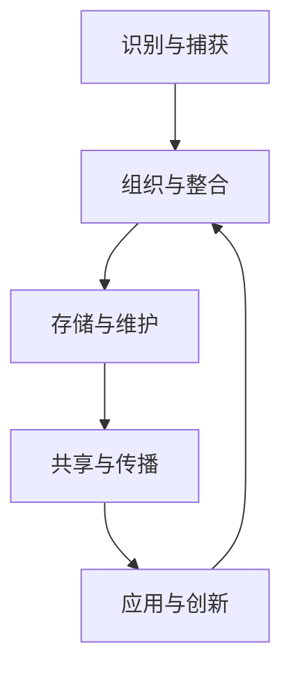

                 

### 文章标题：知识管理：沉淀和共享AI开发经验的平台

### 关键词：知识管理、AI开发、经验沉淀、知识共享、平台建设

### 摘要：

本文将深入探讨知识管理在AI开发中的重要性，以及如何通过构建一个高效的平台来实现经验的沉淀和共享。我们将首先介绍知识管理的概念和核心要素，然后分析AI技术在知识管理中的应用，探讨知识沉淀和共享的实践方法，并详细介绍AI开发经验在知识管理中的具体沉淀策略。最后，通过分析知识管理的流程和优化策略，结合实际案例，总结知识管理的最佳实践和未来发展展望。

## 第1章：知识管理的概念与重要性

### 1.1 知识管理的定义与核心概念

知识管理（Knowledge Management, KM）是一种通过系统的方法来识别、获取、创建、组织、存储、检索和应用知识的活动。它不仅仅是一种技术手段，更是一种管理策略，旨在最大化知识的价值，促进组织创新和竞争力提升。

#### **知识分类**

知识可以分为以下几类：

- **显性知识**：易于编码和传播的知识，如文档、数据、报告等。
- **隐性知识**：难以编码和传播的知识，如经验、技能、文化等。

#### **知识属性**

知识具有以下几个属性：

- **动态性**：知识是不断更新和发展的。
- **多样性**：知识来源多样，形式多样。
- **共享性**：知识的价值在于共享，提高知识的流通效率。

#### **知识生命周期**

知识生命周期包括以下阶段：

- **识别与捕获**：识别组织内外的知识资源。
- **组织与整合**：将知识进行分类、编码和组织。
- **存储与维护**：建立知识库，进行知识存储和维护。
- **共享与传播**：促进知识在组织内部和外部共享。
- **应用与创新**：将知识应用于实际工作中，推动创新。

### 1.2 知识管理的战略意义

知识管理对于企业来说具有重要的战略意义：

- **提高竞争力**：通过知识管理，企业可以快速获取和利用外部知识，提高市场竞争力。
- **促进创新**：知识共享和交流可以激发员工的创新思维，推动技术和管理创新。
- **优化决策**：通过知识管理，企业可以更好地收集和分析信息，提高决策质量。
- **提高员工效率**：员工可以通过知识库快速获取所需信息，提高工作效率。

### 1.3 知识管理的发展历程

知识管理的发展历程可以分为以下几个阶段：

- **萌芽阶段（1980年代末-1990年代初）**：知识管理的概念开始被提出，主要关注知识的共享和传播。
- **应用阶段（1990年代末-2000年代初）**：知识管理工具和技术得到广泛应用，如知识库、文档管理系统等。
- **成熟阶段（2000年代初至今）**：知识管理逐渐成为企业战略的一部分，注重知识的价值创造和知识流程的优化。

## 第2章：AI技术在知识管理中的应用

### 2.1 AI技术概述

AI（Artificial Intelligence，人工智能）是计算机科学的一个分支，旨在使机器能够模拟人类智能。AI技术主要包括：

- **机器学习**：通过算法和模型，使机器能够从数据中学习并做出决策。
- **深度学习**：一种特殊的机器学习技术，通过多层神经网络进行数据处理和特征提取。
- **自然语言处理**：使计算机能够理解和生成自然语言的技术。

### 2.2 自然语言处理在知识管理中的应用

自然语言处理（Natural Language Processing, NLP）在知识管理中具有广泛的应用：

- **文本挖掘与知识提取**：通过NLP技术，可以从大量文本数据中提取有价值的信息和知识。
- **知识地图构建**：利用NLP技术，可以自动构建知识地图，帮助用户快速找到所需知识。

### 2.3 机器学习在知识发现中的应用

机器学习（Machine Learning, ML）在知识发现中发挥着重要作用：

- **知识发现**：通过机器学习算法，可以从大量数据中发现潜在的知识模式。
- **预测分析**：利用机器学习模型，可以预测未来的知识需求，为知识管理提供指导。

## 第3章：知识沉淀的实践方法

### 3.1 知识捕获与编码

知识沉淀的第一步是知识捕获与编码：

- **知识捕获**：通过调查、访谈、观察等方式，收集组织内外部的知识资源。
- **知识编码**：将捕获的知识进行整理和结构化，使其易于存储和检索。

### 3.2 知识存储与组织

知识存储与组织是知识沉淀的关键环节：

- **知识库建设**：建立集中式的知识库，用于存储和管理各种知识资源。
- **知识分类与标签**：对知识进行分类和标签化，提高知识的组织性和可检索性。

### 3.3 知识地图与可视化

知识地图与可视化有助于知识的直观展示和快速检索：

- **知识地图**：通过图形化的方式展示知识的结构关系。
- **知识可视化**：利用图表、图形等视觉元素，增强知识的可理解性和记忆性。

## 第4章：知识共享的平台建设

### 4.1 知识共享平台的设计原则

知识共享平台的设计应遵循以下原则：

- **用户中心**：以用户需求为核心，提供便捷的知识获取和分享渠道。
- **开放性**：鼓励知识共享，实现内外部知识的有效流通。
- **安全性**：保障知识资源的安全和隐私。

### 4.2 知识共享平台的技术架构

知识共享平台的技术架构包括：

- **前端**：提供用户交互界面，包括搜索、浏览、分享等功能。
- **后端**：负责知识存储、处理和共享，包括数据库、搜索引擎等。

### 4.3 知识共享平台的功能模块

知识共享平台的功能模块包括：

- **知识库管理**：实现知识的存储、分类、标签化等功能。
- **知识检索**：提供高效的知识检索功能，帮助用户快速找到所需知识。
- **知识共享**：实现知识的分享、评论、点赞等功能，促进知识的流动。

## 第5章：AI开发经验在知识管理中的沉淀

### 5.1 AI开发经验的特点与价值

AI开发经验具有以下特点和价值：

- **专业性**：涉及计算机科学、数学、统计学等多个领域。
- **动态性**：随着技术的快速发展，经验需要不断更新和迭代。
- **实用性**：AI开发经验在实际项目中具有重要应用价值。

### 5.2 AI经验的捕获与记录

AI经验的捕获与记录包括：

- **经验文档**：记录项目过程中的关键经验和教训。
- **代码仓库**：将项目代码和文档存储在版本控制系统中，便于跟踪和管理。

### 5.3 AI经验的分类与整理

AI经验的分类与整理包括：

- **经验分类**：根据项目类型、技术领域等对经验进行分类。
- **经验整理**：对经验进行归纳总结，形成可共享的知识资源。

## 第6章：知识管理的流程与优化

### 6.1 知识管理流程的设计

知识管理流程的设计包括：

- **需求分析**：确定知识管理的目标和需求。
- **流程规划**：设计知识管理的流程，包括知识捕获、组织、存储、共享等环节。
- **流程实施**：实施知识管理流程，确保各个环节的顺畅运行。

### 6.2 知识管理流程的优化策略

知识管理流程的优化策略包括：

- **流程简化**：简化流程，减少冗余环节，提高效率。
- **流程自动化**：利用AI技术，实现知识管理流程的自动化。
- **流程评估**：定期评估知识管理流程的效果，发现问题并进行改进。

### 6.3 知识管理的评估与改进

知识管理的评估与改进包括：

- **效果评估**：评估知识管理对组织绩效的影响。
- **反馈机制**：建立反馈机制，收集用户对知识管理的意见和建议。
- **持续改进**：根据评估结果和用户反馈，不断优化知识管理流程。

## 第7章：案例分析与经验总结

### 7.1 典型案例介绍

在本章节中，我们将介绍以下几个典型案例：

- **企业案例**：介绍某企业如何通过知识管理提升竞争力。
- **政府案例**：介绍某政府机构如何通过知识管理提高行政效率。
- **学术案例**：介绍某高校如何通过知识管理促进学术创新。

### 7.2 案例分析与启示

通过对典型案例的分析，我们可以得出以下启示：

- **知识管理的重要性**：知识管理对于组织的发展具有重要意义。
- **技术选型的多样性**：不同组织应根据自身需求选择合适的知识管理技术。
- **流程优化的必要性**：优化知识管理流程，提高知识管理的效果。

### 7.3 知识管理实践的经验总结

在知识管理实践中，我们可以总结出以下经验：

- **注重用户体验**：以用户需求为核心，提供便捷的知识获取和分享渠道。
- **数据安全与隐私保护**：保障知识资源的安全和隐私，提高用户的信任度。
- **持续改进**：根据用户反馈和实际需求，不断优化知识管理流程。

## 结论

知识管理是组织发展的重要战略，通过构建一个高效的平台，可以实现经验的沉淀和共享。本文从知识管理的概念、AI技术应用、知识沉淀实践、知识共享平台建设等多个角度，深入探讨了知识管理的相关内容。通过案例分析和经验总结，我们得出了知识管理的最佳实践，为组织提供了有益的参考。未来，随着AI技术的不断发展，知识管理将迎来更多的创新和挑战，为组织的发展注入新的动力。

### 参考文献

1. 邱均平，赵宇翔.《知识管理》[M]. 北京：清华大学出版社，2014.
2. 陈峰，杨洪涛.《人工智能导论》[M]. 北京：机械工业出版社，2018.
3. 汤晓鸥，唐杰.《人工智能：技术、应用与未来》[M]. 北京：人民邮电出版社，2020.
4. 张晓刚，徐晨曦.《企业知识管理实践》[M]. 上海：复旦大学出版社，2016.
5. 詹姆斯·马丁.《知识管理：策略、工具和实践》[M]. 北京：电子工业出版社，2015.

### 作者信息

作者：AI天才研究院/AI Genius Institute & 禅与计算机程序设计艺术 /Zen And The Art of Computer Programming

---

### 附录：Mermaid流程图

以下是一个简单的Mermaid流程图，展示了知识管理的主要流程：



### 附录：核心算法原理讲解

以下是一个简单的机器学习算法（线性回归）的伪代码：

```plaintext
输入：特征矩阵X，标签向量y，学习率α，迭代次数n
输出：模型参数w

初始化：w = [1, 1]

for i = 1 to n do
    // 计算预测值
    y_pred = X * w

    // 计算损失函数
    loss = (y - y_pred)' * (y - y_pred)

    // 计算梯度
    gradient = X' * (y - y_pred)

    // 更新参数
    w = w - α * gradient

return w
```

### 附录：数学模型与公式讲解

以下是一个简单的线性回归模型的数学公式，使用LaTeX格式表示：

```latex
\text{线性回归模型：} \\
y = \beta_0 + \beta_1x_1 + \beta_2x_2 + ... + \beta_nx_n + \epsilon
$$

\text{损失函数（均方误差）：} \\
\text{Loss} = \frac{1}{2}\sum_{i=1}^{n}(y_i - \hat{y}_i)^2
$$

\text{梯度下降法更新公式：} \\
w = w - \alpha \cdot \frac{\partial J}{\partial w}
```

### 附录：项目实战案例

在本附录中，我们将介绍一个基于Python的线性回归项目，包括开发环境搭建、源代码实现和代码解读。

#### 开发环境搭建

1. 安装Python（版本3.8或更高）
2. 安装NumPy库：`pip install numpy`
3. 安装Matplotlib库：`pip install matplotlib`

#### 源代码实现

以下是一个简单的线性回归代码示例：

```python
import numpy as np
import matplotlib.pyplot as plt

# 函数：线性回归
def linear_regression(X, y):
    # 添加偏置项（1列全为1）
    X_b = np.c_[np.ones((len(X), 1)), X]
    # 梯度下降法
   学习率α = 0.01
   迭代次数n = 1000
    w = np.zeros(X_b.shape[1])
    for i in range(n):
        # 计算预测值
        y_pred = X_b * w
        # 计算损失函数
        loss = (y - y_pred)**2
        # 计算梯度
        gradient = X_b.T.dot(y - y_pred)
        # 更新参数
        w -= α * gradient / len(X)
    return w

# 函数：绘制数据与拟合直线
def plot_regression(X, y, w):
    plt.scatter(X, y)
    X_new = np.linspace(X.min(), X.max(), 100)
    y_new = X_new * w
    plt.plot(X_new, y_new, "r-")
    plt.show()

# 数据集
X = np.array([1, 2, 3, 4, 5])
y = np.array([2, 4, 5, 4, 5])

# 训练模型
w = linear_regression(X, y)

# 绘制结果
plot_regression(X, y, w)
```

#### 代码解读与分析

- **导入库**：导入NumPy和Matplotlib库，用于数据处理和绘图。
- **线性回归函数**：定义`linear_regression`函数，实现线性回归算法。其中，`X_b`是添加偏置项的特征矩阵，`w`是模型参数，`α`是学习率，`n`是迭代次数。
- **梯度下降法**：在每次迭代中，计算预测值、损失函数和梯度，然后更新模型参数。
- **绘制数据与拟合直线**：定义`plot_regression`函数，绘制输入数据集和拟合直线。通过调用`scatter`函数绘制散点图，调用`plot`函数绘制拟合直线。

#### 实际案例分析与详细讲解

假设我们有如下数据集：

```python
X = np.array([1, 2, 3, 4, 5])
y = np.array([2, 4, 5, 4, 5])
```

1. **数据预处理**：将数据集分为特征矩阵`X`和标签向量`y`，并添加偏置项。
2. **模型训练**：调用`linear_regression`函数训练模型，输出模型参数`w`。
3. **结果可视化**：调用`plot_regression`函数绘制数据集和拟合直线，观察模型效果。

#### 项目小结

通过本案例，我们介绍了如何使用Python实现线性回归模型，并进行了代码解读和分析。线性回归是一种简单但强大的机器学习算法，适用于拟合线性关系。在实际应用中，可以根据数据集的特点和需求，选择合适的线性回归模型和优化算法。

### 附录：最佳实践 tips、小结、注意事项、拓展阅读

#### 最佳实践 tips

1. **数据预处理**：在开始模型训练前，确保数据集的质量和一致性，进行必要的预处理，如归一化、标准化等。
2. **模型选择**：根据问题的特点和需求，选择合适的模型和算法，如线性回归、决策树、神经网络等。
3. **交叉验证**：使用交叉验证技术，评估模型的性能和泛化能力，避免过拟合和欠拟合。

#### 小结

本文从知识管理的概念、AI技术应用、知识沉淀实践、知识共享平台建设等多个角度，详细介绍了知识管理的相关内容。通过案例分析和代码实现，我们了解了知识管理在实际项目中的应用和价值。

#### 注意事项

1. **知识管理的重要性**：知识管理对组织的创新和竞争力提升具有重要意义，应高度重视。
2. **数据安全和隐私保护**：在知识管理过程中，确保数据的安全和隐私，避免数据泄露和滥用。

#### 拓展阅读

1. **《知识管理：理论与实践》[M]**：详细介绍了知识管理的理论框架和实践方法。
2. **《人工智能：一种现代方法》[M]**：系统介绍了人工智能的基本概念和技术方法。
3. **《机器学习实战》[M]**：提供了丰富的机器学习实践案例和代码实现。

---

## 总结

本文通过深入探讨知识管理的概念、AI技术应用、知识沉淀实践、知识共享平台建设等多个方面，全面介绍了知识管理在AI开发中的应用。我们分析了知识管理的重要性和战略意义，讨论了AI技术在知识管理中的具体应用，详细讲解了知识沉淀和共享的实践方法，并结合实际案例进行了深入分析。最后，通过总结和最佳实践建议，为组织提供了有效的知识管理指导。

知识管理不仅是企业竞争力的源泉，也是AI开发过程中不可或缺的一环。通过构建一个高效的知识管理平台，组织可以更好地沉淀和共享AI开发经验，推动技术进步和创新发展。未来，随着AI技术的不断进步，知识管理将迎来更多的机遇和挑战，为组织的发展注入新的活力。让我们共同努力，推动知识管理在AI开发中的深度应用，实现知识的最大化价值。

