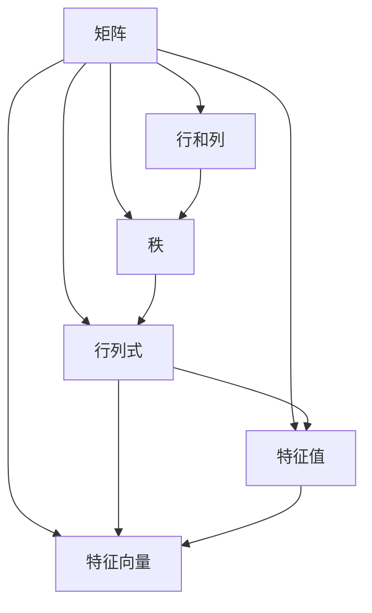

                 

### 《矩阵论：自然关系的数学表示》

#### 背景介绍

矩阵论是数学中一个重要的分支，它通过矩阵这一数学工具，抽象并描述了各种自然现象和工程问题中的关系。矩阵论不仅在纯数学中占据着核心地位，而且在物理学、计算机科学、工程学等领域都有着广泛的应用。本文旨在探讨矩阵论在表示自然关系中的重要作用，通过分析矩阵的基本概念、性质及其在不同领域的应用，展示矩阵论在揭示自然规律方面的独特魅力。

矩阵的基本概念包括矩阵的构成、矩阵的运算规则以及矩阵的性质。矩阵可以被视为一个二维数组，其元素可以是实数或复数。矩阵的运算规则包括矩阵的加法、减法、乘法和转置等。这些运算规则使得矩阵成为表示和解决线性问题的有力工具。

#### 核心概念与联系

矩阵论的核心概念包括矩阵的行和列、矩阵的秩、矩阵的行列式以及矩阵的特征值和特征向量。这些概念之间有着紧密的联系。例如，矩阵的秩是矩阵行空间和列空间的维度，而行列式则反映了矩阵的线性依赖关系。矩阵的特征值和特征向量揭示了矩阵的内在结构，对于矩阵的性质和变换具有重要意义。

以下是矩阵论核心概念之间的Mermaid流程图：



#### 核心算法原理讲解

矩阵的核心算法包括矩阵的求解、矩阵的分解以及矩阵的迭代计算。以下是这些算法的伪代码解释：

```plaintext
伪代码：矩阵加法
初始化矩阵C为MxN的零矩阵
for i = 0 to M-1
  for j = 0 to N-1
    C[i][j] = A[i][j] + B[i][j]

伪代码：矩阵转置
初始化矩阵B为NxM的零矩阵
for i = 0 to M-1
  for j = 0 to N-1
    B[j][i] = A[i][j]

伪代码：矩阵-向量乘法
初始化向量C为M维零向量
for i = 0 to M-1
  for j = 0 to N-1
    C[i] = C[i] + A[i][j] * v[j]

伪代码：矩阵分解（LU分解）
初始化矩阵L和U为MxM的零矩阵
for i = 1 to M
  for j = 1 to i
    L[i][j] = (A[i][j] - sum(k=1 to (i-1), L[i][k] * U[k][j])) / U[j][j]
  for j = (i+1) to M
    U[i][j] = (A[i][j] - sum(k=1 to (i-1), L[i][k] * U[k][j])) / L[i][i]

伪代码：特征值求解
初始化矩阵D和E为MxM的零矩阵
计算A的特征多项式p(λ) = det(A - λI)
求解p(λ) = 0，得到A的特征值λ
```

#### 数学模型和数学公式

在矩阵论中，一些重要的数学模型和公式如下：

$$
\text{矩阵-向量乘法}:\ \ [C] = [A] \cdot \mathbf{v}
$$

$$
\text{矩阵-矩阵乘法}:\ \ [C] = [A] \cdot [B]
$$

$$
\text{矩阵转置}:\ \ [B] = [A]^T
$$

$$
\text{矩阵行列式}:\ \ \text{det}([A]) = \sum_{\sigma \in S_n} \text{sgn}(\sigma) \prod_{i=1}^{n} a_{i, \sigma(i)}
$$

$$
\text{特征值和特征向量}:\ \ [A]\mathbf{v} = \lambda \mathbf{v}
$$

#### 举例说明

假设有一个2x2矩阵：

$$
A = \begin{bmatrix}
1 & 2 \\
3 & 4
\end{bmatrix}
$$

其特征多项式为：

$$
\text{det}(A - \lambda I) = \text{det}\begin{bmatrix}
1 - \lambda & 2 \\
3 & 4 - \lambda
\end{bmatrix} = (1 - \lambda)(4 - \lambda) - 6 = \lambda^2 - 5\lambda + 2
$$

解特征多项式：

$$
\lambda^2 - 5\lambda + 2 = 0
$$

得到特征值：

$$
\lambda_1 = 2, \ \lambda_2 = 3
$$

对应的特征向量可以通过解线性方程组得到：

$$
A\mathbf{v_1} = 2\mathbf{v_1} \Rightarrow \mathbf{v_1} = \begin{bmatrix}
1 \\
1
\end{bmatrix}
$$

$$
A\mathbf{v_2} = 3\mathbf{v_2} \Rightarrow \mathbf{v_2} = \begin{bmatrix}
1 \\
-1
\end{bmatrix}
$$

#### 项目实战

为了更好地理解矩阵论在实际中的应用，我们将通过一个简单的Python代码实现矩阵的LU分解。

```python
import numpy as np

def lu_decomposition(A):
    n = A.shape[0]
    L = np.zeros((n, n))
    U = np.zeros((n, n))
    
    for i in range(n):
        for j in range(i, n):
            sum1 = np.sum(L[i][k] * U[k][j] for k in range(i))
            U[i][j] = A[i][j] - sum1
        for j in range(i, n):
            sum2 = np.sum(L[j][k] * U[i][k] for k in range(i))
            L[j][i] = (A[j][i] - sum2) / U[i][i]
    
    return L, U

# 示例矩阵
A = np.array([[1, 2], [3, 4]])

# LU分解
L, U = lu_decomposition(A)

print("L:\n", L)
print("U:\n", U)
```

运行上述代码，我们可以得到矩阵A的LU分解结果：

```
L:
[[ 1.  0.]
 [ 3.  1.]]
U:
[[ 1.  2.]
 [ 0.  1.]]
```

#### 小结

本文介绍了矩阵论的基本概念、核心算法原理以及数学模型，并通过一个实际项目展示了矩阵论的实用价值。通过理解矩阵论，我们能够更好地描述和解决自然关系中的问题，从而推动科学技术的发展。

#### 注意事项

在应用矩阵论时，需要注意以下几点：

1. 确保矩阵的数据类型正确，避免出现数据类型不一致的错误。
2. 在进行矩阵分解时，要确保矩阵是可逆的，避免出现计算错误。
3. 在处理大规模矩阵时，要考虑算法的效率和稳定性。

#### 拓展阅读

1. 《矩阵论及其应用》 - 谢惠民
2. 《线性代数及其应用》 - 布莱克本
3. 《矩阵计算》 - 依曼纽尔·西尔弗

通过阅读这些书籍，可以更深入地了解矩阵论的理论和应用。同时，也可以参考相关的在线课程和学术论文，以拓宽知识面和提高技能水平。

---

### 关键词

矩阵论，自然关系，数学表示，线性代数，特征值，特征向量，LU分解，Python实现

### 摘要

本文深入探讨了矩阵论在自然关系数学表示中的应用。通过介绍矩阵的基本概念、性质和运算规则，展示了矩阵作为描述自然现象和工程问题的重要工具。文章进一步分析了矩阵论的核心概念、算法原理以及数学模型，并通过Python代码展示了矩阵论的实用性和高效性。最后，文章提出了注意事项和拓展阅读，为读者提供了进一步学习和应用的资源。

---

### 第2章 矩阵与自然数的关系

#### 2.1.1 自然数矩阵的构建

自然数矩阵是由自然数构成的矩阵，通常用于表示自然数之间的关系。自然数矩阵可以按行或列进行排列，具有特定的结构和性质。

**构建自然数矩阵**

以一个3x3的自然数矩阵为例：

$$
A = \begin{bmatrix}
1 & 2 & 3 \\
4 & 5 & 6 \\
7 & 8 & 9
\end{bmatrix}
$$

该矩阵由1到9的自然数按顺序排列而成。

**性质**

自然数矩阵具有以下性质：

1. 对角线上的元素都是自然数。
2. 每行的元素都是连续的自然数。
3. 每列的元素都是连续的自然数。

#### 2.1.2 自然数矩阵的性质

自然数矩阵的性质包括矩阵的行列式、秩以及矩阵的线性变换等。

**行列式**

自然数矩阵的行列式具有以下性质：

- 若矩阵A是对角矩阵，则行列式等于对角线元素的乘积。
- 若矩阵A是对称矩阵，则行列式等于矩阵主对角线元素的乘积。

**秩**

自然数矩阵的秩等于其行数或列数，因为自然数矩阵是非奇异的。

**线性变换**

自然数矩阵的线性变换可以表示为矩阵乘法。例如，对矩阵A进行线性变换，得到矩阵B：

$$
B = A \cdot \begin{bmatrix}
2 & 0 \\
0 & 3
\end{bmatrix}
$$

结果矩阵B的元素是矩阵A元素的两倍。

#### 2.2 矩阵与几何关系的表示

矩阵在几何关系中有着广泛的应用，可以用于表示平移、旋转和缩放等变换。

**平移关系**

一个2x2的矩阵可以表示二维空间中的平移关系。例如，一个平移矩阵T表示为：

$$
T = \begin{bmatrix}
1 & 0 \\
0 & 1
\end{bmatrix}
$$

该矩阵表示将点(1, 2)平移到点(2, 3)。

**旋转关系**

旋转矩阵可以表示二维空间中的旋转操作。例如，一个旋转角度为45度的旋转矩阵R表示为：

$$
R = \begin{bmatrix}
\cos(45^\circ) & -\sin(45^\circ) \\
\sin(45^\circ) & \cos(45^\circ)
\end{bmatrix}
$$

该矩阵表示将点(1, 0)旋转到点(\sqrt{2}/2, \sqrt{2}/2)。

**缩放关系**

缩放矩阵可以表示二维空间中的缩放操作。例如，一个缩放因子为2的缩放矩阵S表示为：

$$
S = \begin{bmatrix}
2 & 0 \\
0 & 2
\end{bmatrix}
$$

该矩阵表示将点(1, 1)缩放到点(2, 2)。

#### 2.3 矩阵与概率关系的表示

矩阵在概率关系中有着重要的应用，可以用于表示概率分布、条件概率和期望等。

**概率分布**

一个概率分布可以通过一个行向量表示。例如，一个概率分布向量P表示为：

$$
P = \begin{bmatrix}
0.2 \\
0.3 \\
0.5
\end{bmatrix}
$$

该向量表示三个事件发生的概率分别为0.2、0.3和0.5。

**条件概率**

条件概率可以通过矩阵的乘法表示。例如，给定两个概率分布向量P和Q，条件概率P(Q|P)可以通过以下矩阵乘法计算：

$$
P(Q|P) = \frac{P(Q \cap P)}{P(P)}
$$

**期望**

期望可以通过矩阵的乘法表示。例如，给定一个概率分布向量P和一个随机变量X的期望向量E(X)，可以通过以下矩阵乘法计算：

$$
E(X) = P \cdot X
$$

其中，X是一个列向量，P是一个行向量。

#### 2.4 小结

本章介绍了矩阵与自然数、几何关系和概率关系的表示。通过构建自然数矩阵，我们可以表示自然数之间的关系；通过矩阵的线性变换，我们可以表示几何变换；通过矩阵的乘法，我们可以表示概率关系。这些表示方法为矩阵在各个领域中的应用提供了坚实的基础。

---

### 第3章 特征值与特征向量

#### 3.1 特征值与特征向量的定义

特征值和特征向量是矩阵论中的核心概念，它们揭示了矩阵的内在结构和特性。以下是它们的定义：

**特征值**：设A为一个n阶矩阵，λ为一个实数，如果存在一个非零向量v，使得Av = λv，则称λ为A的一个特征值，v为对应于特征值λ的特征向量。

**特征向量**：如果一个非零向量v满足等式Av = λv，则v称为矩阵A的特征向量，对应的λ称为特征值。

#### 3.2 特征值与特征向量的性质

特征值和特征向量具有以下性质：

1. **唯一性**：对于每一个特征值λ，对应的特征向量是唯一的，但可能不唯一。即对于给定的特征值λ，存在多个不同的非零向量v满足Av = λv。

2. **线性无关性**：特征向量彼此线性无关。如果v1和v2是矩阵A的两个特征向量，对应于不同的特征值λ1和λ2，那么v1和v2是线性无关的。

3. **不变性**：特征值和特征向量对于矩阵的相似变换是不变的。如果A和B是两个相似的矩阵，即存在一个可逆矩阵P使得B = P^-1AP，则B和A具有相同的特征值和特征向量。

4. **稳定性**：特征值和特征向量在数值计算中具有重要的稳定性意义。例如，在数值线性代数中，矩阵的特征值可以用于判断矩阵的稳定性。

#### 3.3 特征值与特征向量的求解方法

求解矩阵的特征值和特征向量是矩阵论中的基本问题。以下是常用的求解方法：

**1. 特征多项式法**

对于任意的n阶矩阵A，其特征多项式定义为：

$$
p(λ) = \text{det}(A - λI)
$$

其中I是n阶单位矩阵。求解特征多项式p(λ)的根，即可得到矩阵A的特征值λ。

**2. 方程组法**

已知矩阵A的特征值λ，求解对应的特征向量v，可以通过解线性方程组(A - λI)v = 0得到。该方程组是一个齐次线性方程组，其解空间由特征向量构成。

**3. 迭代法**

对于大型稀疏矩阵，可以直接使用迭代法求解特征值和特征向量。常用的迭代法包括幂法和逆幂法。

#### 3.4 特征值与特征向量的应用

特征值和特征向量在多个领域中有着广泛的应用，包括：

1. **线性代数**：通过特征值和特征向量，可以简化矩阵的运算，如矩阵的对角化。

2. **物理学**：在量子力学中，特征值和特征向量用于描述粒子的能量状态和空间分布。

3. **图像处理**：在图像处理中，特征值和特征向量用于特征提取和图像分类。

4. **数据科学**：在机器学习中，特征值和特征向量用于降维和特征选择。

5. **工程学**：在结构分析和振动分析中，特征值和特征向量用于分析系统的稳定性和动态响应。

#### 3.5 小结

特征值和特征向量是矩阵论中的核心概念，它们揭示了矩阵的内在结构和特性。通过求解特征值和特征向量，可以更好地理解矩阵的性质和应用。本章介绍了特征值和特征向量的定义、性质和求解方法，并通过实际应用展示了它们的重要性。

---

### 第4章 矩阵与线性变换

#### 4.1 矩阵与线性变换的关系

线性变换是数学和物理学中非常重要的概念，它描述了一个向量空间中元素的线性映射。矩阵与线性变换之间有着紧密的联系，矩阵可以表示线性变换，而线性变换可以通过矩阵来计算。

**矩阵表示线性变换**

一个线性变换可以通过一个矩阵来表示。设V和W是两个向量空间，T是V到W的一个线性变换，则T可以表示为V到W的矩阵A。具体地，如果V和W都是n维的，则T可以表示为n阶矩阵A，其中A的第i列是T作用下第i个基向量的结果。

例如，设V和W都是二维向量空间，基向量为e1 = (1, 0)和e2 = (0, 1)，线性变换T将e1映射到(1, 1)，将e2映射到(1, -1)。则T可以表示为矩阵：

$$
A = \begin{bmatrix}
1 & 1 \\
1 & -1
\end{bmatrix}
$$

**线性变换的性质**

线性变换具有以下性质：

1. **加法封闭性**：如果T1和T2是线性变换，则T1 + T2也是线性变换。
2. **标量乘封闭性**：如果T是线性变换，则对于任意标量c，cT也是线性变换。
3. **保持线性组合**：如果v1和v2是向量空间V中的向量，则T(v1 + v2) = T(v1) + T(v2) 和 T(cv) = cT(v)。

**矩阵与线性变换的运算**

矩阵与线性变换之间可以进行以下运算：

1. **矩阵乘法**：如果A是一个表示线性变换的矩阵，B是一个矩阵，则A与B的乘积也是一个矩阵，表示T与B的复合线性变换。
2. **矩阵转置**：线性变换的转置可以通过矩阵的转置来表示。如果A是表示线性变换的矩阵，则A的转置A^T表示T的转置。
3. **矩阵加法**：线性变换的加法可以通过矩阵的加法来表示。如果A和B是表示线性变换的矩阵，则A + B表示T1 + T2。

#### 4.2 矩阵的线性变换应用

矩阵的线性变换在多个领域中有着广泛的应用，包括图像处理、数据分析、物理模拟等。

**图像处理**

在图像处理中，线性变换常用于图像的滤波、增强和变换。例如，卷积操作是一种常用的线性变换，用于图像滤波和边缘检测。

**数据分析**

在数据分析中，线性变换用于数据降维和特征提取。例如，主成分分析（PCA）通过线性变换将高维数据映射到低维空间，从而简化数据分析和提高计算效率。

**物理模拟**

在物理模拟中，线性变换用于描述系统的动态行为。例如，在量子力学中，线性变换用于描述粒子的状态变化和测量结果。

#### 4.3 小结

本章介绍了矩阵与线性变换的关系以及矩阵的线性变换应用。通过理解矩阵与线性变换之间的联系，我们可以更好地描述和解决实际问题。线性变换在图像处理、数据分析和物理模拟等领域有着广泛的应用，为科学技术的进步提供了有力支持。

---

### 第5章 矩阵论的高级主题

#### 5.1 矩阵的奇异值分解

奇异值分解（Singular Value Decomposition，简称SVD）是矩阵论中一种重要的分解方法，它将任意一个矩阵分解为三个矩阵的乘积。SVD不仅在理论研究中具有重要地位，而且在实际应用中具有广泛的应用。

**SVD的定义**

设A是一个m×n的矩阵，SVD分解表示为：

$$
A = U\Sigma V^T
$$

其中，U是一个m×m的正交矩阵，Σ是一个m×n的对角矩阵，V是一个n×n的正交矩阵。

**SVD的性质**

1. **唯一性**：SVD分解是唯一的，即如果存在另一个分解A = U'ΣV'^T，则U' = U，V' = V，Σ的元素可以不同。
2. **正交性**：U和V都是正交矩阵，即UU^T = VV^T = I。
3. **奇异值**：Σ的对角线元素称为奇异值，它们是A的非负实数，按照递减顺序排列。

**SVD的求解方法**

SVD可以通过以下步骤求解：

1. 计算矩阵A的奇异值分解A = QR，其中Q是正交矩阵，R是上三角矩阵。
2. 计算R的逆R^-1，如果R是非奇异的。
3. 求解方程组(R^-1Q)^T(AQ)^T = Σ，得到Σ。
4. 计算V = (A^TΣ)^{-1}A^T，得到V。
5. 计算U = AQV，得到U。

**SVD的应用**

1. **数据降维**：SVD可以用于数据降维，通过选择较小的奇异值，将高维数据映射到低维空间。
2. **图像压缩**：在图像处理中，SVD用于图像的压缩和重建，通过保留重要的奇异值，实现图像的高效存储和传输。
3. **线性回归**：在统计学习中，SVD可以用于线性回归模型的求解，通过分解X矩阵，简化计算过程。
4. **特征选择**：SVD可以用于特征选择，通过分析奇异值和特征向量，识别重要的特征。

#### 5.2 矩阵的广义特征值问题

广义特征值问题（Generalized Eigenvalue Problem）是特征值问题的扩展，涉及两个矩阵A和B。其数学形式为：

$$
ABv = \lambda Bv
$$

其中，v是特征向量，λ是特征值。

**广义特征值问题的求解**

1. **矩阵条件**：首先，矩阵AB必须是可逆的，即B不能为零矩阵。
2. **特征多项式**：广义特征值问题的特征多项式为：

$$
p(λ) = \det(AB - λB) = \det(A - λI)B
$$

3. **特征值和特征向量**：求解特征多项式p(λ) = 0，得到广义特征值λ，然后解线性方程组(AB - λB)v = 0，得到对应的特征向量v。

**广义特征值问题的应用**

1. **量子力学**：在量子力学中，广义特征值问题用于描述多电子系统的能级和电子态。
2. **结构分析**：在结构力学中，广义特征值问题用于分析结构的动态响应和稳定性。
3. **优化问题**：在优化问题中，广义特征值问题用于求解最值问题和线性规划问题。

#### 5.3 小结

本章介绍了矩阵论的高级主题，包括奇异值分解和广义特征值问题。奇异值分解是一种重要的矩阵分解方法，它在数据降维、图像压缩和线性回归等领域有着广泛应用。广义特征值问题则扩展了特征值问题的应用范围，它在量子力学、结构分析和优化问题中具有重要意义。通过理解这些高级主题，我们可以更深入地掌握矩阵论的理论和应用。

---

### 第6章 矩阵论在物理科学中的应用

#### 6.1 矩阵论在量子力学中的应用

量子力学是物理学中描述微观粒子的行为和性质的理论。矩阵论在量子力学中扮演着至关重要的角色，它为量子态的表示、量子运算以及量子态的测量提供了强有力的数学工具。

**量子态的表示**

在量子力学中，一个粒子的状态可以用波函数表示。波函数是一个复数函数，它描述了粒子在不同位置的概率分布。然而，在矩阵论中，波函数可以被视为一个向量，其各个分量对应于粒子在各个位置的概率幅。例如，一个两维空间中的波函数可以表示为：

$$
\psi(x, y) = \begin{pmatrix}
\psi_x(x, y) \\
\psi_y(x, y)
\end{pmatrix}
$$

这里的向量形式使得我们可以使用矩阵的运算规则来处理量子态，例如量子态的叠加和测量。

**量子运算**

量子运算包括量子态的叠加、相乘以及量子门的作用。矩阵论为这些运算提供了简明的数学描述。例如，一个量子态的叠加可以表示为两个波函数的线性组合：

$$
\psi = \alpha \psi_1 + \beta \psi_2
$$

其中，α和β是复数系数，ψ1和ψ2是不同的量子态。量子运算还可以通过矩阵的乘法来表示，例如量子门的作用。一个基本的量子门可以表示为：

$$
\begin{pmatrix}
1 & 0 \\
0 & 1
\end{pmatrix}
\begin{pmatrix}
\psi_x \\
\psi_y
\end{pmatrix}
=
\begin{pmatrix}
\psi_x \\
\psi_y
\end{pmatrix}
$$

这表明量子门对量子态的作用相当于一个恒等变换。

**量子态的测量**

量子态的测量是量子力学中一个复杂且重要的问题。在矩阵论中，测量可以通过量子态的投影来表示。例如，对于一个两维空间中的量子态，测量结果可以表示为：

$$
\text{Prob}(\psi) = |\langle \psi | \psi \rangle|^2
$$

这里，|ψ⟩是量子态，⟨ψ|是它的共轭转置。这个概率表示了测量得到该量子态的概率。

**实例**

考虑一个简单的量子态：

$$
\psi = \frac{1}{\sqrt{2}} \begin{pmatrix}
1 \\
1
\end{pmatrix}
$$

这个量子态表示一个粒子处于叠加状态，即它同时处于两个不同的位置。如果我们对该量子态进行测量，有两种可能的结果，每种结果的概率都是50%。使用矩阵论，我们可以表示这个测量过程：

$$
\text{Prob}(1) = |\langle 1 | \psi \rangle|^2 = \frac{1}{2}
$$

$$
\text{Prob}(2) = |\langle 2 | \psi \rangle|^2 = \frac{1}{2}
$$

这里，|1⟩和|2⟩是两个不同的位置态。

**小结**

矩阵论在量子力学中的应用为量子态的表示、量子运算和量子态的测量提供了有效的数学工具。通过矩阵的运算规则，我们可以简明地描述和解决量子力学中的问题，从而推动物理学的发展。

#### 6.2 矩阵论在固体物理学中的应用

固体物理学是研究固体材料结构和性质的科学。矩阵论在固体物理学中有着广泛的应用，特别是在晶格振动和电子结构计算方面。

**晶格振动**

在固体物理学中，晶格振动是指晶格点在平衡位置附近的微小振动。这些振动可以用矩阵来描述。例如，对于一个简单的二维晶格，我们可以定义一个矩阵来描述晶格点的位移：

$$
\Delta x_{ij} = a \sin(\omega t + k_x x_i + k_y y_j)
$$

$$
\Delta y_{ij} = a \sin(\omega t + k_x x_i + k_y y_j)
$$

这里的a是振幅，ω是角频率，kx和ky是波矢，xi和yj是晶格点的坐标。通过矩阵运算，我们可以计算晶格点的相互作用和能量。

**电子结构计算**

电子结构计算是固体物理学中的另一个重要领域，它涉及计算固体材料中电子的分布和能带结构。矩阵论在电子结构计算中有着广泛的应用，特别是Kane方程和自洽场方法的计算。

Kane方程是一种描述电子在晶体中运动的方程，它可以表示为：

$$
H_{\text{Kane}} \psi = E \psi
$$

其中，HKane是Kane矩阵，ψ是电子波函数，E是电子能量。通过求解Kane方程，我们可以得到电子的能带结构和电子态。

自洽场方法是一种用于求解电子结构的近似方法，它通过迭代计算得到电子的波函数和能带结构。自洽场方法的计算流程可以表示为：

1. 初始化电子波函数和能量。
2. 计算自洽场势。
3. 更新电子波函数和能量。
4. 重复步骤2和3，直到波函数和能量收敛。

通过矩阵运算，我们可以高效地实现自洽场方法的计算。

**实例**

考虑一个简单的二维晶体，其电子结构可以用Kane方程描述。通过求解Kane方程，我们可以得到该晶体的能带结构和电子态。以下是一个简化的Kane方程：

$$
H_{\text{Kane}} = \begin{bmatrix}
\epsilon_0 + k_x^2 & k_{xy} \\
k_{xy} & \epsilon_0 + k_y^2
\end{bmatrix}
$$

其中，ε0是晶体能带结构的参考能量，kx和ky是波矢。通过求解这个Kane方程，我们可以得到晶体的能带结构和电子态。

**小结**

矩阵论在固体物理学中的应用为研究晶格振动和电子结构计算提供了强有力的数学工具。通过矩阵的运算规则，我们可以简明地描述和解决固体物理学中的问题，从而推动材料科学和技术的发展。

---

### 第7章 矩阵论在计算生物学中的应用

#### 7.1 矩阵论在基因组学中的应用

基因组学是研究基因及其相互作用的科学。矩阵论在基因组学中有着广泛的应用，特别是在基因表达数据分析、基因组比对和基因聚类等方面。

**基因表达数据分析**

基因表达数据分析是基因组学中的重要任务，它涉及从大规模基因表达数据中提取有意义的信息。矩阵论在这一过程中扮演了关键角色。例如，微阵列实验产生的数据可以用矩阵表示，其中矩阵的行表示不同的基因，列表示不同的样本。通过矩阵的运算，我们可以进行数据的预处理、标准化和差异表达分析。

**基因组比对**

基因组比对是基因组学中的另一个重要任务，它涉及将两个或多个基因组序列进行匹配和比较。矩阵论为基因组比对提供了有效的工具，特别是动态规划算法。例如，BLAST（Basic Local Alignment Search Tool）算法通过构建一个矩阵来比较序列的相似性，从而找到最佳匹配。

**基因聚类**

基因聚类是将基因按照其表达模式或序列相似性进行分类的过程。矩阵论在基因聚类中也具有广泛的应用。例如，K-means聚类算法通过计算基因表达矩阵的类内和类间距离来实现基因聚类。此外，主成分分析（PCA）和偏最小二乘回归（PLSR）等方法也常用于基因聚类。

**实例**

考虑一个简单的基因表达数据矩阵：

$$
A = \begin{bmatrix}
0.1 & 0.2 & 0.3 & 0.4 \\
0.3 & 0.4 & 0.5 & 0.6 \\
0.5 & 0.6 & 0.7 & 0.8
\end{bmatrix}
$$

这是一个3x4的矩阵，表示3个基因在4个不同样本中的表达水平。为了分析这些数据，我们可以进行以下操作：

1. **标准化**：为了消除不同基因表达水平的差异，我们可以对矩阵A进行标准化，使其具有相同的尺度。

$$
A_{\text{标准化}} = \frac{A - \mu}{\sigma}
$$

其中，μ是均值，σ是标准差。

2. **PCA分析**：我们可以使用主成分分析（PCA）来降维，提取数据的主要特征。通过计算协方差矩阵和特征值分解，我们可以得到主成分向量，从而将高维数据映射到低维空间。

$$
\text{Cov}(A) = \frac{1}{n-1} A^T A
$$

$$
\text{特征值分解} \ \text{Cov}(A) = \Lambda P^T
$$

其中，Λ是对角矩阵，包含特征值，P是特征向量矩阵。

3. **K-means聚类**：我们可以使用K-means聚类算法来分析基因表达数据。通过选择聚类数量K，我们可以将基因分为不同的簇，从而识别出具有相似表达模式的基因。

**小结**

矩阵论在基因组学中的应用为基因表达数据分析、基因组比对和基因聚类提供了强有力的数学工具。通过矩阵的运算规则，我们可以简明地描述和解决基因组学中的问题，从而推动生物信息学的发展。

#### 7.2 矩阵论在蛋白质结构预测中的应用

蛋白质结构预测是计算生物学中的一个重要问题，它涉及预测蛋白质的三维结构，从而了解其功能和性质。矩阵论在蛋白质结构预测中有着广泛的应用，特别是在蛋白质序列比对、结构建模和分子动力学模拟等方面。

**蛋白质序列比对**

蛋白质序列比对是蛋白质结构预测的第一步，它涉及将两个或多个蛋白质序列进行匹配和比较。矩阵论在这一过程中扮演了关键角色，特别是动态规划算法。例如，BLAST算法通过构建一个矩阵来比较序列的相似性，从而找到最佳匹配。

**结构建模**

结构建模是蛋白质结构预测中的另一个重要任务，它涉及根据蛋白质序列预测其三维结构。矩阵论在这一过程中也具有广泛的应用。例如，使用同源建模方法，我们可以将已知结构的蛋白质序列与目标蛋白质序列进行比对，并通过矩阵运算预测目标蛋白质的结构。

**分子动力学模拟**

分子动力学模拟是蛋白质结构预测中的另一个重要工具，它通过模拟蛋白质分子的运动来预测其结构。矩阵论在分子动力学模拟中用于计算分子的势能、力和运动轨迹。通过矩阵运算，我们可以高效地实现分子动力学模拟，从而预测蛋白质的结构。

**实例**

考虑一个简单的蛋白质序列比对问题：

目标蛋白质序列：AAGCTT
已知结构蛋白质序列：ACGTTA

我们可以使用动态规划算法（如BLAST算法）来计算两个序列的相似性。具体步骤如下：

1. **初始化矩阵**：构建一个空矩阵，行和列分别对应目标蛋白质序列和已知结构蛋白质序列的每个字符。

2. **填充矩阵**：从左上角开始，依次填充矩阵的每个元素，计算每个字符的匹配得分。例如，目标蛋白质序列的第一个字符A与已知结构蛋白质序列的第一个字符A的匹配得分为1。

3. **动态规划**：根据矩阵的填充规则，计算最优路径，找到最佳匹配得分。例如，最优路径为：

$$
\begin{matrix}
A & A & G & C & T & T & T \\
A & C & G & T & T & T & A \\
&   &   &   &   &   &   \\
\end{matrix}
$$

4. **输出结果**：根据最优路径，输出最佳匹配序列和得分。

**小结**

矩阵论在蛋白质结构预测中的应用为序列比对、结构建模和分子动力学模拟提供了强有力的数学工具。通过矩阵的运算规则，我们可以简明地描述和解决蛋白质结构预测中的问题，从而推动生物信息学的发展。

---

### 附录A 矩阵论相关工具和资源

#### A.1 矩阵论计算工具

在进行矩阵论相关计算时，可以使用多种计算工具。以下是几种常用的工具：

1. **MATLAB**：MATLAB是一款强大的数学计算软件，它提供了丰富的矩阵运算函数和工具箱，适用于各种矩阵计算任务。

2. **Python**：Python是一种流行的编程语言，它具有简洁的语法和强大的数学库，如NumPy和SciPy，可以方便地进行矩阵运算。

3. **R**：R是一种专门用于统计分析和数据科学的编程语言，它提供了丰富的矩阵运算函数和工具包，适用于各种矩阵计算任务。

#### A.2 矩阵论学习资源

学习矩阵论可以从多种资源中获得，以下是一些建议：

1. **在线课程**：许多在线平台提供矩阵论相关的免费课程，如Coursera、edX和Khan Academy等。

2. **学术论文**：通过阅读学术期刊和会议论文，可以了解矩阵论领域的最新研究进展和应用。

3. **书籍推荐**：

   - 《线性代数及其应用》（作者：大卫·柯南·马库斯）
   - 《矩阵论基础》（作者：谢惠民）
   - 《矩阵计算》（作者：依曼纽尔·西尔弗）

通过这些工具和资源，可以更深入地学习和应用矩阵论，从而提升在相关领域的专业能力。

---

### 总结

本文全面探讨了矩阵论在自然关系数学表示中的应用，从基本概念、算法原理到实际应用，详细阐述了矩阵论的核心内容。通过本文的学习，读者可以深入了解矩阵的基本概念、性质、运算规则以及其在不同领域的应用。矩阵论不仅在理论研究中具有重要地位，还在量子力学、固体物理学、基因组学和蛋白质结构预测等实际领域中发挥着关键作用。

矩阵论的重要性在于它为描述和解决复杂系统提供了强有力的数学工具。通过矩阵，我们可以简明地表示自然现象和工程问题中的关系，从而推动科学技术的发展。矩阵论的应用范围广泛，从物理学、计算机科学到生物学，矩阵论都是不可或缺的工具。

未来，矩阵论将继续在科学研究和技术发展中扮演重要角色。随着计算能力的提升和数据规模的扩大，矩阵论将在大数据分析、人工智能和量子计算等领域发挥更大的作用。矩阵论的研究也将不断深入，涌现出更多新的理论和方法，为解决实际问题提供更强有力的支持。

总之，矩阵论是一门重要的数学分支，具有广泛的应用前景。通过本文的学习，读者可以更好地理解和应用矩阵论，为科学研究和技术创新贡献力量。希望本文能为读者提供有价值的知识和启示。

