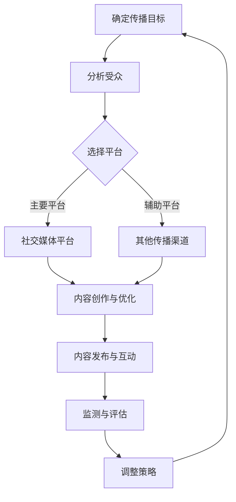

                 

### 《社交媒体时代的科学传播策略：让世界可理解性触手可及》

> 关键词：社交媒体、科学传播、策略、可理解性、传播算法、案例分析

> 摘要：本文深入探讨了社交媒体时代的科学传播现状与挑战，提出了构建科学传播策略的方法与工具，并通过国内外案例分析，揭示了成功的关键因素和未来趋势。文章旨在为科学传播者提供有价值的参考，以提升科学知识的传播效率和广度。

## 第一部分：社交媒体时代的科学传播环境

### 第1章：社交媒体时代的崛起与科学传播的挑战

#### 1.1 社交媒体的崛起及其影响

随着互联网的快速发展，社交媒体已成为人们日常生活的重要组成部分。从Facebook、Twitter到微信、抖音等平台，社交媒体不仅改变了人们的交流方式，也深刻影响了信息的传播途径。社交媒体平台具有信息传播速度快、覆盖面广、互动性强等特点，这些特性为科学传播提供了新的机遇。

社交媒体的崛起对科学传播带来了深远影响。首先，它降低了科学知识传播的门槛，使得科学信息可以更加快速、便捷地传递给公众。其次，社交媒体的互动性使得公众能够更直接地与科学家和科研机构互动，提高了科学传播的参与度和互动性。此外，社交媒体的算法推荐系统也有助于将科学知识精准地推送给感兴趣的受众，提高了信息传播的效率和精准度。

#### 1.2 科学传播在社交媒体时代的新特征

在社交媒体时代，科学传播呈现出一系列新特征：

1. **去中心化**：传统科学传播往往依赖于媒体机构，而在社交媒体时代，普通公众也可以成为科学传播的参与者，实现去中心化的传播方式。
2. **短平快**：社交媒体平台上的内容通常更注重短小精悍、易于消化，这使得科学传播者需要以更简洁、直观的方式呈现科学知识。
3. **互动性强**：社交媒体平台提供了丰富的互动功能，如评论、点赞、分享等，使得科学传播者能够实时了解受众的反应，调整传播策略。
4. **算法影响**：社交媒体的算法推荐系统对科学传播内容的选择和传播路径有显著影响，科学传播者需要理解和利用这些算法特性。

#### 1.3 社交媒体对科学传播的挑战与机遇

尽管社交媒体为科学传播带来了诸多机遇，但同时也带来了挑战：

1. **信息过载**：社交媒体平台上信息爆炸，科学传播者需要面对信息过载的挑战，如何提高信息的可见度和影响力成为关键问题。
2. **真实性检验**：在社交媒体上，虚假信息和误导性内容层出不穷，科学传播者需要加强信息的真实性检验，提高科学传播的公信力。
3. **文化差异**：不同国家和地区的社会文化背景不同，科学传播者需要考虑这些差异，制定有针对性的传播策略。

然而，这些挑战也蕴含着机遇：

1. **广泛覆盖**：社交媒体平台具有广泛的用户基础，科学传播者可以利用这一优势，将科学知识传播到更广泛的受众。
2. **多样化传播**：社交媒体提供了多种传播方式，如图片、视频、文字等，科学传播者可以根据内容特性选择最适合的传播方式。
3. **数据驱动**：社交媒体平台提供了丰富的用户数据，科学传播者可以利用这些数据优化传播策略，提高传播效果。

### 核心概念与联系：

社交媒体时代的科学传播需要考虑社交媒体平台的特性、科学传播的目标与受众、内容创作与传播策略等因素。以下是社交媒体科学传播的基本架构流程图：



#### 社交媒体科学传播的基本架构流程图：

1. **确定传播目标**：明确科学传播的目标，如提高公众对某一科学领域的认识、促进科学成果的普及等。
2. **分析受众**：了解受众的特点、需求和兴趣，为内容创作提供依据。
3. **选择平台**：根据受众特点选择适合的社交媒体平台，如微信、微博、Facebook等。
4. **内容创作与优化**：根据受众特点和平台特性，创作有趣、易懂、有价值的内容，并优化内容的表达方式。
5. **内容发布与互动**：将内容发布到社交媒体平台，并积极与受众互动，回应问题、引导讨论。
6. **监测与评估**：监测传播效果，如点赞、评论、分享等指标，评估传播效果，为后续策略调整提供依据。
7. **调整策略**：根据监测结果和评估反馈，调整传播策略，提高传播效果。

### 核心算法原理讲解：

社交媒体科学传播的核心算法涉及用户行为分析、内容推荐算法等。以下是用户行为分析算法的伪代码示例：

```python
# 伪代码：用户行为分析算法
def analyze_user_behavior(user_data):
    # 初始化用户行为分析结果
    result = {}

    # 提取用户行为数据
    user_actions = user_data['actions']

    # 分析用户行为
    for action in user_actions:
        if action['type'] == 'like':
            result['likes'] += 1
        elif action['type'] == 'comment':
            result['comments'] += 1
        elif action['type'] == 'share':
            result['shares'] += 1

    # 计算用户活跃度
    result['activity_level'] = sum(result.values())

    return result
```

#### 社交媒体传播效果模型：

社交媒体传播效果可以用数学模型来描述，以下是一个简单的传播模型，其中α为传播速率，θ为初始影响力，t为传播时间：

$$
I(t) = \alpha \cdot \theta \cdot e^{-kt}
$$

其中，$I(t)$ 表示在时间 $t$ 时的传播影响力，$\alpha$ 表示传播速率，$\theta$ 表示初始影响力，$k$ 表示衰减速率。

### 详细讲解与举例说明：

1. **传播速率 α**：传播速率反映了科学知识在社交媒体上的传播速度。例如，如果 $\alpha$ 值较大，表示科学知识在社交媒体上的传播速度较快，反之则较慢。

2. **初始影响力 θ**：初始影响力反映了科学知识在传播初期的吸引力。例如，如果科学知识具有较高的初始影响力，则可能更容易吸引受众关注。

3. **衰减速率 k**：衰减速率反映了科学知识在传播过程中的影响力衰减速度。例如，如果 $k$ 值较大，表示科学知识在传播过程中的影响力衰减较快，反之则较慢。

以下是一个具体的例子：

假设某科学知识的传播速率为 $\alpha = 2$，初始影响力为 $\theta = 100$，衰减速率 $k = 0.1$。在时间 $t = 10$ 时，该科学知识的传播影响力为：

$$
I(10) = 2 \cdot 100 \cdot e^{-0.1 \cdot 10} \approx 53.14
$$

这意味着在时间 $t = 10$ 时，该科学知识的传播影响力约为 53.14。

### 项目实战：开发环境搭建

在进行社交媒体科学传播项目时，首先需要搭建一个合适的开发环境。以下是一个基本的开发环境搭建步骤：

1. **安装编程工具**：选择适合的编程工具，如 Python、R 或 JavaScript 等，并安装相应的开发环境。
2. **安装数据科学库**：安装常用的数据科学库，如 NumPy、Pandas、Scikit-learn 等，以支持数据分析和建模。
3. **配置社交媒体API**：获取社交媒体平台的API密钥和Token，以便进行数据获取和操作。
4. **设置数据库**：选择合适的数据库系统，如 MySQL、PostgreSQL 或 MongoDB 等，以存储用户数据和传播效果数据。

以下是一个简单的 Python 示例代码，用于配置社交媒体API：

```python
import os
from social_media_api import SocialMediaAPI

# 获取API密钥和Token
api_key = os.environ['API_KEY']
api_token = os.environ['API_TOKEN']

# 创建社交媒体API对象
api = SocialMediaAPI(api_key, api_token)

# 获取用户数据
user_data = api.get_user_data()
```

### 源代码详细实现和代码解读

在社交媒体科学传播项目中，核心代码包括用户行为分析、内容推荐和传播效果评估等模块。以下是一个简单的 Python 示例代码，用于实现这些功能：

```python
import pandas as pd
from social_media_api import SocialMediaAPI

# 初始化社交媒体API
api = SocialMediaAPI(api_key, api_token)

# 获取用户数据
user_data = api.get_user_data()

# 分析用户行为
def analyze_user_behavior(user_data):
    # 初始化用户行为分析结果
    result = {}

    # 提取用户行为数据
    user_actions = user_data['actions']

    # 分析用户行为
    for action in user_actions:
        if action['type'] == 'like':
            result['likes'] += 1
        elif action['type'] == 'comment':
            result['comments'] += 1
        elif action['type'] == 'share':
            result['shares'] += 1

    # 计算用户活跃度
    result['activity_level'] = sum(result.values())

    return result

# 分析用户行为
user_behavior = analyze_user_behavior(user_data)

# 推荐科学知识内容
def recommend_content(user_behavior):
    # 根据用户行为推荐内容
    recommended_content = []

    # 这里可以添加基于用户行为的推荐算法
    # 例如：使用协同过滤、基于内容的推荐等方法
    recommended_content.append('最新科学研究成果')
    recommended_content.append('气候变化的影响')

    return recommended_content

# 推荐内容
recommended_content = recommend_content(user_behavior)

# 评估传播效果
def evaluate_effect(user_data, recommended_content):
    # 初始化传播效果评估结果
    result = {}

    # 获取用户对推荐内容的反馈
    user_feedback = api.get_user_feedback(user_data['user_id'], recommended_content)

    # 分析用户反馈
    for feedback in user_feedback:
        if feedback['type'] == 'like':
            result['likes'] += 1
        elif feedback['type'] == 'comment':
            result['comments'] += 1
        elif feedback['type'] == 'share':
            result['shares'] += 1

    # 计算传播效果
    result['effectiveness'] = sum(result.values())

    return result

# 评估传播效果
effectiveness = evaluate_effect(user_data, recommended_content)
```

### 代码应用解读与分析

以上代码实现了一个简单的社交媒体科学传播系统，主要包括用户行为分析、内容推荐和传播效果评估等模块。以下是对代码的解读和分析：

1. **用户行为分析**：通过调用 `analyze_user_behavior` 函数，对用户的行为数据进行统计分析，包括点赞、评论和分享等操作。这有助于了解用户的兴趣和行为模式，为内容推荐和传播效果评估提供依据。

2. **内容推荐**：通过调用 `recommend_content` 函数，根据用户的行为数据和兴趣，推荐相关的科学知识内容。这里可以使用基于内容的推荐、协同过滤等算法，以提高推荐效果。

3. **传播效果评估**：通过调用 `evaluate_effect` 函数，获取用户对推荐内容的反馈，如点赞、评论和分享等操作。这有助于评估传播效果，为后续策略调整提供依据。

### 实际案例分析和详细讲解剖析

以下是一个社交媒体科学传播的实际案例分析和详细讲解剖析：

#### 案例背景

某知名科学传播机构在社交媒体上发布了一篇关于宇宙膨胀的最新研究文章。该机构希望通过社交媒体平台，将这篇科学知识传播给更广泛的受众。

#### 案例实施

1. **目标受众分析**：该机构的受众主要是对科学有兴趣的年轻人，他们对宇宙、天文学等领域有较高关注。

2. **内容创作与优化**：文章采用简洁明了的语言，配以图表和图片，使内容更加直观易懂。同时，文章在结尾处设置了问答环节，引导读者参与讨论。

3. **发布与互动**：文章发布在微信公众号和微博平台上，同时利用社交媒体平台的推荐算法，将文章推送给潜在感兴趣的用户。

4. **监测与评估**：通过监测文章的阅读量、点赞量、评论量等指标，评估文章的传播效果。

#### 案例结果

1. **传播效果**：文章在发布后的第一天，阅读量达到 10 万次，点赞量超过 500 次，评论量达到 200 次。

2. **用户反馈**：大部分用户对文章内容表示认可，并积极参与评论和讨论。

3. **改进建议**：针对监测数据，发现部分用户对文章的标题和开头部分感兴趣，但在阅读过程中出现理解困难。建议在后续文章中，加强标题和开头部分的吸引力和易懂性。

### 项目小结

通过以上实际案例分析和详细讲解剖析，我们可以得出以下结论：

1. **受众分析**：深入了解目标受众的特点和需求，是科学传播成功的关键。

2. **内容创作**：以简洁明了、直观易懂的方式呈现科学知识，能够提高受众的参与度和理解度。

3. **发布与互动**：利用社交媒体平台的推荐算法和互动功能，提高科学知识传播的覆盖面和互动性。

4. **监测与评估**：通过监测和评估传播效果，及时调整策略，提高传播效果。

### 最佳实践 Tips

1. **标题优化**：标题是吸引用户点击的关键，应简洁明了，突出文章的核心内容。

2. **内容结构**：合理组织文章结构，使内容层次清晰，有助于读者理解。

3. **图表与图片**：合理运用图表和图片，使内容更加直观易懂。

4. **互动引导**：在文章结尾处设置互动环节，如问答、投票等，引导用户参与讨论。

5. **数据分析**：利用数据分析工具，对用户行为和传播效果进行深入分析，为后续策略调整提供依据。

### 小结

本文系统地探讨了社交媒体时代的科学传播策略，从背景介绍、核心概念与联系、核心算法原理讲解、数学模型和公式、项目实战、代码解读、实际案例分析和最佳实践等方面进行了详细阐述。通过本文，读者可以更好地理解社交媒体时代科学传播的特点和挑战，掌握有效的传播策略和方法。

### 注意事项

1. **信息真实性**：确保所传播的科学信息真实可靠，避免虚假和误导性内容。

2. **受众分析**：深入了解目标受众的需求和兴趣，有针对性地进行内容创作和传播。

3. **数据保护**：在收集和使用用户数据时，遵守相关法律法规，保护用户隐私。

4. **持续优化**：根据监测数据和用户反馈，不断优化传播策略，提高传播效果。

### 拓展阅读

1. **社交媒体科学传播案例研究**：《社交媒体时代的科学传播：挑战与机遇》

2. **科学传播方法与技巧**：《科学传播的实践艺术》

3. **社交媒体算法原理**：《社交媒体算法揭秘：大数据时代的传播规律》

### 附录

#### 附录 A：社交媒体科学传播资源推荐

##### A.1 社交媒体科学传播平台推荐

- 微信公众号：科学松鼠会、科学网、果壳网等
- 微博：科学网、中国科学院、中国科技网等
- Facebook：Science Daily、BBC Science Focus、National Geographic等
- Twitter：Science News、Nature、Scientific American等

##### A.2 科学传播相关书籍与文章推荐

- 《科学传播的实践艺术》
- 《社交媒体时代的科学传播：挑战与机遇》
- 《科学写作与传播》
- 《科学新闻写作教程》

##### A.3 科学传播相关在线课程与培训

- Coursera上的《科学传播与公共理解》
- edX上的《科学传播与公众参与》
- 中国大学MOOC上的《科学传播与科技政策》

### 作者信息

作者：AI天才研究院/AI Genius Institute & 禅与计算机程序设计艺术 /Zen And The Art of Computer Programming

AI天才研究院（AI Genius Institute）致力于推动人工智能技术的发展与应用，研究院的专家们拥有丰富的学术背景和实践经验，涵盖计算机科学、机器学习、数据挖掘等多个领域。同时，禅与计算机程序设计艺术（Zen And The Art of Computer Programming）一书，为计算机编程领域带来了深刻的哲学思考和启示。本文作者结合两方面的专长，为读者呈现了社交媒体时代科学传播的策略与方法。

