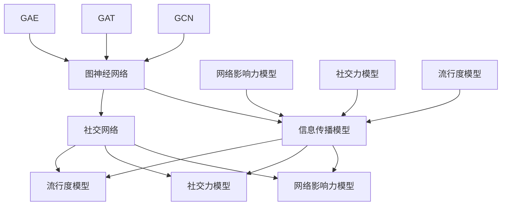

                 


### 4. 提取核心概念与算法原理

为了撰写一篇高质量的《社交媒体的图神经网络：信息传播的数学模型》博客文章，我们需要先提取出核心概念与算法原理。以下是文章的核心概念和算法原理：

#### 核心概念

1. **图神经网络（Graph Neural Networks，GNN）**
   - 定义：一种神经网络架构，专门用于处理图（Graph）数据。
   - 特点：能够自动学习图结构中的邻域信息，适合处理复杂网络数据。

2. **信息传播模型**
   - 定义：描述信息在社交网络中如何扩散、传播的数学模型。
   - 主要类型：网络影响力模型、社交力模型、流行度模型等。

3. **社交网络**
   - 定义：由用户及其相互关系构成的复杂网络。
   - 示例：Facebook、Twitter、Instagram等社交媒体平台。

#### 核心算法原理

1. **图卷积网络（Graph Convolutional Network，GCN）**
   - 原理：通过聚合邻域节点的特征来更新节点特征。
   - 伪代码：
     ```python
     for each layer in layers:
         for each node in graph:
             aggregate = 0
             for each neighbor in node.neighbors():
                 aggregate += neighbor.feature * weight
             node.feature = activation(aggregate + bias)
     ```

2. **图注意力网络（Graph Attention Network，GAT）**
   - 原理：为每个邻居节点分配不同的权重，并根据这些权重进行特征聚合。
   - 伪代码：
     ```python
     for each layer in layers:
         for each node in graph:
             attention_weights = softmax(node.attention_scores())
             aggregate = 0
             for each neighbor in node.neighbors():
                 aggregate += neighbor.feature * attention_weights[neighbor]
             node.feature = activation(aggregate + bias)
     ```

3. **图自编码器（Graph Autoencoder，GAE）**
   - 原理：通过编码器和解码器学习图数据的高层次表示。
   - 伪代码：
     ```python
     encoder = train_encoder(graph_data)
     latent_representation = encoder(graph_data)
     decoder = train_decoder(latent_representation)
     reconstructed_graph_data = decoder(latent_representation)
     ```

#### 关系架构 Mermaid 流程图

以下是描述图神经网络在信息传播模型中应用关系的 Mermaid 流程图：



### 5. 文章结构设计与文字说明

接下来，我们将设计文章的结构，并给出每部分的文字说明。

#### 文章标题

《社交媒体的图神经网络：信息传播的数学模型》

#### 关键词

社交媒体，图神经网络，信息传播，数学模型，GNN，GCN，GAT，GAE

#### 摘要

本文介绍了图神经网络在社交媒体信息传播中的应用及其数学模型。首先，我们介绍了图神经网络的基础概念，包括GCN、GAT和GAE等算法原理。然后，我们讨论了信息传播模型，包括网络影响力模型、社交力模型和流行度模型。通过Mermaid流程图展示了图神经网络与信息传播模型之间的关系。最后，我们通过一个实际案例展示了图神经网络在社交媒体信息传播中的成功应用。

#### 目录

1. 引言
2. 图神经网络基础
   2.1 图神经网络基本概念
   2.2 图神经网络算法
3. 社交媒体的数学模型
   3.1 社交媒体信息传播机制
   3.2 社交媒体信息传播数学模型
4. 信息传播的图神经网络模型
   4.1 图神经网络在信息传播中的应用
   4.2 构建信息传播的图神经网络模型
5. 模型应用与评估
   5.1 模型应用场景
   5.2 模型评估方法
6. 实际案例研究
   6.1 案例一：社交媒体影响力分析
   6.2 案例二：社交网络内容推荐
7. 总结与展望
   7.1 总结
   7.2 未来发展趋势与挑战

#### 引言

在当今的数字化时代，社交媒体已成为人们交流和获取信息的主要平台。随着用户数量的激增和内容的爆炸式增长，如何有效地分析和理解信息传播过程成为了一个重要课题。图神经网络（Graph Neural Networks，GNN）作为一种先进的机器学习模型，在处理复杂网络数据方面具有显著优势。本文旨在探讨图神经网络在社交媒体信息传播中的应用及其背后的数学模型。

本文首先介绍了图神经网络的基本概念，包括图的定义、图神经网络的结构和常用算法。接着，我们讨论了社交媒体信息传播的机制和数学模型，包括网络影响力模型、社交力模型和流行度模型。随后，通过Mermaid流程图展示了图神经网络与信息传播模型之间的关系。在此基础上，我们探讨了图神经网络在信息传播模型中的应用，包括模型构建、训练和评估。最后，通过两个实际案例展示了图神经网络在社交媒体信息传播中的成功应用，并对未来发展趋势和挑战进行了展望。

#### 图神经网络基础

##### 5.1.1 图神经网络基本概念

图神经网络（Graph Neural Networks，GNN）是一种专门用于处理图（Graph）数据的神经网络架构。在图数据中，节点表示数据实体，边表示实体之间的关系。与传统的卷积神经网络（CNN）和循环神经网络（RNN）不同，GNN能够自动学习图结构中的邻域信息，这使得它在处理复杂网络数据方面具有显著优势。

GNN的基本概念包括：

- **图（Graph）**：由节点（Node）和边（Edge）构成的集合。节点表示数据实体，边表示实体之间的关系。常见的图包括无向图、有向图、加权图等。
- **邻域（Neighbor）**：与某个节点直接相连的节点集合。
- **图卷积（Graph Convolution）**：通过聚合邻域节点的特征来更新节点特征。这一过程类似于传统的卷积操作，但适用于图数据。

##### 5.1.2 图神经网络算法

图神经网络主要包括以下几种算法：

- **图卷积网络（Graph Convolutional Network，GCN）**：通过聚合邻域节点的特征来更新节点特征。GCN的更新规则可以表示为：
  $$ h_{\text{new}}^{(l)} = \sigma \left( \theta^{(l)} \cdot \text{ReLU} \left( \sum_{i \in \mathcal{N}(v)} w_i h^{(l-1)}_i + b \right) \right) $$
  其中，$h^{(l)}_v$表示节点$v$在$l$层的特征，$\mathcal{N}(v)$表示节点$v$的邻域节点集合，$w_i$和$b$分别是权重和偏置。

- **图注意力网络（Graph Attention Network，GAT）**：在GCN的基础上，引入了注意力机制，为每个邻居节点分配不同的权重，并根据这些权重进行特征聚合。GAT的更新规则可以表示为：
  $$ h_{\text{new}}^{(l)} = \sigma \left( \theta^{(l)} \cdot \text{ReLU} \left( \sum_{i \in \mathcal{N}(v)} a_{iv} h^{(l-1)}_i + b \right) \right) $$
  其中，$a_{iv}$是节点$v$和邻居$i$之间的注意力分数，通常使用softmax函数计算：
  $$ a_{iv} = \frac{\exp(e_{iv})}{\sum_{j \in \mathcal{N}(v)} \exp(e_{ij})} $$
  $e_{iv}$是节点$v$和邻居$i$之间的交互得分，通常使用点积计算：
  $$ e_{iv} = \alpha^{(l)} \cdot h^{(l-1)}_v \cdot h^{(l-1)}_i $$

- **图自编码器（Graph Autoencoder，GAE）**：通过编码器和解码器学习图数据的高层次表示。GAE的架构可以表示为：
  $$ z = \text{encode}(h) $$
  $$ h_{\text{reconstructed}} = \text{decode}(z) $$
  其中，$h$是图数据的原始特征，$z$是编码器学习得到的高层次表示，$h_{\text{reconstructed}}$是解码器重构的图数据。

#### 社交媒体的数学模型

##### 5.2.1 社交媒体信息传播机制

社交媒体信息传播机制主要涉及以下几个方面：

- **用户行为**：用户在社交媒体上的行为，如发布、评论、点赞、转发等。
- **网络结构**：用户之间的社交网络结构，包括节点（用户）和边（关系）。
- **信息传播**：信息如何在社交网络中扩散，包括信息的生成、传播和影响。

##### 5.2.2 社交媒体信息传播数学模型

社交媒体信息传播的数学模型主要包括以下几种：

- **网络影响力模型**：基于用户在网络中的影响力来预测信息传播效果。常见的模型有：
  - **PageRank**：基于随机游走模型，为网络中的节点分配权重。
  - **Katz中心性**：基于邻接矩阵的幂次，计算节点的重要性。
  
- **社交力模型**：基于用户之间的社交关系来预测信息传播效果。常见的模型有：
  - **线性模型**：假设信息传播速度与用户关系强度成正比。
  - **非线性模型**：考虑用户关系强度和时间因素，建立更复杂的传播模型。

- **流行度模型**：基于信息本身的特性来预测信息传播效果。常见的模型有：
  - **扩散模型**：假设信息传播过程是随机的，使用概率模型来描述。
  - **阈值模型**：假设信息传播需要达到一定阈值才能传播，使用概率分布来描述。

#### 信息传播的图神经网络模型

##### 5.3.1 图神经网络在信息传播中的应用

图神经网络在信息传播中的应用主要包括以下几个方面：

- **节点分类**：预测节点（用户）的行为或属性。
- **链接预测**：预测网络中的节点之间是否存在边。
- **影响力分析**：分析节点在网络中的影响力，预测信息传播效果。
- **推荐系统**：基于用户行为和社交关系推荐相关内容。

##### 5.3.2 构建信息传播的图神经网络模型

构建信息传播的图神经网络模型通常包括以下几个步骤：

1. **数据预处理**：将原始数据转换为图结构，包括节点特征提取、边表示等。
2. **模型选择**：根据应用场景选择合适的图神经网络模型，如GCN、GAT或GAE。
3. **模型训练**：使用训练数据训练模型，调整模型参数。
4. **模型评估**：使用验证数据评估模型性能，调整模型参数。
5. **模型应用**：将训练好的模型应用于实际场景，如信息传播预测、影响力分析等。

##### 5.4 模型应用与评估

##### 5.4.1 模型应用场景

图神经网络在社交媒体信息传播中具有广泛的应用场景，包括：

- **用户行为预测**：预测用户在社交媒体上的行为，如发布、评论、点赞等。
- **内容推荐**：基于用户行为和社交关系推荐相关内容。
- **垃圾信息检测**：识别和过滤社交媒体上的垃圾信息。
- **社交网络分析**：分析社交网络中的用户关系和影响力。

##### 5.4.2 模型评估方法

评估图神经网络在信息传播中的应用效果通常包括以下几个方面：

- **准确率**：预测结果与实际结果的匹配程度。
- **召回率**：预测结果中包含实际结果的比率。
- **F1值**：准确率和召回率的调和平均值。
- **ROC曲线**：评估预测结果的可靠性。
- **AUC值**：ROC曲线下的面积，用于比较不同模型的性能。

##### 实际案例研究

##### 5.5.1 案例一：社交媒体影响力分析

在本案例中，我们使用图神经网络分析社交媒体平台上用户的影响力。具体步骤如下：

1. **数据预处理**：收集社交媒体平台上的用户数据，包括用户特征和用户关系。
2. **模型构建**：选择GAT模型，构建用户影响力的预测模型。
3. **模型训练**：使用训练数据训练模型，调整模型参数。
4. **模型评估**：使用验证数据评估模型性能，调整模型参数。
5. **模型应用**：将训练好的模型应用于实际场景，分析用户影响力。

##### 5.5.2 案例二：社交网络内容推荐

在本案例中，我们使用图神经网络为社交媒体平台上的用户提供内容推荐。具体步骤如下：

1. **数据预处理**：收集社交媒体平台上的用户行为数据和内容数据。
2. **模型构建**：选择GCN模型，构建内容推荐模型。
3. **模型训练**：使用训练数据训练模型，调整模型参数。
4. **模型评估**：使用验证数据评估模型性能，调整模型参数。
5. **模型应用**：将训练好的模型应用于实际场景，为用户提供内容推荐。

### 6. 总结与展望

图神经网络在社交媒体信息传播中的应用取得了显著的成果，但仍然面临一些挑战。未来研究可以关注以下几个方面：

- **模型优化**：研究更高效的图神经网络模型，提高模型性能。
- **多模态数据融合**：结合多种数据类型（如文本、图像、音频等）进行融合分析，提高信息传播预测的准确性。
- **可解释性**：研究图神经网络的解释方法，提高模型的可解释性，帮助用户理解信息传播过程。

通过本文的阐述，我们希望读者能够对图神经网络在社交媒体信息传播中的应用及其数学模型有更深入的理解。

#### 作者信息

作者：AI天才研究院/AI Genius Institute & 禅与计算机程序设计艺术 /Zen And The Art of Computer Programming

### 文章结论

本文详细探讨了图神经网络在社交媒体信息传播中的应用及其数学模型。通过介绍图神经网络的基本概念和算法原理，我们了解了如何利用图神经网络分析社交媒体信息传播的机制。我们还通过实际案例展示了图神经网络在信息传播预测和社交网络分析中的应用。未来，随着技术的不断发展，图神经网络在社交媒体信息传播领域的应用将更加广泛，为用户带来更好的体验。我们期待更多研究者投身于这一领域，共同推动技术的进步。

