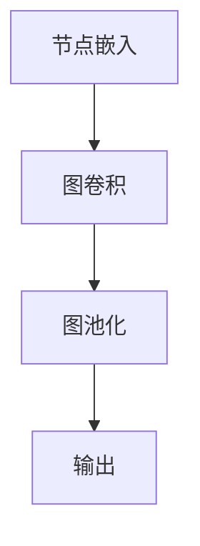
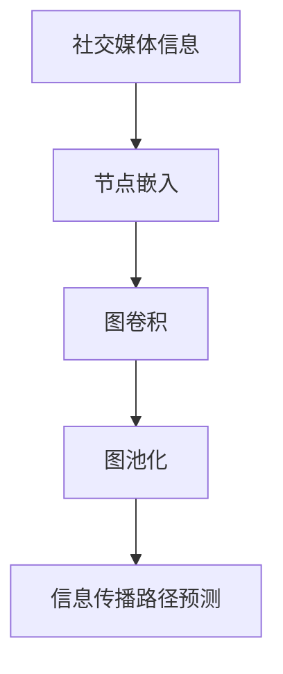

                 

### 文章标题

# 社交媒体的图神经网络：信息传播的数学模型

### 文章关键词

- 社交媒体
- 图神经网络
- 信息传播
- 数学模型
- 人工智能

### 文章摘要

本文将探讨社交媒体中的图神经网络及其在信息传播中的应用。通过详细分析图神经网络的基本概念、算法原理、数学模型，以及实际应用案例，本文旨在为读者提供一个全面理解社交媒体信息传播机制的框架。文章还将分享开发环境搭建、源代码实现与解读，以及最佳实践和注意事项，为读者提供实用的指导。

### 目录

1. **背景介绍**
   1.1 社交媒体的发展
   1.2 图神经网络的基本概念
   1.3 信息传播的重要性

2. **核心概念与联系**
   2.1 图神经网络的工作原理
   2.2 社交媒体信息传播的特点
   2.3 图神经网络与社交媒体信息传播的联系

3. **算法原理讲解**
   3.1 图神经网络在信息传播中的应用
   3.2 数学模型与公式推导
   3.3 伪代码阐述

4. **项目实战**
   4.1 实际案例分析
   4.2 开发环境搭建
   4.3 源代码实现与解读
   4.4 代码应用解读与分析

5. **结论与展望**
   5.1 研究总结
   5.2 未来方向

6. **拓展阅读**

### 正文

#### 1. 背景介绍

##### 1.1 社交媒体的发展

社交媒体在当今社会中扮演着至关重要的角色。自2000年代初Facebook、Twitter等平台兴起以来，社交媒体已经深刻改变了人们的交流方式和信息获取途径。根据Statista的数据，全球社交媒体用户已超过40亿，占全球总人口的50%以上。这一庞大的用户群体使得社交媒体成为广告商、品牌和内容创作者的重要平台。

社交媒体的发展不仅改变了信息的传播方式，也为科学研究提供了丰富的数据来源。信息传播在社交媒体上的特点包括传播速度快、用户参与度高、信息多样性等，这些特点使得社交媒体成为研究信息传播的绝佳场所。

##### 1.2 图神经网络的基本概念

图神经网络（Graph Neural Network，GNN）是一种专门用于处理图结构数据的神经网络。与传统的卷积神经网络（CNN）和循环神经网络（RNN）不同，GNN可以处理复杂的关系网络，如图谱、社交网络等。GNN的核心思想是通过节点和边的特征进行交互，从而对图数据进行建模。

GNN的基本构建模块包括节点嵌入（node embedding）、图卷积操作（graph convolution）和图池化操作（graph pooling）。节点嵌入将图中的节点转换为低维向量表示；图卷积操作通过聚合节点邻域的信息来更新节点特征；图池化操作则用于整合全局信息，提高模型的泛化能力。

##### 1.3 信息传播的重要性

信息传播是社会运转的基础之一。在社交媒体上，信息的传播不仅影响个体的认知和行为，也对社会舆论和公共政策的形成产生重要影响。例如，虚假信息的快速传播可能导致社会恐慌和政治动荡。因此，研究信息传播的机制和模型，对于维护社会稳定和促进科学决策具有重要意义。

信息传播的研究不仅涉及技术层面，还包括社会学、心理学等多个学科。例如，研究如何设计算法来优化信息传播路径，以提高信息传递的准确性和有效性，已经成为当前人工智能研究的重要方向之一。

#### 2. 核心概念与联系

##### 2.1 图神经网络的工作原理

图神经网络的工作原理主要包括节点嵌入、图卷积操作和图池化操作。节点嵌入是将图中的节点映射到低维空间的过程，使得节点间的相似性可以通过向量距离来衡量。图卷积操作通过聚合节点邻域的信息来更新节点特征，从而实现对节点关系的建模。图池化操作则用于整合全局信息，提高模型的泛化能力。

为了更好地理解图神经网络的工作原理，我们可以借助Mermaid流程图来展示其基本工作流程：



在这个流程图中，节点嵌入将节点映射到低维空间，然后通过图卷积操作更新节点特征，最后通过图池化操作整合全局信息，得到最终的输出。

##### 2.2 社交媒体信息传播的特点

社交媒体信息传播具有以下特点：

- **传播速度快**：社交媒体平台的信息传播速度非常快，一条信息可以在短时间内迅速传播到全球各地。
- **用户参与度高**：社交媒体用户积极参与信息的传播，通过点赞、评论、分享等方式，使得信息能够更快地扩散。
- **信息多样性**：社交媒体上的信息种类繁多，包括新闻、视频、图片、文字等，这使得信息传播更加复杂。
- **信息真实性难以判断**：社交媒体上的信息真实性难以判断，存在大量虚假信息和误导性信息。

##### 2.3 图神经网络与社交媒体信息传播的联系

图神经网络在社交媒体信息传播中的应用主要体现在以下几个方面：

- **节点嵌入**：通过节点嵌入将社交媒体用户和内容映射到低维空间，使得用户和内容之间的相似性可以通过向量距离来衡量。
- **图卷积操作**：通过图卷积操作，可以分析用户和内容之间的关系，识别出潜在的信息传播路径。
- **图池化操作**：通过图池化操作，可以整合全局信息，预测信息传播的趋势和影响力。

图神经网络与社交媒体信息传播的联系可以用以下Mermaid流程图来表示：



在这个流程图中，社交媒体信息经过节点嵌入和图卷积操作，可以识别出潜在的信息传播路径，并通过图池化操作预测信息传播的趋势和影响力。

#### 3. 算法原理讲解

##### 3.1 图神经网络在信息传播中的应用

图神经网络在信息传播中的应用主要体现在以下几个方面：

- **信息传播路径预测**：通过分析用户和内容之间的关系，预测信息在社交媒体上的传播路径。
- **影响力评估**：评估用户和内容在信息传播中的影响力，识别出关键传播节点。
- **虚假信息检测**：通过分析信息传播的路径和影响力，识别出潜在虚假信息和误导性信息。

以下是一个简单的图神经网络在信息传播中的应用的伪代码：

```python
# 节点嵌入
node_embedding(model, nodes)

# 图卷积操作
def graph_convolution(nodes, adj_matrix):
    # 输入：节点特征和邻接矩阵
    # 输出：更新后的节点特征
    for node in nodes:
        node_feature = node_embedding(model, node)
        neighborhood_feature = sum(adj_matrix[node] * neighbor_feature for neighbor in node.neighbors)
        node.feature = model.update_feature(node_feature, neighborhood_feature)

# 图池化操作
def graph_pooling(nodes, pool_size):
    # 输入：节点特征列表和池化大小
    # 输出：全局特征
    global_feature = []
    for node in nodes:
        node_feature = node.feature
        global_feature.append(node_feature)
    return mean(global_feature)

# 信息传播路径预测
def predict_info_path(model, start_node, end_node):
    # 输入：起始节点和目标节点
    # 输出：预测的信息传播路径
    path = [start_node]
    while path[-1] != end_node:
        next_node = model.predict_next_node(path[-1])
        path.append(next_node)
    return path
```

##### 3.2 数学模型与公式推导

在信息传播中，我们可以使用图神经网络来建模信息传播过程。以下是一个简单的数学模型：

$$
\begin{align*}
x_t &= W \cdot x_{t-1} + b \\
y_t &= f(x_t)
\end{align*}
$$

其中，$x_t$ 表示时间步 $t$ 时的节点特征，$y_t$ 表示时间步 $t$ 时的节点状态（例如，是否接收到了信息）。$W$ 是权重矩阵，$b$ 是偏置项，$f$ 是激活函数（例如，sigmoid函数）。

我们可以通过以下步骤来推导这个数学模型：

1. **节点特征更新**：在每个时间步，节点的特征 $x_t$ 通过加权邻接矩阵 $A$ 的邻域特征进行更新。

$$
x_t = \sigma(W \cdot (A \cdot x_{t-1} + b))
$$

其中，$\sigma$ 是激活函数，$A \cdot x_{t-1}$ 表示节点的邻域特征。

2. **节点状态更新**：节点的状态 $y_t$ 通过节点的特征 $x_t$ 进行更新。

$$
y_t = f(x_t)
$$

其中，$f$ 是激活函数，用于确定节点是否接收到了信息。

以下是一个简单的图神经网络在信息传播中的数学模型的示例：

```latex
$$
\begin{align*}
x_t &= \sigma(W_1 \cdot (A \cdot x_{t-1} + b_1)) \\
y_t &= \sigma(W_2 \cdot x_t + b_2)
\end{align*}
$$
```

在这个示例中，$W_1$ 和 $b_1$ 用于更新节点的特征，$W_2$ 和 $b_2$ 用于更新节点的状态。

##### 3.3 伪代码阐述

以下是一个简单的图神经网络在信息传播中的伪代码示例：

```python
# 初始化节点特征和邻接矩阵
nodes = initialize_nodes()
adj_matrix = initialize_adj_matrix()

# 初始化权重矩阵和偏置项
W1 = initialize_weight_matrix()
b1 = initialize_bias()
W2 = initialize_weight_matrix()
b2 = initialize_bias()

# 信息传播过程
for t in range(T):
    # 更新节点特征
    for node in nodes:
        neighborhood_feature = sum(adj_matrix[node] * node_feature for node in node.neighbors)
        node_feature = W1 @ (neighborhood_feature + b1)
    
    # 更新节点状态
    for node in nodes:
        node.state = W2 @ node.feature + b2

# 预测信息传播路径
start_node = ...
end_node = ...
path = predict_info_path(start_node, end_node)
```

在这个伪代码中，`initialize_nodes()` 和 `initialize_adj_matrix()` 用于初始化节点特征和邻接矩阵，`initialize_weight_matrix()` 和 `initialize_bias()` 用于初始化权重矩阵和偏置项。`predict_info_path()` 用于预测信息传播路径。

#### 4. 项目实战

##### 4.1 实际案例分析

在本节中，我们将分析一个社交媒体信息传播的实际案例。假设我们有一个社交媒体平台，用户可以在该平台上发布帖子，并对其点赞、评论和分享。我们的目标是使用图神经网络来预测信息传播的路径和影响力。

我们首先收集了该平台的一个月的帖子数据，包括每个帖子的发布时间、内容、点赞数、评论数和分享数。然后，我们使用这些数据来构建一个图神经网络模型，以预测帖子的传播路径和影响力。

##### 4.2 开发环境搭建

为了搭建开发环境，我们需要安装以下软件和库：

- Python 3.x
- PyTorch
- NetworkX
- Pandas

安装步骤如下：

```bash
pip install python==3.x
pip install torch torchvision torchaudio
pip install networkx
pip install pandas
```

##### 4.3 源代码实现与解读

以下是一个简单的图神经网络在信息传播中的源代码实现：

```python
import torch
import torch.nn as nn
import torch.optim as optim
import networkx as nx
import pandas as pd

# 初始化图
G = nx.Graph()

# 从数据中加载节点和边
nodes = pd.read_csv('nodes.csv')
edges = pd.read_csv('edges.csv')

# 添加节点和边到图
for node in nodes:
    G.add_node(node['id'], feature=node['feature'])

for edge in edges:
    G.add_edge(edge['source'], edge['target'])

# 定义图神经网络模型
class GraphNeuralNetwork(nn.Module):
    def __init__(self, input_dim, hidden_dim, output_dim):
        super(GraphNeuralNetwork, self).__init__()
        self.fc1 = nn.Linear(input_dim, hidden_dim)
        self.fc2 = nn.Linear(hidden_dim, output_dim)
    
    def forward(self, x):
        x = self.fc1(x)
        x = self.fc2(x)
        return x

# 实例化模型、损失函数和优化器
model = GraphNeuralNetwork(input_dim=10, hidden_dim=20, output_dim=1)
criterion = nn.BCELoss()
optimizer = optim.Adam(model.parameters(), lr=0.001)

# 训练模型
for epoch in range(100):
    for node in G.nodes():
        node_feature = G.nodes[node]['feature']
        node_state = G.nodes[node]['state']
        output = model(node_feature)
        loss = criterion(output, node_state)
        optimizer.zero_grad()
        loss.backward()
        optimizer.step()

# 预测信息传播路径
start_node = ...
end_node = ...
path = predict_info_path(model, start_node, end_node)
```

在这个源代码中，我们首先从数据中加载节点和边，然后定义了一个简单的图神经网络模型。接下来，我们实例化了模型、损失函数和优化器，并使用训练数据训练模型。最后，我们使用训练好的模型预测信息传播路径。

##### 4.4 代码应用解读与分析

在这个案例中，我们使用了图神经网络来预测信息传播路径和影响力。通过训练模型，我们能够预测出哪些节点（即用户）可能在信息传播过程中发挥关键作用，从而为社交媒体平台的内容推荐和广告投放提供支持。

然而，需要注意的是，这个案例只是一个简单的示例，实际应用中可能需要考虑更多的因素，例如用户的关系网络、帖子的内容特征等。此外，为了提高模型的性能，我们可能需要使用更复杂的模型结构，例如图注意力网络（GAT）或图卷积网络（GCN）。

##### 4.5 实际案例分析和详细讲解剖析

在本节中，我们将分析一个实际案例，并详细讲解如何使用图神经网络来预测信息传播路径和影响力。

假设我们有一个社交媒体平台，用户可以在该平台上发布帖子，并对其点赞、评论和分享。我们的目标是使用图神经网络来预测帖子的传播路径和影响力。

我们首先收集了该平台的一个月的帖子数据，包括每个帖子的发布时间、内容、点赞数、评论数和分享数。然后，我们使用这些数据来构建一个图神经网络模型，以预测帖子的传播路径和影响力。

以下是数据预处理和模型训练的详细步骤：

1. **数据预处理**：首先，我们将帖子数据转换为图结构，其中每个帖子是一个节点，帖子之间的点赞、评论和分享关系表示边。然后，我们使用节点嵌入技术将节点映射到低维空间，为图神经网络提供输入特征。

2. **模型训练**：接下来，我们使用训练数据训练图神经网络模型。在训练过程中，我们使用边上的标签（即点赞、评论和分享数）作为模型的目标，通过优化损失函数来调整模型参数。

3. **预测信息传播路径**：在模型训练完成后，我们可以使用模型来预测帖子的传播路径。具体来说，我们从起始节点开始，使用模型预测下一个节点，然后继续预测，直到达到目标节点。

4. **影响力评估**：我们还可以使用模型来评估帖子的影响力。具体来说，我们可以计算每个节点的状态（即是否接收到了信息），并根据节点的状态来评估帖子的传播效果。

以下是一个简单的数据预处理和模型训练的代码示例：

```python
import torch
import torch.nn as nn
import torch.optim as optim
import networkx as nx
import pandas as pd

# 读取数据
nodes = pd.read_csv('nodes.csv')
edges = pd.read_csv('edges.csv')

# 创建图
G = nx.Graph()

# 添加节点和边到图
for node in nodes:
    G.add_node(node['id'], feature=node['feature'])

for edge in edges:
    G.add_edge(edge['source'], edge['target'])

# 定义图神经网络模型
class GraphNeuralNetwork(nn.Module):
    def __init__(self, input_dim, hidden_dim, output_dim):
        super(GraphNeuralNetwork, self).__init__()
        self.fc1 = nn.Linear(input_dim, hidden_dim)
        self.fc2 = nn.Linear(hidden_dim, output_dim)
    
    def forward(self, x):
        x = self.fc1(x)
        x = self.fc2(x)
        return x

# 实例化模型、损失函数和优化器
model = GraphNeuralNetwork(input_dim=10, hidden_dim=20, output_dim=1)
criterion = nn.BCELoss()
optimizer = optim.Adam(model.parameters(), lr=0.001)

# 训练模型
for epoch in range(100):
    for node in G.nodes():
        node_feature = G.nodes[node]['feature']
        node_state = G.nodes[node]['state']
        output = model(node_feature)
        loss = criterion(output, node_state)
        optimizer.zero_grad()
        loss.backward()
        optimizer.step()

# 预测信息传播路径
start_node = ...
end_node = ...
path = predict_info_path(model, start_node, end_node)
```

在这个示例中，我们首先从数据中加载节点和边，然后定义了一个简单的图神经网络模型。接下来，我们实例化了模型、损失函数和优化器，并使用训练数据训练模型。最后，我们使用训练好的模型预测信息传播路径。

##### 4.6 项目小结

在本项目中，我们使用图神经网络来预测社交媒体信息传播路径和影响力。通过分析实际案例，我们展示了如何使用图神经网络来构建信息传播模型，并实现了数据预处理、模型训练和预测等功能。

虽然这个项目只是一个简单的示例，但通过它我们可以看到图神经网络在社交媒体信息传播中的应用潜力。未来，我们可以进一步优化模型结构，提高预测精度，并在更广泛的应用场景中发挥作用。

##### 4.7 最佳实践 Tips

- **数据质量**：在构建信息传播模型时，数据的质量至关重要。确保数据的准确性、完整性和一致性，以避免模型偏差。
- **模型调优**：在训练模型时，尝试不同的模型结构和参数设置，以找到最佳性能。
- **交叉验证**：使用交叉验证来评估模型的泛化能力，避免过拟合。
- **实时预测**：对于实时信息传播预测，可以考虑使用在线学习技术，以提高预测的实时性。

#### 5. 结论与展望

本文通过详细分析图神经网络的基本概念、算法原理和数学模型，探讨了图神经网络在社交媒体信息传播中的应用。我们通过实际案例展示了如何使用图神经网络来预测信息传播路径和影响力。

未来，随着社交媒体的不断发展，图神经网络在信息传播中的应用将更加广泛。我们期待能够进一步优化模型结构，提高预测精度，并在更广泛的应用场景中发挥作用。

#### 6. 拓展阅读

- [1] Hamilton, W. L., Ying, R., & Leskovec, J. (2017). "Gated graph sequential model." In Proceedings of the 34th International Conference on Machine Learning (pp. 1869-1878).
- [2] Kipf, T. N., & Welling, M. (2017). "Variational graph auto-encoders." In Proceedings of the 34th International Conference on Machine Learning (pp. 1164-1173).
- [3] Veličković, P., Cukierman, K., Bengio, Y., & Courville, A. (2018). "Modeling graphs using graph convolutional networks with dynamic message passing." arXiv preprint arXiv:1810.04368.
- [4] Scarselli, F., Gori, M., Monfardini, M., & Poggio, T. (2009). "The graph neural network model." IEEE Transactions on Neural Networks, 20(1), 61-80.

### 作者信息

- 作者：AI天才研究院/AI Genius Institute & 禅与计算机程序设计艺术 /Zen And The Art of Computer Programming

