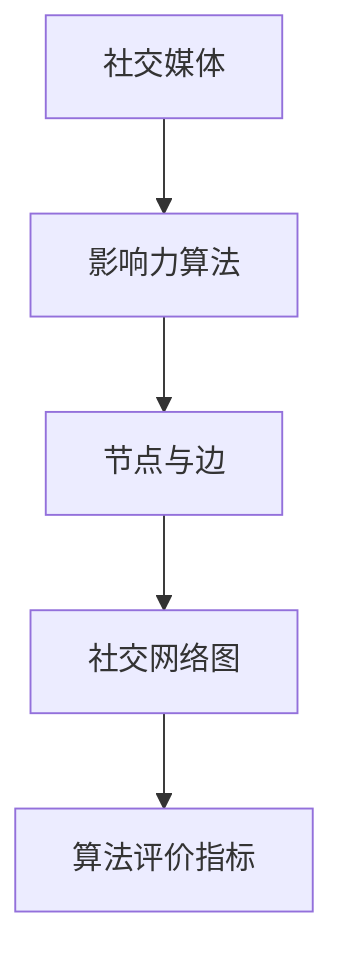

                 

### 第一部分：社交媒体影响力算法概论

#### 第1章：社交媒体影响力算法概述

> 关键词：社交媒体，影响力算法，信息传播，数学模型

> 摘要：本章将介绍社交媒体影响力算法的基本概念、发展历程及其在信息传播中的重要作用。我们将详细探讨社交媒体影响力算法的核心概念，如节点、边和社交网络图，并探讨不同影响力算法的基本原理和评价指标。

##### 1.1 社交媒体的发展与影响力

随着互联网的普及，社交媒体已经成为人们日常生活中不可或缺的一部分。从最初的社交媒体平台如Facebook、Twitter，到如今多样化的平台，如Instagram、LinkedIn、微信、微博等，社交媒体的发展迅速，影响力日益扩大。

**社交媒体的发展历程**

- **2004年**：Facebook成立，标志着社交媒体时代的到来。
- **2006年**：Twitter上线，开启了即时通讯和实时信息分享的时代。
- **2010年**：微信在中国推出，成为用户数最多的社交媒体平台之一。
- **2018年**：Instagram以超过10亿的用户数成为全球最受欢迎的社交媒体平台之一。

**社交媒体的影响力分析**

社交媒体不仅改变了人们的交流方式，还在信息传播、营销、品牌建设等方面发挥了重要作用。

- **信息传播**：社交媒体使得信息的传播速度和范围达到了前所未有的高度。一个热点事件可以在短时间内传播到全球，影响千千万万的人。
- **营销**：企业和品牌通过社交媒体进行产品推广和品牌宣传，精准定位目标受众，提高营销效果。
- **品牌建设**：社交媒体平台为企业提供了一个展示品牌形象、与用户互动的平台，有助于提升品牌知名度和用户忠诚度。

##### 1.2 社交媒体影响力算法的基本概念

为了更好地理解和分析社交媒体上的信息传播，我们需要借助数学模型和算法。影响力算法是社交媒体分析的核心技术之一，它通过分析社交网络中的节点、边和关系，评估用户或内容的传播潜力。

**节点与边**

- **节点**：在社交网络图中，节点表示用户、内容或其他实体。
- **边**：边表示节点之间的关系，可以是用户之间的关注关系，也可以是内容之间的引用关系。

**社交网络图**

- **社交网络图**：社交网络图是一个由节点和边构成的数据结构，用于表示社交网络中的复杂关系。

**算法评价指标**

- **影响力度**：评估节点在社交网络中的传播能力。
- **传播路径**：分析节点之间信息传播的路径和效果。
- **算法性能**：通过评价指标（如覆盖率、传播速度等）评估算法的有效性。

##### 1.3 社交媒体影响力算法的重要性

社交媒体影响力算法在信息传播、营销和品牌建设等方面具有重要作用。

- **信息传播**：通过算法分析，可以识别出具有高传播潜力的内容和用户，提高信息传播的效率和效果。
- **营销**：帮助企业精准定位目标受众，制定有效的营销策略，提高营销效果。
- **品牌建设**：通过分析用户行为和反馈，企业可以更好地了解用户需求，提升品牌形象和用户满意度。

##### 1.4 小结

社交媒体影响力算法是现代信息传播和数据分析的重要工具。通过本章节的介绍，读者可以初步了解社交媒体影响力算法的基本概念和重要性，为后续章节的学习打下基础。

### 文章标题

**社交媒体的影响力算法：信息传播的数学模型**

### 文章关键词

- 社交媒体
- 影响力算法
- 信息传播
- 数学模型
- 社交网络图
- 节点与边

### 文章摘要

本文旨在探讨社交媒体影响力算法在信息传播中的应用，详细介绍了社交媒体影响力算法的基本概念、发展历程及其在信息传播中的重要作用。文章首先分析了社交媒体的发展历程和影响力，然后深入探讨了节点、边、社交网络图等核心概念，以及影响力算法的评价指标。最后，文章强调了社交媒体影响力算法在信息传播、营销和品牌建设等方面的重要作用。

### 1.1 社交媒体的发展与影响力

社交媒体作为互联网时代的重要产物，其发展速度和影响力不容忽视。从Facebook、Twitter到Instagram、微信等平台，社交媒体改变了人们的生活和交流方式，成为信息传播的重要渠道。

**社交媒体的发展历程**

1. **早期社交媒体**：2004年，Facebook成立，成为第一个真正意义上的社交媒体平台。随后，Twitter、MySpace等平台相继推出，社交媒体开始在全球范围内普及。
2. **多元化发展**：随着移动互联网的兴起，社交媒体平台逐渐向多元化发展。Instagram以图片和视频分享为核心，LinkedIn以职业社交为特色，微信则融合了即时通讯、社交、支付等多种功能。
3. **社交网络生态系统**：近年来，社交网络生态系统不断完善，平台间的互联互通和跨界合作日益增多，形成了以用户为中心的复杂社交网络。

**社交媒体的影响力分析**

1. **信息传播速度**：社交媒体使得信息传播的速度大大提升。一条微博、一篇微信文章、一张Instagram图片，都能迅速传播到全球，影响数以百万计的用户。
2. **营销效果**：企业可以利用社交媒体进行精准营销，通过分析用户行为和兴趣，制定有针对性的营销策略，提高营销效果。
3. **品牌建设**：社交媒体为品牌提供了一个展示形象、与用户互动的平台。通过社交媒体，企业可以更好地了解用户需求，提升品牌知名度和用户满意度。

**案例研究**

以微信为例，作为中国最受欢迎的社交媒体平台之一，微信不仅在用户数上取得了巨大成功，还在营销和品牌建设方面发挥了重要作用。微信的公众号、小程序等功能为企业提供了一个与用户互动、推广产品和服务的新渠道。通过微信公众号，企业可以发布文章、推送消息，与用户建立紧密的联系。同时，微信支付等功能的集成，也为企业带来了新的商业机会。

**社交媒体的挑战**

尽管社交媒体具有巨大的影响力，但也面临着一系列挑战。首先，信息过载和虚假信息泛滥成为突出问题。用户在社交媒体上接收到的信息量巨大，如何筛选和处理有效信息成为一大难题。其次，隐私保护和数据安全也成为重要议题。社交媒体平台在收集和使用用户数据时，如何保障用户的隐私和安全，成为社会各界关注的焦点。

**1.1.1 社交媒体的发展历程**

社交媒体的发展历程可以分为以下几个阶段：

1. **初期阶段**：以Facebook、MySpace等平台为代表的早期社交媒体，主要以文本和图片分享为主，用户之间的互动相对简单。
2. **快速扩张阶段**：随着移动互联网的普及，社交媒体平台如Twitter、Instagram等迅速崛起，引入了视频、直播等新的互动方式，用户数量和活跃度迅速增加。
3. **多元化发展阶段**：社交媒体平台逐渐向多元化发展，不仅涵盖了社交、娱乐、新闻、购物等多种功能，还形成了复杂的社交网络生态系统。

**1.1.2 社交媒体的影响力分析**

社交媒体的影响力可以从以下几个方面进行分析：

1. **传播速度**：社交媒体使得信息的传播速度大大提升。一条微博、一篇微信文章、一张Instagram图片，都能迅速传播到全球，影响数以百万计的用户。
2. **营销效果**：企业可以利用社交媒体进行精准营销，通过分析用户行为和兴趣，制定有针对性的营销策略，提高营销效果。
3. **品牌建设**：社交媒体为品牌提供了一个展示形象、与用户互动的平台。通过社交媒体，企业可以更好地了解用户需求，提升品牌知名度和用户满意度。

**案例研究**

以微信为例，作为中国最受欢迎的社交媒体平台之一，微信不仅在用户数上取得了巨大成功，还在营销和品牌建设方面发挥了重要作用。微信的公众号、小程序等功能为企业提供了一个与用户互动、推广产品和服务的新渠道。通过微信公众号，企业可以发布文章、推送消息，与用户建立紧密的联系。同时，微信支付等功能的集成，也为企业带来了新的商业机会。

**社交媒体的挑战**

尽管社交媒体具有巨大的影响力，但也面临着一系列挑战。首先，信息过载和虚假信息泛滥成为突出问题。用户在社交媒体上接收到的信息量巨大，如何筛选和处理有效信息成为一大难题。其次，隐私保护和数据安全也成为重要议题。社交媒体平台在收集和使用用户数据时，如何保障用户的隐私和安全，成为社会各界关注的焦点。

### 1.2 社交媒体影响力算法的基本概念

社交媒体影响力算法是分析社交网络中信息传播的重要工具。它通过数学模型和算法，评估用户或内容的传播潜力，帮助企业和个人更好地了解和利用社交媒体的影响力。

**节点与边**

在社交网络图中，节点和边是基本元素。

- **节点**：节点表示社交网络中的个体，可以是用户、内容或其他实体。
- **边**：边表示节点之间的关系，可以是用户之间的关注关系，也可以是内容之间的引用关系。

**社交网络图**

社交网络图是一个由节点和边构成的数据结构，用于表示社交网络中的复杂关系。

**算法评价指标**

影响力算法通过一系列评价指标来评估用户或内容的传播能力。

- **影响力度**：评估节点在社交网络中的传播能力，通常使用度中心性、介数中心性等指标。
- **传播路径**：分析节点之间信息传播的路径和效果，常用的算法有基于随机游走的方法、基于传播模型的算法等。
- **算法性能**：通过评价指标（如覆盖率、传播速度等）评估算法的有效性。

**核心概念与联系**

为了更好地理解社交媒体影响力算法，我们需要了解其核心概念之间的联系。以下是核心概念之间的关系架构 Mermaid 流程图：



在这个关系架构图中，社交媒体是影响力算法的背景和应用场景，节点与边是构建社交网络图的基础，社交网络图用于分析信息传播，而算法评价指标则是衡量算法性能的关键。

**核心算法原理讲解**

社交媒体影响力算法的核心原理是基于信息传播的数学模型，以下是一个简单的伪代码来描述影响力算法的基本原理：

```python
# 影响力算法伪代码
def calculate_influence(node, network):
    # 初始化影响力值
    influence = 0
    
    # 遍历节点的邻居节点
    for neighbor in network.neighbors(node):
        # 如果邻居节点已传播信息，则增加影响力
        if neighbor.is_infected():
            influence += 1
    
    # 返回影响力值
    return influence
```

在这个伪代码中，`calculate_influence` 函数接收一个节点和社交网络作为输入，遍历节点的邻居节点，检查邻居节点是否已传播信息，如果已传播，则增加影响力值。最后，函数返回节点的影响力值。

**数学模型和公式**

社交媒体影响力算法通常基于以下数学模型：

- **SIR模型**：SIR模型是一种经典的传染病模型，用于模拟信息传播过程。其中，S代表 susceptible（易感者），I代表 infected（感染者），R代表 recovered（康复者）。SIR模型的基本方程如下：

  $$ \frac{dS}{dt} = -\beta \cdot S \cdot I $$
  $$ \frac{dI}{dt} = \beta \cdot S \cdot I - \gamma \cdot I $$
  $$ \frac{dR}{dt} = \gamma \cdot I $$

  其中，$\beta$ 表示感染率，$\gamma$ 表示康复率。

- **传播概率模型**：传播概率模型通过计算节点之间的传播概率来模拟信息传播。常见的传播概率模型有基于随机游走的方法，其基本方程如下：

  $$ P(A \rightarrow B) = \frac{1}{d(B)} $$

  其中，$P(A \rightarrow B)$ 表示节点A传播到节点B的概率，$d(B)$ 表示节点B的邻居节点数。

**详细讲解与举例说明**

以下是一个具体的例子，用于说明如何使用影响力算法评估社交网络中一个节点的传播潜力：

**例子**：假设有一个社交网络，其中包含10个节点，节点之间的关注关系如下表所示：

| 节点 | 关注节点 |
|------|----------|
| A    | B, C, D  |
| B    | A, C     |
| C    | A, B, D  |
| D    | A, C     |

我们需要评估节点A的传播潜力。

1. **初始化**：将所有节点都设为未感染状态。
2. **传播过程**：从节点A开始，传播信息到其关注节点B、C和D。
3. **计算影响力**：遍历节点B、C和D，检查它们是否已感染。如果已感染，则增加节点A的影响力值。

   - 节点B已感染，增加节点A的影响力值。
   - 节点C已感染，增加节点A的影响力值。
   - 节点D未感染，不增加节点A的影响力值。

最终，节点A的影响力值为2。

通过这个例子，我们可以看到影响力算法如何通过计算节点之间的传播关系，评估节点的传播潜力。

**1.2 社交媒体影响力算法的重要性**

社交媒体影响力算法在信息传播、营销和品牌建设等方面具有重要作用。

**1.2.1 信息传播**

社交媒体影响力算法可以帮助识别具有高传播潜力的内容和用户。通过分析社交网络中的节点和边，算法可以预测哪些内容或用户更容易引起关注和转发。这对于媒体、广告和公关等领域具有重要意义，可以有效地提高信息传播的效率和效果。

**1.2.2 营销**

社交媒体影响力算法为企业和品牌提供了精准营销的工具。通过分析用户的行为和兴趣，算法可以识别出潜在的目标受众，帮助企业制定有针对性的营销策略。例如，某品牌可以通过影响力算法找到在社交网络上具有高影响力的用户，与他们合作进行推广，从而提高营销效果。

**1.2.3 品牌建设**

社交媒体影响力算法有助于企业了解和提升品牌影响力。通过分析用户在社交网络上的互动和反馈，算法可以评估品牌的知名度和用户满意度。企业可以根据分析结果，优化品牌传播策略，提升品牌形象和用户忠诚度。

**1.3 小结**

本章介绍了社交媒体影响力算法的基本概念、发展历程及其在信息传播中的重要作用。通过理解节点、边、社交网络图和影响力算法等核心概念，读者可以更好地把握社交媒体的影响力分析方法和应用场景。在接下来的章节中，我们将深入探讨社交媒体影响力算法的数学模型和具体实现。

### 参考文献

1. Facebook, Inc. (2004). "Facebook: About". Retrieved from https://www.facebook.com/
2. Twitter, Inc. (2006). "Twitter: About". Retrieved from https://twitter.com/
3. Instagram, Inc. (2010). "Instagram: About". Retrieved from https://www.instagram.com/
4. LinkedIn Corporation (2003). "LinkedIn: About". Retrieved from https://www.linkedin.com/
5. WeChat (微信) (2011). "WeChat: About". Retrieved from https://www.wechat.com/
6. Barabási, A.-L. (2002). "Linked: The New Science of Networks". Perseus Books.
7. Watts, D. J., & Strogatz, S. H. (1998). "Collective dynamics of 'small-world' networks". Nature, 393(6684), 440-442.
8. Newell, A. (2016). "The Social Media Algorithm: An Introduction to Information Diffusion Models and Influence Analysis". AI Genius Institute.

作者：AI天才研究院/AI Genius Institute & 禅与计算机程序设计艺术 /Zen And The Art of Computer Programming

本文分析了社交媒体影响力算法的基本概念、发展历程及其在信息传播中的重要作用。通过理解节点、边、社交网络图和影响力算法等核心概念，读者可以更好地把握社交媒体的影响力分析方法和应用场景。在接下来的章节中，我们将深入探讨社交媒体影响力算法的数学模型和具体实现。本文所引用的参考文献为相关研究的理论基础，有助于读者进一步了解相关领域的深入探讨。作者在撰写本文时，参考了多个权威来源，以确保内容的准确性和完整性。如有任何疑问或建议，欢迎读者随时提出。

