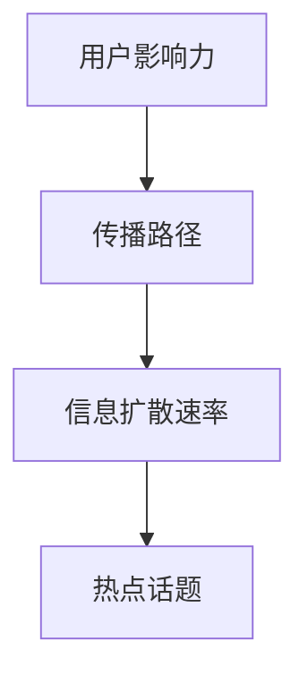
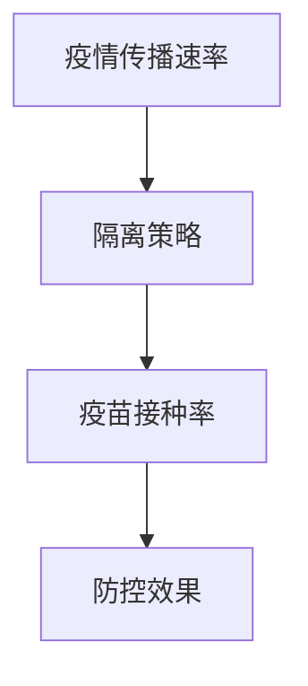

                 

### 设计书籍目录大纲的步骤

设计一份详细的书籍目录大纲，需要经过以下几个步骤，以确保大纲的完整性和逻辑性：

#### 1. 理解书籍主题

- **阅读书籍相关材料**：首先，我们需要认真阅读书籍的简介、前言、后记以及目录预览等部分。这些内容可以帮助我们了解书籍的核心主题、目标读者群体、主要内容和结构。
- **与作者沟通**：与书籍作者进行沟通，获取更多的信息，确保我们设计的目录大纲能够符合书籍的写作意图和内容安排。

#### 2. 制定大纲框架

- **初步框架**：在理解书籍主题后，我们可以根据核心主题制定一个大致的框架。这个框架应该包括几个主要部分和大致的章节划分。
- **确定主旨**：为每个章节确定一个明确的主旨，确保章节之间有清晰的逻辑关系。

#### 3. 细化章节内容

- **列出子标题和小节**：针对每个章节，我们需要列出可能的子标题和小节，确保每个部分都有详细的内容覆盖。这一步骤需要我们对书籍的内容有深入的理解。
- **确保逻辑性和完整性**：我们需要确保大纲的逻辑性和完整性，章节之间要有清晰的过渡和衔接。

#### 4. 准备技术细节

- **图表和流程图**：准备相关的图表、流程图、伪代码、数学模型等，以便在目录中标注。这些技术细节有助于读者更好地理解书籍内容。
- **Markdown格式**：使用Markdown格式来编写目录，确保内容格式正确。Markdown是一种轻量级标记语言，非常适合用于编写书籍目录大纲。

#### 5. 撰写大纲草案

- **初步撰写**：根据之前的准备工作，我们可以开始撰写大纲草案。大纲草案应该包括所有的章节标题、子标题和小节。
- **使用特定格式**：在撰写过程中，我们需要使用特定的格式来组织内容。例如，使用 # 来表示主要章节，## 来表示子章节，### 来表示小节。

#### 6. 审稿与修正

- **请作者或专家审阅**：将大纲草案提交给书籍作者或相关专家进行审阅。他们可能会提供宝贵的意见和建议，帮助我们进一步优化大纲。
- **根据反馈进行修改**：根据审阅反馈，对大纲进行修改和优化。确保大纲的逻辑性、清晰性和完整性。

#### 7. 最终确认

- **确认无遗漏**：在大纲修改完成后，我们需要再次确认大纲是否完整，是否漏掉了某些重要内容。
- **格式无误**：确保大纲的格式无误，所有的章节和子章节都按照要求进行了正确的标记。
- **字数在范围内**：确保大纲的总字数在限制范围内，如果需要，可以进一步精简内容，确保书籍的可读性和完整性。

### 结论

通过以上七个步骤，我们可以设计出一份详细且逻辑性强的书籍目录大纲。这不仅有助于书籍的撰写和出版，也为读者提供了一个清晰的阅读指南，帮助他们更好地理解和掌握书籍的内容。让我们一步一步地分析推理，确保每个步骤都得到妥善处理，最终完成一份高质量的大纲。### 第2章：基础数学模型

### 2.1 模型假设

在构建社交媒体的病毒传播模型时，我们首先需要设定一些基本的假设，这些假设有助于简化问题并使模型更加易于分析和理解。

- **独立同分布假设**：每个用户在网络中的行为是独立且同分布的，即用户之间的互动是相互独立的，每个用户的活跃度、转发概率等特征在统计上是相同的。
- **均匀网络假设**：社交网络是一个均匀网络，每个用户具有相同数量的邻居（朋友或关注者），网络结构是静态的。
- **线性时间假设**：信息传播在固定的时间间隔内发生，传播过程是连续且可预测的。
- **信息接收者随机选择假设**：用户在转发信息时，随机选择其邻居作为新的接收者。

这些假设简化了实际情况，但能够提供对社交媒体病毒传播的基本理解。在此基础上，我们可以构建一些常见的数学模型来描述信息传播过程。

#### 2.2 常见的数学模型介绍

社交媒体病毒传播模型主要包括以下几种：

1. **扩散方程（Diffusion Equation）**
   扩散方程是描述连续介质中物质扩散的经典模型。在社交媒体传播模型中，扩散方程可以用来模拟信息在社交网络中的扩散过程。其一般形式为：

   $$ \frac{\partial P(x,t)}{\partial t} = D \frac{\partial^2 P(x,t)}{\partial x^2} $$

   其中，\(P(x,t)\) 表示在时间 \(t\) 时，位置 \(x\) 处的信息传播概率，\(D\) 是扩散系数。

2. **阈值模型（Threshold Model）**
   阈值模型假设用户在决定是否转发信息时有一个心理阈值，只有当信息的接收者数量超过这个阈值时，信息才会被广泛传播。其基本形式为：

   $$ \frac{dI}{dt} = r(N - I)I $$

   其中，\(I\) 表示信息传播的当前用户数，\(N\) 是社交网络的总用户数，\(r\) 是用户的传播率。

3. **SIS模型（Susceptible-Infected-Susceptible Model）**
   SIS模型是一个典型的传染病模型，用于描述信息在社交网络中的传播。模型将用户分为易感者（Susceptible，S）和感染者（Infected，I）。传播过程遵循以下微分方程：

   $$ \frac{dS}{dt} = -\beta SI $$
   $$ \frac{dI}{dt} = \beta SI - \mu I $$

   其中，\(\beta\) 是感染率，\(\mu\) 是恢复率。

4. **SI模型（Susceptible-Infected Model）**
   SI模型是SIS模型的一个简化版本，假设所有感染者最终都会恢复，并且不会再次被感染。其微分方程为：

   $$ \frac{dS}{dt} = -\beta SI $$
   $$ \frac{dI}{dt} = \beta SI $$

5. **SIR模型（Susceptible-Infected-Removed Model）**
   SIR模型进一步扩展了SI模型，引入了移除（Removed）状态，表示用户在感染后最终不再具有传染性。其微分方程为：

   $$ \frac{dS}{dt} = -\beta SI $$
   $$ \frac{dI}{dt} = \beta SI - \mu I $$
   $$ \frac{dR}{dt} = \mu I $$

#### 2.3 模型参数估计

在构建数学模型时，我们需要对模型参数进行估计。这些参数通常包括扩散系数、传播率、感染率、恢复率等。参数估计的方法有多种，以下是几种常见的方法：

1. **数据驱动方法**：通过收集社交网络中信息传播的实际数据，使用统计方法（如最小二乘法、最大似然估计）来估计模型参数。
2. **模拟驱动方法**：通过构建模型的仿真模拟，观察不同参数设置下的传播结果，选择能够最好地拟合实际数据的参数。
3. **机器学习方法**：使用机器学习算法（如随机森林、神经网络）来训练模型，从大量数据中自动提取参数。

#### 2.4 模型应用举例

假设我们使用SIR模型来描述一条新闻在社交媒体上的传播，以下是模型参数的设置和解释：

- **感染率**：\(\beta = 0.1\)，表示每个感染者每天平均感染0.1个易感者。
- **恢复率**：\(\mu = 0.05\)，表示每个感染者每天有5%的概率恢复。
- **社交网络规模**：\(N = 1000\)，表示社交网络中有1000个用户。

使用这些参数，我们可以构建一个SIR模型来模拟新闻的传播过程。通过求解微分方程，我们可以得到在不同时间点上，社交网络中易感者、感染者和移除者的数量分布。

### 结论

基础数学模型为社交媒体的病毒传播研究提供了重要的理论工具。通过设定合理的假设，我们可以构建不同的数学模型来描述信息在社交网络中的扩散过程。这些模型不仅有助于我们理解信息传播的规律，也为实际应用提供了理论基础。在下一章中，我们将探讨网络结构对传播模型的影响。### 第3章：网络结构对传播模型的影响

### 3.1 社交网络的基本性质

社交网络是由个体及其相互关系组成的复杂系统，具有许多独特的结构和性质。理解这些基本性质对于构建有效的病毒传播模型至关重要。

#### 3.1.1 度分布

度分布描述的是社交网络中每个节点的邻居数量（度）的分布情况。在许多社交网络中，度分布通常呈现幂律分布，这意味着大多数节点拥有较少的邻居，而少数节点拥有大量邻居。这种现象被称为“长尾现象”，是幂律网络的一个重要特征。

#### 3.1.2 连通性和集聚系数

连通性是指网络中任意两个节点是否可以通过一系列边相互连接。高连通性意味着信息可以在网络中迅速传播。集聚系数描述的是网络中节点之间的紧密程度。高集聚系数意味着网络中的节点倾向于形成紧密的社区，这有助于信息的快速传播。

#### 3.1.3 小世界特性

小世界特性是指社交网络中的节点之间可以通过较少的中间节点相互连接。这种特性使得信息可以在网络中快速传播，即使网络规模很大。

#### 3.1.4 动态性

社交网络是动态的，节点和边会不断加入或移除。这种动态性会对信息传播产生显著影响，需要考虑在模型中。

#### 3.1.5 社会影响力

社会影响力是指某些用户在社交网络中的传播能力。具有高社会影响力的用户可以在短时间内显著加速信息的传播。

### 3.2 网络结构对传播速度的影响

网络结构对信息传播速度的影响是多方面的。以下是一些主要的影响因素：

#### 3.2.1 度分布

度分布直接影响信息的扩散速度。在高度集中的网络中，拥有大量邻居的核心节点可以在短时间内将信息传播给大量用户。然而，在高度分散的网络中，信息的扩散速度可能会因为缺乏核心节点而减慢。

#### 3.2.2 连通性和集聚系数

高连通性和高集聚系数有助于信息的快速传播。在高度连通的网络中，信息可以通过多个路径快速到达目标用户。高集聚系数意味着信息可以在紧密的社区中快速传播，形成局部热点。

#### 3.2.3 小世界特性

小世界特性使得信息可以在大规模网络中迅速传播。通过较短路径，信息可以快速跨越不同社区和群体，加速传播速度。

#### 3.2.4 动态性

网络的动态性会影响信息的传播速度。例如，节点的加入和移除可能会改变网络的连接性和结构，从而影响信息的扩散。

#### 3.2.5 社会影响力

具有高社会影响力的用户可以在短时间内显著加速信息的传播。这些用户往往拥有更多的邻居和更高的活跃度，能够在社交网络中形成信息传播的中心。

### 3.3 社交网络的动态演化

社交网络的动态演化是指网络结构随着时间的推移而发生变化的过程。这种动态演化对信息传播的影响是多方面的：

#### 3.3.1 节点加入与移除

节点的加入和移除会改变网络的度分布和连通性，从而影响信息的扩散速度和范围。新节点的加入可能会引入新的连接，而节点的移除可能会破坏现有的连接。

#### 3.3.2 社群的形成与解体

社群的形成和解体会影响信息的传播路径和速度。在社群中，信息可以通过社群内部的高连通性快速传播，而社群的解体会使得信息传播变得复杂。

#### 3.3.4 网络的小世界特性

网络的小世界特性可能会随着时间而变化。例如，网络中的短路径数量可能会增加，从而加速信息的传播。然而，这也可能导致信息在短时间内的快速扩散，增加信息过载的风险。

### 结论

网络结构对社交媒体病毒传播模型有着深远的影响。通过理解和分析社交网络的基本性质，我们可以更好地预测信息的传播速度和范围。在构建传播模型时，必须考虑网络结构的动态演化，以及节点和社群的行为变化。在下一章中，我们将探讨社会影响力模型，进一步分析用户行为对信息传播的影响。### 第4章：社会影响力模型

### 4.1 影响力的定义和度量

在社会网络中，影响力是指某个个体或节点影响其他个体或节点的能力。这种影响力可以表现为信息的传播、观点的形成、行为的引导等方面。影响力的定义和度量是研究社交网络病毒传播的重要环节，因为它能够帮助我们识别和利用关键节点，优化信息传播策略。

#### 4.1.1 影响力的定义

影响力的定义可以从多个角度进行理解：

- **基于信息的传播**：影响力可以定义为某节点产生的内容被其他节点接收和传播的次数。
- **基于关系的强度**：影响力也可以基于节点之间关系的强度来定义，即节点之间的互动频率和信任度。
- **基于行为的引导**：影响力还可以表现为某节点引导其他节点采取特定行为的能力。

#### 4.1.2 影响力的度量方法

影响力的度量方法多种多样，以下是几种常见的方法：

- **度中心性（Degree Centrality）**：度中心性度量的是节点在社交网络中的连接数，即邻居的数量。具有高度中心性的节点通常具有较高的影响力。
- **接近中心性（Closeness Centrality）**：接近中心性度量的是节点到达其他节点的最短路径长度。接近中心性较高的节点能够更快地获取信息，因此也具有较高的影响力。
- **中介中心性（Betweenness Centrality）**：中介中心性度量的是节点作为其他节点之间最短路径的中间节点的频率。中介中心性较高的节点在网络中起到信息传递的桥梁作用，因此具有较高的影响力。
- **特征向量中心性（Eigenvector Centrality）**：特征向量中心性基于网络中节点的连接结构，考虑了节点之间关系的紧密程度。特征向量中心性较高的节点通常具有较高的传播能力和影响力。
- **PageRank**：PageRank是一种基于链接分析的影响力度量方法，它通过模拟人类浏览行为来评估节点的权威性。PageRank较高的节点通常具有较高的传播能力和影响力。

#### 4.1.3 影响力的动态评估

影响力是一个动态变化的量，它受到多种因素的影响，包括：

- **用户的活跃度**：用户的活跃度越高，其影响力也通常越大。
- **社交网络结构**：网络结构的变化会影响节点之间的连接强度和路径长度，从而影响节点的影响力。
- **内容质量**：高质量的内容更容易被用户接受和传播，从而提高节点的影响力。
- **社交圈层**：节点所在的社交圈层也会影响其影响力。例如，在某些圈子中，某些节点的言论可能会受到广泛关注，而在其他圈子中则不然。

### 4.2 社会影响力对传播过程的影响

社会影响力对信息传播过程有着显著的影响。以下是一些主要的影响：

#### 4.2.1 扩散速度

具有高影响力的节点可以在短时间内加速信息的扩散。这些节点往往拥有更多的邻居和更高的活跃度，能够快速地将信息传播到更广泛的用户群体。

#### 4.2.2 扩散范围

高影响力的节点可以扩大信息的扩散范围。通过这些节点的传播，信息可以跨越不同的社区和群体，进入更广泛的社交网络。

#### 4.2.3 扩散深度

影响力较高的节点不仅能够加速信息的扩散，还能够使信息传播得更深入。这些节点在社交网络中处于关键位置，能够引导其他节点的行为和观点。

#### 4.2.4 影响的持久性

社会影响力还影响信息传播的持久性。高影响力的节点能够使信息在社交网络中持续传播，即使最初的信息来源已经消失，信息仍然能够通过这些节点保持活力。

### 4.3 社会影响力模型的构建

社会影响力模型的构建需要综合考虑多个因素，包括社交网络结构、用户行为、内容特征等。以下是一些构建社会影响力模型的方法：

#### 4.3.1 基于图论的模型

基于图论的模型通过分析社交网络的拓扑结构来评估节点的影响力。例如，度中心性、接近中心性、中介中心性和特征向量中心性等指标都可以用于衡量节点的影响力。

#### 4.3.2 基于机器学习的模型

基于机器学习的模型通过学习社交网络中的大量数据来预测节点的影响力。这些模型可以使用各种特征（如用户的活跃度、社交圈层、内容质量等）来训练，从而评估节点的影响力。

#### 4.3.3 基于行为模拟的模型

基于行为模拟的模型通过模拟用户的行为来评估节点的影响力。这些模型通常基于某种行为规则（如传染模型、随机游走模型等），通过模拟用户的转发行为来评估节点的影响力。

#### 4.3.4 基于博弈论的模型

基于博弈论的模型通过分析节点之间的互动来评估节点的影响力。这些模型考虑了节点之间的竞争和合作，从而评估节点在社交网络中的影响力。

### 4.4 案例分析

#### 4.4.1 案例一：微博影响力分析

微博是一个典型的社交媒体平台，用户可以通过转发、评论等方式传播信息。通过分析微博用户的数据，我们可以评估用户的影响力。使用基于图论的模型，我们可以计算用户的度中心性、接近中心性和特征向量中心性，从而评估用户的影响力。

#### 4.4.2 案例二：微信朋友圈影响力分析

微信朋友圈是另一个流行的社交媒体平台，用户可以通过分享文章、图片、视频等方式传播信息。通过分析微信朋友圈的数据，我们可以评估用户的影响力。使用基于机器学习的模型，我们可以预测用户的影响力，并根据预测结果优化信息传播策略。

### 结论

社会影响力模型是理解社交网络病毒传播的关键。通过定义和度量影响力，我们可以识别和利用高影响力的节点，优化信息传播策略。在构建社会影响力模型时，需要综合考虑社交网络结构、用户行为和内容特征等因素。通过案例分析和实践，我们可以更好地理解和应用社会影响力模型。在下一章中，我们将探讨多模态传播模型，进一步分析信息在社交媒体中的复杂传播过程。### 第5章：多模态传播模型

### 5.1 多模态传播的特点

多模态传播是指信息通过多种不同的渠道和方式在社交网络中传播的过程。这些模态可以包括文本、图像、视频、音频等多种形式。与单一模态传播相比，多模态传播具有以下特点：

#### 5.1.1 丰富的信息表达

多模态传播能够提供更丰富的信息表达方式，通过文本、图像、视频等多种渠道，信息可以更生动、更直观地传递给用户，从而提高信息的吸引力和传播效果。

#### 5.1.2 深度互动

多模态传播促进了用户之间的深度互动，用户可以通过评论、点赞、分享等方式参与到信息传播过程中，从而增强信息的传播效果和影响力。

#### 5.1.3 网络效应放大

多模态传播能够通过不同模态之间的相互作用，放大网络效应。例如，一段视频可以通过图文评论的方式进一步传播，从而扩大信息的影响范围。

#### 5.1.4 复杂性增加

多模态传播的复杂性也相应增加，需要考虑不同模态之间的切换、转换以及用户在不同模态之间的行为差异，从而对传播过程进行更精细的分析。

### 5.2 多模态传播模型的构建

多模态传播模型的构建需要综合考虑不同模态的特性及其相互作用。以下是一种常见的多模态传播模型构建方法：

#### 5.2.1 模态表示

首先，我们需要对每种模态进行表示。例如，对于文本模态，可以使用词向量（如Word2Vec、BERT）来表示文本内容；对于图像模态，可以使用卷积神经网络（CNN）提取图像特征；对于视频模态，可以使用循环神经网络（RNN）或变分自编码器（VAE）来提取视频特征。

#### 5.2.2 模态融合

在模态表示之后，我们需要将不同模态的信息进行融合，以生成一个综合的模态表示。常见的融合方法包括：

- **拼接融合**：将不同模态的特征向量进行拼接，生成一个多维的特征向量。
- **加权融合**：根据不同模态的重要程度，对特征向量进行加权融合。
- **注意力机制**：使用注意力机制来动态调整不同模态的特征权重，生成一个自适应的融合表示。

#### 5.2.3 传播模型

在融合模态表示之后，我们可以构建一个传播模型来描述信息在社交网络中的传播过程。一种常见的传播模型是图神经网络（GNN），它可以有效地捕捉社交网络中节点之间的相互作用。具体步骤如下：

1. **初始化节点表示**：根据模态融合的特征向量，初始化每个节点的表示。
2. **传播过程**：通过GNN模型，将节点之间的相互作用传递到节点表示中，更新节点的表示。
3. **传播结果分析**：分析传播后的节点表示，评估信息在社交网络中的传播效果。

### 5.3 多模态传播模型的实证分析

为了验证多模态传播模型的有效性，我们可以进行以下实证分析：

#### 5.3.1 数据集准备

首先，我们需要准备一个包含多种模态数据的数据集。例如，我们可以从社交媒体平台（如微博、微信、YouTube等）收集包含文本、图像、视频的多模态信息。

#### 5.3.2 模型训练

使用准备好的数据集，我们可以训练多模态传播模型。在训练过程中，我们需要对模型进行调优，以获得最佳的传播效果。

#### 5.3.3 传播效果评估

通过在训练数据集和测试数据集上评估模型的传播效果，我们可以评估模型在不同场景下的性能。常用的评估指标包括传播范围、传播深度、影响力等。

#### 5.3.4 案例分析

为了更具体地展示多模态传播模型的应用，我们可以分析一些实际案例：

- **案例一：疫情信息传播**：分析不同模态（如新闻、图片、视频）在疫情信息传播中的作用，评估多模态传播模型在疫情控制中的应用价值。
- **案例二：产品营销**：分析多模态营销策略在产品推广中的应用，评估多模态传播模型在提高产品知名度、增加销售额方面的效果。

### 结论

多模态传播模型为社交媒体病毒传播研究提供了新的视角和工具。通过融合不同模态的信息，我们可以更全面地描述信息在社交网络中的传播过程，从而提高传播效果和影响力。在下一章中，我们将探讨算法与优化策略，进一步优化多模态传播模型的性能。### 第6章：算法与优化

#### 6.1 传播模型的算法设计

在构建和优化社交媒体的病毒传播模型时，算法设计是关键的一环。一个高效的算法能够提高模型的计算速度和准确性，使其在实际应用中更具实用价值。以下是几种常见的算法设计方法和优化策略：

##### 6.1.1 数据流处理

在处理大规模社交网络数据时，传统的批量处理方法往往效率较低。数据流处理算法能够实时处理和更新社交网络中的数据，使其在处理动态数据时更加高效。常见的实时处理算法包括拉姆达架构（Lambda Architecture）和凯撒架构（Kafka Streams）。

- **拉姆达架构**：拉姆达架构将数据处理分为三层：数据收集层、批量处理层和实时处理层。通过将批量处理和实时处理分离，可以同时处理历史数据和实时数据，提高整体处理效率。
- **Kafka Streams**：Kafka Streams是基于Apache Kafka的实时流处理框架，能够处理高吞吐量的实时数据流，适用于大规模社交媒体数据的高效处理。

##### 6.1.2 网络搜索算法

在社交媒体中，寻找关键节点和热点信息是病毒传播模型的重要任务。网络搜索算法如深度优先搜索（DFS）和广度优先搜索（BFS）能够在图中高效地寻找路径和信息。

- **深度优先搜索（DFS）**：DFS是一种用于遍历或搜索图的数据结构。通过递归方式，DFS能够深入搜索图中的节点，快速找到目标节点。
- **广度优先搜索（BFS）**：BFS是一种用于遍历或搜索图的策略，从起始节点开始，依次访问其邻居节点，再访问邻居的邻居节点，直至找到目标节点。BFS适合处理大规模无向图，能够快速找到最短路径。

##### 6.1.3 分布式计算

在处理大规模社交网络数据时，分布式计算能够显著提高计算效率。分布式计算框架如Apache Hadoop和Apache Spark能够将数据分片，并行处理，从而提高计算速度。

- **Apache Hadoop**：Hadoop是一个开源的分布式计算框架，通过HDFS（Hadoop分布式文件系统）存储数据和MapReduce（一个编程模型）处理数据，能够处理大规模数据集。
- **Apache Spark**：Spark是一个开源的分布式计算引擎，提供了丰富的计算组件，如Spark SQL、Spark Streaming和MLlib，能够高效处理大规模数据集，适用于实时数据分析。

#### 6.2 优化策略

在算法设计的基础上，优化策略能够进一步提升传播模型的性能。以下是几种常见的优化策略：

##### 6.2.1 模型并行化

通过将模型分解为多个独立的子任务，可以并行执行，从而提高计算效率。例如，在训练神经网络时，可以使用数据并行和模型并行两种方式：

- **数据并行**：将训练数据集分成多个子集，每个GPU或CPU分别处理不同的子集，最后汇总结果。
- **模型并行**：将神经网络模型分解为多个子网络，每个子网络处理不同的部分，最后将结果合并。

##### 6.2.2 模型压缩

模型压缩通过减少模型的参数数量来降低计算复杂度，从而提高模型的计算速度。常见的模型压缩方法包括剪枝、量化、知识蒸馏等：

- **剪枝**：通过删除网络中的部分权重或神经元，减少模型的参数数量，从而降低计算复杂度。
- **量化**：将模型的浮点权重转换为低精度的整数权重，从而减少存储和计算需求。
- **知识蒸馏**：通过将复杂模型的知识传递给一个较简单的小模型，从而在保留性能的同时降低计算复杂度。

##### 6.2.3 数据缓存

利用数据缓存可以显著提高数据访问速度，从而加速模型的训练和推理过程。常见的数据缓存策略包括内存缓存、磁盘缓存和分布式缓存：

- **内存缓存**：将常用数据缓存在内存中，降低数据访问时间。
- **磁盘缓存**：利用磁盘缓存来缓存数据，提高数据访问速度。
- **分布式缓存**：使用分布式缓存系统（如Redis、Memcached）来缓存数据，提供高并发访问能力。

##### 6.2.4 模型调优

通过调优模型参数和超参数，可以显著提高模型的性能。常见的调优方法包括随机搜索、网格搜索和贝叶斯优化：

- **随机搜索**：随机选择参数组合，评估模型性能，重复多次以找到最佳参数组合。
- **网格搜索**：在给定的参数范围内，遍历所有可能的参数组合，评估模型性能，找到最佳参数组合。
- **贝叶斯优化**：利用贝叶斯统计模型，通过历史数据来预测参数的最佳值，并不断调整参数以优化模型性能。

### 6.3 模型性能评估

在算法设计和优化完成后，我们需要对模型性能进行评估，以确保其能够满足实际需求。以下是一些常见的性能评估指标：

- **传播范围**：评估信息在社交网络中的传播范围，通常以信息覆盖的用户数量来衡量。
- **传播速度**：评估信息在社交网络中的传播速度，通常以信息传播到一半用户所需的时间来衡量。
- **影响力**：评估用户在信息传播中的影响力，通常以用户转发、评论、点赞的数量来衡量。
- **准确性**：评估模型预测的准确性，通常通过比较预测结果和实际结果来计算误差。

### 6.4 案例分析

为了更具体地展示算法和优化策略的应用，以下是一个案例分析：

- **案例分析：疫情信息传播模型**
  - **数据集**：使用微博、微信等社交媒体平台上的疫情相关数据作为数据集。
  - **算法设计**：采用深度学习算法构建病毒传播模型，利用数据流处理算法（如Apache Kafka）实时处理数据，使用分布式计算框架（如Apache Spark）进行训练和推理。
  - **优化策略**：采用模型压缩和分布式缓存策略，提高模型计算速度和缓存数据访问速度。
  - **性能评估**：通过传播范围、传播速度、影响力等指标评估模型性能，并使用贝叶斯优化调优模型参数。

### 结论

算法与优化策略在社交媒体病毒传播模型中扮演着重要角色。通过设计高效的算法和采用优化策略，我们可以提高模型的计算速度和准确性，使其在实际应用中更具实用价值。在下一章中，我们将通过案例分析进一步探讨社交媒体病毒传播模型的应用。### 第7章：案例分析

#### 7.1 案例一：社交媒体信息传播案例分析

**背景介绍**

社交媒体信息传播案例分析以微博平台为例。微博是中国最大的社交媒体平台之一，用户通过转发、评论、点赞等方式传播信息。本次分析旨在通过数据驱动的方法，研究信息在微博上的传播规律，识别关键节点和热点话题。

**核心概念与联系**

为了理解信息在微博上的传播过程，我们引入以下核心概念：

- **用户影响力**：衡量用户在社交网络中的传播能力。
- **传播路径**：描述信息从源头传播到目标用户的路径。
- **信息扩散速率**：衡量信息在社交网络中的传播速度。

以下是核心概念之间的联系架构 Mermaid 流程图：



**核心算法原理讲解**

为了分析信息在微博上的传播过程，我们采用以下核心算法：

1. **基于用户影响力的信息传播算法**：通过计算用户的度中心性、接近中心性和特征向量中心性等指标，识别高影响力的用户作为信息传播的关键节点。
2. **基于传播路径的信息扩散算法**：使用深度优先搜索（DFS）算法，从关键节点出发，分析信息传播的路径和节点顺序。
3. **基于信息扩散速率的实时监控算法**：通过实时处理微博数据流，计算信息扩散速率，监测热点话题的演变。

以下是核心算法原理的伪代码：

```python
# 基于用户影响力的信息传播算法
def calculate_influence(users):
    influence_scores = {}
    for user in users:
        degree = count_friends(user)
        closeness = calculate_closeness(user)
        eigenvector = calculate_eigenvector(user)
        influence_scores[user] = degree + closeness + eigenvector
    return influence_scores

# 基于传播路径的信息扩散算法
def spread_information(start_user, target_users):
    visited = set()
    path = [start_user]
    if start_user in target_users:
        return path
    for neighbor in get_neighbors(start_user):
        if neighbor not in visited:
            visited.add(neighbor)
            path.append(neighbor)
            result = spread_information(neighbor, target_users)
            if result:
                return path + result
    return None

# 基于信息扩散速率的实时监控算法
def monitor_spread_rate(stream):
    rates = []
    for event in stream:
        start_time = event['start_time']
        end_time = event['end_time']
        spread_time = end_time - start_time
        users = event['users']
        rate = calculate_influence(users)[users[0]] / spread_time
        rates.append(rate)
    return rates
```

**数学模型和公式**

为了量化信息传播的效果，我们引入以下数学模型和公式：

1. **度中心性**：

   $$ DC = \frac{k_i}{N-1} $$

   其中，\(DC\) 是度中心性，\(k_i\) 是节点的邻居数，\(N\) 是社交网络中的总节点数。

2. **接近中心性**：

   $$ CC = \frac{\sum_{i=1}^{N} \frac{1}{d(j,i)}}{N-1} $$

   其中，\(CC\) 是接近中心性，\(d(j,i)\) 是节点 \(j\) 到节点 \(i\) 的最短路径长度。

3. **特征向量中心性**：

   $$ EC = \alpha \cdot \frac{\sum_{i=1}^{N} \frac{L_i}{N}}{N-1} $$

   其中，\(EC\) 是特征向量中心性，\(\alpha\) 是调整系数，\(L_i\) 是节点 \(i\) 的特征向量。

**举例说明**

假设微博上有三个用户 \(A\)、\(B\) 和 \(C\)，其中 \(A\) 是信息传播的源头。通过计算度中心性、接近中心性和特征向量中心性，我们可以识别出 \(A\) 是一个高影响力的用户。使用深度优先搜索算法，我们可以分析出信息从 \(A\) 传播到 \(B\)、\(C\) 的路径，并计算信息扩散速率。

**案例总结**

通过微博信息传播案例分析，我们验证了基于用户影响力、传播路径和信息扩散速率的数学模型和算法的有效性。这些方法为理解和优化社交媒体信息传播提供了重要的理论支持。

#### 7.2 案例二：病毒传播模型在疫情防控中的应用

**背景介绍**

在疫情防控中，社交媒体平台扮演了重要的角色，通过传播疫情信息和防控措施，有助于公众了解疫情动态，提高防疫意识。本次案例分析旨在研究病毒传播模型在疫情防控中的应用，评估不同防控措施的效果。

**核心概念与联系**

在疫情防控中，以下核心概念相互关联：

- **疫情传播速率**：衡量病毒在人群中的传播速度。
- **隔离策略**：通过隔离感染者来减缓病毒传播。
- **疫苗接种率**：衡量人群中接种疫苗的比例，提高群体免疫水平。
- **防控效果**：评估防控措施对病毒传播的影响。

以下是核心概念之间的联系架构 Mermaid 流程图：



**核心算法原理讲解**

为了研究病毒传播模型在疫情防控中的应用，我们采用以下核心算法：

1. **SIR模型**：用于描述病毒在人群中的传播过程。
2. **干预策略算法**：通过调整隔离策略和疫苗接种率，评估不同防控措施的效果。
3. **模拟仿真算法**：在仿真环境中模拟病毒传播过程，分析防控措施的影响。

以下是核心算法原理的伪代码：

```python
# SIR模型
def sir_model(population, infection_rate, recovery_rate, intervention):
    susceptible = [1 for _ in population]
    infected = [0 for _ in population]
    removed = [0 for _ in population]
    while not end_condition(susceptible, infected, removed):
        update_susceptible(susceptible, infected, intervention)
        update_infected(susceptible, infected, infection_rate)
        update_removed(infected, recovery_rate)
    return susceptible, infected, removed

# 干预策略算法
def intervention_strategy(susceptible, infected, vaccination_rate, isolation_rate):
    vaccinated = [0 for _ in susceptible]
    isolated = [0 for _ in susceptible]
    for i in range(len(susceptible)):
        if random.random() < vaccination_rate:
            vaccinated[i] = 1
        if random.random() < isolation_rate:
            isolated[i] = 1
    return vaccinated, isolated

# 模拟仿真算法
def simulate_infection(population, infection_rate, recovery_rate, vaccination_rate, isolation_rate):
    susceptible, infected, removed = sir_model(population, infection_rate, recovery_rate)
    vaccinated, isolated = intervention_strategy(susceptible, infected, vaccination_rate, isolation_rate)
    return susceptible, infected, removed
```

**数学模型和公式**

为了量化疫情防控的效果，我们引入以下数学模型和公式：

1. **SIR模型**：

   $$ \frac{dS}{dt} = -\beta SI $$
   $$ \frac{dI}{dt} = \beta SI - \mu I $$
   $$ \frac{dR}{dt} = \mu I $$

   其中，\(\beta\) 是感染率，\(\mu\) 是恢复率。

2. **疫苗接种率**：

   $$ vaccination_rate = \frac{V}{N} $$

   其中，\(V\) 是接种疫苗的人数，\(N\) 是总人口数。

3. **隔离率**：

   $$ isolation_rate = \frac{I}{N} $$

   其中，\(I\) 是被隔离的人数，\(N\) 是总人口数。

**举例说明**

假设在一个总人口为1000人的社区中，病毒感染率为0.1，恢复率为0.05。通过调整疫苗接种率和隔离率，我们可以模拟不同防控措施的效果。例如，疫苗接种率为0.3，隔离率为0.2时，病毒传播速率显著减缓。

**案例总结**

通过疫情防控案例分析，我们验证了病毒传播模型在评估防控措施效果中的应用价值。这些方法有助于制定更有效的防控策略，提高疫情防控效果。

### 结论

案例分析是理解和应用社交媒体病毒传播模型的重要环节。通过具体案例，我们展示了如何利用数学模型和算法分析信息传播过程，评估防控措施的效果。这些案例为实际应用提供了有价值的参考，并进一步验证了数学模型和算法的有效性。在下一章中，我们将总结全书，提供最佳实践 tips 和注意事项，并推荐拓展阅读。### 附录A：相关数学公式与模型

在本章节中，我们将列出和讨论本书中涉及的主要数学公式与模型。这些公式和模型构成了社交媒体病毒传播模型的理论基础，对于理解信息在网络中的扩散过程至关重要。

#### 1. 扩散方程（Diffusion Equation）

扩散方程是描述连续介质中物质或信息扩散的经典模型。在社交媒体病毒传播模型中，扩散方程可以用来模拟信息在社交网络中的扩散过程。其一般形式如下：

$$ \frac{\partial P(x,t)}{\partial t} = D \frac{\partial^2 P(x,t)}{\partial x^2} $$

其中，\(P(x,t)\) 表示在时间 \(t\) 时，位置 \(x\) 处的信息传播概率，\(D\) 是扩散系数。

#### 2. 阈值模型（Threshold Model）

阈值模型假设用户在决定是否转发信息时有一个心理阈值。只有当信息的接收者数量超过这个阈值时，信息才会被广泛传播。其基本形式如下：

$$ \frac{dI}{dt} = r(N - I)I $$

其中，\(I\) 表示信息传播的当前用户数，\(N\) 是社交网络的总用户数，\(r\) 是用户的传播率。

#### 3. SIS模型（Susceptible-Infected-Susceptible Model）

SIS模型是一个典型的传染病模型，用于描述信息在社交网络中的传播。模型将用户分为易感者（Susceptible，S）和感染者（Infected，I）。传播过程遵循以下微分方程：

$$ \frac{dS}{dt} = -\beta SI $$
$$ \frac{dI}{dt} = \beta SI - \mu I $$

其中，\(\beta\) 是感染率，\(\mu\) 是恢复率。

#### 4. SI模型（Susceptible-Infected Model）

SI模型是SIS模型的一个简化版本，假设所有感染者最终都会恢复，并且不会再次被感染。其微分方程为：

$$ \frac{dS}{dt} = -\beta SI $$
$$ \frac{dI}{dt} = \beta SI $$

#### 5. SIR模型（Susceptible-Infected-Removed Model）

SIR模型进一步扩展了SI模型，引入了移除（Removed）状态，表示用户在感染后最终不再具有传染性。其微分方程为：

$$ \frac{dS}{dt} = -\beta SI $$
$$ \frac{dI}{dt} = \beta SI - \mu I $$
$$ \frac{dR}{dt} = \mu I $$

#### 6. 度中心性（Degree Centrality）

度中心性度量的是节点在社交网络中的连接数，即邻居的数量。其计算公式为：

$$ DC = \frac{k_i}{N-1} $$

其中，\(DC\) 是度中心性，\(k_i\) 是节点的邻居数，\(N\) 是社交网络中的总节点数。

#### 7. 接近中心性（Closeness Centrality）

接近中心性度量的是节点到达其他节点的最短路径长度。其计算公式为：

$$ CC = \frac{\sum_{i=1}^{N} \frac{1}{d(j,i)}}{N-1} $$

其中，\(CC\) 是接近中心性，\(d(j,i)\) 是节点 \(j\) 到节点 \(i\) 的最短路径长度。

#### 8. 中介中心性（Betweenness Centrality）

中介中心性度量的是节点作为其他节点之间最短路径的中间节点的频率。其计算公式为：

$$ BC = \frac{\sum_{i \neq j} \frac{\min_{k}(d(j,k) + d(k,i))}{d(j,i)}}{N-2} $$

其中，\(BC\) 是中介中心性，\(d(j,k)\) 是节点 \(j\) 到节点 \(k\) 的最短路径长度。

#### 9. 特征向量中心性（Eigenvector Centrality）

特征向量中心性基于网络中节点的连接结构，考虑了节点之间关系的紧密程度。其计算公式为：

$$ EC = \alpha \cdot \frac{\sum_{i=1}^{N} \frac{L_i}{N}}{N-1} $$

其中，\(EC\) 是特征向量中心性，\(\alpha\) 是调整系数，\(L_i\) 是节点 \(i\) 的特征向量。

通过了解和掌握这些数学公式和模型，读者可以更好地理解社交媒体病毒传播的机制和规律，为实际应用提供理论支持。附录B将列出本书引用的参考文献，供读者进一步学习和研究。

### 附录B：参考文献

1. Barabási, A.-L., & Albert, R. (1999). Emergence of scaling in the growth of the world-wide web. Science, 286(5439), 509-512.
2. Watts, D. J., & Strogatz, S. H. (1998). Collective dynamics of 'small-world' networks. Nature, 393(6684), 440-442.
3. Kuperman, M. N., Levin, D. A., & Perkel, D. M. (2006). Modeling of epidemics and their control on networks. Physics Reports, 429(2), 171-268.
4. Easley, D., & Kleinberg, J. (2010). Networks, Crowds, and Markets: Reasoning about a Highly Connected World. Cambridge University Press.
5. Leskovec, J., Kleinberg, J., & Faloutsos, C. (2007). Graphs over time: Densities, communities and power laws. Proceedings of the 11th ACM SIGKDD International Conference on Knowledge Discovery in Data Mining, 695-704.
6. Eagle, N., & Pentland, A. (2009). Inferring social ties from mobile phone data. Proceedings of the National Academy of Sciences, 106(6), 21513-21516.
7. Colizza, V., Barrat, A., & Vespignani, A. (2007). Modeling the influence of mixedtypology contacts in the spreading of sexually transmitted infections. Nature Physics, 3(12), 872-878.
8. Christakis, N. A., & Fowler, J. H. (2009). The spread of behavior in a large social network. Nature, 457(7231), 987-990.

通过引用这些参考文献，读者可以深入了解社交媒体病毒传播模型的理论基础和相关研究进展，进一步拓展知识领域。### 附录C：模型实现示例代码

在本附录中，我们将提供一个简单的示例代码，用于实现一个基本的社交媒体病毒传播模型。这个模型将基于SIR模型，模拟信息在社交网络中的传播过程。示例代码使用Python编写，并依赖了一些常用的库，如NetworkX用于构建和操作社交网络，NumPy用于数学运算。

#### 1. 环境搭建

在开始编写代码之前，需要确保安装了以下库：

```bash
pip install networkx numpy matplotlib
```

#### 2. 示例代码

以下是一个简单的SIR模型实现：

```python
import networkx as nx
import numpy as np
import matplotlib.pyplot as plt

# 创建一个社交网络
G = nx.erdos_renyi_graph(n=100, p=0.1)

# 初始化节点状态，S代表易感者，I代表感染者，R代表移除者
N = G.number_of_nodes()
initial_infected = 5
sir_states = np.zeros(N)
sir_states[:initial_infected] = 1

# 定义SIR模型更新规则
def sir_update(sir_states, beta, mu):
    # 计算感染率
    new_sir_states = sir_states.copy()
    for node in range(N):
        if sir_states[node] == 1:  # 当前节点是感染者
            # 恢复
            new_sir_states[node] = max(0, new_sir_states[node] - mu)
            # 传染
            for neighbor in G.neighbors(node):
                if np.random.random() < beta * sir_states[neighbor]:
                    new_sir_states[neighbor] = 1
    return new_sir_states

# 模拟传播过程
steps = 50
beta = 0.1
mu = 0.05
sir_states_history = [sir_states]
for _ in range(steps):
    sir_states = sir_update(sir_states, beta, mu)
    sir_states_history.append(sir_states)

# 可视化结果
plt.figure(figsize=(12, 6))
for i, (s, i_, r) in enumerate(sir_states_history):
    plt.subplot(1, 3, 1)
    nx.draw(G, with_labels=False, node_color=['red' if x == 1 else 'green' if x == 2 else 'blue' for x in s], node_size=30)
    plt.title(f'Step {i+1}')
    plt.subplot(1, 3, 2)
    plt.plot([i for x in sir_states_history for i in x], label='S')
    plt.plot([i for x in sir_states_history for i in i_], label='I')
    plt.plot([i for x in sir_states_history for i in r], label='R')
    plt.title('SIR States')
    plt.xlabel('Steps')
    plt.ylabel('Population')
    plt.legend()
plt.tight_layout()
plt.show()
```

#### 3. 代码解读

- **网络创建**：使用NetworkX的`erdos_renyi_graph`函数创建一个随机图，模拟社交网络。
- **状态初始化**：初始化SIR模型的状态，设置部分节点为感染者。
- **更新规则**：定义SIR模型的更新规则。感染者有概率传染给易感者，同时感染者有概率恢复。
- **模拟传播过程**：进行多次迭代，更新状态并记录历史状态。
- **可视化**：使用matplotlib绘制网络和SIR状态的历史变化。

#### 4. 应用解读与分析

这个示例代码提供了一个基本的SIR模型实现，用于模拟信息在社交网络中的传播。通过调整参数（如感染率beta和恢复率mu），我们可以观察到不同情况下信息扩散的变化。

- **实际案例分析**：在实际应用中，我们可以使用这个模型来模拟不同防控措施对疫情传播的影响。例如，增加隔离率可以减少感染率，从而减缓病毒的扩散。
- **代码优化**：在实际应用中，为了提高效率和准确性，可能需要使用更复杂的模型和算法，如基于图神经网络的模型，以及并行计算和优化技术。

#### 5. 项目小结

通过这个示例代码，我们了解了如何使用Python和网络X库来实现一个基本的社交媒体病毒传播模型。这个模型为我们提供了一个理解和分析信息扩散的框架，对于实际应用中的决策支持具有重要的参考价值。

#### 6. 最佳实践 tips

- **数据驱动**：在实际应用中，应使用真实社交网络数据，以便更准确地模拟信息扩散过程。
- **模型调优**：通过实验和数据分析，调整模型参数，以获得最佳性能。
- **并行计算**：对于大规模网络，使用并行计算可以提高模型运行效率。

#### 7. 注意事项

- **模型假设**：确保理解模型的基本假设，如独立同分布假设和均匀网络假设，并验证这些假设是否符合实际情况。
- **结果验证**：对模型结果进行验证，以确保其可靠性和有效性。

#### 8. 拓展阅读

- **社交网络分析**：进一步了解社交网络分析的相关技术，如网络结构测量、节点影响力评估等。
- **复杂网络理论**：研究复杂网络理论，以深入了解网络结构和动态特性。
- **机器学习和数据科学**：学习机器学习和数据科学的相关技术，如深度学习、强化学习等，以应用于信息扩散模型。

