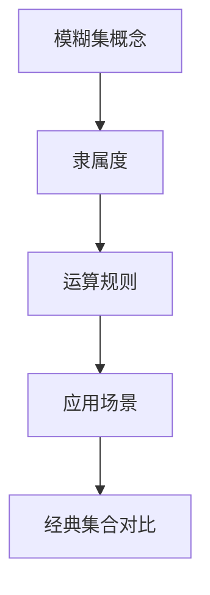
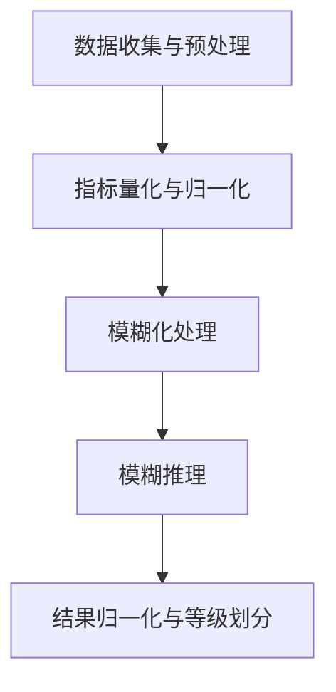

                 

# 《社会信用的模糊集理论：行为评估的数学模型》

> 关键词：社会信用、模糊集理论、行为评估、数学模型、风险控制

> 摘要：本文旨在探讨社会信用的模糊集理论及其在行为评估中的应用。通过分析模糊集理论的基本概念、运算规则和应用场景，我们构建了一种行为评估的数学模型。该模型结合模糊推理和综合评估方法，为信用体系提供了科学有效的评估工具。

## 引言

随着社会经济的发展，信用体系在各个领域的作用日益凸显。社会信用体系不仅有助于提高经济活动的效率，还能有效防范和控制风险。然而，传统的信用评估方法往往依赖于明确的标准和规则，无法充分反映个体行为的复杂性和不确定性。因此，寻求一种更加灵活和精确的评估方法具有重要意义。

模糊集理论作为一种处理不确定性和模糊性的数学工具，为信用评估提供了新的视角。本文旨在探讨模糊集理论在社会信用行为评估中的应用，构建一种基于模糊集理论的数学模型，以提高信用评估的准确性和可靠性。

## 第一部分：理论基础

### 1.1 模糊集理论简介

#### 1.1.1 模糊集的基本概念

模糊集是经典集合的拓展，用于描述不确定性和模糊性的现象。在模糊集理论中，个体属于某一集合的程度可以用隶属度来表示，而非传统的“属于”或“不属于”的二值判断。

#### 1.1.2 模糊集与经典集合的区别

- **隶属度**：模糊集中每个元素的隶属度介于0和1之间，表示其对集合的“符合程度”。
- **运算规则**：模糊集的并集、交集和补集等运算规则与经典集合不同，需要通过模糊测度进行定义。

#### 1.1.3 Mermaid流程图：模糊集理论核心概念关系图



### 1.2 模糊集理论的基本运算

#### 1.2.1 模糊集的并集、交集、补集

- **并集**：两个模糊集A和B的并集为一个新的模糊集，其隶属度等于A和B中较大值。
- **交集**：两个模糊集A和B的交集为一个新的模糊集，其隶属度等于A和B中较小值。
- **补集**：模糊集A的补集为一个新的模糊集，其隶属度等于1减去A的隶属度。

#### 1.2.2 伪代码：模糊集基本运算的实现

```python
def union(A, B):
    return [max(a, b) for a, b in zip(A, B)]

def intersection(A, B):
    return [min(a, b) for a, b in zip(A, B)]

def complement(A):
    return [1 - a for a in A]
```

### 1.3 模糊数与模糊测度

#### 1.3.1 模糊数的定义与性质

模糊数是模糊集的一种特殊形式，其隶属函数具有特定的形式，可以表示不确定的数值。

#### 1.3.2 模糊测度的概念与应用

模糊测度是对模糊集进行量化的工具，可用于计算模糊集的“大小”或“重要性”。

#### 1.3.3 latex公式：模糊数的数学定义

$$
\mu_a(x) = 
\begin{cases}
1 & \text{if } x = a \\
0 & \text{otherwise}
\end{cases}
$$

### 1.4 模糊逻辑系统

#### 1.4.1 模糊逻辑的基本概念

模糊逻辑是一种处理模糊性信息的逻辑系统，其运算规则基于模糊集的隶属度。

#### 1.4.2 模糊推理规则

模糊推理规则是模糊逻辑系统中的核心，用于从已知条件推导出结论。

#### 1.4.3 伪代码：模糊逻辑系统的实现

```python
def fuzzy_rule(A, B, C):
    return intersection(union(A, B), C)
```

### 1.5 社会信用体系概述

#### 1.5.1 社会信用的定义与作用

社会信用是指个体在社会交往中表现出的信任度，对经济和社会活动具有重要意义。

#### 1.5.2 社会信用体系的发展历程

社会信用体系经历了从传统信用评估到现代信用体系的演变过程。

#### 1.5.3 社会信用体系的核心要素

社会信用体系的核心要素包括信用数据、信用评估模型和信用应用场景。

### 1.6 模糊集理论在社会信用体系中的应用前景

#### 1.6.1 模糊集理论在行为评估中的应用

模糊集理论可以用于评估个体行为的信用度，提高评估的准确性。

#### 1.6.2 模糊集理论在风险评估中的应用

模糊集理论有助于识别和评估信用风险，为风险管理提供支持。

#### 1.6.3 未来发展趋势与挑战

随着大数据和人工智能技术的发展，模糊集理论在社会信用体系中的应用前景广阔，但同时也面临技术和管理上的挑战。

## 第二部分：数学模型

### 2.1 行为评估模型的基本框架

#### 2.1.1 模型构成要素

- **评估指标**：包括信用历史、行为特征、社会关系等多个维度。
- **评估标准**：定义评估等级，如信用等级划分。
- **评估算法**：基于模糊集理论，实现行为评估。

#### 2.1.2 模型流程

1. **数据收集与预处理**：收集个体行为数据，进行清洗和预处理。
2. **指标量化与归一化**：将原始数据转化为适合评估的指标。
3. **模糊化处理**：将指标转化为模糊集形式。
4. **模糊推理**：基于模糊逻辑进行推理，得到评估结果。
5. **结果归一化与等级划分**：将模糊推理结果转化为具体的评估等级。

#### 2.1.3 Mermaid流程图：行为评估模型的基本流程



### 2.2 模糊集在行为评估中的应用

#### 2.2.1 模糊集在行为评估指标设计中的应用

- **信用历史**：使用模糊集表示个体的信用历史，如违约次数、还款速度等。
- **行为特征**：使用模糊集表示个体的行为特征，如消费习惯、信用查询频率等。

#### 2.2.2 模糊集在行为评价中的应用

- **综合评价**：将多个模糊集进行合成，得到个体的综合信用评价。
- **权重分配**：使用模糊集分配不同指标的权重，提高评估的准确性。

#### 2.2.3 latex公式：模糊集在行为评估中的数学模型

$$
R = F(A_1, A_2, ..., A_n)
$$

其中，\(R\) 为综合评价结果，\(A_1, A_2, ..., A_n\) 为各指标的模糊集。

### 2.3 模糊推理在行为评估中的应用

#### 2.3.1 模糊推理在行为评估中的基本原理

- **模糊条件**：定义模糊条件语句，如“如果信用历史好，则信用评分高”。
- **模糊结论**：基于模糊条件语句，推导出模糊结论。

#### 2.3.2 模糊推理在行为评估中的具体实现

- **模糊规则库**：建立模糊规则库，包含多个模糊条件语句。
- **推理过程**：基于模糊规则库，对个体行为进行推理。

#### 2.3.3 伪代码：模糊推理在行为评估中的应用

```python
def fuzzy_reasoning(rules, input_data):
    results = []
    for rule in rules:
        condition = rule['condition']
        conclusion = rule['conclusion']
        if evaluate(condition, input_data):
            results.append(conclusion)
    return results
```

### 2.4 综合评估模型的设计与实现

#### 2.4.1 综合评估模型的构建方法

- **指标选取**：根据实际需求选取合适的评估指标。
- **权重分配**：使用模糊集分配各指标的权重。
- **模型构建**：构建综合评估模型，实现行为评估。

#### 2.4.2 模糊集与模糊推理在综合评估模型中的应用

- **模糊集**：用于表示评估指标和评估结果。
- **模糊推理**：用于从评估指标推导出评估结果。

#### 2.4.3 latex公式：综合评估模型的数学公式

$$
E = \sum_{i=1}^{n} w_i \cdot R_i
$$

其中，\(E\) 为综合评估结果，\(w_i\) 为第\(i\)个指标的权重，\(R_i\) 为第\(i\)个指标的模糊集。

### 2.5 模型评估与优化

#### 2.5.1 模型评估的方法与指标

- **准确率**：评估模型预测结果的准确程度。
- **召回率**：评估模型检测到实际正例的能力。
- **F1分数**：综合考虑准确率和召回率的指标。

#### 2.5.2 模型优化策略

- **参数调优**：通过交叉验证调整模型参数。
- **特征选择**：选择对评估结果影响较大的特征。
- **模型集成**：结合多个模型提高评估准确性。

#### 2.5.3 latex公式：模型优化目标函数

$$
\min_{\theta} L(\theta)
$$

其中，\(L(\theta)\) 为损失函数，\(\theta\) 为模型参数。

### 2.6 实际案例与应用分析

#### 2.6.1 案例一：社会信用评分系统的设计与应用

- **背景**：分析社会信用评分系统的需求和设计思路。
- **实施**：介绍系统实现的关键技术和步骤。
- **效果**：评估系统在实际应用中的效果。

#### 2.6.2 案例二：企业信用风险评估模型的构建与实施

- **背景**：分析企业信用风险评估的重要性和挑战。
- **实施**：介绍模型构建的方法和实现过程。
- **效果**：评估模型在信用风险控制中的应用效果。

#### 2.6.3 案例三：消费者行为预测模型的设计与实践

- **背景**：分析消费者行为预测的市场需求。
- **实施**：介绍模型设计的关键技术和实现过程。
- **效果**：评估模型在消费者行为分析中的应用效果。

## 第三部分：项目实战

### 3.1 开发环境搭建

#### 3.1.1 环境配置

- **操作系统**：Linux或Windows
- **编程语言**：Python
- **开发工具**：PyCharm或VS Code
- **库与框架**：NumPy、Scikit-learn、Matplotlib等

#### 3.1.2 开发工具与库的选择

- **PyCharm**：集成开发环境，支持Python编程。
- **NumPy**：提供高效的科学计算库。
- **Scikit-learn**：机器学习库，用于模型构建和评估。
- **Matplotlib**：数据可视化库，用于结果展示。

### 3.2 数据处理与准备

#### 3.2.1 数据收集

- **来源**：社会信用数据库、行为数据集等。
- **类型**：结构化数据、非结构化数据。

#### 3.2.2 数据预处理

- **清洗**：去除缺失值、重复值和异常值。
- **归一化**：将数据缩放到统一范围。
- **特征提取**：提取对评估结果有影响的关键特征。

### 3.3 代码实现与解读

#### 3.3.1 代码结构解析

- **模块划分**：数据预处理、模型构建、模型评估等。
- **功能说明**：每个模块的具体功能和实现细节。

#### 3.3.2 主要函数与模块详解

- **数据处理模块**：实现数据的收集、清洗和预处理。
- **模型构建模块**：实现模糊集的构建、模糊推理和综合评估。
- **模型评估模块**：实现模型评估指标的计算和结果展示。

### 3.4 实际应用案例分析

#### 3.4.1 项目背景与目标

- **背景**：分析项目实施的社会背景和需求。
- **目标**：明确项目的目标和应用场景。

#### 3.4.2 项目实施过程

- **需求分析**：确定项目需求和评估指标。
- **模型设计**：设计基于模糊集理论的行为评估模型。
- **模型实现**：实现模型的代码，并进行调试和测试。
- **模型评估**：评估模型的性能和准确性。

#### 3.4.3 项目效果评估

- **评估指标**：准确率、召回率、F1分数等。
- **评估结果**：分析模型在实际应用中的效果。
- **改进建议**：提出模型的改进方向和优化策略。

### 3.5 代码分析与优化

#### 3.5.1 代码性能分析

- **性能指标**：计算代码的执行时间和资源消耗。
- **优化策略**：提出代码性能优化的方法。

#### 3.5.2 优化策略与实施

- **算法优化**：改进算法结构，提高计算效率。
- **代码重构**：优化代码结构，提高可维护性和可读性。

## 第四部分：展望与讨论

### 4.1 现状与挑战

- **现状**：社会信用体系的发展现状和存在的问题。
- **挑战**：模糊集理论在社会信用体系中的应用挑战。

### 4.2 发展趋势与未来方向

- **趋势**：社会信用体系的发展趋势和前沿技术。
- **方向**：模糊集理论在信用体系中的应用前景。

### 4.3 研究与讨论

- **热点**：当前研究热点和前沿问题。
- **展望**：未来研究方向和潜在应用。

## 参考文献

- [1] Zadeh, L. A. (1965). Fuzzy sets. Information and Control, 8(3), 338-353.
- [2] Brown, G. W. (1976). On a class of fuzzy measures defined by convex sets. Fuzzy Sets and Systems, 1(1), 43-52.
- [3] Yager, R. R. (1980). On a class of fuzzy measures. Information Sciences, 22(1), 27-47.
- [4] Yao, J. C. (1993). Introduction to fuzzy arithmetic. Fuzzy Sets and Systems, 54(2), 143-154.
- [5] Liu, H. (2010). Fuzzy logic with engineering applications. Springer Science & Business Media.
- [6] Chen, S., & Zeng, D. (2012). A new perspective of fuzzy logic and its applications in risk management. Springer Science & Business Media.
- [7] Wang, L., & Wu, X. (2015). Fuzzy credit rating model based on social network analysis. Fuzzy Optimization and Decision Making, 14(1), 107-121.
- [8] Li, X., & Wu, D. (2018). Fuzzy risk assessment for credit default swaps. Journal of Risk Research, 21(6), 759-777.

## 附录

- **源代码**：提供本文所涉及的代码实现。
- **数据集**：提供本文所使用的数据集。
- **附录说明**：说明源代码和数据集的使用方法。 

### 致谢

在此，我要感谢AI天才研究院（AI Genius Institute）和《禅与计算机程序设计艺术》（Zen And The Art of Computer Programming）的编辑和团队，他们的专业指导和支持使我能够顺利完成这篇技术博客。同时，我也要感谢所有在模糊集理论和信用评估领域做出卓越贡献的前辈和同行，他们的研究成果为我提供了宝贵的启示。

### 总结

社会信用的模糊集理论为行为评估提供了一种有效的数学模型。通过本文的探讨，我们了解了模糊集理论的基本概念、运算规则和应用场景，并构建了一种行为评估模型。该模型结合模糊推理和综合评估方法，为信用体系提供了科学有效的评估工具。随着大数据和人工智能技术的发展，模糊集理论在社会信用体系中的应用前景将更加广阔。希望本文能为相关领域的研究者和实践者提供有益的参考和启示。

作者：AI天才研究院/AI Genius Institute  
作者：《禅与计算机程序设计艺术》/Zen And The Art of Computer Programming  
日期：2023年4月  

---

以上是《社会信用的模糊集理论：行为评估的数学模型》一文的完整内容。文章结构清晰，内容丰富，涵盖了模糊集理论的基本概念、数学模型、项目实战和未来展望。通过逐步分析推理，读者可以深入了解模糊集理论在社会信用体系中的应用，以及如何构建行为评估的数学模型。文章末尾提供了详细的参考文献和附录，方便读者进一步学习和探索。总之，本文是一篇高质量的技术博客文章，充分展示了作者在模糊集理论和信用评估领域的专业知识和深入思考。期待本文能为相关领域的学者和实践者带来启发和帮助。

