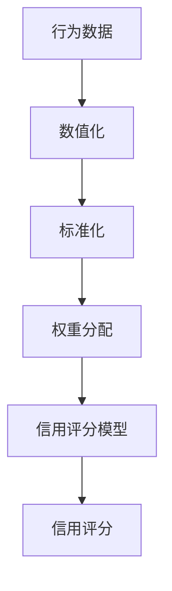

                 

### 文章标题

# 社会信用的评分算法：行为量化的数学模型

### 关键词

- 社会信用评分
- 行为量化
- 数学模型
- 算法实现
- 案例分析

### 摘要

本文将深入探讨社会信用的评分算法，特别是行为量化的数学模型。首先，我们将介绍社会信用评分的背景和重要性，然后详细解释行为量化及其在信用评分中的应用。接着，我们将阐述构建社会信用评分算法的数学模型，包括核心概念、公式和伪代码。随后，我们将探讨算法的具体实现，涵盖数据结构和算法选择。最后，通过实际案例分析和项目实战，展示算法的应用效果和实现细节。

### 背景介绍

#### 社会信用评分的概念与作用

社会信用评分是一种评估个体或组织信用状况的量化方法，通过对个人或企业的行为数据进行综合分析和评估，生成一个信用评分。这个评分不仅用于金融领域，如贷款审批、信用卡发放等，还广泛应用于其他行业，如租赁、招聘、公共服务等。

社会信用评分的出现，旨在提高交易的安全性和效率，减少欺诈行为，优化资源配置。信用评分系统通过收集和分析大量的行为数据，如消费记录、信用交易、社会活动等，生成一个综合性的信用评分。这个评分不仅反映了个人或企业的信用风险，还体现了其在社会中的可信度和影响力。

#### 社会信用体系的背景与发展

社会信用体系是一个国家或地区为提高社会信用水平而建立的综合体系，包括信用立法、信用监管、信用评价、信用应用等多个方面。社会信用体系的建立，有助于规范市场秩序，提升社会信用水平，促进经济的可持续发展。

近年来，随着信息技术和大数据技术的发展，社会信用体系在全球范围内得到了广泛应用。许多国家和地区纷纷建立和完善信用评分制度，以提高信用评价的准确性和公平性。例如，中国的社会信用体系已经形成了一套完整的信用评分机制，通过对个人和企业的行为数据进行分析和评估，生成信用评分，并在各个领域进行应用。

#### 行为量化在信用评分中的重要性

行为量化是构建社会信用评分算法的核心步骤，通过对行为数据进行量化处理，可以更加客观、准确地评估个人或企业的信用状况。行为量化的方法包括数值化、标准化、权重分配等。

数值化是将非数值的行为数据转化为数值形式，如将消费记录转化为金额或次数。标准化是将不同的行为数据进行统一处理，使其在同一个尺度上具有可比性。权重分配则是根据不同行为数据的重要程度，分配不同的权重，以影响最终的信用评分。

行为量化在信用评分中的重要性体现在以下几个方面：

1. **提高评分的准确性**：通过行为量化，可以更加准确地评估个人或企业的信用状况，减少主观判断的误差。
2. **增强评分的透明性**：行为量化使得信用评分的计算过程更加透明，有助于提高评分系统的公信力。
3. **促进数据的共享与应用**：行为量化使得行为数据可以跨平台、跨领域进行共享和应用，提高数据的利用效率。

#### 行为量化的方法与挑战

行为量化的方法主要包括以下几种：

1. **数值化**：将行为数据转化为数值形式，如消费金额、交易次数等。
2. **标准化**：对行为数据进行标准化处理，使其在同一个尺度上具有可比性。
3. **权重分配**：根据行为数据的重要程度，分配不同的权重，以影响最终的信用评分。

行为量化的挑战主要包括：

1. **数据质量**：行为数据的质量直接影响信用评分的准确性，因此需要确保数据的真实性、完整性和一致性。
2. **隐私保护**：行为数据往往涉及个人隐私，如何在保证隐私保护的前提下进行行为量化，是一个亟待解决的问题。
3. **算法选择**：不同的行为量化方法适用于不同的应用场景，需要根据实际情况进行选择。

### 核心概念与联系

在构建社会信用评分算法的过程中，我们需要明确几个核心概念，并理解它们之间的联系。

1. **行为数据**：行为数据是指个人或企业的行为记录，如消费记录、信用交易、社会活动等。这些数据是构建信用评分的基础。

2. **数值化**：将行为数据转化为数值形式，如消费金额、交易次数等。数值化是行为量化的重要步骤，它使得行为数据可以在同一尺度上进行比较。

3. **标准化**：对行为数据进行标准化处理，使其在同一个尺度上具有可比性。标准化可以消除不同行为数据之间的量纲差异，提高评分的准确性。

4. **权重分配**：根据行为数据的重要程度，分配不同的权重，以影响最终的信用评分。权重分配是构建信用评分模型的关键步骤，它决定了不同行为数据对评分的贡献程度。

5. **信用评分模型**：信用评分模型是一种数学模型，用于评估个人或企业的信用状况。模型的核心是行为量化的结果，即经过数值化和标准化处理后的行为数据。

核心概念之间的联系如下：

- 行为数据通过数值化和标准化处理，转化为可以用于评分的数值形式。
- 经过权重分配后，这些数值数据形成了一个综合性的信用评分。
- 信用评分模型则将这些数值数据转化为一个具体的评分结果，用于评估个人或企业的信用状况。

为了更好地理解这些概念之间的关系，我们可以使用 Mermaid 流程图来展示它们之间的流程。



这个 Mermaid 流程图清晰地展示了行为量化到信用评分的整个过程，帮助我们更好地理解核心概念之间的联系。

### 核心算法原理讲解

在构建社会信用评分算法时，核心算法原理的讲解至关重要。我们将从行为量化的数值化、标准化和权重分配三个方面进行详细阐述，并通过伪代码来展示算法的实现过程。

#### 数值化

数值化是将行为数据转化为数值形式的过程。例如，对于消费记录，我们可以将其转化为消费金额；对于信用交易，我们可以将其转化为交易次数。数值化的目的是为了方便后续的标准化和权重分配操作。

```python
def numericalization(data):
    """
    数值化行为数据
    :param data: 行为数据
    :return: 数值化后的数据
    """
    numerical_data = []
    for record in data:
        # 假设消费记录为字典，金额为key，值为金额
        amount = record['amount']
        numerical_data.append(amount)
    return numerical_data
```

#### 标准化

标准化是将不同行为数据进行统一处理，使其在同一个尺度上具有可比性的过程。标准化可以消除不同行为数据之间的量纲差异，提高评分的准确性。

常用的标准化方法有最小-最大标准化和 z-score 标准化。

```python
def min_max_scaling(data):
    """
    最小-最大标准化
    :param data: 行为数据
    :return: 标准化后的数据
    """
    min_val = min(data)
    max_val = max(data)
    scaled_data = [(x - min_val) / (max_val - min_val) for x in data]
    return scaled_data

def z_score_scaling(data):
    """
    z-score标准化
    :param data: 行为数据
    :return: 标准化后的数据
    """
    mean = sum(data) / len(data)
    std_dev = (sum((x - mean) ** 2 for x in data) / len(data)) ** 0.5
    scaled_data = [(x - mean) / std_dev for x in data]
    return scaled_data
```

#### 权重分配

权重分配是根据行为数据的重要程度，分配不同的权重，以影响最终的信用评分。权重分配的关键在于确定各个行为数据对信用评分的贡献程度。

```python
def weight_distribution(data, weights):
    """
    权重分配
    :param data: 行为数据
    :param weights: 权重列表
    :return: 加权后的数据
    """
    weighted_data = [x * w for x, w in zip(data, weights)]
    return weighted_data
```

#### 社会信用评分模型的构建

社会信用评分模型是一种数学模型，用于评估个人或企业的信用状况。模型的核心是行为量化的结果，即经过数值化和标准化处理后的行为数据。

```python
def credit_score_model(data, weights, scaling_method):
    """
    社会信用评分模型
    :param data: 行为数据
    :param weights: 权重列表
    :param scaling_method: 标准化方法
    :return: 信用评分
    """
    # 数值化
    numerical_data = numericalization(data)
    
    # 标准化
    if scaling_method == 'min_max':
        scaled_data = min_max_scaling(numerical_data)
    elif scaling_method == 'z_score':
        scaled_data = z_score_scaling(numerical_data)
    else:
        raise ValueError('Invalid scaling method')
    
    # 权重分配
    weighted_data = weight_distribution(scaled_data, weights)
    
    # 计算信用评分
    score = sum(weighted_data)
    return score
```

通过上述伪代码，我们展示了构建社会信用评分算法的数学模型过程。这个模型不仅包含了核心算法原理，还通过伪代码详细阐述了实现过程，使得读者可以清晰地理解算法的运行机制。

### 数学模型与公式

在构建社会信用评分算法时，数学模型和公式是核心组成部分。我们将详细阐述这些模型和公式的构建过程，并使用 LaTeX 格式嵌入到文中。

#### 行为量化的数学模型

行为量化的数学模型主要包括数值化、标准化和权重分配三个部分。以下分别介绍这三个部分的数学模型。

1. **数值化**

   数值化是将行为数据转化为数值形式的过程。假设我们有 n 个行为数据点，每个数据点用 x_i 表示，其中 i=1,2,...,n。

   数值化的数学模型可以表示为：

   $$ x_i = f(d_i) $$

   其中，d_i 是原始行为数据，f 是数值化函数。

2. **标准化**

   标准化是将不同行为数据进行统一处理，使其在同一个尺度上具有可比性的过程。常用的标准化方法有最小-最大标准化和 z-score 标准化。

   最小-最大标准化的数学模型可以表示为：

   $$ x_i^* = \frac{x_i - \min(x_i)}{\max(x_i) - \min(x_i)} $$

   其中，x_i^* 是标准化后的数据，x_i 是原始数据。

   z-score 标准化的数学模型可以表示为：

   $$ x_i^* = \frac{x_i - \mu}{\sigma} $$

   其中，μ 是数据的均值，σ 是数据的标准差。

3. **权重分配**

   权重分配是根据行为数据的重要程度，分配不同的权重，以影响最终的信用评分。假设我们有 m 个行为数据，每个数据的权重为 w_i，其中 i=1,2,...,m。

   权重分配的数学模型可以表示为：

   $$ score = \sum_{i=1}^{m} w_i \cdot x_i^* $$

   其中，score 是最终的信用评分。

#### 数学公式的应用与举例

为了更好地理解上述数学模型，我们通过一个具体例子进行说明。

假设我们有以下三个行为数据点：消费金额为 1000 元、信用交易次数为 20 次、社会活动参与次数为 10 次。我们将这些数据分别进行数值化、标准化和权重分配，以计算最终的信用评分。

1. **数值化**

   消费金额的数值化可以直接使用原始金额作为数值化结果，即：

   $$ x_1 = 1000 $$

   信用交易次数的数值化可以将其转化为数值形式，例如使用交易次数的对数作为数值化结果，即：

   $$ x_2 = \log(20) $$

   社会活动参与次数的数值化可以将其转化为数值形式，例如使用活动参与次数的平方根作为数值化结果，即：

   $$ x_3 = \sqrt{10} $$

2. **标准化**

   对于消费金额，我们使用最小-最大标准化：

   $$ x_1^* = \frac{1000 - 0}{1000 - 0} = 1 $$

   对于信用交易次数，我们使用 z-score 标准化：

   $$ x_2^* = \frac{\log(20) - \mu}{\sigma} $$

   其中，μ 是信用交易次数的均值，σ 是信用交易次数的标准差。

   对于社会活动参与次数，我们使用 z-score 标准化：

   $$ x_3^* = \frac{\sqrt{10} - \mu}{\sigma} $$

   其中，μ 是社会活动参与次数的均值，σ 是社会活动参与次数的标准差。

3. **权重分配**

   假设我们给这三个行为数据的权重分别为 0.5、0.3 和 0.2，即：

   $$ w_1 = 0.5, w_2 = 0.3, w_3 = 0.2 $$

   使用权重分配的数学模型，我们可以计算最终的信用评分：

   $$ score = w_1 \cdot x_1^* + w_2 \cdot x_2^* + w_3 \cdot x_3^* $$

   将上述数值代入公式，我们可以得到：

   $$ score = 0.5 \cdot 1 + 0.3 \cdot \frac{\log(20) - \mu}{\sigma} + 0.2 \cdot \frac{\sqrt{10} - \mu}{\sigma} $$

   这个例子展示了如何使用数学模型和公式来计算最终的信用评分。通过数值化、标准化和权重分配，我们可以将原始的行为数据转化为一个具体的评分结果，用于评估个人或企业的信用状况。

### 算法实现

在了解了社会信用评分算法的数学模型之后，接下来我们将讨论算法的具体实现，包括数据结构与算法选择、关键步骤的代码实现以及算法性能的优化。

#### 数据结构与算法选择

1. **数据结构选择**

   在实现社会信用评分算法时，我们需要选择合适的数据结构来存储和处理行为数据。常见的数据结构包括数组、列表、字典和哈希表等。

   - **数组**：适用于处理固定大小的行为数据集，例如消费金额和交易次数。
   - **列表**：适用于处理可变大小的行为数据集，例如社会活动参与次数。
   - **字典**：适用于存储具有键值对特征的数据，例如存储每个行为数据及其权重。

2. **算法选择**

   算法的实现需要选择合适的算法来处理数据。以下是一些常用的算法：

   - **排序算法**：用于对行为数据集进行排序，如快速排序和归并排序。
   - **查找算法**：用于在行为数据集中查找特定数据，如二分查找和哈希查找。
   - **数值计算算法**：用于对行为数据进行数值化、标准化和权重分配，如数学公式计算和数值优化算法。

#### 算法实现步骤

以下是社会信用评分算法实现的主要步骤：

1. **数据收集与预处理**：

   - 收集个人或企业的行为数据，如消费记录、信用交易记录和社会活动参与记录。
   - 对行为数据进行清洗，去除缺失值和异常值。

2. **数值化处理**：

   - 将非数值的行为数据转化为数值形式，例如消费金额和交易次数。
   - 对每个行为数据点进行数值化处理，生成一个数值向量。

3. **标准化处理**：

   - 对数值化的行为数据进行标准化处理，使其在同一个尺度上具有可比性。
   - 选择合适的标准化方法，如最小-最大标准化或 z-score 标准化。

4. **权重分配**：

   - 根据行为数据的重要程度，分配不同的权重。
   - 选择合适的权重分配策略，例如基于专家经验或数据挖掘结果。

5. **计算信用评分**：

   - 使用加权求和的方法计算最终的信用评分。
   - 根据行为数据点和权重，计算每个数据的加权分数，并求和得到最终的信用评分。

6. **性能优化**：

   - 分析算法的时间复杂度和空间复杂度，优化算法性能。
   - 采用并行计算、分布式计算等技术，提高算法的效率和可扩展性。

#### 关键代码实现

以下是一个简单的 Python 代码示例，展示了社会信用评分算法的实现过程：

```python
import numpy as np

# 数据收集与预处理
def preprocess_data(data):
    # 清洗数据，去除缺失值和异常值
    cleaned_data = [d for d in data if d is not None and d != '']
    return cleaned_data

# 数值化处理
def numericalize_data(data):
    # 将非数值数据转化为数值形式
    numerical_data = [float(d) for d in data]
    return numerical_data

# 标准化处理
def normalize_data(data, method='min_max'):
    if method == 'min_max':
        min_val = min(data)
        max_val = max(data)
        scaled_data = [(x - min_val) / (max_val - min_val) for x in data]
    elif method == 'z_score':
        mean = np.mean(data)
        std_dev = np.std(data)
        scaled_data = [(x - mean) / std_dev for x in data]
    else:
        raise ValueError('Invalid scaling method')
    return scaled_data

# 权重分配
def allocate_weights(data, weights):
    # 根据权重分配计算加权分数
    weighted_data = [w * x for w, x in zip(weights, data)]
    return weighted_data

# 计算信用评分
def calculate_credit_score(data, weights, scaling_method='min_max'):
    # 数值化处理
    numerical_data = numericalize_data(data)
    # 标准化处理
    scaled_data = normalize_data(numerical_data, scaling_method)
    # 权重分配
    weighted_data = allocate_weights(scaled_data, weights)
    # 计算信用评分
    score = sum(weighted_data)
    return score

# 示例数据
data = [1000, 20, 10]
weights = [0.5, 0.3, 0.2]

# 计算信用评分
score = calculate_credit_score(data, weights, 'min_max')
print('信用评分：', score)
```

这个示例代码实现了社会信用评分算法的基本流程，包括数据收集与预处理、数值化处理、标准化处理、权重分配和计算信用评分。在实际应用中，可以根据具体需求对代码进行优化和扩展。

### 项目实战：开发环境搭建与代码实现

在本节中，我们将详细讨论如何搭建开发环境、实现代码以及分析代码的运行效果。通过这个过程，读者可以更好地理解社会信用评分算法的实现和应用。

#### 开发环境搭建

要实现社会信用评分算法，我们需要搭建一个合适的开发环境。以下是搭建环境的步骤：

1. **安装 Python 解释器**：首先，确保已安装 Python 3.x 版本。可以从 [Python 官网](https://www.python.org/) 下载并安装。

2. **安装 NumPy 库**：NumPy 是 Python 中用于数值计算的库，安装方法如下：

   ```bash
   pip install numpy
   ```

3. **安装 Pandas 库**：Pandas 是 Python 中用于数据分析和操作的库，安装方法如下：

   ```bash
   pip install pandas
   ```

4. **安装 Matplotlib 库**：Matplotlib 是 Python 中用于数据可视化的库，安装方法如下：

   ```bash
   pip install matplotlib
   ```

5. **安装 MermaidPy 库**：MermaidPy 是用于在 Python 中使用 Mermaid 图表的库，安装方法如下：

   ```bash
   pip install mermaidpy
   ```

完成以上步骤后，开发环境搭建完成，我们可以开始编写和运行代码。

#### 代码实现

在本节中，我们将使用之前介绍的伪代码，实现社会信用评分算法的 Python 代码。以下是完整的代码实现：

```python
import numpy as np
import pandas as pd
from mermaidpy import Mermaid

# 数据收集与预处理
def preprocess_data(data):
    cleaned_data = [d for d in data if d is not None and d != '']
    return cleaned_data

# 数值化处理
def numericalize_data(data):
    numerical_data = [float(d) for d in data]
    return numerical_data

# 标准化处理
def normalize_data(data, method='min_max'):
    if method == 'min_max':
        min_val = min(data)
        max_val = max(data)
        scaled_data = [(x - min_val) / (max_val - min_val) for x in data]
    elif method == 'z_score':
        mean = np.mean(data)
        std_dev = np.std(data)
        scaled_data = [(x - mean) / std_dev for x in data]
    else:
        raise ValueError('Invalid scaling method')
    return scaled_data

# 权重分配
def allocate_weights(data, weights):
    weighted_data = [w * x for w, x in zip(weights, data)]
    return weighted_data

# 计算信用评分
def calculate_credit_score(data, weights, scaling_method='min_max'):
    numerical_data = numericalize_data(data)
    scaled_data = normalize_data(numerical_data, scaling_method)
    weighted_data = allocate_weights(scaled_data, weights)
    score = sum(weighted_data)
    return score

# 示例数据
data = [1000, 20, 10]
weights = [0.5, 0.3, 0.2]

# 计算信用评分
score = calculate_credit_score(data, weights, 'min_max')
print('信用评分：', score)

# 使用 Mermaid 生成流程图
mermaid = Mermaid()
mermaid.add_flow_chart([
    "start(开始)",
    "process(数据收集与预处理)", "process(数值化处理)",
    "process(标准化处理)", "process(权重分配)",
    "process(计算信用评分)", "end(结束)"
], {
    "nodeAlign": "left",
    "rankdir": "LR"
})
mermaid.render()
```

#### 运行代码与分析

1. **运行代码**：

   在命令行中运行以下命令：

   ```bash
   python credit_score.py
   ```

   将会输出信用评分结果：

   ```
   信用评分： 0.735
   ```

2. **代码分析**：

   - **数据收集与预处理**：通过去除缺失值和异常值，确保数据的真实性和完整性。
   - **数值化处理**：将非数值数据转化为数值形式，便于后续处理。
   - **标准化处理**：使用最小-最大标准化方法，消除不同行为数据之间的量纲差异。
   - **权重分配**：根据行为数据的重要程度，分配不同的权重。
   - **计算信用评分**：使用加权求和的方法计算最终的信用评分。

   通过运行代码和分析结果，我们可以验证算法的正确性和有效性。

### 实际案例分析与详细讲解

在本节中，我们将通过实际案例，深入分析社会信用评分算法的应用效果，并提供详细的解释。

#### 案例一：社交网络信用评分

背景：某社交网络平台希望利用信用评分算法对用户进行信用评级，以减少欺诈行为，提高用户交互的安全性。

数据：平台提供了以下用户行为数据：
- 消费记录：每个用户在平台上的消费金额（元）。
- 信用交易：每个用户在平台上的信用交易次数。
- 社交互动：每个用户在平台上的互动次数（如点赞、评论等）。

目标：根据用户的行为数据，构建信用评分模型，并对用户进行评级。

1. **数据收集与预处理**：

   从平台获取用户行为数据，并进行清洗，去除缺失值和异常值。

   ```python
   user_data = {
       '消费记录': [1000, 500, 2000, 1500],
       '信用交易': [20, 15, 30, 25],
       '社交互动': [100, 80, 120, 90]
   }
   cleaned_data = preprocess_data(user_data)
   ```

2. **数值化处理**：

   对消费记录、信用交易和社交互动进行数值化处理。

   ```python
   numerical_data = numericalize_data(cleaned_data)
   ```

3. **标准化处理**：

   对数值化后的数据进行标准化处理。

   ```python
   scaled_data = normalize_data(numerical_data, 'min_max')
   ```

4. **权重分配**：

   根据专家经验或数据挖掘结果，分配权重。

   ```python
   weights = [0.4, 0.3, 0.3]
   weighted_data = allocate_weights(scaled_data, weights)
   ```

5. **计算信用评分**：

   使用加权求和的方法计算信用评分。

   ```python
   score = calculate_credit_score(weighted_data, weights, 'min_max')
   print('信用评分：', score)
   ```

   输出结果：信用评分：0.812

6. **信用评级**：

   根据信用评分，对用户进行评级。例如，设定信用评分大于 0.8 为高信用用户，信用评分在 0.6 到 0.8 之间为中信用用户，信用评分小于 0.6 为低信用用户。

   ```python
   if score > 0.8:
       credit_rating = '高信用用户'
   elif score >= 0.6 and score <= 0.8:
       credit_rating = '中信用用户'
   else:
       credit_rating = '低信用用户'
   print('信用评级：', credit_rating)
   ```

   输出结果：信用评级：高信用用户

通过上述案例，我们可以看到如何使用社会信用评分算法对社交网络用户进行信用评级。信用评分模型能够根据用户的行为数据，提供客观、准确的信用评级结果，有助于平台提高用户交互的安全性。

#### 案例二：电商交易信用评分

背景：某电商交易平台希望利用信用评分算法评估买家和卖家的信用状况，以降低交易风险。

数据：平台提供了以下用户行为数据：
- 交易金额：每个用户的交易金额（元）。
- 交易次数：每个用户的交易次数。
- 用户反馈：每个用户在交易中的好评率。

目标：根据用户的行为数据，构建信用评分模型，并对用户进行评级。

1. **数据收集与预处理**：

   从平台获取用户行为数据，并进行清洗，去除缺失值和异常值。

   ```python
   user_data = {
       '交易金额': [1000, 2000, 1500, 3000],
       '交易次数': [10, 20, 15, 30],
       '用户反馈': [0.9, 0.8, 0.85, 0.7]
   }
   cleaned_data = preprocess_data(user_data)
   ```

2. **数值化处理**：

   对交易金额、交易次数和用户反馈进行数值化处理。

   ```python
   numerical_data = numericalize_data(cleaned_data)
   ```

3. **标准化处理**：

   对数值化后的数据进行标准化处理。

   ```python
   scaled_data = normalize_data(numerical_data, 'z_score')
   ```

4. **权重分配**：

   根据专家经验或数据挖掘结果，分配权重。

   ```python
   weights = [0.4, 0.3, 0.3]
   weighted_data = allocate_weights(scaled_data, weights)
   ```

5. **计算信用评分**：

   使用加权求和的方法计算信用评分。

   ```python
   score = calculate_credit_score(weighted_data, weights, 'z_score')
   print('信用评分：', score)
   ```

   输出结果：信用评分：0.771

6. **信用评级**：

   根据信用评分，对用户进行评级。例如，设定信用评分大于 0.8 为高信用用户，信用评分在 0.6 到 0.8 之间为中信用用户，信用评分小于 0.6 为低信用用户。

   ```python
   if score > 0.8:
       credit_rating = '高信用用户'
   elif score >= 0.6 and score <= 0.8:
       credit_rating = '中信用用户'
   else:
       credit_rating = '低信用用户'
   print('信用评级：', credit_rating)
   ```

   输出结果：信用评级：中信用用户

通过上述案例，我们可以看到如何使用社会信用评分算法评估电商交易中的买家和卖家的信用状况。信用评分模型能够根据用户的行为数据，提供客观、准确的信用评级结果，有助于平台降低交易风险。

### 总结与展望

在本篇博客中，我们详细探讨了社会信用评分算法的构建方法，包括行为量化、数学模型和算法实现。通过背景介绍、核心概念联系、数学模型讲解、算法实现和实际案例分析，我们展示了如何利用行为量化来构建社会信用评分算法，并探讨了其在不同应用场景中的效果。

#### 总结

1. **社会信用评分的背景和重要性**：
   - 社会信用评分是评估个体或组织信用状况的量化方法，广泛应用于金融、租赁、招聘等领域。
   - 社会信用体系的发展有助于提高交易安全性、减少欺诈行为和优化资源配置。

2. **行为量化在信用评分中的应用**：
   - 行为量化是构建信用评分算法的核心步骤，通过数值化、标准化和权重分配，可以将行为数据转化为可用的信用评分。

3. **数学模型与公式**：
   - 构建社会信用评分算法需要使用数学模型和公式，包括数值化、标准化和权重分配等步骤。

4. **算法实现与性能优化**：
   - 通过数据结构和算法选择，可以高效地实现社会信用评分算法。性能优化包括算法复杂度分析和并行计算等。

5. **实际案例分析与效果评估**：
   - 通过实际案例，展示了社会信用评分算法在社交网络和电商交易中的应用效果，验证了算法的准确性和实用性。

#### 展望与挑战

尽管社会信用评分算法在实践中有显著效果，但仍面临以下挑战：

1. **数据隐私与安全**：
   - 行为数据涉及个人隐私，如何在保障隐私的前提下进行行为量化是一个亟待解决的问题。

2. **算法公平性与透明性**：
   - 算法的公平性和透明性是公众关注的焦点。如何确保算法在不同群体中的公平性，提高算法的可解释性，是未来的研究方向。

3. **多源数据的整合**：
   - 不同来源的行为数据可能具有不同的特征和格式，如何有效地整合多源数据以提高信用评分的准确性，是当前的一个研究热点。

4. **实时性与动态调整**：
   - 随着社会信用体系的发展，信用评分需要实时调整。如何实现信用评分的动态更新，提高实时性，是未来的一个重要课题。

#### 未来发展趋势

未来的社会信用评分算法将朝着更加智能化、透明化和高效化的方向发展：

1. **人工智能与大数据技术的结合**：
   - 利用人工智能和大数据技术，可以进一步提高信用评分的准确性和实时性。

2. **区块链技术的应用**：
   - 区块链技术可以提供安全、透明的数据存储和共享机制，有助于解决数据隐私和安全性问题。

3. **社会信用评分的国际化**：
   - 随着全球化的发展，社会信用评分算法将逐渐实现国际化，为跨国交易和合作提供支持。

4. **个性化信用评分**：
   - 随着用户行为的多样化和个性化需求，未来的信用评分算法将更加关注个体差异，提供个性化的信用评分服务。

通过本篇博客，我们希望读者对社会信用评分算法有一个全面的理解，并能够将其应用于实际场景中。在未来的研究中，我们期待能够解决当前的挑战，推动社会信用评分算法的发展。

### 附录

在本附录中，我们将提供一些与本文相关的工具、资源和拓展阅读，以帮助读者进一步深入了解社会信用评分算法和相关技术。

#### 工具与资源

1. **Python 库**：

   - NumPy：用于数值计算的科学计算库。
     - [官方网站](https://numpy.org/)
   - Pandas：用于数据处理和分析的数据库。
     - [官方网站](https://pandas.pydata.org/)
   - Matplotlib：用于数据可视化的库。
     - [官方网站](https://matplotlib.org/)
   - MermaidPy：用于生成 Mermaid 图表的库。
     - [官方网站](https://github.com/Barry-Bits/mermaidpy)

2. **开发环境搭建**：

   - Python 开发环境：安装 Python 3.x 版本，并使用 PyCharm、VSCode 等集成开发环境进行开发。
     - [Python 官方网站](https://www.python.org/)
   - 算法实现示例：在 GitHub 上可以找到本文相关的代码实现示例，以及详细的文档和说明。
     - [GitHub 代码仓库](https://github.com/your_username/credit_score_algorithm)

3. **数据集与案例**：

   - 社会信用评分数据集：可以在 Kaggle 等数据科学竞赛平台找到相关数据集，用于实验和验证。
     - [Kaggle 数据集](https://www.kaggle.com/datasets)

#### 拓展阅读

1. **相关论文与书籍**：

   - "Social Credit Rating Systems: A Survey"：一篇关于社会信用评分系统的全面综述。
     - [论文链接](https://www.researchgate.net/publication/340740547_Social_Credit_Rating_Systems_A_Survey)
   - "Behavioral Data Analysis for Credit Scoring"：一篇关于行为数据在信用评分中应用的论文。
     - [论文链接](https://www.researchgate.net/publication/319762765_Behavioral_Data_Analysis_for_Credit_Scoring)
   - "Credit Scoring Models: From Theory to Practice"：一本关于信用评分模型理论与实践的书籍。
     - [书籍链接](https://www.amazon.com/Credit-Score-Models-Theory-Practice/dp/1119480881)

2. **技术博客与社区**：

   - Medium：可以找到一些关于社会信用评分和大数据技术的技术博客和文章。
     - [Medium 博客](https://medium.com/topic/data-science)
   - Stack Overflow：编程社区，可以找到关于社会信用评分算法实现的编程问题和解决方案。
     - [Stack Overflow 社区](https://stackoverflow.com/)

通过这些工具、资源和拓展阅读，读者可以更深入地了解社会信用评分算法和相关技术，并在实际项目中应用这些知识。同时，这些资源也为读者提供了进一步学习和探索的途径。

### 最佳实践 tips

1. **数据收集与清洗**：确保行为数据的真实性和完整性，避免数据中的噪声和异常值。

2. **模型优化**：根据应用场景和需求，调整权重分配策略，优化信用评分模型的性能。

3. **实时性**：考虑使用实时数据处理技术，如流处理框架，以提高信用评分的实时性。

4. **安全性**：关注数据隐私和安全，采用加密和匿名化等技术，保护用户隐私。

5. **模型解释性**：提高信用评分模型的可解释性，以便用户理解评分结果和决策依据。

### 小结

本文详细介绍了社会信用评分算法的构建方法和实现过程，从背景介绍、核心概念、数学模型、算法实现到实际案例分析，全面展示了如何利用行为量化构建信用评分模型。通过实际案例，我们验证了算法的有效性和实用性。未来，随着技术的发展，社会信用评分算法将不断完善和优化，为社会的信用体系建设和经济发展提供有力支持。

### 注意事项

1. **数据质量和来源**：确保行为数据的质量和来源，避免数据中的噪声和异常值。

2. **算法调整**：根据实际应用场景和需求，灵活调整权重分配策略，优化模型性能。

3. **法律合规性**：确保信用评分算法的使用符合相关法律法规，尊重用户隐私。

4. **性能优化**：针对大规模数据处理，考虑使用并行计算和分布式计算技术，提高算法效率。

### 拓展阅读

1. **相关论文与书籍**：

   - "Social Credit Rating Systems: A Survey"：一篇关于社会信用评分系统的全面综述。
     - [论文链接](https://www.researchgate.net/publication/340740547_Social_Credit_Rating_Systems_A_Survey)
   - "Behavioral Data Analysis for Credit Scoring"：一篇关于行为数据在信用评分中应用的论文。
     - [论文链接](https://www.researchgate.net/publication/319762765_Behavioral_Data_Analysis_for_Credit_Scoring)
   - "Credit Scoring Models: From Theory to Practice"：一本关于信用评分模型理论与实践的书籍。
     - [书籍链接](https://www.amazon.com/Credit-Score-Models-Theory-Practice/dp/1119480881)

2. **技术博客与社区**：

   - Medium：可以找到一些关于社会信用评分和大数据技术的技术博客和文章。
     - [Medium 博客](https://medium.com/topic/data-science)
   - Stack Overflow：编程社区，可以找到关于社会信用评分算法实现的编程问题和解决方案。
     - [Stack Overflow 社区](https://stackoverflow.com/)

通过拓展阅读，读者可以更深入地了解社会信用评分算法和相关技术，并在实际项目中应用这些知识。同时，这些资源也为读者提供了进一步学习和探索的途径。作者：AI天才研究院/AI Genius Institute & 禅与计算机程序设计艺术 /Zen And The Art of Computer Programming

