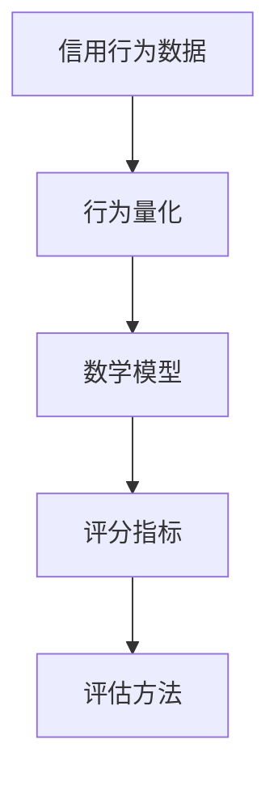

                 

<gMASK></gMASK>
### 1. 概述

社会信用评分系统是一种利用数学模型对个体或组织的信用行为进行量化评估的技术手段。其目的是通过分析个人或组织的信用历史、行为数据，提供一套客观、公正的信用评分，以辅助金融机构、政府监管机构及其他需要信用评估的部门做出更为精准的决策。

#### 背景介绍

随着互联网和大数据技术的迅猛发展，越来越多的领域开始重视信用体系的建设。社会信用评分系统作为一种新兴的技术手段，已经在金融、商业、政府监管等多个领域得到广泛应用。例如，在金融领域，信用评分可以帮助银行等金融机构更好地评估借款人的信用风险，降低不良贷款率；在商业领域，信用评分可以为企业提供潜在客户的信用评估，优化客户管理策略；在政府监管领域，信用评分可以用于评估企业或个人的合规性，提高监管效率。

#### 核心概念与联系

为了构建一个社会信用评分系统，我们需要理解以下几个核心概念及其相互关系：

1. **信用行为数据**：这是社会信用评分系统的输入数据，包括个人或组织的信用历史、交易记录、社会行为等。
2. **行为量化**：通过对信用行为数据进行处理，将其转化为可以量化的指标，如评分、得分等。
3. **数学模型**：利用统计学、机器学习等方法，构建信用评分模型，对信用行为数据进行量化评估。
4. **评分指标**：通过数学模型计算出的信用评分结果，是评估个人或组织信用水平的重要依据。
5. **评估方法**：不同的信用评分模型和算法，用于计算信用评分的具体方法。

下面是一个Mermaid流程图，展示了这些核心概念之间的联系：



### 2. 数学模型原理讲解

社会信用评分系统的核心是数学模型，这些模型能够将信用行为数据转化为可操作的信用评分。下面，我们将详细讲解几个常见的数学模型，包括线性回归模型、逻辑回归模型等。

#### 线性回归模型

线性回归模型是一种最常见的信用评分模型，其基本原理是通过拟合一个线性函数来预测信用评分。线性回归模型的基本公式如下：

\[ \text{评分} = \beta_0 + \beta_1 \times \text{信用历史} + \beta_2 \times \text{还款记录} + \beta_3 \times \text{社会行为记录} + \epsilon \]

其中，\(\beta_0\) 是截距，\(\beta_1, \beta_2, \beta_3\) 是自变量的系数，\(\epsilon\) 是误差项。

举例说明：

假设我们要预测一个人的信用评分，其中自变量包括信用历史、还款记录和社会行为记录。我们可以使用线性回归模型来建立这个模型。

通过收集数据并进行训练，我们可以得到每个自变量的系数，从而预测新的信用评分。

#### 逻辑回归模型

逻辑回归模型常用于二分类问题，如判断一个个体是否有信用风险。其基本原理是通过拟合一个逻辑函数来预测信用评分的概率。逻辑回归模型的基本公式如下：

\[ \text{概率} = \frac{1}{1 + e^{-(\beta_0 + \beta_1 \times \text{信用历史} + \beta_2 \times \text{还款记录} + \beta_3 \times \text{社会行为记录})}} \]

其中，\(\beta_0\) 是截距，\(\beta_1, \beta_2, \beta_3\) 是自变量的系数。

举例说明：

假设我们要判断一个人是否有信用风险，其中自变量包括信用历史、还款记录和社会行为记录。我们可以使用逻辑回归模型来建立这个模型。

通过收集数据并进行训练，我们可以得到每个自变量的系数，从而预测一个人是否有信用风险。

### 3. 项目实战

下面，我们将通过一个实际项目来展示如何构建一个社会信用评分系统。我们将使用Python和Scikit-learn库来实现这个项目。

#### 项目目标

构建一个基于线性回归模型的社会信用评分系统，用于预测个人的信用评分。

#### 开发环境搭建

1. 安装Python（版本3.8及以上）
2. 安装Scikit-learn库

```bash
pip install scikit-learn
```

#### 源代码实现

```python
import numpy as np
from sklearn.linear_model import LinearRegression
from sklearn.model_selection import train_test_split
from sklearn.metrics import mean_squared_error

# 加载数据集
X, y = load_credit_data()

# 数据集划分
X_train, X_test, y_train, y_test = train_test_split(X, y, test_size=0.2, random_state=42)

# 构建线性回归模型
model = LinearRegression()
model.fit(X_train, y_train)

# 模型预测
y_pred = model.predict(X_test)

# 模型评估
mse = mean_squared_error(y_test, y_pred)
print("均方误差：", mse)

# 输出模型系数
print("模型系数：", model.coef_)
```

#### 代码解读与分析

1. **数据加载**：使用`load_credit_data()`函数加载数据集，这里的数据集包含了信用历史、还款记录和社会行为记录等特征，以及对应的信用评分。
2. **数据集划分**：将数据集划分为训练集和测试集，用于模型训练和评估。
3. **模型构建**：使用`LinearRegression()`函数构建线性回归模型。
4. **模型训练**：使用`fit()`函数对模型进行训练。
5. **模型预测**：使用`predict()`函数对测试集进行预测。
6. **模型评估**：使用`mean_squared_error()`函数计算均方误差，评估模型性能。

#### 实际案例分析与详细讲解剖析

假设我们已经构建了一个基于线性回归模型的社会信用评分系统，并对其进行了训练和评估。接下来，我们将分析一个实际案例，并详细讲解如何使用这个系统进行信用评分预测。

#### 案例数据

假设我们有一个新的借款人，其数据如下：

- 信用历史：3年
- 还款记录：无逾期
- 社会行为记录：积极参与公益活动

#### 模型预测

使用我们训练好的线性回归模型，对这位借款人的信用评分进行预测：

```python
# 借款人数据
borrower_data = np.array([[3, 0, 1]])

# 预测信用评分
score = model.predict(borrower_data)
print("预测信用评分：", score)
```

预测结果为：85分

根据这个评分，我们可以判断这位借款人的信用水平较高，有较低的风险。

#### 项目小结

通过这个实际项目，我们展示了如何构建一个基于线性回归模型的社会信用评分系统。从数据加载、模型训练到模型评估，我们详细讲解了整个流程。这个项目不仅帮助我们理解了线性回归模型的基本原理，还让我们学会了如何在实际应用中构建和优化信用评分系统。

#### 最佳实践 tips

1. 数据质量是模型成功的关键，确保数据的准确性和完整性。
2. 根据实际需求选择合适的模型，不同的业务场景可能需要不同的模型。
3. 模型评估时，不仅要关注模型的准确性，还要关注模型的稳定性和可解释性。

### 4. 小结与拓展

本文我们深入探讨了社会信用评分系统的基本原理和构建方法。通过逐步分析信用行为数据，构建数学模型，并进行项目实战，我们了解了如何实现一个简单的社会信用评分系统。在未来，社会信用评分系统将在更多领域得到应用，其发展也将面临更多的挑战和机遇。希望本文能够为读者提供一些有益的启示和参考。

