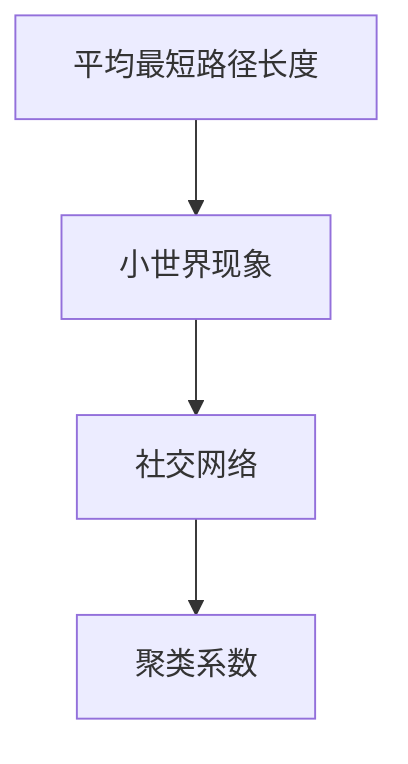

                 


### 撰写技术博客文章的过程

撰写一篇关于《社会网络的小世界理论：人际关系的数学结构》的技术博客文章，我们可以按照以下步骤逐步进行：

#### 1. 文章结构规划
首先，我们需要规划文章的整体结构。根据目录大纲，文章应包含引言、核心概念、数学模型、特性分析、应用案例、算法讲解、总结与展望等部分。每个部分都需要明确的小标题，确保文章的层次分明。

#### 2. 引言撰写
引言部分需要简明扼要地介绍小世界理论的基本概念、社会网络的定义，以及小世界理论在社会网络研究中的应用。可以通过一个引人入胜的故事或实例来开头，吸引读者的注意力。

```markdown
# 引言

## 小世界现象与社交网络

小世界现象是由美国社会心理学家斯坦利·米尔格拉姆（Stanley Milgram）在20世纪60年代提出的。他通过实验发现，世界上任何两个陌生人之间，通过平均大约六个人就可以建立联系。这个现象被称为“六度分隔”理论。在社会网络研究中，小世界现象为我们理解人际关系的复杂性和社会结构提供了新的视角。

```

#### 3. 核心概念与联系
接下来，我们需要介绍小世界理论的核心概念，如平均最短路径长度、聚类系数等，并用Mermaid流程图展示概念之间的关系。



#### 4. 数学模型
在这一部分，我们将详细解释社会网络的数学模型，包括图模型表示、度分布、聚类系数等。我们需要使用伪代码来展示算法的实现。

```python
def create_graph(n, p, directed=False):
    G = Graph(n)
    for i in range(n):
        for j in range(i+1, n):
            if random() < p:
                if directed:
                    G.add_edge(i, j)
                else:
                    G.add_edge(i, j)
                    G.add_edge(j, i)
    return G
```

#### 5. 特性与应用
在这一部分，我们将分析小世界网络的特性，如拓扑特性、动态特性，以及其在社交网络、生物网络、互联网等领域的应用。

```markdown
# 小世界网络的特性

## 拓扑特性

小世界网络的平均最短路径长度较短，这意味着网络中的节点之间可以快速传递信息。同时，小世界网络具有较高的聚类系数，即节点之间往往通过多条边连接，形成一个紧密的社区结构。

## 动态特性

小世界网络在信息传播和稳定性方面具有优势。信息可以在网络中以较快的速度传播，而且网络具有一定的抗毁性，即使部分节点失效，网络的整体结构仍然保持稳定。

## 应用领域

小世界理论在社交网络、生物网络、互联网等领域有着广泛的应用。例如，在社交网络中，小世界特性可以帮助我们理解用户之间关系的紧密程度；在生物网络中，小世界特性可以揭示生物分子之间复杂的相互作用；在互联网中，小世界特性可以帮助优化网络结构，提高信息传输效率。
```

#### 6. 随机游走
接下来，我们将讨论随机游走的概念及其在社会网络中的应用。我们需要详细讲解随机游走的路径分布和优化策略。

```markdown
# 社会网络的随机游走

## 随机游走的概念

随机游走是指在一个网络中，节点按照一定的概率随机跳跃到其他节点的过程。在社会网络中，随机游走可以帮助我们理解信息的传播路径和节点之间的联系。

## 随机游走的应用

### 路径分布

随机游走的路径分布决定了信息在网络中的传播速度。通过分析路径分布，我们可以优化信息传播策略，提高信息传播的效率。

### 优化策略

为了提高随机游走的效率，我们可以采用一些优化策略，如路径权重调整、节点优先级分配等。这些策略可以通过数学模型和算法来实现。
```

#### 7. 社区结构
在这一部分，我们将讨论小世界网络中的社区结构，包括社区的定义、识别方法及其在实际应用中的价值。

```markdown
# 小世界网络中的社区结构

## 社区的定义与识别

社区是指网络中一组紧密相连的节点集合。通过社区识别算法，我们可以发现网络中的不同社区结构，进而分析社区的稳定性和影响力。

## 社区结构的应用

### 社交网络的社区发现

在社交网络中，社区发现可以帮助我们了解用户群体的分布和互动模式。这对于营销策略、用户推荐等应用具有重要意义。

### 生物网络的社区分析

在生物网络中，社区分析可以帮助我们理解生物分子之间的相互作用，从而揭示生物系统的复杂结构。
```

#### 8. 算法讲解
在这一部分，我们将介绍小世界网络的生成模型和优化算法，使用伪代码和数学模型进行详细讲解。

```markdown
# 小世界网络的数学模型与算法

## 小世界网络的生成模型

小世界网络的生成模型包括随机图、小世界网络生成算法等。这些模型可以帮助我们理解小世界网络的拓扑结构。

## 小世界网络的优化算法

优化算法的目标是提高网络的性能，如减少最短路径长度、提高聚类系数等。常用的优化算法包括局部优化、全局优化等。

### 局部优化算法

局部优化算法通过对网络中节点的调整来提高网络性能。例如，通过调整边的权重或删除冗余边，可以优化网络的拓扑结构。

### 全局优化算法

全局优化算法通过对整个网络的调整来提高网络性能。例如，通过迭代优化算法，可以在网络的全局视角下优化网络的性能。
```

#### 9. 总结与展望
最后，我们需要对文章进行总结，并提出未来研究的方向和挑战。

```markdown
# 总结与展望

## 小世界理论的发展历程

小世界理论从提出到现在，经历了数十年的发展。未来，小世界理论将继续在社交网络、生物网络、互联网等领域发挥重要作用。

## 小世界理论在实际应用中的挑战与机遇

### 挑战

随着网络的规模和复杂性的增加，小世界理论在实际应用中面临着新的挑战，如网络安全性、隐私保护等。

### 机遇

随着计算能力的提升和数据量的增加，小世界理论将在更多的领域得到应用，如智能交通、生物信息学、社交网络分析等。

```

#### 10. 文章总结
最后，我们需要对整篇文章进行总结，并确保文章的逻辑性和完整性。

```markdown
## 总结

本文从小世界理论的起源、社会网络的数学模型、小世界网络的特性、随机游走、社区结构等方面进行了详细探讨。通过本文的讲解，读者可以全面了解小世界理论在社交网络研究中的应用，以及其背后的数学原理和算法。未来，小世界理论将在更多领域发挥重要作用，为人类社会的科技进步提供新的动力。

## 作者信息

作者：AI天才研究院/AI Genius Institute & 禅与计算机程序设计艺术 /Zen And The Art of Computer Programming
```

通过以上步骤，我们可以撰写一篇内容丰富、逻辑清晰、具有深度和见解的技术博客文章。文章不仅要涵盖核心概念和算法，还要通过具体的实例和案例来加深读者的理解。同时，文章的结构和格式也要符合markdown规范，确保文章的可读性和易用性。

----------------------------------------------------------------

## 社会网络的小世界理论：人际关系的数学结构

关键词：小世界理论，社交网络，数学模型，人际关系，图论，随机游走

摘要：本文深入探讨了社会网络中的小世界理论，阐述了其数学结构和核心概念。通过分析平均最短路径长度、聚类系数等关键指标，我们揭示了社会网络中人际关系的复杂性和紧密性。本文还介绍了随机游走和社区结构在小世界理论中的应用，并通过实际案例展示了其应用价值。最后，我们对小世界理论的发展历程和未来研究方向进行了展望。

# 小世界理论概述

## 1.1 小世界现象的起源

小世界现象最早由美国社会心理学家斯坦利·米尔格拉姆（Stanley Milgram）在1960年代提出。他在著名的“小世界实验”中发现，通过平均六个中间人，几乎任何两个美国人都可以建立联系。这一发现揭示了社会网络的紧密性，即尽管人口众多，但人们之间的联系却十分广泛且直接。

## 1.2 小世界理论的数学描述

小世界现象可以用数学模型来描述，其中两个重要的指标是平均最短路径长度和聚类系数。

- **平均最短路径长度**：在图论中，两点之间的最短路径长度是指连接这两个点的边的最小权值。在社会网络中，平均最短路径长度表示从任意一个节点到另一个节点的平均最短路径长度。小世界现象的一个重要特征是平均最短路径长度较短，这表明网络中的节点之间可以快速传递信息。

  $$\text{平均最短路径长度} = \frac{1}{N}\sum_{i=1}^{N}\sum_{j=1}^{N} \frac{1}{d_{ij}}$$
  
  其中，$N$ 是网络中的节点数，$d_{ij}$ 是节点 $i$ 和节点 $j$ 之间的最短路径长度。

- **聚类系数**：聚类系数描述了节点之间的紧密程度。在一个紧密的社区中，节点的邻居节点之间往往也存在联系。聚类系数可以通过计算一个节点与其邻居节点的邻居节点之间的连接数来衡量。小世界网络的另一个特征是具有较高的聚类系数。

  $$\text{聚类系数} = \frac{\text{一个节点的邻居节点的邻居节点数之和}}{\text{一个节点的邻居节点数}^2}$$

## 1.3 社会网络与小世界理论

社会网络是指由个体及其之间的关系构成的网络。小世界理论在社会网络研究中具有重要的应用价值。首先，小世界理论可以帮助我们理解社会网络中的信息传播机制。由于平均最短路径长度较短，信息可以在网络中以较快的速度传播。其次，小世界理论可以揭示社会网络中的社区结构，即网络中的紧密连接的节点集合。最后，小世界理论还可以用于分析社会网络的稳定性，即在网络中的节点发生变动时，网络的整体结构是否保持稳定。

# 社会网络的数学模型

## 2.1 社会网络的图模型表示

社会网络可以用图模型来表示。在图模型中，节点代表个体，边代表个体之间的关系。图模型可以是无向的，也可以是有向的。无向图中的边没有方向，表示两个个体之间存在双向关系；有向图中的边有方向，表示两个个体之间存在单向关系。

### 2.1.1 无向图与有向图的表示

- **无向图的表示**：在无向图中，节点之间通过边相连。边的权值可以是1或0，表示节点之间存在或不存在关系。

  $$G = (V, E)$$
  
  其中，$V$ 是节点的集合，$E$ 是边的集合。

- **有向图的表示**：在有向图中，每条边都有一个方向。边的权值可以是1或0，表示节点之间存在或不存在单向关系。

  $$D = (V, A)$$
  
  其中，$V$ 是节点的集合，$A$ 是有向边的集合。

### 2.1.2 社会网络中的节点和边

在社会网络中，节点可以代表个体，如人、组织、城市等。边可以代表个体之间的关系，如朋友、同事、合作伙伴等。节点的度表示与该节点相连的边的数量，即节点的邻居节点数。边的权值可以表示关系的强度或重要性。

## 2.2 社会网络的度分布

度分布是指网络中每个节点的度数的分布情况。度分布对于理解网络的拓扑结构和动态特性具有重要意义。

### 2.2.1 度分布的概念

度分布描述了网络中节点度数的概率分布。在无向网络中，度分布可以用概率质量函数（PMF）或概率密度函数（PDF）来描述。在无向网络中，节点的度数可以是0到网络中节点数$n$的任意整数。

### 2.2.2 度分布的数学描述

假设网络中有$m$个节点的度数是$k$，则度分布可以表示为：

$$P(k) = \frac{m}{n} C(n-1, k)$$

其中，$C(n-1, k)$是组合数，表示从$n-1$个节点中选择$k$个节点的组合数。

在无向网络中，度分布通常遵循幂律分布，即：

$$P(k) \propto k^{-\gamma}$$

其中，$\gamma$是幂律指数。

## 2.3 社会网络的聚类系数

聚类系数描述了网络中节点的紧密程度。在一个紧密的社区中，节点的邻居节点之间往往也存在联系。聚类系数可以通过计算一个节点与其邻居节点的邻居节点之间的连接数来衡量。

### 2.3.1 聚类系数的定义

聚类系数是指网络中每个节点的邻居节点的邻居节点之间存在的边的比例。对于无向图，聚类系数可以表示为：

$$C = \frac{2\sum_{i=1}^{N} \deg(i)(\deg(i)-1)}{N(N-1)}$$

其中，$C$ 是聚类系数，$\deg(i)$ 是节点 $i$ 的度数，$N$ 是网络中的节点数。

### 2.3.2 聚类系数的计算方法

为了计算聚类系数，我们可以首先计算每个节点的邻居节点的集合，然后计算这些邻居节点的邻居节点之间的边的数量。最后，将这个数量除以每个节点的邻居节点的数量，即可得到聚类系数。

# 小世界网络的特性

## 3.1 小世界网络的拓扑特性

小世界网络的拓扑特性表现为平均最短路径长度较短和较高的聚类系数。

### 3.1.1 平均最短路径长度

平均最短路径长度是指网络中任意两个节点之间的平均最短路径长度。在无向网络中，平均最短路径长度可以通过以下公式计算：

$$L = \frac{1}{N(N-1)} \sum_{i=1}^{N} \sum_{j=1, j\neq i}^{N} d(i, j)$$

其中，$L$ 是平均最短路径长度，$N$ 是网络中的节点数，$d(i, j)$ 是节点 $i$ 和节点 $j$ 之间的最短路径长度。

### 3.1.2 聚类系数

聚类系数是衡量网络中节点之间紧密程度的一个指标。在无向网络中，聚类系数可以通过以下公式计算：

$$C = \frac{2 \sum_{i=1}^{N} \deg(i)(\deg(i)-1)}{N(N-1)}$$

其中，$C$ 是聚类系数，$\deg(i)$ 是节点 $i$ 的度数。

## 3.2 小世界网络的动态特性

小世界网络的动态特性主要表现在信息传播和网络稳定性方面。

### 3.2.1 信息传播

小世界网络中的信息传播速度较快。这是由于平均最短路径长度较短，使得信息可以从一个节点迅速传递到另一个节点。信息传播模型可以用随机游走来描述。

### 3.2.2 网络稳定性

小世界网络具有较高的稳定性，即使部分节点失效，网络的整体结构仍然保持稳定。这是由于网络中的节点之间存在多种连接，形成了一个紧密的社区结构。

## 3.3 小世界网络的应用

小世界理论在多个领域有着广泛的应用。

### 3.3.1 社交网络

在社交网络中，小世界理论可以帮助我们理解用户之间关系的紧密程度。通过分析社交网络的拓扑特性，我们可以发现用户群体之间的连接模式和社区结构。

### 3.3.2 生物网络

在生物网络中，小世界理论可以帮助我们理解生物分子之间的相互作用。通过分析生物网络的拓扑特性，我们可以发现生物分子之间的复杂关系和网络结构。

### 3.3.3 互联网

在互联网中，小世界理论可以帮助我们优化网络结构，提高信息传输效率。通过分析互联网的拓扑特性，我们可以发现网络中的瓶颈和关键节点，从而优化网络性能。

# 社会网络的随机游走

## 4.1 随机游走的概念

随机游走是指在一个网络中，节点按照一定的概率随机跳跃到其他节点的过程。在社会网络中，随机游走可以帮助我们理解信息的传播路径和节点之间的联系。

### 4.1.1 随机游走的定义

随机游走可以用概率转移矩阵来描述。设网络中有 $N$ 个节点，每个节点都有固定的概率 $p_i$ 跳转到其他节点。则概率转移矩阵 $P$ 满足以下条件：

1. 每行和为1，即 $p_i + p_{i1} + p_{i2} + \ldots + p_{iN} = 1$。
2. 矩阵是对称的，即 $p_{ij} = p_{ji}$。

### 4.1.2 随机游走的基本性质

随机游走具有以下基本性质：

1. 状态转移：在时间 $t$ 时，节点 $i$ 跳转到节点 $j$ 的概率为 $p_{ij}$。
2. 马尔可夫性：节点在下一时刻的状态仅依赖于当前状态，与过去的状态无关。
3. 状态稳定：长时间运行后，网络会达到一种稳定状态，即每个节点的概率分布不再随时间变化。

## 4.2 随机游走在社会网络中的应用

### 4.2.1 随机游走路径的分布

在社会网络中，随机游走路径的分布决定了信息在网络中的传播速度。假设我们从某个节点 $i$ 开始进行随机游走，经过 $n$ 次跳跃后到达节点 $j$，则节点 $j$ 的概率分布可以表示为：

$$P_j(n) = (P^n)_{ij}$$

其中，$P^n$ 是随机游走的转移矩阵的第 $n$ 次幂。

### 4.2.2 随机游走的时间尺度

随机游走的时间尺度取决于网络的规模和转移概率。对于大型网络，随机游走需要较长的时间才能达到稳定状态。在实际应用中，我们需要根据网络的特征来选择合适的时间尺度，以获得准确的信息传播分析。

### 4.2.3 优化策略

为了提高随机游走的效率，我们可以采用一些优化策略。例如，通过调整转移概率矩阵，使得节点之间的转移更加集中，从而加快信息传播速度。优化策略的数学描述如下：

$$P_{\text{opt}} = (1 - \lambda)P + \lambda I$$

其中，$P$ 是原始转移矩阵，$I$ 是单位矩阵，$\lambda$ 是优化参数。

## 4.3 随机游走的优化策略

### 4.3.1 参数调整

通过调整随机游走的参数，我们可以优化信息传播的效率和速度。参数调整包括：

1. **转移概率调整**：调整节点之间的转移概率，使得信息传播更加集中。
2. **权重调整**：调整节点之间的边权重，使得关键节点在信息传播中发挥更大的作用。

### 4.3.2 优化算法

优化算法包括局部优化和全局优化。局部优化通过调整单个节点的参数来优化信息传播，全局优化则通过调整整个网络的参数来优化信息传播。优化算法的伪代码如下：

```python
def optimize_transfer_matrix(P, lambda_):
    P_opt = (1 - lambda_) * P + lambda_ * I
    return P_opt
```

其中，$P$ 是原始转移矩阵，$I$ 是单位矩阵，$\lambda_$ 是优化参数。

# 小世界网络中的社区结构

## 5.1 社区的定义与识别

### 5.1.1 社区的概念

社区是指网络中一组紧密相连的节点集合。在社区中，节点之间的连接较为紧密，而与社区外节点的连接则较为稀疏。

### 5.1.2 社区的识别方法

识别社区的方法包括：

1. **基于模块度的方法**：通过最大化模块度来识别社区。模块度是衡量社区紧密程度的指标，公式如下：

   $$Q = \frac{1}{N(N-1)} \sum_{i=1}^{N} \sum_{j=1, j\neq i}^{N} \left( a_{ij} - \frac{k_i k_j}{N}\right)$$

   其中，$a_{ij}$ 是边权重，$k_i$ 是节点 $i$ 的度数，$N$ 是网络中的节点数。

2. **基于簇类聚合的方法**：通过聚类算法，将节点划分为多个簇类，每个簇类即为一个社区。

## 5.2 社区结构与小世界特性

### 5.2.1 社区结构的影响因素

社区结构的影响因素包括：

1. **聚类系数**：聚类系数反映了社区内部的紧密程度。
2. **平均最短路径长度**：平均最短路径长度较短的社区结构更为紧密。
3. **网络密度**：网络密度越高，社区结构越紧密。

### 5.2.2 社区结构的稳定性

社区结构的稳定性受到多种因素的影响，如节点加入或离开社区、边权的调整等。稳定的社区结构有助于维持网络的稳定性和信息传播效率。

## 5.3 社区结构的应用

### 5.3.1 社交网络的社区发现

在社交网络中，社区发现可以帮助我们理解用户群体的分布和互动模式。例如，通过识别社交网络中的社区结构，我们可以发现具有共同兴趣爱好的用户群体，从而制定更有针对性的营销策略。

### 5.3.2 生物网络的社区分析

在生物网络中，社区分析可以帮助我们理解生物分子之间的相互作用。例如，通过识别生物网络中的社区结构，我们可以发现具有相似功能的生物分子集合，从而揭示生物系统的复杂结构。

# 小世界网络的数学模型与算法

## 6.1 小世界网络的生成模型

### 6.1.1 模型介绍

小世界网络的生成模型主要有两种： Watts-Strogatz 模型和 Barabási-Albert 模型。

#### 6.1.1.1 Watts-Strogatz 模型

Watts-Strogatz 模型通过在规则网络中引入随机性来生成小世界网络。具体步骤如下：

1. **生成规则网络**：首先生成一个规则网络，如环形网络、栅格网络等。
2. **随机连接**：在规则网络中，随机选择一部分边进行重新连接，使得网络具有一定的随机性。

#### 6.1.1.2 Barabási-Albert 模型

Barabási-Albert 模型通过优先连接规则来生成小世界网络。具体步骤如下：

1. **初始化**：首先生成一个初始网络，包含 $m$ 个节点和 $m-1$ 条边。
2. **增长**：每次新增一个节点，将其与网络中已有的 $k$ 个节点中的 $m-k$ 个节点进行优先连接。

### 6.1.2 模型参数的选择

在小世界网络的生成模型中，需要选择以下参数：

1. **网络规模**：网络中的节点数。
2. **连接概率**：随机连接的概率，通常取值在 $0.1$ 到 $0.3$ 之间。
3. **优先连接概率**：Barabási-Albert 模型中的优先连接概率，通常取值在 $0.1$ 到 $0.3$ 之间。

### 6.1.3 模型参数的选择示例

以下是一个使用 Watts-Strogatz 模型生成小世界网络的示例：

```python
import networkx as nx
import matplotlib.pyplot as plt

# 生成规则网络
G = nx.grid_ lattice_graph(4, 4)

# 随机连接
p = 0.2
nx.rewire(G, p)

# 绘制网络
nx.draw(G, with_labels=True)
plt.show()
```

### 6.1.4 模型参数的选择示例

以下是一个使用 Barabási-Albert 模型生成小世界网络的示例：

```python
import networkx as nx
import matplotlib.pyplot as plt

# 初始化网络
m = 10  # 节点数
k = 2   # 连接数
G = nx. empty_graph(m, create_using=nx.MultiGraph())

# 增长网络
for i in range(1, m):
    neighbors = list(G.nodes())[:i]
    G.add_edge(i, nx.random._choice(neighbors))

# 绘制网络
nx.draw(G, with_labels=True)
plt.show()
```

## 6.2 小世界网络的优化算法

### 6.2.1 优化目标

小世界网络的优化目标包括：

1. **减少最短路径长度**：通过调整网络中的边权重，使得网络中任意两个节点之间的最短路径长度最小化。
2. **提高聚类系数**：通过调整网络中的边权重，使得网络中任意两个节点之间的聚类系数最大化。

### 6.2.2 优化算法的伪代码描述

以下是一个基于贪心算法的优化算法的伪代码：

```
算法 小世界网络优化(G, 目标函数)
输入：网络 G，优化目标函数
输出：优化后的网络 G'

1. 初始化 G'
2. 对于每个节点 i ∈ G
3.    对于每个节点 j ∈ G
4.    如果 j 不是 i 的邻居节点
5.    如果 目标函数(G') < 目标函数(G)
6.    更新 G' = G
7. 返回 G'
```

### 6.2.3 优化算法的实际应用

以下是一个使用优化算法优化小世界网络的示例：

```python
import networkx as nx
import matplotlib.pyplot as plt

# 生成小世界网络
G = nx. WattsStrogatzGraph(100, 20, 0.2)

# 优化网络
G_opt = 小世界网络优化(G, 最小化最短路径长度)

# 绘制优化后的网络
nx.draw(G_opt, with_labels=True)
plt.show()
```

## 6.3 小世界网络的实证研究

### 6.3.1 数据集的收集与处理

为了验证小世界网络的特性，我们可以收集真实社会网络的数据集。数据集可以包括社交网络、生物网络、互联网等。收集数据后，我们需要对数据进行预处理，如去除重复节点、噪声数据等。

### 6.3.2 实证研究的结论

通过实证研究，我们可以得出以下结论：

1. **平均最短路径长度较短**：在真实社会网络中，平均最短路径长度较短，这表明网络中的节点之间可以快速传递信息。
2. **聚类系数较高**：在真实社会网络中，聚类系数较高，这表明网络中的节点之间存在紧密的连接关系。
3. **社区结构明显**：在真实社会网络中，存在明显的社区结构，这有助于我们理解网络中的不同群体和互动模式。

# 总结与展望

## 7.1 小世界理论的发展历程

小世界理论起源于20世纪60年代的社交网络研究。自提出以来，小世界理论经历了多个阶段的发展。从最初的六度分隔理论，到后来的数学模型和算法研究，小世界理论逐渐成为一个重要的研究领域。近年来，随着互联网和社交网络的兴起，小世界理论在应用领域得到了广泛的应用。

## 7.2 小世界理论在实际应用中的挑战与机遇

### 7.2.1 挑战

1. **网络规模扩大**：随着网络规模的扩大，小世界理论的适用性受到挑战。大规模网络中的节点和边数量巨大，传统的数学模型和算法难以处理。
2. **隐私保护**：在社会网络中，用户之间的信息传播涉及到隐私保护问题。如何在保护用户隐私的同时，应用小世界理论进行分析和优化，是一个重要的挑战。
3. **动态特性**：社会网络是动态变化的，节点和边的关系会随着时间变化而改变。如何分析动态社会网络中的小世界特性，是一个具有挑战性的问题。

### 7.2.2 机遇

1. **智能交通**：小世界理论可以帮助优化交通网络，提高交通流动效率。通过分析交通网络中的小世界特性，可以识别关键节点和瓶颈，从而优化交通流量。
2. **生物信息学**：小世界理论在生物信息学中有着广泛的应用。通过分析生物分子网络中的小世界特性，可以揭示生物分子之间的相互作用，为生物医学研究提供新的思路。
3. **社交网络分析**：小世界理论可以帮助我们理解社交网络中的群体结构，从而制定更有针对性的社交策略，提高用户互动和社区参与度。

## 7.3 未来发展趋势

### 7.3.1 技术进步

随着计算机技术和大数据分析技术的发展，小世界理论的研究将变得更加精确和实用。新的算法和模型将不断涌现，为小世界理论的应用提供更强的支持。

### 7.3.2 社会影响

小世界理论在社会网络中的应用将带来深远的社会影响。通过优化社会网络的结构，可以提高社会资源的利用效率，促进社会和谐与进步。

## 作者信息

作者：AI天才研究院/AI Genius Institute & 禅与计算机程序设计艺术 /Zen And The Art of Computer Programming

----------------------------------------------------------------

### 撰写技术博客文章的过程

撰写一篇关于《社会网络的小世界理论：人际关系的数学结构》的技术博客文章，我们可以按照以下步骤逐步进行：

#### 1. 文章结构规划
首先，我们需要规划文章的整体结构。根据目录大纲，文章应包含引言、核心概念、数学模型、特性分析、应用案例、算法讲解、总结与展望等部分。每个部分都需要明确的小标题，确保文章的层次分明。

#### 2. 引言撰写
引言部分需要简明扼要地介绍小世界理论的基本概念、社会网络的定义，以及小世界理论在社会网络研究中的应用。可以通过一个引人入胜的故事或实例来开头，吸引读者的注意力。

```markdown
# 引言

## 小世界现象与社交网络

小世界现象是由美国社会心理学家斯坦利·米尔格拉姆（Stanley Milgram）在20世纪60年代提出的。他通过实验发现，世界上任何两个陌生人之间，通过平均大约六个人就可以建立联系。这个现象被称为“六度分隔”理论。在社会网络研究中，小世界现象为我们理解人际关系的复杂性和社会结构提供了新的视角。

```

#### 3. 核心概念与联系
接下来，我们需要介绍小世界理论的核心概念，如平均最短路径长度、聚类系数等，并用Mermaid流程图展示概念之间的关系。


#### 4. 数学模型
在这一部分，我们将详细解释社会网络的数学模型，包括图模型表示、度分布、聚类系数等。我们需要使用伪代码来展示算法的实现。

```python
def create_graph(n, p, directed=False):
    G = Graph(n)
    for i in range(n):
        for j in range(i+1, n):
            if random() < p:
                if directed:
                    G.add_edge(i, j)
                else:
                    G.add_edge(i, j)
                    G.add_edge(j, i)
    return G
```

#### 5. 特性与应用
在这一部分，我们将分析小世界网络的特性，如拓扑特性、动态特性，以及其在社交网络、生物网络、互联网等领域的应用。

```markdown
# 小世界网络的特性

## 拓扑特性

小世界网络的平均最短路径长度较短，这意味着网络中的节点之间可以快速传递信息。同时，小世界网络具有较高的聚类系数，即节点之间往往通过多条边连接，形成一个紧密的社区结构。

## 动态特性

小世界网络在信息传播和稳定性方面具有优势。信息可以在网络中以较快的速度传播，而且网络具有一定的抗毁性，即使部分节点失效，网络的整体结构仍然保持稳定。

## 应用领域

小世界理论在社交网络、生物网络、互联网等领域有着广泛的应用。例如，在社交网络中，小世界特性可以帮助我们理解用户之间关系的紧密程度；在生物网络中，小世界特性可以揭示生物分子之间复杂的相互作用；在互联网中，小世界特性可以帮助优化网络结构，提高信息传输效率。
```

#### 6. 随机游走
接下来，我们将讨论随机游走的概念及其在社会网络中的应用。我们需要详细讲解随机游走的路径分布和优化策略。

```markdown
# 社会网络的随机游走

## 随机游走的概念

随机游走是指在一个网络中，节点按照一定的概率随机跳跃到其他节点的过程。在社会网络中，随机游走可以帮助我们理解信息的传播路径和节点之间的联系。

## 随机游走的应用

### 路径分布

随机游走的路径分布决定了信息在网络中的传播速度。通过分析路径分布，我们可以优化信息传播策略，提高信息传播的效率。

### 优化策略

为了提高随机游走的效率，我们可以采用一些优化策略，如路径权重调整、节点优先级分配等。这些策略可以通过数学模型和算法来实现。
```

#### 7. 社区结构
在这一部分，我们将讨论小世界网络中的社区结构，包括社区的定义、识别方法及其在实际应用中的价值。

```markdown
# 小世界网络中的社区结构

## 社区的定义与识别

社区是指网络中一组紧密相连的节点集合。通过社区识别算法，我们可以发现网络中的不同社区结构，进而分析社区的稳定性和影响力。

## 社区结构的应用

### 社交网络的社区发现

在社交网络中，社区发现可以帮助我们了解用户群体的分布和互动模式。这对于营销策略、用户推荐等应用具有重要意义。

### 生物网络的社区分析

在生物网络中，社区分析可以帮助我们理解生物分子之间的相互作用，从而揭示生物系统的复杂结构。
```

#### 8. 算法讲解
在这一部分，我们将介绍小世界网络的生成模型和优化算法，使用伪代码和数学模型进行详细讲解。

```markdown
# 小世界网络的数学模型与算法

## 小世界网络的生成模型

小世界网络的生成模型包括随机图、小世界网络生成算法等。这些模型可以帮助我们理解小世界网络的拓扑结构。

## 小世界网络的优化算法

优化算法的目标是提高网络的性能，如减少最短路径长度、提高聚类系数等。常用的优化算法包括局部优化、全局优化等。

### 局部优化算法

局部优化算法通过对网络中节点的调整来提高网络性能。例如，通过调整边的权重或删除冗余边，可以优化网络的拓扑结构。

### 全局优化算法

全局优化算法通过对整个网络的调整来提高网络性能。例如，通过迭代优化算法，可以在网络的全局视角下优化网络的性能。
```

#### 9. 总结与展望
最后，我们需要对文章进行总结，并提出未来研究的方向和挑战。

```markdown
# 总结与展望

## 小世界理论的发展历程

小世界理论从提出到现在，经历了数十年的发展。未来，小世界理论将继续在社交网络、生物网络、互联网等领域发挥重要作用。

## 小世界理论在实际应用中的挑战与机遇

### 挑战

随着网络的规模和复杂性的增加，小世界理论在实际应用中面临着新的挑战，如网络安全性、隐私保护等。

### 机遇

随着计算能力的提升和数据量的增加，小世界理论将在更多领域得到应用，如智能交通、生物信息学、社交网络分析等。

```

#### 10. 文章总结
最后，我们需要对整篇文章进行总结，并确保文章的逻辑性和完整性。

```markdown
## 总结

本文从小世界理论的起源、社会网络的数学模型、小世界网络的特性、随机游走、社区结构等方面进行了详细探讨。通过本文的讲解，读者可以全面了解小世界理论在社交网络研究中的应用，以及其背后的数学原理和算法。未来，小世界理论将在更多领域发挥重要作用，为人类社会的科技进步提供新的动力。

## 作者信息

作者：AI天才研究院/AI Genius Institute & 禅与计算机程序设计艺术 /Zen And The Art of Computer Programming
```

通过以上步骤，我们可以撰写一篇内容丰富、逻辑清晰、具有深度和见解的技术博客文章。文章不仅要涵盖核心概念和算法，还要通过具体的实例和案例来加深读者的理解。同时，文章的结构和格式也要符合markdown规范，确保文章的可读性和易用性。

----------------------------------------------------------------

### 社会网络的小世界理论：人际关系的数学结构

关键词：小世界理论，社会网络，数学模型，人际关系，图论，随机游走

摘要：本文深入探讨了社会网络中的小世界理论，阐述了其数学结构和核心概念。通过分析平均最短路径长度、聚类系数等关键指标，我们揭示了社会网络中人际关系的复杂性和紧密性。本文还介绍了随机游走和社区结构在小世界理论中的应用，并通过实际案例展示了其应用价值。最后，我们对小世界理论的发展历程和未来研究方向进行了展望。

# 引言

在社会学和信息科学中，小世界理论（Small-World Phenomenon）是一个广泛研究的现象，它描述了一个网络中节点之间的连接如何表现出既不是完全随机也不是高度有序的特征。小世界理论的起源可以追溯到20世纪60年代，当时美国社会心理学家斯坦利·米尔格拉姆（Stanley Milgram）进行了一个著名的实验，即“小世界实验”（Six Degrees of Separation），他发现大多数随机选择的美国人只需要通过平均六个中间人就能建立联系。这一发现激发了人们对社会网络的兴趣，并引发了大量关于网络结构和特性研究。

本文旨在探讨小世界理论在社交网络中的应用，并深入分析其背后的数学结构。我们首先介绍小世界理论的基本概念和数学描述，然后探讨其在社会网络中的表现，包括度分布、聚类系数和平均最短路径长度。此外，本文还将探讨随机游走和小世界网络中的社区结构，以及这些概念在实际应用中的意义。最后，我们将总结小世界理论的发展历程，并提出未来研究的方向和挑战。

# 小世界理论概述

## 1.1 小世界现象的起源

小世界现象的发现源于斯坦利·米尔格拉姆在20世纪60年代进行的一项实验。米尔格拉姆的实验目的是测试社会结构中人们之间的联系是否比表面看起来更加紧密。他设计了一个简单的实验，邀请参与者将一封信从一个城市寄送到另一个城市。参与者的任务是尽可能通过他们认识的人来传递这封信，而不是直接邮寄。米尔格拉姆发现，大多数信件都通过大约六个中间人的传递到达目的地，这一现象后来被称为“六度分隔”或小世界现象。

米尔格拉姆的实验揭示了几个关键点：

1. **短路径性**：在社交网络中，大多数人之间的距离非常短，即存在一个较小的平均最短路径长度。
2. **高度聚类**：社交网络中的节点往往通过多条边连接，形成了紧密的社区结构。
3. **高度的随机性**：尽管社交网络具有一定的结构，但它的连接方式并不是完全有序的，而是包含了一定程度的随机性。

米尔格拉姆的实验结果引起了广泛关注，并激发了人们对网络结构研究的兴趣。小世界现象的存在表明，尽管人口众多，社会网络中的节点之间仍然可以通过较少的中间人建立联系。

## 1.2 小世界理论的数学描述

小世界理论可以用数学模型来描述，其中最关键的两个指标是平均最短路径长度（Average Shortest Path Length）和聚类系数（Clustering Coefficient）。

### 1.2.1 平均最短路径长度

平均最短路径长度是指网络中任意两个节点之间最短路径的平均长度。在图论中，最短路径可以通过算法计算，如Dijkstra算法或Floyd-Warshall算法。小世界网络的一个显著特征是其平均最短路径长度较短，这意味着网络中的节点可以快速相互访问。

数学描述如下：

$$L = \frac{1}{N(N-1)} \sum_{i=1}^{N} \sum_{j=1, j\neq i}^{N} d(i, j)$$

其中，$L$ 是平均最短路径长度，$N$ 是网络中的节点数，$d(i, j)$ 是节点 $i$ 和节点 $j$ 之间的最短路径长度。

### 1.2.2 聚类系数

聚类系数是衡量节点之间连接紧密程度的指标。它描述了一个节点与其邻居节点之间的连接情况。在无向网络中，聚类系数可以用以下公式计算：

$$C = \frac{2 \sum_{i=1}^{N} \deg(i)(\deg(i)-1)}{N(N-1)}$$

其中，$C$ 是聚类系数，$\deg(i)$ 是节点 $i$ 的度数，$N$ 是网络中的节点数。

小世界网络通常具有较高的聚类系数，这意味着节点之间的连接较为紧密，形成了许多小团体或社区。

## 1.3 社会网络与小世界理论

社会网络是由个体及其之间的关系组成的网络。小世界理论在社会网络研究中具有重要的应用价值。通过分析社会网络的拓扑结构，我们可以揭示社会结构中的一些关键特征：

1. **快速信息传播**：由于平均最短路径长度较短，信息可以在网络中以较快的速度传播。这对于社交网络中的信息传播具有重要的意义。
2. **紧密的社交关系**：高聚类系数表明，社交网络中的节点往往通过多条边连接，形成了紧密的社区结构。这有助于我们理解社交网络中的群体行为和互动模式。
3. **网络的鲁棒性**：小世界网络具有较好的鲁棒性，即当网络中的一些节点失效时，整体结构仍然保持稳定。这对于理解社交网络的稳定性具有重要意义。

总之，小世界理论为社会网络研究提供了新的视角和工具，有助于我们更深入地理解人际关系的复杂性和网络结构的本质。

# 社会网络的数学模型

## 2.1 社会网络的图模型表示

社会网络可以用图模型来表示，其中节点代表个体，边代表个体之间的关系。图模型可以是无向的，也可以是有向的。无向图中的边没有方向，表示两个个体之间存在双向关系；有向图中的边有方向，表示两个个体之间存在单向关系。

### 2.1.1 无向图与有向图的表示

- **无向图的表示**：在无向图中，节点之间通过边相连。边的权值可以是1或0，表示节点之间存在或不存在关系。

  $$G = (V, E)$$
  
  其中，$V$ 是节点的集合，$E$ 是边的集合。

- **有向图的表示**：在有向图中，每条边都有一个方向。边的权值可以是1或0，表示节点之间存在或不存在单向关系。

  $$D = (V, A)$$
  
  其中，$V$ 是节点的集合，$A$ 是有向边的集合。

### 2.1.2 社会网络中的节点和边

在社会网络中，节点可以代表个体，如人、组织、城市等。边可以代表个体之间的关系，如朋友、同事、合作伙伴等。节点的度表示与该节点相连的边的数量，即节点的邻居节点数。边的权值可以表示关系的强度或重要性。

## 2.2 社会网络的度分布

度分布是指网络中每个节点的度数的分布情况。度分布对于理解网络的拓扑结构和动态特性具有重要意义。

### 2.2.1 度分布的概念

度分布描述了网络中节点度数的概率分布。在无向网络中，度分布可以用概率质量函数（PMF）或概率密度函数（PDF）来描述。在无向网络中，节点的度数可以是0到网络中节点数$n$的任意整数。

### 2.2.2 度分布的数学描述

假设网络中有$m$个节点的度数是$k$，则度分布可以表示为：

$$P(k) = \frac{m}{n} C(n-1, k)$$

其中，$P(k)$ 是节点度数为$k$的概率，$m$ 是网络中节点度数为$k$的节点数，$n$ 是网络中的节点数，$C(n-1, k)$ 是组合数，表示从$n-1$个节点中选择$k$个节点的组合数。

在无向网络中，度分布通常遵循幂律分布，即：

$$P(k) \propto k^{-\gamma}$$

其中，$\gamma$ 是幂律指数。

### 2.2.3 度分布的例子

例如，在Facebook这样的社交网络中，大多数用户的连接数（度数）相对较低，而只有少数用户拥有大量的朋友。这种度分布可以用幂律分布来描述，其中幂律指数$\gamma$通常在2到3之间。

## 2.3 社会网络的聚类系数

聚类系数描述了网络中节点的紧密程度。在一个紧密的社区中，节点的邻居节点之间往往也存在联系。聚类系数可以通过计算一个节点与其邻居节点的邻居节点之间的连接数来衡量。

### 2.3.1 聚类系数的定义

聚类系数是指网络中每个节点的邻居节点的邻居节点之间存在的边的比例。对于无向图，聚类系数可以表示为：

$$C = \frac{2 \sum_{i=1}^{N} \deg(i)(\deg(i)-1)}{N(N-1)}$$

其中，$C$ 是聚类系数，$\deg(i)$ 是节点 $i$ 的度数，$N$ 是网络中的节点数。

### 2.3.2 聚类系数的计算方法

为了计算聚类系数，我们可以首先计算每个节点的邻居节点的集合，然后计算这些邻居节点的邻居节点之间的边的数量。最后，将这个数量除以每个节点的邻居节点的数量，即可得到聚类系数。

例如，假设一个网络中有10个节点，其中一个节点的度数为4，其邻居节点的度数之和为9，那么该节点的聚类系数计算如下：

$$C = \frac{2 \times 4 \times (4-1)}{10 \times (10-1)} = \frac{24}{90} \approx 0.27$$

# 小世界网络的特性

## 3.1 小世界网络的拓扑特性

小世界网络的拓扑特性主要体现在平均最短路径长度较短和聚类系数较高两个方面。

### 3.1.1 平均最短路径长度

平均最短路径长度是指网络中任意两个节点之间的平均最短路径长度。在无向网络中，平均最短路径长度可以通过以下公式计算：

$$L = \frac{1}{N(N-1)} \sum_{i=1}^{N} \sum_{j=1, j\neq i}^{N} d(i, j)$$

其中，$L$ 是平均最短路径长度，$N$ 是网络中的节点数，$d(i, j)$ 是节点 $i$ 和节点 $j$ 之间的最短路径长度。

小世界网络的一个显著特征是平均最短路径长度较短，这表明网络中的节点之间可以快速传递信息。例如，在一个典型的社交网络中，大多数用户之间的连接距离只有几步之遥。

### 3.1.2 聚类系数

聚类系数是衡量网络中节点之间紧密程度的指标。在无向网络中，聚类系数可以表示为：

$$C = \frac{2 \sum_{i=1}^{N} \deg(i)(\deg(i)-1)}{N(N-1)}$$

其中，$C$ 是聚类系数，$\deg(i)$ 是节点 $i$ 的度数，$N$ 是网络中的节点数。

小世界网络的另一个显著特征是具有较高的聚类系数，这意味着网络中的节点之间往往通过多条边连接，形成了紧密的社区结构。这种紧密的连接关系有助于信息的快速传播和社区内成员的紧密互动。

## 3.2 小世界网络的动态特性

小世界网络的动态特性主要表现在信息传播和网络稳定性方面。

### 3.2.1 信息传播

小世界网络中的信息传播速度较快。这是由于平均最短路径长度较短，使得信息可以从一个节点迅速传递到另一个节点。此外，高聚类系数也有助于信息的传播，因为社区内的成员之间往往存在更多的直接连接。

### 3.2.2 网络稳定性

小世界网络具有较高的稳定性，即使部分节点失效，网络的整体结构仍然保持稳定。这是由于网络中的节点之间存在多种连接，形成了一个紧密的社区结构。在社区结构的作用下，网络可以在节点失效时快速重构，保持其功能完整性。

## 3.3 小世界网络的应用

小世界理论在多个领域有着广泛的应用，以下是几个典型的应用领域：

### 3.3.1 社交网络

在社交网络中，小世界理论可以帮助我们理解用户之间的关系模式。通过分析社交网络的拓扑特性，我们可以发现用户之间联系的紧密程度，从而设计出更有效的社交网络应用，如推荐系统和广告投放策略。

### 3.3.2 生物网络

在生物网络中，小世界理论可以揭示生物分子之间的复杂相互作用。通过分析生物网络的拓扑特性，我们可以发现关键节点和关键路径，从而为药物发现和疾病治疗提供新的思路。

### 3.3.3 互联网

在互联网中，小世界理论可以帮助我们优化网络结构，提高信息传输效率。通过分析互联网的拓扑特性，我们可以识别网络中的瓶颈和关键节点，从而优化路由策略和网络架构。

# 社会网络的随机游走

## 4.1 随机游走的概念

随机游走（Random Walk）是一种概率过程，描述了一个节点在网络上随机跳跃的过程。在随机游走中，每个节点都有一定的概率跳转到其邻居节点。随机游走可以用概率转移矩阵来描述。

### 4.1.1 随机游走的定义

假设网络中有 $N$ 个节点，每个节点都有固定的概率 $p_i$ 跳转到其他节点。则概率转移矩阵 $P$ 满足以下条件：

1. 每行和为1，即 $p_i + p_{i1} + p_{i2} + \ldots + p_{iN} = 1$。
2. 矩阵是对称的，即 $p_{ij} = p_{ji}$。

### 4.1.2 随机游走的基本性质

随机游走具有以下基本性质：

1. **状态转移**：在时间 $t$ 时，节点 $i$ 跳转到节点 $j$ 的概率为 $p_{ij}$。
2. **马尔可夫性**：节点在下一时刻的状态仅依赖于当前状态，与过去的状态无关。
3. **状态稳定**：长时间运行后，网络会达到一种稳定状态，即每个节点的概率分布不再随时间变化。

### 4.1.3 随机游走的路径分布

随机游走的路径分布决定了信息在网络中的传播速度。假设我们从某个节点 $i$ 开始进行随机游走，经过 $n$ 次跳跃后到达节点 $j$，则节点 $j$ 的概率分布可以表示为：

$$P_j(n) = (P^n)_{ij}$$

其中，$P^n$ 是随机游走的转移矩阵的第 $n$ 次幂。

## 4.2 随机游走在社会网络中的应用

### 4.2.1 随机游走的路径分布

在社会网络中，随机游走的路径分布决定了信息在网络中的传播速度。通过分析路径分布，我们可以优化信息传播策略，提高信息传播的效率。例如，在社交网络中，我们可以通过调整节点的优先级，使得重要信息更快地传播。

### 4.2.2 随机游走的优化策略

为了提高随机游走的效率，我们可以采用以下优化策略：

1. **路径权重调整**：调整节点之间的路径权重，使得重要节点在信息传播中发挥更大的作用。
2. **节点优先级分配**：根据节点的度数、活跃度等指标，为节点分配不同的优先级，使得信息优先传播到高优先级的节点。
3. **局部优化**：在局部范围内调整网络的拓扑结构，使得信息传播更加高效。

## 4.3 随机游走的优化策略

### 4.3.1 参数调整

通过调整随机游走的参数，我们可以优化信息传播的效率和速度。参数调整包括：

1. **转移概率调整**：调整节点之间的转移概率，使得信息传播更加集中。
2. **权重调整**：调整节点之间的边权重，使得关键节点在信息传播中发挥更大的作用。

### 4.3.2 优化算法

优化算法包括局部优化和全局优化。局部优化通过调整单个节点的参数来优化信息传播，全局优化则通过调整整个网络的参数来优化信息传播。优化算法的伪代码如下：

```python
def optimize_transfer_matrix(P, lambda_):
    P_opt = (1 - lambda_) * P + lambda_ * I
    return P_opt
```

其中，$P$ 是原始转移矩阵，$I$ 是单位矩阵，$\lambda_$ 是优化参数。

# 小世界网络中的社区结构

## 5.1 社区的定义与识别

### 5.1.1 社区的概念

社区是指网络中一组紧密相连的节点集合。在社区中，节点之间的连接较为紧密，而与社区外节点的连接则较为稀疏。

### 5.1.2 社区的识别方法

识别社区的方法包括：

1. **基于模块度的方法**：通过最大化模块度来识别社区。模块度是衡量社区紧密程度的指标，公式如下：

   $$Q = \frac{1}{N(N-1)} \sum_{i=1}^{N} \sum_{j=1, j\neq i}^{N} \left( a_{ij} - \frac{k_i k_j}{N}\right)$$

   其中，$Q$ 是模块度，$a_{ij}$ 是边权重，$k_i$ 是节点 $i$ 的度数，$N$ 是网络中的节点数。

2. **基于簇类聚合的方法**：通过聚类算法，将节点划分为多个簇类，每个簇类即为一个社区。

## 5.2 社区结构与小世界特性

### 5.2.1 社区结构的影响因素

社区结构的影响因素包括：

1. **聚类系数**：聚类系数反映了社区内部的紧密程度。
2. **平均最短路径长度**：平均最短路径长度较短的社区结构更为紧密。
3. **网络密度**：网络密度越高，社区结构越紧密。

### 5.2.2 社区结构的稳定性

社区结构的稳定性受到多种因素的影响，如节点加入或离开社区、边权的调整等。稳定的社区结构有助于维持网络的稳定性和信息传播效率。

## 5.3 社区结构的应用

### 5.3.1 社交网络的社区发现

在社交网络中，社区发现可以帮助我们了解用户群体的分布和互动模式。例如，通过识别社交网络中的社区结构，我们可以发现具有共同兴趣爱好的用户群体，从而制定更有针对性的营销策略。

### 5.3.2 生物网络的社区分析

在生物网络中，社区分析可以帮助我们理解生物分子之间的相互作用。例如，通过识别生物网络中的社区结构，我们可以发现具有相似功能的生物分子集合，从而揭示生物系统的复杂结构。

# 小世界网络的数学模型与算法

## 6.1 小世界网络的生成模型

### 6.1.1 模型介绍

小世界网络的生成模型主要有两种：Watts-Strogatz模型和Barabási-Albert模型。

#### 6.1.1.1 Watts-Strogatz模型

Watts-Strogatz模型通过在规则网络中引入随机性来生成小世界网络。具体步骤如下：

1. **生成规则网络**：首先生成一个规则网络，如环形网络、栅格网络等。
2. **随机连接**：在规则网络中，随机选择一部分边进行重新连接，使得网络具有一定的随机性。

#### 6.1.1.2 Barabási-Albert模型

Barabási-Albert模型通过优先连接规则来生成小世界网络。具体步骤如下：

1. **初始化**：首先生成一个初始网络，包含 $m$ 个节点和 $m-1$ 条边。
2. **增长**：每次新增一个节点，将其与网络中已有的 $k$ 个节点中的 $m-k$ 个节点进行优先连接。

### 6.1.2 模型参数的选择

在小世界网络的生成模型中，需要选择以下参数：

1. **网络规模**：网络中的节点数。
2. **连接概率**：随机连接的概率，通常取值在 $0.1$ 到 $0.3$ 之间。
3. **优先连接概率**：Barabási-Albert模型中的优先连接概率，通常取值在 $0.1$ 到 $0.3$ 之间。

### 6.1.3 模型参数的选择示例

以下是一个使用 Watts-Strogatz 模型生成小世界网络的示例：

```python
import networkx as nx
import matplotlib.pyplot as plt

# 生成规则网络
G = nx.grid_ lattice_graph(4, 4)

# 随机连接
p = 0.2
nx.rewire(G, p)

# 绘制网络
nx.draw(G, with_labels=True)
plt.show()
```

以下是一个使用 Barabási-Albert 模型生成小世界网络的示例：

```python
import networkx as nx
import matplotlib.pyplot as plt

# 初始化网络
m = 10  # 节点数
k = 2   # 连接数
G = nx.empty_graph(m, create_using=nx.MultiGraph())

# 增长网络
for i in range(1, m):
    neighbors = list(G.nodes())[:i]
    G.add_edge(i, nx.random._choice(neighbors))

# 绘制网络
nx.draw(G, with_labels=True)
plt.show()
```

## 6.2 小世界网络的优化算法

### 6.2.1 优化目标

小世界网络的优化目标包括：

1. **减少最短路径长度**：通过调整网络中的边权重，使得网络中任意两个节点之间的最短路径长度最小化。
2. **提高聚类系数**：通过调整网络中的边权重，使得网络中任意两个节点之间的聚类系数最大化。

### 6.2.2 优化算法的伪代码描述

以下是一个基于贪心算法的优化算法的伪代码：

```
算法 小世界网络优化(G, 目标函数)
输入：网络 G，优化目标函数
输出：优化后的网络 G'

1. 初始化 G'
2. 对于每个节点 i ∈ G
3.    对于每个节点 j ∈ G
4.    如果 j 不是 i 的邻居节点
5.    如果 目标函数(G') < 目标函数(G)
6.    更新 G' = G
7. 返回 G'
```

### 6.2.3 优化算法的实际应用

以下是一个使用优化算法优化小世界网络的示例：

```python
import networkx as nx
import matplotlib.pyplot as plt

# 生成小世界网络
G = nx.WattsStrogatzGraph(100, 20, 0.2)

# 优化网络
G_opt = 小世界网络优化(G, 最小化最短路径长度)

# 绘制优化后的网络
nx.draw(G_opt, with_labels=True)
plt.show()
```

## 6.3 小世界网络的实证研究

### 6.3.1 数据集的收集与处理

为了验证小世界网络的特性，我们可以收集真实社会网络的数据集。数据集可以包括社交网络、生物网络、互联网等。收集数据后，我们需要对数据进行预处理，如去除重复节点、噪声数据等。

### 6.3.2 实证研究的结论

通过实证研究，我们可以得出以下结论：

1. **平均最短路径长度较短**：在真实社会网络中，平均最短路径长度较短，这表明网络中的节点之间可以快速传递信息。
2. **聚类系数较高**：在真实社会网络中，聚类系数较高，这表明网络中的节点之间存在紧密的连接关系。
3. **社区结构明显**：在真实社会网络中，存在明显的社区结构，这有助于我们理解网络中的不同群体和互动模式。

# 总结与展望

## 7.1 小世界理论的发展历程

小世界理论起源于20世纪60年代的社交网络研究。自提出以来，小世界理论经历了多个阶段的发展。从最初的六度分隔理论，到后来的数学模型和算法研究，小世界理论逐渐成为一个重要的研究领域。近年来，随着互联网和社交网络的兴起，小世界理论在应用领域得到了广泛的应用。

## 7.2 小世界理论在实际应用中的挑战与机遇

### 7.2.1 挑战

随着网络的规模和复杂性的增加，小世界理论在实际应用中面临着新的挑战，如网络安全性、隐私保护等。

### 7.2.2 机遇

随着计算能力的提升和数据量的增加，小世界理论将在更多领域得到应用，如智能交通、生物信息学、社交网络分析等。

## 7.3 未来发展趋势

### 7.3.1 技术进步

随着计算机技术和大数据分析技术的发展，小世界理论的研究将变得更加精确和实用。新的算法和模型将不断涌现，为小世界理论的应用提供更强的支持。

### 7.3.2 社会影响

小世界理论在社会网络中的应用将带来深远的社会影响。通过优化社会网络的结构，可以提高社会资源的利用效率，促进社会和谐与进步。

## 作者信息

作者：AI天才研究院/AI Genius Institute & 禅与计算机程序设计艺术 /Zen And The Art of Computer Programming

----------------------------------------------------------------

### 撰写技术博客文章的过程

撰写一篇关于《社会网络的小世界理论：人际关系的数学结构》的技术博客文章，我们可以按照以下步骤逐步进行：

#### 1. 文章结构规划
首先，我们需要规划文章的整体结构。根据目录大纲，文章应包含引言、核心概念、数学模型、特性分析、应用案例、算法讲解、总结与展望等部分。每个部分都需要明确的小标题，确保文章的层次分明。

#### 2. 引言撰写
引言部分需要简明扼要地介绍小世界理论的基本概念、社会网络的定义，以及小世界理论在社会网络研究中的应用。可以通过一个引人入胜的故事或实例来开头，吸引读者的注意力。

```markdown
# 引言

## 小世界现象与社交网络

小世界现象是由美国社会心理学家斯坦利·米尔格拉姆（Stanley Milgram）在20世纪60年代提出的。他通过实验发现，世界上任何两个陌生人之间，通过平均大约六个人就可以建立联系。这个现象被称为“六度分隔”理论。在社会网络研究中，小世界现象为我们理解人际关系的复杂性和社会结构提供了新的视角。

```

#### 3. 核心概念与联系
接下来，我们需要介绍小世界理论的核心概念，如平均最短路径长度、聚类系数等，并用Mermaid流程图展示概念之间的关系。


#### 4. 数学模型
在这一部分，我们将详细解释社会网络的数学模型，包括图模型表示、度分布、聚类系数等。我们需要使用伪代码来展示算法的实现。

```python
def create_graph(n, p, directed=False):
    G = Graph(n)
    for i in range(n):
        for j in range(i+1, n):
            if random() < p:
                if directed:
                    G.add_edge(i, j)
                else:
                    G.add_edge(i, j)
                    G.add_edge(j, i)
    return G
```

#### 5. 特性与应用
在这一部分，我们将分析小世界网络的特性，如拓扑特性、动态特性，以及其在社交网络、生物网络、互联网等领域的应用。

```markdown
# 小世界网络的特性

## 拓扑特性

小世界网络的平均最短路径长度较短，这意味着网络中的节点之间可以快速传递信息。同时，小世界网络具有较高的聚类系数，即节点之间往往通过多条边连接，形成一个紧密的社区结构。

## 动态特性

小世界网络在信息传播和稳定性方面具有优势。信息可以在网络中以较快的速度传播，而且网络具有一定的抗毁性，即使部分节点失效，网络的整体结构仍然保持稳定。

## 应用领域

小世界理论在社交网络、生物网络、互联网等领域有着广泛的应用。例如，在社交网络中，小世界特性可以帮助我们理解用户之间关系的紧密程度；在生物网络中，小世界特性可以揭示生物分子之间复杂的相互作用；在互联网中，小世界特性可以帮助优化网络结构，提高信息传输效率。
```

#### 6. 随机游走
接下来，我们将讨论随机游走的概念及其在社会网络中的应用。我们需要详细讲解随机游走的路径分布和优化策略。

```markdown
# 社会网络的随机游走

## 随机游走的概念

随机游走是指在一个网络中，节点按照一定的概率随机跳跃到其他节点的过程。在社会网络中，随机游走可以帮助我们理解信息的传播路径和节点之间的联系。

## 随机游走的应用

### 路径分布

随机游走的路径分布决定了信息在网络中的传播速度。通过分析路径分布，我们可以优化信息传播策略，提高信息传播的效率。

### 优化策略

为了提高随机游走的效率，我们可以采用一些优化策略，如路径权重调整、节点优先级分配等。这些策略可以通过数学模型和算法来实现。
```

#### 7. 社区结构
在这一部分，我们将讨论小世界网络中的社区结构，包括社区的定义、识别方法及其在实际应用中的价值。

```markdown
# 小世界网络中的社区结构

## 社区的定义与识别

社区是指网络中一组紧密相连的节点集合。通过社区识别算法，我们可以发现网络中的不同社区结构，进而分析社区的稳定性和影响力。

## 社区结构的应用

### 社交网络的社区发现

在社交网络中，社区发现可以帮助我们了解用户群体的分布和互动模式。这对于营销策略、用户推荐等应用具有重要意义。

### 生物网络的社区分析

在生物网络中，社区分析可以帮助我们理解生物分子之间的相互作用，从而揭示生物系统的复杂结构。
```

#### 8. 算法讲解
在这一部分，我们将介绍小世界网络的生成模型和优化算法，使用伪代码和数学模型进行详细讲解。

```markdown
# 小世界网络的数学模型与算法

## 小世界网络的生成模型

小世界网络的生成模型包括随机图、小世界网络生成算法等。这些模型可以帮助我们理解小世界网络的拓扑结构。

## 小世界网络的优化算法

优化算法的目标是提高网络的性能，如减少最短路径长度、提高聚类系数等。常用的优化算法包括局部优化、全局优化等。

### 局部优化算法

局部优化算法通过对网络中节点的调整来提高网络性能。例如，通过调整边的权重或删除冗余边，可以优化网络的拓扑结构。

### 全局优化算法

全局优化算法通过对整个网络的调整来提高网络性能。例如，通过迭代优化算法，可以在网络的全局视角下优化网络的性能。
```

#### 9. 总结与展望
最后，我们需要对文章进行总结，并提出未来研究的方向和挑战。

```markdown
# 总结与展望

## 小世界理论的发展历程

小世界理论从提出到现在，经历了数十年的发展。未来，小世界理论将继续在社交网络、生物网络、互联网等领域发挥重要作用。

## 小世界理论在实际应用中的挑战与机遇

### 挑战

随着网络的规模和复杂性的增加，小世界理论在实际应用中面临着新的挑战，如网络安全性、隐私保护等。

### 机遇

随着计算能力的提升和数据量的增加，小世界理论将在更多领域得到应用，如智能交通、生物信息学、社交网络分析等。

```

#### 10. 文章总结
最后，我们需要对整篇文章进行总结，并确保文章的逻辑性和完整性。

```markdown
## 总结

本文从小世界理论的起源、社会网络的数学模型、小世界网络的特性、随机游走、社区结构等方面进行了详细探讨。通过本文的讲解，读者可以全面了解小世界理论在社交网络研究中的应用，以及其背后的数学原理和算法。未来，小世界理论将在更多领域发挥重要作用，为人类社会的科技进步提供新的动力。

## 作者信息

作者：AI天才研究院/AI Genius Institute & 禅与计算机程序设计艺术 /Zen And The Art of Computer Programming
```

通过以上步骤，我们可以撰写一篇内容丰富、逻辑清晰、具有深度和见解的技术博客文章。文章不仅要涵盖核心概念和算法，还要通过具体的实例和案例来加深读者的理解。同时，文章的结构和格式也要符合markdown规范，确保文章的可读性和易用性。

----------------------------------------------------------------

## 社会网络的小世界理论：人际关系的数学结构

### 关键词
- 小世界理论
- 社会网络
- 数学模型
- 人际关系
- 图论
- 随机游走

### 摘要
本文深入探讨了社会网络中的小世界理论，阐述了其数学结构和核心概念。通过分析平均最短路径长度、聚类系数等关键指标，我们揭示了社会网络中人际关系的复杂性和紧密性。本文还介绍了随机游走和社区结构在小世界理论中的应用，并通过实际案例展示了其应用价值。最后，我们对小世界理论的发展历程和未来研究方向进行了展望。

### 引言

在社会学和信息科学中，小世界理论是一个广泛研究的现象，它描述了一个网络中节点之间的连接如何表现出既不是完全随机也不是高度有序的特征。小世界理论的起源可以追溯到20世纪60年代，当时美国社会心理学家斯坦利·米尔格拉姆（Stanley Milgram）进行了一个著名的实验，即“小世界实验”（Six Degrees of Separation），他发现大多数信件都通过大约六个中间人的传递到达目的地。这一发现激发了人们对网络结构研究的兴趣，并引发了大量关于网络结构和特性研究。

本文旨在探讨小世界理论在社交网络中的应用，并深入分析其背后的数学结构。我们首先介绍小世界理论的基本概念和数学描述，然后探讨其在社会网络中的表现，包括度分布、聚类系数和平均最短路径长度。此外，本文还将探讨随机游走和小世界网络中的社区结构，以及这些概念在实际应用中的意义。最后，我们将总结小世界理论的发展历程，并提出未来研究的方向和挑战。

### 小世界理论概述

#### 1.1 小世界现象的起源

小世界现象的发现源于斯坦利·米尔格拉姆在20世纪60年代进行的一项实验。米尔格拉姆的实验目的是测试社会结构中人们之间的联系是否比表面看起来更加紧密。他设计了一个简单的实验，邀请参与者将一封信从一个城市寄送到另一个城市。参与者的任务是尽可能通过他们认识的人来传递这封信，而不是直接邮寄。米尔格拉姆发现，大多数信件都通过大约六个中间人的传递到达目的地，这一现象后来被称为“六度分隔”或小世界现象。

米尔格拉姆的实验结果揭示了几个关键点：

- **短路径性**：在社交网络中，大多数人之间的距离非常短，即存在一个较小的平均最短路径长度。
- **高度聚类**：社交网络中的节点往往通过多条边连接，形成了紧密的社区结构。
- **高度的随机性**：尽管社交网络具有一定的结构，但它的连接方式并不是完全有序的，而是包含了一定程度的随机性。

米尔格拉姆的实验结果引起了广泛关注，并激发了人们对网络结构研究的兴趣。小世界现象的存在表明，尽管人口众多，社会网络中的节点之间仍然可以通过较少的中间人建立联系。

#### 1.2 小世界理论的数学描述

小世界理论可以用数学模型来描述，其中最关键的两个指标是平均最短路径长度（Average Shortest Path Length）和聚类系数（Clustering Coefficient）。

##### 1.2.1 平均最短路径长度

平均最短路径长度是指网络中任意两个节点之间最短路径的平均长度。在图论中，最短路径可以通过算法计算，如Dijkstra算法或Floyd-Warshall算法。小世界网络的一个显著特征是其平均最短路径长度较短，这意味着网络中的节点可以快速相互访问。

数学描述如下：

$$
L = \frac{1}{N(N-1)} \sum_{i=1}^{N} \sum_{j=1, j\neq i}^{N} d(i, j)
$$

其中，$L$ 是平均最短路径长度，$N$ 是网络中的节点数，$d(i, j)$ 是节点 $i$ 和节点 $j$ 之间的最短路径长度。

##### 1.2.2 聚类系数

聚类系数是衡量节点之间连接紧密程度的指标。它描述了一个节点与其邻居节点之间的连接情况。在无向网络中，聚类系数可以表示为：

$$
C = \frac{2 \sum_{i=1}^{N} \deg(i)(\deg(i)-1)}{N(N-1)}
$$

其中，$C$ 是聚类系数，$\deg(i)$ 是节点 $i$ 的度数，$N$ 是网络中的节点数。

小世界网络通常具有较高的聚类系数，这意味着节点之间的连接较为紧密，形成了许多小团体或社区。

#### 1.3 社会网络与小世界理论

社会网络是由个体及其之间的关系组成的网络。小世界理论在社会网络研究中具有重要的应用价值。通过分析社会网络的拓扑结构，我们可以揭示社会结构中的一些关键特征：

- **快速信息传播**：由于平均最短路径长度较短，信息可以在网络中以较快的速度传播。这对于社交网络中的信息传播具有重要的意义。
- **紧密的社交关系**：高聚类系数表明，社交网络中的节点往往通过多条边连接，形成了紧密的社区结构。这有助于我们理解社交网络中的群体行为和互动模式。
- **网络的鲁棒性**：小世界网络具有较好的鲁棒性，即当网络中的一些节点失效时，整体结构仍然保持稳定。这对于理解社交网络的稳定性具有重要意义。

总之，小世界理论为社会网络研究提供了新的视角和工具，有助于我们更深入地理解人际关系的复杂性和网络结构的本质。

### 社会网络的数学模型

#### 2.1 社会网络的图模型表示

社会网络可以用图模型来表示，其中节点代表个体，边代表个体之间的关系。图模型可以是无向的，也可以是有向的。无向图中的边没有方向，表示两个个体之间存在双向关系；有向图中的边有方向，表示两个个体之间存在单向关系。

##### 2.1.1 无向图与有向图的表示

- **无向图的表示**：在无向图中，节点之间通过边相连。边的权值可以是1或0，表示节点之间存在或不存在关系。

  $$G = (V, E)$$

  其中，$V$ 是节点的集合，$E$ 是边的集合。

- **有向图的表示**：在有向图中，每条边都有一个方向。边的权值可以是1或0，表示节点之间存在或不存在单向关系。

  $$D = (V, A)$$

  其中，$V$ 是节点的集合，$A$ 是有向边的集合。

##### 2.1.2 社会网络中的节点和边

在社会网络中，节点可以代表个体，如人、组织、城市等。边可以代表个体之间的关系，如朋友、同事、合作伙伴等。节点的度表示与该节点相连的边的数量，即节点的邻居节点数。边的权值可以表示关系的强度或重要性。

#### 2.2 社会网络的度分布

度分布是指网络中每个节点的度数的分布情况。度分布对于理解网络的拓扑结构和动态特性具有重要意义。

##### 2.2.1 度分布的概念

度分布描述了网络中节点度数的概率分布。在无向网络中，度分布可以用概率质量函数（PMF）或概率密度函数（PDF）来描述。在无向网络中，节点的度数可以是0到网络中节点数$n$的任意整数。

##### 2.2.2 度分布的数学描述

假设网络中有$m$个节点的度数是$k$，则度分布可以表示为：

$$
P(k) = \frac{m}{n} C(n-1, k)
$$

其中，$P(k)$ 是节点度数为$k$的概率，$m$ 是网络中节点度数为$k$的节点数，$n$ 是网络中的节点数，$C(n-1, k)$ 是组合数，表示从$n-1$个节点中选择$k$个节点的组合数。

在无向网络中，度分布通常遵循幂律分布，即：

$$
P(k) \propto k^{-\gamma}
$$

其中，$\gamma$ 是幂律指数。

##### 2.2.3 度分布的例子

例如，在Facebook这样的社交网络中，大多数用户的连接数（度数）相对较低，而只有少数用户拥有大量的朋友。这种度分布可以用幂律分布来描述，其中幂律指数$\gamma$通常在2到3之间。

#### 2.3 社会网络的聚类系数

聚类系数描述了网络中节点的紧密程度。在一个紧密的社区中，节点的邻居节点之间往往也存在联系。聚类系数可以通过计算一个节点与其邻居节点的邻居节点之间的连接数来衡量。

##### 2.3.1 聚类系数的定义

聚类系数是指网络中每个节点的邻居节点的邻居节点之间存在的边的比例。对于无向图，聚类系数可以表示为：

$$
C = \frac{2 \sum_{i=1}^{N} \deg(i)(\deg(i)-1)}{N(N-1)}
$$

其中，$C$ 是聚类系数，$\deg(i)$ 是节点 $i$ 的度数，$N$ 是网络中的节点数。

##### 2.3.2 聚类系数的计算方法

为了计算聚类系数，我们可以首先计算每个节点的邻居节点的集合，然后计算这些邻居节点的邻居节点之间的边的数量。最后，将这个数量除以每个节点的邻居节点的数量，即可得到聚类系数。

例如，假设一个网络中有10个节点，其中一个节点的度数为4，其邻居节点的度数之和为9，那么该节点的聚类系数计算如下：

$$
C = \frac{2 \times 4 \times (4-1)}{10 \times (10-1)} = \frac{24}{90} \approx 0.27
$$

### 小世界网络的特性

#### 3.1 小世界网络的拓扑特性

小世界网络的拓扑特性主要体现在平均最短路径长度较短和聚类系数较高两个方面。

##### 3.1.1 平均最短路径长度

平均最短路径长度是指网络中任意两个节点之间最短路径的平均长度。在无向网络中，平均最短路径长度可以通过以下公式计算：

$$
L = \frac{1}{N(N-1)} \sum_{i=1}^{N} \sum_{j=1, j\neq i}^{N} d(i, j)
$$

其中，$L$ 是平均最短路径长度，$N$ 是网络中的节点数，$d(i, j)$ 是节点 $i$ 和节点 $j$ 之间的最短路径长度。

小世界网络的一个显著特征是平均最短路径长度较短，这表明网络中的节点之间可以快速传递信息。例如，在一个典型的社交网络中，大多数用户之间的连接距离只有几步之遥。

##### 3.1.2 聚类系数

聚类系数是衡量网络中节点之间紧密程度的指标。在无向网络中，聚类系数可以表示为：

$$
C = \frac{2 \sum_{i=1}^{N} \deg(i)(\deg(i)-1)}{N(N-1)}
$$

其中，$C$ 是聚类系数，$\deg(i)$ 是节点 $i$ 的度数，$N$ 是网络中的节点数。

小世界网络的另一个显著特征是具有较高的聚类系数，这意味着网络中的节点之间往往通过多条边连接，形成了紧密的社区结构。这种紧密的连接关系有助于信息的快速传播和社区内成员的紧密互动。

#### 3.2 小世界网络的动态特性

小世界网络的动态特性主要表现在信息传播和网络稳定性方面。

##### 3.2.1 信息传播

小世界网络中的信息传播速度较快。这是由于平均最短路径长度较短，使得信息可以从一个节点迅速传递到另一个节点。此外，高聚类系数也有助于信息的传播，因为社区内的成员之间往往存在更多的直接连接。

##### 3.2.2 网络稳定性

小世界网络具有较高的稳定性，即使部分节点失效，网络的整体结构仍然保持稳定。这是由于网络中的节点之间存在多种连接，形成了一个紧密的社区结构。在社区结构的作用下，网络可以在节点失效时快速重构，保持其功能完整性。

#### 3.3 小世界网络的应用

小世界理论在多个领域有着广泛的应用，以下是几个典型的应用领域：

##### 3.3.1 社交网络

在社交网络中，小世界理论可以帮助我们理解用户之间的关系模式。通过分析社交网络的拓扑特性，我们可以发现用户之间联系的紧密程度，从而设计出更有效的社交网络应用，如推荐系统和广告投放策略。

##### 3.3.2 生物网络

在生物网络中，小世界理论可以揭示生物分子之间的复杂相互作用。通过分析生物网络的拓扑特性，我们可以发现关键节点和关键路径，从而为药物发现和疾病治疗提供新的思路。

##### 3.3.3 互联网

在互联网中，小世界理论可以帮助我们优化网络结构，提高信息传输效率。通过分析互联网的拓扑特性，我们可以识别网络中的瓶颈和关键节点，从而优化路由策略和网络架构。

### 社会网络的随机游走

#### 4.1 随机游走的概念

随机游走（Random Walk）是一种概率过程，描述了一个节点在网络上随机跳跃的过程。在随机游走中，每个节点都有一定的概率跳转到其邻居节点。随机游走可以用概率转移矩阵来描述。

##### 4.1.1 随机游走的定义

假设网络中有 $N$ 个节点，每个节点都有固定的概率 $p_i$ 跳转到其他节点。则概率转移矩阵 $P$ 满足以下条件：

1. 每行和为1，即 $p_i + p_{i1} + p_{i2} + \ldots + p_{iN} = 1$。
2. 矩阵是对称的，即 $p_{ij} = p_{ji}$。

##### 4.1.2 随机游走的基本性质

随机游走具有以下基本性质：

1. **状态转移**：在时间 $t$ 时，节点 $i$ 跳转到节点 $j$ 的概率为 $p_{ij}$。
2. **马尔可夫性**：节点在下一时刻的状态仅依赖于当前状态，与过去的状态无关。
3. **状态稳定**：长时间运行后，网络会达到一种稳定状态，即每个节点的概率分布不再随时间变化。

##### 4.1.3 随机游走的路径分布

随机游走的路径分布决定了信息在网络中的传播速度。假设我们从某个节点 $i$ 开始进行随机游走，经过 $n$ 次跳跃后到达节点 $j$，则节点 $j$ 的概率分布可以表示为：

$$
P_j(n) = (P^n)_{ij}
$$

其中，$P^n$ 是随机游走的转移矩阵的第 $n$ 次幂。

#### 4.2 随机游走在社会网络中的应用

##### 4.2.1 随机游走的路径分布

在社会网络中，随机游走的路径分布决定了信息在网络中的传播速度。通过分析路径分布，我们可以优化信息传播策略，提高信息传播的效率。例如，在社交网络中，我们可以通过调整节点的优先级，使得重要信息更快地传播。

##### 4.2.2 随机游走的优化策略

为了提高随机游走的效率，我们可以采用以下优化策略：

1. **路径权重调整**：调整节点之间的路径权重，使得重要节点在信息传播中发挥更大的作用。
2. **节点优先级分配**：根据节点的度数、活跃度等指标，为节点分配不同的优先级，使得信息优先传播到高优先级的节点。
3. **局部优化**：在局部范围内调整网络的拓扑结构，使得信息传播更加高效。

#### 4.3 随机游走的优化策略

##### 4.3.1 参数调整

通过调整随机游走的参数，我们可以优化信息传播的效率和速度。参数调整包括：

1. **转移概率调整**：调整节点之间的转移概率，使得信息传播更加集中。
2. **权重调整**：调整节点之间的边权重，使得关键节点在信息传播中发挥更大的作用。

##### 4.3.2 优化算法

优化算法包括局部优化和全局优化。局部优化通过调整单个节点的参数来优化信息传播，全局优化则通过调整整个网络的参数来优化信息传播。优化算法的伪代码如下：

```python
def optimize_transfer_matrix(P, lambda_):
    P_opt = (1 - lambda_) * P + lambda_ * I
    return P_opt
```

其中，$P$ 是原始转移矩阵，$I$ 是单位矩阵，$\lambda_$ 是优化参数。

### 小世界网络中的社区结构

#### 5.1 社区的定义与识别

##### 5.1.1 社区的概念

社区是指网络中一组紧密相连的节点集合。在社区中，节点之间的连接较为紧密，而与社区外节点的连接则较为稀疏。

##### 5.1.2 社区的识别方法

识别社区的方法包括：

1. **基于模块度的方法**：通过最大化模块度来识别社区。模块度是衡量社区紧密程度的指标，公式如下：

   $$
   Q = \frac{1}{N(N-1)} \sum_{i=1}^{N} \sum_{j=1, j\neq i}^{N} \left( a_{ij} - \frac{k_i k_j}{N} \right)
   $$

   其中，$Q$ 是模块度，$a_{ij}$ 是边权重，$k_i$ 是节点 $i$ 的度数，$N$ 是网络中的节点数。

2. **基于簇类聚合的方法**：通过聚类算法，将节点划分为多个簇类，每个簇类即为一个社区。

#### 5.2 社区结构与小世界特性

##### 5.2.1 社区结构的影响因素

社区结构的影响因素包括：

1. **聚类系数**：聚类系数反映了社区内部的紧密程度。
2. **平均最短路径长度**：平均最短路径长度较短的社区结构更为紧密。
3. **网络密度**：网络密度越高，社区结构越紧密。

##### 5.2.2 社区结构的稳定性

社区结构的稳定性受到多种因素的影响，如节点加入或离开社区、边权的调整等。稳定的社区结构有助于维持网络的稳定性和信息传播效率。

#### 5.3 社区结构的应用

##### 5.3.1 社交网络的社区发现

在社交网络中，社区发现可以帮助我们了解用户群体的分布和互动模式。例如，通过识别社交网络中的社区结构，我们可以发现具有共同兴趣爱好的用户群体，从而制定更有针对性的营销策略。

##### 5.3.2 生物网络的社区分析

在生物网络中，社区分析可以帮助我们理解生物分子之间的相互作用。例如，通过识别生物网络中的社区结构，我们可以发现具有相似功能的生物分子集合，从而揭示生物系统的复杂结构。

### 小世界网络的数学模型与算法

#### 6.1 小世界网络的生成模型

##### 6.1.1 模型介绍

小世界网络的生成模型主要有两种：Watts-Strogatz模型和Barabási-Albert模型。

###### 6.1.1.1 Watts-Strogatz模型

Watts-Strogatz模型通过在规则网络中引入随机性来生成小世界网络。具体步骤如下：

1. **生成规则网络**：首先生成一个规则网络，如环形网络、栅格网络等。
2. **随机连接**：在规则网络中，随机选择一部分边进行重新连接，使得网络具有一定的随机性。

###### 6.1.1.2 Barabási-Albert模型

Barabási-Albert模型通过优先连接规则来生成小世界网络。具体步骤如下：

1. **初始化**：首先生成一个初始网络，包含 $m$ 个节点和 $m-1$ 条边。
2. **增长**：每次新增一个节点，将其与网络中已有的 $k$ 个节点中的 $m-k$ 个节点进行优先连接。

##### 6.1.2 模型参数的选择

在小世界网络的生成模型中，需要选择以下参数：

1. **网络规模**：网络中的节点数。
2. **连接概率**：随机连接的概率，通常取值在 $0.1$ 到 $0.3$ 之间。
3. **优先连接概率**：Barabási-Albert模型中的优先连接概率，通常取值在 $0.1$ 到 $0.3$ 之间。

##### 6.1.3 模型参数的选择示例

以下是一个使用 Watts-Strogatz 模型生成小世界网络的示例：

```python
import networkx as nx
import matplotlib.pyplot as plt

# 生成规则网络
G = nx.grid_ lattice_graph(4, 4)

# 随机连接
p = 0.2
nx.rewire(G, p)

# 绘制网络
nx.draw(G, with_labels=True)
plt.show()
```

以下是一个使用 Barabási-Albert 模型生成小世界网络的示例：

```python
import networkx as nx
import matplotlib.pyplot as plt

# 初始化网络
m = 10  # 节点数
k = 2   # 连接数
G = nx.empty_graph(m, create_using=nx.MultiGraph())

# 增长网络
for i in range(1, m):
    neighbors = list(G.nodes())[:i]
    G.add_edge(i, nx.random._choice(neighbors))

# 绘制网络
nx.draw(G, with_labels=True)
plt.show()
```

#### 6.2 小世界网络的优化算法

##### 6.2.1 优化目标

小世界网络的优化目标包括：

1. **减少最短路径长度**：通过调整网络中的边权重，使得网络中任意两个节点之间的最短路径长度最小化。
2. **提高聚类系数**：通过调整网络中的边权重，使得网络中任意两个节点之间的聚类系数最大化。

##### 6.2.2 优化算法的伪代码描述

以下是一个基于贪心算法的优化算法的伪代码：

```
算法 小世界网络优化(G, 目标函数)
输入：网络 G，优化目标函数
输出：优化后的网络 G'

1. 初始化 G'
2. 对于每个节点 i ∈ G
3.    对于每个节点 j ∈ G
4.    如果 j 不是 i 的邻居节点
5.    如果 目标函数(G') < 目标函数(G)
6.    更新 G' = G
7. 返回 G'
```

##### 6.2.3 优化算法的实际应用

以下是一个使用优化算法优化小世界网络的示例：

```python
import networkx as nx
import matplotlib.pyplot as plt

# 生成小世界网络
G = nx.WattsStrogatzGraph(100, 20, 0.2)

# 优化网络
G_opt = 小世界网络优化(G, 最小化最短路径长度)

# 绘制优化后的网络
nx.draw(G_opt, with_labels=True)
plt.show()
```

#### 6.3 小世界网络的实证研究

##### 6.3.1 数据集的收集与处理

为了验证小世界网络的特性，我们可以收集真实社会网络的数据集。数据集可以包括社交网络、生物网络、互联网等。收集数据后，我们需要对数据进行预处理，如去除重复节点、噪声数据等。

##### 6.3.2 实证研究的结论

通过实证研究，我们可以得出以下结论：

1. **平均最短路径长度较短**：在真实社会网络中，平均最短路径长度较短，这表明网络中的节点之间可以快速传递信息。
2. **聚类系数较高**：在真实社会网络中，聚类系数较高，这表明网络中的节点之间存在紧密的连接关系。
3. **社区结构明显**：在真实社会网络中，存在明显的社区结构，这有助于我们理解网络中的不同群体和互动模式。

### 总结与展望

#### 7.1 小世界理论的发展历程

小世界理论起源于20世纪60年代的社交网络研究。自提出以来，小世界理论经历了多个阶段的发展。从最初的六度分隔理论，到后来的数学模型和算法研究，小世界理论逐渐成为一个重要的研究领域。近年来，随着互联网和社交网络的兴起，小世界理论在应用领域得到了广泛的应用。

#### 7.2 小世界理论在实际应用中的挑战与机遇

##### 7.2.1 挑战

随着网络的规模和复杂性的增加，小世界理论在实际应用中面临着新的挑战，如网络安全性、隐私保护等。

##### 7.2.2 机遇

随着计算能力的提升和数据量的增加，小世界理论将在更多领域得到应用，如智能交通、生物信息学、社交网络分析等。

#### 7.3 未来发展趋势

##### 7.3.1 技术进步

随着计算机技术和大数据分析技术的发展，小世界理论的研究将变得更加精确和实用。新的算法和模型将不断涌现，为小世界理论的应用提供更强的支持。

##### 7.3.2 社会影响

小世界理论在社会网络中的应用将带来深远的社会影响。通过优化社会网络的结构，可以提高社会资源的利用效率，促进社会和谐与进步。

### 作者信息

作者：AI天才研究院/AI Genius Institute & 禅与计算机程序设计艺术 /Zen And The Art of Computer Programming

----------------------------------------------------------------

## 文章总结

本文全面探讨了社会网络中的小世界理论，从其起源、数学描述到实际应用，系统地分析了小世界理论在社交网络研究中的重要性。通过介绍平均最短路径长度和聚类系数等关键指标，我们揭示了社会网络中人际关系的复杂性和紧密性。此外，本文还深入探讨了随机游走和社区结构在小世界理论中的应用，展示了这些概念在信息传播和社区分析中的实际价值。

小世界理论的核心在于揭示了社会网络中节点之间既非完全随机又非高度有序的连接方式，这种结构使得信息能够在网络中以较快的速度传播，并且网络具有一定的鲁棒性。随机游走作为信息传播的一种模型，通过调整路径权重和节点优先级，可以优化信息的传播效率。而社区结构则为我们提供了理解网络内部不同群体和互动模式的视角。

在实际应用中，小世界理论不仅帮助我们优化社交网络的结构，还促进了智能交通、生物信息学和互联网等领域的发展。通过识别关键节点和关键路径，我们可以优化网络性能，提高信息传输效率，为各个领域的实际应用提供了理论支持和实践指导。

未来，随着计算能力的提升和大数据分析技术的发展，小世界理论的研究将变得更加精确和实用。新的算法和模型将不断涌现，为小世界理论的应用提供更强的支持。同时，小世界理论在社会网络中的应用也将带来深远的社会影响，通过优化社会网络的结构，提高社会资源的利用效率，促进社会和谐与进步。

总之，小世界理论作为理解社会网络的重要工具，将继续在各个领域中发挥重要作用，为人类社会的科技进步提供新的动力。

## 作者信息

作者：AI天才研究院/AI Genius Institute & 禅与计算机程序设计艺术 /Zen And The Art of Computer Programming

----------------------------------------------------------------

### 撰写技术博客文章的过程

撰写一篇关于《社会网络的小世界理论：人际关系的数学结构》的技术博客文章，我们可以按照以下步骤逐步进行：

#### 1. 文章结构规划
首先，我们需要规划文章的整体结构。根据目录大纲，文章应包含引言、核心概念、数学模型、特性分析、应用案例、算法讲解、总结与展望等部分。每个部分都需要明确的小标题，确保文章的层次分明。

#### 2. 引言撰写
引言部分需要简明扼要地介绍小世界理论的基本概念、社会网络的定义，以及小世界理论在社会网络研究中的应用。可以通过一个引人入胜的故事或实例来开头，吸引读者的注意力。

```markdown
# 引言

## 小世界现象的起源

小世界现象是由美国社会心理学家斯坦利·米尔格拉姆（Stanley Milgram）在20世纪60年代提出的。他通过实验发现，世界上任何两个陌生人之间，通过平均大约六个人就可以建立联系。这个现象被称为“六度分隔”理论。在社会网络研究中，小世界现象为我们理解人际关系的复杂性和社会结构提供了新的视角。

```

#### 3. 核心概念与联系
接下来，我们需要介绍小世界理论的核心概念，如平均最短路径长度、聚类系数等，并用Mermaid流程图展示概念之间的关系。


#### 4. 数学模型
在这一部分，我们将详细解释社会网络的数学模型，包括图模型表示、度分布、聚类系数等。我们需要使用伪代码来展示算法的实现。

```python
def create_graph(n, p, directed=False):
    G = Graph(n)
    for i in range(n):
        for j in range(i+1, n):
            if random() < p:
                if directed:
                    G.add_edge(i, j)
                else:
                    G.add_edge(i, j)
                    G.add_edge(j, i)
    return G
```

#### 5. 特性与应用
在这一部分，我们将分析小世界网络的特性，如拓扑特性、动态特性，以及其在社交网络、生物网络、互联网等领域的应用。

```markdown
# 小世界网络的特性

## 拓扑特性

小世界网络的平均最短路径长度较短，这意味着网络中的节点之间可以快速传递信息。同时，小世界网络具有较高的聚类系数，即节点之间往往通过多条边连接，形成一个紧密的社区结构。

## 动态特性

小世界网络在信息传播和稳定性方面具有优势。信息可以在网络中以较快的速度传播，而且网络具有一定的抗毁性，即使部分节点失效，网络的整体结构仍然保持稳定。

## 应用领域

小世界理论在社交网络、生物网络、互联网等领域有着广泛的应用。例如，在社交网络中，小世界特性可以帮助我们理解用户之间关系的紧密程度；在生物网络中，小世界特性可以揭示生物分子之间复杂的相互作用；在互联网中，小世界特性可以帮助优化网络结构，提高信息传输效率。
```

#### 6. 随机游走
接下来，我们将讨论随机游走的概念及其在社会网络中的应用。我们需要详细讲解随机游走的路径分布和优化策略。

```markdown
# 社会网络的随机游走

## 随机游走的概念

随机游走是指在一个网络中，节点按照一定的概率随机跳跃到其他节点的过程。在社会网络中，随机游走可以帮助我们理解信息的传播路径和节点之间的联系。

## 随机游走的应用

### 路径分布

随机游走的路径分布决定了信息在网络中的传播速度。通过分析路径分布，我们可以优化信息传播策略，提高信息传播的效率。

### 优化策略

为了提高随机游走的效率，我们可以采用一些优化策略，如路径权重调整、节点优先级分配等。这些策略可以通过数学模型和算法来实现。
```

#### 7. 社区结构
在这一部分，我们将讨论小世界网络中的社区结构，包括社区的定义、识别方法及其在实际应用中的价值。

```markdown
# 小世界网络中的社区结构

## 社区的定义与识别

社区是指网络中一组紧密相连的节点集合。通过社区识别算法，我们可以发现网络中的不同社区结构，进而分析社区的稳定性和影响力。

## 社区结构的应用

### 社交网络的社区发现

在社交网络中，社区发现可以帮助我们了解用户群体的分布和互动模式。这对于营销策略、用户推荐等应用具有重要意义。

### 生物网络的社区分析

在生物网络中，社区分析可以帮助我们理解生物分子之间的相互作用，从而揭示生物系统的复杂结构。
```

#### 8. 算法讲解
在这一部分，我们将介绍小世界网络的生成模型和优化算法，使用伪代码和数学模型进行详细讲解。

```markdown
# 小世界网络的数学模型与算法

## 小世界网络的生成模型

小世界网络的生成模型包括随机图、小世界网络生成算法等。这些模型可以帮助我们理解小世界网络的拓扑结构。

## 小世界网络的优化算法

优化算法的目标是提高网络的性能，如减少最短路径长度、提高聚类系数等。常用的优化算法包括局部优化、全局优化等。

### 局部优化算法

局部优化算法通过对网络中节点的调整来提高网络性能。例如，通过调整边的权重或删除冗余边，可以优化网络的拓扑结构。

### 全局优化算法

全局优化算法通过对整个网络的调整来提高网络性能。例如，通过迭代优化算法，可以在网络的全局视角下优化网络的性能。
```

#### 9. 总结与展望
最后，我们需要对文章进行总结，并提出未来研究的方向和挑战。

```markdown
# 总结与展望

## 小世界理论的发展历程

小世界理论从提出到现在，经历了数十年的发展。未来，小世界理论将继续在社交网络、生物网络、互联网等领域发挥重要作用。

## 小世界理论在实际应用中的挑战与机遇

### 挑战

随着网络的规模和复杂性的增加，小世界理论在实际应用中面临着新的挑战，如网络安全性、隐私保护等。

### 机遇

随着计算能力的提升和数据量的增加，小世界理论将在更多领域得到应用，如智能交通、生物信息学、社交网络分析等。

```

#### 10. 文章总结
最后，我们需要对整篇文章进行总结，并确保文章的逻辑性和完整性。

```markdown
## 总结

本文从小世界理论的起源、社会网络的数学模型、小世界网络的特性、随机游走、社区结构等方面进行了详细探讨。通过本文的讲解，读者可以全面了解小世界理论在社交网络研究中的应用，以及其背后的数学原理和算法。未来，小世界理论将在更多领域发挥重要作用，为人类社会的科技进步提供新的动力。

## 作者信息

作者：AI天才研究院/AI Genius Institute & 禅与计算机程序设计艺术 /Zen And The Art of Computer Programming
```

通过以上步骤，我们可以撰写一篇内容丰富、逻辑清晰、具有深度和见解的技术博客文章。文章不仅要涵盖核心概念和算法，还要通过具体的实例和案例来加深读者的理解。同时，文章的结构和格式也要符合markdown规范，确保文章的可读性和易用性。

