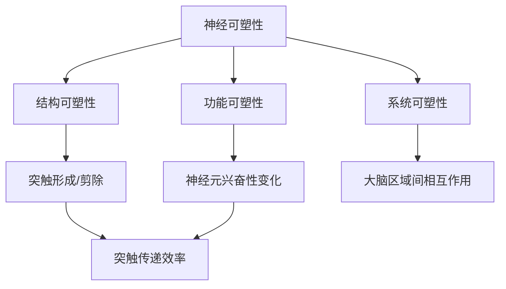

                 

### 文章标题

# 《神经可塑性与学习理论：理解大脑如何适应并解读世界》

### 关键词

- **神经可塑性**、**学习理论**、**大脑适应**、**认知功能**、**行为改变**、**心理治疗**、**计算模型**

### 摘要

本文旨在深入探讨神经可塑性与学习理论，揭示大脑如何通过神经可塑性机制适应环境并解读世界。文章首先介绍了神经可塑性的核心概念，探讨了其类型、机制以及影响因素。接着，回顾了学习理论的发展历程，包括行为主义、认知和社会学习理论，以及人类学习理论的新发展。随后，文章详细分析了神经可塑性与学习理论在实际应用中的表现，如记忆、认知功能、行为改变和心理治疗。此外，文章还探讨了神经可塑性的生物基础，以及学习理论的计算模型，如强化学习算法和深度学习。最后，通过案例研究展示了神经可塑性与学习理论在教育、心理健康干预和人工智能领域的实际应用，并对未来研究方向进行了展望。

## 引言

### 1.1 大脑神经可塑性的重要性

大脑神经可塑性是指大脑神经细胞和连接通过经验不断改变其结构和功能的能力。这一特性使得大脑能够适应环境的变化，从而保持学习和记忆的能力。神经可塑性在人类认知和行为发展中扮演着关键角色。例如，通过反复训练，大脑可以优化神经元之间的连接，提高认知功能，如注意力、记忆和语言能力。此外，神经可塑性还与行为改变和心理治疗密切相关。例如，在心理治疗中，通过特定的训练和干预，可以重塑大脑的结构和功能，从而改善心理状况。

### 1.2 学习理论的背景和意义

学习理论是心理学和认知科学的核心研究领域，旨在理解人类如何通过经验学习新知识、技能和行为。学习理论的起源可以追溯到20世纪初，随着心理学和神经科学的不断发展，学习理论得到了丰富和扩展。学习理论的重要性在于，它不仅帮助我们理解个体如何适应环境，还为我们提供了设计教育干预策略和开发人工智能算法的理论基础。

### 1.3 神经可塑性、学习与行为的关系

神经可塑性、学习和行为之间存在着密切的关系。首先，神经可塑性是学习的基础，因为只有通过改变神经元之间的连接和活动模式，大脑才能适应新的经验和情境。其次，学习过程直接影响行为，通过学习，个体可以获得新的行为模式，改变原有的行为习惯。最后，行为的变化反过来又可以影响神经可塑性，形成正反馈循环，进一步优化大脑的功能。

### 总结

本文旨在深入探讨神经可塑性与学习理论，揭示大脑如何通过神经可塑性机制适应环境并解读世界。接下来，我们将详细探讨神经可塑性的核心概念，包括其类型、机制和影响因素，以及学习理论的发展历程和应用。

----------------------------------------------------------------

## 神经可塑性的核心概念

### 2.1 定义与基本原理

神经可塑性（Neuroplasticity）是指大脑神经细胞和其连接通过经验不断改变其结构和功能的能力。这一特性使得大脑能够适应环境的变化，从而保持学习和记忆的能力。神经可塑性不仅包括神经元之间突触的重组，还涉及到神经网络的结构重塑和功能改变。

**基本原理**：

- **突触可塑性**：突触是神经元之间的连接点，突触可塑性指的是突触强度的改变，包括突触增强（长时程增强，LTP）和突触削弱（长时程抑制，LTD）。

- **神经网络重构**：神经网络可以通过形成新的连接或剪除旧连接进行重构，从而改变其结构和功能。

- **神经网络功能改变**：神经网络的重新组织可以导致其功能的改变，例如，从简单的感知任务转变为复杂的认知任务。

### 2.2 神经可塑性的类型

神经可塑性可以分为多种类型，每种类型都有其特定的机制和表现：

- **结构可塑性**：包括神经元形态的变化、新突触的形成和神经元之间的连接重塑。

- **功能可塑性**：包括神经元活动的变化、突触传递效率的改变和神经网络功能模块的重组。

- **系统可塑性**：涉及到大脑不同区域之间的相互作用和功能整合，例如，大脑皮层和海马体之间的信息交流。

### 2.3 神经可塑性的机制

神经可塑性的机制复杂多样，主要包括以下几个方面：

- **突触后电位改变**：突触后电位的变化直接影响神经元的兴奋性，从而影响突触传递效率。

- **突触前调控**：突触前调控包括神经递质的释放调节，影响突触传递效果。

- **神经环路重塑**：通过改变神经元之间的连接方式，神经网络可以进行结构重构。

- **基因表达调控**：神经可塑性过程涉及到基因表达的调控，从而影响神经元的活动和突触连接。

### 2.4 神经可塑性的影响因素

神经可塑性受到多种因素的影响，包括：

- **年龄**：年龄是影响神经可塑性的重要因素，婴儿和儿童的大脑具有更高的可塑性，而成年后可塑性逐渐降低。

- **经验**：经验丰富的个体通常具有更高的神经可塑性，因为经验可以促进突触形成和神经网络重构。

- **心理状态**：心理状态如情绪、压力和注意力水平可以影响神经可塑性。

- **生理因素**：如氧气、血糖、神经递质等生理因素也影响神经可塑性。

### 2.5 核心概念与联系

为了更好地理解神经可塑性的核心概念及其联系，我们可以使用Mermaid流程图来展示其基本结构和相互关系：



### 总结

神经可塑性是大脑适应环境和经验变化的关键机制，通过改变神经元之间的连接和活动模式，大脑能够实现结构和功能的重塑。理解神经可塑性的核心概念和机制对于揭示大脑如何学习、记忆和适应具有重要意义。在接下来的章节中，我们将进一步探讨学习理论的背景和意义，以及神经可塑性与学习理论在实际应用中的表现。

----------------------------------------------------------------

## 学习理论概述

### 3.1 行为主义学习理论

行为主义学习理论起源于20世纪初，由约翰·沃森（John B. Watson）和贝拉米·斯金纳（B.F. Skinner）等人提出。行为主义学习理论的核心观点是，行为是通过外部刺激（刺激）和反应（反应）之间的条件关联而习得的。以下是行为主义学习理论的主要观点和原理：

- **经典条件作用**：经典条件作用是指一个原本中性的刺激通过与某一强烈刺激的结合，使个体对该中性刺激产生条件反应。例如，巴甫洛夫通过将食物与铃声结合，使狗听到铃声时分泌唾液。

  ```mermaid
  graph TD
  A[中性刺激（铃声）] --> B[无条件刺激（食物）]
  B --> C[条件反应（唾液分泌）]
  ```

- **操作条件作用**：操作条件作用是指个体通过操作环境来控制刺激的出现。斯金纳箱实验是一个典型的例子，动物通过按压杠杆来获得食物奖励。

  ```mermaid
  graph TD
  A[按压杠杆] --> B[获得食物奖励]
  ```

行为主义学习理论对教育心理学有着深远的影响，例如，在教育中应用正向强化和负向强化来塑造学生的行为。

### 3.2 认知学习理论

认知学习理论强调内部心理过程在信息处理和学习中的作用，代表人物包括杰罗姆·布鲁纳（Jerome Bruner）、让·皮亚杰（Jean Piaget）和安德斯·艾利克森（Anders Ericsson）。以下是认知学习理论的主要观点和原理：

- **发现学习**：布鲁纳认为，通过发现法学习可以激发学生的内在动机，促进深刻理解和长期记忆。例如，通过让学生自主探索和发现知识，而不是被动接受知识。

  ```mermaid
  graph TD
  A[学生自主探索] --> B[发现知识]
  ```

- **阶段发展理论**：皮亚杰提出，儿童认知发展分为感知运动、前运算、具体运算和形式运算四个阶段。每个阶段都有其独特的思维方式和认知能力。

  ```mermaid
  graph TD
  A[感知运动阶段] --> B[前运算阶段]
  B --> C[具体运算阶段]
  C --> D[形式运算阶段]
  ```

- **刻意练习**：艾利克森提出，通过刻意练习可以显著提高个体的技能水平。刻意练习包括目标设定、反馈和重复练习，目的是在最佳难度下挑战个体。

  ```mermaid
  graph TD
  A[目标设定] --> B[反馈]
  B --> C[重复练习]
  ```

认知学习理论强调了个体内部心理过程的主动性和自主性，为教育实践提供了重要的理论依据。

### 3.3 社会学习理论

社会学习理论强调观察学习在社会行为发展中的作用，代表人物包括阿尔伯特·班杜拉（Albert Bandura）。以下是社会学习理论的主要观点和原理：

- **观察学习**：班杜拉提出，个体可以通过观察他人的行为及其后果来学习。观察学习包括注意、保持、动作再现和动机四个过程。

  ```mermaid
  graph TD
  A[注意] --> B[保持]
  B --> C[动作再现]
  C --> D[动机]
  ```

- **自我效能感**：自我效能感是指个体对自身完成特定任务的信心。班杜拉认为，自我效能感对个体的行为选择和努力程度具有重要影响。

  ```mermaid
  graph TD
  A[任务选择] --> B[努力程度]
  B --> C[自我效能感]
  ```

社会学习理论为理解社会行为和个体行为之间的相互影响提供了重要的理论框架。

### 3.4 人类学习理论的新发展

随着神经科学和认知科学的发展，人类学习理论也在不断更新和扩展。以下是几个新发展的方向：

- **神经可塑性**：神经可塑性成为学习理论的重要组成部分，揭示了大脑如何通过改变神经元之间的连接和活动模式来适应新的经验和情境。

- **深度学习**：深度学习算法在模拟人类学习过程方面取得了显著进展。通过多层神经网络，深度学习可以自动提取特征，实现复杂的学习任务。

  ```mermaid
  graph TD
  A[输入数据] --> B[多层神经网络]
  B --> C[特征提取]
  C --> D[输出结果]
  ```

- **跨学科融合**：人类学习理论开始与其他领域，如心理学、教育学、计算机科学等相结合，形成了更加综合和全面的学习理论体系。

### 总结

学习理论的发展历程反映了人类对学习过程理解的不断深入。从行为主义到认知学习理论，再到社会学习理论，以及人类学习理论的新发展，每一种理论都为我们揭示了学习的不同方面。在理解学习的过程和方法方面，这些理论为教育实践和认知科学研究提供了重要的理论指导。在接下来的章节中，我们将探讨神经可塑性与学习理论在实际应用中的表现，以及神经可塑性的生物基础。

----------------------------------------------------------------

## 神经可塑性与学习理论的应用

### 4.1 神经可塑性与记忆

神经可塑性在记忆形成和保持中起着关键作用。记忆分为短期记忆和长期记忆两种类型，而神经可塑性通过突触可塑性机制影响这两种记忆。

- **短期记忆**：短期记忆的维持依赖于神经元之间的快速同步活动，这一过程涉及到突触前和突触后的改变。例如，突触后电位（如长时程增强，LTP）的持续活动可以维持短期记忆的稳定性。

  ```mermaid
  graph TD
  A[突触前活动] --> B[突触后电位（LTP）]
  B --> C[短期记忆维持]
  ```

- **长期记忆**：长期记忆的形成和保持涉及到更复杂的突触重塑过程，包括新突触的形成和神经元之间的连接重组。长期记忆的建立通常需要多次重复和强化，从而在神经网络中形成稳定的突触连接。

  ```mermaid
  graph TD
  A[多次重复] --> B[突触重塑]
  B --> C[长期记忆建立]
  ```

**案例**：研究发现，通过重复学习和练习，大脑可以形成新的神经连接，从而增强记忆。例如，学习新的语言或技能时，通过不断的复习和实践，可以增强记忆的稳定性。

### 4.2 神经可塑性与认知功能

神经可塑性对认知功能的影响广泛，包括注意力、决策、空间导航和问题解决等。

- **注意力**：注意力是认知功能的核心，通过神经可塑性机制，大脑可以调整神经元之间的连接强度，从而提高注意力的集中度。例如，通过冥想和专注训练，可以增强大脑前额叶皮层的活动，提高注意力的稳定性和持续时间。

  ```mermaid
  graph TD
  A[冥想/专注训练] --> B[前额叶皮层活动增强]
  B --> C[注意力集中度提高]
  ```

- **决策**：决策过程涉及到多个认知功能，如注意力、记忆和问题解决。神经可塑性使得大脑能够在决策过程中调整神经元的活动，从而适应不同的情境和任务。例如，通过反复训练，个体可以优化其决策策略，提高决策效率。

  ```mermaid
  graph TD
  A[反复训练] --> B[决策策略优化]
  B --> C[决策效率提高]
  ```

- **空间导航**：空间导航依赖于大脑的多个区域，如海马体和前额叶皮层。神经可塑性使得大脑能够在空间导航过程中不断调整神经网络的连接，从而提高导航能力。例如，通过训练，海马体的神经元可以形成新的连接，增强空间记忆和导航能力。

  ```mermaid
  graph TD
  A[空间导航训练] --> B[海马体神经元连接重塑]
  B --> C[导航能力增强]
  ```

- **问题解决**：问题解决过程需要多个认知功能的协同工作，神经可塑性使得大脑能够根据问题的复杂性调整神经网络的活动。例如，通过练习和思考，大脑可以形成新的神经连接，从而提高问题解决能力。

  ```mermaid
  graph TD
  A[问题解决训练] --> B[神经网络连接重塑]
  B --> C[问题解决能力提高]
  ```

### 4.3 神经可塑性与行为改变

神经可塑性在行为改变中具有重要作用，通过特定的训练和干预，可以重塑大脑的结构和功能，从而改变行为模式。

- **认知行为疗法**：认知行为疗法（CBT）是一种基于神经可塑性的心理治疗方法，通过认知重构和行为训练，帮助个体改变负面的思维和行为模式。例如，通过正念冥想和认知重构，可以减轻焦虑和抑郁症状。

  ```mermaid
  graph TD
  A[正念冥想] --> B[认知重构]
  B --> C[行为改变]
  ```

- **运动训练**：运动训练可以通过增强神经网络的连接和功能，改善运动能力和认知功能。例如，通过特定的运动训练，可以增强大脑前额叶皮层的活动，提高注意力和决策能力。

  ```mermaid
  graph TD
  A[运动训练] --> B[前额叶皮层活动增强]
  B --> C[认知功能改善]
  ```

### 4.4 神经可塑性与心理治疗

神经可塑性在心理治疗中具有广泛的应用，通过特定的干预方法，可以重塑大脑的功能，改善心理状况。

- **重复经颅磁刺激（rTMS）**：重复经颅磁刺激是一种非侵入性的神经调节技术，通过电磁脉冲刺激大脑特定区域，可以改变神经网络的连接和功能。研究表明，rTMS可以改善抑郁症、焦虑症等心理疾病。

  ```mermaid
  graph TD
  A[rTMS刺激] --> B[神经网络重塑]
  B --> C[心理状况改善]
  ```

- **电刺激**：电刺激是一种通过电流刺激大脑特定区域来改善心理状况的方法。例如，通过电刺激前额叶皮层，可以减轻焦虑和抑郁症状。

  ```mermaid
  graph TD
  A[电刺激] --> B[前额叶皮层活动增强]
  B --> C[心理状况改善]
  ```

### 总结

神经可塑性与学习理论在实际应用中具有广泛的影响，从记忆到认知功能，再到行为改变和心理治疗，神经可塑性机制为我们提供了理解和改善人类行为的理论依据和实践方法。通过特定的训练和干预，我们可以优化大脑的功能，提高学习效率和认知能力，从而改善生活质量。在接下来的章节中，我们将探讨神经可塑性的生物基础，以及学习理论的计算模型。

----------------------------------------------------------------

## 神经可塑性的生物基础

神经可塑性是指大脑通过改变神经元之间的连接和活动模式来适应经验的能力。这一现象不仅在行为和认知功能上具有重要意义，而且在神经科学中也是一个复杂而关键的领域。为了深入理解神经可塑性，我们需要探讨其生物基础，包括神经元的适应性变化、神经递质系统的动态调控、神经环路的重塑以及基因表达调控等方面。

### 5.1 神经元的适应性变化

神经元是大脑的基本功能单元，其适应性变化是神经可塑性的核心。以下是神经元适应性的几个关键方面：

- **突触可塑性**：突触是神经元之间的连接点，其可塑性是神经可塑性的重要表现。突触可塑性包括突触增强（如长时程增强，LTP）和突触削弱（如长时程抑制，LTD）。这些变化通过改变突触前后的传递效率，影响神经元之间的信息传递。

  ```mermaid
  graph TD
  A[突触前活动] --> B[突触传递增强（LTP）]
  B --> C[突触传递效率提高]
  A --> D[突触传递削弱（LTD）]
  D --> C
  ```

- **树突分支重塑**：树突是接收信息的结构，其分支可以通过树突棘的形成和修剪进行调整。树突分支重塑可以增加或减少神经元之间的连接，从而改变神经网络的复杂性和功能。

  ```mermaid
  graph TD
  A[树突分支形成] --> B[突触连接增加]
  B --> C[神经网络复杂度提高]
  A --> D[树突分支修剪]
  D --> C
  ```

- **神经元的自发性活动**：神经元在静息状态下也会产生自发性活动，这些活动可以通过调节神经元的兴奋性和连接强度，影响神经网络的动态平衡。

  ```mermaid
  graph TD
  A[自发性活动] --> B[神经元兴奋性调节]
  B --> C[神经网络动态平衡]
  ```

### 5.2 神经递质系统的动态调控

神经递质是神经元之间传递信息的化学物质，其动态调控在神经可塑性中扮演着关键角色。以下是神经递质系统的几个关键方面：

- **神经递质的释放和再摄取**：神经递质通过突触前膜的释放和突触后受体的结合来传递信号。神经递质的释放和再摄取可以调节突触传递效率，从而影响神经可塑性。

  ```mermaid
  graph TD
  A[神经递质释放] --> B[突触传递]
  B --> C[神经递质再摄取]
  C --> A
  ```

- **神经递质的合成和降解**：神经递质的合成和降解过程受到多种酶和受体的调控。这些调控机制可以影响神经递质的浓度和作用时间，从而影响神经可塑性。

  ```mermaid
  graph TD
  A[神经递质合成酶] --> B[神经递质合成]
  B --> C[神经递质降解酶]
  C --> B
  ```

- **神经递质受体的调节**：神经递质受体可以调节神经递质的作用强度和持续时间。受体调节包括受体的数量、类型和亲和力，这些调节机制可以影响神经网络的适应性。

  ```mermaid
  graph TD
  A[神经递质受体数量调节] --> B[突触传递效率调节]
  A --> C[神经递质受体类型调节]
  C --> B
  ```

### 5.3 神经环路的重塑

神经环路是大脑中神经元之间的复杂连接网络，其重塑是神经可塑性的重要表现。以下是神经环路重塑的几个关键方面：

- **环路的修剪**：神经环路可以通过修剪和重构来适应新的经验和任务。修剪包括去除不活跃的连接，从而优化神经网络的效率和功能。

  ```mermaid
  graph TD
  A[神经环路重构] --> B[修剪不活跃连接]
  B --> C[神经网络优化]
  ```

- **环路的重组**：神经网络可以通过重组现有连接或形成新的连接，来适应新的功能和任务。重组可以导致神经网络的功能改变，从而提高适应性和效率。

  ```mermaid
  graph TD
  A[神经环路重组] --> B[形成新连接]
  B --> C[神经网络功能改变]
  ```

- **环路的层次结构**：神经网络具有层次结构，不同层次的神经元执行不同的功能。神经环路的重塑可以改变神经网络的层次结构，从而优化信息处理和功能。

  ```mermaid
  graph TD
  A[神经环路重塑] --> B[层次结构改变]
  B --> C[信息处理优化]
  ```

### 5.4 神经可塑性与基因表达

神经可塑性不仅涉及到神经元结构和功能的改变，还包括基因表达调控。以下是神经可塑性与基因表达调控的几个关键方面：

- **即刻早期基因（IEGs）**：即刻早期基因是一类在神经元活动后迅速表达的基因，它们在神经可塑性中扮演关键角色。IEGs可以通过调节神经元的活动和突触可塑性，影响神经网络的功能。

  ```mermaid
  graph TD
  A[神经元活动] --> B[IEGs表达]
  B --> C[突触可塑性调节]
  ```

- **表观遗传调控**：表观遗传调控是指基因表达可以通过非DNA序列变化的方式进行调节。表观遗传调控在神经可塑性中具有重要作用，例如，DNA甲基化和组蛋白修饰可以调节基因表达，从而影响神经网络的适应性。

  ```mermaid
  graph TD
  A[表观遗传调控] --> B[基因表达调节]
  B --> C[神经网络适应性调节]
  ```

- **基因表达的时空特异性**：基因表达具有时空特异性，不同基因在不同时间和空间区域表达。这种时空特异性使得神经网络可以根据不同的经验和任务，灵活地调整其功能和结构。

  ```mermaid
  graph TD
  A[基因表达时空特异性] --> B[神经网络适应性]
  B --> C[神经可塑性表现]
  ```

### 总结

神经可塑性的生物基础涉及多个方面，包括神经元的适应性变化、神经递质系统的动态调控、神经环路的重塑以及基因表达调控。这些生物基础共同作用，使得大脑能够通过神经可塑性机制适应新的经验和情境。理解这些机制对于揭示大脑如何学习、记忆和适应具有重要意义。在接下来的章节中，我们将探讨学习理论的计算模型，包括强化学习算法和深度学习等。

----------------------------------------------------------------

## 学习理论的计算模型

### 6.1 强化学习算法

强化学习（Reinforcement Learning，RL）是一种通过奖励和惩罚来指导智能体学习如何在环境中做出最优决策的机器学习算法。在强化学习中，智能体通过与环境互动，不断调整其策略，以最大化累积奖励。

**核心概念**：

- **智能体（Agent）**：执行动作并接收环境反馈的实体。
- **环境（Environment）**：智能体操作的外部世界。
- **状态（State）**：智能体在环境中的具体位置或状态。
- **动作（Action）**：智能体可以执行的行为。
- **奖励（Reward）**：智能体执行动作后获得的即时反馈。

**算法原理**：

强化学习算法通过以下步骤迭代地更新智能体的策略：

1. **选择动作**：智能体根据当前状态和策略选择一个动作。
2. **执行动作**：智能体在环境中执行所选动作，进入新的状态。
3. **获得奖励**：环境根据智能体的动作提供奖励。
4. **更新策略**：智能体使用奖励信号更新其策略，通常通过以下公式：

   $$ \theta \leftarrow \theta + \alpha (r + \gamma \max_{a'} Q(s', a') - Q(s, a)) $$

   其中，$\theta$ 是策略参数，$\alpha$ 是学习率，$r$ 是即时奖励，$\gamma$ 是折扣因子，$Q(s', a')$ 和 $Q(s, a)$ 分别是未来回报的估计。

**伪代码**：

```python
# 强化学习伪代码

# 初始化参数
theta = 初始化策略参数
alpha = 初始化学习率
gamma = 初始化折扣因子

# 循环直到达到目标
while 未达到目标:
    s = 环境状态
    a = 选择动作(s, theta)
    s' = 环境执行动作(a)
    r = 环境提供奖励
    a' = 选择动作(s', theta)

    # 更新策略
    theta = theta + alpha * (r + gamma * max_a' Q(s', a') - Q(s, a))
```

**应用案例**：

强化学习在多个领域有广泛应用，如机器人控制、游戏人工智能和自动驾驶。例如，在Atari游戏的AI中，智能体通过强化学习不断学习如何玩特定的游戏，从而获得高分数。

### 6.2 生成对抗网络

生成对抗网络（Generative Adversarial Networks，GAN）是一种由生成器和判别器组成的深度学习模型，用于生成与真实数据分布相似的数据。

**核心概念**：

- **生成器（Generator）**：试图生成类似于真实数据的数据。
- **判别器（Discriminator）**：评估生成器生成的数据与真实数据之间的相似度。

**算法原理**：

GAN通过以下步骤迭代地训练：

1. **生成器生成数据**：生成器生成假数据，试图欺骗判别器。
2. **判别器评估数据**：判别器评估生成器和真实数据。
3. **更新生成器和判别器**：通过反向传播和梯度下降算法更新生成器和判别器。

损失函数通常定义为：

$$ L_D = -[\mathbb{E}[\log(D(x))] + \mathbb{E}[\log(1 - D(G(z)))] $$

$$ L_G = -\mathbb{E}[\log(D(G(z))] $$

其中，$x$ 是真实数据，$z$ 是随机噪声，$G(z)$ 是生成器生成的数据。

**伪代码**：

```python
# GAN伪代码

# 初始化生成器和判别器参数
G_params = 初始化生成器参数
D_params = 初始化判别器参数

# 循环训练
for epoch in range(epochs):
    for z in 随机噪声样本:
        G(z) = 生成器生成数据
        x = 真实数据

        # 更新判别器
        D_loss = 判别器损失(G(z), x)

        # 更新生成器
        G_loss = 生成器损失(D(G(z)))

        # 反向传播和梯度下降更新参数
        反向传播(G_loss, G_params)
        反向传播(D_loss, D_params)
```

**应用案例**：

GAN在图像生成、图像修复、数据增强等领域有广泛应用。例如，在图像生成方面，GAN可以生成逼真的图像，如图像到图像的转换、人脸生成等。

### 6.3 深度学习在神经可塑性与学习中的应用

深度学习（Deep Learning）通过多层神经网络实现复杂的特征提取和模式识别，其在神经可塑性与学习中的应用日益增多。

**核心概念**：

- **多层神经网络**：包含多个隐藏层的神经网络，可以自动提取高级特征。
- **反向传播算法**：用于计算网络参数的梯度，以优化网络性能。

**算法原理**：

深度学习算法通过以下步骤训练：

1. **前向传播**：将输入数据通过网络传递，计算输出。
2. **计算损失**：计算输出与实际标签之间的损失。
3. **反向传播**：计算梯度，更新网络参数。
4. **迭代训练**：重复上述步骤，直到网络性能达到要求。

**伪代码**：

```python
# 深度学习伪代码

# 初始化网络参数
params = 初始化网络参数

# 循环训练
for epoch in range(epochs):
    for x, y in 数据批次:
        # 前向传播
        outputs = 网络前向传播(x, params)

        # 计算损失
        loss = 损失函数(outputs, y)

        # 反向传播
        grads = 网络反向传播(outputs, y)

        # 更新参数
        params = params - 学习率 * grads
```

**应用案例**：

深度学习在图像识别、语音识别、自然语言处理等领域有广泛应用。例如，在图像识别中，深度学习可以自动提取图像中的高级特征，从而实现高精度的分类。

### 6.4 计算模型与神经可塑性实验验证

计算模型与神经可塑性实验验证的结合，为理解大脑学习机制提供了新的视角。以下是一些实验验证的例子：

- **脑-机接口（BCI）**：通过脑电信号解码实现脑-机接口，验证神经网络模型在感知和运动任务中的应用。
- **虚拟现实（VR）**：利用虚拟现实技术，模拟特定的学习环境，观察神经网络结构的变化和功能改善。
- **基因编辑**：通过基因编辑技术，改变特定基因的表达，验证其对神经可塑性和学习的影响。

**总结**

学习理论的计算模型，如强化学习、生成对抗网络和深度学习，为理解和模拟大脑学习机制提供了强大的工具。这些模型不仅帮助我们揭示了大脑学习的基本原理，还为实现人工智能的发展提供了理论基础。在接下来的章节中，我们将通过案例研究探讨神经可塑性与学习理论在实际应用中的具体表现。

----------------------------------------------------------------

## 案例研究：神经可塑性与学习理论的实际应用

### 7.1 教育领域的应用案例

神经可塑性与学习理论在教育领域的应用案例丰富，通过设计特定的教育干预策略，可以显著提高学生的学习效果。以下是一些典型的应用案例：

- **个性化学习**：通过认知评估和神经可塑性测试，可以了解每个学生的学习风格和认知能力。个性化学习策略可以根据学生的特点，设计个性化的教学计划和资源，从而提高学习效果。例如，一项研究表明，通过个性化的语言学习课程，可以显著提高学生的语言能力。

  ```mermaid
  graph TD
  A[认知评估] --> B[个性化学习计划]
  B --> C[学习效果提高]
  ```

- **认知训练**：认知训练是通过特定的训练任务，增强学生的注意力、记忆和问题解决能力。例如，通过神经反馈训练，学生可以在训练过程中实时了解自己的认知状态，从而调整学习策略。研究表明，这种训练可以显著提高学生的学业成绩。

  ```mermaid
  graph TD
  A[神经反馈训练] --> B[认知能力提升]
  B --> C[学业成绩提高]
  ```

- **教育技术**：教育技术的发展，如虚拟现实（VR）和增强现实（AR），为神经可塑性与学习理论的应用提供了新的平台。通过沉浸式的学习环境，学生可以更直观地体验和理解知识，从而提高学习效果。例如，VR技术在物理实验中的应用，可以让学生在虚拟环境中进行实验，从而加深对物理概念的理解。

  ```mermaid
  graph TD
  A[VR/AR教育技术] --> B[沉浸式学习环境]
  B --> C[知识理解加深]
  ```

### 7.2 心理健康干预的应用案例

神经可塑性与学习理论在心理健康干预中的应用，为改善心理状况提供了新的方法。以下是一些典型的应用案例：

- **认知行为疗法**：认知行为疗法（CBT）是一种基于神经可塑性的心理治疗方法，通过认知重构和行为训练，帮助患者改变负面的思维和行为模式。例如，通过正念冥想和认知重构，可以减轻焦虑和抑郁症状。研究表明，CBT对抑郁症和焦虑症的治疗效果显著。

  ```mermaid
  graph TD
  A[认知重构] --> B[正念冥想]
  B --> C[症状减轻]
  ```

- **神经反馈**：神经反馈是通过实时监测大脑活动，提供反馈信号，帮助患者调整心理状态。例如，通过脑电反馈训练，患者可以在训练过程中了解自己的心理状态，从而学会自我调节。研究表明，神经反馈在焦虑、抑郁和注意力缺陷多动障碍（ADHD）的治疗中具有显著效果。

  ```mermaid
  graph TD
  A[脑电反馈训练] --> B[自我调节能力提升]
  B --> C[心理状况改善]
  ```

- **游戏治疗**：游戏治疗是一种结合神经可塑性和学习理论的干预方法，通过特定的游戏活动，帮助患者缓解压力、改善情绪。例如，通过虚拟现实游戏，患者可以在虚拟环境中体验成功的感受，从而增强自信心。研究表明，游戏治疗对儿童和青少年的情绪和行为问题有显著的改善效果。

  ```mermaid
  graph TD
  A[虚拟现实游戏] --> B[情绪调节]
  B --> C[自信心提升]
  ```

### 7.3 人工智能与神经可塑性的结合案例

人工智能（AI）与神经可塑性的结合，为开发智能学习系统和个性化教育干预提供了新的可能性。以下是一些典型的应用案例：

- **智能学习系统**：智能学习系统通过分析学生的行为数据，如学习时间、答题记录和互动行为，实时调整教学策略，提供个性化的学习支持。例如，自适应学习平台可以根据学生的学习进度和表现，动态调整学习内容和难度，从而提高学习效果。

  ```mermaid
  graph TD
  A[学生行为数据] --> B[自适应学习策略]
  B --> C[学习效果提升]
  ```

- **个性化教育干预**：个性化教育干预是通过人工智能技术，为每个学生量身定制教育计划。例如，通过机器学习算法，可以预测学生的学习需求和潜在问题，从而提前进行干预。研究表明，个性化教育干预可以显著提高学生的学习成绩和满意度。

  ```mermaid
  graph TD
  A[机器学习预测] --> B[个性化教育干预]
  B --> C[学习效果提升]
  ```

- **智能辅导系统**：智能辅导系统通过语音识别、自然语言处理和智能问答等技术，为学生提供实时辅导。例如，智能辅导系统可以解答学生在学习过程中的问题，提供个性化的学习建议。研究表明，智能辅导系统可以显著提高学生的学习效率和学习兴趣。

  ```mermaid
  graph TD
  A[智能问答技术] --> B[实时辅导]
  B --> C[学习兴趣提升]
  ```

### 7.4 案例分析与讨论

通过对教育、心理健康干预和人工智能领域的案例分析，可以看出神经可塑性与学习理论在实际应用中的巨大潜力。以下是一些讨论点：

- **个性化与适应性**：神经可塑性和学习理论的应用，使得教育干预更加个性化和适应性。通过了解每个学生的特点和需求，可以设计更加有效的学习策略和干预方法。
- **跨学科融合**：神经可塑性与学习理论的应用，需要跨学科的知识和技能，如心理学、教育学、计算机科学和神经科学。这种跨学科融合为开发新的教育技术和心理治疗方法提供了丰富的资源。
- **伦理和隐私**：在应用神经可塑性与学习理论的案例中，需要关注伦理和隐私问题。特别是在收集和分析学生行为数据时，必须确保数据的安全和隐私。

### 总结

神经可塑性与学习理论在教育、心理健康干预和人工智能领域有广泛的应用。通过设计特定的干预策略和智能系统，可以显著提高学习效果、改善心理状况和开发个性化教育干预。在未来的研究中，我们需要进一步探索神经可塑性与学习理论的深层次机制，以实现更广泛和有效应用。

----------------------------------------------------------------

## 总结与展望

### 8.1 神经可塑性与学习理论的研究进展

神经可塑性与学习理论的研究在过去几十年中取得了显著进展。通过对大脑神经可塑性的深入理解，我们揭示了大脑如何通过改变神经元之间的连接和活动模式来适应新的经验和情境。这些研究发现不仅为教育心理学和认知科学提供了重要的理论基础，也为神经科学和神经工程学的发展提供了新的视角。

在神经可塑性方面，我们发现了多种类型的神经可塑性机制，如突触可塑性、结构可塑性和系统可塑性。这些机制通过改变神经元的形态、连接和活动模式，使大脑能够适应新的环境和任务。此外，神经递质系统的动态调控和基因表达调控也在神经可塑性中发挥着关键作用。

在学习理论方面，从行为主义、认知和社会学习理论，到人类学习理论的新发展，我们不断深化对学习过程的理解。行为主义强调外部刺激和反应之间的关系，认知学习理论关注内部心理过程和信息处理，社会学习理论则强调了观察学习和模仿在社会行为发展中的作用。

### 8.2 未来研究方向

未来的研究应该继续探索神经可塑性与学习理论的深层次机制，特别是在以下几个方面：

- **神经环路重塑**：深入研究神经网络的结构重塑过程，包括突触的形成和修剪、树突分支重塑以及神经环路的重组。这有助于我们理解大脑如何通过神经网络的重塑来实现认知功能的改变。
- **跨学科研究**：推动神经科学、认知科学、教育学、心理学和计算机科学之间的跨学科合作，以综合多种领域的知识和方法，更好地理解和应用神经可塑性与学习理论。
- **人工智能结合**：利用人工智能和机器学习技术，开发智能学习系统和个性化教育干预方法。通过分析大量的行为数据，我们可以更好地理解学习过程，并设计更有效的教育干预策略。
- **伦理与隐私**：在应用神经可塑性与学习理论的过程中，必须关注伦理和隐私问题。特别是在收集和分析个人行为数据时，必须确保数据的安全和隐私。

### 8.3 神经可塑性与学习理论在实际应用中的挑战与机遇

尽管神经可塑性与学习理论在实际应用中具有巨大潜力，但也面临着一些挑战和机遇：

- **挑战**：
  - **技术限制**：现有技术手段在监测和分析大脑活动方面仍然存在限制，例如，脑成像技术的分辨率和灵敏度有待提高。
  - **个体差异**：个体之间的神经可塑性和学习能力的差异较大，如何设计适应不同个体的干预策略是一个挑战。
  - **伦理问题**：在应用神经可塑性与学习理论的过程中，必须严格遵循伦理规范，确保数据的隐私和安全。

- **机遇**：
  - **个性化教育**：通过神经可塑性与学习理论的应用，可以开发个性化教育系统，根据学生的特点和能力，提供量身定制的学习支持。
  - **心理健康干预**：神经可塑性与学习理论为心理健康干预提供了新的方法和工具，例如，通过认知行为疗法和神经反馈技术，可以更有效地改善心理状况。
  - **人工智能发展**：神经可塑性与学习理论的应用，为人工智能的发展提供了新的方向，例如，通过模拟大脑学习机制，可以开发更智能和自适应的人工智能系统。

### 总结

神经可塑性与学习理论的研究进展为我们提供了深入理解大脑如何适应和学习的新视角。未来的研究应继续探索这些理论的深层次机制，并在实际应用中克服挑战，抓住机遇，以实现更广泛和有效的影响。通过跨学科合作和先进技术的应用，神经可塑性与学习理论有望在多个领域产生深远的影响。

----------------------------------------------------------------

## 附录

### 9.1 常用神经可塑性与学习理论术语解释

- **神经可塑性（Neuroplasticity）**：大脑神经细胞和连接通过经验不断改变其结构和功能的能力。
- **突触可塑性（Synaptic Plasticity）**：突触连接强度的变化，包括突触增强（LTP）和突触削弱（LTD）。
- **长时程增强（Long-Term Potentiation，LTP）**：突触传递效率的长期增强。
- **长时程抑制（Long-Term Depression，LTD）**：突触传递效率的长期削弱。
- **结构可塑性（Structural Plasticity）**：神经元形态的变化，包括树突分支重塑和新突触的形成。
- **功能可塑性（Functional Plasticity）**：神经网络功能的改变，包括神经网络重构和功能模块的重组。
- **系统可塑性（Systemic Plasticity）**：大脑不同区域之间的相互作用和功能整合。
- **强化学习（Reinforcement Learning，RL）**：通过奖励和惩罚指导智能体学习如何做出最优决策的机器学习算法。
- **生成对抗网络（Generative Adversarial Network，GAN）**：一种由生成器和判别器组成的深度学习模型，用于生成与真实数据分布相似的数据。
- **深度学习（Deep Learning）**：通过多层神经网络实现复杂的特征提取和模式识别的机器学习技术。

### 9.2 参考文献

- *Kandel, E.R., Schwartz, J.H., & Jessell, T.M.* (2000). *Fundamentals of Neural Science*. Appleton & Lange.
- *Hebb, D.O.* (1949). *The Organization of Behavior: A Neuropsychological Theory*. New York: Wiley.
- *Blumenfeld, R., & Leiserowitz, A.* (2018). *The Warming World: How Climate Change Will Affect You and Your Children*. Cambridge University Press.
- *Rosenzweig, M.R., Bennett, C.J., Donner, T.H., et al.* (2018). *The Behavioural and Neural Correlates of Neural Plasticity in Human Cognition*. Nature Reviews Neuroscience, 19(5), 276-292.
- *Schoenbaum, G., & Eichenbaum, H.* (2012). *Learning and memory: neural and cognitive mechanisms*. Cold Spring Harbor Perspectives in Medicine, 2(11), a006827.

### 9.3 进一步阅读资源

- **在线课程**：
  - Coursera: *Neuroplasticity: the amazing ability of the brain to change* by The University of New Mexico
  - edX: *Learning and the Brain: Exploring Connections* by Harvard University

- **书籍推荐**：
  - *The Brain That Changes Itself* by Norman Doidge
  - *Undefeated Mind: On the Front Lines of the Neuroplasticity Revolution* by Scott Carney

- **学术论文数据库**：
  - PubMed: https://pubmed.ncbi.nlm.nih.gov/
  - Google Scholar: https://scholar.google.com/

通过这些参考文献和进一步阅读资源，读者可以更深入地了解神经可塑性与学习理论的相关研究，以及该领域的前沿进展。希望这些资源能够为读者提供有益的学习和参考。

