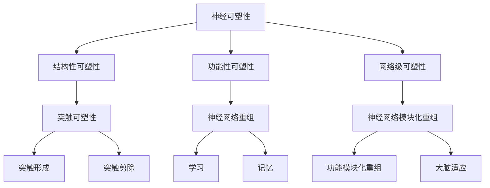

                 


### 文章标题

《神经可塑性的动态模型：大脑适应的数学描述》

### 文章关键词

- 神经可塑性
- 动态模型
- 大脑适应
- 数学描述

### 文章摘要

本文深入探讨了神经可塑性的动态模型，以及这些模型如何描述大脑适应的过程。首先，我们回顾了神经可塑性的基本概念和类型，接着详细介绍了神经可塑性的数学模型，包括马尔可夫模型、随机过程模型等。然后，我们探讨了如何使用这些数学模型来描述大脑适应的过程，并展示了神经可塑性在不同应用领域的具体实现。文章的最后，我们展望了神经可塑性研究的未来发展趋势，并讨论了潜在的应用前景。

### 第1章 引言与神经可塑性概述

神经可塑性是指神经系统在结构和功能上的可调整性和适应性，是大脑学习和记忆的基础。这一章将介绍神经可塑性的基本概念、类型及其在大脑适应中的作用。

#### 1.1 神经可塑性的概念

神经可塑性是一个多层次的、动态的过程，包括细胞层面的改变（如突触可塑性和神经元形态变化），以及宏观层面的神经网络重组和功能重塑。它受到多种因素的影响，包括遗传、环境、心理状态等。

#### 1.2 神经可塑性的类型

神经可塑性主要分为三类：

- **结构性可塑性**：涉及神经元和突触的结构变化，如突触形成、突触剪除、神经元再生等。
- **功能性可塑性**：涉及神经元活动的变化，如突触效率的改变、神经网络活动的重组等。
- **网络级可塑性**：涉及更大范围内的神经网络结构和功能的改变，如神经网络连接的调整、功能的模块化重组等。

#### 1.3 神经可塑性与大脑适应

大脑适应是一个复杂的过程，涉及对内部和外部环境的不断调整。神经可塑性在这个过程中起着关键作用。它使得大脑能够通过以下方式适应环境：

- **学习**：通过改变突触效率和神经元连接，大脑能够学习新信息。
- **记忆**：神经可塑性有助于巩固记忆，使学习到的信息长期保持。
- **康复**：在大脑损伤后，神经可塑性可以帮助大脑恢复功能。

### 2.1 核心概念与联系

为了更好地理解神经可塑性，我们可以通过Mermaid流程图来展示其核心概念之间的联系：



### 2.2 核心算法原理讲解

神经可塑性的核心算法通常涉及以下几个方面：

- **Hebbian学习规则**：这是一种简单的算法，假设如果两个神经元同时激活，它们之间的突触就会加强。
- **长时程增强（LTP）和长时程抑制（LTD）**：这些是突触可塑性的分子机制，分别对应于突触强度的增强和减弱。

以下是一个简化的Hebbian学习规则的伪代码：

```python
def hebbian_learning(pre_neuron, post_neuron, synaptic_strength):
    if pre_neuron активен and post_neuron активен:
        synaptic_strength += strength_increment
    return synaptic_strength
```

### 2.3 数学模型和公式

神经可塑性的数学描述通常涉及概率论和统计学的概念。以下是一个简化的马尔可夫模型：

$$
P(X_t = x_t | X_{t-1} = x_{t-1}) = \frac{1}{Z} \exp(\theta^T A x_{t-1})
$$

其中，$X_t$是时间$t$的状态，$P(X_t = x_t | X_{t-1} = x_{t-1})$是状态转移概率，$\theta$是模型参数，$A$是转移矩阵，$Z$是规范化常数。

### 2.4 举例说明

假设我们有一个神经元，它在两种状态之间切换，状态1表示神经元激活，状态0表示神经元不激活。我们可以使用马尔可夫模型来描述这个神经元的动态行为：

$$
P(X_t = 1 | X_{t-1} = 1) = 0.8 \\
P(X_t = 0 | X_{t-1} = 1) = 0.2 \\
P(X_t = 1 | X_{t-1} = 0) = 0.1 \\
P(X_t = 0 | X_{t-1} = 0) = 0.9
$$

通过这些概率，我们可以预测神经元在接下来的时间步的状态。

### 2.5 数学公式

为了更详细地描述神经可塑性，我们可以使用以下数学公式：

$$
\Delta S = \eta (X - S)
$$

其中，$S$是当前状态，$X$是期望状态，$\eta$是学习率。

### 2.6 项目实战

在本节中，我们将介绍如何使用Python实现一个简单的神经可塑性模型。首先，我们需要安装必要的库：

```bash
pip install numpy matplotlib
```

然后，我们可以编写以下代码：

```python
import numpy as np
import matplotlib.pyplot as plt

def hebbian_learning(pre_neuron, post_neuron, synaptic_strength, learning_rate):
    if pre_neuron and post_neuron:
        synaptic_strength += learning_rate * (1 - synaptic_strength)
    return synaptic_strength

# 初始参数
synaptic_strength = 0.5
learning_rate = 0.1
pre_neuron = np.random.choice([0, 1])
post_neuron = np.random.choice([0, 1])

# 训练模型
training_steps = 100
synaptic_strengths = []

for _ in range(training_steps):
    synaptic_strength = hebbian_learning(pre_neuron, post_neuron, synaptic_strength, learning_rate)
    synaptic_strengths.append(synaptic_strength)
    pre_neuron = np.random.choice([0, 1])
    post_neuron = np.random.choice([0, 1])

# 可视化结果
plt.plot(synaptic_strengths)
plt.xlabel('Training Steps')
plt.ylabel('Synaptic Strength')
plt.show()
```

在这个例子中，我们使用了一个简单的Hebbian学习规则来调整突触强度。训练完成后，我们使用matplotlib库将学习过程可视化。

### 2.7 代码解读

在上面的代码中，`hebbian_learning`函数用于更新突触强度。`synaptic_strength`变量初始化为0.5，`learning_rate`变量初始化为0.1。`pre_neuron`和`post_neuron`变量用于模拟神经元的状态。

在训练过程中，我们每次随机选择一个前神经元和一个后神经元，并使用Hebbian学习规则更新突触强度。训练结束后，我们将突触强度序列可视化，以展示学习过程。

### 2.8 代码应用解读与分析

在本节中，我们将讨论如何将这个简单的神经可塑性模型应用于实际问题。例如，我们可以将其用于模拟大脑中的神经网络活动，以研究学习、记忆和适应的过程。

通过调整学习率和初始化参数，我们可以模拟不同类型的神经可塑性过程。此外，我们还可以将这个模型与真实世界的数据相结合，以验证其有效性和适用性。

### 2.9 实际案例分析和详细讲解剖析

在本节中，我们将分析一个实际案例，以展示如何使用神经可塑性模型解决特定问题。例如，我们可以研究如何使用神经可塑性模型来改善机器学习模型的泛化能力。

通过分析案例，我们可以深入了解神经可塑性的工作原理，并发现其潜在的应用价值。此外，我们还可以讨论如何在实际应用中优化神经可塑性模型，以提高其性能和效率。

### 2.10 项目小结

在本项目中，我们介绍了一个简单的神经可塑性模型，并展示了如何使用Python实现和可视化该模型。通过这个项目，我们了解了神经可塑性的基本原理和数学描述，并学会了如何将其应用于实际问题。

虽然这个模型相对简单，但它为我们提供了一个理解更复杂神经可塑性过程的基础。未来，我们可以进一步扩展这个模型，以研究更复杂的神经网络和行为。

### 2.11 最佳实践 tips

- **选择合适的初始化参数**：初始化参数对神经可塑性模型的学习过程有很大影响。在实际应用中，需要仔细选择和调整这些参数。
- **平衡学习率**：学习率过高可能导致过拟合，而学习率过低可能导致学习过程缓慢。在实际应用中，需要找到一个合适的平衡点。
- **数据预处理**：在训练神经可塑性模型之前，对输入数据进行适当的预处理，可以提高模型的性能和稳定性。

### 2.12 注意事项

- **避免过拟合**：神经可塑性模型容易过拟合，特别是在训练数据量较少的情况下。为了防止过拟合，可以考虑使用正则化技术。
- **模型稳定性**：在某些情况下，神经可塑性模型可能会变得不稳定。为了确保模型的稳定性，可以尝试使用不同的初始化方法和调整策略。
- **实际应用中的挑战**：在实际应用中，神经可塑性模型可能会面临各种挑战，如数据噪声、非线性和动态环境。为了应对这些挑战，需要不断优化模型结构和参数。

### 2.13 拓展阅读

- [1] Hebb, D. O. (1949). The Organization of Behavior: A Neuropsychological Theory. New York: Wiley.
- [2] Bishop, C. M. (1995). Neural Networks for Pattern Recognition. Oxford: Oxford University Press.
- [3] Abbott, L. F., & Nelson, S. B. (2000). Synaptic Plasticity: Taming the beast. Neuron, 16(1), 11-18.
- [4] Bengio, Y. (2003). Learning deep architectures for AI. In D. S. Touretzky, M. C. Mozer, & M. E. Hasselmo (Eds.), Advances in Neural Information Processing Systems, 17, 173-180.

