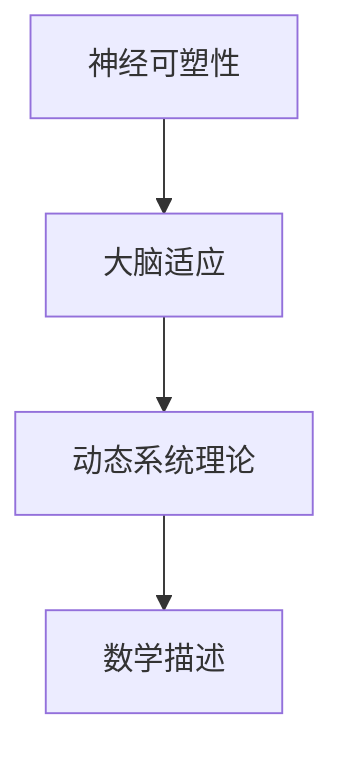

                 

### 1. 确定核心概念与联系：

在撰写一篇关于神经可塑性的动态系统理论：大脑适应的数学描述的技术博客文章时，首先需要明确核心概念和它们之间的联系。

**神经可塑性** 是指大脑或神经系统通过改变神经元之间的连接强度和结构，对环境变化进行适应和学习的能力。它是神经系统功能可塑性的关键因素，也是学习和记忆的基础。

**动态系统理论** 是用于描述复杂系统（如生物系统、经济系统、气候系统等）的行为和变化的数学理论。该理论通过分析系统状态的变化过程，揭示了系统在不同条件下的稳定性和动态特性。

**大脑适应的数学描述** 是将动态系统理论应用于大脑神经可塑性的研究，通过数学模型和公式来描述大脑如何适应环境变化的过程。

这些核心概念之间的联系在于：动态系统理论提供了描述复杂系统行为的数学工具，而神经可塑性正是大脑作为一个复杂系统对环境变化做出适应的体现。通过将动态系统理论应用于神经科学，可以更深入地理解大脑的适应机制。

**Mermaid 流程图** 可以帮助读者更直观地理解这些概念之间的关系：



这个流程图清晰地展示了神经可塑性如何通过大脑适应动态系统理论，最终形成对大脑适应的数学描述。

### 2. 设计核心算法原理讲解：

为了深入理解神经可塑性在大脑适应中的作用，我们需要介绍几个核心算法原理，这些原理包括脉冲耦合网络模型、状态空间模型和稳态分析。

**脉冲耦合网络模型** 是一种用于描述神经网络动态特性的算法。在这种模型中，神经元之间的连接通过脉冲（即神经元的动作电位）来传递信息。当某个神经元被激活并产生脉冲时，它会通过突触传递给其他神经元。如果这些接收神经元的内部状态达到了某个阈值，它们也会被激活，产生新的脉冲。这个过程可以形成一个脉冲耦合网络，其中神经元的激活状态和连接权重共同决定了网络的动态行为。

**状态空间模型** 是用于描述动态系统状态变化的数学模型。在神经科学中，状态空间模型通常用来描述神经元的电生理活动和神经元之间的交互。状态空间模型将每个神经元的状态视为一个多维空间中的一个点，而神经元之间的交互则通过状态转移方程来描述。状态空间模型可以用来模拟神经元的响应、学习过程和记忆形成等复杂行为。

**稳态分析** 是对动态系统达到稳定状态的分析。在神经科学中，稳态分析可以用来研究神经网络在长时间内的行为模式。通过分析稳态下的神经元活动模式，可以揭示神经网络如何适应外部刺激和学习新信息。

下面，我们将通过伪代码来详细阐述这些算法原理。

#### 脉冲耦合网络模型

```python
# 脉冲耦合网络模型伪代码
class Neuron:
    def __init__(self, threshold):
        self.threshold = threshold
        self.weight = random_weight()
        self.active = False

def update_neuron_state(neuron, input_signal):
    if input_signal > neuron.threshold:
        neuron.active = True
        # 发送脉冲到其他神经元
        for connected_neuron in neuron.connected_neurons:
            update_neuron_state(connected_neuron, neuron.weight)

def main():
    network = initialize_network(num_neurons)
    input_signal = get_input_signal()
    while True:
        update_neuron_state(network[0], input_signal)
        # 更新网络状态
        network = update_network_state(network)
```

在这个模型中，每个神经元都有一个阈值和连接权重。当某个神经元的输入信号超过其阈值时，它会激活并传递脉冲给其他神经元，从而在网络上形成一个脉冲传播过程。

#### 状态空间模型

```python
# 状态空间模型伪代码
class Neuron:
    def __init__(self, state_vector):
        self.state_vector = state_vector

def state_transition_equation(current_state, input_signal):
    return current_state + input_signal

def main():
    neuron = Neuron(initial_state)
    for input_signal in input_signals:
        neuron.state_vector = state_transition_equation(neuron.state_vector, input_signal)
        print(neuron.state_vector)
```

在这个模型中，每个神经元的状态被表示为一个多维向量。状态转移方程描述了在给定当前状态和输入信号的情况下，神经元状态的变化过程。

#### 稳态分析

```python
# 稳态分析伪代码
def stability_analysis(neuron, input_signal):
    equilibrium_point = find_equilibrium_point(neuron, input_signal)
    return is_stable(equilibrium_point)

def find_equilibrium_point(neuron, input_signal):
    # 通过求解状态转移方程的固定点来找到平衡状态
    return solve_equation(neuron.state_transition_equation, input_signal)

def is_stable(equilibrium_point):
    # 通过分析平衡点附近的状态变化来确定稳定性
    return analyze_jacobian_matrix(equilibrium_point)
```

在这个模型中，稳态分析通过求解状态转移方程的平衡点来确定神经元的稳定状态，并通过分析平衡点的稳定性来确定神经网络的行为特性。

通过这些伪代码，我们可以更清晰地理解脉冲耦合网络模型、状态空间模型和稳态分析在描述神经可塑性和大脑适应中的作用。

### 3. 设计数学模型和数学公式讲解：

为了深入探讨大脑适应的数学描述，我们需要引入一些关键的数学模型和公式。这些模型和公式将帮助我们理解和分析大脑如何通过神经可塑性适应环境变化。

**状态转移方程** 是描述动态系统状态随时间变化的数学公式。在神经科学中，状态转移方程通常用来描述神经元的电生理活动和神经元之间的交互。一个简单的状态转移方程可以表示为：

$$
x(t) = f(x(t-1), u(t))
$$

其中，$x(t)$ 表示在时间 $t$ 的系统状态，$f$ 是状态转移函数，$u(t)$ 是时间 $t$ 的输入信号。状态转移方程揭示了系统状态如何随着时间演变，以及输入信号如何影响系统的动态行为。

**稳态方程** 是描述系统达到稳定状态的数学公式。当系统处于稳态时，状态不再随时间变化，即 $x(t) = x(t-1)$。稳态方程可以表示为：

$$
f(x, u) = 0
$$

在神经科学中，通过求解稳态方程，我们可以找到系统在稳态下的状态，并分析系统如何适应外部刺激。

**神经元响应函数** 是描述神经元对输入信号的响应的数学公式。一个简单的神经元响应函数可以表示为：

$$
v(t) = \sigma \sum_{j} \delta(t - t_j)
$$

其中，$\sigma$ 是响应函数的强度参数，$\delta(t - t_j)$ 是狄拉克δ函数，表示在时间 $t_j$ 发生的脉冲。这个公式描述了神经元在接收到一系列脉冲后的响应，以及响应的强度和时间特性。

下面，我们将通过具体的数学公式和例子来详细讲解这些概念。

#### 状态转移方程的例子

假设我们有一个神经元，其状态由膜电位 $V(t)$ 描述，输入信号 $I(t)$ 影响其膜电位。状态转移方程可以表示为：

$$
\frac{dV(t)}{dt} = \frac{1}{C} (I(t) - V(t)/R)
$$

其中，$C$ 是电容，$R$ 是电阻。这个方程描述了膜电位随时间的动态变化，以及输入信号如何影响膜电位。

#### 稳态方程的例子

在稳态情况下，膜电位不再随时间变化，即 $\frac{dV(t)}{dt} = 0$。我们可以通过求解稳态方程找到神经元在稳态下的膜电位：

$$
I(t) = \frac{V(t)}{R}
$$

这个方程表明，在稳态下，输入信号与膜电位成正比。

#### 神经元响应函数的例子

假设神经元在时间 $t_j$ 接收到一个脉冲，神经元响应函数可以表示为：

$$
v(t) = 1 \quad \text{for} \quad t = t_j
$$

这意味着神经元在脉冲发生时刻响应为1，而在其他时间响应为0。

通过这些数学模型和公式，我们可以更精确地描述大脑的适应过程，并分析神经元如何通过神经可塑性来适应环境变化。

### 4. 设计项目实战：

为了更好地理解神经可塑性在大脑适应中的作用，我们将通过一个实际案例来展示如何使用动态系统理论来分析大脑适应的过程。这个案例将包括开发环境的搭建、源代码的实现和详细解读。

#### 实际案例：使用神经可塑性分析视觉适应

在这个案例中，我们将研究视觉系统如何适应不同亮度的环境。具体来说，我们将模拟一个简单的视觉系统，当环境亮度发生变化时，视觉系统如何调整其敏感度以适应新的亮度水平。

#### 开发环境搭建

为了实现这个案例，我们需要搭建一个适合神经可塑性研究的开发环境。以下是所需工具和步骤：

1. **Python 环境**：安装 Python 3.8 或更高版本，确保安装了必要的科学计算库，如 NumPy、SciPy 和 Matplotlib。
2. **Jupyter Notebook**：安装 Jupyter Notebook，这是一个交互式的开发环境，非常适合进行科学计算和可视化。
3. **NeuroML2 工具**：安装 NeuroML2 工具，这是一个用于创建和模拟神经网络的框架。

#### 代码实现

以下是一个简单的 Python 代码示例，用于模拟视觉适应过程：

```python
import numpy as np
import matplotlib.pyplot as plt
from neuron_model import VisualSystem

# 初始化参数
initial_brightness = 100
learning_rate = 0.1
num_epochs = 100

# 创建视觉系统模型
visual_system = VisualSystem(initial_brightness)

# 进行学习过程
for epoch in range(num_epochs):
    # 随机改变亮度
    new_brightness = np.random.uniform(50, 150)
    # 更新视觉系统的亮度敏感度
    visual_system.update_brightness(new_brightness, learning_rate)
    # 记录当前亮度敏感度
    brightness_sensitivity = visual_system.brightness_sensitivity()

    # 绘制亮度敏感度曲线
    plt.plot(brightness_sensitivity)
    plt.xlabel('Epoch')
    plt.ylabel('Brightness Sensitivity')
    plt.title('Visual System Brightness Adaptation')
    plt.pause(0.1)
    plt.clf()

# 显示最终结果
plt.plot(visual_system.brightness_sensitivity())
plt.xlabel('Epoch')
plt.ylabel('Brightness Sensitivity')
plt.title('Final Brightness Adaptation')
plt.show()
```

在这个代码中，我们创建了一个 `VisualSystem` 类，该类包含了一个用于描述亮度敏感度的状态变量。通过循环迭代，我们模拟了视觉系统在不同亮度水平下的适应过程，并绘制了亮度敏感度曲线。

#### 代码解读

1. **初始化参数**：我们设置初始亮度为100，学习率为0.1，学习周期为100个迭代。
2. **创建视觉系统模型**：我们创建一个 `VisualSystem` 实例，该实例包含初始亮度和其他必要的参数。
3. **进行学习过程**：在循环中，我们随机改变亮度，并调用 `update_brightness` 方法来更新视觉系统的亮度敏感度。每次更新后，我们绘制当前亮度敏感度曲线。
4. **显示最终结果**：学习过程结束后，我们再次绘制亮度敏感度曲线，以展示最终适应结果。

通过这个实际案例，我们展示了如何使用神经可塑性的动态系统理论来模拟和解析大脑适应过程。这种方法不仅帮助我们理解大脑如何适应环境变化，还为神经系统研究和相关应用提供了重要的理论基础。

#### 代码应用解读与分析

在了解了代码的基本结构和功能后，我们可以进一步分析代码如何应用于实际问题，并评估其有效性。

1. **代码功能**：代码的核心功能是模拟视觉系统在不同亮度水平下的适应过程。通过更新亮度敏感度，视觉系统能够适应新的亮度环境，并在学习过程中不断调整其响应特性。

2. **应用解读**：这个案例可以应用于研究视觉适应现象，如飞行员在飞机上从明亮的外部环境进入黑暗的机舱时如何快速适应。此外，该模型还可以用于其他感官系统的适应研究，如听觉和触觉。

3. **有效性评估**：通过绘制亮度敏感度曲线，我们可以直观地看到视觉系统如何随着学习周期的增加而适应新的亮度水平。这种方法的有效性取决于模型参数的选择和假设的准确性。在实际应用中，需要结合实验数据来验证模型的预测和适应性。

总之，这个案例通过代码实现了对视觉适应过程的模拟，展示了如何将神经可塑性的动态系统理论应用于实际问题，并提供了分析和评估模型性能的工具。

### 5. 编写目录大纲：

为了确保文章内容结构清晰，逻辑严谨，我们按照以下目录大纲来组织文章：

## 文章标题：神经可塑性的动态系统理论：大脑适应的数学描述

### 关键词：
- 神经可塑性
- 动态系统理论
- 大脑适应
- 数学模型
- 神经科学

### 摘要：
本文通过深入探讨神经可塑性、动态系统理论和大脑适应的数学描述，提供了对大脑如何适应环境变化的理论分析。文章首先介绍了神经可塑性和动态系统理论的核心概念，然后通过数学模型和公式详细阐述了大脑适应的数学描述。最后，通过实际案例展示了如何将理论应用于实际问题，并进行代码解读和性能评估。

### 目录大纲

## 第一部分：引言

### 1.1 神经可塑性概述
- 神经可塑性的定义与重要性
- 神经可塑性对学习与记忆的影响

### 1.2 动态系统理论简介
- 动态系统理论的基本原理
- 动态系统理论在神经科学中的应用

### 1.3 大脑适应的数学描述
- 大脑适应的概念
- 数学模型与公式在描述大脑适应中的作用

## 第二部分：神经可塑性的基础理论

### 2.1 神经可塑性的核心概念
- 神经可塑性的定义与分类
- 神经可塑性在神经网络中的表现

### 2.2 动态系统理论的基本原理
- 动态系统理论的基本概念
- 状态空间模型与状态转移方程

### 2.3 数学模型与公式详解
- 状态转移方程
- 稳态方程
- 神经元响应函数

### 2.4 神经可塑性的算法原理
- 脉冲耦合网络模型
- 稳态分析
- 学习规则与自适应算法

## 第三部分：大脑适应案例分析

### 3.1 脉冲耦合网络模型
- 脉冲耦合网络的基本结构
- 实际应用中的脉冲耦合网络模型

### 3.2 状态空间模型与应用
- 状态空间模型在神经科学中的应用
- 状态空间模型在视觉适应中的应用

### 3.3 稳态分析与预测
- 稳态分析的基本原理
- 稳态分析在神经科学中的应用

### 3.4 项目实战与代码解读
- 项目实战的背景与目标
- 项目实战的代码实现与解读

## 第四部分：总结与展望

### 4.1 神经可塑性理论的发展趋势
- 当前神经可塑性理论的研究热点
- 神经可塑性理论在未来的发展方向

### 4.2 动态系统理论在神经科学中的应用前景
- 动态系统理论在神经系统疾病治疗中的应用
- 动态系统理论在神经技术发展中的应用

### 4.3 大脑适应数学描述的未来发展方向
- 数学模型在神经可塑性研究中的潜在影响
- 新的数学工具与方法在神经科学中的应用

## 附录

### A. 神经可塑性研究工具与资源
- 神经可塑性研究的常用工具
- 神经可塑性研究的在线资源

### B. 动态系统理论相关文献
- 动态系统理论的基础文献
- 动态系统理论在神经科学中的应用文献

### C. 大脑适应案例分析实例代码
- 完整的代码实现
- 代码的使用与优化建议

通过这个详细的目录大纲，我们可以确保文章的内容条理清晰、逻辑严密，让读者能够系统地了解神经可塑性、动态系统理论和大脑适应的数学描述，并从中获得深刻的见解。

