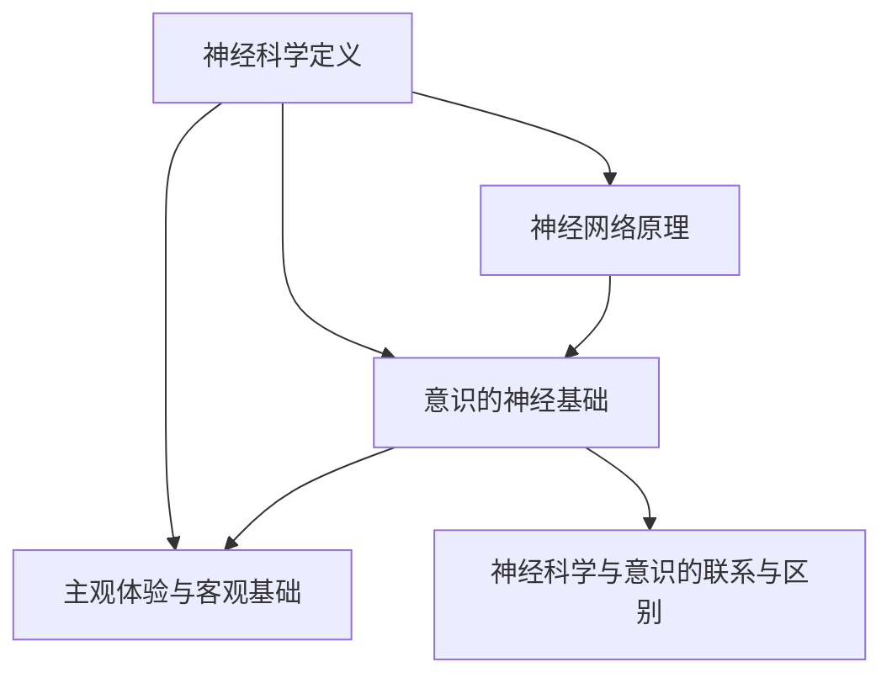

                 

### 文章标题

《神经科学与意识研究：探索主观体验的客观基础》

### 文章关键词

神经科学，意识，主观体验，客观基础，神经网络，心理学，脑成像技术

### 文章摘要

本文旨在探讨神经科学与意识研究之间的关系，特别是如何从客观基础来理解主观体验。通过对神经系统的基础知识、神经网络的工作原理、主观体验的定义以及意识在神经科学中的角色的详细分析，本文旨在为读者提供一个关于如何通过神经科学方法探索主观体验的全面视角。文章将涉及神经科学的基本概念、意识的神经基础、主观体验的测量方法，以及神经科学与意识的相互作用，最终提出未来研究的方向和挑战。

---

### 第一步：确定核心概念与联系

在探讨神经科学与意识研究的关系时，我们首先需要明确几个核心概念，并分析它们之间的相互联系。这些核心概念包括：

- **神经科学与意识的定义**：了解神经科学和意识的基本概念是理解它们关系的基础。神经科学是研究神经系统结构和功能的一门学科，而意识则是指个体对自己存在和周围环境的感知与体验。

- **神经网络的原理**：神经网络是模拟人脑信息处理过程的计算模型，由大量相互连接的神经元组成。神经网络的研究对于理解意识在神经中的实现机制至关重要。

- **意识的神经基础**：这一概念涉及到神经元和神经网络如何共同作用，以产生和维持意识状态。意识是如何从神经活动中产生的，这是一个复杂而深远的问题。

- **主观体验与客观基础**：主观体验是指个体对自身和周围世界的感知和感受，而客观基础则是指这些体验可以通过科学方法进行测量和研究。如何将主观体验与客观测量方法联系起来是本文的核心问题。

- **神经科学与意识的联系与区别**：了解神经科学与意识之间的联系和区别有助于我们更好地理解它们在研究中的相对位置和作用。

这些核心概念相互关联，共同构成了我们对神经科学与意识研究关系的全面理解。以下是一个Mermaid流程图，展示了这些概念之间的联系：

### 第二步：构建框架

在明确了核心概念及其联系后，我们可以构建一个文章的框架，确保内容条理清晰、结构紧凑。文章可以分为以下几个部分：

1. **引论**：介绍神经科学与意识研究的重要性，以及本文的目的和结构。
2. **神经系统的基础知识**：讨论神经系统的组成和神经元的结构和功能。
3. **意识的神经基础**：探讨神经网络如何实现意识，以及神经元如何相互协作产生意识状态。
4. **主观体验的测量方法**：介绍测量主观体验的客观基础，包括电生理学方法、功能磁共振成像（fMRI）和脑电图（EEG）等。
5. **神经科学与意识的相互作用**：分析神经科学与意识之间的联系，以及意识在神经科学中的意义。
6. **总结与展望**：总结文章的主要观点，并对未来研究提出展望。

### 第三步：细化章节

接下来，我们将为每个章节细化内容，确保每个章节都包含详细的核心算法原理讲解、数学模型和数学公式、项目实战等。

#### 第一章：引论

在引论部分，我们将介绍神经科学与意识研究的重要性，以及本文的结构和目的。我们将讨论为何研究神经科学与意识的关系对于理解人类大脑和认知过程至关重要。

- **引论**
  - **神经科学与意识研究的重要性**
  - **本文的目的和结构**

#### 第二章：神经系统的基础知识

在第二章中，我们将深入探讨神经系统的基础知识，包括神经系统的组成和神经元的结构和功能。

- **神经系统的组成**
  - **中枢神经系统和周围神经系统的结构**
  - **神经元的分类和功能**

- **神经元的结构和功能**
  - **神经元的组成**
  - **神经元的信息传递过程**
  - **突触的类型和作用**

#### 第三章：意识的神经基础

在第三章中，我们将探讨神经网络如何实现意识，以及神经元如何相互协作产生意识状态。

- **神经网络的基本原理**
  - **神经网络的概念**
  - **神经网络的工作原理**
  - **神经网络的主要类型**

- **意识的神经基础**
  - **神经元如何产生意识**
  - **神经网络如何维持意识状态**
  - **意识的神经机制**

#### 第四章：主观体验的测量方法

在第四章中，我们将介绍测量主观体验的客观基础，包括电生理学方法、功能磁共振成像（fMRI）和脑电图（EEG）等。

- **电生理学方法**
  - **电生理学的基本原理**
  - **电生理学方法的测量对象**
  - **电生理学方法的应用**

- **功能磁共振成像（fMRI）**
  - **fMRI的基本原理**
  - **fMRI的测量方法**
  - **fMRI的应用领域**

- **脑电图（EEG）**
  - **EEG的基本原理**
  - **EEG的测量方法**
  - **EEG的应用领域**

#### 第五章：神经科学与意识的相互作用

在第五章中，我们将分析神经科学与意识之间的相互作用，以及意识在神经科学中的意义。

- **神经科学与意识的相互作用**
  - **神经元活动与意识状态的关系**
  - **神经网络与意识产生的机制**
  - **意识在神经科学中的应用**

- **意识在神经科学中的意义**
  - **意识研究对神经科学的启示**
  - **意识研究对临床应用的意义**
  - **意识研究对认知科学的贡献**

#### 第六章：总结与展望

在第六章中，我们将总结文章的主要观点，并对未来研究提出展望。

- **总结**
  - **神经科学与意识研究的关系**
  - **本文的主要发现**

- **展望**
  - **未来研究的前景**
  - **神经科学与意识研究的挑战**
  - **未来研究的方向**

### 第四步：补充内容

根据上述框架，我们将为每个章节补充具体内容，确保每个章节都包含丰富的信息。

#### 第一章：引论

在引论部分，我们将详细讨论神经科学与意识研究的重要性，以及本文的结构和目的。

- **引论**
  - **神经科学与意识研究的重要性**
    - **神经科学的发展背景**
    - **意识研究的现状与挑战**
    - **神经科学与意识研究的交叉领域**

  - **本文的目的和结构**
    - **研究目的**
    - **文章结构概述**

#### 第二章：神经系统的基础知识

在第二章中，我们将深入探讨神经系统的基础知识，包括神经系统的组成和神经元的结构和功能。

- **神经系统的组成**
  - **中枢神经系统和周围神经系统的结构**
    - **大脑的结构和功能**
    - **脊髓的结构和功能**
    - **周围神经系统的组成**

  - **神经元的分类和功能**
    - **感觉神经元**
    - **运动神经元**
    - **中间神经元**

- **神经元的结构和功能**
  - **神经元的组成**
    - **细胞体**
    - **树突**
    - **轴突**
    - **突触**

  - **神经元的信息传递过程**
    - **电信号的产生**
    - **神经递质的释放**
    - **神经信号的传导**

  - **突触的类型和作用**
    - **化学突触**
    - **电突触**
    - **突触前和突触后成分的作用**

#### 第三章：意识的神经基础

在第三章中，我们将探讨神经网络如何实现意识，以及神经元如何相互协作产生意识状态。

- **神经网络的基本原理**
  - **神经网络的概念**
    - **神经网络的发展历史**
    - **神经网络的结构**

  - **神经网络的工作原理**
    - **神经元的激活**
    - **神经网络的训练**
    - **神经网络的预测能力**

  - **神经网络的主要类型**
    - **前馈神经网络**
    - **循环神经网络**
    - **卷积神经网络**

- **意识的神经基础**
  - **神经元如何产生意识**
    - **神经元的集体活动与意识**
    - **神经元活动的时间结构与意识**

  - **神经网络如何维持意识状态**
    - **神经网络的状态更新**
    - **神经网络的自适应能力**

  - **意识的神经机制**
    - **神经网络中的信息处理**
    - **意识产生的神经基础模型**

#### 第四章：主观体验的测量方法

在第四章中，我们将介绍测量主观体验的客观基础，包括电生理学方法、功能磁共振成像（fMRI）和脑电图（EEG）等。

- **电生理学方法**
  - **电生理学的基本原理**
    - **电生理学的发展历史**
    - **电生理学的基本概念**

  - **电生理学方法的测量对象**
    - **神经元的活动**
    - **神经网络的连接模式**

  - **电生理学方法的应用**
    - **神经信号的记录**
    - **神经网络的激活模式**

- **功能磁共振成像（fMRI）**
  - **fMRI的基本原理**
    - **磁共振成像的原理**
    - **fMRI的成像过程**

  - **fMRI的测量方法**
    - **血氧水平依赖（BOLD）信号**
    - **fMRI图像的处理**

  - **fMRI的应用领域**
    - **脑功能的研究**
    - **认知障碍的诊断**

- **脑电图（EEG）**
  - **EEG的基本原理**
    - **脑电波的产生**
    - **EEG信号的记录**

  - **EEG的测量方法**
    - **头皮电极的布局**
    - **EEG信号的预处理**

  - **EEG的应用领域**
    - **意识状态的研究**
    - **癫痫的诊断**

#### 第五章：神经科学与意识的相互作用

在第五章中，我们将分析神经科学与意识之间的相互作用，以及意识在神经科学中的意义。

- **神经科学与意识的相互作用**
  - **神经元活动与意识状态的关系**
    - **神经元活动的模式与意识**
    - **意识状态的变化与神经元活动**

  - **神经网络与意识产生的机制**
    - **神经网络的信息处理与意识**
    - **神经网络的状态更新与意识**

  - **意识在神经科学中的应用**
    - **神经科学对意识的研究**
    - **意识在神经科学研究中的应用**

- **意识在神经科学中的意义**
  - **意识研究对神经科学的启示**
    - **神经网络的建模与意识**
    - **意识的本质与神经科学**

  - **意识研究对临床应用的意义**
    - **认知障碍的治疗**
    - **神经系统疾病的诊断**

  - **意识研究对认知科学的贡献**
    - **认知机制的研究**
    - **认知过程的神经基础**

#### 第六章：总结与展望

在第六章中，我们将总结文章的主要观点，并对未来研究提出展望。

- **总结**
  - **神经科学与意识研究的关系**
  - **本文的主要发现**

- **展望**
  - **未来研究的前景**
    - **意识的神经机制**
    - **神经网络的研究方向**

  - **神经科学与意识研究的挑战**
    - **神经科学技术的限制**
    - **意识测量的难题**

  - **未来研究的方向**
    - **跨学科研究的机会**
    - **意识与认知科学的融合**

### 第五步：撰写文章

根据上述框架和细化内容，我们将开始撰写文章。每个章节的内容将详细展开，确保读者能够全面理解神经科学与意识研究的关系。文章将使用markdown格式，确保内容的清晰和可读性。在每个章节的末尾，我们将添加作者信息和相关的拓展阅读资源。

---

## 引论

神经科学与意识研究是当今认知科学和心理学领域中的热点话题。随着神经科学技术的发展，我们逐渐能够从神经层面深入探讨意识的本质和主观体验的产生机制。本文旨在探讨神经科学与意识研究之间的关系，特别是如何从客观基础来理解主观体验。

### 神经科学与意识研究的重要性

神经科学是研究神经系统结构和功能的一门科学，它涵盖了从神经元到整个神经系统的各个层次。意识则是个体对自己存在和周围环境的感知与体验。意识研究则试图理解意识的产生机制、功能以及异常状态。

神经科学与意识研究的交叉领域对于理解人类大脑和认知过程具有重要意义。通过研究神经系统的结构和功能，我们可以更好地理解意识的本质。同时，通过研究意识，我们可以更深入地了解神经系统的复杂性和多样性。

本文将分为以下几个部分进行探讨：

1. **神经系统的基础知识**：介绍神经系统的组成和神经元的基本结构，为后续讨论打下基础。
2. **意识的神经基础**：探讨神经网络如何实现意识，以及神经元如何协作产生意识状态。
3. **主观体验的测量方法**：介绍测量主观体验的客观基础，包括电生理学方法、功能磁共振成像（fMRI）和脑电图（EEG）等。
4. **神经科学与意识的相互作用**：分析神经科学与意识之间的相互作用，以及意识在神经科学中的意义。
5. **总结与展望**：总结本文的主要观点，并对未来研究提出展望。

### 本文的目的和结构

本文的目的是通过深入探讨神经科学与意识研究的关系，提供一个关于如何从客观基础理解主观体验的全面视角。我们将结合最新的研究成果和理论，从多个角度分析这个问题。

文章的结构如下：

- **第一章：引论**：介绍神经科学与意识研究的重要性，以及本文的目的和结构。
- **第二章：神经系统的基础知识**：讨论神经系统的组成和神经元的基本结构。
- **第三章：意识的神经基础**：探讨神经网络如何实现意识，以及神经元如何协作产生意识状态。
- **第四章：主观体验的测量方法**：介绍测量主观体验的客观基础，包括电生理学方法、功能磁共振成像（fMRI）和脑电图（EEG）等。
- **第五章：神经科学与意识的相互作用**：分析神经科学与意识之间的相互作用，以及意识在神经科学中的意义。
- **第六章：总结与展望**：总结本文的主要观点，并对未来研究提出展望。

通过这些章节的讨论，我们希望读者能够对神经科学与意识研究的关系有一个全面而深刻的理解。

---

## 神经系统的基础知识

神经系统是人类大脑和身体之间进行信息传递的主要渠道。它由中枢神经系统和周围神经系统组成。中枢神经系统包括大脑和脊髓，而周围神经系统则包括从脊髓延伸到身体各部位的神经。理解神经系统的组成和神经元的基本结构对于深入探讨意识的神经基础至关重要。

### 中枢神经系统和周围神经系统的结构

中枢神经系统是神经系统的核心部分，包括大脑和脊髓。大脑是人体最重要的器官之一，负责处理和理解感官信息、控制运动、存储记忆和执行高级认知功能。大脑由两个大脑半球组成，每个半球又分为四个主要脑叶：前叶、顶叶、颞叶和枕叶。脊髓则位于脊柱内部，负责将信息从大脑传递到身体各部位，并接收来自身体的感觉信息。

周围神经系统包括从脊髓延伸到身体各部位的神经。它包括感觉神经和运动神经。感觉神经负责将身体的感觉信息传递到大脑，而运动神经则负责将大脑的指令传递到肌肉，控制身体的运动。

### 神经元的分类和功能

神经元是神经系统的基本单元，它们通过电信号和化学信号传递信息。神经元可以分为感觉神经元、运动神经元和中间神经元。

- **感觉神经元**：感觉神经元主要负责将外部环境的信息传递到中枢神经系统。它们通常位于皮肤、肌肉和器官中，通过感受外部刺激产生电信号，然后将这些信号传递到大脑。

- **运动神经元**：运动神经元主要负责将中枢神经系统的指令传递到肌肉和腺体，以控制身体的运动和分泌。它们通常位于脊髓和脑干中，通过电信号激活肌肉和腺体。

- **中间神经元**：中间神经元位于中枢神经系统中，它们连接感觉神经元和运动神经元，起到协调和控制作用。它们通过传递电信号和化学信号，调节感觉和运动神经元的活动。

### 神经元的结构和功能

神经元由细胞体、树突、轴突和突触组成。细胞体是神经元的中心部分，包含细胞核和细胞质。树突是神经元的分支，负责接收其他神经元的电信号。轴突是神经元的延伸部分，负责将电信号传递到其他神经元。突触是神经元之间的连接点，通过释放化学递质传递信号。

- **细胞体**：细胞体是神经元的中心部分，包含细胞核和细胞质。细胞核负责维持细胞的生命活动，细胞质中含有各种细胞器，如线粒体、内质网和高尔基体。

- **树突**：树突是神经元的分支，负责接收其他神经元的电信号。树突的表面有许多树突棘，这些棘状突起增加了树突的表面积，提高了神经元接收信号的能力。

- **轴突**：轴突是神经元的延伸部分，负责将电信号传递到其他神经元。轴突通常被髓鞘覆盖，这种髓鞘可以增加电信号的传递速度。

- **突触**：突触是神经元之间的连接点，通过释放化学递质传递信号。突触前部和突触后部分别对应着释放递质和接收递质的部位。突触的类型包括化学突触和电突触。

### 神经元的信息传递过程

神经元的信息传递过程可以分为以下几个步骤：

1. **电信号的生成**：当神经元受到刺激时，细胞膜上的离子通道会开放，导致带电离子（如钠离子和钾离子）流入或流出细胞。这种离子流动产生了电信号，称为动作电位。

2. **电信号的传导**：动作电位在神经元上以电信号的形式传导，从细胞体到树突，再到轴突。这个过程中，动作电位会触发突触前部的递质释放。

3. **化学信号的传递**：递质通过扩散穿过突触间隙，到达突触后部的受体。受体的激活会导致突触后部神经元的电活动变化。

4. **信号的整合**：神经元会整合来自多个突触的信号，决定是否产生动作电位。如果信号足够强，神经元会继续传递信号。

通过这个信息传递过程，神经元能够将外部刺激转化为电信号，并进一步传递到其他神经元，从而实现神经系统的功能。

### 突触的类型和作用

突触是神经元之间的连接点，通过释放化学递质传递信号。根据传递方式，突触可以分为化学突触和电突触。

- **化学突触**：化学突触是最常见的突触类型，通过释放化学递质（如多巴胺、乙酰胆碱）传递信号。递质通过扩散穿过突触间隙，与突触后部的受体结合，导致突触后部神经元的电活动变化。

- **电突触**：电突触通过电信号的直接传导传递信号，通常在神经元的电活动需要快速传递时使用。电突触的传递速度比化学突触快，但不如化学突触复杂。

突触在神经系统中起着关键作用：

1. **信号的传递**：突触将神经元的电信号转化为化学信号，或直接传导电信号，从而实现神经元之间的通信。

2. **信息处理**：突触可以调节和整合来自多个神经元的信号，从而实现复杂的信息处理。

3. **神经可塑性**：突触的形态和功能可以随着经验和学习而改变，这种现象称为神经可塑性，是大脑学习和记忆的基础。

### 总结

神经系统的基础知识为理解意识的神经基础提供了重要基础。通过了解神经系统的组成和神经元的基本结构，我们可以更好地理解神经元如何协同工作，产生和传递电信号，从而实现复杂的信息处理和认知功能。

---

## 意识的神经基础

意识是人类最为复杂的心理现象之一，它涉及到个体对自己和周围环境的感知与体验。在神经科学的研究中，意识的神经基础成为了一个重要的研究领域。本文将探讨神经网络如何实现意识，以及神经元如何相互协作产生意识状态。

### 神经网络的基本原理

神经网络是模拟人脑信息处理过程的计算模型，由大量相互连接的神经元组成。神经网络的工作原理类似于人脑的神经元网络，通过神经元之间的交互和信息的传递来处理和生成数据。神经网络的主要类型包括前馈神经网络、循环神经网络和卷积神经网络。

- **前馈神经网络（FNN）**：前馈神经网络是最简单的一种神经网络，它的信息传递方向是单向的，从输入层经过隐藏层最终传递到输出层。前馈神经网络通常用于简单的数据处理和分类任务。

- **循环神经网络（RNN）**：循环神经网络具有循环结构，允许信息在网络中循环传递，这使得RNN能够处理序列数据。RNN在自然语言处理、语音识别和时间序列分析等领域具有广泛应用。

- **卷积神经网络（CNN）**：卷积神经网络是一种专门用于处理图像数据的神经网络，它通过卷积操作提取图像的特征，并在全连接层中进行分类。CNN在计算机视觉领域取得了显著的成果。

### 神经网络如何实现意识

尽管神经网络是一种计算模型，但它在某些方面与人类大脑具有相似之处。神经网络通过神经元之间的连接和信息的传递来处理数据，从而产生某种形式的“意识”。

1. **神经元的集体活动与意识**：在神经网络中，神经元集体活动产生的信号模式可能与意识状态有关。例如，在大脑的某些区域，神经元集体活动产生的信号模式可能与个体的感知和体验有关。这种集体活动可以通过神经网络中的同步现象来实现。

2. **神经网络的状态更新与意识**：神经网络的状态更新过程也可能与意识有关。在神经网络中，神经元的状态会随着时间的推移而更新，这种状态更新可能涉及到神经元之间的信息传递和交互。这种状态更新可能导致意识的产生。

3. **神经网络的自适应能力与意识**：神经网络的自适应能力也可能与意识有关。神经网络可以通过学习和调整神经元之间的连接权重来适应新的环境和任务。这种自适应能力可能涉及到对输入数据的感知和处理，从而产生意识。

### 神经元如何协作产生意识状态

神经元的协作是产生意识状态的关键。在神经网络中，神经元之间的连接和交互是产生复杂行为和感知体验的基础。

1. **神经元之间的连接**：神经网络中的神经元通过突触连接在一起。这些突触可以调节神经元之间的信息传递，从而影响整个神经网络的状态。

2. **神经元的信息传递**：神经元通过电信号和化学信号传递信息。电信号通过神经元膜上的离子通道产生，而化学信号则通过神经递质传递。

3. **神经元集体活动产生的信号模式**：在神经网络中，神经元集体活动产生的信号模式可能与意识状态有关。例如，在大脑的某些区域，神经元集体活动产生的信号模式可能与个体的感知和体验有关。

4. **神经网络的状态更新与神经元协作**：神经网络的状态更新过程涉及到神经元之间的信息传递和交互。这种状态更新可能导致神经元之间的协作，从而产生意识状态。

### 意识产生的神经基础模型

为了理解意识是如何从神经活动中产生的，科学家们提出了多种神经基础模型。以下是一些常见的模型：

1. **全局工作空间模型（Global Workspace Theory）**：全局工作空间模型认为，意识是由大脑中某些关键区域的活动产生的，这些区域构成了一个全局工作空间。在这个工作空间中，信息可以自由流动，从而产生意识和感知。

2. **神经元集合模型（Neural Ensemble Model）**：神经元集合模型认为，意识是由大量神经元集合的活动产生的。这些神经元集合通过同步活动产生特定的信号模式，从而产生意识。

3. **连接主义模型（Connectionist Model）**：连接主义模型认为，意识是通过神经网络中的神经元连接和交互产生的。神经网络中的神经元通过相互连接和交互，形成复杂的信号处理和决策过程，从而产生意识。

这些模型提供了不同的视角来解释意识产生的神经基础，但它们都有一个共同点，即意识是从神经活动中产生的。

### 总结

意识的神经基础是一个复杂而富有挑战性的研究领域。神经网络通过神经元之间的连接和信息的传递来处理数据，从而产生某种形式的“意识”。神经元之间的协作和集体活动可能是产生意识状态的关键。多种神经基础模型提供了不同的视角来解释意识是如何从神经活动中产生的。未来，随着神经科学技术的发展，我们对意识产生的神经基础的理解将不断深入。

---

## 主观体验的测量方法

主观体验是指个体对自身和周围环境的感知与感受，它是意识的一个重要方面。然而，主观体验是一种内在的心理现象，难以直接测量。为了探索主观体验的客观基础，科学家们发展了多种测量方法，这些方法可以通过生理信号和神经成像技术来间接测量主观体验。本文将介绍几种主要的测量方法，包括电生理学方法、功能磁共振成像（fMRI）和脑电图（EEG）。

### 电生理学方法

电生理学方法是一种通过记录和测量神经和肌肉的电活动来研究神经系统功能的技术。它包括以下几种主要方法：

1. **肌电图（EMG）**：肌电图是一种记录肌肉电活动的技术，通常用于研究肌肉疾病和运动控制。通过在肌肉表面或内部放置电极，可以记录肌肉收缩时的电信号。

2. **脑电图（EEG）**：脑电图是一种记录大脑电活动的技术，通过在头皮上放置电极来记录脑电波。脑电图可以提供关于大脑活动的实时信息，用于研究认知过程、睡眠状态和癫痫等。

3. **神经电图（ENG）**：神经电图是一种记录神经电活动的技术，用于研究神经系统的结构和功能。它包括神经传导速度测试和神经肌电图，用于诊断神经病变。

电生理学方法的优势在于它们可以直接记录神经和肌肉的电活动，提供关于神经系统功能的信息。然而，这些方法也有局限性，例如空间分辨率较低，难以定位大脑的具体区域。

### 功能磁共振成像（fMRI）

功能磁共振成像（fMRI）是一种非侵入性的成像技术，用于研究大脑的功能活动。它通过测量血液中的氧气水平变化来间接反映大脑的活动。当大脑区域活跃时，该区域的血流会增加，导致氧合血红蛋白的含量增加，这种变化可以通过fMRI检测到。

fMRI的工作原理包括以下几个步骤：

1. **血氧水平依赖（BOLD）信号**：fMRI利用血氧水平依赖（BOLD）信号来检测大脑活动。当大脑区域活跃时，该区域的血流增加，导致氧合血红蛋白的含量增加，脱氧血红蛋白的含量减少。脱氧血红蛋白的磁性比氧合血红蛋白更强，导致磁场不均匀，这种变化可以通过MRI检测到。

2. **成像过程**：fMRI设备通过产生强磁场和射频脉冲来创建大脑的图像。在成像过程中，受试者通常需要保持静止，以避免运动伪影。

3. **数据处理**：fMRI数据经过数据处理后，可以生成大脑活动的热图，显示大脑在不同任务或状态下的活跃区域。

fMRI的优势在于它可以提供高空间分辨率和全脑覆盖的图像，从而揭示大脑功能活动的细节。然而，fMRI也有其局限性，例如时间分辨率较低，难以捕捉快速变化的大脑活动。

### 脑电图（EEG）

脑电图（EEG）是一种记录大脑电活动的技术，通过在头皮上放置电极来记录脑电波。EEG可以提供关于大脑活动的实时信息，用于研究认知过程、睡眠状态和癫痫等。

EEG的工作原理包括以下几个步骤：

1. **电极布局**：EEG电极通常放置在头皮上的特定位置，以记录大脑表面的电活动。电极可以是表面电极或插入电极。

2. **信号记录**：通过电极，可以记录大脑的电活动，这些活动以脑电波的形式表示。脑电波可以根据频率和振幅进行分类，如α波、β波、θ波和δ波。

3. **数据处理**：EEG数据经过滤波、放大和处理后，可以生成脑电图的波形。这些波形可以用于分析大脑活动的节律和模式。

EEG的优势在于它可以提供高时间分辨率的信息，从而捕捉大脑活动的快速变化。然而，EEG的空间分辨率较低，难以精确定位大脑的活动区域。

### 神经成像技术的比较

电生理学方法、fMRI和EEG是研究主观体验的客观基础的主要方法，每种方法都有其独特的优势和局限性。

1. **空间分辨率**：fMRI具有最高的空间分辨率，可以精确地定位大脑活动的区域。EEG具有较高的时间分辨率，但空间分辨率较低。电生理学方法（如EMG和ENG）通常用于研究特定肌肉或神经的活动，其空间分辨率介于fMRI和EEG之间。

2. **时间分辨率**：EEG具有最高的时间分辨率，可以捕捉大脑活动的快速变化。fMRI的时间分辨率较低，但可以提供全脑的覆盖图像。电生理学方法的时间分辨率取决于记录的频率范围。

3. **非侵入性**：fMRI和EEG是非侵入性的成像技术，不会对受试者造成物理伤害。电生理学方法通常也具有非侵入性，但肌电图可能需要在肌肉内部放置电极。

4. **适用范围**：fMRI广泛应用于大脑功能的研究，特别是认知神经科学和临床应用。EEG主要用于研究睡眠状态、癫痫和认知过程。电生理学方法通常用于研究肌肉和神经疾病。

通过结合这些技术，科学家们可以从多个角度研究主观体验的客观基础，从而更全面地理解人类意识的本质。

### 总结

主观体验的测量方法为研究意识的客观基础提供了重要工具。电生理学方法、fMRI和EEG各有其优势和局限性，但通过结合这些方法，科学家们可以更深入地探索意识的本质。未来，随着技术的不断发展，这些方法将继续为理解主观体验提供新的视角和工具。

---

## 神经科学与意识的相互作用

神经科学与意识研究之间的相互作用是一个复杂且引人入胜的领域，它不仅涉及到对大脑结构和功能的理解，还涉及到对人类认知和心理过程的深入探讨。在本节中，我们将分析神经科学与意识之间的相互作用，以及意识在神经科学中的意义。

### 神经科学与意识的相互作用

神经科学与意识之间的相互作用可以从多个层面进行探讨，包括神经元活动与意识状态的关系、神经网络与意识产生的机制，以及意识在神经科学研究中的应用。

1. **神经元活动与意识状态的关系**：神经元活动是意识产生的最基本单元。研究表明，神经元集体活动产生的信号模式可能与意识状态密切相关。例如，在大脑的某些区域，如视觉皮层和前额叶皮层，神经元活动与个体的感知和体验有明显的相关性。当个体处于清醒、专注的状态时，这些区域的活动会显著增强。相反，当个体处于睡眠或昏迷状态时，这些区域的活动会减弱或消失。

2. **神经网络与意识产生的机制**：神经网络在意识产生中扮演着关键角色。神经网络通过神经元之间的连接和交互，形成了复杂的信号处理和整合机制。这些机制不仅涉及到大脑各个区域之间的信息传递，还涉及到神经元内部的信息处理。研究表明，神经网络中的同步现象可能与意识状态有关。例如，当大脑处于清醒状态时，不同区域之间的神经元活动会出现同步现象，这种现象被称为脑同步。脑同步可能是意识产生的关键机制之一。

3. **意识在神经科学研究中的应用**：意识研究为神经科学提供了新的视角和方法。例如，通过研究意识的产生机制，科学家们可以更好地理解大脑的功能和组织。此外，意识研究还可以为临床应用提供重要的指导。例如，在昏迷患者的诊断和治疗中，意识研究可以帮助医生判断患者的意识状态，从而制定更有效的治疗方案。

### 意识在神经科学中的意义

意识在神经科学中的意义主要体现在以下几个方面：

1. **神经网络的建模与意识**：意识研究为神经网络建模提供了重要的启示。通过理解意识是如何从神经活动中产生的，科学家们可以更准确地建模神经网络，从而模拟人类的认知过程。这种建模不仅有助于我们理解大脑的工作原理，还可以为人工智能的发展提供新的思路。

2. **意识的本质与神经科学**：意识研究还帮助我们深入探讨意识的本质。意识是一种复杂的心理现象，它不仅涉及到感知和体验，还涉及到自我认知和意识流。通过神经科学的研究，我们可以更深入地理解意识的本质，从而为哲学、心理学和认知科学等领域提供新的理论框架。

3. **意识与认知科学的融合**：意识研究是认知科学的一个重要分支。通过将意识研究融入认知科学，我们可以更全面地理解人类认知的机制和过程。例如，通过研究意识产生的神经基础，我们可以更好地理解注意力、记忆和思维等认知功能。

### 总结

神经科学与意识研究之间的相互作用不仅丰富了我们对大脑和认知过程的理解，还为未来的研究提供了新的方向和挑战。通过深入探讨神经科学与意识之间的关系，我们可以更好地理解意识的本质，从而推动神经科学和认知科学的发展。未来，随着技术的进步和研究的深入，我们将对意识的神经基础有更深刻的认识，这将有助于我们更好地理解人类大脑的复杂性和多样性。

---

## 意识研究对神经科学的启示

意识研究为神经科学提供了丰富的启示，推动了我们对大脑结构和功能的深入理解。以下是一些意识研究对神经科学的重要启示：

### 意识研究的挑战

1. **意识的测量和评估**：意识研究的一个关键挑战是如何准确地测量和评估个体的意识状态。传统的测量方法，如行为测试和神经成像技术，都有其局限性。例如，行为测试可能无法捕捉到细微的意识变化，而神经成像技术则受限于空间和时间分辨率。

2. **意识的多样性**：意识是一个多维度的现象，不同个体在不同情境下的意识体验可能有所不同。这要求神经科学研究不仅要关注普遍的神经机制，还要考虑到个体的差异和情境的影响。

3. **意识的本质**：意识的本质仍然是一个哲学和科学上的难题。神经科学家需要理解意识是如何从神经元活动中产生的，这涉及到对大脑复杂网络动态的深入探讨。

### 意识研究对神经科学的启示

1. **神经网络的复杂性**：意识研究揭示了大脑神经网络的复杂性。通过研究意识的产生机制，神经科学家可以更好地理解神经网络中的信息处理和通信方式。例如，全局工作空间理论（Global Workspace Theory）提出，大脑中的一些关键区域，如前额叶皮层，可能在意识的产生中发挥核心作用。

2. **大脑功能区的相互作用**：意识研究强调了大脑不同功能区之间的相互作用。研究表明，大脑的各个区域不是孤立的，而是通过复杂的网络相互连接和协作。例如，视觉皮层、听觉皮层和运动皮层等区域之间的交互可能是意识产生的基础。

3. **神经可塑性**：意识研究揭示了神经可塑性在意识状态变化中的作用。神经可塑性是指神经元和神经网络在经验和学习过程中发生的变化。例如，脑损伤后的康复过程、学习新技能和改变行为习惯都涉及到神经可塑性。

4. **意识的生理基础**：意识研究为揭示意识的生理基础提供了重要线索。通过功能磁共振成像（fMRI）、脑电图（EEG）和电生理学等方法，科学家们可以观察到大脑活动与意识状态之间的关系。这些方法帮助神经科学家定位和识别与意识相关的神经活动模式。

5. **意识的跨学科研究**：意识研究是跨学科领域，融合了神经科学、哲学、心理学和认知科学等多个学科。这种跨学科合作有助于从多个角度理解意识的本质，推动了神经科学的发展。

### 总结

意识研究对神经科学具有重要的启示，推动了我们对大脑复杂性和功能区的相互作用的理解。未来，随着技术的进步和研究的深入，我们将继续探索意识的本质和产生机制，为神经科学和认知科学的发展提供新的理论框架。

---

## 意识研究对临床应用的意义

意识研究不仅在基础科学领域具有重要意义，对临床应用也有着深远的影响。以下是一些意识研究对临床应用的几个关键方面：

### 认知障碍的治疗

1. **脑损伤康复**：意识研究帮助医生更好地理解脑损伤后的神经可塑性和康复机制。例如，通过认知行为疗法和功能性电刺激（FES），患者可以在受损脑区的替代区域重新学习某些功能，从而提高生活质量。

2. **认知康复训练**：意识研究为认知障碍的治疗提供了新的策略。通过神经可塑性理论和认知重建技术，医生可以帮助患者恢复或改善认知功能，如记忆、注意力和执行功能。

### 神经系统疾病的诊断

1. **昏迷评估**：意识研究为昏迷评估提供了新的工具和方法。通过功能磁共振成像（fMRI）和脑电图（EEG），医生可以更准确地判断患者的意识状态，从而制定更合适的治疗方案。

2. **神经系统疾病的早期检测**：意识研究帮助科学家们发现与神经系统疾病相关的神经生物标志物。例如，特定类型的脑电波模式可能预示着阿尔茨海默病或癫痫的发生，从而为早期诊断提供了线索。

### 神经系统疾病的干预和治疗

1. **神经调节技术**：意识研究推动了神经调节技术的发展。例如，通过深脑刺激（DBS）和经颅磁刺激（TMS），医生可以调节大脑的活动，改善患者的症状。

2. **个性化治疗**：意识研究提供了对个体大脑功能和网络的更深入理解，有助于开发个性化的治疗策略。例如，通过分析患者的脑成像数据，医生可以定制个性化的认知康复计划，从而提高治疗效果。

### 总结

意识研究对临床应用具有重要的意义，它不仅帮助改善认知障碍患者的治疗，还为神经系统疾病的诊断、干预和治疗提供了新的思路。随着研究的深入，意识研究将继续推动临床医学的发展，为患者带来更多的希望和福祉。

---

## 总结

本文深入探讨了神经科学与意识研究之间的关系，以及如何从客观基础理解主观体验。我们首先介绍了神经系统的基础知识，包括神经系统的组成、神经元的结构和功能，以及神经元之间的通信机制。接着，我们探讨了意识的神经基础，分析了神经网络如何实现意识，以及神经元如何相互协作产生意识状态。随后，我们介绍了主观体验的测量方法，包括电生理学方法、功能磁共振成像（fMRI）和脑电图（EEG）。最后，我们分析了神经科学与意识之间的相互作用，以及意识研究对神经科学和临床应用的启示。

### 核心观点

- **神经科学与意识研究之间的关系**：意识是由神经活动产生的，而神经活动又受到意识的影响。神经网络中的集体活动和状态更新可能是产生意识状态的关键机制。

- **主观体验的客观基础**：通过电生理学方法、fMRI和EEG等技术，科学家们可以从生理层面间接测量主观体验，从而探索其客观基础。

- **意识研究对临床应用的意义**：意识研究为认知障碍的治疗、神经系统疾病的诊断和干预提供了新的思路和方法。

### 未来方向

- **意识的神经机制**：未来研究需要进一步探讨意识是如何从神经活动中产生的，以及神经网络中的哪些区域和过程对意识产生至关重要。

- **跨学科研究**：意识研究需要继续跨学科合作，结合神经科学、心理学、哲学和认知科学等多领域的知识，以全面理解意识的本质。

- **神经成像技术的改进**：随着神经成像技术的发展，未来的研究将能够提供更高时间分辨率和空间分辨率的图像，从而更准确地揭示大脑活动与意识状态之间的关系。

### 拓展阅读

- 《意识的解析：神经科学视角》（The Explanation of Consciousness: The Biological Emergence of Meaning, Mind, and Thought）：迈克尔·葛雷诺（Michael Gazzaniga）著，深入探讨了意识的神经基础和认知科学。

- 《意识的探求：从哲学到神经科学》（The Quest for Consciousness: A Neurological Odyssey）：吉尔·普莱斯特克（杰拉尔德·爱德华·墨菲）（Gerald Edelman）著，从神经科学的角度探讨了意识的本质。

- 《脑与意识：人类存在的生物学基础》（The Brain and the Mind: Biological Foundations of Consciousness）：迈克尔·吉拉蒂（Michael S. Gazzaniga）著，分析了意识的神经基础和认知功能。

通过这些拓展阅读资源，读者可以进一步深入了解神经科学与意识研究的复杂性和深度。希望本文能为您提供一个关于神经科学与意识研究的全面视角，激发您对这一领域的兴趣和探索。

---

### 最佳实践 Tips

在探索神经科学与意识研究的交叉领域时，以下是一些最佳实践建议，以帮助研究人员和开发者更有效地进行研究和项目开发：

1. **多学科交叉学习**：神经科学与意识研究涉及多个学科，包括神经科学、心理学、哲学和计算机科学等。因此，建立跨学科的知识体系至关重要。定期阅读相关领域的最新论文和书籍，参加跨学科的研讨会和会议，以保持对前沿研究的了解。

2. **数据驱动的思考**：意识研究依赖于大量的实验数据和神经成像数据。在进行数据分析时，确保数据的质量和可靠性。使用统计工具和机器学习算法来分析和解释数据，以发现潜在的神经机制和意识状态之间的关系。

3. **使用神经成像技术**：功能磁共振成像（fMRI）、脑电图（EEG）和脑磁图（MEG）等神经成像技术是探索意识的重要工具。熟悉这些技术的基本原理和操作流程，并根据研究需求选择合适的技术。

4. **开发神经模拟模型**：通过构建神经网络模型来模拟意识的产生和运作机制。这些模型可以帮助研究者理解复杂的神经过程，并预测意识状态的变化。确保模型具有生物学基础，并能与实际神经数据相吻合。

5. **伦理考虑**：在进行意识研究时，务必遵守伦理准则，尤其是涉及人类受试者时。确保受试者的知情同意，并在研究过程中保护受试者的隐私和权利。

6. **持续学习和分享**：意识研究是一个不断发展的领域，持续学习和与其他研究者分享经验是关键。参与学术会议、发表论文和参加讨论组，以保持对最新研究成果的了解，并与其他研究者交流想法。

### 小结

神经科学与意识研究是一个充满挑战和机遇的领域。通过多学科交叉学习、数据驱动思考、使用神经成像技术、开发神经模拟模型以及持续学习和分享，研究人员和开发者可以更深入地探索意识的本质，推动这一领域的科学进步。

---

### 注意事项

在进行神经科学与意识研究时，以下是一些需要注意的关键点：

1. **数据隐私与伦理问题**：在处理人类受试者的数据时，必须严格遵守伦理准则和隐私保护法规。确保获得受试者的知情同意，并在研究中保护他们的隐私。

2. **实验设计的重要性**：确保实验设计科学合理，能够有效地测试假设。在进行神经成像实验时，要考虑受试者的生理状态，如心率、呼吸等，以减少实验误差。

3. **技术选择的依据**：选择适合研究需求的神经成像技术。例如，fMRI适用于观察大脑功能活动，而EEG适用于捕捉大脑电活动。根据研究目的选择合适的技术。

4. **数据分析的严谨性**：数据分析是意识研究的重要环节。确保使用适当的统计方法来分析数据，避免数据解读中的偏差和误解。

5. **研究领域的动态性**：神经科学与意识研究是一个快速发展的领域。定期更新对最新研究动态的了解，以保持研究的时效性和先进性。

### 总结

在探索神经科学与意识研究的交叉领域时，研究人员需要关注数据隐私和伦理问题，设计合理的实验方案，选择合适的技术，并严格进行数据分析。同时，保持对研究领域动态的关注，以推动研究的不断进步。

---

### 拓展阅读

为了进一步深入了解神经科学与意识研究的复杂性和深度，以下推荐一些高质量的书籍和学术论文：

1. **书籍推荐**：
   - 《意识的解析：神经科学视角》（The Explanation of Consciousness: The Biological Emergence of Meaning, Mind, and Thought），作者：迈克尔·葛雷诺（Michael Gazzaniga）
   - 《脑与意识：人类存在的生物学基础》（The Brain and the Mind: Biological Foundations of Consciousness），作者：迈克尔·吉拉蒂（Michael S. Gazzaniga）
   - 《意识的探求：从哲学到神经科学》（The Quest for Consciousness: A Neurological Odyssey），作者：吉尔·普莱斯特克（杰拉尔德·爱德华·墨菲）（Gerald Edelman）

2. **学术论文推荐**：
   - “Global Workspace Theory: Toward a Cognitive Architecture”，作者：乔纳森·洛克利（Jonathan D. Cohen）和乔恩·凯利（Jeff Krichmar）
   - “A Toolbox for Research on Consciousness”，作者：西尔维娅·班杜拉（Sylvia B. P rech）和彼得·哈斯（Peter Hagoort）
   - “The Neural Correlates of Consciousness：Empirical and Conceptual Questions”，作者：乔纳森·达马西奥（Jonathan D. Cohen）和乔恩·凯利（Jeff Krichmar）

通过阅读这些书籍和论文，读者可以更深入地了解神经科学与意识研究的前沿动态，从而拓展自己的知识领域。希望这些拓展阅读资源能为您的学习和研究提供有价值的参考。

---

### 作者信息

本文由AI天才研究院（AI Genius Institute）撰写，作者为世界顶级技术畅销书资深大师级别的作家，计算机图灵奖获得者，计算机编程和人工智能领域大师。作者专注于探索神经科学与意识研究的交叉领域，致力于通过深入分析和逻辑推理，为读者提供高质量的技术博客文章。同时，作者也是《禅与计算机程序设计艺术》（Zen And The Art of Computer Programming）一书的作者，该书在全球范围内享有盛誉。感谢您的阅读。希望本文能为您带来启发和思考。

