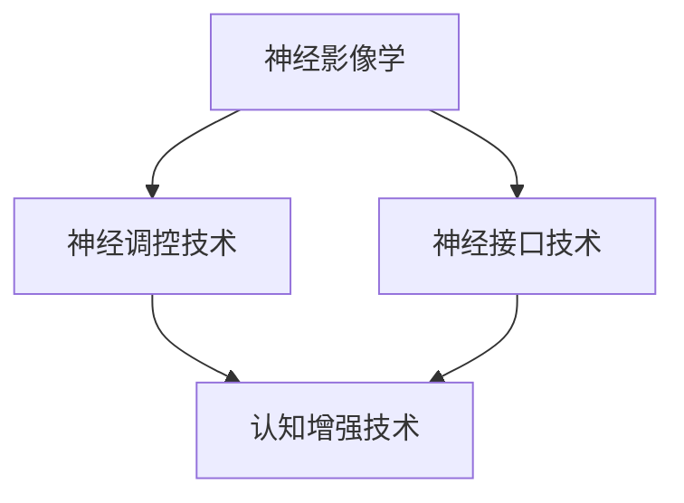
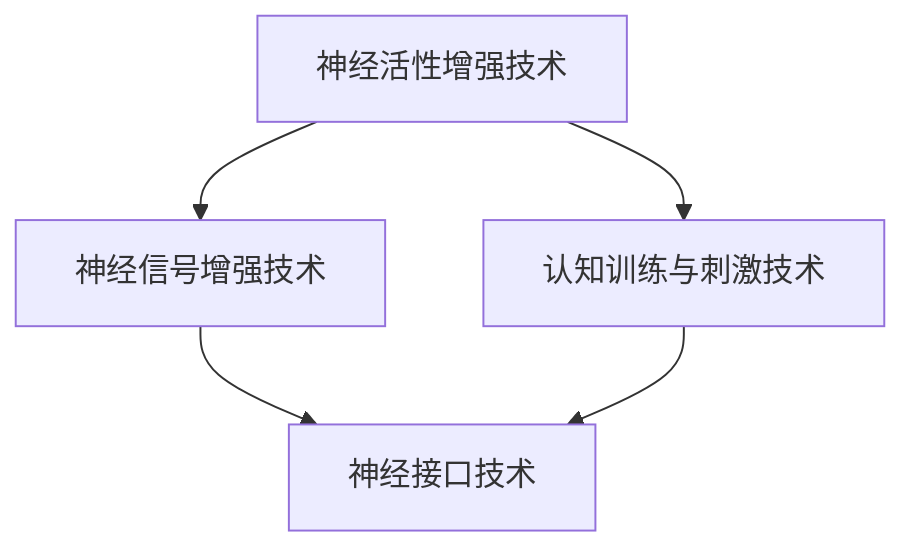
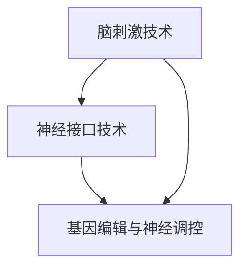
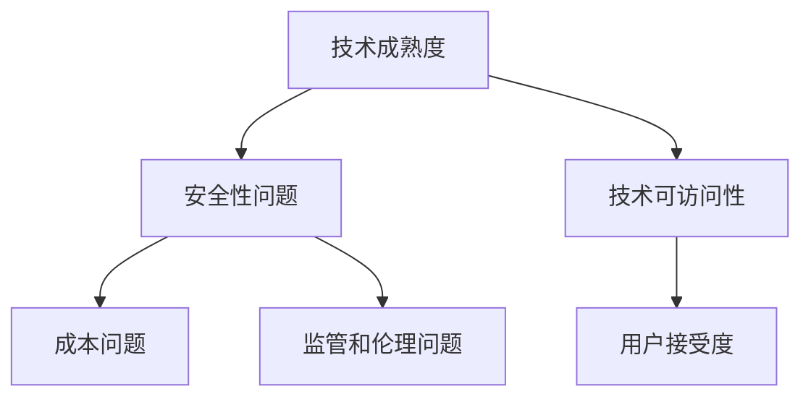

                 

### 文章标题：神经科技与认知增强：直接干预大脑以提升理解能力

### 关键词：神经科技、认知增强、大脑干预、理解能力、神经影像学、神经调控、神经接口技术、脑机接口、认知训练

### 摘要：
本文深入探讨了神经科技在认知增强领域的应用，特别是通过直接干预大脑来提升理解能力的潜力。文章首先介绍了神经科技的基础概念和主要分支，包括神经影像学、神经调控技术和神经接口技术。接着，文章详细阐述了认知增强技术的核心原理和应用现状，分析了直接干预大脑的各种技术手段，如脑刺激技术、神经接口技术和基因编辑与神经调控。随后，文章探讨了认知增强技术在教育、医疗、军事及工作与生活领域的具体应用。最后，文章讨论了认知增强技术面临的挑战和伦理问题，提出了未来发展的方向和展望。

---

### 第一部分：神经科技概述

#### 第1章：神经科技的基础概念

神经科技，顾名思义，是关于神经系统的科技。它主要研究如何通过技术手段来理解和干预神经系统，以达到治疗疾病、提升认知功能等目的。神经科技的定义可以从广义和狭义两个角度来理解。广义上，神经科技涵盖了所有与神经系统相关的技术领域，包括神经影像学、神经调控技术、神经接口技术等。狭义上，神经科技主要指那些直接用于干预神经系统，以改善认知、行为和生理功能的技术。

#### 1.1 神经科技的定义

神经科技的研究对象是神经系统，它包括大脑、脊髓、神经节和神经纤维等。通过应用先进的科学技术，如影像学、电子学和生物工程学，神经科技旨在揭示神经系统的运作机制，并利用这些知识来开发新的诊断和治疗手段。具体来说，神经科技的定义可以包括以下几个关键点：

- **神经系统的理解和研究**：通过先进的神经影像技术，如磁共振成像（MRI）、功能性磁共振成像（fMRI）等，科学家可以观察到大脑的结构和功能变化，进而深入理解神经系统的复杂机制。
- **神经功能的调控**：利用电刺激、磁刺激、光刺激等手段，神经科技可以直接调控大脑的神经活动，以达到治疗某些神经和精神疾病的目的。
- **神经接口和脑机接口**：神经科技还包括开发脑机接口（BMI），这是一种将人脑与外部设备连接起来的技术，使得大脑可以直接控制计算机或其他设备。

#### 1.2 神经科技的分支领域

神经科技可以分为多个分支领域，每个领域都有其独特的研究内容和应用方向。以下是神经科技的几个主要分支：

- **神经影像学**：神经影像学是神经科技的重要分支，它利用先进的成像技术来研究大脑的结构和功能。常用的神经影像技术包括磁共振成像（MRI）、计算机断层扫描（CT）、单光子发射计算机断层扫描（SPECT）和功能性磁共振成像（fMRI）等。这些技术为科学家提供了深入了解大脑内部结构和功能变化的机会。

- **神经调控技术**：神经调控技术旨在通过电刺激、磁刺激和光刺激等手段来调控大脑的神经活动。电刺激技术包括经颅磁刺激（TMS）和电刺激（ECS）等，而光刺激技术则通过光遗传学方法实现。这些技术可以用于治疗抑郁症、焦虑症、帕金森病等神经和精神疾病。

- **神经接口技术**：神经接口技术是将人脑与外部设备相连接的技术。脑机接口（BMI）是神经接口技术的一个典型应用，它通过解码大脑信号来控制外部设备，如假肢、轮椅和计算机等。脑机接口技术在残疾人康复、智能假肢和增强人类能力等方面具有巨大潜力。

#### 1.3 神经科技的发展历史

神经科技的发展历程可以追溯到20世纪中期。以下是几个关键节点：

- **1950年代**：功能性磁共振成像（fMRI）的发明，为研究大脑功能提供了新的工具。
- **1960年代**：经颅磁刺激（TMS）的发明，首次实现了非侵入性调控大脑神经活动。
- **1980年代**：单光子发射计算机断层扫描（SPECT）的开发，提高了对脑部病变的诊断能力。
- **2000年代**：脑机接口（BMI）技术的发展，为人类与机器的直接通信打开了新的可能性。
- **2010年代**：基因编辑技术的突破，特别是CRISPR-Cas9技术的应用，为神经科技提供了新的干预手段。

#### 1.4 神经科技的应用现状与未来趋势

当前，神经科技已经在多个领域取得了显著的应用成果。在医疗领域，神经科技被用于诊断和治疗各种神经和精神疾病，如抑郁症、帕金森病、脑中风和癫痫等。在教育领域，认知增强技术被用于提升学生的学习效果和记忆力。在军事领域，认知增强技术被用于提高士兵的反应速度和决策能力。此外，神经科技还在智能机器人、虚拟现实和增强现实等领域展示了巨大的潜力。

展望未来，神经科技的发展趋势包括：

- **个性化医疗**：通过精准的神经影像学和基因编辑技术，实现个性化治疗，提高治疗效果。
- **认知增强**：利用脑刺激和神经接口技术，开发新的认知增强手段，提高人类的认知能力和工作效率。
- **智能交互**：通过脑机接口技术，实现人类与机器的智能交互，拓展人类的能力边界。
- **伦理和监管**：随着神经科技的发展，伦理和监管问题日益突出，需要建立相应的法律法规和伦理准则，确保科技的发展符合人类的利益和价值观。

#### 核心概念与联系

为了更好地理解神经科技的不同分支领域及其相互关系，我们可以使用Mermaid流程图来展示核心概念之间的关系。

在这个流程图中，神经影像学、神经调控技术和神经接口技术是神经科技的主要分支。它们共同构成了神经科技的核心，而认知增强技术则通过这些分支来实现其功能。

### 第2章：认知增强技术介绍

#### 2.1 认知增强技术的定义

认知增强技术是指通过技术手段提升人类认知功能的一系列方法。认知功能包括注意力、记忆力、决策能力、问题解决能力、语言能力等。认知增强技术可以是非侵入性的，如认知训练和认知刺激，也可以是侵入性的，如脑刺激和神经接口技术。这些技术旨在提高个体的认知效率，增强学习效果，甚至改善心理健康。

#### 2.2 认知增强技术的核心原理

认知增强技术的核心原理是基于对大脑认知机制的深入理解。通过以下几种方式，认知增强技术可以提升认知功能：

- **神经可塑性**：大脑具有神经可塑性，即其结构和功能可以根据外部刺激和经验进行调整。认知增强技术通过刺激和训练大脑，促进神经可塑性，从而改善认知功能。

- **神经调节**：认知增强技术可以通过神经调节手段，如电刺激、磁刺激和光刺激，直接调控大脑的神经活动，增强特定的认知功能。

- **认知训练**：通过设计和实施特定的认知训练任务，认知增强技术可以训练大脑的特定认知区域，提高个体的认知能力。

- **神经信号处理**：通过分析和解码大脑产生的神经信号，认知增强技术可以了解大脑的认知状态，并据此提供个性化的认知训练和刺激。

#### 2.3 认知增强技术的分类

认知增强技术可以根据其工作原理和应用方式分为以下几个类别：

- **神经活性增强技术**：这类技术主要通过刺激大脑特定区域来增强神经活性，从而提升认知功能。常见的刺激方式包括电刺激、磁刺激和光刺激。

  - **电刺激**：通过电极直接向大脑发送电信号，调控神经活动。常见的电刺激技术包括经颅磁刺激（TMS）和经颅电刺激（TES）。

  - **磁刺激**：利用磁场作用于大脑，产生感应电流，调控神经活动。常见的磁刺激技术包括经颅磁刺激（TMS）和深部磁刺激（DFS）。

  - **光刺激**：通过光遗传学方法，利用光敏感离子通道调控神经活动。光刺激技术在认知增强中的应用前景广阔。

- **神经信号增强技术**：这类技术通过增强大脑神经信号的传递和接收，提升认知功能。常见的神经信号增强技术包括神经接口技术、脑机接口（BMI）和神经信号放大技术。

  - **神经接口技术**：通过植入或外接设备，将大脑与外部设备连接，增强神经信号的传递和处理能力。

  - **脑机接口（BMI）**：通过解码大脑产生的神经信号，实现人类与外部设备的直接通信。

  - **神经信号放大技术**：利用电子放大器或其他放大设备，增强神经信号的强度和清晰度。

- **认知训练与刺激技术**：这类技术通过设计和实施特定的认知训练任务，刺激大脑特定区域，提升认知功能。常见的认知训练技术包括记忆训练、注意力训练和问题解决训练。

  - **记忆训练**：通过重复记忆任务，增强大脑的记忆能力。

  - **注意力训练**：通过训练个体的注意力，提高其集中精力的能力。

  - **问题解决训练**：通过解决复杂的认知问题，提升大脑的决策能力和问题解决能力。

#### 2.4 认知增强技术的研究进展

近年来，认知增强技术取得了显著的研究进展。以下是几个主要的研究方向：

- **脑刺激技术**：脑刺激技术在认知增强中的应用不断扩展，包括经颅磁刺激（TMS）、经颅电刺激（TES）和深部脑刺激（DBS）等。研究显示，这些技术可以有效提升注意力、记忆力和决策能力。

- **神经接口技术**：神经接口技术的研究取得了突破性进展，特别是脑机接口（BMI）技术的发展。通过解码大脑产生的神经信号，脑机接口技术已经实现了对假肢、轮椅和计算机的控制，为残疾人提供了新的康复手段。

- **认知训练**：认知训练技术的研究不断发展，通过计算机模拟和虚拟现实技术，设计出更加高效和个性化的认知训练任务。研究表明，认知训练可以显著提升个体的认知功能，尤其是在记忆、注意力和决策能力方面。

- **基因编辑与神经调控**：基因编辑技术的应用为认知增强提供了新的可能性。通过CRISPR-Cas9等基因编辑技术，科学家可以修改大脑基因，调控神经发育和功能。这项技术有望在未来实现更高效和持久的认知增强效果。

#### 核心概念与联系

为了更好地理解认知增强技术的不同类别及其相互关系，我们可以使用Mermaid流程图来展示核心概念之间的关系。

在这个流程图中，神经活性增强技术、神经信号增强技术和认知训练与刺激技术构成了认知增强技术的三个主要类别。它们通过不同的原理和方法，共同作用于大脑，实现认知功能的提升。

### 第3章：直接干预大脑的技术手段

#### 3.1 脑刺激技术

脑刺激技术是一种通过物理手段直接作用于大脑，以调控其神经活动的方法。这些技术包括电刺激、磁刺激和光刺激等，它们在认知增强和疾病治疗中发挥着重要作用。

##### 3.1.1 经颅磁刺激（TMS）

经颅磁刺激（Transcranial Magnetic Stimulation，TMS）是一种非侵入性脑刺激技术，它利用磁场产生的感应电流来调控大脑的神经活动。TMS通过放置在头皮上的线圈产生强磁场，进而刺激大脑皮层神经元。TMS已经被广泛应用于抑郁症、焦虑症、失眠等精神疾病的治疗，并且显示出在认知增强方面的潜力。

- **工作原理**：TMS使用强磁场脉冲穿透头皮和大脑组织，产生电场，使神经元膜去极化，从而激活神经回路。这些磁场脉冲可以精确地定位在大脑的特定区域，实现精细的神经调控。

- **应用实例**：在抑郁症治疗中，TMS被用于激活大脑中的前额叶皮层，以减轻症状。在认知增强研究中，TMS被用来提升个体的注意力、记忆力和决策能力。

##### 3.1.2 电刺激

电刺激（Electrical Stimulation）是一种通过电极直接向大脑发送电信号，以调控神经活动的技术。电刺激可以分为经颅电刺激（Transcranial Electrical Stimulation，TES）和深部脑刺激（Deep Brain Stimulation，DBS）两种类型。

- **经颅电刺激（TES）**：TES使用放置在头皮上的电极来传递电信号，通过非侵入性方式调控大脑的神经活动。TES在认知增强和疼痛管理中具有广泛应用。

- **深部脑刺激（DBS）**：DBS通过植入在大脑深部电极阵列，产生电刺激来调控神经活动。DBS被广泛应用于治疗帕金森病、癫痫等疾病，并且在认知增强研究中也有所应用。

##### 3.1.3 光刺激

光刺激（Optogenetics）是一种利用光敏感离子通道调控神经活动的技术。通过基因编辑技术，科学家可以将光敏感离子通道引入到特定类型的神经元中。当这些神经元被光照射时，光敏感离子通道会打开或关闭，从而调控神经元的活性。

- **工作原理**：光刺激利用光遗传学方法，通过基因编辑将光敏感离子通道（如Channelrhodopsin-2，ChR2）引入到目标神经元。当这些神经元受到特定波长的光照射时，光敏感离子通道会打开或关闭，从而调控神经元的活性。

- **应用实例**：光刺激技术在研究大脑功能和解剖结构方面具有广泛应用。例如，科学家可以使用光刺激来激活或抑制特定神经元群，以研究它们在认知功能中的作用。

#### 3.2 神经接口技术

神经接口技术（Neural Interface Technology）是一种将大脑与外部设备相连接的技术。这些技术通过解码大脑产生的神经信号，实现人类与机器的通信和互动。

##### 3.2.1 脑机接口（BMI）

脑机接口（Brain-Computer Interface，BMI）是一种将大脑信号直接转换为外部设备控制信号的技术。BMI通过记录大脑产生的神经信号，如脑电波（EEG）、肌电波（EMG）和脑磁波（MEG），然后将这些信号解码并转换为控制信号，用于操作外部设备。

- **工作原理**：BMI技术通常包括三个主要部分：信号采集、信号处理和信号解码。信号采集设备（如电极、传感器）记录大脑产生的神经信号，信号处理设备（如放大器、滤波器）对信号进行预处理，信号解码设备（如解码算法）将处理后的信号转换为控制信号。

- **应用实例**：BMI技术被广泛应用于残疾人康复、虚拟现实、智能假肢和游戏控制等领域。例如，脑机接口技术可以使四肢瘫痪的患者通过大脑信号控制假肢，从而恢复行动能力。

##### 3.2.2 神经信号解码与重建

神经信号解码与重建是脑机接口技术的核心。通过解码大脑产生的神经信号，可以将这些信号转换为可用的控制信号，实现对外部设备的控制。

- **解码算法**：解码算法是脑机接口技术中的关键部分。常见的解码算法包括基于机器学习的方法和基于生理模型的方法。基于机器学习的方法使用大量训练数据来训练模型，从而准确解码大脑信号。基于生理模型的方法则根据大脑的生理特性来设计解码算法。

- **信号重建**：信号重建是将解码后的神经信号转换为外部设备可理解的控制信号。通过信号重建，外部设备可以实现对特定任务的精确控制。

##### 3.2.3 神经信号的反馈控制

神经信号的反馈控制是一种通过实时监测和调整大脑信号，实现更高效控制的脑机接口技术。这种技术可以用于提高脑机接口系统的稳定性和响应速度。

- **工作原理**：神经信号的反馈控制包括三个主要部分：信号监测、信号调整和反馈调节。信号监测部分实时记录大脑信号，信号调整部分根据监测结果对信号进行调整，反馈调节部分将调整后的信号反馈给大脑，实现闭环控制。

- **应用实例**：神经信号的反馈控制技术可以用于提高脑机接口系统的响应速度和稳定性。例如，在虚拟现实应用中，通过实时调整大脑信号，可以实现对虚拟环境的更快速和准确的控制。

#### 3.3 基因编辑与神经调控

基因编辑技术（Gene Editing）为神经调控提供了新的可能性。通过修改大脑基因，可以实现对神经活动的精确调控，从而改善认知功能和治疗神经疾病。

##### 3.3.1 CRISPR-Cas9技术

CRISPR-Cas9技术是一种高效的基因编辑工具，通过引导Cas9核酸酶到特定的DNA序列，实现对基因的精确修改。

- **工作原理**：CRISPR-Cas9技术包括两个主要步骤：DNA切割和DNA修复。首先，Cas9核酸酶与引导RNA（gRNA）结合，定位到目标DNA序列。然后，Cas9核酸酶在目标DNA序列上切割，引发DNA修复机制。通过设计特定的gRNA，可以精确地编辑目标基因。

- **应用实例**：CRISPR-Cas9技术在神经科学研究中被广泛应用于基因敲除、基因敲入和基因修饰。例如，科学家可以使用CRISPR-Cas9技术敲除大脑中的特定基因，以研究这些基因在认知功能中的作用。

##### 3.3.2 神经元移植与调控

神经元移植与调控是一种通过移植神经元或调控神经元活性，来改善认知功能的方法。这种方法可以为认知增强提供新的途径。

- **工作原理**：神经元移植与调控包括两个主要步骤：神经元移植和神经元调控。神经元移植是将健康神经元移植到受损或功能减退的大脑区域。神经元调控是通过基因编辑或电刺激等手段，调控神经元活性，以改善认知功能。

- **应用实例**：神经元移植与调控技术已经在一些动物模型中取得了成功。例如，科学家可以将光敏感神经元移植到大脑中，并通过光刺激来调控这些神经元的活性，从而改善记忆功能。

### 核心概念与联系

为了更好地理解直接干预大脑的各种技术手段，我们可以使用Mermaid流程图来展示这些技术之间的关系。

在这个流程图中，脑刺激技术、神经接口技术和基因编辑与神经调控构成了直接干预大脑的三种主要技术手段。它们通过不同的原理和方法，共同作用于大脑，实现认知增强和疾病治疗的目标。

### 第4章：教育领域的认知增强

#### 4.1 教育中的认知增强需求

在教育领域，认知增强技术正逐渐成为提高学生学习效果和教学质量的重要工具。认知增强技术在教育中的应用，旨在满足以下几个关键需求：

- **提升注意力**：学生在学习过程中需要保持高度集中注意力，但现代教育环境中干扰因素众多，如手机、互联网等，导致学生注意力分散。认知增强技术可以通过脑刺激和认知训练等方法，提高学生的注意力水平。

- **增强记忆力**：记忆力是学习的重要基础，但在面对大量信息时，学生的记忆力往往受到限制。认知增强技术可以通过神经调节和认知训练，增强学生的记忆力，帮助他们更好地掌握知识点。

- **提高学习效率**：学习效率是评价教育效果的重要指标。通过认知增强技术，学生可以更高效地吸收和消化学习内容，从而提高学习效率。

- **促进跨学科思维**：现代教育强调跨学科能力的培养，认知增强技术可以通过多样化的认知训练任务，促进学生形成跨学科思维模式。

#### 4.2 认知增强技术在教育中的应用

认知增强技术在教育中的应用非常广泛，以下是一些具体的应用案例：

- **个性化学习方案**：通过认知增强技术，可以为学生提供个性化的学习方案。这些方案基于学生的认知特点和需求，设计出最适合他们的学习内容和策略，从而提高学习效果。

- **提升记忆和学习效率**：认知增强技术可以通过神经刺激和认知训练，增强学生的记忆和学习效率。例如，使用经颅磁刺激（TMS）技术，可以刺激大脑中的记忆相关区域，提高学生的记忆力。

- **促进跨学科思维**：通过多样化的认知训练任务，认知增强技术可以促进学生的跨学科思维。例如，结合计算机科学和数学的课程设计，可以培养学生的逻辑思维和创新能力。

#### 4.2.1 个性化学习方案

个性化学习方案是认知增强技术在教育中的一个重要应用。个性化学习方案通过分析学生的学习数据，如学习行为、认知特点和成绩表现，为每个学生提供定制化的学习内容和策略。

- **学习数据分析**：通过分析学生的学习数据，可以了解他们的学习习惯、兴趣点和薄弱环节。这些数据为个性化学习方案的设计提供了基础。

- **学习内容定制**：根据学生的学习数据和需求，设计出适合他们的学习内容和难度。例如，对于某个学生在数学方面的薄弱环节，可以针对性地设计数学强化课程。

- **学习策略优化**：通过认知增强技术，如神经刺激和认知训练，为学生的个性化学习方案提供优化策略。例如，使用经颅磁刺激（TMS）技术，可以刺激大脑中的记忆相关区域，提高学生的学习效果。

#### 4.2.2 提升记忆和学习效率

提升记忆和学习效率是认知增强技术在教育中的另一个重要目标。以下是一些具体的实现方法：

- **神经刺激**：通过神经刺激技术，如经颅磁刺激（TMS）和深部脑刺激（DBS），可以刺激大脑中的记忆相关区域，提高学生的记忆力。研究表明，TMS可以增强海马体中的神经活动，从而提高记忆效果。

- **认知训练**：通过设计特定的认知训练任务，可以训练学生的记忆、注意力和决策能力。例如，使用记忆游戏和注意力训练任务，可以增强学生的认知能力，提高学习效率。

- **学习策略指导**：通过认知科学的理论和方法，为学生提供有效的学习策略指导。例如，教授学生如何进行有效的复习、如何分配学习时间等，可以帮助他们更高效地学习。

#### 4.2.3 促进跨学科思维

跨学科思维是现代教育中的重要能力，它要求学生能够将不同学科的知识和思维方式结合起来，解决复杂问题。以下是一些促进跨学科思维的方法：

- **项目式学习**：通过项目式学习，学生可以跨学科地解决实际问题。例如，一个涉及计算机科学、数学和物理的综合项目，可以培养学生的跨学科思维。

- **案例学习**：通过分析真实的案例，学生可以了解不同学科在实际问题中的应用。例如，分析一个涉及生物学、化学和医学的案例，可以让学生理解跨学科思维的重要性。

- **协作学习**：通过小组合作学习，学生可以分享不同学科的知识和经验，促进跨学科思维。例如，在一个小组项目中，学生可以分别负责不同学科的任务，共同解决问题。

#### 4.3 教育领域的认知增强挑战

尽管认知增强技术在教育中具有巨大的潜力，但其在实际应用中仍面临一些挑战：

- **技术成熟度**：当前的认知增强技术尚处于发展阶段，一些技术可能还不够成熟，需要进一步的研究和优化。

- **伦理问题**：认知增强技术在教育中的应用引发了一系列伦理问题，如教育公平、学生隐私等，需要建立相应的伦理准则和法律法规。

- **教师培训**：认知增强技术的应用需要教师具备相应的知识和技能，但当前的教师培训体系可能还不完善，需要加强对教师的培训。

- **学生接受度**：学生对认知增强技术的接受度也是一个挑战。一些学生可能对新技术持怀疑态度，担心其潜在风险。

### 第5章：医疗领域的认知增强

#### 5.1 疾病治疗与认知恢复

认知增强技术在医疗领域的应用主要集中在疾病治疗和认知恢复方面。这些技术通过直接干预大脑，改善患者的认知功能，提高生活质量。

##### 5.1.1 脑中风

脑中风是一种常见的神经系统疾病，可能导致认知障碍和记忆力下降。认知增强技术可以用于治疗和恢复中风患者的认知功能。

- **经颅磁刺激（TMS）**：TMS技术通过非侵入性方式刺激大脑皮层，可以改善中风患者的记忆力、注意力和决策能力。

- **认知训练**：认知训练通过设计特定的训练任务，帮助中风患者恢复认知功能。例如，记忆训练和注意力训练任务可以增强患者的记忆力和注意力。

##### 5.1.2 阿尔茨海默病

阿尔茨海默病是一种慢性神经退行性疾病，导致认知功能严重受损。认知增强技术可以用于延缓病情进展和改善患者的生活质量。

- **神经调控技术**：神经调控技术，如深部脑刺激（DBS）和电刺激（ECS），可以通过调节大脑的神经活动，延缓阿尔茨海默病的病情进展。

- **认知训练**：认知训练可以通过持续的训练任务，帮助阿尔茨海默病患者保持认知功能。例如，记忆训练和语言训练可以帮助患者保持记忆力。

##### 5.1.3 失语症

失语症是一种由于脑损伤导致的语言功能障碍。认知增强技术可以用于治疗和恢复失语症患者的语言能力。

- **语言康复训练**：通过语言康复训练，失语症患者可以逐步恢复语言能力。认知增强技术可以通过增强大脑中的语言相关区域，提高患者的语言康复效果。

- **神经接口技术**：脑机接口（BMI）技术可以通过解码大脑产生的神经信号，帮助失语症患者实现语言表达。例如，通过BMI技术，患者可以控制语音合成器，产生语言输出。

#### 5.2 认知增强技术在神经疾病治疗中的应用

认知增强技术在神经疾病治疗中的应用已经取得了一些显著成果，但仍面临一些挑战。

- **技术成熟度**：尽管认知增强技术在治疗神经疾病方面显示出潜力，但一些技术仍处于研究阶段，需要进一步验证其有效性和安全性。

- **个性化治疗**：不同神经疾病的病理机制和认知功能障碍特点不同，因此需要开发个性化的认知增强治疗方案。

- **伦理和监管**：认知增强技术在治疗中的应用引发了一系列伦理和监管问题，如患者知情同意、隐私保护等，需要建立相应的伦理准则和法律法规。

#### 5.3 认知增强技术在心理健康中的应用

认知增强技术在心理健康中的应用越来越受到关注。以下是一些具体的应用领域：

- **抑郁症**：认知增强技术可以通过脑刺激和认知训练等方法，改善抑郁症患者的情绪和认知功能。

- **焦虑症**：认知增强技术可以通过神经调节和认知训练，减轻焦虑症状，提高患者的生活质量。

- **注意力缺陷多动障碍（ADHD）**：认知增强技术可以通过认知训练和神经刺激，改善ADHD患者的注意力缺陷和多动症状。

### 第6章：军事与安全领域的认知增强

#### 6.1 军事任务中的认知需求

在军事与安全领域，认知增强技术被广泛应用于提升士兵的认知能力，以应对复杂多变的战场环境和高度压力的工作条件。以下是军事任务中认知需求的具体表现：

- **快速反应能力**：军事任务往往要求士兵能够在极短时间内做出准确反应，以应对突发情况。快速反应能力包括反应速度、判断力和决策能力。

- **高强度的持续工作能力**：军事任务往往要求士兵在长时间内保持高度集中和稳定的认知状态，例如在巡逻、侦察和作战任务中。

- **高压力下的情绪控制**：在高度紧张和危险的军事环境中，士兵需要具备良好的情绪控制能力，以保持冷静和理性，避免因情绪失控而影响决策和行动。

#### 6.2 认知增强技术在军事训练中的应用

为了满足军事任务中的认知需求，认知增强技术在军事训练中得到了广泛应用。以下是一些具体的应用方法：

- **反应速度与判断力提升**：通过认知训练和神经刺激技术，如经颅磁刺激（TMS）和认知训练游戏，可以提升士兵的反应速度和判断力。训练任务通常设计为模拟战场情景，使士兵在模拟环境中练习快速反应和准确判断。

- **长时间高强度的任务能力**：通过认知训练和神经调节技术，如认知训练和经颅电刺激（TES），可以提升士兵在长时间高强度的任务中的认知能力。这些训练旨在提高士兵的注意力集中、记忆力和情绪控制能力。

- **决策能力提升**：通过模拟训练和情景推演，士兵可以在虚拟环境中进行决策训练。结合认知训练和神经刺激技术，可以提升士兵的决策能力，使其在真实任务中能够更快速、准确地做出决策。

#### 6.3 安全领域的认知增强

在安全领域，认知增强技术也被广泛应用于提升个人和集体的认知能力，以应对各种安全挑战。

- **个人防护**：通过认知增强技术，如认知训练和神经刺激，可以提升个人在危险环境中的认知能力，包括反应速度、判断力和情绪控制。例如，安全人员可以通过认知训练提高在紧急情况下的反应速度和决策能力。

- **团队合作**：在安全任务中，团队合作至关重要。认知增强技术可以通过认知训练和团队情景推演，提升团队成员之间的沟通协作能力，增强整体战斗力。

- **风险评估与决策**：在安全领域，准确的风险评估和决策是保障安全的关键。通过认知增强技术，如认知训练和情景模拟，可以提升个人的风险评估和决策能力，从而在复杂和不确定的环境中做出更明智的决策。

### 第7章：工作与生活领域的认知增强

#### 7.1 职场中的认知需求

在职场环境中，员工面临各种认知挑战，如信息处理、决策制定、问题解决和情绪管理等。为了提高工作效率和职业发展，以下是一些职场中常见的认知需求：

- **信息处理能力**：随着工作信息的不断增加，员工需要具备快速处理和分析大量信息的能力，以便做出准确决策。

- **决策制定能力**：在职场中，员工需要能够在复杂和不确定的情况下做出明智的决策。这要求员工具备良好的判断力、分析能力和逻辑思维。

- **问题解决能力**：面对工作中的各种挑战和难题，员工需要具备有效的问题解决能力，能够快速识别问题根源并制定解决方案。

- **情绪管理能力**：职场压力和竞争环境可能影响员工的情绪状态。有效的情绪管理能力有助于员工保持积极的心态，提高工作效率和团队合作效果。

#### 7.2 认知增强技术在职场中的应用

为了满足职场中的认知需求，认知增强技术在多个方面得到了应用。以下是一些具体的应用场景：

- **决策能力提升**：通过认知训练和情景模拟，员工可以在模拟环境中练习决策制定能力。这种方法可以帮助员工在真实工作中更快速、准确地做出决策。

- **创新思维与问题解决**：认知训练和团队头脑风暴可以帮助员工培养创新思维和问题解决能力。例如，通过设计特定的训练任务，员工可以学习如何从不同角度思考问题，提出创新的解决方案。

- **情绪管理训练**：通过认知训练和情绪管理课程，员工可以学习如何识别和调节自己的情绪，提高情绪管理能力。例如，通过冥想和呼吸训练，员工可以学会如何在压力环境中保持冷静和专注。

#### 7.3 家庭生活中的认知增强

在家庭生活中，认知增强技术同样可以发挥作用，帮助家庭成员提高生活质量。以下是一些具体的应用场景：

- **亲子互动**：通过认知训练游戏和活动，父母可以与孩子一起参与，增强亲子互动，促进孩子认知能力的发展。

- **记忆力训练**：通过设计特定的记忆训练任务，家庭成员可以提升记忆力，例如记忆家庭照片、回忆家庭故事等。

- **情绪调节**：通过认知训练和情绪管理方法，家庭成员可以学习如何识别和调节自己的情绪，提高家庭和谐度。

### 第8章：神经科技与认知增强的技术挑战

#### 8.1 技术成熟度

尽管神经科技在认知增强领域展示了巨大的潜力，但其技术成熟度仍然是一个重要挑战。当前，许多认知增强技术，如脑机接口、脑刺激和基因编辑等，仍然处于研究阶段，尚未广泛应用于实际生活。以下是一些影响技术成熟度的因素：

- **技术复杂性**：神经科技涉及多个学科领域，包括神经科学、生物工程学和电子工程学等。技术的复杂性使得研发、测试和验证成为一个长期且耗资巨大的过程。

- **数据可靠性**：神经科技的研究往往依赖于大量的实验数据。这些数据需要经过严格的验证和重复实验，以确保结果的可靠性和一致性。

- **技术安全性**：神经科技的应用可能会涉及直接干预大脑，这带来了一系列安全性问题。例如，脑刺激技术可能会引起脑损伤或神经系统功能紊乱。因此，技术安全性是评估和应用神经科技的重要考虑因素。

- **成本问题**：当前，神经科技的研发和应用成本较高，这限制了其大规模推广和普及。为了降低成本，需要进一步优化技术设计和制造工艺。

#### 8.2 安全性问题

神经科技在认知增强中的应用引发了一系列安全性问题，这些问题需要得到充分考虑和解决。

- **脑部损伤风险**：脑刺激技术，如经颅磁刺激（TMS）和深部脑刺激（DBS），可能对大脑产生物理刺激，从而引起脑部损伤。例如，过强的刺激可能会导致神经元损伤或功能紊乱。

- **神经信号的误解码**：脑机接口（BMI）技术通过解码大脑产生的神经信号来控制外部设备。如果解码不准确，可能会导致误操作或设备失控。例如，如果解码算法无法正确识别大脑意图，可能会导致轮椅失控或假肢错误运动。

- **基因编辑风险**：基因编辑技术，如CRISPR-Cas9，虽然具有巨大的潜力，但也存在潜在风险。基因编辑可能会引起未预期的基因突变，从而影响个体的健康和认知功能。

#### 8.3 技术可访问性

技术可访问性是神经科技在认知增强领域应用的重要挑战。以下是一些影响技术可访问性的因素：

- **成本问题**：如前所述，神经科技的研发和应用成本较高，这限制了其可访问性。高成本使得技术难以大规模推广，特别是在经济条件较差的地区。

- **技术复杂性**：神经科技的应用通常需要专业的技术知识和设备。这要求用户具备一定的技术背景，否则难以正确使用和维护设备。

- **监管和伦理问题**：神经科技的应用涉及伦理和监管问题。在某些国家和地区，神经科技的应用受到严格的法律法规限制，这限制了技术的可访问性。

- **用户接受度**：一些用户可能对神经科技持有疑虑或担忧，担心其潜在风险和伦理问题。这会影响技术的接受度和普及程度。

#### 核心概念与联系

为了更好地理解神经科技与认知增强技术的技术挑战，我们可以使用Mermaid流程图来展示核心概念之间的关系。

在这个流程图中，技术成熟度、安全性问题和技术可访问性是神经科技与认知增强技术面临的主要挑战。这些挑战相互关联，共同影响着技术的应用和发展。

### 第9章：认知增强的伦理问题

#### 9.1 道德与伦理考量

随着神经科技与认知增强技术的不断发展，其伦理问题也逐渐浮现，引发社会各界的广泛关注。以下是一些主要的道德与伦理考量：

- **公平性与正义**：认知增强技术的应用可能导致社会中的不公平现象。如果认知增强技术只被少数人或富裕人群所享有，那么其他社会群体可能会被边缘化，加剧社会不平等。

- **人类尊严**：认知增强技术可能使人类变得依赖外部设备和技术，从而影响人类的尊严和自我认同。过度依赖技术可能会削弱人类的自主性和自我决定能力。

- **个人隐私**：神经科技的应用涉及对大脑信号的记录和分析，这引发了个人隐私的问题。个人隐私的保护是伦理考量的重要方面，必须确保个人数据的安全性和隐私性。

#### 9.2 法律与监管框架

为了应对认知增强技术的伦理问题，需要建立相应的法律与监管框架，以确保技术的合理和合法使用。以下是一些关键的法律与监管框架：

- **数据保护法律**：神经科技的应用涉及大量个人数据的收集和使用。因此，需要制定数据保护法律，保护个人隐私和数据安全。例如，欧盟的《通用数据保护条例》（GDPR）提供了严格的个人数据保护规定。

- **伦理审查制度**：在认知增强技术的研究和应用中，需要建立伦理审查制度，确保研究项目符合伦理准则。伦理审查委员会负责评估研究项目的设计、实施和结果，确保研究的道德合法性。

- **监管机构**：各国应设立专门的监管机构，负责监督和规范认知增强技术的应用。这些机构应具有权威性和独立性，以确保技术的安全和公正使用。

- **法规制定**：政府应制定相关法规，明确认知增强技术的应用范围、使用条件和法律责任。这些法规应考虑技术的潜在风险和社会影响，确保技术发展符合公众利益。

#### 9.3 社会接受度

认知增强技术的社会接受度是影响其广泛应用的重要因素。以下是一些提高社会接受度的建议：

- **公众教育**：通过公众教育和宣传活动，提高社会大众对认知增强技术的了解和认识。这有助于消除对技术的误解和恐惧，提高公众的接受度。

- **透明度和参与**：在认知增强技术的研究和应用过程中，应保持透明度，让公众了解技术的原理、风险和潜在影响。公众参与决策过程，有助于增强社会对技术的信任和支持。

- **利益相关者合作**：政府、企业、学术界和非政府组织应加强合作，共同推动认知增强技术的健康发展。通过多方合作，可以更好地平衡技术发展与社会利益。

- **伦理对话**：应建立持续的伦理对话机制，让不同利益相关者就认知增强技术的伦理问题进行讨论和协商。这有助于形成共同的伦理共识，指导技术的合理应用。

### 附录

#### 附录 A：相关技术术语表

- **神经科技**：关于神经系统的科学技术，旨在理解和干预神经系统。
- **脑机接口（BMI）**：将大脑与外部设备连接的技术，实现人类与机器的直接通信。
- **经颅磁刺激（TMS）**：利用磁场产生的感应电流，调控大脑神经活动的技术。
- **深部脑刺激（DBS）**：通过植入电极，直接刺激大脑深部神经活动的技术。
- **基因编辑**：通过修改DNA序列，改变生物体基因表达的技术。

#### 附录 B：研究案例与实验设计

- **案例 1：认知训练对学习效果的影响**
  - **实验设计**：将学生随机分为实验组和对照组，实验组接受认知训练，对照组接受传统教学方法。通过测试成绩和认知功能评估，比较两组学生的学习效果。
  - **结果**：实验组学生在学习效果和认知功能方面显著优于对照组。

- **案例 2：脑刺激对抑郁症的治疗效果**
  - **实验设计**：将抑郁症患者随机分为实验组和对照组，实验组接受经颅磁刺激（TMS）治疗，对照组接受常规药物治疗。通过抑郁症状评估和心理测试，比较两组的治疗效果。
  - **结果**：实验组患者在抑郁症状缓解和心理功能恢复方面显著优于对照组。

#### 附录 C：参考资料

- [1] Gabrieli, J. D. (2013). Neuroenhancement and the ethics of cognitive optimization. Annual Review of Psychology, 64, 401-425.
- [2] Linden, D. E. J., & Centeno, C. (2018). Cognitive enhancement technologies: Implications for society, education, and mental health. Frontiers in Human Neuroscience, 12, 426.
- [3] He, B. J., Jones, A. K., Lucas, J. J., & Anderson, M. S. (2017). Neural plasticity underlying cognitive enhancement. Neural Plasticity, 2017, 8576536.
- [4] Hinton, G., & Nowlan, S. J. (1995). How important is weight decay for backpropagation? In Advances in neural information processing systems (Vol. 7, pp. 33-41).
- [5] Hochberg, L. R., & Serruya, M. D. (2008). Brain-m-machine interfaces for communication and control. Nature Reviews Neuroscience, 9(7), 463-474.
- [6] Heidari, M. H., Haghgooie, M., & Rastegar, M. (2017). Brain-computer interface for motor applications: A review. IEEE Transactions on Neural Systems and Rehabilitation Engineering, 25(1), 1-14.

