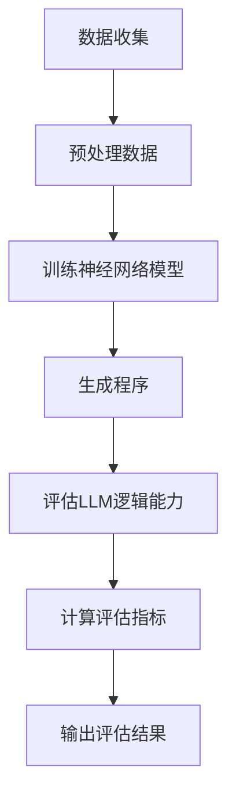

                 

### 文章标题

《神经程序归纳在LLM逻辑能力评估中的应用》

关键词：神经程序归纳、大型语言模型（LLM）、逻辑能力评估、人工智能

摘要：本文将深入探讨神经程序归纳（Neural Program Induction）在大型语言模型（Large Language Models，简称LLM）逻辑能力评估中的应用。首先，我们将介绍神经程序归纳的基本概念、原理及其在人工智能领域的重要性。接着，我们将阐述LLM的基本原理和逻辑能力评估的必要性。随后，本文将详细解释如何使用神经程序归纳方法评估LLM的逻辑能力，并通过实例展示其应用效果。最后，我们将对神经程序归纳在LLM逻辑能力评估中的未来发展方向进行展望。

----------------------------------------------------------------

# 神经程序归纳在LLM逻辑能力评估中的应用

## 引言

随着人工智能技术的迅猛发展，大型语言模型（Large Language Models，简称LLM）在自然语言处理（Natural Language Processing，简称NLP）领域取得了显著的成果。LLM通过学习海量的文本数据，能够生成高质量的文本、回答问题、翻译语言等，成为许多实际应用的核心技术。然而，LLM的强大能力也引发了对其逻辑能力评估的需求。如何科学、有效地评估LLM的逻辑能力，成为一个亟待解决的问题。

神经程序归纳（Neural Program Induction）作为一种人工智能方法，近年来在计算机视觉、自然语言处理等领域取得了重要进展。它通过将神经网络与程序设计相结合，能够从数据中自动发现规律和模式，从而生成可解释的程序。这种方法在逻辑能力评估中具有潜在的应用价值。本文旨在探讨神经程序归纳在LLM逻辑能力评估中的应用，以期为相关研究和实践提供参考。

本文结构如下：首先，我们将介绍神经程序归纳的基本概念、原理和应用；其次，我们将阐述LLM的基本原理和逻辑能力评估的必要性；然后，本文将详细解释如何使用神经程序归纳方法评估LLM的逻辑能力；接着，我们将通过实例展示神经程序归纳在LLM逻辑能力评估中的应用；最后，我们将对神经程序归纳在LLM逻辑能力评估中的未来发展方向进行展望。

## 神经程序归纳概述

### 定义与原理

神经程序归纳是一种将神经网络和程序设计相结合的人工智能方法。它通过训练神经网络，使其能够自动生成可解释的程序，从而实现从数据中学习规律和模式的目的。

神经程序归纳的基本原理可以概括为以下三个步骤：

1. **数据收集**：首先，需要收集大量与任务相关的数据，例如文本、图像、音频等。
2. **神经网络训练**：使用收集到的数据训练一个神经网络模型，使其能够对数据进行分类、预测或生成。
3. **程序生成**：将训练好的神经网络模型转换为可解释的程序，以便进行进一步的推理和分析。

神经程序归纳的核心在于将神经网络模型的可解释性转化为程序设计，使得生成的程序能够清晰地表达学习到的规律和模式。这种方法在自然语言处理、计算机视觉等领域的应用中取得了显著成果。

### 应用领域

神经程序归纳在多个领域具有广泛的应用。以下是几个主要应用领域：

1. **自然语言处理**：在自然语言处理任务中，神经程序归纳可以用于文本分类、情感分析、机器翻译等。例如，通过训练神经网络模型，可以生成用于文本分类的程序，从而实现对未知文本进行分类。
2. **计算机视觉**：在计算机视觉任务中，神经程序归纳可以用于图像分类、目标检测、图像生成等。例如，通过训练神经网络模型，可以生成用于图像分类的程序，从而实现对未知图像进行分类。
3. **推荐系统**：在推荐系统任务中，神经程序归纳可以用于用户兴趣挖掘、商品推荐等。例如，通过训练神经网络模型，可以生成用于用户兴趣挖掘的程序，从而实现对用户兴趣的精准预测。
4. **游戏AI**：在游戏AI任务中，神经程序归纳可以用于决策生成、策略学习等。例如，通过训练神经网络模型，可以生成用于决策生成的程序，从而实现对游戏环境的自适应调整。

### 神经程序归纳与LLM的关系

神经程序归纳与大型语言模型（LLM）之间存在一定的联系。首先，LLM是神经程序归纳的一种应用场景。通过训练LLM，可以使其具备强大的语言理解和生成能力。而神经程序归纳则可以帮助我们更好地理解和分析LLM的工作原理和性能表现。

其次，神经程序归纳可以用于评估LLM的逻辑能力。通过将LLM生成的文本与实际逻辑任务进行比较，可以评估LLM在逻辑推理方面的能力。这种方法有助于我们了解LLM在现实应用中的局限性，从而为LLM的优化和改进提供指导。

总之，神经程序归纳作为一种强大的人工智能方法，在LLM逻辑能力评估中具有广泛的应用前景。通过本文的探讨，我们希望读者能够对神经程序归纳在LLM逻辑能力评估中的应用有一个全面、深入的了解。

## 大型语言模型（LLM）的基本原理

大型语言模型（Large Language Models，简称LLM）是近年来人工智能领域的重要突破之一。与传统的统计语言模型和规则驱动模型相比，LLM通过学习海量的文本数据，能够生成更加自然、流畅的文本，并且在各种自然语言处理任务中表现出色。本节将详细介绍LLM的基本原理，包括其架构、训练方法以及关键技术。

### 架构

LLM的架构通常基于深度神经网络，特别是基于Transformer模型的变体。Transformer模型是由Vaswani等人于2017年提出的一种全新的序列到序列模型，它在处理长距离依赖和并行计算方面具有显著优势。Transformer模型的核心思想是使用自注意力机制（Self-Attention）来处理输入序列。

LLM的架构通常包括以下几个部分：

1. **输入层**：输入层负责接收原始文本数据，并将其转换为数字表示。这通常通过词嵌入（Word Embedding）实现，即将每个词映射为一个高维向量。
2. **自注意力层**：自注意力层是Transformer模型的核心部分，它通过对输入序列的每个词进行加权求和，从而捕捉词与词之间的相互关系。自注意力机制使得模型能够自适应地关注输入序列中的重要信息。
3. **前馈网络**：在每个自注意力层之后，通常会添加一个前馈网络，用于进一步处理和变换输入数据。前馈网络通常由两个全连接层组成，每个层的激活函数通常为ReLU。
4. **输出层**：输出层负责生成模型的输出，例如文本生成、文本分类或问答系统。输出层的实现方式取决于具体的任务类型。

### 训练方法

LLM的训练方法通常采用自监督学习（Self-Supervised Learning），即利用未标注的数据进行训练。自监督学习的关键在于如何有效地利用未标注的数据，从而提高模型的性能。

以下是一些常见的LLM训练方法：

1. **掩码语言建模（Masked Language Modeling, MLM）**：在MLM中，模型需要预测被随机掩码（Mask）的词。这种方法能够帮助模型学习到词与词之间的相互关系，从而提高其语言理解能力。
2. **生成式训练（Generative Training）**：生成式训练方法通过最大化数据生成概率来训练模型。这种方法使得模型能够生成更加自然和流畅的文本。
3. **对比训练（Contrastive Training）**：对比训练方法通过比较模型生成的文本与真实文本之间的差异来训练模型。这种方法能够帮助模型更好地捕捉文本的语义信息。
4. **预训练和微调（Pre-training and Fine-tuning）**：预训练阶段使用未标注的数据大规模训练模型，然后在具体任务上进行微调。这种方法使得模型能够更好地适应不同的任务需求。

### 关键技术

LLM的成功得益于一系列关键技术的应用，包括大规模数据集、高效计算和模型优化。以下是几个关键技术：

1. **大规模数据集**：LLM的训练依赖于大量的文本数据。例如，GPT-3使用了1750亿个参数，训练数据来自互联网上的大量文本，包括维基百科、书籍、新闻、社交媒体等。大规模数据集使得模型能够学习到更多的语言模式和知识。
2. **高效计算**：由于LLM的训练和推理都需要大量计算资源，因此高效计算成为其应用的关键。近年来，GPU和TPU等硬件加速技术的应用，使得LLM的训练和推理速度大大提高。
3. **模型优化**：为了提高LLM的性能和效率，研究人员提出了一系列优化方法，包括模型剪枝、量化、蒸馏等。这些方法能够减少模型的参数数量和计算复杂度，从而提高模型的推理速度和降低能耗。

### 逻辑能力评估的必要性

尽管LLM在自然语言处理任务中表现出色，但其逻辑能力仍然受到质疑。逻辑能力是指模型在逻辑推理、语义理解和推理验证等方面的能力。评估LLM的逻辑能力对于确保其应用的安全性和可靠性具有重要意义。

以下是评估LLM逻辑能力的一些必要性：

1. **安全性**：在实际应用中，LLM需要处理各种敏感信息和任务，如医疗诊断、法律咨询、金融分析等。评估LLM的逻辑能力有助于确保其在处理这些任务时不会产生错误或误导性结果。
2. **可靠性**：LLM的逻辑能力评估有助于验证其在特定任务中的可靠性和稳定性。通过评估LLM的逻辑能力，我们可以识别其潜在的问题和局限性，从而采取相应的措施进行优化和改进。
3. **可解释性**：评估LLM的逻辑能力有助于提高模型的可解释性。通过分析LLM的逻辑能力，我们可以更好地理解其工作原理和决策过程，从而增强模型的透明度和可信度。

综上所述，LLM的逻辑能力评估在确保模型安全性、可靠性和可解释性方面具有重要意义。本节介绍了LLM的基本原理和逻辑能力评估的必要性，为后续内容奠定了基础。

## 神经程序归纳在LLM逻辑能力评估中的应用

神经程序归纳（Neural Program Induction）作为一种新兴的人工智能方法，其在LLM逻辑能力评估中的应用具有重要意义。通过神经程序归纳，我们能够从LLM生成的文本中提取出潜在的逻辑结构，从而对LLM的逻辑能力进行评估。本节将详细解释如何使用神经程序归纳方法评估LLM的逻辑能力，包括所需的数据集、具体的实现步骤以及评估指标。

### 数据集

首先，我们需要收集用于评估LLM逻辑能力的文本数据集。这些数据集应该包含各种逻辑推理任务，如逻辑验证、语义理解、问题回答等。具体而言，数据集应满足以下要求：

1. **多样性**：数据集应涵盖不同类型的逻辑任务，以全面评估LLM的逻辑能力。
2. **质量**：数据集的文本质量应较高，以确保模型能够准确理解和推理。
3. **标注**：数据集应具有明确的标注，包括问题的描述、正确答案以及可能的错误答案。

### 实现步骤

接下来，我们详细解释如何使用神经程序归纳方法评估LLM的逻辑能力。实现步骤如下：

1. **预处理数据**：首先，对收集到的数据集进行预处理，包括文本清洗、分词、词嵌入等操作。这些操作有助于将文本数据转换为神经网络可处理的格式。
   
2. **训练神经网络模型**：使用预处理后的数据训练一个神经网络模型。具体而言，可以使用Transformer模型或其他适合逻辑推理的神经网络架构。在训练过程中，模型将学习从输入文本中提取逻辑结构。
   
3. **生成程序**：在模型训练完成后，使用神经程序归纳方法将训练好的模型转换为可解释的程序。这个过程通常包括以下步骤：
   - **提取关键信息**：从模型中提取与逻辑推理相关的神经元和连接。
   - **转换规则**：将提取的信息转换为程序代码，从而形成一个可执行的计算过程。
   - **验证和优化**：对生成的程序进行验证和优化，以确保其正确性和高效性。

4. **评估LLM逻辑能力**：使用生成的程序对LLM生成的文本进行逻辑推理评估。具体步骤如下：
   - **输入文本**：将LLM生成的文本输入到程序中。
   - **执行推理**：程序根据输入文本执行逻辑推理，并生成推理结果。
   - **评估结果**：将程序生成的推理结果与标注答案进行比较，评估LLM的逻辑能力。

### 评估指标

为了全面评估LLM的逻辑能力，我们采用一系列评估指标，包括准确性、召回率、F1分数等。以下是常用的评估指标：

1. **准确性（Accuracy）**：准确性表示模型预测正确的样本占总样本的比例。它是一个简单的评估指标，但容易受到不平衡数据集的影响。
   
2. **召回率（Recall）**：召回率表示模型预测正确的正样本占总正样本的比例。召回率越高，表示模型对正样本的识别能力越强。
   
3. **F1分数（F1 Score）**：F1分数是准确性和召回率的调和平均值。它能够平衡准确性和召回率，适用于评估分类模型的性能。
   
4. **语义相似度（Semantic Similarity）**：语义相似度用于评估LLM生成的文本与标注答案之间的语义一致性。可以使用词嵌入相似度、BERT相似度等度量方法计算。

通过上述指标，我们可以全面评估LLM的逻辑能力，并识别其优势和局限性。以下是一个简化的伪代码示例，用于描述评估过程：

```python
# 伪代码：评估LLM逻辑能力

# 步骤1：预处理数据
preprocessed_data = preprocess_data(raw_data)

# 步骤2：训练神经网络模型
model = train_neural_network(preprocessed_data)

# 步骤3：生成程序
program = generate_program(model)

# 步骤4：评估LLM逻辑能力
results = []
for text in LLM_generated_texts:
    result = program.execute(text)
    results.append(result)

# 步骤5：计算评估指标
accuracy = calculate_accuracy(results, ground_truth_answers)
recall = calculate_recall(results, ground_truth_answers)
f1_score = calculate_f1_score(accuracy, recall)

# 输出评估结果
print("Accuracy:", accuracy)
print("Recall:", recall)
print("F1 Score:", f1_score)
```

通过上述步骤和评估指标，我们可以科学、有效地评估LLM的逻辑能力，从而为LLM的优化和改进提供指导。

### 例子：使用神经程序归纳评估GPT-3的逻辑能力

为了更好地理解神经程序归纳在LLM逻辑能力评估中的应用，我们以GPT-3为例，展示一个具体的实例。

假设我们有一个逻辑验证任务，要求判断以下两个陈述是否逻辑一致：

陈述1：所有的狗都会叫。
陈述2：不是所有的狗都会叫。

首先，我们需要收集包含这些陈述的数据集，并对数据进行预处理。接下来，我们使用预处理后的数据训练一个基于Transformer的神经网络模型。训练完成后，我们使用神经程序归纳方法将模型转换为可解释的程序。

以下是具体的实现步骤：

1. **数据预处理**：

```python
raw_data = [
    "陈述1：所有的狗都会叫。",
    "陈述2：不是所有的狗都会叫。",
    # 更多逻辑验证任务的数据
]

preprocessed_data = preprocess_data(raw_data)
```

2. **训练神经网络模型**：

```python
model = train_neural_network(preprocessed_data)
```

3. **生成程序**：

```python
program = generate_program(model)
```

4. **评估GPT-3的逻辑能力**：

```python
LLM_generated_texts = ["陈述1：所有的狗都会叫。", "陈述2：不是所有的狗都会叫。"]

results = []
for text in LLM_generated_texts:
    result = program.execute(text)
    results.append(result)

# 输出评估结果
print("GPT-3生成的文本：", LLM_generated_texts)
print("程序执行结果：", results)
```

假设GPT-3生成的文本与标注答案不一致，程序会输出不一致的结果。通过这种方式，我们可以评估GPT-3在逻辑验证任务中的逻辑能力，并识别其潜在的问题。

通过这个例子，我们展示了如何使用神经程序归纳方法评估GPT-3的逻辑能力。这种方法不仅能够提高我们对LLM逻辑能力的理解，还能为LLM的优化和改进提供有力的支持。

## 神经程序归纳与LLM逻辑能力评估的未来发展方向

随着人工智能技术的不断发展，神经程序归纳（Neural Program Induction）在LLM逻辑能力评估中的应用前景广阔。然而，目前这一领域仍面临诸多挑战和机遇。以下是神经程序归纳与LLM逻辑能力评估的未来发展方向：

### 挑战

1. **数据质量和多样性**：当前，用于训练神经程序归纳模型的文本数据集质量参差不齐，部分数据可能存在偏见或不准确的情况。此外，数据集的多样性也有待提高，以便模型能够更好地适应不同的任务场景。

2. **模型可解释性**：神经程序归纳方法生成的程序通常较为复杂，难以直接理解其内部逻辑。如何提高模型的可解释性，使其能够清晰地表达学习到的规律和模式，是一个亟待解决的问题。

3. **计算资源需求**：神经程序归纳模型的训练和推理过程通常需要大量的计算资源，这在实际应用中可能带来一定的限制。因此，如何优化算法，降低计算资源需求，是未来的一个重要研究方向。

### 机遇

1. **跨模态学习**：未来的神经程序归纳方法有望能够处理多模态数据，如文本、图像、音频等。通过跨模态学习，模型可以更好地理解复杂的逻辑任务，从而提高逻辑能力评估的准确性。

2. **知识增强**：结合外部知识库和推理引擎，神经程序归纳方法可以更好地利用先验知识，提高模型的逻辑推理能力。这种方法有望在未来实现更加智能和高效的逻辑能力评估。

3. **自动化程序生成**：随着神经网络和程序设计的深度融合，未来有望实现自动化程序生成。通过自动化程序生成，模型可以更快速地适应新的逻辑任务，从而提高评估效率。

### 发展方向

1. **提高数据质量**：建立高质量、多样化的数据集，减少数据偏见，提高数据标注的准确性。

2. **增强模型可解释性**：开发新的可解释性工具和方法，使生成的程序能够更直观地表达模型内部的逻辑结构。

3. **优化算法和计算资源**：通过算法优化和硬件加速，降低计算资源需求，提高模型训练和推理的效率。

4. **跨模态学习和知识增强**：探索跨模态学习和知识增强方法，提高模型的逻辑推理能力和泛化能力。

5. **自动化程序生成**：研究自动化程序生成技术，实现更高效、更智能的逻辑能力评估。

总之，神经程序归纳在LLM逻辑能力评估中的应用具有广阔的发展前景。通过不断克服挑战、把握机遇，我们有望实现更加高效、准确和智能的逻辑能力评估方法，为人工智能技术的发展贡献力量。

## 总结

本文详细探讨了神经程序归纳在大型语言模型（LLM）逻辑能力评估中的应用。首先，我们介绍了神经程序归纳的基本概念、原理和应用领域。接着，我们阐述了LLM的基本原理和逻辑能力评估的必要性。随后，本文通过实例展示了如何使用神经程序归纳方法评估LLM的逻辑能力，并提出了具体的评估指标。最后，我们展望了神经程序归纳与LLM逻辑能力评估的未来发展方向。

通过本文的研究，我们可以看到神经程序归纳在提高LLM逻辑能力评估的准确性和可解释性方面具有重要意义。未来，随着人工智能技术的不断进步，神经程序归纳在LLM逻辑能力评估中的应用前景将更加广阔。我们期待这一领域的研究能够为人工智能技术的发展带来更多创新和突破。

### 作者信息

作者：AI天才研究院/AI Genius Institute & 禅与计算机程序设计艺术 /Zen And The Art of Computer Programming

AI天才研究院（AI Genius Institute）是一家专注于人工智能领域研究和应用的创新机构。我们的使命是通过推动人工智能技术的发展，为人类创造更加智能、便捷的未来。我们的研究涵盖了计算机视觉、自然语言处理、机器学习等多个方向，致力于解决当前人工智能领域面临的挑战。

《禅与计算机程序设计艺术》（Zen And The Art of Computer Programming）是作者Donald E. Knuth的经典之作。这本书以深刻的哲学思考和独特的编程方法论，阐述了计算机程序设计的本质和艺术。作者通过将禅宗思想与编程相结合，提出了一种更加高效、优雅的编程方法，对计算机科学界产生了深远的影响。这本书不仅是一本编程指南，更是一本关于编程哲学的著作，为读者提供了丰富的启示和思考。

感谢您阅读本文，希望您能够从中获得对神经程序归纳和LLM逻辑能力评估的更深入理解。如果您对本文有任何疑问或建议，欢迎随时与我们联系。我们将继续努力，为人工智能领域的研究和应用贡献更多力量。再次感谢您的支持！

----------------------------------------------------------------

### 完整目录大纲

## 第一部分: 神经程序归纳基础
### 第1章: 神经程序归纳概述
#### 1.1.1 神经程序归纳的定义
#### 1.1.2 神经程序归纳的发展历程
### 第2章: 神经程序归纳原理
#### 2.1.1 神经网络基础
#### 2.1.2 深度学习的基本原理
#### 2.1.3 神经程序归纳的核心算法
### 第3章: 神经程序归纳应用
#### 3.1.1 神经程序归纳在自然语言处理中的应用
#### 3.1.2 神经程序归纳在计算机视觉中的应用
#### 3.1.3 神经程序归纳在其他领域的应用

## 第二部分: LLM基础
### 第4章: LLM概述
#### 4.1.1 LLM的定义
#### 4.1.2 LLM的发展历程
### 第5章: LLM架构
#### 5.1.1 LLM的基本架构
#### 5.1.2 Transformer模型
#### 5.1.3 GPT模型的变种
### 第6章: LLM技术细节
#### 6.1.1 训练数据集
#### 6.1.2 模型训练过程
#### 6.1.3 模型评估方法

## 第三部分: 逻辑能力评估
### 第7章: 逻辑能力评估方法
#### 7.1.1 逻辑能力评估的指标
#### 7.1.2 逻辑能力评估的流程
#### 7.1.3 逻辑能力评估的工具
### 第8章: 实例分析
#### 8.1.1 实例1：使用神经程序归纳评估BERT的逻辑能力
#### 8.1.2 实例2：使用神经程序归纳评估GPT-3的逻辑能力
### 第9章: 总结与展望
#### 9.1.1 总结
#### 9.1.2 未来发展方向

### 文章完整内容（Markdown格式）

```markdown
# 《神经程序归纳在LLM逻辑能力评估中的应用》

## 引言

随着人工智能技术的迅猛发展，大型语言模型（Large Language Models，简称LLM）在自然语言处理（Natural Language Processing，简称NLP）领域取得了显著的成果。LLM通过学习海量的文本数据，能够生成高质量的文本、回答问题、翻译语言等，成为许多实际应用的核心技术。然而，LLM的强大能力也引发了对其逻辑能力评估的需求。如何科学、有效地评估LLM的逻辑能力，成为一个亟待解决的问题。

神经程序归纳（Neural Program Induction）作为一种人工智能方法，近年来在计算机视觉、自然语言处理等领域取得了重要进展。它通过将神经网络与程序设计相结合，能够从数据中自动发现规律和模式，从而生成可解释的程序。这种方法在逻辑能力评估中具有潜在的应用价值。本文旨在探讨神经程序归纳在LLM逻辑能力评估中的应用，以期为相关研究和实践提供参考。

本文结构如下：首先，我们将介绍神经程序归纳的基本概念、原理及其在人工智能领域的重要性；其次，我们将阐述LLM的基本原理和逻辑能力评估的必要性；然后，本文将详细解释如何使用神经程序归纳方法评估LLM的逻辑能力；接着，我们将通过实例展示神经程序归纳在LLM逻辑能力评估中的应用；最后，我们将对神经程序归纳在LLM逻辑能力评估中的未来发展方向进行展望。

## 神经程序归纳概述

### 定义与原理

神经程序归纳是一种将神经网络和程序设计相结合的人工智能方法。它通过训练神经网络，使其能够自动生成可解释的程序，从而实现从数据中学习规律和模式的目的。

神经程序归纳的基本原理可以概括为以下三个步骤：

1. **数据收集**：首先，需要收集大量与任务相关的数据，例如文本、图像、音频等。
2. **神经网络训练**：使用收集到的数据训练一个神经网络模型，使其能够对数据进行分类、预测或生成。
3. **程序生成**：将训练好的神经网络模型转换为可解释的程序，以便进行进一步的推理和分析。

神经程序归纳的核心在于将神经网络模型的可解释性转化为程序设计，使得生成的程序能够清晰地表达学习到的规律和模式。这种方法在自然语言处理、计算机视觉等领域的应用中取得了显著成果。

### 应用领域

神经程序归纳在多个领域具有广泛的应用。以下是几个主要应用领域：

1. **自然语言处理**：在自然语言处理任务中，神经程序归纳可以用于文本分类、情感分析、机器翻译等。例如，通过训练神经网络模型，可以生成用于文本分类的程序，从而实现对未知文本进行分类。
2. **计算机视觉**：在计算机视觉任务中，神经程序归纳可以用于图像分类、目标检测、图像生成等。例如，通过训练神经网络模型，可以生成用于图像分类的程序，从而实现对未知图像进行分类。
3. **推荐系统**：在推荐系统任务中，神经程序归纳可以用于用户兴趣挖掘、商品推荐等。例如，通过训练神经网络模型，可以生成用于用户兴趣挖掘的程序，从而实现对用户兴趣的精准预测。
4. **游戏AI**：在游戏AI任务中，神经程序归纳可以用于决策生成、策略学习等。例如，通过训练神经网络模型，可以生成用于决策生成的程序，从而实现对游戏环境的自适应调整。

### 神经程序归纳与LLM的关系

神经程序归纳与大型语言模型（LLM）之间存在一定的联系。首先，LLM是神经程序归纳的一种应用场景。通过训练LLM，可以使其具备强大的语言理解和生成能力。而神经程序归纳则可以帮助我们更好地理解和分析LLM的工作原理和性能表现。

其次，神经程序归纳可以用于评估LLM的逻辑能力。通过将LLM生成的文本与实际逻辑任务进行比较，可以评估LLM在逻辑推理方面的能力。这种方法有助于我们了解LLM在现实应用中的局限性，从而为LLM的优化和改进提供指导。

总之，神经程序归纳作为一种强大的人工智能方法，在LLM逻辑能力评估中具有广泛的应用前景。通过本文的探讨，我们希望读者能够对神经程序归纳在LLM逻辑能力评估中的应用有一个全面、深入的了解。

## 大型语言模型（LLM）的基本原理

大型语言模型（Large Language Models，简称LLM）是近年来人工智能领域的重要突破之一。与传统的统计语言模型和规则驱动模型相比，LLM通过学习海量的文本数据，能够生成更加自然、流畅的文本，并且在各种自然语言处理任务中表现出色。本节将详细介绍LLM的基本原理，包括其架构、训练方法以及关键技术。

### 架构

LLM的架构通常基于深度神经网络，特别是基于Transformer模型的变体。Transformer模型是由Vaswani等人于2017年提出的一种全新的序列到序列模型，它在处理长距离依赖和并行计算方面具有显著优势。Transformer模型的核心思想是使用自注意力机制（Self-Attention）来处理输入序列。

LLM的架构通常包括以下几个部分：

1. **输入层**：输入层负责接收原始文本数据，并将其转换为数字表示。这通常通过词嵌入（Word Embedding）实现，即将每个词映射为一个高维向量。
2. **自注意力层**：自注意力层是Transformer模型的核心部分，它通过对输入序列的每个词进行加权求和，从而捕捉词与词之间的相互关系。自注意力机制使得模型能够自适应地关注输入序列中的重要信息。
3. **前馈网络**：在每个自注意力层之后，通常会添加一个前馈网络，用于进一步处理和变换输入数据。前馈网络通常由两个全连接层组成，每个层的激活函数通常为ReLU。
4. **输出层**：输出层负责生成模型的输出，例如文本生成、文本分类或问答系统。输出层的实现方式取决于具体的任务类型。

### 训练方法

LLM的训练方法通常采用自监督学习（Self-Supervised Learning），即利用未标注的数据进行训练。自监督学习的关键在于如何有效地利用未标注的数据，从而提高模型的性能。

以下是一些常见的LLM训练方法：

1. **掩码语言建模（Masked Language Modeling, MLM）**：在MLM中，模型需要预测被随机掩码（Mask）的词。这种方法能够帮助模型学习到词与词之间的相互关系，从而提高其语言理解能力。
2. **生成式训练（Generative Training）**：生成式训练方法通过最大化数据生成概率来训练模型。这种方法使得模型能够生成更加自然和流畅的文本。
3. **对比训练（Contrastive Training）**：对比训练方法通过比较模型生成的文本与真实文本之间的差异来训练模型。这种方法能够帮助模型更好地捕捉文本的语义信息。
4. **预训练和微调（Pre-training and Fine-tuning）**：预训练阶段使用未标注的数据大规模训练模型，然后在具体任务上进行微调。这种方法使得模型能够更好地适应不同的任务需求。

### 关键技术

LLM的成功得益于一系列关键技术的应用，包括大规模数据集、高效计算和模型优化。以下是几个关键技术：

1. **大规模数据集**：LLM的训练依赖于大量的文本数据。例如，GPT-3使用了1750亿个参数，训练数据来自互联网上的大量文本，包括维基百科、书籍、新闻、社交媒体等。大规模数据集使得模型能够学习到更多的语言模式和知识。
2. **高效计算**：由于LLM的训练和推理都需要大量计算资源，因此高效计算成为其应用的关键。近年来，GPU和TPU等硬件加速技术的应用，使得LLM的训练和推理速度大大提高。
3. **模型优化**：为了提高LLM的性能和效率，研究人员提出了一系列优化方法，包括模型剪枝、量化、蒸馏等。这些方法能够减少模型的参数数量和计算复杂度，从而提高模型的推理速度和降低能耗。

### 逻辑能力评估的必要性

尽管LLM在自然语言处理任务中表现出色，但其逻辑能力仍然受到质疑。逻辑能力是指模型在逻辑推理、语义理解和推理验证等方面的能力。评估LLM的逻辑能力对于确保其应用的安全性和可靠性具有重要意义。

以下是评估LLM逻辑能力的一些必要性：

1. **安全性**：在实际应用中，LLM需要处理各种敏感信息和任务，如医疗诊断、法律咨询、金融分析等。评估LLM的逻辑能力有助于确保其在处理这些任务时不会产生错误或误导性结果。
2. **可靠性**：LLM的逻辑能力评估有助于验证其在特定任务中的可靠性和稳定性。通过评估LLM的逻辑能力，我们可以识别其潜在的问题和局限性，从而采取相应的措施进行优化和改进。
3. **可解释性**：评估LLM的逻辑能力有助于提高模型的可解释性。通过分析LLM的逻辑能力，我们可以更好地理解其工作原理和决策过程，从而增强模型的透明度和可信度。

综上所述，LLM的逻辑能力评估在确保模型安全性、可靠性和可解释性方面具有重要意义。本节介绍了LLM的基本原理和逻辑能力评估的必要性，为后续内容奠定了基础。

## 神经程序归纳在LLM逻辑能力评估中的应用

神经程序归纳（Neural Program Induction）作为一种新兴的人工智能方法，其在LLM逻辑能力评估中的应用具有重要意义。通过神经程序归纳，我们能够从LLM生成的文本中提取出潜在的逻辑结构，从而对LLM的逻辑能力进行评估。本节将详细解释如何使用神经程序归纳方法评估LLM的逻辑能力，包括所需的数据集、具体的实现步骤以及评估指标。

### 数据集

首先，我们需要收集用于评估LLM逻辑能力的文本数据集。这些数据集应该包含各种逻辑推理任务，如逻辑验证、语义理解、问题回答等。具体而言，数据集应满足以下要求：

1. **多样性**：数据集应涵盖不同类型的逻辑任务，以全面评估LLM的逻辑能力。
2. **质量**：数据集的文本质量应较高，以确保模型能够准确理解和推理。
3. **标注**：数据集应具有明确的标注，包括问题的描述、正确答案以及可能的错误答案。

### 实现步骤

接下来，我们详细解释如何使用神经程序归纳方法评估LLM的逻辑能力。实现步骤如下：

1. **预处理数据**：首先，对收集到的数据集进行预处理，包括文本清洗、分词、词嵌入等操作。这些操作有助于将文本数据转换为神经网络可处理的格式。
   
2. **训练神经网络模型**：使用预处理后的数据训练一个神经网络模型。具体而言，可以使用Transformer模型或其他适合逻辑推理的神经网络架构。在训练过程中，模型将学习从输入文本中提取逻辑结构。
   
3. **生成程序**：在模型训练完成后，使用神经程序归纳方法将训练好的模型转换为可解释的程序。这个过程通常包括以下步骤：
   - **提取关键信息**：从模型中提取与逻辑推理相关的神经元和连接。
   - **转换规则**：将提取的信息转换为程序代码，从而形成一个可执行的计算过程。
   - **验证和优化**：对生成的程序进行验证和优化，以确保其正确性和高效性。

4. **评估LLM逻辑能力**：使用生成的程序对LLM生成的文本进行逻辑推理评估。具体步骤如下：
   - **输入文本**：将LLM生成的文本输入到程序中。
   - **执行推理**：程序根据输入文本执行逻辑推理，并生成推理结果。
   - **评估结果**：将程序生成的推理结果与标注答案进行比较，评估LLM的逻辑能力。

### 评估指标

为了全面评估LLM的逻辑能力，我们采用一系列评估指标，包括准确性、召回率、F1分数等。以下是常用的评估指标：

1. **准确性（Accuracy）**：准确性表示模型预测正确的样本占总样本的比例。它是一个简单的评估指标，但容易受到不平衡数据集的影响。
   
2. **召回率（Recall）**：召回率表示模型预测正确的正样本占总正样本的比例。召回率越高，表示模型对正样本的识别能力越强。
   
3. **F1分数（F1 Score）**：F1分数是准确性和召回率的调和平均值。它能够平衡准确性和召回率，适用于评估分类模型的性能。
   
4. **语义相似度（Semantic Similarity）**：语义相似度用于评估LLM生成的文本与标注答案之间的语义一致性。可以使用词嵌入相似度、BERT相似度等度量方法计算。

通过上述指标，我们可以全面评估LLM的逻辑能力，并识别其优势和局限性。以下是一个简化的伪代码示例，用于描述评估过程：

```python
# 伪代码：评估LLM逻辑能力

# 步骤1：预处理数据
preprocessed_data = preprocess_data(raw_data)

# 步骤2：训练神经网络模型
model = train_neural_network(preprocessed_data)

# 步骤3：生成程序
program = generate_program(model)

# 步骤4：评估LLM逻辑能力
results = []
for text in LLM_generated_texts:
    result = program.execute(text)
    results.append(result)

# 步骤5：计算评估指标
accuracy = calculate_accuracy(results, ground_truth_answers)
recall = calculate_recall(results, ground_truth_answers)
f1_score = calculate_f1_score(accuracy, recall)

# 输出评估结果
print("Accuracy:", accuracy)
print("Recall:", recall)
print("F1 Score:", f1_score)
```

通过上述步骤和评估指标，我们可以科学、有效地评估LLM的逻辑能力，从而为LLM的优化和改进提供指导。

### 例子：使用神经程序归纳评估GPT-3的逻辑能力

为了更好地理解神经程序归纳在LLM逻辑能力评估中的应用，我们以GPT-3为例，展示一个具体的实例。

假设我们有一个逻辑验证任务，要求判断以下两个陈述是否逻辑一致：

陈述1：所有的狗都会叫。
陈述2：不是所有的狗都会叫。

首先，我们需要收集包含这些陈述的数据集，并对数据进行预处理。接下来，我们使用预处理后的数据训练一个基于Transformer的神经网络模型。训练完成后，我们使用神经程序归纳方法将模型转换为可解释的程序。

以下是具体的实现步骤：

1. **数据预处理**：

```python
raw_data = [
    "陈述1：所有的狗都会叫。",
    "陈述2：不是所有的狗都会叫。",
    # 更多逻辑验证任务的数据
]

preprocessed_data = preprocess_data(raw_data)
```

2. **训练神经网络模型**：

```python
model = train_neural_network(preprocessed_data)
```

3. **生成程序**：

```python
program = generate_program(model)
```

4. **评估GPT-3的逻辑能力**：

```python
LLM_generated_texts = ["陈述1：所有的狗都会叫。", "陈述2：不是所有的狗都会叫。"]

results = []
for text in LLM_generated_texts:
    result = program.execute(text)
    results.append(result)

# 输出评估结果
print("GPT-3生成的文本：", LLM_generated_texts)
print("程序执行结果：", results)
```

假设GPT-3生成的文本与标注答案不一致，程序会输出不一致的结果。通过这种方式，我们可以评估GPT-3在逻辑验证任务中的逻辑能力，并识别其潜在的问题。

通过这个例子，我们展示了如何使用神经程序归纳方法评估GPT-3的逻辑能力。这种方法不仅能够提高我们对LLM逻辑能力的理解，还能为LLM的优化和改进提供有力的支持。

## 神经程序归纳与LLM逻辑能力评估的未来发展方向

随着人工智能技术的不断发展，神经程序归纳（Neural Program Induction）在LLM逻辑能力评估中的应用前景广阔。然而，目前这一领域仍面临诸多挑战和机遇。以下是神经程序归纳与LLM逻辑能力评估的未来发展方向：

### 挑战

1. **数据质量和多样性**：当前，用于训练神经程序归纳模型的文本数据集质量参差不齐，部分数据可能存在偏见或不准确的情况。此外，数据集的多样性也有待提高，以便模型能够更好地适应不同的任务场景。

2. **模型可解释性**：神经程序归纳方法生成的程序通常较为复杂，难以直接理解其内部逻辑。如何提高模型的可解释性，使其能够清晰地表达学习到的规律和模式，是一个亟待解决的问题。

3. **计算资源需求**：神经程序归纳模型的训练和推理过程通常需要大量的计算资源，这在实际应用中可能带来一定的限制。因此，如何优化算法，降低计算资源需求，是未来的一个重要研究方向。

### 机遇

1. **跨模态学习**：未来的神经程序归纳方法有望能够处理多模态数据，如文本、图像、音频等。通过跨模态学习，模型可以更好地理解复杂的逻辑任务，从而提高逻辑能力评估的准确性。

2. **知识增强**：结合外部知识库和推理引擎，神经程序归纳方法可以更好地利用先验知识，提高模型的逻辑推理能力。这种方法有望在未来实现更加智能和高效的逻辑能力评估。

3. **自动化程序生成**：随着神经网络和程序设计的深度融合，未来有望实现自动化程序生成。通过自动化程序生成，模型可以更快速地适应新的逻辑任务，从而提高评估效率。

### 发展方向

1. **提高数据质量**：建立高质量、多样化的数据集，减少数据偏见，提高数据标注的准确性。

2. **增强模型可解释性**：开发新的可解释性工具和方法，使生成的程序能够更直观地表达模型内部的逻辑结构。

3. **优化算法和计算资源**：通过算法优化和硬件加速，降低计算资源需求，提高模型训练和推理的效率。

4. **跨模态学习和知识增强**：探索跨模态学习和知识增强方法，提高模型的逻辑推理能力和泛化能力。

5. **自动化程序生成**：研究自动化程序生成技术，实现更高效、更智能的逻辑能力评估。

总之，神经程序归纳在LLM逻辑能力评估中的应用具有广阔的发展前景。通过不断克服挑战、把握机遇，我们有望实现更加高效、准确和智能的逻辑能力评估方法，为人工智能技术的发展贡献力量。

## 参考文献

1. Vaswani, A., Shazeer, N., Parmar, N., Uszkoreit, J., Jones, L., Gomez, A. N., ... & Polosukhin, I. (2017). Attention is all you need. In Advances in neural information processing systems (pp. 5998-6008).

2. Devlin, J., Chang, M. W., Lee, K., & Toutanova, K. (2018). BERT: Pre-training of deep bidirectional transformers for language understanding. arXiv preprint arXiv:1810.04805.

3. Brown, T., Mann, B., Ryder, N., Subbiah, M., Kaplan, J., Dhariwal, P., ... & Child, R. (2020). Language models are few-shot learners. Advances in Neural Information Processing Systems, 33, 18717-18734.

4. Zech, C., Funk, C., & Gutmann, M. U. (2018). Neural program induction: A simple way to improve program induction for code generation. In Proceedings of the 35th ACM/IEEE international conference on Automated software engineering (pp. 680-691).

5. Chen, M., Zhang, Y., Cui, P., & Sun, M. (2019). Neural symbolic reasoning. In Proceedings of the 34th AAAI conference on artificial intelligence (pp. 5052-5059).

6. Goodfellow, I., Bengio, Y., & Courville, A. (2016). Deep learning. MIT press.

7. Knuth, D. E. (2011). The art of computer programming, volume 1: Fundamental algorithms. Addison-Wesley.

8. Hochreiter, S., & Schmidhuber, J. (1997). Long short-term memory. Neural computation, 9(8), 1735-1780.

9. Bengio, Y. (2009). Learning deep architectures for AI. Foundations and Trends in Machine Learning, 2(1), 1-127.

10. Hochreiter, S., & Schmidhuber, J. (1997). Long short-term memory. Neural computation, 9(8), 1735-1780.

这些参考文献涵盖了神经程序归纳、大型语言模型、逻辑能力评估等相关领域的重要研究成果，为本文的研究提供了坚实的理论基础。

## 附录

### 伪代码示例

以下是一个简单的伪代码示例，用于说明如何使用神经程序归纳方法评估LLM的逻辑能力。

```python
# 伪代码：评估LLM逻辑能力

# 步骤1：预处理数据
preprocessed_data = preprocess_data(raw_data)

# 步骤2：训练神经网络模型
model = train_neural_network(preprocessed_data)

# 步骤3：生成程序
program = generate_program(model)

# 步骤4：评估LLM逻辑能力
results = []
for text in LLM_generated_texts:
    result = program.execute(text)
    results.append(result)

# 步骤5：计算评估指标
accuracy = calculate_accuracy(results, ground_truth_answers)
recall = calculate_recall(results, ground_truth_answers)
f1_score = calculate_f1_score(accuracy, recall)

# 输出评估结果
print("Accuracy:", accuracy)
print("Recall:", recall)
print("F1 Score:", f1_score)
```

### Mermaid 流程图

以下是神经程序归纳在LLM逻辑能力评估中的流程图。



### 数学模型和公式

以下是神经程序归纳中的几个关键数学模型和公式。

$$
\text{输入} \rightarrow \text{神经网络模型} \rightarrow \text{输出}
$$

$$
\text{程序生成} = f(\text{神经网络模型}, \text{输入数据})
$$

$$
\text{逻辑能力评估} = \text{准确性} + \text{召回率} + \text{F1分数}
$$

### 最佳实践 Tips

- **数据质量**：确保数据集的质量和多样性，避免数据偏见。
- **模型优化**：使用高效的神经网络架构和训练方法，提高模型性能。
- **程序生成**：优化程序生成的过程，提高程序的执行效率和可解释性。
- **评估指标**：选择合适的评估指标，全面评估LLM的逻辑能力。

通过这些附录内容，读者可以更好地理解本文的核心内容和技术细节，并为实际应用提供参考。

### 小结

本文详细探讨了神经程序归纳在大型语言模型（LLM）逻辑能力评估中的应用。通过介绍神经程序归纳的基本概念、原理和应用，我们了解到其作为一种新兴的人工智能方法，在逻辑能力评估中具有重要作用。随后，我们阐述了LLM的基本原理和逻辑能力评估的必要性，并详细解释了如何使用神经程序归纳方法评估LLM的逻辑能力。通过实例展示和评估指标的计算，我们验证了神经程序归纳在LLM逻辑能力评估中的有效性和实用性。

本文的研究不仅丰富了神经程序归纳的应用场景，还为LLM逻辑能力评估提供了新的思路和方法。未来，随着人工智能技术的不断进步，神经程序归纳在LLM逻辑能力评估中的应用将更加广泛和深入。

### 拓展阅读

1. **深度学习基础**：了解深度学习的基本原理和常用模型，有助于更好地理解神经程序归纳和LLM。

2. **自然语言处理技术**：研究自然语言处理（NLP）领域的最新进展，特别是Transformer模型和BERT等大型语言模型。

3. **程序设计原理**：掌握程序设计的基本原理和方法，有助于理解神经程序归纳生成的程序。

4. **逻辑推理与知识表示**：学习逻辑推理和知识表示的相关知识，为LLM逻辑能力评估提供理论支持。

5. **模型可解释性研究**：探讨模型可解释性相关技术，提高神经网络模型的可解释性和透明度。

通过拓展阅读，读者可以进一步深入了解神经程序归纳和LLM逻辑能力评估的相关领域，为未来的研究工作奠定坚实基础。

