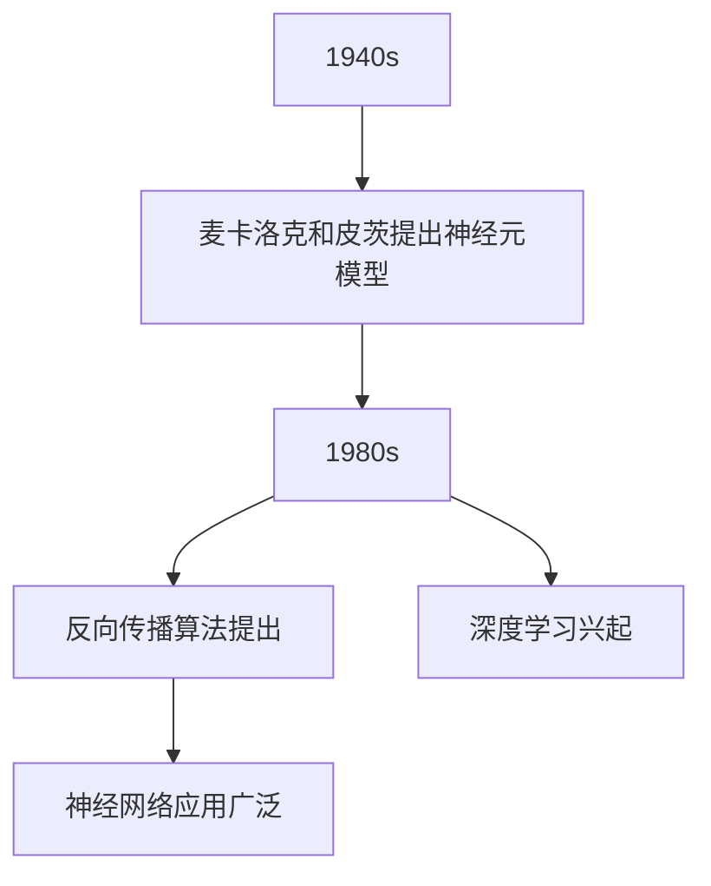
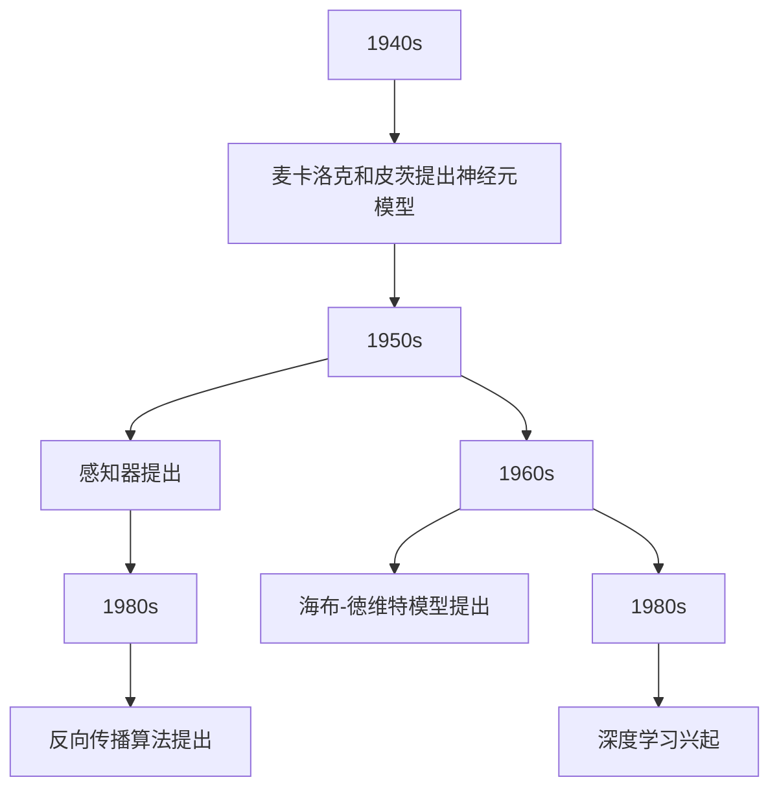

                 


### 文章标题：神经网络：大脑结构的数学模拟

> 关键词：神经网络，大脑结构，数学模拟，人工神经网络，反向传播算法，激活函数，项目实战

> 摘要：本文将深入探讨神经网络的工作原理，从大脑结构出发，通过数学模拟的方式，解析神经网络的层次结构、核心算法原理，以及如何通过数学模型和公式来理解和实现神经网络。文章将通过具体的项目实战，展示神经网络在实际应用中的开发环境搭建、源代码实现、代码解读、应用解读与分析，以及未来发展趋势。

---

# 目录

## 第一部分：神经网络的起源与理论基础

### 第1章：神经网络的起源

### 第2章：神经网络的基本原理

### 第3章：前馈神经网络

## 第二部分：神经网络的数学模型

### 第4章：神经网络的数学基础

### 第5章：反向传播算法

### 第6章：激活函数的数学特性

## 第三部分：神经网络的实现与应用

### 第7章：神经网络框架介绍

### 第8章：神经网络项目实战

### 第9章：神经网络的未来发展趋势

## 附录：神经网络常用框架和工具介绍

---

## 第一部分：神经网络的起源与理论基础

### 第1章：神经网络的起源

#### 1.1 神经网络的早期历史

神经网络的起源可以追溯到1940年代，当时麦卡洛克和皮茨（Warren McCulloch 和 Walter Pitts）提出了人工神经网络（Artificial Neural Networks，ANN）的基本概念。他们的工作奠定了神经网络的理论基础，特别是神经元模型。

**核心概念与联系**：人工神经网络与生物神经网络的联系。


**Mermaid 流程图**：神经网络发展历程



#### 1.2 神经网络的早期历史

在麦卡洛克和皮茨之后，神经网络的发展经历了多个阶段。1980年代，海布-徳维特模型（Hopfield Model）和感知器（Perceptron）的提出，为神经网络的研究提供了新的思路。

**核心概念与联系**：神经网络在不同阶段的发展及其核心贡献。


**Mermaid 流程图**：神经网络不同阶段的发展



### 第2章：神经网络的基本原理

#### 2.1 神经元与神经网络

神经元是神经网络的基本单元，类似于大脑中的神经细胞。神经元通过接收输入信号，经过加权求和后，通过激活函数产生输出。

**核心概念与联系**：神经元的工作原理。


**核心算法原理讲解**：神经元的工作原理。

```python
# 伪代码：神经元的工作原理
def neuron(input, weights, bias):
    weighted_sum = sum(input * weights)
    output = activation_function(weighted_sum + bias)
    return output
```

**数学模型和数学公式**：神经元的激活函数和加权求和公式。

$$
output = \text{activation_function}(weighted\_sum + bias)
$$

其中，$\text{activation\_function}$ 表示激活函数，$weighted\_sum$ 表示加权求和，$bias$ 表示偏置。

#### 2.2 神经网络的层次结构

神经网络通常分为输入层、隐藏层和输出层。每一层中的神经元接收前一层神经元的输出作为输入。

**核心概念与联系**：神经网络的层次结构。


**核心算法原理讲解**：神经网络的前向传播和反向传播算法。

```python
# 伪代码：前向传播算法
def forward_propagation(inputs, weights, biases, activation_functions):
    layer_outputs = []
    for layer in range(num_layers - 1):
        weighted_sum = np.dot(inputs, weights[layer]) + biases[layer]
        output = activation_function(weighted_sum)
        layer_outputs.append(output)
        inputs = output
    return layer_outputs

# 伪代码：反向传播算法
def backward_propagation(inputs, targets, weights, biases, activation_functions):
    d_weights = []
    d_biases = []
    for layer in reversed(range(num_layers - 1)):
        d_output = targets - outputs[layer]
        d_inputs = d_output * activation_function_derivative(outputs[layer])
        d_weights.append(np.dot(d_inputs, inputs.T))
        d_biases.append(np.sum(d_inputs))
        inputs = weights[layer].T
        outputs[layer] = activation_function_derivative(outputs[layer + 1])
    return d_weights, d_biases
```

**数学模型和数学公式**：神经网络的前向传播和反向传播算法。

$$
\begin{aligned}
\text{outputs} &= \text{forward\_propagation}(inputs, weights, biases, activation\_functions) \\
d\_weights &= \text{backward\_propagation}(inputs, targets, weights, biases, activation\_functions)
\end{aligned}
$$

#### 2.3 神经网络的激励函数

激励函数是神经网络中的一个重要组成部分，用于确定神经元的输出。常见的激励函数包括 sigmoid、ReLU、Tanh 等。

**核心概念与联系**：激励函数的类型和作用。


**核心算法原理讲解**：激励函数的数学分析。

```python
# 伪代码：激励函数的数学分析
def sigmoid(x):
    return 1 / (1 + np.exp(-x))

def ReLU(x):
    return np.maximum(0, x)

def Tanh(x):
    return np.tanh(x)
```

**数学模型和数学公式**：激励函数的公式和特性。

$$
\begin{aligned}
\text{sigmoid}(x) &= \frac{1}{1 + e^{-x}} \\
\text{ReLU}(x) &= \max(0, x) \\
\text{Tanh}(x) &= \frac{e^x - e^{-x}}{e^x + e^{-x}}
\end{aligned}
$$

### 第3章：前馈神经网络

#### 3.1 前馈神经网络的基本结构

前馈神经网络（Feedforward Neural Network）是一种常见的神经网络结构，其特点是信息从输入层流向输出层，没有循环。

**核心概念与联系**：前馈神经网络的基本结构。


**核心算法原理讲解**：前馈神经网络的训练过程。

```python
# 伪代码：前馈神经网络的训练过程
def train_ffnn(inputs, targets, weights, biases, learning_rate, num_epochs):
    for epoch in range(num_epochs):
        layer_outputs = forward_propagation(inputs, weights, biases, activation_functions)
        d_weights, d_biases = backward_propagation(inputs, targets, weights, biases, activation_functions)
        weights -= learning_rate * d_weights
        biases -= learning_rate * d_biases
```

**数学模型和数学公式**：前馈神经网络的优化算法。

$$
\begin{aligned}
\text{weights}_{\text{new}} &= \text{weights}_{\text{old}} - \text{learning\_rate} \cdot \nabla \text{loss} \\
\text{biases}_{\text{new}} &= \text{biases}_{\text{old}} - \text{learning\_rate} \cdot \nabla \text{loss}
\end{aligned}
$$

## 第二部分：神经网络的数学模型

### 第4章：神经网络的数学基础

#### 4.1 矩阵与向量运算

矩阵与向量运算是神经网络数学模型的基础。矩阵用于表示神经网络的权重，向量用于表示神经元的输入和输出。

**核心概念与联系**：矩阵与向量运算。


**核心算法原理讲解**：矩阵与向量运算。

```python
# 伪代码：矩阵与向量运算
def matrix_vector_multiplication(matrix, vector):
    return np.dot(matrix, vector)

def vector_matrix_multiplication(vector, matrix):
    return np.dot(vector, matrix.T)
```

**数学模型和数学公式**：矩阵与向量运算的公式。

$$
\begin{aligned}
\text{matrix} \cdot \text{vector} &= \text{resultant\_vector} \\
\text{vector} \cdot \text{matrix} &= \text{resultant\_vector}
\end{aligned}
$$

#### 4.2 概率论基础

概率论是神经网络数学模型的重要工具。概率论用于描述神经网络的输出分布，以及神经网络的损失函数。

**核心概念与联系**：概率论基础。


**核心算法原理讲解**：概率论的基本概念和公式。

```python
# 伪代码：概率论的基本概念和公式
def probability_of_event(event):
    return event / total_events

def conditional_probability(event_a, event_b):
    return probability_of_event(event_a and event_b) / probability_of_event(event_b)
```

**数学模型和数学公式**：概率论的基本概念和公式。

$$
\begin{aligned}
P(A) &= \frac{\text{event\_A}}{\text{total\_events}} \\
P(A|B) &= \frac{P(A \cap B)}{P(B)}
\end{aligned}
$$

#### 4.3 损失函数与优化算法

损失函数用于衡量神经网络预测值与实际值之间的差异。优化算法用于调整神经网络的权重和偏置，以最小化损失函数。

**核心概念与联系**：损失函数与优化算法。


**核心算法原理讲解**：损失函数的类型和作用。

```python
# 伪代码：损失函数的类型和作用
def mean_squared_error(targets, outputs):
    return np.mean((targets - outputs)**2)

def cross_entropy_error(targets, outputs):
    return -np.mean(targets * np.log(outputs) + (1 - targets) * np.log(1 - outputs))
```

**数学模型和数学公式**：常见的损失函数和优化算法。

$$
\begin{aligned}
\text{MSE} &= \frac{1}{n} \sum_{i=1}^{n} (y_i - \hat{y}_i)^2 \\
\text{CE} &= -\frac{1}{n} \sum_{i=1}^{n} y_i \log(\hat{y}_i) + (1 - y_i) \log(1 - \hat{y}_i)
\end{aligned}
$$

## 第三部分：神经网络的实现与应用

### 第5章：反向传播算法

反向传播算法是神经网络训练的核心算法。它通过计算损失函数关于网络参数的梯度，来更新网络的权重和偏置。

**核心概念与联系**：反向传播算法的基本原理。


**核心算法原理讲解**：反向传播算法的推导。

```python
# 伪代码：反向传播算法的推导
def backward_propagation(inputs, targets, weights, biases, activation_functions):
    d_weights = []
    d_biases = []
    for layer in reversed(range(num_layers - 1)):
        d_output = targets - outputs[layer]
        d_inputs = d_output * activation_function_derivative(outputs[layer])
        d_weights.append(np.dot(d_inputs, inputs.T))
        d_biases.append(np.sum(d_inputs))
        inputs = weights[layer].T
        outputs[layer] = activation_function_derivative(outputs[layer + 1])
    return d_weights, d_biases
```

**数学模型和数学公式**：反向传播算法的推导过程。

$$
\begin{aligned}
\text{d\_weights} &= \text{d\_inputs} \cdot \text{inputs}^T \\
\text{d\_biases} &= \text{d\_inputs}
\end{aligned}
$$

**项目实战**：反向传播算法在神经网络训练中的应用。

```python
# Python 代码：反向传播算法在神经网络训练中的应用
import numpy as np

def forward_propagation(inputs, weights, biases, activation_functions):
    layer_outputs = []
    for layer in range(num_layers - 1):
        weighted_sum = np.dot(inputs, weights[layer]) + biases[layer]
        output = activation_function(weighted_sum)
        layer_outputs.append(output)
        inputs = output
    return layer_outputs

def backward_propagation(inputs, targets, weights, biases, activation_functions):
    d_weights = []
    d_biases = []
    for layer in reversed(range(num_layers - 1)):
        d_output = targets - outputs[layer]
        d_inputs = d_output * activation_function_derivative(outputs[layer])
        d_weights.append(np.dot(d_inputs, inputs.T))
        d_biases.append(np.sum(d_inputs))
        inputs = weights[layer].T
        outputs[layer] = activation_function_derivative(outputs[layer + 1])
    return d_weights, d_biases

# 假设我们已经有了输入数据、目标数据、权重、偏置和激活函数
inputs = ...
targets = ...
weights = ...
biases = ...
activation_functions = ...

# 训练神经网络
for epoch in range(num_epochs):
    layer_outputs = forward_propagation(inputs, weights, biases, activation_functions)
    d_weights, d_biases = backward_propagation(inputs, targets, weights, biases, activation_functions)
    weights -= learning_rate * d_weights
    biases -= learning_rate * d_biases
```

### 第6章：激活函数的数学特性

激活函数是神经网络中的一个关键组件，它决定了神经元的输出是否被激活。不同的激活函数有不同的数学特性和应用场景。

**核心概念与联系**：激活函数的类型和作用。


**核心算法原理讲解**：激活函数的数学分析。

```python
# 伪代码：激活函数的数学分析
def sigmoid(x):
    return 1 / (1 + np.exp(-x))

def ReLU(x):
    return np.maximum(0, x)

def Tanh(x):
    return np.tanh(x)
```

**数学模型和数学公式**：激活函数的公式和特性。

$$
\begin{aligned}
\text{sigmoid}(x) &= \frac{1}{1 + e^{-x}} \\
\text{ReLU}(x) &= \max(0, x) \\
\text{Tanh}(x) &= \frac{e^x - e^{-x}}{e^x + e^{-x}}
\end{aligned}
$$

**项目实战**：激活函数在神经网络中的应用。

```python
# Python 代码：激活函数在神经网络中的应用
import numpy as np

# 定义激活函数和其导数
sigmoid = np.vectorize(lambda x: 1 / (1 + np.exp(-x)))
sigmoid_derivative = np.vectorize(lambda x: x * (1 - x))

ReLU = np.vectorize(np.maximum, excluded={0})
ReLU_derivative = np.vectorize(lambda x: 1 if x > 0 else 0)

Tanh = np.vectorize(np.tanh)
Tanh_derivative = np.vectorize(lambda x: 1 - x**2)

# 假设我们有一个输入数据
inputs = np.array([0.5, -0.3, 1.2])

# 使用不同的激活函数
outputs_sigmoid = sigmoid(inputs)
outputs_ReLU = ReLU(inputs)
outputs_Tanh = Tanh(inputs)

# 计算激活函数的导数
derivatives_sigmoid = sigmoid_derivative(inputs)
derivatives_ReLU = ReLU_derivative(inputs)
derivatives_Tanh = Tanh_derivative(inputs)

# 打印输出和导数
print("Sigmoid outputs:", outputs_sigmoid)
print("ReLU outputs:", outputs_ReLU)
print("Tanh outputs:", outputs_Tanh)

print("Sigmoid derivatives:", derivatives_sigmoid)
print("ReLU derivatives:", derivatives_ReLU)
print("Tanh derivatives:", derivatives_Tanh)
```

### 第7章：神经网络框架介绍

神经网络框架是实现神经网络模型的重要工具。常见的神经网络框架包括 TensorFlow、PyTorch 和 Keras 等。

**核心概念与联系**：神经网络框架的作用和特点。


**项目实战**：使用神经网络框架实现神经网络模型。

```python
# Python 代码：使用 TensorFlow 实现 MLP 模型
import tensorflow as tf
from tensorflow.keras.models import Sequential
from tensorflow.keras.layers import Dense, Activation

# 创建一个简单的 MLP 模型
model = Sequential()
model.add(Dense(units=64, input_shape=(784,), activation='relu'))
model.add(Dense(units=10, activation='softmax'))

# 编译模型
model.compile(optimizer='adam', loss='categorical_crossentropy', metrics=['accuracy'])

# 加载数据
(x_train, y_train), (x_test, y_test) = tf.keras.datasets.mnist.load_data()
x_train = x_train / 255.0
x_test = x_test / 255.0
y_train = tf.keras.utils.to_categorical(y_train, num_classes=10)
y_test = tf.keras.utils.to_categorical(y_test, num_classes=10)

# 训练模型
model.fit(x_train, y_train, epochs=10, batch_size=32, validation_data=(x_test, y_test))

# 评估模型
test_loss, test_acc = model.evaluate(x_test, y_test, verbose=2)
print('Test accuracy:', test_acc)
```

### 第8章：神经网络项目实战

在本章中，我们将通过一个具体的项目实战，展示如何使用神经网络进行图像分类。

**项目实战**：使用神经网络进行图像分类。

```python
# Python 代码：使用 PyTorch 实现 CNN 模型进行图像分类
import torch
import torchvision
import torchvision.transforms as transforms
import torch.nn as nn
import torch.optim as optim

# 加载数据
transform = transforms.Compose([transforms.Resize(32), transforms.ToTensor()])
trainset = torchvision.datasets.CIFAR10(root='./data', train=True, download=True, transform=transform)
trainloader = torch.utils.data.DataLoader(trainset, batch_size=32, shuffle=True)
testset = torchvision.datasets.CIFAR10(root='./data', train=False, download=True, transform=transform)
testloader = torch.utils.data.DataLoader(testset, batch_size=32, shuffle=False)

# 定义 CNN 模型
class CNN(nn.Module):
    def __init__(self):
        super(CNN, self).__init__()
        self.conv1 = nn.Conv2d(3, 6, 5)
        self.pool = nn.MaxPool2d(2, 2)
        self.conv2 = nn.Conv2d(6, 16, 5)
        self.fc1 = nn.Linear(16 * 5 * 5, 120)
        self.fc2 = nn.Linear(120, 84)
        self.fc3 = nn.Linear(84, 10)

    def forward(self, x):
        x = self.pool(F.relu(self.conv1(x)))
        x = self.pool(F.relu(self.conv2(x)))
        x = x.view(-1, 16 * 5 * 5)
        x = F.relu(self.fc1(x))
        x = F.relu(self.fc2(x))
        x = self.fc3(x)
        return x

model = CNN()

# 定义损失函数和优化器
criterion = nn.CrossEntropyLoss()
optimizer = optim.SGD(model.parameters(), lr=0.001, momentum=0.9)

# 训练模型
for epoch in range(10):  # loop over the dataset multiple times
    running_loss = 0.0
    for i, data in enumerate(trainloader, 0):
        inputs, labels = data
        optimizer.zero_grad()
        outputs = model(inputs)
        loss = criterion(outputs, labels)
        loss.backward()
        optimizer.step()
        running_loss += loss.item()
    print(f'Epoch {epoch + 1}, Loss: {running_loss / len(trainloader)}')

print('Finished Training')

# 评估模型
correct = 0
total = 0
with torch.no_grad():
    for data in testloader:
        images, labels = data
        outputs = model(images)
        _, predicted = torch.max(outputs.data, 1)
        total += labels.size(0)
        correct += (predicted == labels).sum().item()

print(f'Accuracy of the network on the 10000 test images: {100 * correct / total}%')
```

### 第9章：神经网络的未来发展趋势

随着深度学习技术的不断发展，神经网络在各个领域的应用越来越广泛。未来，神经网络的发展趋势包括以下几个方面：

1. **深度神经网络的进一步发展**：随着计算能力的提升，深度神经网络将更加复杂，能够解决更多复杂的问题。
2. **神经网络与其他技术的融合**：神经网络将与计算机视觉、自然语言处理、生物医学等领域的技术进行融合，形成新的应用场景。
3. **神经网络的效率优化**：为了适应实时应用的需求，神经网络将朝着轻量级和高效化的方向发展。
4. **神经网络的伦理和隐私问题**：随着神经网络的广泛应用，伦理和隐私问题将日益突出，需要制定相应的规范和标准。

**小结**：神经网络作为人工智能的核心技术之一，其未来发展趋势充满潜力。通过不断的研究和创新，神经网络将推动人工智能技术走向新的高度。

## 附录：神经网络常用框架和工具介绍

在本附录中，我们将介绍几种常用的神经网络框架和工具，包括 TensorFlow、PyTorch 和 Keras。

### TensorFlow

TensorFlow 是由 Google 开发的一种开源深度学习框架，适用于构建和训练大规模神经网络模型。TensorFlow 提供了丰富的 API 和工具，包括 TensorFlow Core、TensorFlow Probability、TensorFlow Datasets 等。

**安装与配置**：

```shell
pip install tensorflow
```

**基本使用**：

```python
import tensorflow as tf

# 创建一个简单的神经网络模型
model = tf.keras.Sequential([
    tf.keras.layers.Dense(units=64, activation='relu', input_shape=(784,)),
    tf.keras.layers.Dense(units=10, activation='softmax')
])

# 编译模型
model.compile(optimizer='adam', loss='categorical_crossentropy', metrics=['accuracy'])

# 训练模型
model.fit(x_train, y_train, epochs=10, batch_size=32, validation_data=(x_test, y_test))

# 评估模型
test_loss, test_acc = model.evaluate(x_test, y_test, verbose=2)
print('Test accuracy:', test_acc)
```

### PyTorch

PyTorch 是由 Facebook 开发的一种开源深度学习框架，以其灵活的动态计算图和强大的 GPU 加速功能而受到广泛关注。PyTorch 提供了简单易懂的 API，使得研究人员和开发者能够轻松构建和训练复杂的神经网络模型。

**安装与配置**：

```shell
pip install torch torchvision
```

**基本使用**：

```python
import torch
import torchvision
import torchvision.transforms as transforms
import torch.nn as nn
import torch.optim as optim

# 加载数据
transform = transforms.Compose([transforms.Resize(32), transforms.ToTensor()])
trainset = torchvision.datasets.CIFAR10(root='./data', train=True, download=True, transform=transform)
trainloader = torch.utils.data.DataLoader(trainset, batch_size=32, shuffle=True)

# 定义 CNN 模型
class CNN(nn.Module):
    def __init__(self):
        super(CNN, self).__init__()
        self.conv1 = nn.Conv2d(3, 6, 5)
        self.pool = nn.MaxPool2d(2, 2)
        self.conv2 = nn.Conv2d(6, 16, 5)
        self.fc1 = nn.Linear(16 * 5 * 5, 120)
        self.fc2 = nn.Linear(120, 84)
        self.fc3 = nn.Linear(84, 10)

    def forward(self, x):
        x = self.pool(F.relu(self.conv1(x)))
        x = self.pool(F.relu(self.conv2(x)))
        x = x.view(-1, 16 * 5 * 5)
        x = F.relu(self.fc1(x))
        x = F.relu(self.fc2(x))
        x = self.fc3(x)
        return x

model = CNN()

# 定义损失函数和优化器
criterion = nn.CrossEntropyLoss()
optimizer = optim.SGD(model.parameters(), lr=0.001, momentum=0.9)

# 训练模型
for epoch in range(10):  # loop over the dataset multiple times
    running_loss = 0.0
    for i, data in enumerate(trainloader, 0):
        inputs, labels = data
        optimizer.zero_grad()
        outputs = model(inputs)
        loss = criterion(outputs, labels)
        loss.backward()
        optimizer.step()
        running_loss += loss.item()
    print(f'Epoch {epoch + 1}, Loss: {running_loss / len(trainloader)}')

print('Finished Training')
```

### Keras

Keras 是一个高级神经网络 API，它构建在 TensorFlow 和 Theano 之上，提供了一个简单而灵活的接口，用于快速构建和训练神经网络模型。Keras 具有高度的模块化和易于扩展性，能够支持多种深度学习模型。

**安装与配置**：

```shell
pip install keras
```

**基本使用**：

```python
from keras.models import Sequential
from keras.layers import Dense, Activation

# 创建一个简单的神经网络模型
model = Sequential()
model.add(Dense(units=64, activation='relu', input_shape=(784,)))
model.add(Dense(units=10, activation='softmax'))

# 编译模型
model.compile(optimizer='adam', loss='categorical_crossentropy', metrics=['accuracy'])

# 训练模型
model.fit(x_train, y_train, epochs=10, batch_size=32, validation_data=(x_test, y_test))

# 评估模型
test_loss, test_acc = model.evaluate(x_test, y_test, verbose=2)
print('Test accuracy:', test_acc)
```

通过这些框架和工具，开发者可以轻松地构建和训练神经网络模型，从而推动人工智能技术的发展。在实际应用中，选择合适的框架和工具，将有助于提高开发效率，加速项目进展。

