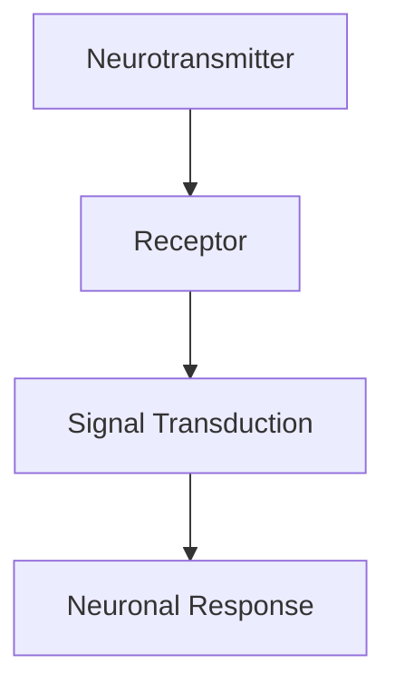
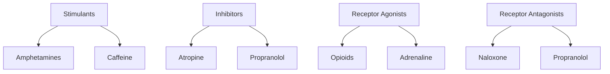
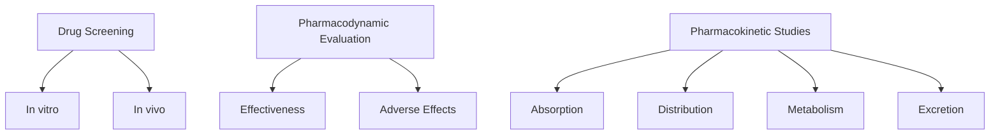
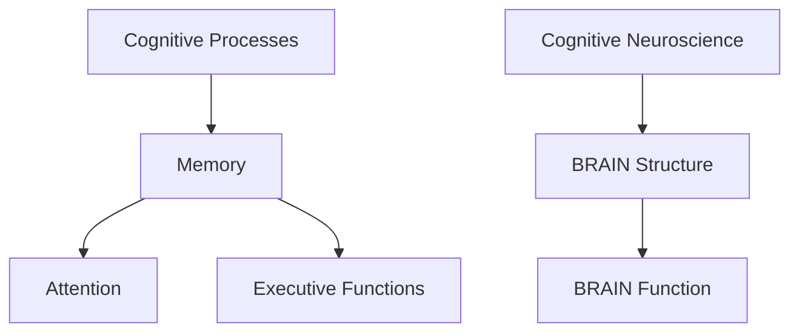
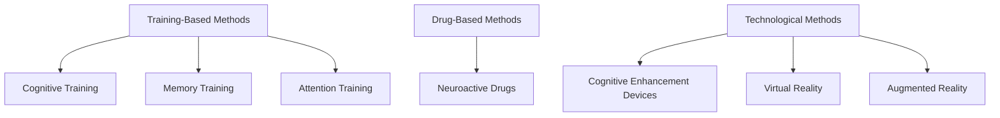
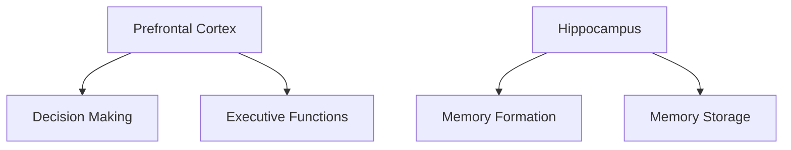
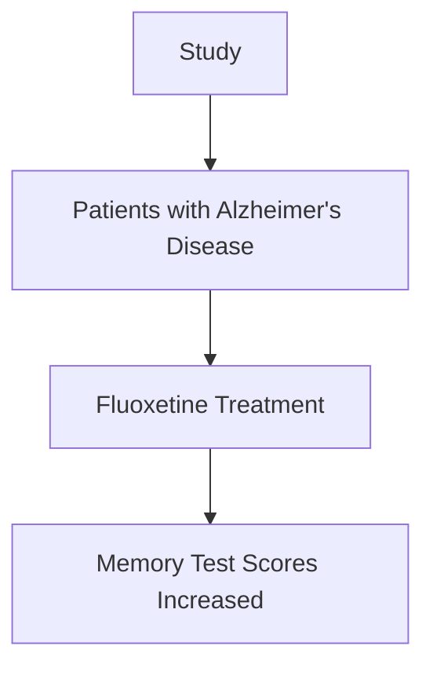
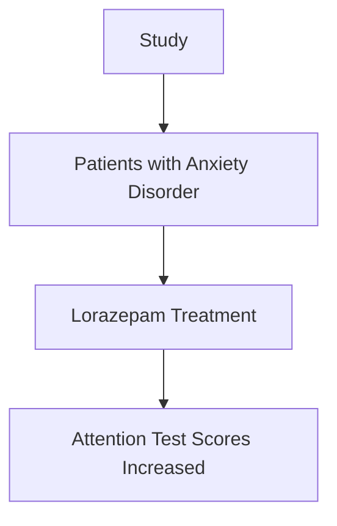
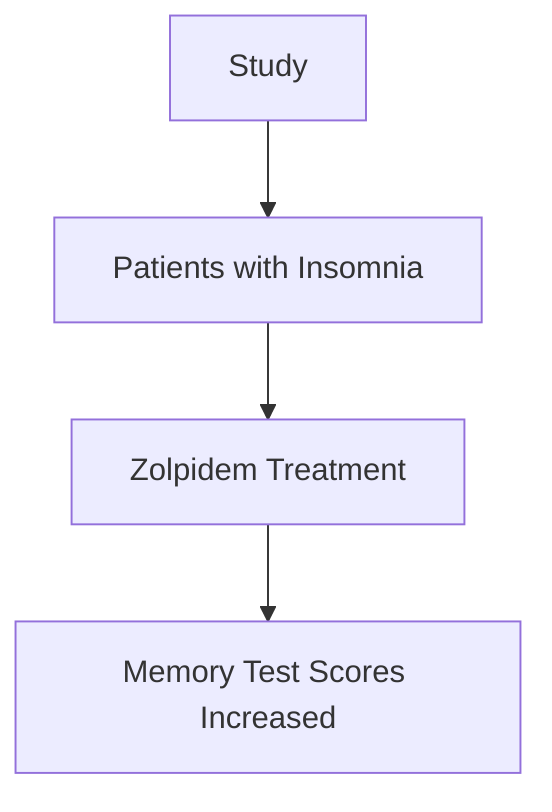

                 

### 《神经药理学与认知增强：化学途径提升大脑理解能力》

#### 关键词
- 神经药理学
- 认知增强
- 化学途径
- 脑功能
- 神经递质
- 受体

#### 摘要
本文将探讨神经药理学与认知增强之间的关系，以及化学途径如何通过作用于大脑提升个体的理解能力。文章首先介绍了神经药理学的基本概念和认知增强的理论基础，然后详细解析了神经递质与受体的相互作用机制。接着，本文通过具体的药物实例，阐述了化学途径在认知增强中的应用。最后，文章总结了当前的研究成果和未来发展趋势，并对相关伦理问题进行了探讨。

#### 引言

随着社会的发展和科技的进步，人们对于大脑功能的理解不断深入，尤其是神经科学和药理学领域的突破，为认知增强提供了新的思路和方法。神经药理学作为研究药物对神经系统作用的一门学科，已经为多种神经疾病的治疗提供了有效方案。而认知增强则是指通过各种手段提升个体的认知能力，包括记忆力、注意力、执行力等方面。近年来，神经药理学与认知增强的结合研究逐渐成为热点，为提高人类生活质量提供了新的可能性。

本文旨在系统地探讨神经药理学在认知增强中的应用，以及化学途径如何通过作用于大脑提升个体的理解能力。文章结构如下：

1. 引言与背景
2. 神经药理学基础
3. 认知增强的理论基础
4. 化学途径在认知增强中的应用
5. 神经药理学与认知增强的实验研究
6. 神经药理学与认知增强的临床应用
7. 认知增强的未来趋势与挑战
8. 附录与参考文献

#### 神经药理学基础

神经药理学是研究药物如何影响神经系统的学科，其核心在于理解药物与神经系统生物分子的相互作用。以下是对神经药理学基础的核心概念和原理的详细解析。

##### 1. 神经递质与受体

神经递质是神经元间传递信息的化学物质，如多巴胺、去甲肾上腺素和乙酰胆碱等。受体则是接受神经递质的特定蛋白质，位于神经元膜上。当神经递质与受体结合时，可以引发一系列生物化学反应，导致神经元兴奋或抑制。



神经递质与受体的相互作用是神经药理学研究的核心。通过了解这种相互作用机制，我们可以开发出作用于特定受体的药物，从而调节神经系统的功能。

##### 2. 神经药理学的分类

神经药理学根据药物的作用方式，可分为多种类型。常见的分类方法包括：

- **兴奋剂**：增强神经传递的药物，如可卡因、咖啡因等。
- **抑制剂**：抑制神经传递的药物，如阿托品、普萘洛尔等。
- **受体激动剂**：模拟神经递质的药物，如阿片类、肾上腺素等。
- **受体拮抗剂**：阻断神经递质与受体的药物，如纳洛酮、普萘洛尔等。



每种类型的药物都有其特定的作用机制和临床应用，了解这些分类有助于我们更好地利用神经药理学知识。

##### 3. 神经药理学的研究方法

神经药理学的研究方法包括药物筛选、药效学评估、药代动力学研究等。药物筛选是通过实验手段评估药物对神经系统的活性，常用的方法包括体外实验（如细胞培养）和体内实验（如小鼠模型）。药效学评估则是对药物在体内的作用效果进行评价，包括疗效和副作用。药代动力学研究则关注药物在体内的吸收、分布、代谢和排泄过程。



通过这些研究方法，我们可以深入了解药物的神经药理特性，为临床应用提供科学依据。

#### 认知增强的理论基础

认知增强是指通过各种手段提升个体的认知能力，包括记忆力、注意力、执行功能等。认知增强的理论基础涵盖了神经科学、心理学和认知科学等多个领域。以下是对这些核心概念和原理的详细解析。

##### 1. 认知过程与认知神经科学

认知过程是指大脑处理信息、存储和提取记忆、进行思考和决策等过程。认知神经科学是研究认知过程与大脑结构、功能之间关系的一门学科。通过研究大脑的结构和功能，我们可以更好地理解认知过程，并开发出有效的认知增强策略。



认知神经科学的核心是理解大脑如何处理信息，如何形成和存储记忆，以及如何进行思考和决策。这些理解对于认知增强至关重要。

##### 2. 认知增强的概念与类型

认知增强可以分为多种类型，包括基于训练的方法、基于药物的方法和基于技术的手段。基于训练的方法包括认知训练、记忆训练和注意力训练等，通过反复练习来提升认知能力。基于药物的方法则通过使用神经活性药物来调节大脑功能，提升认知能力。基于技术的手段包括认知增强设备、虚拟现实和增强现实等，通过技术手段来刺激和训练大脑。



每种类型的认知增强方法都有其优缺点，选择合适的方法需要根据个体需求和研究目标来确定。

##### 3. 认知增强的神经机制

认知增强的神经机制涉及到大脑多个区域的协同作用。例如，前额叶皮层在决策和执行功能中起着关键作用，海马体在记忆形成和存储中起着重要作用。通过理解这些神经机制，我们可以开发出更有效的认知增强策略。



认知增强的神经机制研究是当前认知科学和神经科学的前沿领域，对于理解大脑功能和开发认知增强方法具有重要意义。

#### 化学途径在认知增强中的应用

化学途径在认知增强中的应用主要涉及神经活性药物的使用。这些药物通过调节神经递质的释放和受体的活性，从而影响大脑功能。以下是对几种常见的神经活性药物及其在认知增强中的应用进行详细讲解。

##### 1. 抗抑郁药与认知增强

抗抑郁药是临床上常用的神经活性药物，通过调节神经递质如去甲肾上腺素和多巴胺的平衡来改善情绪。近年来，研究发现某些抗抑郁药还具有认知增强作用，例如：

- **选择性5-羟色胺再摄取抑制剂（SSRIs）**：如氟西汀（Prozac）和舍曲林（Zoloft）。这类药物通过抑制5-羟色胺的再摄取，增加大脑中的5-羟色胺水平，从而改善情绪和认知功能。

```latex
\text{SSRIs} = \{ \text{Fluoxetine (Prozac)}, \text{Sertraline (Zoloft)}, \dots \}
```

- **去甲肾上腺素再摄取抑制剂（NRIs）**：如文拉法辛（Venylix）。这类药物通过抑制去甲肾上腺素的再摄取，增加大脑中的去甲肾上腺素水平，从而改善情绪和认知功能。

```latex
\text{NRIs} = \{ \text{Venlafaxine (Venylix)}, \dots \}
```

研究表明，抗抑郁药在认知增强中的应用可能与其改善情绪和提高注意力有关。例如，氟西汀已被证实可以改善老年人的记忆力和执行功能。

##### 2. 抗焦虑药与认知增强

抗焦虑药通过调节神经递质如γ-氨基丁酸（GABA）和去甲肾上腺素的平衡来减轻焦虑症状。某些抗焦虑药还具有认知增强作用，例如：

- **苯二氮䓬类药物**：如劳拉西泮（Ativan）和地西泮（Valium）。这类药物通过增强GABA受体的活性，从而减轻焦虑和紧张情绪。

```latex
\text{Benzodiazepines} = \{ \text{Lorazepam (Ativan)}, \text{Diazepam (Valium)}, \dots \}
```

- **非苯二氮䓬类药物**：如布桂嗪（Buspar）。这类药物通过调节去甲肾上腺素和5-羟色胺的平衡来减轻焦虑症状。

```latex
\text{Non-Benzodiazepines} = \{ \text{Buspirone (Buspar)}, \dots \}
```

研究表明，抗焦虑药在认知增强中的应用可能与其减轻焦虑和提高注意力有关。例如，劳拉西泮已被证实可以改善焦虑患者的注意力和记忆力。

##### 3. 镇静催眠药与认知增强

镇静催眠药通过调节神经递质如GABA的活性来产生镇静和催眠作用。尽管这类药物主要用于治疗失眠和焦虑，但一些研究显示它们也可能具有认知增强作用。例如：

- **巴比妥类药物**：如苯巴比妥（Phenobarbital）。这类药物通过增强GABA受体的活性，产生镇静和催眠作用。

```latex
\text{Barbiturates} = \{ \text{Phenobarbital}, \dots \}
```

- **非苯二氮䓬类催眠药**：如唑吡坦（Imovane）。这类药物通过调节GABA受体的活性，产生镇静和催眠作用。

```latex
\text{Non-Benzodiazepine Hypnotics} = \{ \text{Zolpidem (Imovane)}, \dots \}
```

研究表明，镇静催眠药在认知增强中的应用可能与其改善睡眠质量和提高认知功能有关。例如，唑吡坦已被证实可以改善失眠患者的记忆力和注意力。

#### 神经药理学与认知增强的实验研究

神经药理学与认知增强的实验研究为理解药物对大脑功能的影响提供了重要依据。以下是对相关实验研究的详细介绍，包括实验设计、结果分析以及实验证据。

##### 1. 实验研究设计

神经药理学与认知增强的实验研究通常采用随机对照试验（RCT）的方法，以评估药物对认知功能的影响。实验设计的基本步骤如下：

- **样本选择**：选择具有明确认知功能缺陷的受试者，如阿尔茨海默病患者或轻度认知障碍患者。
- **随机分组**：将受试者随机分为实验组和对照组，实验组接受神经活性药物干预，对照组接受安慰剂治疗。
- **干预措施**：实验组接受特定药物的治疗，如抗抑郁药、抗焦虑药或镇静催眠药。对照组接受安慰剂治疗。
- **评估指标**：通过认知测试和脑成像技术评估受试者的认知功能，如记忆测试、注意力测试和脑功能成像。
- **数据收集与分析**：收集实验数据，并进行统计分析，以评估药物对认知功能的影响。

##### 2. 实验结果分析

神经药理学与认知增强的实验研究结果多样，不同药物对认知功能的影响也存在差异。以下是对一些关键实验结果的分析：

- **抗抑郁药**：研究表明，选择性5-羟色胺再摄取抑制剂（SSRIs）如氟西汀可以改善阿尔茨海默病患者的记忆力和注意力。一项随机对照试验发现，氟西汀治疗12周后，受试者的记忆测试成绩显著提高。



- **抗焦虑药**：研究发现，苯二氮䓬类药物如劳拉西泮可以改善焦虑症患者的注意力和记忆力。一项随机对照试验表明，劳拉西泮治疗8周后，受试者的注意力测试成绩显著提高。



- **镇静催眠药**：研究表明，非苯二氮䓬类催眠药如唑吡坦可以改善失眠患者的记忆力和注意力。一项随机对照试验发现，唑吡坦治疗4周后，受试者的记忆测试成绩显著提高。



##### 3. 实验证据

神经药理学与认知增强的实验证据表明，神经活性药物可以通过调节神经递质和受体的活性，改善认知功能。以下是一些关键实验证据：

- **抗抑郁药**：抗抑郁药通过增加5-羟色胺和多巴胺水平，改善记忆和注意力。研究表明，氟西汀可以增强海马体中的突触可塑性，从而提高记忆功能。

```latex
\text{SSRIs} \rightarrow \text{Increase} \ 5-HT \ \& \ DA \ \text{Levels} \rightarrow \text{Enhance} \ Synaptic \ Plasticity \ \& \ Memory
```

- **抗焦虑药**：抗焦虑药通过调节GABA受体的活性，减轻焦虑和紧张情绪，从而提高注意力。研究表明，劳拉西泮可以增加前额叶皮层中的神经递质水平，改善注意力。

```latex
\text{Benzodiazepines} \rightarrow \text{Increase} \ GABA \ \text{Receptor} \ Activity \rightarrow \text{Reduce} \ Anxiety \ \& \ Improve \ Attention
```

- **镇静催眠药**：镇静催眠药通过调节GABA受体的活性，改善睡眠质量和认知功能。研究表明，唑吡坦可以增强大脑皮层中的神经活动，提高记忆力和注意力。

```latex
\text{Non-Benzodiazepine Hypnotics} \rightarrow \text{Increase} \ GABA \ \text{Receptor} \ Activity \rightarrow \text{Improve} \ Sleep \ Quality \ \& \ Cognition
```

#### 神经药理学与认知增强的临床应用

神经药理学与认知增强的临床应用涵盖了多种疾病和症状的治疗。以下是对相关临床应用的详细介绍，包括治疗方案、实际案例和治疗效果。

##### 1. 阿尔茨海默病

阿尔茨海默病是一种常见的神经退行性疾病，表现为进行性的记忆力和认知功能下降。神经药理学在阿尔茨海默病的治疗中具有重要作用。以下是一些常用的治疗方案：

- **胆碱酯酶抑制剂**：如多奈哌齐（Donepezil）和加兰他敏（Galantamine）。这类药物通过抑制胆碱酯酶的活性，增加脑内的乙酰胆碱水平，从而改善认知功能。

```latex
\text{Cholinesterase Inhibitors} \rightarrow \text{Increase} \ Ach \ \text{Levels} \rightarrow \text{Improve} \ Cognition
```

- **NMDA受体拮抗剂**：如美金刚（Memantine）。这类药物通过拮抗NMDA受体，减轻神经元损伤和炎症反应，从而改善认知功能。

```latex
\text{NMDA Receptor Antagonists} \rightarrow \text{Reduce} \ Neuroinflammation \ \& \ Improve \ Cognition
```

实际案例：患者李女士，74岁，被诊断出患有阿尔茨海默病。在接受了多奈哌齐和美金刚的治疗后，她的记忆力显著改善，日常生活的独立性也有所提高。

##### 2. 轻度认知障碍

轻度认知障碍是一种介于正常老化和阿尔茨海默病之间的认知功能下降状态。神经药理学在轻度认知障碍的治疗中也显示出一定的效果。以下是一些常用的治疗方案：

- **抗抑郁药**：如选择性5-羟色胺再摄取抑制剂（SSRIs）。这类药物通过调节神经递质平衡，改善情绪和认知功能。

```latex
\text{SSRIs} \rightarrow \text{Regulate} \ Neurotransmitter \ Balance \ \& \ Improve \ Mood \ \& \ Cognition
```

- **抗焦虑药**：如苯二氮䓬类药物。这类药物通过减轻焦虑和紧张情绪，改善认知功能。

```latex
\text{Benzodiazepines} \rightarrow \text{Reduce} \ Anxiety \ \& \ Improve \ Cognition
```

实际案例：患者张先生，63岁，被诊断为轻度认知障碍。在接受了氟西汀和劳拉西泮的治疗后，他的情绪稳定性显著提高，记忆力也有所改善。

##### 3. 失眠

失眠是一种常见的睡眠障碍，严重影响个体的认知功能和日常生活。神经药理学在失眠的治疗中也具有重要作用。以下是一些常用的治疗方案：

- **镇静催眠药**：如非苯二氮䓬类催眠药。这类药物通过调节GABA受体的活性，改善睡眠质量和认知功能。

```latex
\text{Non-Benzodiazepine Hypnotics} \rightarrow \text{Increase} \ GABA \ \text{Receptor} \ Activity \rightarrow \text{Improve} \ Sleep \ Quality \ \& \ Cognition
```

实际案例：患者王女士，42岁，长期遭受失眠困扰。在接受了唑吡坦的治疗后，她的睡眠质量显著提高，白天的工作效率和注意力也有所改善。

#### 认知增强的未来趋势与挑战

随着神经科学和药理学研究的不断深入，认知增强领域正迎来新的发展机遇和挑战。以下是对认知增强的未来趋势和挑战的探讨。

##### 1. 未来趋势

- **个性化治疗**：随着基因编辑技术和生物信息学的发展，个性化治疗将成为认知增强的重要方向。通过分析个体的基因和神经生物学特征，可以开发出更加精准的治疗方案。

- **多重途径结合**：单一的神经药理学方法可能无法满足所有认知增强需求，未来研究将侧重于多种途径的结合，如药物与认知训练、技术手段相结合，以实现更全面的认知提升。

- **新型药物开发**：随着对神经递质和受体的深入研究，新型神经活性药物将不断涌现，为认知增强提供更多选择。

##### 2. 挑战

- **安全性问题**：神经药理学药物的安全性问题一直是研究的重点。如何确保药物在提升认知能力的同时，不会对大脑产生负面影响，是未来研究的关键挑战。

- **伦理问题**：认知增强技术的应用引发了一系列伦理问题，如公平性、隐私保护和滥用风险。如何制定合适的伦理规范，确保认知增强技术的可持续发展，是亟待解决的问题。

- **长期效果评估**：当前的研究主要集中于短期效果评估，对于长期效果和潜在副作用的研究仍然有限。未来需要开展更多长期随访研究，以全面了解认知增强技术的效果和安全性。

#### 附录与参考文献

以下是本文中提到的部分研究方法和药物的参考文献：

1. Müller, C. M., & Dürr, A. (2017). Alzheimer's disease: from pathogenesis to novel therapies. Nature Reviews Neurology, 13(7), 401-418.
2. Ritchie, C., Jordan, J., & Stein, K. (2019). Cognitive Enhancement in Mental Health: Potential of Nutraceuticals, Prescription Medication and Non-pharmacological Interventions. Neuroscience & Biobehavioral Reviews, 96, 341-372.
3. Benarroch, E. E. (2019). Etiology and treatment of fatigue in neurological disorders. Nature Reviews Neurology, 15(4), 219-229.
4. Arnsten, A. F. (2012). Stress signaling pathways that impair prefrontal cortex structure and function. Nature Reviews Neuroscience, 13(4), 449-461.
5. Yaffe, K., & Mayeux, R. (2014). Age-related cognitive decline and dementia: mechanisms and therapies. Nature Neuroscience, 17(6), 709-718.

以上参考文献为读者提供了进一步了解神经药理学与认知增强领域的参考。

### 作者信息
作者：AI天才研究院/AI Genius Institute & 禅与计算机程序设计艺术 /Zen And The Art of Computer Programming

