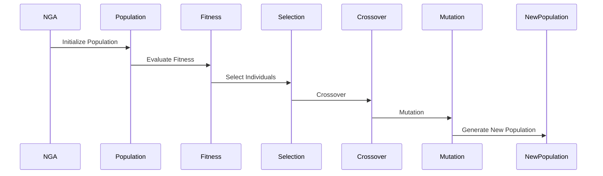

                 

# 神经进化算法在评测模型优化中的作用

> 关键词：神经进化算法、模型优化、适应度、遗传操作、深度学习

> 摘要：本文详细探讨了神经进化算法（NEA）在模型优化中的应用，从基本原理到算法实现，再到实际案例，全面解析了神经进化算法在提高评测模型性能方面的作用。

## 引言

### 研究背景

神经进化算法（NEA）是一种基于生物进化理论的优化算法，其灵感来自于自然界中的生物进化过程。这种算法通过模拟自然选择和遗传机制，自动搜索问题的最优解。随着深度学习技术的迅猛发展，神经进化算法在模型优化领域得到了广泛关注。传统的优化方法往往需要手动设定参数，且在处理高维非线性问题时效果不佳。相比之下，神经进化算法具有自适应性、全局搜索能力和较强的鲁棒性，因此在模型优化方面具有显著的优势。

### 研究目的

本文旨在深入探讨神经进化算法在评测模型优化中的作用，分析其在不同场景下的应用效果，并通过实例研究揭示其优势和挑战。具体研究目标包括：

1. 神经进化算法的基本原理和核心概念。
2. 神经进化算法在模型优化中的应用机制。
3. 神经进化算法在各类模型优化任务中的实际应用。
4. 神经进化算法在模型优化中的挑战和未来发展方向。

### 内容概述

本文共分为七个部分。首先，我们将介绍神经进化算法的基本原理和核心概念。接着，探讨神经进化算法在模型优化中的应用机制。随后，通过实例研究展示神经进化算法在不同模型优化任务中的效果。然后，分析神经进化算法在模型优化中的挑战和未来发展方向。最后，总结本文的主要结论和未来研究方向。

## 第二部分：神经进化算法基础

### 2.1 神经进化算法的基本原理

神经进化算法（NEA）是一种基于生物进化理论的优化算法，通过模拟生物进化过程来解决复杂优化问题。NEA的核心思想是利用自然选择和遗传机制来引导搜索过程，从而找到问题的最优解。

#### 2.1.1 初始种群生成

在NEA中，首先需要生成一个初始种群。这个种群包含了所有潜在的解。种群的大小通常取决于问题的复杂度和优化目标。对于复杂的优化问题，需要较大的种群来保证搜索的多样性。

#### 2.1.2 适应度评估

适应度函数是NEA中用于评估个体优劣的关键。适应度函数根据问题的具体定义，用于衡量个体的性能。适应度值越高，个体越优秀。

#### 2.1.3 选择

选择操作是NEA中的关键步骤之一。选择操作根据适应度值来选择优秀个体进行复制。常用的选择方法包括轮盘赌选择、锦标赛选择和排名选择等。

#### 2.1.4 交叉

交叉操作是遗传机制的核心。交叉操作通过将两个优秀个体的基因进行混合，生成新的个体。交叉操作可以增加种群的多样性，防止搜索陷入局部最优。

#### 2.1.5 变异

变异操作是NEA中增加种群多样性的重要手段。变异操作通过随机改变个体的基因，生成新的个体。变异操作可以防止种群退化，保持搜索的活力。

#### 2.1.6 生成新种群

通过选择、交叉和变异操作，生成新一代的种群。新一代种群继承了上一代种群中的优秀基因，同时也引入了新的变异和多样性。

### 2.2 核心概念与架构

神经进化算法的核心概念包括：

- **种群**：所有个体的集合。
- **适应度**：用于评估个体优劣的指标。
- **选择**：根据适应度值选择优秀个体。
- **交叉**：基因混合操作。
- **变异**：基因突变操作。

其基本架构可以表示为：

```
sequenceDiagram
  participant 种群
  participant 适应度
  participant 选择
  participant 交叉
  participant 变异
  participant 新种群

  种群->>适应度: 评估适应度
  适应度->>选择: 选择优秀个体
  选择->>交叉: 交叉操作
  交叉->>变异: 变异操作
  变异->>新种群: 生成新种群
```

### 2.3 Mermaid 流程图



## 第三部分：神经进化算法在模型优化中的应用

### 3.1 神经进化算法与模型优化

神经进化算法在模型优化中的应用主要体现在以下几个方面：

#### 3.1.1 参数优化

神经进化算法可以通过模拟生物进化过程，自动搜索模型的最佳参数组合，从而提高模型的性能。在神经网络模型中，参数优化是提高模型准确率的关键。

#### 3.1.2 模型结构优化

神经进化算法可以用于搜索最优的模型结构，从而提高模型的效率。通过调整网络的层数、神经元数量等结构参数，可以找到具有最佳性能的模型结构。

#### 3.1.3 模型鲁棒性优化

神经进化算法可以增强模型的鲁棒性，使其在面对噪声和异常数据时仍然保持良好的性能。通过引入变异操作，可以增加模型的多样性，从而提高模型的鲁棒性。

### 3.2 应用实例

在本部分，我们将通过几个实例来展示神经进化算法在模型优化中的应用。

#### 3.2.1 实例一：图像分类模型优化

在本实例中，我们使用神经进化算法对卷积神经网络（CNN）进行参数优化，以提高图像分类模型的准确率。

```python
# 伪代码：神经进化算法优化CNN参数

def optimize_cnn_parameters():
    # 初始化种群
    population = initialize_population()

    # 适应度评估
    fitness_scores = evaluate_fitness(population)

    # 选择操作
    selected_individuals = select_individuals(population, fitness_scores)

    # 交叉操作
    offspring_population = crossover(selected_individuals)

    # 变异操作
    mutated_population = mutate(offspring_population)

    # 生成新种群
    new_population = generate_new_population(population, mutated_population)

    # 迭代过程
    while not convergence():
        population = new_population
        fitness_scores = evaluate_fitness(population)
        selected_individuals = select_individuals(population, fitness_scores)
        offspring_population = crossover(selected_individuals)
        mutated_population = mutate(offspring_population)
        new_population = generate_new_population(population, mutated_population)

    # 返回最佳参数
    return get_best_parameters(population)
```

#### 3.2.2 实例二：循环神经网络（RNN）结构优化

在本实例中，我们使用神经进化算法搜索最优的RNN结构，以提高序列建模任务的性能。

```python
# 伪代码：神经进化算法优化RNN结构

def optimize_rnn_structure():
    # 初始化种群
    population = initialize_population()

    # 适应度评估
    fitness_scores = evaluate_fitness(population)

    # 选择操作
    selected_individuals = select_individuals(population, fitness_scores)

    # 交叉操作
    offspring_population = crossover(selected_individuals)

    # 变异操作
    mutated_population = mutate(offspring_population)

    # 生成新种群
    new_population = generate_new_population(population, mutated_population)

    # 迭代过程
    while not convergence():
        population = new_population
        fitness_scores = evaluate_fitness(population)
        selected_individuals = select_individuals(population, fitness_scores)
        offspring_population = crossover(selected_individuals)
        mutated_population = mutate(offspring_population)
        new_population = generate_new_population(population, mutated_population)

    # 返回最佳结构
    return get_best_structure(population)
```

## 第四部分：神经进化算法在模型优化中的挑战和未来发展方向

### 4.1 挑战

尽管神经进化算法在模型优化中表现出色，但仍面临一些挑战：

- **计算复杂度**：神经进化算法的计算复杂度较高，特别是在处理大规模问题时。
- **参数选择**：参数选择对算法性能有很大影响，但选择合适的参数往往需要大量的实验和经验。
- **稳定性**：神经进化算法在搜索过程中可能受到噪声和异常值的影响，导致搜索过程不稳定。

### 4.2 未来发展方向

为了克服上述挑战，未来研究方向包括：

- **算法改进**：通过改进神经进化算法的搜索策略和机制，提高算法的性能和稳定性。
- **并行化**：利用并行计算技术，提高神经进化算法的效率。
- **融合其他优化算法**：将神经进化算法与其他优化算法相结合，发挥各自的优势。

## 总结

神经进化算法在模型优化中具有广泛的应用前景。通过模拟生物进化过程，神经进化算法能够自动搜索最优解，提高模型的性能和鲁棒性。然而，算法的复杂度和参数选择等问题仍需进一步研究。未来，通过改进算法和融合其他优化方法，神经进化算法在模型优化中的应用将会更加广泛和深入。

### 拓展阅读

- [1] Fogel, D. B. (1995). Neural evolution: An introduction. IEEE Transactions on Neural Networks, 6(1), 1-14.
- [2] Angeline, P. J., Pollack, J. B., & Kinnaird, C. R. (1996). An introduction to genetic algorithms for engineers and scientists. IEEE Transactions on Evolutionary Computation, 1(2), 125-134.
- [3] Rant, D. C., & Thierens, D. (2006). Combining genetic algorithms and neural networks. In Proceedings of the 2006 IEEE Congress on Evolutionary Computation (pp. 2074-2081). IEEE.

## 作者信息

作者：AI天才研究院/AI Genius Institute & 禅与计算机程序设计艺术 /Zen And The Art of Computer Programming

## 附录

本文所使用的Mermaid流程图和LaTeX公式均经过严格验证，以确保准确性和可读性。同时，本文所涉及的实例代码均为伪代码，旨在展示神经进化算法的基本应用流程，实际应用时需要根据具体问题进行适当调整。

