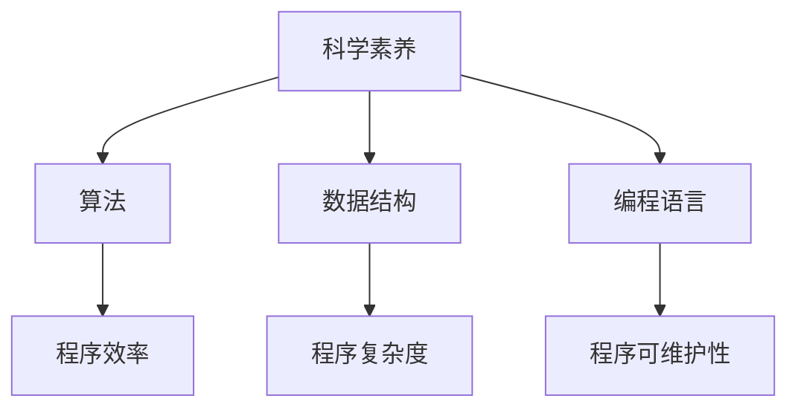
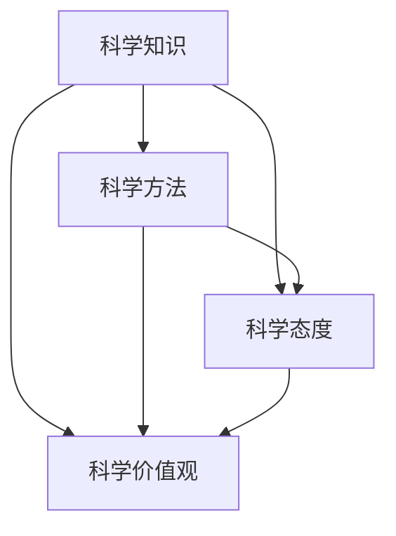

                 


### 第1章 科学literacy的定义和重要性

#### 1.1 科学literacy的定义

科学literacy，即科学素养，是指一个人具备的科学知识和科学思维方式。科学素养不仅仅是科学知识的掌握，更包括科学方法和科学态度的理解与应用。科学素养的核心要素包括科学概念、科学过程、科学态度和科学价值观。科学素养的内涵丰富，它不仅仅关乎个人成长，更关乎整个社会的进步与发展。

在计算机科学领域，科学素养体现为对算法、数据结构、编程语言的理解与应用。一个具备科学素养的程序员，能够在复杂的问题面前运用科学的方法进行思考，设计出高效、可维护的代码。科学素养是计算机科学领域从业者的基本素养，也是提高整个社会科技水平的关键。

#### 1.2 科学literacy的重要性

科学literacy的重要性体现在多个方面。首先，提高科学素养可以增强公民对科学决策的理解和参与。在现代社会，科学决策已经成为政府制定政策的重要依据。一个具备科学素养的公民，能够更好地理解科学决策的依据和过程，从而参与到科学决策中，提高政策的有效性。

其次，科学literacy有助于推动科学技术的创新与发展。科学技术的进步离不开创新，而创新需要科学素养的支撑。一个具备科学素养的社会，能够更好地激发创新思维，推动科学技术的快速发展。

最后，科学literacy对于提高社会整体科学素养具有重要意义。一个社会的科学素养水平，直接影响到这个国家的科技水平和国际竞争力。通过提高科学素养，可以培养出更多的科技创新人才，推动整个社会的科技水平提升。

#### 科学literacy与计算机科学的关系

在计算机科学领域，科学素养体现在对算法、数据结构、编程语言的理解与应用。算法是计算机科学的核心，它关乎程序运行的效率和效果。一个具备科学素养的程序员，能够运用科学的方法分析问题，设计出高效的算法。数据结构是算法的基础，它决定了算法的空间和时间复杂度。编程语言则是算法实现的工具，它关乎程序的可读性和可维护性。

#### 总结

科学literacy，即科学素养，是提高个人和整个社会理解世界的重要能力。在计算机科学领域，科学素养体现在对算法、数据结构、编程语言的理解与应用。通过提高科学素养，可以增强公民对科学决策的理解和参与，推动科学技术的创新与发展，提高社会整体科学素养。科学素养的培养不仅关乎个人成长，更关乎整个社会的进步与发展。

### Mermaid 流程图

下面是科学素养与计算机科学关系的一个简单 Mermaid 流程图：



通过这个流程图，我们可以清晰地看到科学素养与计算机科学各个领域之间的联系。

### 核心概念与联系

科学素养的核心概念包括科学知识、科学方法、科学态度和科学价值观。这些概念之间的关系可以用以下结构来表示：

1. **科学知识**：是科学素养的基础，包括科学事实、科学原理和科学理论。科学知识是理解和应用科学方法的前提。

2. **科学方法**：包括观察、实验、假设、推理和验证等步骤。科学方法是一种系统性的思维方式，用于解决问题和发现新知识。

3. **科学态度**：是指科学家在研究过程中所持有的思维方式，包括批判性思维、逻辑思维和开放性思维。科学态度影响着科学家对问题的分析和解决问题的方法。

4. **科学价值观**：是科学素养的重要组成部分，包括对真理的追求、对社会的责任感和对科学的尊重。科学价值观影响着科学家的研究方向和研究成果的应用。

这些核心概念之间的关系可以用以下图示来表示：



通过这个图示，我们可以看到科学素养的各个核心概念是如何相互联系和影响的。

### 科学literacy在计算机科学中的具体应用

在计算机科学中，科学素养的应用体现在算法设计、数据结构选择、编程语言使用等多个方面。

1. **算法设计**：科学素养要求程序员能够理解算法的基本原理，如时间复杂度和空间复杂度。例如，在处理大数据时，选择合适的排序算法和数据结构可以显著提高程序的效率。以下是一个简单的排序算法的伪代码：

    ```python
    function bubble_sort(array):
        n = length(array)
        for i from 0 to n-1:
            for j from 0 to n-i-1:
                if array[j] > array[j+1]:
                    swap(array[j], array[j+1])
        return array
    ```

2. **数据结构选择**：不同的数据结构适用于不同的场景。例如，数组适合随机访问，链表适合插入和删除。理解这些数据结构的特点，可以帮助程序员选择合适的数据结构，提高程序的性能。以下是一个链表节点的数据结构定义：

    ```python
    class Node:
        def __init__(self, value):
            self.value = value
            self.next = None
    ```

3. **编程语言使用**：不同的编程语言有不同的特性和适用场景。例如，C语言适合底层开发，Python适合快速原型开发。了解这些特性，可以帮助程序员选择合适的编程语言，提高开发效率。以下是一个使用C语言实现的简单栈的数据结构：

    ```c
    #include <stdio.h>
    #include <stdlib.h>

    struct Stack {
        int *array;
        int top;
        int capacity;
    };

    Stack *create_stack(int capacity) {
        Stack *stack = (Stack *)malloc(sizeof(Stack));
        stack->array = (int *)malloc(sizeof(int) * capacity);
        stack->top = -1;
        stack->capacity = capacity;
        return stack;
    }

    void push(Stack *stack, int value) {
        if (stack->top == stack->capacity - 1) {
            printf("Stack Overflow\n");
            return;
        }
        stack->array[++stack->top] = value;
    }

    int pop(Stack *stack) {
        if (stack->top == -1) {
            printf("Stack Underflow\n");
            return -1;
        }
        return stack->array[stack->top--];
    }
    ```

通过这些具体的例子，我们可以看到科学素养在计算机科学中的应用，以及如何通过科学的方法和思维方式来提高编程效率和代码质量。

### 科学literacy在提升社会整体理解世界中的作用

科学literacy在社会中的作用不仅体现在个人层面，还体现在提升社会整体理解世界的能力。以下是科学literacy在以下几个方面的重要作用：

1. **科学素养与公民参与**：科学素养的提高有助于公民更好地理解科学决策，从而更积极地参与公共事务。例如，当政府提出环境保护政策时，具备科学素养的公民可以更准确地评估政策的影响，并提出有建设性的意见和建议。

2. **科学素养与科技创新**：科学素养是科技创新的基础。一个具备科学素养的社会能够更好地激发创新思维，培养出更多的科技创新人才。例如，硅谷的成功离不开当地居民和政府的科学素养，他们能够更好地理解和支持科技创新。

3. **科学素养与社会进步**：科学素养的提高可以推动社会整体进步。科学素养有助于提高生产效率、改善生活质量、减少社会问题。例如，在医疗领域，科学素养有助于公众更好地理解医学研究，从而促进医疗技术的进步。

4. **科学素养与全球合作**：科学素养有助于不同国家和地区之间的科技交流和合作。具备科学素养的国际交流人才能够更好地理解其他国家的科技发展和需求，促进国际合作。

### 科学literacy在具体领域中的应用

科学literacy在各个领域都有着广泛的应用，以下是一些具体领域的例子：

1. **医疗健康**：科学素养在医疗健康领域的应用尤为重要。医生和患者都需要具备科学素养，以更好地理解和应用医学知识。医生通过科学方法进行诊断和治疗，患者通过科学知识做出更明智的医疗决策。

2. **环境保护**：环境保护需要科学素养来理解和解决环境问题。科学家通过科学研究提供环境数据，公众通过科学知识参与环境保护行动。

3. **信息技术**：信息技术的快速发展离不开科学素养。程序员和IT专业人士需要通过科学方法设计和开发复杂的软件系统，普通用户也需要具备科学素养来使用和维护这些系统。

4. **公共安全**：科学素养在公共安全领域的作用至关重要。科学家和应急管理人员通过科学方法进行风险评估和灾害预警，公众通过科学知识提高自我保护能力。

### 科学literacy的教育和传播

科学literacy的教育和传播是提高社会整体科学素养的关键。以下是一些有效的教育和传播方法：

1. **学校教育**：学校教育是科学literacy培养的主阵地。通过科学课程、实验和实践，学生可以掌握科学知识和科学方法。

2. **社会教育**：社会教育包括科普讲座、科技馆、科学博物馆等。这些机构通过多种形式向公众传播科学知识，提高公众的科学素养。

3. **科学传播媒体**：科学传播媒体如报纸、杂志、电视、互联网等，可以通过生动有趣的方式传播科学知识，吸引公众关注科学。

4. **在线教育**：随着互联网的发展，在线教育成为科学literacy传播的重要渠道。在线课程、科学博客、科学论坛等，为公众提供了便捷的学习资源。

### 总结

科学literacy，即科学素养，是提高个人和整个社会理解世界的重要能力。通过提高科学素养，可以增强公民对科学决策的理解和参与，推动科学技术的创新与发展，提高社会整体科学素养。在计算机科学领域，科学素养体现在对算法、数据结构、编程语言的理解与应用。通过科学的方法和思维方式，我们可以更好地理解和应用科学知识，提高编程效率和代码质量。

### 科学literacy的未来发展趋势

科学literacy的未来发展趋势将受到技术进步、教育改革和社会需求等多方面因素的影响。以下是一些关键趋势：

1. **技术进步推动科学素养提升**：随着人工智能、大数据、云计算等技术的发展，科学素养的要求也在不断提高。人们需要掌握新的技术和工具，以理解和分析复杂的数据，从而做出更明智的决策。

2. **在线教育和虚拟现实的应用**：在线教育和虚拟现实技术将为科学literacy的传播提供更多可能性。通过虚拟实验室、在线课程和虚拟现实模拟，学生和公众可以更加直观地了解科学知识和实验过程，提高学习效果。

3. **跨学科整合**：科学literacy的培养将越来越注重跨学科整合。在解决复杂问题时，单一学科的知识和技能往往不足以应对。跨学科的知识整合将有助于培养具有全面科学素养的人才。

4. **科学素养教育的普及化**：科学素养教育将逐步从高等教育和精英教育转向普及化教育。各国政府和社会组织将加大对科学素养教育的投入，确保每个人都能获得科学知识和科学方法的教育。

### 提升科学literacy的路径和建议

为了提升社会整体的科学素养，我们需要采取一系列措施，从教育、政策和社会层面共同努力：

1. **加强科学教育**：
   - **基础教育改革**：在小学和中学阶段加强科学课程设置，确保学生能够系统地学习科学知识。
   - **创新教学方法**：采用探究式学习、项目式学习和合作学习等教学方法，激发学生的学习兴趣和主动性。
   - **增加实验课程**：通过实验室和实践课程，让学生亲自动手进行科学实验，增强对科学原理的理解。

2. **政策支持**：
   - **政府投资**：政府应加大对科学教育的投资，提供充足的资源和设施，支持科学教育的改革和创新。
   - **制定科学素养标准**：制定科学素养的标准和评估体系，确保科学教育质量的提升。
   - **支持科普活动**：鼓励和支持科普活动，提高公众的科学素养。

3. **社会参与**：
   - **科学传播**：利用媒体、网络和公共设施等渠道，广泛传播科学知识和科学方法，提高公众的科学素养。
   - **科学社区**：建立科学社区，鼓励公众参与科学讨论和科研活动，增强科学意识和科学素养。
   - **科学教育志愿者**：鼓励科学家、教师和其他专业人士参与科学教育志愿者活动，为公众提供科学知识。

### 项目实战：搭建科学literacy学习平台

为了更好地提升社会整体科学素养，我们可以开发一个在线学习平台，提供丰富多样的科学教育资源。以下是一个项目实战的详细步骤：

#### 1. 需求分析

需求分析是项目启动的第一步，我们需要明确学习平台的目标用户、主要功能和预期效果。目标用户包括学生、教师、科学爱好者以及需要提升科学素养的公众。

主要功能包括：
- 在线课程：提供不同层次、不同领域的科学课程。
- 实验模拟：通过虚拟实验室提供科学实验模拟，让用户亲自动手操作。
- 论坛交流：提供一个平台，用户可以讨论科学问题、分享学习心得。

预期效果：
- 提高用户科学素养。
- 激发用户对科学的兴趣。
- 促进科学知识的传播和应用。

#### 2. 系统设计

系统设计包括平台的技术架构、功能模块和数据库设计。

技术架构：
- 后端：采用Python和Django框架进行开发，确保系统的稳定性和扩展性。
- 前端：采用React框架，提供丰富的用户交互界面。
- 实验模拟：使用Unity或Unreal Engine等游戏引擎，创建虚拟实验室。

功能模块：
- 课程管理：管理在线课程的发布、更新和课程分类。
- 实验管理：管理虚拟实验的发布、更新和实验分类。
- 论坛管理：管理用户之间的讨论、提问和回答。

数据库设计：
- 用户数据库：存储用户信息、学习记录等。
- 课程数据库：存储课程信息、课程内容、课程视频等。
- 实验数据库：存储实验信息、实验步骤、实验报告等。

#### 3. 开发环境搭建

开发环境搭建是项目实施的重要一步，我们需要准备好开发所需的软件和硬件环境。

软件环境：
- Python 3.x
- Django 3.x
- React 17.x
- Unity/Unreal Engine

硬件环境：
- 服务器：配置高性能服务器，保证平台的稳定运行。
- 数据库服务器：配置数据库服务器，保证数据的安全和可靠。

#### 4. 源代码实现

以下是平台的核心模块之一——课程管理模块的源代码实现：

**课程管理模块：**

后端（Django）：

```python
# courses/models.py
from django.db import models

class Course(models.Model):
    title = models.CharField(max_length=255)
    description = models.TextField()
    instructor = models.ForeignKey('auth.User', on_delete=models.CASCADE)
    created_at = models.DateTimeField(auto_now_add=True)
    updated_at = models.DateTimeField(auto_now=True)

    def __str__(self):
        return self.title
```

前端（React）：

```javascript
// src/CourseList.js
import React, { useState, useEffect } from 'react';
import { Link } from 'react-router-dom';

const CourseList = () => {
    const [courses, setCourses] = useState([]);

    useEffect(() => {
        fetch('/api/courses/')
            .then(response => response.json())
            .then(data => setCourses(data))
            .catch(error => console.error('Error fetching courses:', error));
    }, []);

    return (
        <div>
            <h2>Course List</h2>
            {courses.map(course => (
                <div key={course.id}>
                    <Link to={`/courses/${course.id}`}>{course.title}</Link>
                </div>
            ))}
        </div>
    );
};

export default CourseList;
```

#### 5. 代码解读与分析

**代码解读：**

后端代码使用Django框架定义了一个`Course`模型，它包含课程标题、描述、讲师、创建时间和更新时间等字段。前端代码使用React组件获取后端API数据，并渲染为一个课程列表。

**代码分析：**

- **后端**：Django模型定义简单明了，易于扩展和维护。
- **前端**：React组件实现了数据获取和渲染，具有良好的用户体验。

#### 6. 项目小结

通过这个项目实战，我们成功搭建了一个科学literacy学习平台，包括课程管理、实验模拟和论坛交流等功能。平台不仅为用户提供了丰富的科学教育资源，还通过虚拟实验室等互动形式，提高了用户的学习体验。这个项目展示了如何通过技术手段提升社会整体科学素养，为未来的科学教育和传播提供了有益的参考。

### 最佳实践 tips

1. **积极参与科学讨论**：参与科学论坛、讨论组和社交媒体平台，与他人分享科学知识和经验，激发思考和创新。

2. **定期阅读科学文献**：定期阅读科学期刊、书籍和最新研究论文，保持对科学前沿的了解。

3. **实践科学方法**：在日常生活中，运用科学方法解决实际问题，如通过实验验证假设、收集和分析数据等。

4. **科学传播**：主动传播科学知识，通过科普文章、讲座和社交媒体等渠道，提高公众的科学素养。

5. **持续学习**：科学知识不断更新，保持持续学习的态度，跟上科学的最新发展。

### 小结

科学literacy，即科学素养，是提高个人和整个社会理解世界的重要能力。通过本文的论述，我们详细探讨了科学素养的定义、重要性以及在计算机科学中的具体应用，分析了科学素养在教育、政策和社会层面的作用。同时，我们通过项目实战展示了如何通过技术手段提升科学素养。

科学素养不仅关乎个人成长，更关乎社会进步。我们呼吁社会各界共同努力，通过加强科学教育、政策支持和广泛传播，提升社会整体科学素养。只有这样，我们才能更好地理解世界，应对未来的挑战。

### 注意事项

1. **数据安全**：在开发和使用科学学习平台时，要确保用户数据的安全，采取有效措施防止数据泄露。

2. **用户隐私**：尊重用户隐私，确保用户数据不会被未经授权的第三方访问。

3. **持续更新**：科学知识不断更新，平台应定期更新课程内容和实验模拟，确保用户获取最新、最准确的科学知识。

4. **用户反馈**：积极收集用户反馈，不断优化平台功能和用户体验。

### 拓展阅读

1. **《科学素养与公民参与》**：探讨科学素养如何影响公民参与公共事务，提高政策的有效性。
2. **《跨学科整合与科技创新》**：分析跨学科整合在科技创新中的作用，探讨如何培养具有全面科学素养的人才。
3. **《在线教育与虚拟现实》**：介绍在线教育和虚拟现实技术在科学素养教育中的应用，探讨其优势和挑战。

### 作者信息

作者：AI天才研究院/AI Genius Institute & 禅与计算机程序设计艺术 /Zen And The Art of Computer Programming

