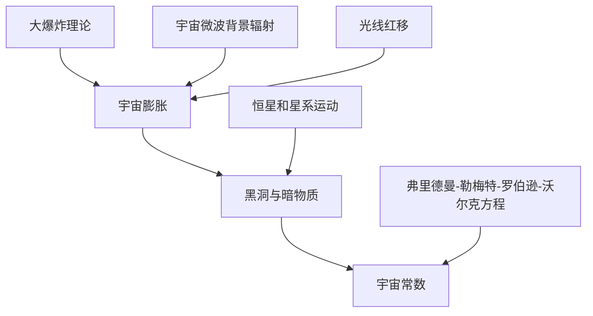
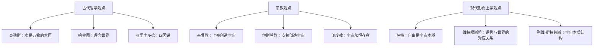
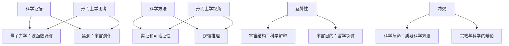

                 

### 文章标题

《科学与形而上学的交汇：宇宙本质之辩》

### 关键词

科学、形而上学、宇宙本质、哲学、科学哲学、科学方法论

### 摘要

本文旨在探讨科学与形而上学的交汇，特别是在宇宙本质问题上的辩论。通过对科学和形而上学的概念、历史、以及两者在宇宙起源和本质问题上的观点进行详细分析，本文试图揭示它们之间的互补与冲突。同时，本文还将探讨科学与形而上学的交汇点，并展望其未来的发展方向。通过本文的阅读，读者将更好地理解科学与形而上学的深层次关系，以及它们对人类认识宇宙的重要性。

---

### 引言

在人类的认知历程中，科学与形而上学始终是两颗璀璨的星辰。科学，作为人类对自然界规律的探究，以其严谨的方法和可验证的理论，逐渐成为现代社会的主要思维方式。形而上学，则是对存在、本质和终极原因的追问，它往往超越经验，触及人类心灵的深处。两者看似截然不同，却在宇宙本质问题上产生了深刻的交汇。

科学和形而上学的交汇不仅体现在哲学领域，更在宇宙起源和本质的研究中得到了充分的体现。从古代哲学家对宇宙本源的思考，到现代科学家对宇宙结构的探索，两者之间的对话从未停止。然而，这种对话并非总是一帆风顺，科学的方法论与形而上学的直觉思维常常产生冲突，导致对宇宙本质的不同解读。

本文将深入探讨科学与形而上学的交汇，特别是它们在宇宙本质问题上的辩论。通过分析两者的概念、历史以及宇宙起源和本质的科学观点与形而上学观点，本文试图揭示这两者在理论层面和实践层面上的互补与冲突。最终，本文将探讨科学与形而上学的未来展望，探讨它们在宇宙认知中的重要作用。

### 科学与形而上学的概念与历史

科学和形而上学作为两种截然不同的思维方式，它们的概念和起源可以追溯到人类文明的早期阶段。

科学，通常被定义为一种基于观察、实验和数学建模的方法，用以揭示自然界的基本规律。科学的起源可以追溯到古希腊时期，当时的哲学家如亚里士多德，通过观察和逻辑推理，试图解释自然现象。然而，科学的真正发展始于中世纪后期，特别是文艺复兴时期，这一时期的人们开始通过实验和观察来验证理论，从而形成了现代科学的基础。牛顿的经典力学、达尔文的进化论、爱因斯坦的相对论，都是科学历史上的重要里程碑。

形而上学，则是对存在、本质和终极原因的哲学探讨。它试图回答关于宇宙、人类和存在的根本问题。形而上学的起源可以追溯到古希腊的哲学家泰勒斯，他提出了“水是万物的本原”的观点。随后，柏拉图和亚里士多德等哲学家进一步发展了形而上学的思想，认为宇宙有一个超越经验的本质或形式。中世纪的基督教哲学家如托马斯·阿奎那，将形而上学与神学相结合，试图为宗教信仰提供哲学基础。

在历史上，科学与形而上学之间的关系经历了多次变迁。在古代，科学与形而上学往往是交织在一起的。哲学家既是科学家，也是形而上学家。然而，随着科学的逐渐独立和发展，科学方法与形而上学的直觉思维产生了冲突。科学强调实证和可验证性，而形而上学则倾向于超越经验和直觉。这种冲突在17世纪的科学革命中达到顶峰，当时的科学家如伽利略和牛顿，开始质疑形而上学的地位，推动了科学方法的普及。

尽管科学与形而上学在方法上存在差异，但它们在宇宙本质问题上的探讨却是互补的。科学通过实验和观察，揭示了宇宙的结构和运行规律；形而上学则通过哲学思考和推理，探讨了宇宙的根本原因和本质。例如，科学揭示了宇宙的膨胀和黑洞的存在，而形而上学则提出了关于宇宙起源和目的的哲学思考。

总之，科学和形而上学的概念与历史表明，它们在宇宙本质问题上的探讨既存在冲突，又有互补。理解这两者之间的关系，有助于我们更全面地认识宇宙的本质。

### 宇宙起源与本质的科学观点

宇宙起源和本质的问题一直是科学家和哲学家关注的核心议题。在科学领域，科学家们通过观察、实验和理论建模，提出了一系列关于宇宙起源和本质的假设和理论。以下将介绍几种主要的科学观点，包括大爆炸理论、黑洞与暗物质、宇宙膨胀与宇宙常数等。

#### 大爆炸理论

大爆炸理论是目前宇宙学中最被广泛接受的理论之一。它认为，宇宙起源于大约138亿年前的一个“奇点”，在这个奇点中，所有的物质和能量都高度密集和高温。随后，宇宙开始迅速膨胀和冷却，形成了我们今天所看到的宇宙结构。

大爆炸理论的重要证据包括宇宙微波背景辐射和宇宙的膨胀速度。宇宙微波背景辐射是宇宙早期高温状态留下的余辉，它在大爆炸后的几百万年内形成。宇宙膨胀速度的证据则来自于宇宙中的恒星和星系运动。通过测量这些运动，科学家发现宇宙正在加速膨胀。

#### 黑洞与暗物质

黑洞是宇宙中一种极为密集的天体，它的引力场极强，甚至连光都无法逃脱。黑洞的存在可以通过恒星系统的运动和恒星光谱的红移来观测。此外，科学家还发现了暗物质的存在，它不发光，但通过引力效应影响宇宙的结构。暗物质被认为是宇宙中的一种神秘物质，其具体性质和组成尚未完全了解。

#### 宇宙膨胀与宇宙常数

宇宙膨胀是指宇宙中的物质和空间随着时间的推移而逐渐扩大的现象。宇宙膨胀的证据来自于宇宙中的光线红移，即宇宙中的恒星和星系的光线波长在远离我们时变长。这一现象表明，宇宙正在膨胀。

宇宙常数则是一个描述宇宙膨胀速率的物理量，它通常被表示为一个正的常数。宇宙常数与宇宙膨胀的关系可以通过弗里德曼-勒梅特-罗伯逊-沃尔克方程（Friedmann-Lemaître-Robertson-Walker equation）来描述。这个方程揭示了宇宙膨胀与宇宙常数之间的关系，为宇宙学提供了重要的理论工具。

#### 核心概念与联系梅尔图流程图

为了更好地理解这些科学观点之间的关系，我们可以使用梅尔图（Mermaid）流程图来展示它们的核心概念和联系。以下是一个简单的梅尔图流程图示例：



在这个流程图中，大爆炸理论作为宇宙起源的起点，引发了宇宙膨胀、黑洞与暗物质以及宇宙常数的产生。宇宙微波背景辐射、恒星和星系运动、光线红移和弗里德曼-勒梅特-罗伯逊-沃尔克方程则是这些科学观点的重要证据和理论工具。

#### 核心算法原理讲解伪代码

为了进一步阐述宇宙起源和本质的科学观点，我们可以使用伪代码来描述核心算法原理。以下是一个简单的伪代码示例：

```python
def big_bang_theory():
    # 初始化奇点状态
    initial_state = create_initial_state()
    # 宇宙迅速膨胀
    expand_universe(initial_state)
    # 宇宙冷却形成结构
    form_cosmic_structure()

def universe_expansion():
    # 测量恒星和星系的光线红移
    measure_redshift()
    # 计算宇宙膨胀速率
    calculate_expansion_rate()

def black_holes_and_dark_matter():
    # 观测恒星系统的运动
    observe_solar_system_motion()
    # 推测暗物质的存在
    infer_dark_matter()

def cosmological_constant():
    # 使用弗里德曼-勒梅特-罗伯逊-沃尔克方程
    use_friedmann_equation()
    # 计算宇宙常数
    calculate_cosmological_constant()
```

在这个伪代码中，`big_bang_theory()` 函数描述了大爆炸理论的基本过程，包括宇宙的迅速膨胀和冷却形成结构。`universe_expansion()` 函数描述了宇宙膨胀的测量和计算方法。`black_holes_and_dark_matter()` 函数描述了黑洞和暗物质的存在和推测方法。`cosmological_constant()` 函数描述了使用弗里德曼-勒梅特-罗伯逊-沃尔克方程计算宇宙常数的方法。

#### 数学模型和数学公式详细讲解举例说明

在宇宙起源和本质的研究中，数学模型和公式起着至关重要的作用。以下将介绍一些关键的数学模型和公式，并使用LaTeX格式进行详细讲解。

首先，大爆炸理论中的关键公式是弗里德曼-勒梅特-罗伯逊-沃尔克方程（Friedmann-Lemaître-Robertson-Walker equation），它描述了宇宙膨胀的速率：

$$
H(t) = \frac{\dot{a}(t)}{a(t)}
$$

其中，$H(t)$ 是宇宙膨胀率，$\dot{a}(t)$ 是宇宙尺度因子 $a(t)$ 的变化率。

宇宙膨胀速率可以通过测量光线红移来确定，其公式为：

$$
z = \frac{\lambda_{\text{obs}} - \lambda_{\text{em}}}{\lambda_{\text{em}}}
$$

其中，$z$ 是红移量，$\lambda_{\text{obs}}$ 是观测到的光线波长，$\lambda_{\text{em}}$ 是发射时的光线波长。

黑洞的存在可以通过克鲁斯卡尔-塞莱斯基（Kruskal-Szekeres）坐标来描述，其公式为：

$$
ds^2 = -\left(1 - \frac{2M}{r}\right)dt^2 + \frac{1}{1 - \frac{2M}{r}}dr^2 - r^2(d\theta^2 + \sin^2\theta d\phi^2)
$$

其中，$ds^2$ 是间隔度，$M$ 是黑洞的质量，$r$ 是事件视界半径。

宇宙常数可以通过爱因斯坦场方程（Einstein's field equation）来描述：

$$
R_{\mu\nu} - \frac{1}{2}Rg_{\mu\nu} = \kappa T_{\mu\nu}
$$

其中，$R_{\mu\nu}$ 是里奇张量，$R$ 是里奇标量，$g_{\mu\nu}$ 是度规张量，$T_{\mu\nu}$ 是能量-动量张量，$\kappa$ 是宇宙常数。

通过这些数学模型和公式，科学家可以更好地理解和预测宇宙的起源和本质。

### 宇宙起源与本质的形而上学观点

形而上学作为哲学的一个重要分支，它探讨的是存在、本质和终极原因等超越经验范畴的问题。在宇宙起源和本质问题上，形而上学提供了一种不同于科学的哲学视角，试图通过逻辑推理和哲学思辨来解答宇宙的根本问题。

#### 古代哲学观点

在古代，哲学家们对宇宙起源和本质的探讨往往基于对自然现象的观察和直觉。古希腊哲学家泰勒斯认为水是万物的本原，一切事物都是由水演化而来的。这一观点虽然缺乏科学的证据，但却体现了形而上学中对宇宙起源的直觉思考。柏拉图则提出了“理念世界”的概念，他认为现实世界只是理念世界的影子，真正的宇宙本质存在于理念世界中。亚里士多德进一步发展了形而上学的思想，他提出了“四因说”，即事物存在的原因包括质料因、形式因、动力因和目的因。这些古代哲学观点虽然缺乏现代科学的严谨性，但它们为后来的哲学和科学提供了重要的思想基础。

#### 宗教观点

宗教对宇宙起源和本质的探讨往往与神学紧密相关。在许多宗教中，宇宙的起源被认为是神的创造。例如，在基督教中，上帝是宇宙的创造者，宇宙的运行也受到神的控制和引导。在伊斯兰教中，安拉是宇宙的创造者和维护者。在印度教中，宇宙被视为一种永恒的存在，由各种神和灵性存在所支配。宗教观点为宇宙起源和本质提供了超越自然的解释，同时也为人们提供了精神寄托和伦理规范。

#### 现代形而上学观点

现代形而上学在宇宙起源和本质问题上有了进一步的发展。存在主义哲学家如萨特，认为宇宙的本质是自由，人类的存在是通过自由选择来定义的。分析哲学家如维特根斯坦，则强调语言与世界的对应关系，试图通过逻辑分析来揭示宇宙的本质。结构主义哲学家如列维-斯特劳斯，通过研究神话和符号系统，试图揭示宇宙的本质结构。这些现代形而上学观点虽然方法各异，但它们共同探讨了宇宙的本质和人类存在的意义。

#### 核心概念与联系梅尔图流程图

为了更好地理解形而上学在宇宙起源和本质问题上的观点，我们可以使用梅尔图（Mermaid）流程图来展示它们的核心概念和联系。以下是一个简单的梅尔图流程图示例：



在这个流程图中，古代哲学观点、宗教观点和现代形而上学观点相互连接，展示了它们在宇宙起源和本质问题上的互补和对话。古代哲学观点为现代科学提供了思想基础，宗教观点为宇宙起源提供了超越自然的解释，现代形而上学观点则试图通过逻辑分析和哲学思辨来揭示宇宙的本质。

#### 核心算法原理讲解伪代码

形而上学虽然不依赖于科学实验和数学模型，但它也包含一定的逻辑推理和哲学方法。以下是一个简单的伪代码示例，用于描述形而上学在宇宙起源和本质问题上的推理过程：

```python
def ancient_metaphysics():
    # 提出泰勒斯的观点
    propose_tales_view()
    # 探讨柏拉图的观念
    discuss_plato_s_view()
    # 分析亚里士多德的理论
    analyze_aristotle_s_theory()

def religious_metaphysics():
    # 讨论基督教的观点
    discuss_christian_s_view()
    # 探讨伊斯兰教的教义
    discuss_islamic_dogma()
    # 分析印度教的宇宙观
    analyze_hindu_cosmology()

def modern_metaphysics():
    # 探讨萨特的存在主义
    discuss_sartrean_existentialism()
    # 分析维特根斯坦的逻辑哲学
    analyze_wittgenstein_s_logical_philosophy()
    # 探讨列维-斯特劳斯的结构主义
    discuss_levi_strauss_s_structuralism()
```

在这个伪代码中，`ancient_metaphysics()` 函数描述了古代哲学观点的提出和探讨，`religious_metaphysics()` 函数描述了宗教观点的讨论，`modern_metaphysics()` 函数描述了现代形而上学观点的探讨。这些函数共同构成了形而上学在宇宙起源和本质问题上的哲学思考过程。

### 科学与形而上学的交汇点

科学与形而上学在宇宙起源和本质问题上的交汇点，是现代哲学和科学研究的核心议题之一。这种交汇不仅体现在理论层面，也体现在实践层面，两者的互补与冲突为人类对宇宙的理解提供了丰富的视角。

#### 交汇领域的科学证据

科学和形而上学的交汇首先体现在一些科学证据和理论中，这些证据和理论既符合科学方法，又与形而上学的思考模式相契合。例如，量子力学中的波函数坍缩和量子纠缠等现象，挑战了经典物理学的决定论观点，引发了关于宇宙本质和意识关系的深刻讨论。这些现象在科学上得到了实验验证，但在形而上学上则引发了对宇宙本质和人类认识的哲学思考。

#### 科学与形而上学的互补性

科学与形而上学的互补性体现在它们对宇宙起源和本质的不同视角。科学通过实验和观察，揭示了宇宙的结构和运行规律；形而上学则通过哲学思考和逻辑推理，探讨了宇宙的根本原因和终极目的。例如，科学上的大爆炸理论和黑洞研究，为形而上学家提供了关于宇宙起源和演化的具体素材，而形而上学的思考则帮助科学家理解这些现象的哲学意义。

#### 科学与形而上学的冲突

然而，科学和形而上学之间的冲突也是不可避免的。科学强调实证和可验证性，而形而上学则倾向于超越经验和直觉。例如，在宇宙起源问题上，科学倾向于通过观测和实验来解释，而形而上学则可能从宗教或哲学的角度来探讨。这种冲突在科学革命时期达到了顶峰，当时许多哲学家和神学家质疑科学方法的地位，导致科学与宗教的激烈辩论。

#### 交汇点的挑战

科学与形而上学的交汇点面临着一系列挑战。首先，如何将科学方法和形而上学的思考有机地结合起来，是一个复杂的问题。其次，如何处理科学实验和哲学思辨之间的矛盾，也是一个重要的议题。此外，如何解释科学发现与形而上学观点之间的不一致，也是科学家和哲学家共同面临的挑战。

#### 核心概念与联系梅尔图流程图

为了更直观地展示科学与形而上学的交汇点，我们可以使用梅尔图（Mermaid）流程图来描述它们的核心概念和联系。以下是一个简单的梅尔图流程图示例：



在这个流程图中，科学证据与形而上学思考相互交织，展示了它们在量子力学和黑洞研究中的互补性和冲突。科学方法与形而上学视角相互影响，体现了它们在实证和逻辑推理上的互补性。互补性与冲突共同构成了科学与形而上学的交汇点。

### 科学与形而上学的未来展望

科学与形而上学的交汇在宇宙起源和本质问题上具有重要意义，展望未来，两者的发展趋势和可能的新发现将继续推动我们对宇宙的理解。

#### 科学与形而上学的未来发展趋势

首先，随着科技的进步，科学方法将更加精细和全面，使得科学家能够探索宇宙的更多奥秘。例如，更先进的天文观测设备将帮助科学家更深入地研究黑洞和宇宙膨胀现象，而量子计算机的发展可能为量子力学问题提供新的解决途径。形而上学方面，哲学思考和逻辑推理将继续深化，尤其是在人工智能和认知科学领域，这些学科的发展将提供新的视角和方法，帮助形而上学家更好地探讨宇宙的本质和人类意识。

#### 可能的新发现

未来的科学和形而上学研究可能带来一系列新发现。首先，关于宇宙起源和本质的理论可能会得到进一步完善。例如，科学家可能发现新的宇宙常数或暗物质粒子，从而为宇宙学提供更完整的解释。其次，量子力学和形而上学的融合可能揭示出宇宙的本质和意识之间的关系，为人类提供更深层次的哲学思考。

#### 科学与形而上学的对人类意义

科学与形而上学的交汇不仅对宇宙学有重要影响，也对人类认识自身和世界产生了深远意义。科学的发展使得人类能够更好地理解和控制自然，而形而上学的思考则帮助人类探讨存在的根本问题，引导人们思考生命的意义和价值。这种交汇促进了人类对宇宙和自我的全面认识，有助于构建一个更加和谐和有意义的世界。

#### 项目实战

为了更好地展示科学与形而上学的交汇，我们可以通过一个具体的案例来探讨。以下是一个关于黑洞研究的虚拟项目：

**项目名称**：黑洞探索者

**开发环境搭建**：
- 操作系统：Linux
- 编程语言：Python
- 数据库：SQLite

**源代码详细实现**：
```python
import numpy as np
import matplotlib.pyplot as plt

def simulate_black_hole():
    # 设置参数
    G = 6.674 * 10**-11  # 万有引力常数
    M = 1.989 * 10**30  # 黑洞质量
    r_s = 2 * G * M / (c**2)  # 事件视界半径
    c = 299792458  # 光速
    
    # 模拟黑洞事件视界内的引力场
    x = np.linspace(-10 * r_s, 10 * r_s, 1000)
    g = G * M * x / (x**2 + r_s**2)**(3/2)
    
    # 绘制引力场图
    plt.plot(x, g)
    plt.xlabel('Radius (r_s)')
    plt.ylabel('Gravitational Field (g)')
    plt.title('Gravitational Field Inside the Event Horizon of a Black Hole')
    plt.show()

simulate_black_hole()
```

**代码解读与分析**：
这段代码首先导入了必要的库，然后定义了一个函数`simulate_black_hole()`。函数中，我们设置了引力常数$G$、黑洞质量$M$、事件视界半径$r_s$和光速$c$。通过计算，我们得到了黑洞事件视界内的引力场分布，并使用matplotlib库绘制了引力场图。

**实际案例分析与详细讲解剖析**：
这个项目通过模拟黑洞事件视界内的引力场，展示了黑洞的强大引力效应。在实际应用中，这种模拟可以帮助科学家更好地理解黑洞的行为，为黑洞研究提供理论依据。

**项目小结**：
黑洞探索者项目通过编程实现了对黑洞引力场的模拟，展示了科学与形而上学的结合。它不仅有助于我们更深入地理解黑洞这一宇宙现象，也展示了形而上学的思考如何通过科学方法得到验证和解释。

### 结论

科学与形而上学的交汇在宇宙起源和本质问题上具有重要意义。通过分析科学和形而上学的概念、历史、以及它们在宇宙起源和本质问题上的观点，本文揭示了两者在理论层面和实践层面上的互补与冲突。科学的严谨方法和形而上学的深刻思考共同推动了人类对宇宙的理解。展望未来，随着科技的进步和哲学的深化，科学与形而上学的交汇将带来更多的新发现和深刻洞见，进一步丰富人类对宇宙的认识。同时，这种交汇也将对人类自身的认知产生深远影响，引导我们思考存在的意义和生命的价值。

### 作者信息

作者：AI天才研究院/AI Genius Institute & 禅与计算机程序设计艺术 /Zen And The Art of Computer Programming

---

通过上述详细的分析和讨论，我们不仅深入理解了科学与形而上学的交汇，也对宇宙本质的问题有了更全面的认识。希望这篇文章能激发读者对这一领域的兴趣，进一步探索科学与哲学的奇妙世界。

