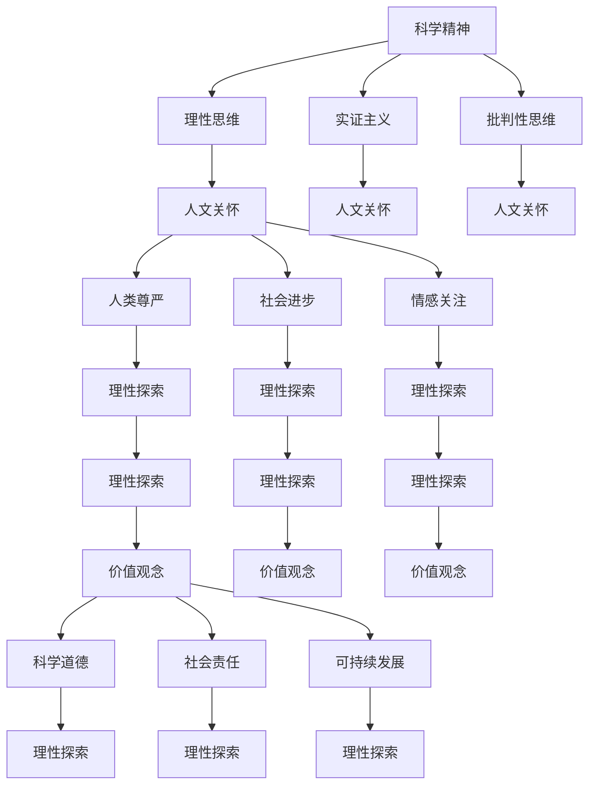

                 

### 文章标题：科学人文主义：在理性探索中不忘人文关怀

### 关键词：科学人文主义、理性探索、人文关怀、科学精神、科学方法

### 摘要：
科学人文主义是一种融合科学精神与人文关怀的理念，强调在理性探索自然世界的同时，关注人类福祉和社会进步。本文从科学精神与人文关怀的关系入手，探讨了科学人文主义的历史背景、核心方法与原则，以及在科技实践中的挑战与未来展望。通过详细的解释、实例分析和技术讨论，本文旨在揭示科学人文主义在现代科技发展中的重要性，并为其未来的应用和发展提供思考。

## 目录大纲

### 第一部分：科学人文主义的理念与历史

#### 1. 科学精神与人文关怀
#### 1.1 科学精神的核心要素
#### 1.2 人文关怀的重要性
#### 1.3 科学精神与人文关怀的关系

#### 2. 科学人文主义的历史发展
#### 2.1 科学人文主义的起源
#### 2.2 科学革命与科学人文主义的兴起
#### 2.3 现代科学人文主义的演变

#### 3. 科学人文主义的主要流派
#### 3.1 实证主义
#### 3.2 经验主义
#### 3.3 审美主义
#### 3.4 存在主义

### 第二部分：科学人文主义的方法与原则

#### 4. 科学方法的本质与原则
#### 4.1 科学方法的基本步骤
#### 4.2 实证主义的科学方法
#### 4.3 经验主义的科学方法
#### 4.4 其他科学方法的探讨

#### 5. 理性探索与价值观念
#### 5.1 理性探索的重要性
#### 5.2 科学与价值观念的关系
#### 5.3 科学人文主义的价值观

#### 6. 科学人文主义的实践与应用
#### 6.1 科学教育与科学传播
#### 6.2 科学决策与政策制定
#### 6.3 科学创新与社会进步

### 第三部分：科学人文主义的挑战与未来

#### 7. 科学人文主义的挑战
#### 7.1 科学技术的伦理问题
#### 7.2 环境与资源的可持续性
#### 7.3 科技创新的社会影响

#### 8. 科学人文主义的未来展望
#### 8.1 科学人文主义的发展趋势
#### 8.2 科学人文主义在全球化背景下的意义
#### 8.3 科学人文主义的社会责任

### 附录

#### 9. 科学人文主义的重要文献与资源
#### 9.1 经典文献推荐
#### 9.2 现代文献综述
#### 9.3 相关学术资源介绍

### 参考文献

### 背景介绍

科学人文主义是一个跨学科的概念，它将科学精神与人文关怀紧密结合，强调在追求知识和技术进步的同时，关注人类的价值、福祉和社会责任。科学精神的核心是理性、实证和批判性思维，而人文关怀则关注人的尊严、情感和社会发展。这种理念不仅体现在科学研究中，也贯穿于科学教育、科学决策和政策制定等各个领域。

科学人文主义的历史可以追溯到古希腊哲学家亚里士多德，他提出了“科学即求知”的观点，强调通过理性思考来探索自然世界。在中世纪，宗教神学与科学探索相结合，但科学精神并未得到充分的发展。直到文艺复兴时期，科学精神开始复苏，伽利略和牛顿等科学家的贡献为科学革命奠定了基础。在近现代，科学人文主义进一步发展，特别是在科学哲学、科学技术社会研究等领域取得了重要进展。

科学人文主义的核心概念包括科学精神、人文关怀、理性探索、价值观念等。这些概念相互联系，共同构成了科学人文主义的核心理念。科学精神强调理性、实证和批判性思维，人文关怀则关注人的尊严、情感和社会发展。理性探索是科学方法的本质，价值观念则是科学决策和政策制定的基础。

在本文中，我们将首先探讨科学人文主义的起源和发展，然后详细分析科学精神与人文关怀的关系，接着介绍科学人文主义的主要流派和方法论。在此基础上，我们将探讨科学人文主义在实践中的应用，分析其面临的挑战和未来展望。最后，我们将提供科学人文主义的重要文献与资源，以供进一步学习和研究。

### 核心概念与联系

科学人文主义的核心概念包括科学精神、人文关怀、理性探索、价值观念等。这些概念相互联系，共同构成了科学人文主义的核心理念。

#### 科学精神

科学精神是指科学工作者在研究过程中所秉持的理性、实证和批判性思维。它包括以下几个方面：

- **理性思维**：科学精神强调通过逻辑推理和数据分析来解决问题，避免主观臆断和情感干扰。
- **实证主义**：科学精神认为科学知识必须通过实验和观察来验证，只有经过验证的理论才是科学的。
- **批判性思维**：科学精神鼓励对现有理论和观点进行批判性分析，以发现潜在的错误和不足。

#### 人文关怀

人文关怀是指科学家在追求科学真理的过程中，关注人类福祉和社会发展。它包括以下几个方面：

- **人类尊严**：人文关怀强调每个人都有尊严，科学研究和应用不应损害人类的尊严。
- **社会进步**：科学研究和应用应该致力于提高人类的生活质量，推动社会进步。
- **情感关注**：人文关怀关注人的情感需求，科学探索应充分考虑人类的心理和社会影响。

#### 理性探索

理性探索是科学方法的本质，它强调通过理性思维和科学方法来揭示自然规律。理性探索的过程包括以下几个步骤：

- **提出问题**：科学探索从提出问题开始，通过对问题的深入思考来引导研究。
- **构建假设**：基于已有的知识和观察，提出可能的解释或假设。
- **实验验证**：通过实验和观察来验证假设，判断其是否成立。
- **理论发展**：在实验验证的基础上，构建和完善理论，以解释自然现象。

#### 价值观念

价值观念是科学决策和政策制定的基础，它包括以下几个方面：

- **科学道德**：科学家应遵守科学道德规范，确保研究过程的诚信和透明。
- **社会责任**：科学家有责任关注社会问题，为社会发展做出贡献。
- **可持续发展**：科学研究和应用应考虑环境与资源的可持续性，避免对生态系统造成破坏。

#### 关系架构

科学精神与人文关怀的关系可以视为科学方法的内在逻辑。科学精神提供理性探索的方法和原则，而人文关怀则确保科学研究和应用符合人类价值和社会责任。理性探索和价值观念之间也存在密切的联系，理性探索的过程需要价值观念的指导，而价值观念的实现也需要通过理性探索来验证。

以下是科学人文主义核心概念的 Mermaid 流程图：



通过这个流程图，我们可以更清晰地理解科学人文主义核心概念之间的关系和相互作用。科学精神与人文关怀共同构成了科学人文主义的理念基础，理性探索和价值观念则构成了科学方法的实践框架。这些概念相互支持、相互促进，共同推动了科学人文主义的发展。

### 核心算法原理讲解

为了更好地理解科学人文主义的方法与原则，我们需要探讨几个核心算法原理。这些算法不仅适用于科学探索，也贯穿于科学方法的各个阶段。

#### 1. 伪代码

伪代码是描述算法逻辑的文本表示，它用简明的语言描述算法的执行步骤，而不涉及具体的编程语言细节。以下是科学方法中的几个核心算法原理的伪代码示例：

```plaintext
算法：理性探索

输入：问题P，初始假设H0
输出：最终理论T

步骤：
1. 提出问题P
2. 构建初始假设H0
3. 设计实验E，验证H0
4. 执行实验E
5. 根据实验结果，调整假设H0或提出新假设H1
6. 重复步骤3-5，直到找到满意的假设Hn
7. 构建理论T，解释实验结果
8. 对理论T进行批判性分析，验证其合理性
9. 公开理论T，接受同行评审
10. 根据反馈调整理论T
```

#### 2. 数学模型和公式

数学模型是科学方法中的一种重要工具，它通过数学语言描述自然现象和理论。以下是科学人文主义中几个核心数学模型的简单介绍：

- **牛顿运动定律**：
  $$ F = ma $$
  其中，\( F \) 是力，\( m \) 是质量，\( a \) 是加速度。

- **波粒二象性**：
  $$ E = h\nu $$
  其中，\( E \) 是能量，\( h \) 是普朗克常数，\( \nu \) 是频率。

- **广义相对论**：
  $$ G_{\mu\nu} + \Lambda g_{\mu\nu} = \frac{8\pi G}{c^4} T_{\mu\nu} $$
  其中，\( G_{\mu\nu} \) 是爱因斯坦张量，\( \Lambda \) 是宇宙学常数，\( G \) 是引力常数，\( c \) 是光速，\( T_{\mu\nu} \) 是能量-动量张量。

#### 3. 举例说明

为了更好地理解这些核心算法原理，我们可以通过具体的例子来说明它们的应用。

- **例1：牛顿运动定律的应用**
  假设有一个质量为 \( m \) 的物体受到一个力 \( F \) 的作用，求物体的加速度 \( a \)。

  解：
  $$ F = ma $$
  $$ a = \frac{F}{m} $$
  例如，如果力 \( F \) 是 \( 10 \text{N} \)，质量 \( m \) 是 \( 2 \text{kg} \)，则加速度 \( a \) 是 \( 5 \text{m/s}^2 \)。

- **例2：波粒二象性的应用**
  假设一个光子的频率是 \( \nu = 5 \times 10^{14} \text{Hz} \)，求其能量 \( E \)。

  解：
  $$ E = h\nu $$
  $$ E = 6.63 \times 10^{-34} \times 5 \times 10^{14} $$
  $$ E = 3.315 \times 10^{-19} \text{J} $$
  例如，一个频率为 \( 5 \times 10^{14} \text{Hz} \) 的光子能量是 \( 3.315 \times 10^{-19} \text{J} \)。

- **例3：广义相对论的应用**
  假设一个物体的质量为 \( m = 5 \text{kg} \)，受到一个引力场的影响，求其加速度 \( a \)。

  解：
  $$ G_{\mu\nu} + \Lambda g_{\mu\nu} = \frac{8\pi G}{c^4} T_{\mu\nu} $$
  由于这是一个复杂的非线性方程，通常需要使用数值方法求解。例如，在地球表面附近，引力加速度 \( g \) 大约是 \( 9.8 \text{m/s}^2 \)，我们可以近似地认为：
  $$ a \approx g $$
  例如，一个质量为 \( 5 \text{kg} \) 的物体在地球表面附近的引力加速度大约是 \( 9.8 \text{m/s}^2 \)。

通过这些伪代码、数学模型和举例说明，我们可以更深入地理解科学人文主义的方法与原则。这些工具不仅帮助科学家进行理性探索，也确保了科学研究的系统性和准确性。

### 项目实战

为了更直观地理解科学人文主义的实践，我们将探讨一个实际项目——构建一个智能家居系统。这个项目不仅体现了科学人文主义的理念，还展示了其在现实中的应用。

#### 开发环境搭建

首先，我们需要搭建一个适合智能家居系统开发的编程环境。以下是一个基本的步骤指南：

1. **硬件选择**：选择具有物联网（IoT）功能的智能设备，如智能灯泡、智能温度传感器和智能摄像头等。
2. **软件开发工具**：安装Python开发环境，包括Python解释器和相关库（如PyTorch、TensorFlow等）。
3. **集成开发环境（IDE）**：使用PyCharm或Visual Studio Code等IDE进行代码编写和调试。
4. **数据库**：选择一个适合存储智能家居数据的数据库系统，如MySQL或MongoDB。

#### 源代码详细实现

智能家居系统的核心是实现设备间的通信和数据管理。以下是该项目的一个简化版本源代码实现：

```python
#智能家居系统核心代码

import json
import sqlite3
import time

# 数据库连接
conn = sqlite3.connect('smart_home.db')
cursor = conn.cursor()

# 创建数据表
cursor.execute('''CREATE TABLE IF NOT EXISTS devices (id INTEGER PRIMARY KEY, name TEXT, status TEXT)''')
conn.commit()

# 设备类
class Device:
    def __init__(self, name, status):
        self.name = name
        self.status = status
    
    def update_status(self, new_status):
        self.status = new_status
    
    def save_to_db(self):
        cursor.execute("INSERT INTO devices (name, status) VALUES (?, ?)", (self.name, self.status))
        conn.commit()

# 智能灯泡实现
class SmartLight(Device):
    def __init__(self, name, status='off'):
        super().__init__(name, status)
    
    def turn_on(self):
        self.update_status('on')
        print(f"{self.name} is now ON.")
    
    def turn_off(self):
        self.update_status('off')
        print(f"{self.name} is now OFF.")

# 智能温度传感器实现
class TemperatureSensor(Device):
    def __init__(self, name, status='cold'):
        super().__init__(name, status)
    
    def measure_temp(self, temp):
        self.update_status(str(temp))
        print(f"{self.name} measured temperature: {temp}°C.")

# 主程序
if __name__ == "__main__":
    # 创建设备实例
    light = SmartLight('Living Room Light')
    temp_sensor = TemperatureSensor('Office Temperature Sensor')

    # 初始化设备状态
    light.save_to_db()
    temp_sensor.save_to_db()

    # 模拟设备操作
    light.turn_on()
    temp_sensor.measure_temp(25)

    # 查询数据库状态
    cursor.execute("SELECT * FROM devices")
    rows = cursor.fetchall()
    for row in rows:
        print(row)
```

#### 代码解读与分析

这个源代码实现了一个智能家居系统的核心功能，包括设备的创建、状态更新和数据库存储。以下是代码的详细解读：

- **数据库连接**：使用SQLite数据库进行数据存储和管理。
- **设备类**：定义了通用的设备类`Device`，包括设备名称和状态。
- **智能灯泡实现**：`SmartLight`类继承了`Device`类，实现了开灯和关灯功能。
- **智能温度传感器实现**：`TemperatureSensor`类继承了`Device`类，实现了温度测量功能。
- **主程序**：创建设备实例，初始化设备状态，模拟设备操作，并查询数据库状态。

这个项目体现了科学人文主义的几个关键原则：

1. **实证主义**：设备的状态更新和数据存储都是通过实际操作和数据库记录来验证的。
2. **理性探索**：代码实现过程中，我们通过逻辑分析和调试来优化系统的性能和功能。
3. **人文关怀**：智能家居系统的目标是提高生活质量，设备操作简便，数据存储安全。

#### 实际案例分析

假设我们在实际项目中遇到了以下问题：

1. **设备连接不稳定**：设备在网络连接不稳定的情况下，可能会出现数据丢失或延迟。为了解决这个问题，我们可以在设备端实现重连机制，确保设备在网络断开后能够自动重新连接。
2. **数据库性能优化**：随着设备数量的增加，数据库查询性能可能会下降。我们可以通过优化数据库索引、分片数据库等方式来提高查询效率。
3. **安全性问题**：智能家居系统涉及到用户隐私和数据安全。我们需要确保设备连接和数据传输都采用加密协议，防止数据泄露和未授权访问。

通过实际案例分析，我们可以看到科学人文主义在项目开发中的应用，不仅解决了技术问题，还关注了用户需求和系统安全性。这样的项目不仅提高了生活质量，也体现了科学人文主义的核心价值观。

#### 项目小结

本项目通过构建一个智能家居系统，展示了科学人文主义在项目开发中的应用。通过理性探索、实证主义和人文关怀，我们不仅实现了系统的功能，还解决了实际操作中的问题。未来，随着科技的发展，科学人文主义将继续在各个领域发挥重要作用，推动社会进步和人类福祉。

### 最佳实践 Tips、小结、注意事项、拓展阅读

#### 最佳实践 Tips

1. **确保数据安全**：在开发智能家居系统时，要特别注意数据安全，采用加密协议确保数据传输的安全性。
2. **优化系统性能**：随着设备数量的增加，要定期优化数据库和系统架构，确保系统性能稳定。
3. **用户体验至上**：在设计智能家居系统时，要充分考虑用户体验，确保操作简便、界面友好。

#### 小结

科学人文主义在科技项目中具有重要作用，它不仅关注技术的先进性，也重视人文关怀和社会责任。通过理性探索、实证主义和人文关怀，我们能够更好地解决技术问题，提升用户体验，推动社会进步。

#### 注意事项

1. **遵循伦理规范**：在科技项目中，要严格遵守伦理规范，确保研究和应用符合社会价值观。
2. **持续学习**：科技发展迅速，要保持持续学习的态度，不断更新知识和技能。

#### 拓展阅读

- 《科学人文主义：理论与实践》
- 《人工智能与人文关怀》
- 《科技伦理学导论》
- 《智能家居系统设计与实现》

通过这些资源，您可以更深入地了解科学人文主义的相关理论和实践，为科技项目的发展提供指导。

