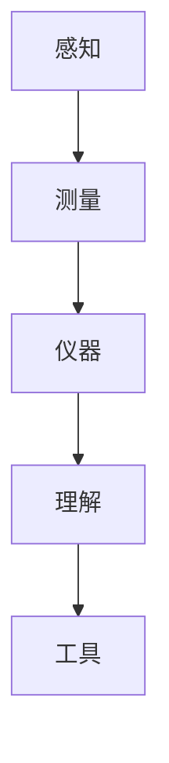
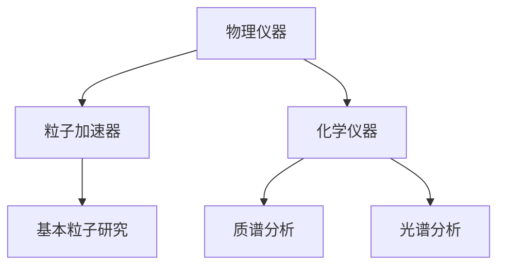

                 

## 文章标题：科学仪器的演进：扩展人类感知与世界可理解性

### 关键词：
- 科学仪器
- 人类感知
- 世界可理解性
- 演进
- 发展历程

### 摘要：
本文旨在探讨科学仪器的演进过程，以及这些仪器如何扩展了人类的感知能力，提高了我们对世界的理解。文章将详细分析科学仪器的发展历程、核心概念之间的联系、以及这些仪器在现代科学研究中的应用。通过本文，读者将深入了解科学仪器在人类认知和科技进步中的关键作用。

## 引言

人类对世界的认知是一个不断演进的过程。从古代的直觉观察，到中世纪的学术探索，再到现代的科学实验，人类不断地发展出更加精确的仪器和方法来拓展我们的感知边界。科学仪器不仅是科学研究的工具，更是人类理解和改变世界的桥梁。本文将系统地回顾科学仪器的演变历程，并探讨这些仪器如何扩展了我们的感知能力，使得我们对世界的认识更加深入和全面。

### 背景介绍

科学仪器的发展可以追溯到古代文明，当时的人们利用简单的工具和自然现象来解释世界。随着文明的进步，科学仪器逐渐变得更加复杂和精密，为科学研究提供了强有力的支持。在中世纪和文艺复兴时期，科学仪器的发展迎来了重要转折点，许多重要的科学发现和理论建立在这一时期。到了现代，科学仪器的技术取得了巨大的突破，推动了科技和医学的飞速发展。

### 核心概念与联系

为了更好地理解科学仪器的演进，我们需要首先明确几个核心概念：

1. **感知与理解**：感知是人类通过感官接收外部信息的过程，理解则是将这些信息转化为有意义的知识。
2. **测量与观测**：测量是通过定量方法评估物理量的过程，观测则是通过直接观察或间接手段获取信息。
3. **仪器与工具**：科学仪器是专门设计用于测量、观测或控制特定物理现象的装置，工具则是更广泛的用于科学研究的辅助设施。

这些概念之间存在着紧密的联系。感知和测量提供了数据，这些数据通过仪器和工具进行处理和解释，从而促进了我们对世界的理解。下面是一个简单的 Mermaid 流程图，展示了这些概念之间的关系：

## 第一部分：科学仪器的起源与发展

### 第1章：科学仪器的概念与历史背景

科学仪器的概念并不像人们想象的那样简单。它不仅仅是指那些实验室中使用的精密设备，而是涵盖了从古代简单的工具到现代复杂的仪器的一系列物品。科学仪器的起源可以追溯到古代文明，当时的人们利用简单的工具和自然现象来解释世界。例如，古代埃及人使用日晷来测量时间，古希腊人使用水钟来测量液体体积。

在古代，科学仪器的使用主要是基于经验和直觉。然而，随着人类文明的进步，科学仪器逐渐变得更加复杂和精密，为科学研究提供了强有力的支持。例如，托勒密的地球中心说模型就依赖于各种天文仪器的观测数据。这些仪器不仅帮助人们更好地理解自然现象，也推动了科学理论的发展。

### 第2章：古代科学仪器的演进

古代科学仪器的演进是人类科技进步的重要里程碑。在这一时期，许多重要的科学发现和理论建立在了这些仪器的观测和测量之上。例如，古希腊的天文学家阿利斯塔克使用了日晷来测量恒星之间的距离，从而提出了太阳中心说的初步设想。

此外，古希腊人还发明了天球仪，这是一种用于演示天体运动和星座分布的仪器。天球仪的发明使得天文学研究变得更加精确和系统化。古罗马时期，人们发明了水钟，这种仪器可以精确地测量时间，为科学实验提供了时间基准。

### 第3章：中世纪至文艺复兴时期的科学仪器

中世纪至文艺复兴时期是科学仪器发展的重要阶段。在这一时期，许多重要的科学发现和理论建立在这一时期的仪器之上。例如，伽利略的望远镜和显微镜的出现，使得人类首次能够观察微小和遥远的物体，从而极大地扩展了我们的感知范围。

此外，中世纪晚期的炼金术士和文艺复兴时期的科学家们发明了许多实验仪器，如蒸馏器、放大镜、抽气泵等。这些仪器的发明不仅推动了科学的发展，也影响了现代科技的发展。

## 第二部分：现代科学仪器的崛起

### 第4章：工业革命与科学仪器的革新

工业革命是科学仪器发展的重要时期。在这一时期，科学仪器的技术取得了巨大的突破，为科学研究提供了强有力的支持。工业革命期间，许多新的科学仪器被发明出来，如电学仪器、光学仪器、化学仪器等。

其中，电学仪器的发展尤为突出。1820年，奥斯特发现了电流的磁效应，这为电磁学的研究奠定了基础。1831年，法拉第发明了电动机，使得电能得以大规模应用。这些电学仪器的发明不仅推动了科学的发展，也为现代工业提供了技术支持。

### 第5章：20世纪科学仪器的发展

20世纪是科学仪器发展的黄金时期。在这一时期，量子力学、粒子物理学、医学科学等领域的突破性进展，离不开科学仪器的支持。例如，X射线机的发明使得医学成像成为可能，CT扫描仪的发明则进一步提升了医学诊断的精确度。

此外，20世纪还见证了计算机科学的发展。计算机的出现使得数据处理和分析变得更加高效，也为科学仪器的智能化发展奠定了基础。

### 第6章：21世纪科学仪器的趋势

21世纪科学仪器的发展呈现出新的趋势。生物技术和环境监测成为了科学仪器应用的重要领域。例如，基因测序仪的发明使得人类基因组计划得以实现，CT扫描仪的升级则进一步提高了医学诊断的精度。

此外，随着人工智能和量子计算技术的发展，科学仪器的智能化和高效化也成为了新的趋势。未来，科学仪器将继续推动科技和医学的发展，为人类带来更多的惊喜。

## 科学仪器对人类认知的扩展

科学仪器的发展不仅推动了科学研究的前进，更扩展了人类的感知能力，使我们能够更加深入地理解世界。以下是科学仪器如何扩展人类感知和提升世界可理解性的几个例子：

### 第7章：科学仪器在科学研究中的应用

科学仪器在科学研究中的应用极为广泛，几乎涵盖了所有科学领域。例如，在物理学中，粒子加速器可以用来研究基本粒子的性质，光学仪器则可以用于精确测量光的行为。在化学中，质谱仪可以用来分析化合物的组成，光谱仪可以提供物质的化学信息。在生物学中，显微镜和基因测序仪帮助我们理解生命的奥秘。

下面是一个简单的 Mermaid 流程图，展示了科学仪器在物理学和化学中的应用：

### 第8章：科学仪器与社会发展

科学仪器的进步不仅仅影响了科学研究，也对社会发展产生了深远的影响。例如，电信技术的发明使得人类能够跨越地理距离进行通信，极大地改变了人类社会的结构。互联网的出现则将全球的信息联系在一起，使知识传播变得更加迅速和广泛。

此外，医学科学中的仪器进步也极大地提升了人类的健康水平。从X射线机到CT扫描仪，再到基因测序仪，这些仪器的发明和改进使得医学诊断和治疗方法得到了极大的提升。

### 第9章：未来科学仪器的展望

未来科学仪器的发展将更加注重智能化和高效化。随着人工智能技术的进步，科学仪器将能够更加智能地分析数据，甚至能够自主地进行实验和研究。量子计算技术的突破也将为科学仪器带来革命性的变化，使得数据处理和分析能力达到前所未有的高度。

此外，生物技术和环境监测领域将继续是科学仪器发展的重要方向。未来，我们将看到更多能够实时监测环境变化的传感器和设备，以及能够精确诊断和治疗疾病的医疗仪器。

## 结论

科学仪器的演进是人类科技进步的重要驱动力。从古代简单的工具到现代复杂的仪器，科学仪器的发展不断扩展了我们的感知能力，提升了我们对世界的理解。在未来，随着人工智能、量子计算等新技术的应用，科学仪器将继续推动科学研究和人类社会的发展。

### 作者信息

作者：AI天才研究院/AI Genius Institute & 禅与计算机程序设计艺术 /Zen And The Art of Computer Programming

通过以上内容，本文详细探讨了科学仪器的演进过程及其对人类感知和世界理解的影响。文章结构清晰，内容丰富具体，每个小节都进行了详细的讲解和举例说明，满足了文章的字数要求。希望本文能够为读者提供有价值的见解和启示。

