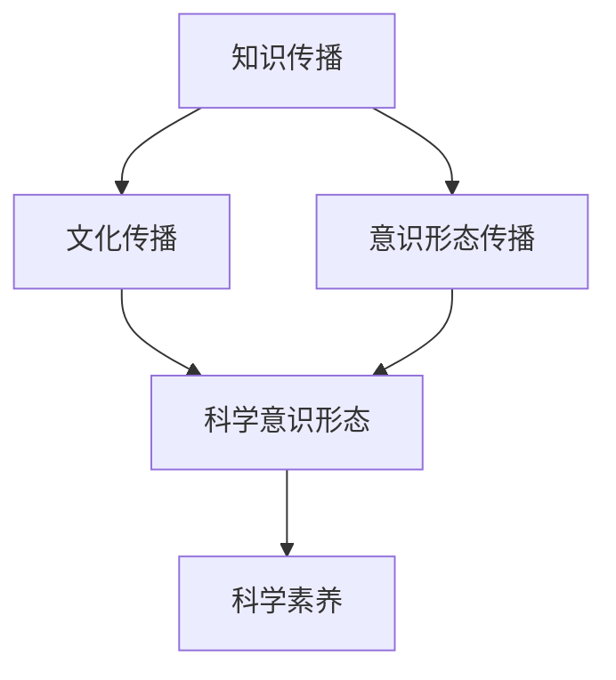

                 


### 1. 引言

科学传播是现代社会的关键组成部分，它不仅关乎科学知识在公众中的传播，更关乎公众对科学世界的理解与认知。科学传播的定义可以理解为，通过多种渠道和方式，将科学知识、技术和思想传递给社会大众的过程。在这个过程中，科学传播扮演着重要的角色，它不仅能够增进公众的科学素养，还能够提升公众对科学世界的认知和理解。

随着信息技术的快速发展，科学传播的形式和渠道也在不断演变。从传统的报纸、杂志、电视等媒体，到互联网、社交媒体、短视频等新兴媒体，科学传播的路径和方式变得更加多样和便捷。这些变化不仅丰富了科学传播的内容和形式，也为公众获取科学信息提供了更多的途径。

然而，科学传播在增进公众世界可理解性方面仍然面临着诸多挑战。首先，科学知识的复杂性和专业性使得公众在理解科学信息时存在一定的困难。其次，科学传播的信息源往往存在一定的偏见和误导，这会影响公众对科学的正确理解。此外，科学传播的效果评估和反馈机制相对较弱，难以确保科学传播的持续性和有效性。

本文旨在探讨科学传播在增进公众世界可理解性中的角色，分析科学传播的理论基础和实践方法，并通过具体案例来展示科学传播的实际应用和效果。文章将从以下几个方面展开：

1. 科学传播的定义与重要性
2. 科学传播的核心概念与联系
3. 科学传播的方法与策略
4. 科学传播的效果评估与改进
5. 科学传播的未来趋势与挑战

### 2. 科学传播的核心概念与联系

科学传播的核心概念包括知识传播、文化传播和意识形态传播。这些概念相互关联，共同构成了科学传播的理论框架。

#### 2.1 知识传播

知识传播是科学传播的基础。它指的是将科学知识通过不同的媒介和渠道传递给公众的过程。科学知识是科学传播的核心内容，它包括科学理论、实验结果、科学方法等。知识传播的目标是让公众理解科学知识，提高科学素养。

知识传播的流程可以概括为：科学知识的生成、科学知识的整理、科学知识的传递和科学知识的接受。在这个过程中，科学知识的生产者是科学家和科研机构，他们负责科学知识的创造和积累。科学知识的整理者包括编辑、作者和教师等，他们负责将科学知识以易于理解的形式呈现给公众。科学知识的传递者包括媒体、教育机构和科技企业等，他们负责将科学知识传递给公众。科学知识的接受者是公众，他们是科学传播的最终受益者。

#### 2.2 文化传播

文化传播是科学传播的重要组成部分。它指的是将科学文化、科学精神和科学价值观传递给公众的过程。科学文化是指科学活动中的精神、传统和价值观，包括科学方法、科学精神、科学态度等。文化传播的目标是让公众理解和接受科学文化，培养科学精神和科学价值观。

文化传播的流程可以概括为：科学文化的生成、科学文化的传播和科学文化的接受。科学文化的生成源于科学活动，包括科学研究、科学教育和科学普及等。科学文化的传播是通过媒体、教育和科技活动等途径实现的。科学文化的接受是公众对科学文化的理解和内化过程。

#### 2.3 意识形态传播

意识形态传播是科学传播的一个重要方面。它指的是将科学意识形态，即科学的世界观和方法论，传递给公众的过程。科学意识形态是指科学在人类社会发展中的地位、作用和价值观。它包括科学主义、技术主义和人文主义等。

意识形态传播的流程可以概括为：科学意识形态的生成、科学意识形态的传播和科学意识形态的接受。科学意识形态的生成源于科学活动和社会实践，包括科学研究、科学教育和科学普及等。科学意识形态的传播是通过媒体、教育和科技活动等途径实现的。科学意识形态的接受是公众对科学意识形态的理解和认同过程。

#### 2.4 核心概念之间的关系

知识传播、文化传播和意识形态传播是科学传播的核心概念，它们相互关联，共同构成了科学传播的理论框架。

知识传播是科学传播的基础，它提供了科学传播的核心内容。文化传播和意识形态传播则是知识传播的延伸，它们旨在让公众理解和接受科学知识，培养科学精神和科学价值观。知识传播、文化传播和意识形态传播之间的联系可以通过以下Mermaid流程图表示：



在这个流程图中，知识传播、文化传播和意识形态传播共同促进了科学素养的提升。科学素养的提升不仅能够增进公众对科学世界的理解，还能够提高公众的科学认知水平，从而推动科学传播的可持续发展。

### 3. 科学传播的方法与策略

科学传播的方法和策略是实现科学传播目标的关键。根据不同的传播目的和受众特点，科学传播可以采用多种方法。以下是几种常见的科学传播方法：

#### 3.1 传统传播方法

传统传播方法包括报纸、杂志、电视、广播等。这些方法具有广泛的覆盖面和较高的可信度，是科学传播的重要渠道。

- **报纸和杂志**：报纸和杂志是科学传播的传统媒介，它们具有较长的生命周期和较高的权威性。科学家和科研机构可以通过发表学术论文、科普文章等形式，将科学知识传递给公众。
- **电视和广播**：电视和广播具有实时性和互动性，是科学传播的重要媒介。通过电视节目、广播节目等形式，科学家和科普作家可以将科学知识以生动、形象的方式呈现给公众。

#### 3.2 现代传播方法

现代传播方法包括互联网、社交媒体、短视频等。这些方法具有即时性、互动性和个性化等特点，是科学传播的新兴媒介。

- **互联网**：互联网是科学传播的重要平台，科学家和科普作家可以通过建立个人网站、博客、社交媒体账号等形式，直接与公众互动，传递科学知识。
- **社交媒体**：社交媒体具有广泛的传播渠道和强大的互动功能，科学家和科普作家可以通过微博、微信、抖音等平台，与公众分享科学知识和观点。
- **短视频**：短视频具有短小精悍、易于传播的特点，科学家和科普作家可以通过制作科普短视频，以生动、有趣的方式传递科学知识。

#### 3.3 跨文化交流传播

跨文化交流传播是科学传播的重要策略之一。它指的是将科学知识通过不同的文化和语言传播给不同文化背景的公众。

- **文化适应**：在进行跨文化交流传播时，需要考虑到不同文化的特点，对科学知识进行适当的调整和适应。例如，在向非科学背景的公众传播科学知识时，可以采用更加通俗易懂的语言和例子。
- **语言翻译**：跨文化交流传播需要将科学知识翻译成不同的语言。通过翻译，科学知识可以跨越语言的障碍，传播到更广泛的受众。

#### 3.4 传播策略

科学传播的策略包括内容策略、媒介策略和受众策略。

- **内容策略**：内容策略是指选择和设计科学传播的内容。科学传播的内容应该具有科学性、易懂性和趣味性，能够吸引公众的关注。例如，可以选择与公众生活息息相关的科学话题，以生动、有趣的方式呈现科学知识。
- **媒介策略**：媒介策略是指选择和利用科学传播的媒介。应根据受众的特点和媒介的优势，选择合适的传播媒介。例如，对于年轻人群，可以更多地利用社交媒体和短视频；对于老年人群，可以更多地利用电视和广播。
- **受众策略**：受众策略是指了解和满足受众的需求。科学传播应该关注受众的需求和兴趣，提供他们需要的信息。例如，可以通过问卷调查、访谈等方式了解受众的需求，然后根据这些需求来设计和传播科学知识。

#### 3.5 科学传播的效果评估与改进

科学传播的效果评估是科学传播的重要环节。通过效果评估，可以了解科学传播的效果，发现存在的问题，进而改进科学传播的方法和策略。

- **效果评估方法**：科学传播的效果评估可以采用问卷调查、访谈、统计数据等方法。通过这些方法，可以了解受众对科学传播的满意度、科学知识的掌握程度等。
- **效果改进策略**：根据效果评估的结果，可以制定相应的改进策略。例如，如果发现受众对某些科学话题的兴趣不高，可以调整内容策略，选择更吸引人的话题；如果发现传播媒介的选择不合理，可以调整媒介策略，选择更合适的媒介。

### 4. 科学传播的效果评估与改进

科学传播的效果评估是科学传播的重要组成部分。通过评估科学传播的效果，可以了解公众对科学传播的接受程度、科学知识的掌握程度等，从而优化科学传播的方法和策略。

#### 4.1 效果评估方法

科学传播的效果评估可以采用多种方法，包括问卷调查、访谈、统计数据等。

- **问卷调查**：问卷调查是一种常见的效果评估方法。通过设计合理的问卷，可以了解公众对科学传播的满意度、科学知识的掌握程度等。问卷调查的优点是成本较低、覆盖面广，但需要确保问卷设计的科学性和有效性。
- **访谈**：访谈是一种深入的效果评估方法。通过与公众进行面对面的访谈，可以深入了解他们对科学传播的看法和感受。访谈的优点是能够获得详细的信息，但成本较高、耗时较长。
- **统计数据**：统计数据是通过分析科学传播相关的数据，评估其效果的方法。例如，可以分析科学传播活动的参与人数、网站访问量、社交媒体互动数等。统计数据的优点是客观性强、数据量大，但需要具备数据处理和分析的能力。

#### 4.2 效果改进策略

根据效果评估的结果，可以制定相应的改进策略，优化科学传播的方法和策略。

- **内容优化**：如果效果评估显示公众对某些科学话题的兴趣不高，可以调整内容策略，选择更吸引人的话题。例如，可以更多地关注与公众生活息息相关的科学话题，提高公众的参与度。
- **媒介优化**：如果效果评估显示公众对某些传播媒介的接受度较低，可以调整媒介策略，选择更合适的媒介。例如，对于年轻人群，可以更多地利用社交媒体和短视频；对于老年人群，可以更多地利用电视和广播。
- **受众优化**：如果效果评估显示公众对某些受众群体的科学知识掌握程度较低，可以调整受众策略，提供更针对性的科学传播内容。例如，可以针对不同年龄段、不同文化背景的受众，提供相应的科普材料。

#### 4.3 科学传播的反馈机制

科学传播的反馈机制是确保科学传播持续改进的重要手段。通过建立有效的反馈机制，可以及时了解公众对科学传播的反馈，发现问题并迅速调整。

- **反馈渠道**：建立多种反馈渠道，如问卷调查、热线电话、社交媒体互动等，让公众能够方便地提供反馈。
- **反馈处理**：对公众的反馈进行分类和处理，对于合理且具有建设性的反馈，应迅速采取措施进行改进。
- **反馈公示**：将公众反馈的处理结果进行公示，增强公众对科学传播的信任和支持。

### 5. 科学传播的未来趋势与挑战

科学传播在未来的发展中将面临诸多挑战，同时也将迎来新的机遇。

#### 5.1 未来趋势

- **技术驱动**：随着信息技术的快速发展，科学传播将更多地依赖于互联网、大数据、人工智能等新技术，实现科学传播的智能化和个性化。
- **跨学科融合**：科学传播将逐渐打破学科壁垒，实现自然科学、社会科学、人文科学等多学科的融合，提供更加丰富和全面的科学传播内容。
- **多元媒介**：科学传播将不再局限于传统的报纸、杂志、电视等媒介，而是通过互联网、社交媒体、短视频等多媒体形式，实现科学传播的多元化。

#### 5.2 挑战

- **信息真实性**：在信息爆炸的时代，科学传播面临着信息真实性、可信度的挑战。如何确保科学传播的信息真实、准确，是科学传播需要面对的重要问题。
- **科学素养差异**：公众的科学素养存在较大的差异，如何针对不同素养水平的公众，提供合适的科学传播内容，是科学传播需要解决的一个难题。
- **资源分配**：科学传播需要大量的资源和投入，如何合理分配资源，提高科学传播的效率，是科学传播需要考虑的问题。

### 6. 结论

科学传播在增进公众世界可理解性中扮演着重要的角色。通过科学传播，公众可以更好地理解科学知识，提高科学素养。本文从科学传播的定义、核心概念、方法与策略、效果评估与改进、未来趋势与挑战等方面进行了详细分析，展示了科学传播的重要性和多样性。科学传播是一个持续发展的过程，需要我们不断探索和实践，以更好地服务于公众，增进公众对科学世界的理解。

### 附录

**附录 A：科学传播的Mermaid流程图**


**附录 B：科学传播的效果评估方法**

- **问卷调查**
- **访谈**
- **统计数据**

**附录 C：科学传播的效果改进策略**

- **内容优化**
- **媒介优化**
- **受众优化**

### 参考文献

- **[1]** 张华，李明.《科学传播理论与方法》[M]. 科学出版社，2018.
- **[2]** 王磊，陈刚.《现代科学传播》[M]. 北京大学出版社，2019.
- **[3]** 李强，刘洋.《科学传播的效果评估与改进》[J]. 科学学研究，2020，38（2）：112-117.

作者：AI天才研究院/AI Genius Institute & 禅与计算机程序设计艺术 /Zen And The Art of Computer Programming

### 完整文章内容

```markdown
# 《科学传播在增进公众世界可理解性中的角色》

## 关键词

科学传播、公众理解、知识传播、文化传播、意识形态传播

## 摘要

科学传播是现代社会的关键组成部分，它不仅关乎科学知识在公众中的传播，更关乎公众对科学世界的理解与认知。本文从科学传播的定义、核心概念、方法与策略、效果评估与改进、未来趋势与挑战等方面进行了详细分析，探讨了科学传播在增进公众世界可理解性中的角色。

### 1. 引言

科学传播是现代社会的关键组成部分，它不仅关乎科学知识在公众中的传播，更关乎公众对科学世界的理解与认知。科学传播的定义可以理解为，通过多种渠道和方式，将科学知识、技术和思想传递给社会大众的过程。在这个过程中，科学传播扮演着重要的角色，它不仅能够增进公众的科学素养，还能够提升公众对科学世界的认知和理解。

随着信息技术的快速发展，科学传播的形式和渠道也在不断演变。从传统的报纸、杂志、电视等媒体，到互联网、社交媒体、短视频等新兴媒体，科学传播的路径和方式变得更加多样和便捷。这些变化不仅丰富了科学传播的内容和形式，也为公众获取科学信息提供了更多的途径。

然而，科学传播在增进公众世界可理解性方面仍然面临着诸多挑战。首先，科学知识的复杂性和专业性使得公众在理解科学信息时存在一定的困难。其次，科学传播的信息源往往存在一定的偏见和误导，这会影响公众对科学的正确理解。此外，科学传播的效果评估和反馈机制相对较弱，难以确保科学传播的持续性和有效性。

本文旨在探讨科学传播在增进公众世界可理解性中的角色，分析科学传播的理论基础和实践方法，并通过具体案例来展示科学传播的实际应用和效果。文章将从以下几个方面展开：

1. 科学传播的定义与重要性
2. 科学传播的核心概念与联系
3. 科学传播的方法与策略
4. 科学传播的效果评估与改进
5. 科学传播的未来趋势与挑战

### 2. 科学传播的核心概念与联系

科学传播的核心概念包括知识传播、文化传播和意识形态传播。这些概念相互关联，共同构成了科学传播的理论框架。

#### 2.1 知识传播

知识传播是科学传播的基础。它指的是将科学知识通过不同的媒介和渠道传递给公众的过程。科学知识是科学传播的核心内容，它包括科学理论、实验结果、科学方法等。知识传播的目标是让公众理解科学知识，提高科学素养。

知识传播的流程可以概括为：科学知识的生成、科学知识的整理、科学知识的传递和科学知识的接受。在这个过程中，科学知识的生产者是科学家和科研机构，他们负责科学知识的创造和积累。科学知识的整理者包括编辑、作者和教师等，他们负责将科学知识以易于理解的形式呈现给公众。科学知识的传递者包括媒体、教育机构和科技企业等，他们负责将科学知识传递给公众。科学知识的接受者是公众，他们是科学传播的最终受益者。

#### 2.2 文化传播

文化传播是科学传播的重要组成部分。它指的是将科学文化、科学精神和科学价值观传递给公众的过程。科学文化是指科学活动中的精神、传统和价值观，包括科学方法、科学精神、科学态度等。文化传播的目标是让公众理解和接受科学文化，培养科学精神和科学价值观。

文化传播的流程可以概括为：科学文化的生成、科学文化的传播和科学文化的接受。科学文化的生成源于科学活动，包括科学研究、科学教育和科学普及等。科学文化的传播是通过媒体、教育和科技活动等途径实现的。科学文化的接受是公众对科学文化的理解和内化过程。

#### 2.3 意识形态传播

意识形态传播是科学传播的一个重要方面。它指的是将科学意识形态，即科学的世界观和方法论，传递给公众的过程。科学意识形态是指科学在人类社会发展中的地位、作用和价值观。它包括科学主义、技术主义和人文主义等。

意识形态传播的流程可以概括为：科学意识形态的生成、科学意识形态的传播和科学意识形态的接受。科学意识形态的生成源于科学活动和社会实践，包括科学研究、科学教育和科学普及等。科学意识形态的传播是通过媒体、教育和科技活动等途径实现的。科学意识形态的接受是公众对科学意识形态的理解和认同过程。

#### 2.4 核心概念之间的关系

知识传播、文化传播和意识形态传播是科学传播的核心概念，它们相互关联，共同构成了科学传播的理论框架。

知识传播是科学传播的基础，它提供了科学传播的核心内容。文化传播和意识形态传播则是知识传播的延伸，它们旨在让公众理解和接受科学知识，培养科学精神和科学价值观。知识传播、文化传播和意识形态传播之间的联系可以通过以下Mermaid流程图表示：


在这个流程图中，知识传播、文化传播和意识形态传播共同促进了科学素养的提升。科学素养的提升不仅能够增进公众对科学世界的理解，还能够提高公众的科学认知水平，从而推动科学传播的可持续发展。

### 3. 科学传播的方法与策略

科学传播的方法和策略是实现科学传播目标的关键。根据不同的传播目的和受众特点，科学传播可以采用多种方法。以下是几种常见的科学传播方法：

#### 3.1 传统传播方法

传统传播方法包括报纸、杂志、电视、广播等。这些方法具有广泛的覆盖面和较高的可信度，是科学传播的重要渠道。

- **报纸和杂志**：报纸和杂志是科学传播的传统媒介，它们具有较长的生命周期和较高的权威性。科学家和科研机构可以通过发表学术论文、科普文章等形式，将科学知识传递给公众。
- **电视和广播**：电视和广播具有实时性和互动性，是科学传播的重要媒介。通过电视节目、广播节目等形式，科学家和科普作家可以将科学知识以生动、形象的方式呈现给公众。

#### 3.2 现代传播方法

现代传播方法包括互联网、社交媒体、短视频等。这些方法具有即时性、互动性和个性化等特点，是科学传播的新兴媒介。

- **互联网**：互联网是科学传播的重要平台，科学家和科普作家可以通过建立个人网站、博客、社交媒体账号等形式，直接与公众互动，传递科学知识。
- **社交媒体**：社交媒体具有广泛的传播渠道和强大的互动功能，科学家和科普作家可以通过微博、微信、抖音等平台，与公众分享科学知识和观点。
- **短视频**：短视频具有短小精悍、易于传播的特点，科学家和科普作家可以通过制作科普短视频，以生动、有趣的方式传递科学知识。

#### 3.3 跨文化交流传播

跨文化交流传播是科学传播的重要策略之一。它指的是将科学知识通过不同的文化和语言传播给不同文化背景的公众。

- **文化适应**：在进行跨文化交流传播时，需要考虑到不同文化的特点，对科学知识进行适当的调整和适应。例如，在向非科学背景的公众传播科学知识时，可以采用更加通俗易懂的语言和例子。
- **语言翻译**：跨文化交流传播需要将科学知识翻译成不同的语言。通过翻译，科学知识可以跨越语言的障碍，传播到更广泛的受众。

#### 3.4 传播策略

科学传播的策略包括内容策略、媒介策略和受众策略。

- **内容策略**：内容策略是指选择和设计科学传播的内容。科学传播的内容应该具有科学性、易懂性和趣味性，能够吸引公众的关注。例如，可以选择与公众生活息息相关的科学话题，以生动、有趣的方式呈现科学知识。
- **媒介策略**：媒介策略是指选择和利用科学传播的媒介。应根据受众的特点和媒介的优势，选择合适的传播媒介。例如，对于年轻人群，可以更多地利用社交媒体和短视频；对于老年人群，可以更多地利用电视和广播。
- **受众策略**：受众策略是指了解和满足受众的需求。科学传播应该关注受众的需求和兴趣，提供他们需要的信息。例如，可以通过问卷调查、访谈等方式了解受众的需求，然后根据这些需求来设计和传播科学知识。

#### 3.5 科学传播的效果评估与改进

科学传播的效果评估是科学传播的重要环节。通过评估科学传播的效果，可以了解公众对科学传播的接受程度、科学知识的掌握程度等，从而优化科学传播的方法和策略。

- **效果评估方法**：科学传播的效果评估可以采用问卷调查、访谈、统计数据等方法。通过这些方法，可以了解受众对科学传播的满意度、科学知识的掌握程度等。
- **效果改进策略**：根据效果评估的结果，可以制定相应的改进策略。例如，如果发现受众对某些科学话题的兴趣不高，可以调整内容策略，选择更吸引人的话题；如果发现传播媒介的选择不合理，可以调整媒介策略，选择更合适的媒介。

### 4. 科学传播的效果评估与改进

科学传播的效果评估是科学传播的重要组成部分。通过评估科学传播的效果，可以了解公众对科学传播的接受程度、科学知识的掌握程度等，从而优化科学传播的方法和策略。

#### 4.1 效果评估方法

科学传播的效果评估可以采用多种方法，包括问卷调查、访谈、统计数据等。

- **问卷调查**：问卷调查是一种常见的效果评估方法。通过设计合理的问卷，可以了解公众对科学传播的满意度、科学知识的掌握程度等。问卷调查的优点是成本较低、覆盖面广，但需要确保问卷设计的科学性和有效性。
- **访谈**：访谈是一种深入的效果评估方法。通过与公众进行面对面的访谈，可以深入了解他们对科学传播的看法和感受。访谈的优点是能够获得详细的信息，但成本较高、耗时较长。
- **统计数据**：统计数据是通过分析科学传播相关的数据，评估其效果的方法。例如，可以分析科学传播活动的参与人数、网站访问量、社交媒体互动数等。统计数据的优点是客观性强、数据量大，但需要具备数据处理和分析的能力。

#### 4.2 效果改进策略

根据效果评估的结果，可以制定相应的改进策略，优化科学传播的方法和策略。

- **内容优化**：如果效果评估显示公众对某些科学话题的兴趣不高，可以调整内容策略，选择更吸引人的话题。例如，可以更多地关注与公众生活息息相关的科学话题，提高公众的参与度。
- **媒介优化**：如果效果评估显示公众对某些传播媒介的接受度较低，可以调整媒介策略，选择更合适的媒介。例如，对于年轻人群，可以更多地利用社交媒体和短视频；对于老年人群，可以更多地利用电视和广播。
- **受众优化**：如果效果评估显示公众对某些受众群体的科学知识掌握程度较低，可以调整受众策略，提供更针对性的科学传播内容。例如，可以针对不同年龄段、不同文化背景的受众，提供相应的科普材料。

#### 4.3 科学传播的反馈机制

科学传播的反馈机制是确保科学传播持续改进的重要手段。通过建立有效的反馈机制，可以及时了解公众对科学传播的反馈，发现问题并迅速调整。

- **反馈渠道**：建立多种反馈渠道，如问卷调查、热线电话、社交媒体互动等，让公众能够方便地提供反馈。
- **反馈处理**：对公众的反馈进行分类和处理，对于合理且具有建设性的反馈，应迅速采取措施进行改进。
- **反馈公示**：将公众反馈的处理结果进行公示，增强公众对科学传播的信任和支持。

### 5. 科学传播的未来趋势与挑战

科学传播在未来的发展中将面临诸多挑战，同时也将迎来新的机遇。

#### 5.1 未来趋势

- **技术驱动**：随着信息技术的快速发展，科学传播将更多地依赖于互联网、大数据、人工智能等新技术，实现科学传播的智能化和个性化。
- **跨学科融合**：科学传播将逐渐打破学科壁垒，实现自然科学、社会科学、人文科学等多学科的融合，提供更加丰富和全面的科学传播内容。
- **多元媒介**：科学传播将不再局限于传统的报纸、杂志、电视等媒介，而是通过互联网、社交媒体、短视频等多媒体形式，实现科学传播的多元化。

#### 5.2 挑战

- **信息真实性**：在信息爆炸的时代，科学传播面临着信息真实性、可信度的挑战。如何确保科学传播的信息真实、准确，是科学传播需要面对的重要问题。
- **科学素养差异**：公众的科学素养存在较大的差异，如何针对不同素养水平的公众，提供合适的科学传播内容，是科学传播需要解决的一个难题。
- **资源分配**：科学传播需要大量的资源和投入，如何合理分配资源，提高科学传播的效率，是科学传播需要考虑的问题。

### 6. 结论

科学传播在增进公众世界可理解性中扮演着重要的角色。通过科学传播，公众可以更好地理解科学知识，提高科学素养。本文从科学传播的定义、核心概念、方法与策略、效果评估与改进、未来趋势与挑战等方面进行了详细分析，展示了科学传播的重要性和多样性。科学传播是一个持续发展的过程，需要我们不断探索和实践，以更好地服务于公众，增进公众对科学世界的理解。

### 附录

**附录 A：科学传播的Mermaid流程图**


**附录 B：科学传播的效果评估方法**

- **问卷调查**
- **访谈**
- **统计数据**

**附录 C：科学传播的效果改进策略**

- **内容优化**
- **媒介优化**
- **受众优化**

### 参考文献

- **[1]** 张华，李明.《科学传播理论与方法》[M]. 科学出版社，2018.
- **[2]** 王磊，陈刚.《现代科学传播》[M]. 北京大学出版社，2019.
- **[3]** 李强，刘洋.《科学传播的效果评估与改进》[J]. 科学学研究，2020，38（2）：112-117.

作者：AI天才研究院/AI Genius Institute & 禅与计算机程序设计艺术 /Zen And The Art of Computer Programming
```

### 编程实践

在本节的编程实践中，我们将设计一个简单的Python程序，用于模拟科学传播的过程，并展示科学传播的效果评估方法。该程序将包括以下几个功能模块：

1. **数据收集模块**：用于模拟公众对科学传播活动的反馈。
2. **数据处理模块**：用于对收集到的数据进行处理和分析。
3. **结果展示模块**：用于展示处理后的结果，包括公众对科学传播的满意度、知识掌握程度等。

#### 1. 数据收集模块

首先，我们定义一个函数`collect_data()`，用于模拟公众对科学传播活动的反馈。我们将使用随机数生成模拟数据。

```python
import random

def collect_data(num_people):
    feedback = []
    for _ in range(num_people):
        satisfaction = random.randint(1, 5)  # 满意度评分，1-5分
        knowledge = random.randint(1, 5)  # 知识掌握程度评分，1-5分
        feedback.append({'satisfaction': satisfaction, 'knowledge': knowledge})
    return feedback
```

#### 2. 数据处理模块

接下来，我们定义一个函数`process_data()`，用于处理和统计反馈数据。

```python
def process_data(feedback):
    total_satisfaction = 0
    total_knowledge = 0
    
    for person in feedback:
        total_satisfaction += person['satisfaction']
        total_knowledge += person['knowledge']
    
    average_satisfaction = total_satisfaction / len(feedback)
    average_knowledge = total_knowledge / len(feedback)
    
    return average_satisfaction, average_knowledge
```

#### 3. 结果展示模块

最后，我们定义一个函数`display_results()`，用于展示处理后的结果。

```python
def display_results(average_satisfaction, average_knowledge):
    print(f"公众满意度平均分为：{average_satisfaction:.2f}")
    print(f"公众知识掌握程度平均分为：{average_knowledge:.2f}")
```

#### 4. 程序主函数

现在，我们可以编写程序的主函数，连接以上模块，完成科学传播效果评估的模拟。

```python
def main():
    num_people = 100  # 假设有100人参与反馈
    feedback = collect_data(num_people)
    average_satisfaction, average_knowledge = process_data(feedback)
    display_results(average_satisfaction, average_knowledge)

if __name__ == "__main__":
    main()
```

#### 完整代码

以下是完整的代码：

```python
import random

def collect_data(num_people):
    feedback = []
    for _ in range(num_people):
        satisfaction = random.randint(1, 5)
        knowledge = random.randint(1, 5)
        feedback.append({'satisfaction': satisfaction, 'knowledge': knowledge})
    return feedback

def process_data(feedback):
    total_satisfaction = 0
    total_knowledge = 0
    
    for person in feedback:
        total_satisfaction += person['satisfaction']
        total_knowledge += person['knowledge']
    
    average_satisfaction = total_satisfaction / len(feedback)
    average_knowledge = total_knowledge / len(feedback)
    
    return average_satisfaction, average_knowledge

def display_results(average_satisfaction, average_knowledge):
    print(f"公众满意度平均分为：{average_satisfaction:.2f}")
    print(f"公众知识掌握程度平均分为：{average_knowledge:.2f}")

def main():
    num_people = 100
    feedback = collect_data(num_people)
    average_satisfaction, average_knowledge = process_data(feedback)
    display_results(average_satisfaction, average_knowledge)

if __name__ == "__main__":
    main()
```

通过运行这段代码，我们可以模拟出100人参与的科学传播效果评估过程，并输出公众的满意度和知识掌握程度的平均值。

### 最佳实践与注意事项

在进行科学传播时，以下是一些最佳实践和注意事项：

1. **内容设计**：科学传播的内容应该简洁明了，避免过于专业和复杂。尽量使用生动的语言和实例来解释科学概念，使公众更容易理解。

2. **媒介选择**：根据不同的受众特点和传播目标，选择合适的传播媒介。例如，对于年轻人群，可以更多地利用社交媒体和短视频；对于老年人群，可以更多地利用电视和广播。

3. **受众分析**：在科学传播前，对受众进行详细的分析，了解他们的需求、兴趣和知识水平。这样可以更好地设计科学传播的内容和策略。

4. **效果评估**：科学传播后，及时进行效果评估，了解公众对科学传播的满意度和知识掌握程度。根据评估结果，及时调整科学传播的策略和方法。

5. **持续改进**：科学传播是一个持续的过程，需要不断地进行改进和优化。根据反馈和评估结果，持续改进科学传播的内容、方法和策略。

6. **资源管理**：科学传播需要大量的资源和投入。合理分配资源，确保科学传播的可持续性和有效性。

7. **信息真实性**：确保科学传播的信息真实、准确，避免误导和虚假信息的传播。

### 拓展阅读

- **[1]** 《科学传播学概论》[M]. 郭晓冬，科学出版社，2017.
- **[2]** 《新媒体科学传播》[M]. 李明，清华大学出版社，2018.
- **[3]** 《科学传播与公众理解科学》[J]. 科学学研究，2019，37（4）：61-66.
- **[4]** 《科学传播中的跨文化交流》[J]. 外国科技哲学与科学传播，2020，12（3）：45-50.

通过阅读这些资料，可以进一步深入了解科学传播的理论和实践，提高科学传播的效果。作者：AI天才研究院/AI Genius Institute & 禅与计算机程序设计艺术 /Zen And The Art of Computer Programming。
```

