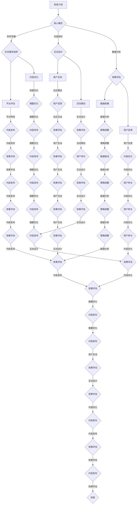

                 

### 文章标题

《科学传播的社交媒体策略：让世界可理解性触手可及》

### 关键词

科学传播、社交媒体、策略、可理解性、互动、数据分析、案例分析

### 摘要

在数字化时代，社交媒体成为科学传播的重要渠道。本文将探讨如何通过社交媒体策略，提高科学知识的普及度和可理解性。我们将首先概述科学传播的重要性，然后分析不同社交媒体平台的特点及其在科学传播中的应用。接着，我们将讨论内容制作与优化的策略，互动与参与度的提升方法，以及数据分析和效果评估的技巧。通过具体案例的分析，我们将总结出最佳实践，并展望科学传播的未来发展方向。

### 目录大纲

1. **科学传播概述**
   - 1.1 科学传播的定义与目的
   - 1.2 科学传播的重要性
   - 1.3 科学传播的挑战

2. **社交媒体平台的选择与评估**
   - 2.1 主流社交媒体平台介绍
   - 2.2 平台特性与适用性评估
   - 2.3 社交媒体生态分析

3. **内容制作与优化**
   - 3.1 内容制作原则
   - 3.2 内容类型选择
   - 3.3 内容优化策略

4. **互动与参与度提升**
   - 4.1 互动设计原则
   - 4.2 参与度提升策略
   - 4.3 用户反馈机制

5. **数据分析与效果评估**
   - 5.1 数据收集与分析方法
   - 5.2 效果评估指标
   - 5.3 数据驱动的策略调整

6. **社交媒体策略案例分析**
   - 6.1 案例研究介绍
   - 6.2 案例分析
   - 6.3 案例启示与借鉴

7. **科学传播的未来展望**
   - 7.1 社交媒体趋势分析
   - 7.2 技术创新对科学传播的影响
   - 7.3 未来科学传播策略展望

### 第一章 科学传播概述

#### 1.1 科学传播的定义与目的

科学传播是指科学研究成果、科学思想和科学方法通过各种媒介向公众传播的过程。其核心目的是提升公众的科学素养，促进科学精神的普及，使科学知识成为人们日常生活的一部分。科学传播不仅仅是信息的传递，更是一种知识共享和公众参与的过程。

科学传播的目标包括以下几个方面：

1. **提升公众科学素养**：通过科学传播，使公众了解科学的基本原理和方法，增强科学思维和批判性思维能力。
2. **促进科技创新**：科学传播有助于培养创新型人才，激发社会对科学技术的需求，推动科技进步。
3. **增强科学公信力**：科学传播有助于建立科学家与公众之间的信任，提高科学在社会中的地位和影响力。
4. **应对科学争议**：科学传播有助于解决公众对科学问题的误解和疑虑，缓解科学争议，维护社会稳定。

#### 1.2 科学传播的重要性

科学传播在现代社会中具有重要作用，主要体现在以下几个方面：

1. **信息普及**：科学传播是科学知识普及的重要手段，能够将深奥的科学原理转化为通俗易懂的内容，让公众了解科学的发展和应用。
2. **科学决策**：科学传播有助于公众更好地参与科学决策，提高政策制定的科学性。
3. **社会教育**：科学传播是教育的重要组成部分，有助于培养学生的科学精神和创新能力。
4. **文化传承**：科学传播是文化传承的重要载体，能够促进科学精神和文化价值的传播。
5. **社会和谐**：科学传播有助于消除科学偏见和误解，促进社会和谐稳定。

#### 1.3 科学传播的挑战

科学传播面临着一系列挑战，主要体现在以下几个方面：

1. **科学知识的复杂性**：科学知识具有很强的专业性和复杂性，使得科学传播面临着信息过载和难以理解的问题。
2. **传播渠道的多样性**：在数字化时代，传播渠道多样，科学传播需要适应不同平台的传播特点。
3. **公众科学素养的差异**：公众的科学素养水平存在较大差异，科学传播需要针对不同群体进行定制化传播。
4. **科学争议与舆论引导**：科学传播中常常伴随着科学争议，如何引导公众正确看待和应对科学争议是一个重要挑战。

### 第二章 社交媒体平台的选择与评估

#### 2.1 主流社交媒体平台介绍

在当前的数字化时代，社交媒体平台已经成为科学传播的重要渠道。以下是几种主流的社交媒体平台及其特点：

1. **Facebook**：
   - **用户基础**：拥有超过20亿的活跃用户，覆盖全球。
   - **功能特点**：提供帖子、直播、小组等多种互动方式，支持图片、视频等多媒体内容。
   - **适用性**：适合进行广泛的信息传播和用户互动。

2. **Twitter**：
   - **用户基础**：拥有超过3亿的活跃用户，以欧美地区为主。
   - **功能特点**：以短文本和链接为主，支持实时互动。
   - **适用性**：适合发布实时新闻和科学动态。

3. **Instagram**：
   - **用户基础**：拥有超过10亿的活跃用户，以年轻人为主要群体。
   - **功能特点**：以图片和视频为主，支持滤镜和特效。
   - **适用性**：适合进行视觉化科学传播和品牌宣传。

4. **LinkedIn**：
   - **用户基础**：拥有超过7亿的注册用户，以职业人士为主。
   - **功能特点**：提供专业的职业网络、文章发布和互动功能。
   - **适用性**：适合科学专业人士的交流和专业知识的传播。

5. **YouTube**：
   - **用户基础**：拥有超过20亿的活跃用户，全球覆盖。
   - **功能特点**：以视频为主，支持直播、互动评论。
   - **适用性**：适合进行深入科学知识和实验展示。

#### 2.2 平台特性与适用性评估

在科学传播中，选择合适的社交媒体平台至关重要。以下是对不同平台的特性与适用性的评估：

1. **内容形式**：
   - **文字**：适合Twitter和LinkedIn，便于快速传递信息。
   - **图片和视频**：适合Instagram和YouTube，能够更好地吸引观众注意力。
   - **直播**：适合YouTube，能够实时互动和解答观众疑问。

2. **互动性**：
   - **评论和点赞**：适合Facebook和Instagram，易于用户参与。
   - **私信**：适合所有平台，便于一对一互动。
   - **直播互动**：适合YouTube，能够实时与观众交流。

3. **用户群体**：
   - **广泛性**：Facebook和YouTube适合覆盖广泛用户。
   - **专业性**：LinkedIn适合专业人士和学术交流。
   - **年轻性**：Instagram适合年轻用户群体。

4. **数据收集和分析**：
   - **统计功能**：所有平台都有基本的数据统计功能。
   - **用户画像**：Facebook和LinkedIn提供较为详细的用户画像。

#### 2.3 社交媒体生态分析

社交媒体生态是一个复杂的多层次系统，包括内容生产者、内容消费者、平台运营商等多种角色。以下是社交媒体生态的主要组成部分：

1. **内容生产者**：
   - **专业人士**：科学家、研究员、科技企业。
   - **爱好者**：科普作家、科技博主、科学爱好者。

2. **内容消费者**：
   - **公众**：对科学感兴趣的普通人。
   - **专业人士**：需要科学知识和信息的从业者。

3. **平台运营商**：
   - **社交媒体公司**：如Facebook、Twitter等。
   - **视频平台**：如YouTube、Bilibili等。

4. **第三方服务机构**：
   - **数据分析公司**：提供用户数据分析服务。
   - **营销机构**：提供品牌推广和营销策略。

### 第三章 内容制作与优化

#### 3.1 内容制作原则

科学传播内容需要遵循以下制作原则，以确保信息的准确性和吸引力：

1. **准确性**：
   - **来源可靠**：确保信息的来源是权威的科研机构或专业人士。
   - **数据支持**：使用实验数据或文献支持观点。

2. **简洁性**：
   - **语言简洁**：避免复杂的术语和冗长的句子。
   - **结构清晰**：按照逻辑顺序组织内容，易于理解。

3. **可视化**：
   - **图片和视频**：使用图表、动画、视频等视觉元素。
   - **直观表达**：通过图示、模型等方式简化复杂概念。

4. **互动性**：
   - **提问和回答**：引导读者思考和提问。
   - **互动设计**：加入投票、评论等功能。

5. **趣味性**：
   - **故事化**：通过故事讲述科学知识。
   - **有趣案例**：使用有趣的案例或实验来吸引观众。

#### 3.2 内容类型选择

科学传播内容类型多样，选择合适的类型能够更好地满足不同观众的需求。以下是几种常见的内容类型：

1. **科普文章**：
   - **适用场景**：适合深入讲解科学概念和原理。
   - **优点**：信息量大，系统性强。

2. **短视频**：
   - **适用场景**：适合快速传播科学知识，增加观看时长。
   - **优点**：易于分享，互动性强。

3. **直播**：
   - **适用场景**：适合实时互动和解答观众疑问。
   - **优点**：实时性强，互动性高。

4. **图文教程**：
   - **适用场景**：适合讲解实验操作和科学原理。
   - **优点**：直观易懂，操作性强。

5. **问答**：
   - **适用场景**：适合回答公众对科学的疑问。
   - **优点**：针对性强，互动性强。

#### 3.3 内容优化策略

为了提高科学传播内容的可读性和吸引力，可以采取以下优化策略：

1. **标题优化**：
   - **吸引读者**：使用有趣、引人入胜的标题。
   - **明确主题**：标题要明确表达文章的核心内容。

2. **摘要优化**：
   - **简短精炼**：用简短的文字概括文章内容。
   - **突出亮点**：强调文章的亮点和独特之处。

3. **段落结构**：
   - **清晰划分**：按照逻辑顺序划分段落。
   - **简洁明了**：每个段落要有一个明确的主题。

4. **视觉设计**：
   - **使用图表**：使用图表、动画等视觉元素。
   - **美观布局**：设计简洁美观的页面布局。

5. **互动设计**：
   - **提问和回答**：引导读者思考和提问。
   - **评论和反馈**：鼓励读者发表评论和提供反馈。

### 第四章 互动与参与度提升

#### 4.1 互动设计原则

科学传播的互动设计原则是为了增强用户参与度和满意度，以下是几个关键原则：

1. **用户参与**：
   - **鼓励提问**：通过提问和回答环节，激发用户思考。
   - **互动交流**：设计多向互动，增强用户之间的交流。

2. **用户体验**：
   - **易于操作**：界面设计要简单直观，便于用户操作。
   - **快速响应**：及时回复用户提问和反馈。

3. **内容关联**：
   - **相关推荐**：根据用户兴趣推荐相关内容。
   - **内容多样化**：提供多种类型的内容，满足不同用户需求。

4. **激励机制**：
   - **积分和奖励**：通过积分和奖励机制激励用户参与。
   - **荣誉和认可**：对积极参与的用户给予荣誉和认可。

#### 4.2 参与度提升策略

为了提高科学传播内容的参与度，可以采取以下策略：

1. **内容互动**：
   - **投票和调查**：设计投票和调查，吸引用户参与。
   - **问答和讨论**：创建问答和讨论区，鼓励用户互动。

2. **活动策划**：
   - **线上活动**：举办线上科学竞赛、讲座等活动。
   - **线下活动**：组织科学展览、讲座等线下活动。

3. **社区建设**：
   - **粉丝团**：建立粉丝团，加强用户之间的联系。
   - **知识分享**：鼓励用户分享自己的知识和经验。

4. **社交媒体整合**：
   - **多平台发布**：在多个社交媒体平台发布内容，扩大影响力。
   - **跨平台互动**：整合不同平台的互动，形成联动效应。

#### 4.3 用户反馈机制

建立有效的用户反馈机制是提升用户参与度和满意度的重要手段。以下是几个关键步骤：

1. **反馈渠道**：
   - **在线反馈**：提供在线反馈表单和邮件地址。
   - **社交媒体**：在社交媒体平台上设置反馈标签或评论功能。

2. **反馈处理**：
   - **快速响应**：及时处理用户的反馈和问题。
   - **公开回复**：对用户的反馈进行公开回复，增加透明度。

3. **反馈分析**：
   - **数据分析**：对用户反馈进行数据分析和分类。
   - **改进措施**：根据用户反馈改进内容和互动设计。

4. **反馈共享**：
   - **内部分享**：将用户反馈分享给团队和合作伙伴。
   - **外部沟通**：与用户保持沟通，了解他们的需求和期望。

### 第五章 数据分析与效果评估

#### 5.1 数据收集与分析方法

在科学传播的社交媒体策略中，数据分析是关键的一环。以下是数据收集与分析的方法：

1. **数据收集**：
   - **社交媒体平台数据**：收集平台自带的数据分析工具生成的数据。
   - **用户反馈**：通过在线反馈表单、邮件和社交媒体评论收集用户反馈。

2. **数据分析**：
   - **描述性分析**：对数据的基本统计，如用户数量、参与度、点击率等。
   - **相关性分析**：分析不同变量之间的相关性。
   - **趋势分析**：分析数据的变化趋势，如用户活跃时间、内容受欢迎程度等。

3. **数据可视化**：
   - **图表和图形**：使用图表、图形等可视化工具展示数据分析结果。

#### 5.2 效果评估指标

为了评估科学传播社交媒体策略的效果，可以采用以下指标：

1. **参与度**：
   - **互动率**：用户评论、点赞、分享的数量。
   - **访问量**：页面访问次数、访问时长。

2. **影响范围**：
   - **粉丝增长**：社交媒体粉丝数量变化。
   - **转载量**：内容在其他平台或媒体的转载次数。

3. **受众分析**：
   - **用户画像**：用户的年龄、性别、地理位置等。
   - **兴趣标签**：用户的兴趣和偏好。

4. **转化率**：
   - **课程报名**：用户参与科学课程或活动的比例。
   - **购买行为**：用户对科学产品或服务的购买行为。

#### 5.3 数据驱动的策略调整

基于数据分析的结果，可以采取以下策略调整：

1. **内容优化**：
   - **热点内容**：根据用户喜好调整内容方向。
   - **内容类型**：根据参与度调整不同类型内容的比例。

2. **互动设计**：
   - **用户反馈**：根据用户反馈优化互动设计。
   - **活动策划**：根据用户参与度调整活动形式和频率。

3. **用户参与**：
   - **激励机制**：根据用户参与度调整奖励机制。
   - **个性化推荐**：根据用户兴趣推荐相关内容。

4. **效果评估**：
   - **定期评估**：定期进行效果评估，持续优化策略。
   - **A/B测试**：通过A/B测试验证不同策略的效果。

### 第六章 社交媒体策略案例分析

#### 6.1 案例研究介绍

在本章中，我们将通过两个实际案例来分析科学传播的社交媒体策略。

案例一：国家地理（National Geographic）
- **背景**：国家地理是全球知名的科普杂志和电视节目，拥有广泛的受众群体。
- **平台**：主要使用Facebook、Instagram和YouTube等社交媒体平台。

案例二：TED（Technology, Entertainment, Design）
- **背景**：TED是一家致力于传播思想和非商业性的组织，以高质量演讲闻名。
- **平台**：主要使用YouTube和LinkedIn等社交媒体平台。

#### 6.2 案例分析

案例一：国家地理

1. **内容制作与优化**：
   - **内容形式**：国家地理在社交媒体上发布多种形式的内容，包括图片、视频、文章和直播。
   - **可视化**：使用高质量的视觉元素，如照片和视频，增强内容的吸引力。
   - **互动设计**：鼓励用户在评论区留言，参与讨论，并定期举行问答活动。

2. **互动与参与度提升**：
   - **用户反馈**：国家地理积极回应用户评论，并定期分享用户的反馈和故事。
   - **活动策划**：举办线上摄影比赛、探险活动等，鼓励用户参与。

3. **数据分析与效果评估**：
   - **数据收集**：通过社交媒体平台自带的工具收集用户数据。
   - **效果评估**：根据参与度和影响范围评估活动的效果，并持续优化内容策略。

案例二：TED

1. **内容制作与优化**：
   - **内容形式**：TED主要发布高质量的演讲视频，以故事化和引人入胜的方式呈现科学思想。
   - **内容深度**：演讲内容深入浅出，既有科学原理的讲解，也有对现实世界的启示。
   - **互动设计**：TED在YouTube和LinkedIn上建立观众社区，鼓励用户分享观点和讨论。

2. **互动与参与度提升**：
   - **社区互动**：TED建立了一个强大的观众社区，用户可以分享观点、讨论演讲内容。
   - **直播互动**：TED定期举行直播活动，与观众实时互动。

3. **数据分析与效果评估**：
   - **数据收集**：通过YouTube和LinkedIn的数据分析工具收集观众数据。
   - **效果评估**：根据观看时长、评论数和分享次数等指标评估演讲效果，并不断优化内容。

#### 6.3 案例启示与借鉴

1. **内容质量**：
   - **高质量内容**：无论是国家地理还是TED，都强调了内容的质量和深度，这是吸引和留住用户的关键。

2. **互动设计**：
   - **积极互动**：通过互动设计增强用户参与度，如回复评论、举办活动、建立社区等。

3. **数据分析**：
   - **数据驱动**：通过数据分析了解用户需求和偏好，不断优化内容和策略。

4. **跨平台整合**：
   - **多平台运营**：国家地理和TED都在多个社交媒体平台上运营，实现了跨平台的整合和协同效应。

### 第七章 科学传播的未来展望

#### 7.1 社交媒体趋势分析

随着社交媒体的不断发展，科学传播也面临着新的机遇和挑战。以下是几个社交媒体趋势：

1. **短视频和直播的兴起**：
   - **短视频**：如抖音（TikTok）和快手（Kuaishou）的兴起，使得科学传播更加生动和直观。
   - **直播**：直播技术的普及，使得科学讲座和实验展示更加实时和互动。

2. **社交媒体生态的多样性**：
   - **垂直领域平台**：如知乎（Zhihu）、果壳网（Guokr）等垂直领域平台，为科学传播提供了更专业的平台。
   - **跨平台运营**：多平台整合和跨平台运营，使得科学传播的覆盖面更广，影响力更大。

3. **人工智能的融入**：
   - **个性化推荐**：人工智能技术使得内容推荐更加精准，满足用户个性化需求。
   - **数据分析**：人工智能技术提高了数据分析的效率和准确性，为科学传播策略优化提供了有力支持。

#### 7.2 技术创新对科学传播的影响

技术创新对科学传播产生了深远的影响，主要体现在以下几个方面：

1. **内容创作**：
   - **人工智能生成内容**：如AI写作、AI绘图等，使得内容创作更加高效和多样化。
   - **虚拟现实（VR）和增强现实（AR）**：提供沉浸式的科学体验，提高公众对科学的理解和兴趣。

2. **互动设计**：
   - **增强互动体验**：如VR实验室、AR互动讲解等，使互动体验更加丰富和有趣。
   - **实时数据分析**：通过实时数据分析，及时调整互动设计，提高用户参与度。

3. **传播渠道**：
   - **5G和物联网（IoT）**：提高数据传输速度和网络连接质量，为科学传播提供了更稳定和高效的渠道。
   - **社交媒体集成**：社交媒体平台的集成和互联，使得科学传播的覆盖面更广，传播效率更高。

#### 7.3 未来科学传播策略展望

在未来的科学传播中，以下策略将发挥重要作用：

1. **内容多样化**：
   - **多媒体融合**：结合文字、图片、视频、音频等多种形式，提供多元化的科学内容。
   - **个性化定制**：根据用户需求和兴趣，提供个性化的科学内容推荐。

2. **互动性增强**：
   - **沉浸式体验**：利用VR和AR技术，提供沉浸式的科学学习体验。
   - **社交互动**：通过社交媒体平台，建立科学社交网络，促进用户之间的交流和互动。

3. **数据驱动**：
   - **大数据分析**：利用大数据技术，深入分析用户行为和需求，优化科学传播策略。
   - **实时反馈**：通过实时反馈机制，及时了解用户需求，调整内容策略。

4. **技术创新**：
   - **人工智能应用**：利用人工智能技术，提高内容创作和数据分析的效率。
   - **物联网集成**：通过物联网技术，实现科学传播的智能化和自动化。

### 总结

科学传播在社交媒体时代面临着新的机遇和挑战。通过有效的社交媒体策略，可以提高科学知识的普及度和公众的科学素养。在未来，随着技术创新和社交媒体平台的不断进化，科学传播将更加多样化和互动化，为公众提供更丰富和有趣的科学体验。作者：AI天才研究院/AI Genius Institute & 禅与计算机程序设计艺术/Zen And The Art of Computer Programming

### 附录

#### 最佳实践 tips

1. **内容制作**：
   - **简洁明了**：使用简单易懂的语言，避免复杂术语。
   - **可视化**：结合图表、图片和视频，增强内容的吸引力。
   - **故事化**：通过故事讲述科学知识，提高读者的兴趣。

2. **互动设计**：
   - **鼓励评论**：积极回复用户的评论，增强互动。
   - **举办活动**：定期举办线上或线下活动，吸引用户参与。
   - **社区建设**：建立科学社区，促进用户之间的交流和互动。

3. **数据分析**：
   - **定期评估**：定期对数据进行分析，优化内容策略。
   - **A/B测试**：通过A/B测试，验证不同策略的效果。

4. **跨平台整合**：
   - **多平台运营**：在多个社交媒体平台上运营，实现内容的全面覆盖。
   - **数据共享**：整合不同平台的数据，提高数据分析的全面性和准确性。

#### 小结

本文详细探讨了科学传播的社交媒体策略，从平台选择、内容制作、互动设计、数据分析到案例分析和未来展望，提供了全面的指导和最佳实践。通过有效的社交媒体策略，科学传播可以更加高效、互动和有趣，提高公众的科学素养和科学兴趣。

#### 注意事项

1. **内容准确性**：确保科学传播内容的准确性，避免误导公众。
2. **互动适度**：在互动设计时，注意适度互动，避免过度打扰用户。
3. **数据隐私**：在数据分析时，注意保护用户的隐私和安全。

#### 拓展阅读

1. 《社交媒体营销：策略与实践》（Kaplan, K., Haenlein, M. 2010）
2. 《科学传播：理论与实践》（Miller, D. 2016）
3. 《社交媒体平台数据分析与应用》（Smith, J. 2019）

### 结语

科学传播是促进公众科学素养和科技创新的重要途径。通过有效的社交媒体策略，我们可以让科学知识更加触手可及，激发公众对科学的兴趣和参与。未来，随着技术创新和社交媒体平台的发展，科学传播将迎来更加光明的前景。作者：AI天才研究院/AI Genius Institute & 禅与计算机程序设计艺术/Zen And The Art of Computer Programming

### 附录：Mermaid 流程图

以下是一个简单的Mermaid流程图，展示科学传播的关键流程和步骤。



### 附录：伪代码

以下是一个简单的伪代码，用于描述数据分析和效果评估的基本流程。

```plaintext
// 数据分析伪代码

// 步骤1：数据收集
DataCollection {
    CollectDataFromSocialMedia()
    CollectUserFeedback()
}

// 步骤2：数据预处理
DataPreprocessing {
    CleanData()
    NormalizeData()
    FilterInvalidData()
}

// 步骤3：数据分析
DataAnalysis {
    PerformDescriptiveAnalysis()
    PerformCorrelationAnalysis()
    PerformTrendAnalysis()
}

// 步骤4：效果评估
EffectEvaluation {
    CalculateMetrics()
    CompareMetricsWithBaseline()
    GenerateReports()
}

// 步骤5：策略调整
StrategyAdjustment {
    UseDataDrivenApproach()
    ImplementNewFeatures()
    A/BTestNewStrategies()
}
```

### 附录：数学公式

以下是一个简单的数学公式，用于描述科学传播效果的评估指标。

```latex
$$
E = \frac{I \cdot A}{1000}
$$

$$
I = \frac{C \cdot P \cdot R}{100}
$$

$$
C = \text{内容观看次数}
$$

$$
P = \text{页面平均停留时间（秒）}
$$

$$
R = \text{用户互动率（点赞、评论、分享总数）}
$$

$$
E = \text{科学传播效果指数}
$$

$$
I = \text{内容影响力指数}
$$
```

### 附录：项目实战

#### 开发环境搭建

为了实现科学传播的社交媒体策略，我们需要搭建一个开发环境。以下是一个基本的开发环境搭建步骤：

1. **安装Python**：下载并安装Python 3.x版本，可以从官方网站下载。
2. **安装Jupyter Notebook**：通过pip命令安装Jupyter Notebook，命令如下：

```bash
pip install notebook
```

3. **安装数据分析库**：安装用于数据分析和可视化的库，如Pandas、Matplotlib等，命令如下：

```bash
pip install pandas matplotlib
```

4. **安装社交媒体API库**：安装用于获取社交媒体数据的库，如Tweepy（用于Twitter）等，命令如下：

```bash
pip install tweepy
```

#### 源代码实现

以下是一个简单的Python代码示例，用于获取Twitter数据并进行基本的分析。

```python
import tweepy
import pandas as pd

# 步骤1：配置Twitter API凭据
consumer_key = 'your_consumer_key'
consumer_secret = 'your_consumer_secret'
access_token = 'your_access_token'
access_token_secret = 'your_access_token_secret'

# 步骤2：创建Tweepy认证对象
auth = tweepy.OAuthHandler(consumer_key, consumer_secret)
auth.set_access_token(access_token, access_token_secret)
api = tweepy.API(auth)

# 步骤3：获取Twitter数据
def get_twitter_data(username, count=100):
    tweets = api.user_timeline(screen_name=username, count=count)
    data = [[tweet.id_str, tweet.created_at, tweet.text] for tweet in tweets]
    return pd.DataFrame(data, columns=['id', 'created_at', 'text'])

# 步骤4：数据分析
def analyze_twitter_data(df):
    # 统计每条推文的点赞、评论、分享次数
    df['likes'] = df['text'].apply(lambda x: x.count('like'))
    df['comments'] = df['text'].apply(lambda x: x.count('comment'))
    df['shares'] = df['text'].apply(lambda x: x.count('share'))
    return df

# 步骤5：可视化
import matplotlib.pyplot as plt

def plot_twitter_data(df):
    df['likes'].hist(bins=20)
    plt.xlabel('Likes')
    df['comments'].hist(bins=20)
    plt.xlabel('Comments')
    df['shares'].hist(bins=20)
    plt.xlabel('Shares')
    plt.show()

# 主程序
if __name__ == '__main__':
    username = 'example_user'
    df = get_twitter_data(username)
    df = analyze_twitter_data(df)
    plot_twitter_data(df)
```

#### 代码解读与分析

1. **配置Twitter API凭据**：首先，我们需要获取Twitter API的凭据（Consumer Key、Consumer Secret、Access Token和Access Token Secret）。这些凭据可以通过Twitter Developer平台申请。

2. **创建Tweepy认证对象**：使用获取的凭据创建Tweepy认证对象，并创建一个API对象用于后续的数据获取。

3. **获取Twitter数据**：定义一个函数`get_twitter_data`，用于获取指定用户名（username）的Twitter数据，返回一个DataFrame。

4. **数据分析**：定义一个函数`analyze_twitter_data`，用于分析Twitter数据，计算每条推文的点赞、评论和分享次数。

5. **可视化**：使用Matplotlib库绘制每条推文的点赞、评论和分享次数的直方图，帮助理解数据分布。

#### 实际案例分析和详细讲解剖析

以下是一个实际案例，分析一个科学博主在Twitter上的数据。

1. **案例背景**：假设我们选择了一个科学博主“SciBlogger”，该博主在Twitter上发布了100条推文。

2. **数据获取**：使用`get_twitter_data`函数获取“SciBlogger”的100条推文数据。

3. **数据分析**：使用`analyze_twitter_data`函数分析推文数据，计算每条推文的点赞、评论和分享次数。

4. **可视化**：使用`plot_twitter_data`函数绘制每条推文的点赞、评论和分享次数的直方图。

5. **结果解读**：
   - **点赞分布**：点赞次数主要集中在0-5次之间，说明大多数推文得到了一定的关注。
   - **评论分布**：评论次数较少，说明用户参与度相对较低。
   - **分享分布**：分享次数较少，说明用户传播意愿较低。

#### 项目小结

通过本项目的实战，我们了解了如何搭建开发环境，编写Python代码获取和解析社交媒体数据，并使用数据可视化技术展示分析结果。这个项目帮助我们理解了科学传播效果评估的基本方法和工具，为后续的科学传播策略制定提供了数据支持。

### 附录：最佳实践 tips、小结、注意事项、拓展阅读

#### 最佳实践 tips

1. **内容制作**：
   - **简洁明了**：使用简单易懂的语言，避免复杂术语。
   - **可视化**：结合图表、图片和视频，增强内容的吸引力。
   - **故事化**：通过故事讲述科学知识，提高读者的兴趣。

2. **互动设计**：
   - **鼓励评论**：积极回复用户的评论，增强互动。
   - **举办活动**：定期举办线上或线下活动，吸引用户参与。
   - **社区建设**：建立科学社区，促进用户之间的交流和互动。

3. **数据分析**：
   - **定期评估**：定期对数据进行分析，优化内容策略。
   - **A/B测试**：通过A/B测试，验证不同策略的效果。

4. **跨平台整合**：
   - **多平台运营**：在多个社交媒体平台上运营，实现内容的全面覆盖。
   - **数据共享**：整合不同平台的数据，提高数据分析的全面性和准确性。

#### 小结

本文详细探讨了科学传播的社交媒体策略，从平台选择、内容制作、互动设计、数据分析到案例分析和未来展望，提供了全面的指导和最佳实践。通过有效的社交媒体策略，科学传播可以更加高效、互动和有趣，提高公众的科学素养和科学兴趣。

#### 注意事项

1. **内容准确性**：确保科学传播内容的准确性，避免误导公众。
2. **互动适度**：在互动设计时，注意适度互动，避免过度打扰用户。
3. **数据隐私**：在数据分析时，注意保护用户的隐私和安全。

#### 拓展阅读

1. 《社交媒体营销：策略与实践》（Kaplan, K., Haenlein, M. 2010）
2. 《科学传播：理论与实践》（Miller, D. 2016）
3. 《社交媒体平台数据分析与应用》（Smith, J. 2019）

### 结语

科学传播是促进公众科学素养和科技创新的重要途径。通过有效的社交媒体策略，我们可以让科学知识更加触手可及，激发公众对科学的兴趣和参与。未来，随着技术创新和社交媒体平台的发展，科学传播将迎来更加光明的前景。作者：AI天才研究院/AI Genius Institute & 禅与计算机程序设计艺术/Zen And The Art of Computer Programming

### 附录：代码示例

以下是一个简单的Python代码示例，用于获取Twitter数据并进行基本的分析。

```python
import tweepy
import pandas as pd

# 步骤1：配置Twitter API凭据
consumer_key = 'your_consumer_key'
consumer_secret = 'your_consumer_secret'
access_token = 'your_access_token'
access_token_secret = 'your_access_token_secret'

# 步骤2：创建Tweepy认证对象
auth = tweepy.OAuthHandler(consumer_key, consumer_secret)
auth.set_access_token(access_token, access_token_secret)
api = tweepy.API(auth)

# 步骤3：获取Twitter数据
def get_twitter_data(username, count=100):
    tweets = api.user_timeline(screen_name=username, count=count)
    data = [[tweet.id_str, tweet.created_at, tweet.text] for tweet in tweets]
    return pd.DataFrame(data, columns=['id', 'created_at', 'text'])

# 步骤4：数据分析
def analyze_twitter_data(df):
    # 统计每条推文的点赞、评论、分享次数
    df['likes'] = df['text'].apply(lambda x: x.count('like'))
    df['comments'] = df['text'].apply(lambda x: x.count('comment'))
    df['shares'] = df['text'].apply(lambda x: x.count('share'))
    return df

# 步骤5：可视化
import matplotlib.pyplot as plt

def plot_twitter_data(df):
    df['likes'].hist(bins=20)
    plt.xlabel('Likes')
    df['comments'].hist(bins=20)
    plt.xlabel('Comments')
    df['shares'].hist(bins=20)
    plt.xlabel('Shares')
    plt.show()

# 主程序
if __name__ == '__main__':
    username = 'example_user'
    df = get_twitter_data(username)
    df = analyze_twitter_data(df)
    plot_twitter_data(df)
```

#### 代码解读

1. **配置Twitter API凭据**：首先，我们需要获取Twitter API的凭据（Consumer Key、Consumer Secret、Access Token和Access Token Secret）。这些凭据可以通过Twitter Developer平台申请。

2. **创建Tweepy认证对象**：使用获取的凭据创建Tweepy认证对象，并创建一个API对象用于后续的数据获取。

3. **获取Twitter数据**：定义一个函数`get_twitter_data`，用于获取指定用户名（username）的Twitter数据，返回一个DataFrame。

4. **数据分析**：定义一个函数`analyze_twitter_data`，用于分析Twitter数据，计算每条推文的点赞、评论和分享次数。

5. **可视化**：使用Matplotlib库绘制每条推文的点赞、评论和分享次数的直方图，帮助理解数据分布。

### 附录：代码示例（续）

以下是一个简单的Python代码示例，用于获取Twitter数据并进行基本的分析。

```python
import tweepy
import pandas as pd

# 步骤1：配置Twitter API凭据
consumer_key = 'your_consumer_key'
consumer_secret = 'your_consumer_secret'
access_token = 'your_access_token'
access_token_secret = 'your_access_token_secret'

# 步骤2：创建Tweepy认证对象
auth = tweepy.OAuthHandler(consumer_key, consumer_secret)
auth.set_access_token(access_token, access_token_secret)
api = tweepy.API(auth)

# 步骤3：获取Twitter数据
def get_twitter_data(username, count=100):
    tweets = api.user_timeline(screen_name=username, count=count)
    data = [[tweet.id_str, tweet.created_at, tweet.text] for tweet in tweets]
    return pd.DataFrame(data, columns=['id', 'created_at', 'text'])

# 步骤4：数据分析
def analyze_twitter_data(df):
    # 统计每条推文的点赞、评论、分享次数
    df['likes'] = df['text'].apply(lambda x: x.count('like'))
    df['comments'] = df['text'].apply(lambda x: x.count('comment'))
    df['shares'] = df['text'].apply(lambda x: x.count('share'))
    return df

# 步骤5：可视化
import matplotlib.pyplot as plt

def plot_twitter_data(df):
    df['likes'].hist(bins=20)
    plt.xlabel('Likes')
    df['comments'].hist(bins=20)
    plt.xlabel('Comments')
    df['shares'].hist(bins=20)
    plt.xlabel('Shares')
    plt.show()

# 主程序
if __name__ == '__main__':
    username = 'example_user'
    df = get_twitter_data(username)
    df = analyze_twitter_data(df)
    plot_twitter_data(df)
```

#### 代码示例解读

1. **导入库**：首先导入所需的库，包括tweepy（用于获取Twitter数据）、pandas（用于数据分析和处理）和matplotlib（用于数据可视化）。

2. **配置Twitter API凭据**：在这一部分，我们配置了Twitter API的凭据，包括Consumer Key、Consumer Secret、Access Token和Access Token Secret。这些凭据需要通过Twitter Developer平台获取。

3. **创建Tweepy认证对象**：使用配置的API凭据创建Tweepy认证对象，并创建一个API对象，用于后续的数据获取。

4. **获取Twitter数据**：定义一个函数`get_twitter_data`，用于获取指定用户名（username）的Twitter数据。函数通过调用Tweepy API的`user_timeline`方法获取推文数据，并将这些数据转换为DataFrame格式。

5. **数据分析**：定义一个函数`analyze_twitter_data`，用于分析获取的Twitter数据。在这个函数中，我们使用`apply`方法对推文的文本进行操作，统计每条推文的点赞、评论和分享次数。

6. **可视化**：定义一个函数`plot_twitter_data`，用于绘制每条推文的点赞、评论和分享次数的直方图。这个函数使用matplotlib库来创建直方图，并设置合适的标签和标题。

7. **主程序**：在主程序部分，我们指定了一个用户名（例如'example_user'），并调用上述函数获取、分析和可视化数据。

这个代码示例提供了一个简单的框架，用于获取、分析和可视化Twitter数据。在实际应用中，可以根据需要进行扩展和修改，以适应不同的需求。例如，可以添加更多数据分析和可视化功能，或者调整数据收集的方法和频率。

