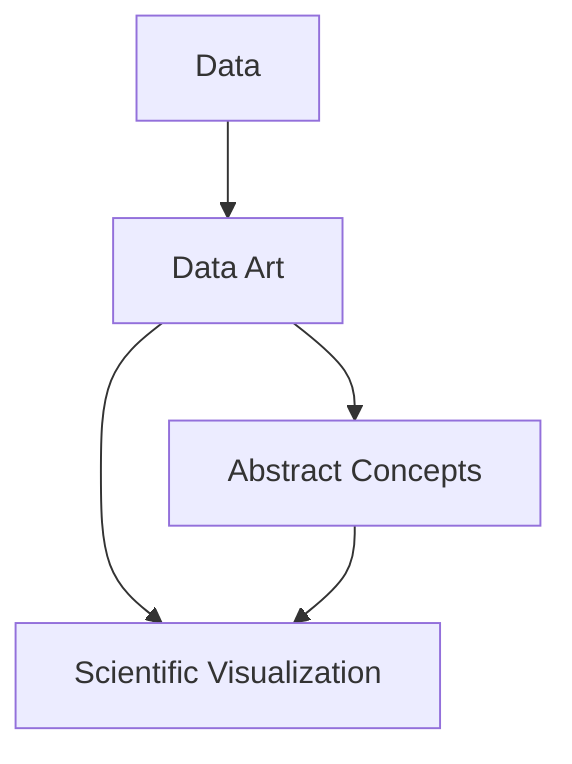

                 

Certainly! Let's break down the task step by step, ensuring that each section of the article is comprehensive and well-structured.

### Step 1: Draft the Introduction

**Introduction**
- **Background Introduction**: Explain the importance of scientific visualization and data art in modern scientific research and data analysis.
- **Core Concept Connection**: Use a Mermaid flowchart to illustrate how scientific visualization, data art, and abstract concept understanding are interconnected.



### Step 2: Explain Scientific Visualization Techniques

**Chapter 1: Scientific Visualization Techniques**
- **Historical Overview**: Discuss the evolution of scientific visualization, highlighting key milestones and the impact of advancements in technology.
- **Importance in Research**: Explain why visualization is crucial for scientific discovery, enabling researchers to grasp complex data patterns and relationships.
- **Basic Techniques**: Detail various visualization techniques such as 2D and 3D charts, spatial visualization, and temporal visualization.

### Step 3: Explore Data Art

**Chapter 2: The Art of Data Visualization**
- **Data Art Definition**: Define data art as a blend of visual aesthetics and data representation.
- **Principles of Design**: Discuss the principles of design that underpin effective data visualization, including color theory, composition, and typography.
- **Case Studies**: Provide examples of how data art has been used in various fields, showcasing its impact on communication and understanding.

### Step 4: Visualizing Abstract Concepts

**Chapter 3: Visualizing Abstract Concepts**
- **Challenges of Abstract Visualization**: Discuss the challenges of representing abstract concepts and ideas visually.
- **Techniques for Abstract Visualization**: Explore techniques such as metaphors, analogy, and abstract visual storytelling to convey abstract concepts.
- **Case Studies**: Present case studies where abstract concepts have been successfully visualized, providing insights into the effectiveness of these techniques.

### Step 5: Core Algorithms and Models

**Chapter 4: Core Algorithms and Models for Scientific Visualization**
- **Algorithm Basics**: Explain fundamental algorithms used in scientific visualization, such as hierarchical clustering and multidimensional scaling.
- **Pseudo-code and Explanations**: Provide pseudo-code for key algorithms to illustrate their logic and steps.
- **Mathematical Models**: Describe core mathematical models used in visualization, including equations and their applications.

```latex
% Example of a mathematical formula
$$
    f(x) = \frac{1}{1 + e^{-x}}
$$
```

### Step 6: Practical Applications and Projects

**Chapter 5: Practical Applications and Projects**
- **Development Environment Setup**: Guide readers through setting up a development environment for scientific visualization projects.
- **Source Code and Implementation**: Provide detailed source code for a visualization project, explaining each part.
- **Code Analysis and Interpretation**: Analyze the code to highlight key concepts and techniques.
- **Case Analysis and Discussion**: Discuss the project in the context of scientific research or data analysis, providing insights and lessons learned.

### Step 7: Conclusion and Best Practices

**Conclusion**
- **Summary**: Recap the main points covered in the article and their significance.
- **Best Practices**: Offer tips and best practices for those looking to enhance their scientific visualization skills.
- **Future Directions**: Suggest future directions for scientific visualization and data art.

### Step 8: Conclusion

**Author Information**
- **Acknowledgment**: End the article with an acknowledgment of the author, including their credentials and the organization they represent.

---

**文章标题**: 科学可视化与数据艺术：将抽象概念转化为直观理解

**关键词**: 科学可视化，数据艺术，抽象概念，直观理解，算法，模型，项目实战

**摘要**: 本文深入探讨了科学可视化与数据艺术在将复杂抽象概念转化为直观理解中的作用。通过介绍科学可视化的发展历程、基本技术、数据艺术的原则，以及核心算法和模型，本文帮助读者掌握科学可视化与数据艺术的应用方法。通过实际项目案例分析，读者可以学习如何将理论应用于实践，提升可视化技能。

---

This structured approach ensures that each section of the article is well-developed and logically connected, providing readers with a comprehensive understanding of scientific visualization and data art.

