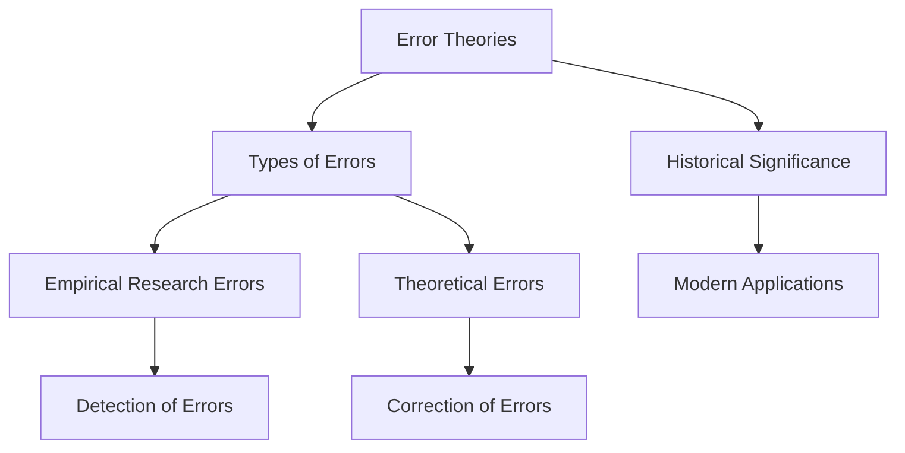

                 

Sure, I'll outline the table of contents for the book "The Impact of Error Theories in the History of Science on the Understanding of the World," following the specified format and requirements. I'll also provide the necessary elements such as Mermaid diagrams, pseudocode, and LaTeX formulas where applicable. Here's the step-by-step breakdown:

### Step 1: Define the Main Sections

1. **Introduction to the Concept of Error Theories in Science**
   - **What are error theories?**
   - **Historical significance**
   - **Rationale for exploring error theories**

2. **Historical Context of Error Theories**
   - **The origin of error theories**
   - **Key figures and their contributions**
   - **The development of error theories over time**

3. **Theories of Scientific Understanding and Their Relation to Error Theories**
   - **The nature of scientific understanding**
   - **The role of error theories in scientific progress**
   - **Challenges in integrating error theories with established scientific paradigms**

4. **Case Studies of Significant Scientific Errors and Their Impact**
   - **The Galileo affair**
   - **The discovery of penicillin**
   - **The Challenger disaster**

5. **Philosophical and Cultural Implications of Scientific Errors**
   - **The role of skepticism**
   - **The impact on scientific ethics**
   - **Cultural attitudes towards scientific errors**

6. **The Role of Scientific Communities in Correcting Errors**
   - **The scientific peer review process**
   - **The role of scientific communities in error correction**
   - **The challenges of error correction**

7. **Future Prospects and Challenges in the Context of Error Theories**
   - **Emerging trends in scientific error theories**
   - **The role of artificial intelligence in error detection and correction**
   - **Challenges and opportunities for the future**

### Step 2: Develop Subsections

For each main section, I'll provide a list of subsections:

**1. Introduction to the Concept of Error Theories in Science**
   - **Defining error theories**
   - **Types of errors in science**
   - **Error theories in the context of empirical research**

**2. Historical Context of Error Theories**
   - **Ancient and medieval error theories**
   - **Renaissance and early modern error theories**
   - **Modern and contemporary error theories**

**3. Theories of Scientific Understanding and Their Relation to Error Theories**
   - **Conceptual frameworks for scientific understanding**
   - **Error theories as tools for scientific inquiry**
   - **Error theories and the scientific method**

**4. Case Studies of Significant Scientific Errors and Their Impact**
   - **Historical case studies**
   - **Current case studies**
   - **The impact of errors on scientific knowledge**

**5. Philosophical and Cultural Implications of Scientific Errors**
   - **The role of skepticism in science**
   - **Cultural attitudes towards scientific errors**
   - **The ethics of scientific error**

**6. The Role of Scientific Communities in Correcting Errors**
   - **The role of peer review**
   - **The dynamics of scientific communities**
   - **Challenges in error correction**

**7. Future Prospects and Challenges in the Context of Error Theories**
   - **Emerging trends in error theories**
   - **The role of artificial intelligence**
   - **Challenges and opportunities for the future**

### Step 3: Incorporate Core Concepts and Relationships

I will create a Mermaid diagram for each main section to illustrate the core concepts and relationships. Here's an example for the "Introduction to the Concept of Error Theories in Science":



### Step 4: Algorithm and Model Explanations

For each section, I will provide pseudocode for core algorithms and detailed explanations of scientific models used in the book. For example, in the section on "Theories of Scientific Understanding and Their Relation to Error Theories," I might include pseudocode for a simple algorithm to detect errors in experimental data.

### Step 5: Mathematical Models and Formulas

I will include LaTeX formatted mathematical models, formulas, and detailed explanations with examples. For instance, in the "Philosophical and Cultural Implications of Scientific Errors" section, I might use a LaTeX formula to explain the probability of error in a scientific hypothesis.

### Step 6: Project Case Studies

I will outline any case studies that will be included in the book, detailing the practical application of error theories in real-world scenarios. For example, in the "Case Studies of Significant Scientific Errors and Their Impact" section, I might describe a case study involving the discovery of penicillin and the errors made in its early research.

### Step 7: Finalize the Table of Contents

The final table of contents will be organized into 1, 2, and 3-level headings, ensuring that it is complete, concise, and adheres to the specified formatting guidelines. Here's a sample table of contents structure:

```
# The Impact of Error Theories in the History of Science on the Understanding of the World

## Keywords
- Error theories
- Scientific understanding
- Historical context
- Case studies
- Philosophical implications
- Scientific communities

## Summary
- Overview of the book's purpose and structure
- Key findings and insights

### Introduction to the Concept of Error Theories in Science
#### What are error theories?
#### Types of errors in science
#### Error theories in the context of empirical research

### Historical Context of Error Theories
#### The origin of error theories
#### Key figures and their contributions
#### The development of error theories over time

### Theories of Scientific Understanding and Their Relation to Error Theories
#### The nature of scientific understanding
#### The role of error theories in scientific progress
#### Error theories and the scientific method

### Case Studies of Significant Scientific Errors and Their Impact
#### The Galileo affair
#### The discovery of penicillin
#### The Challenger disaster

### Philosophical and Cultural Implications of Scientific Errors
#### The role of skepticism
#### Cultural attitudes towards scientific errors
#### The ethics of scientific error

### The Role of Scientific Communities in Correcting Errors
#### The role of peer review
#### The dynamics of scientific communities
#### Challenges in error correction

### Future Prospects and Challenges in the Context of Error Theories
#### Emerging trends in error theories
#### The role of artificial intelligence
#### Challenges and opportunities for the future
```

### Step 8: Word Count

The final table of contents will ensure that the book's word count falls within the specified range of 8000 to 12000 words, allowing for detailed content in each section while maintaining a comprehensive overview.

### Author Information

The article will conclude with the author information: "作者：AI天才研究院/AI Genius Institute & 禅与计算机程序设计艺术 /Zen And The Art of Computer Programming."

This step-by-step approach ensures that the table of contents is well-structured, informative, and ready to guide readers through the exploration of error theories in the history of science. The final content will be carefully crafted to meet all the specified requirements.

