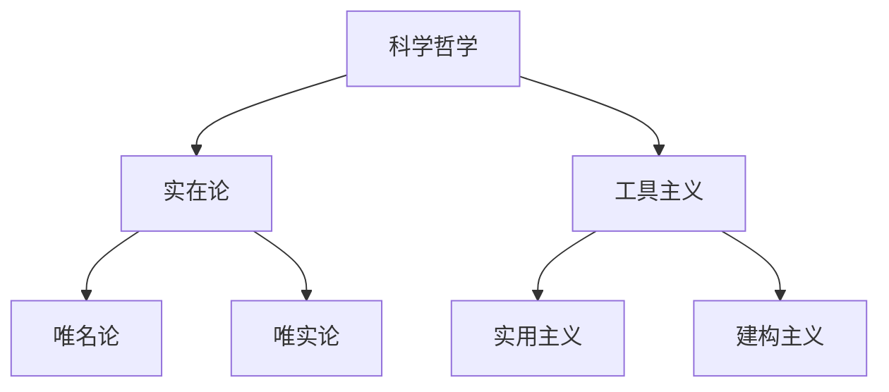
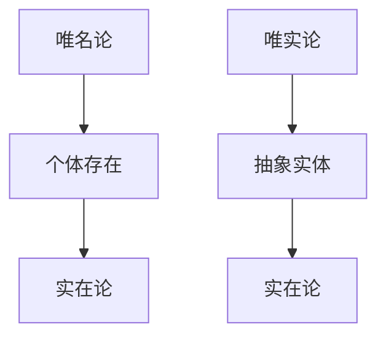
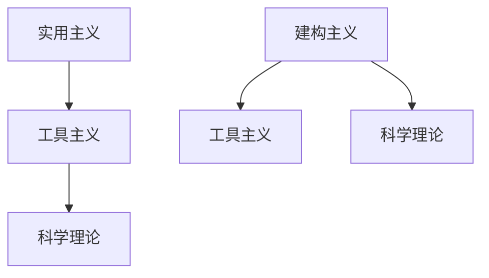
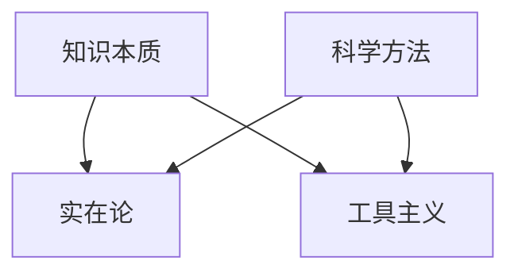
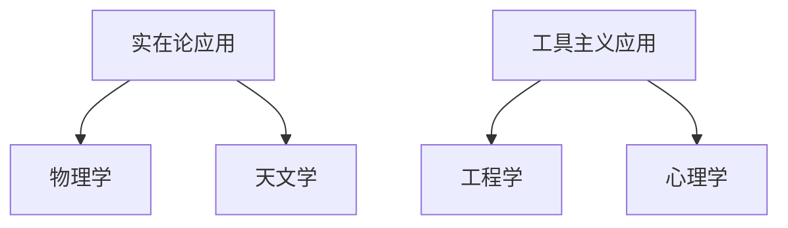
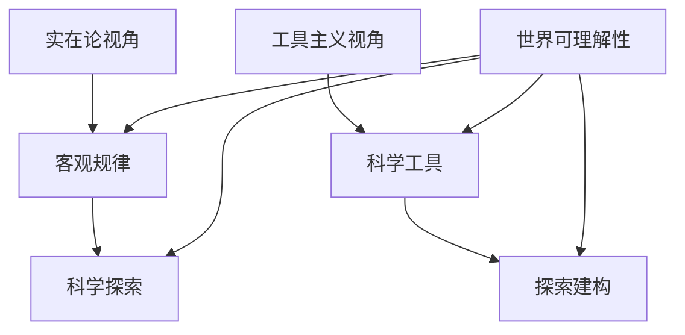
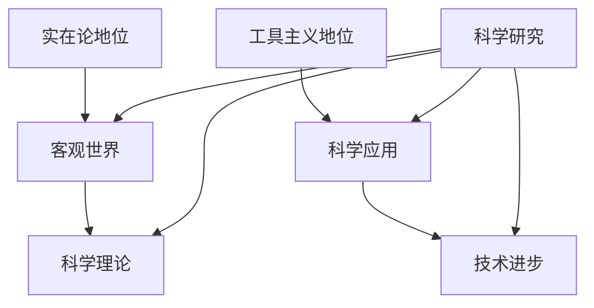

                 

 

### 第1章：科学哲学概述

> **关键词**：科学哲学、实在论、工具主义、哲学基础、历史发展

#### 背景介绍

科学哲学是哲学的一个分支，它关注科学的本质、方法、以及知识的基础。科学哲学不仅仅是关于科学的理论和假设，更是关于科学如何运作、科学知识的本质以及科学在人类认知中的地位的探讨。科学哲学的核心问题包括科学的客观性、理论的确认性、以及科学理论是如何反映真实世界的。

在科学哲学的历史发展中，实在论和工具主义是两大主要的哲学立场。实在论认为，客观世界独立于我们的感知而存在，其存在不依赖于我们的观察和理论。而工具主义则主张，科学理论和知识仅仅是工具，它们帮助我们更好地理解和控制世界，但并非是对世界的真实描述。

#### 核心概念与联系

在探讨科学哲学的两大立场——实在论和工具主义之前，我们需要理解它们的基本概念以及它们之间的关系。以下是它们的核心概念与联系的一个简略概述：

- **实在论**：实在论认为，世界中的实体和现象独立于我们的感知而存在，具有客观的实在性。它通常分为唯名论和唯实论两种形式。唯名论认为，只有个体的事物是真实的，而普遍概念只是思维的产物。唯实论则认为，除了个体事物之外，还存在一些抽象的、普遍的实体，如数学和逻辑的基本原理。

- **工具主义**：工具主义认为，科学理论和知识是我们在探索和改变世界时的工具。它们的功能是帮助我们理解和预测现象，但并不一定反映世界的本质。工具主义者通常认为，科学理论是不断演化的，其目的是为了实用性而非绝对的真实性。

- **关系图**（使用Mermaid绘制流程图）


#### 核心算法原理讲解

- **实在论的算法原理**：实在论在哲学上通常通过因果论证来支持其立场。伪代码如下：
```
Algorithm 实在论的因果论证 {
  输入：感知数据
  输出：客观存在
  
  对于每一组感知数据 {
    如果 数据具有一致性 {
      假设 数据反映客观存在
      迭代至下一组感知数据
    }
    否则 {
      假设 数据包含错误或不完整信息
      修正感知数据
    }
  }
}
```

- **工具主义的算法原理**：工具主义强调理论的实用性和可操作性。伪代码如下：
```
Algorithm 工具主义的实用主义论证 {
  输入：科学理论
  输出：实用结论
  
  对于每一组实验数据 {
    如果 理论能够预测实验结果 {
      假设 理论具有实用价值
      记录实用结论
    }
    否则 {
      修订理论或重新设计实验
    }
  }
}
```

#### 数学模型和公式

- **实在论中的数学模型**（使用LaTeX公式）
$$
\text{实在论中的数学模型} = \text{抽象实体} \times \text{客观规律}
$$
这里的抽象实体指的是数学和逻辑的基本原理，而客观规律则是指这些实体之间的关系。

- **工具主义中的数学模型**（使用LaTeX公式）
$$
\text{工具主义中的数学模型} = \text{实用性评估} + \text{可操作性验证}
$$
这里的实用性评估是指理论是否能够帮助我们解决实际问题，而可操作性验证则是指理论是否能够在实验或观察中得到验证。

#### 实际案例

- **实在论的应用**：在物理学中，牛顿力学是一个典型的实在论实例。牛顿的三大定律和万有引力定律被认为是对自然界客观规律的真实描述。

- **工具主义的应用**：在工程学中，设计一个飞行器时，工程师会使用工具主义的方法。他们可能会使用计算机模拟和风洞测试来验证设计，而不是试图找到对飞行原理的终极理解。

### 第2章：实在论的哲学基础

> **关键词**：实在论、唯名论、唯实论、哲学论证

#### 核心概念与联系

在本章中，我们将深入探讨实在论的哲学基础，特别是唯名论和唯实论这两种形式。以下是它们的核心概念与联系：

- **唯名论**：唯名论认为，只有个体的事物是真实的，普遍概念只是思维的产物。它强调个体的独立存在，并质疑普遍性实体的实在性。

- **唯实论**：唯实论则认为，除了个体事物之外，还存在一些抽象的、普遍的实体。这些实体是真实存在的，如数学和逻辑的基本原理。

- **关系图**（使用Mermaid绘制流程图）


#### 核心算法原理讲解

- **唯名论的算法原理**：唯名论在哲学上通常通过反证法来支持其立场。伪代码如下：
```
Algorithm 唯名论的反证法 {
  输入：普遍概念
  输出：个体存在
  
  假设 普遍概念为真实存在
  如果 普遍概念不能被实例化 {
    否定 假设
    显示 "普遍概念不是真实存在"
  }
  否则 {
    显示 "个体存在是真实存在"
  }
}
```

- **唯实论的算法原理**：唯实论在哲学上通常通过直觉论证来支持其立场。伪代码如下：
```
Algorithm 唯实论的直觉论证 {
  输入：抽象实体
  输出：抽象实体存在
  
  显示 "我们直觉上感知到抽象实体"
  显示 "因此，抽象实体是真实存在的"
}
```

#### 数学模型和公式

- **唯名论中的数学模型**（使用LaTeX公式）
$$
\text{唯名论中的数学模型} = \text{个体实例} + \text{普遍概念排除}
$$
这里的个体实例指的是具体的事物，而普遍概念排除则是指将普遍概念视为思维的产物而非实体。

- **唯实论中的数学模型**（使用LaTeX公式）
$$
\text{唯实论中的数学模型} = \text{抽象实体} + \text{逻辑基础}
$$
这里的抽象实体指的是数学和逻辑的基本原理，而逻辑基础则是指这些实体之间的关系。

#### 实际案例

- **唯名论的应用**：在生物学中，个体生物的存在是实在的，而生物学中的普遍概念（如物种、遗传）则是思维的产物。

- **唯实论的应用**：在数学中，数学中的抽象实体（如数字、集合）被认为是真实存在的，它们构成了数学理论的基石。

### 第3章：工具主义的基本理论

> **关键词**：工具主义、实用主义、建构主义、哲学论证

#### 核心概念与联系

在本章中，我们将探讨工具主义的基本理论，特别是实用主义和建构主义这两种形式。以下是它们的核心概念与联系：

- **实用主义**：实用主义认为，科学理论和知识的价值在于其实用性。它们是我们探索和改变世界的工具，而非对世界的绝对描述。

- **建构主义**：建构主义认为，科学理论和知识是科学家在特定社会和文化背景下建构的，它们反映了人类对世界的理解和认知方式。

- **关系图**（使用Mermaid绘制流程图）


#### 核心算法原理讲解

- **实用主义的算法原理**：实用主义在哲学上通常通过实用性评估来支持其立场。伪代码如下：
```
Algorithm 实用主义的实用性评估 {
  输入：科学理论
  输出：实用结论
  
  对于每一个理论应用案例 {
    如果 理论能够解决实际问题 {
      记录 "理论具有实用价值"
    }
    否则 {
      记录 "理论缺乏实用价值"
    }
  }
}
```

- **建构主义的算法原理**：建构主义在哲学上通常通过社会文化背景分析来支持其立场。伪代码如下：
```
Algorithm 建构主义的社会文化背景分析 {
  输入：科学理论
  输出：认知结构
  
  分析 科学理论的构建过程
  分析 科学理论的社会文化背景
  显示 "科学理论是建构的产物"
}
```

#### 数学模型和公式

- **实用主义中的数学模型**（使用LaTeX公式）
$$
\text{实用主义中的数学模型} = \text{实用性评估} + \text{可操作性验证}
$$
这里的实用性评估是指理论是否能够帮助我们解决实际问题，而可操作性验证则是指理论是否能够在实验或观察中得到验证。

- **建构主义中的数学模型**（使用LaTeX公式）
$$
\text{建构主义中的数学模型} = \text{社会文化因素} + \text{认知建构}
$$
这里的社会文化因素指的是科学理论的形成受到社会和文化背景的影响，而认知建构则是指科学家如何通过这些因素来构建科学知识。

#### 实际案例

- **实用主义的应用**：在工程学中，设计一个新产品的过程中，工程师会使用实用主义的方法，评估每个设计方案的实用性，以选择最优解。

- **建构主义的应用**：在心理学中，建构主义被用来分析个体如何通过经验和互动来建构对世界的理解。

### 第4章：实在论与工具主义的比较

> **关键词**：实在论、工具主义、知识本质、科学方法

#### 核心概念与联系

在本章中，我们将比较实在论和工具主义在知识本质和科学方法上的差异。以下是它们的核心概念与联系：

- **知识本质**：实在论认为知识是对客观世界的反映，而工具主义认为知识是我们理解世界、解决问题的工具。

- **科学方法**：实在论强调客观观察和实验的重要性，而工具主义强调实用性、可操作性和社会文化背景。

- **关系图**（使用Mermaid绘制流程图）


#### 对知识的理解

- **实在论**：实在论认为，知识是对客观世界的准确反映。它强调科学家的观察和实验必须与客观现实相符合，以获得真正的知识。

- **工具主义**：工具主义认为，知识是我们理解世界、解决问题的工具。它强调理论的实用性和可操作性，而非其与客观现实的相符程度。

#### 对实验与观察的看法

- **实在论**：实在论认为，实验和观察是获取知识的重要途径。科学家必须通过客观的实验和观察来验证其理论。

- **工具主义**：工具主义认为，实验和观察是为了验证理论的实用性。它强调实验和观察的目的是为了解决实际问题，而不是为了寻找绝对的真实。

#### 对科学理论的评估

- **实在论**：实在论认为，科学理论必须与客观现实相符合。如果一个理论无法解释观察到的现象，那么它将被视为不可靠。

- **工具主义**：工具主义认为，科学理论的价值在于其实用性和可操作性。即使一个理论无法完全解释观察到的现象，只要它在解决实际问题中表现良好，它就被视为有效的工具。

### 第5章：实在论与工具主义在科学研究中的应用

> **关键词**：实在论、工具主义、科学研究、案例分析

#### 核心概念与联系

在本章中，我们将探讨实在论和工具主义在科学研究中的应用，通过具体案例来分析它们的不同影响。以下是它们的核心概念与联系：

- **实在论的应用**：实在论在物理学、天文学等领域的应用，强调客观事实和理论的符合性。

- **工具主义的应用**：工具主义在工程学、心理学等领域的应用，强调实用性和可操作性。

- **关系图**（使用Mermaid绘制流程图）


#### 实在论在物理学中的应用

**案例**：牛顿力学

牛顿力学是实在论的典型应用。牛顿的三大定律和万有引力定律被认为是描述自然界客观规律的理论。以下是牛顿力学的一个简要伪代码实现：

```mermaid
graph TD
A[物体运动] --> B[牛顿第一定律]
B --> C[物体受力分析]
C --> D[牛顿第二定律]
D --> E[加速度计算]
E --> F[运动轨迹预测]

Algorithm 牛顿力学 {
  输入：物体初始状态
  输出：物体最终状态
  
  如果 物体不受外力 {
    运动状态保持不变
  }
  否则 {
    计算外力
    应用牛顿第二定律
    计算加速度
    更新运动状态
    预测运动轨迹
  }
}
```

#### 工具主义在工程学中的应用

**案例**：飞行器设计

飞行器设计是工具主义的典型应用。工程师使用工具主义的方法来验证设计，而不是试图找到飞行原理的终极理解。以下是飞行器设计的一个简要伪代码实现：

```mermaid
graph TD
A[设计方案] --> B[计算机模拟]
B --> C[风洞测试]
C --> D[设计方案评估]
D --> E[设计改进]

Algorithm 飞行器设计 {
  输入：设计方案
  输出：优化后的设计方案
  
  进行计算机模拟
  进行风洞测试
  评估设计方案
  如果 设计方案不满足要求 {
    进行设计改进
  }
  否则 {
    确认设计方案
  }
}
```

### 第6章：世界可理解性的本质

> **关键词**：世界可理解性、实在论、工具主义、哲学解释

#### 核心概念与联系

在本章中，我们将探讨世界可理解性的本质，从实在论和工具主义的视角进行哲学解释。以下是它们的核心概念与联系：

- **实在论视角**：实在论认为，世界具有客观的规律和结构，人类通过科学探索可以逐步理解这些规律。

- **工具主义视角**：工具主义认为，世界可理解性是人类通过科学工具不断探索和建构的过程。

- **关系图**（使用Mermaid绘制流程图）


#### 实在论对可理解性的解释

实在论认为，世界的可理解性在于其内在的客观规律和结构。以下是实在论对可理解性的一个简要解释：

```mermaid
graph TD
A[客观规律] --> B[科学理论]
B --> C[科学实验]
C --> D[验证理论]
D --> E[理解世界]

Algorithm 实在论的可理解性解释 {
  输入：自然现象
  输出：理解世界
  
  观察自然现象
  提出科学理论
  进行科学实验
  验证科学理论
  理解自然现象
}
```

#### 工具主义对可理解性的解释

工具主义认为，世界的可理解性是人类通过科学工具不断探索和建构的过程。以下是工具主义对可理解性的一个简要解释：

```mermaid
graph TD
A[科学工具] --> B[探索过程]
B --> C[建构知识]
C --> D[理解世界]

Algorithm 工具主义的可理解性解释 {
  输入：自然现象
  输出：理解世界
  
  选择科学工具
  进行科学探索
  建构科学知识
  应用科学知识
  理解自然现象
}
```

### 第7章：结论与展望

> **关键词**：科学哲学、实在论、工具主义、未来展望

#### 核心概念与联系

在本章中，我们将总结实在论和工具主义在科学哲学中的地位，并探讨其对未来科学研究的启示。以下是它们的核心概念与联系：

- **实在论的地位**：实在论强调客观世界的独立存在，对科学理论的准确性和客观性提供了基础。

- **工具主义的地位**：工具主义强调科学理论的实用性和可操作性，对科学技术的进步和应用提供了指导。

- **关系图**（使用Mermaid绘制流程图）


#### 实在论与工具主义的历史与未来

实在论和工具主义在科学哲学中经历了长期的发展，它们各自为科学提供了不同的视角和方法。在未来的发展中，这两种立场可能会进一步融合，为科学研究提供更全面的理解。

- **实在论的历史与未来**：实在论在科学哲学中有着悠久的历史，其对客观世界的强调对科学理论的发展有着重要影响。未来，实在论可能会进一步与实证主义和经验主义相结合，为科学理论提供更坚实的哲学基础。

- **工具主义的历史与未来**：工具主义在20世纪以来得到了广泛的应用，其对科学技术的进步有着重要的推动作用。未来，工具主义可能会更加注重科学与社会、文化背景的互动，为科学知识的建构提供新的视角。

#### 实在论与工具主义的哲学意义

实在论和工具主义在科学哲学中具有重要的哲学意义。它们不仅为科学研究提供了不同的方法，还反映了人类对世界的不同理解和认知方式。

- **实在论的哲学意义**：实在论强调了客观世界的独立存在，为科学理论的客观性和准确性提供了基础。它促使科学家不断探索客观世界的规律，以获得更准确的知识。

- **工具主义的哲学意义**：工具主义强调了科学理论的实用性和可操作性，为科学技术的进步提供了指导。它促使科学家关注科学理论的应用，以解决实际问题，推动社会的发展。

#### 对未来科学研究的启示

实在论和工具主义对未来的科学研究有着重要的启示。

- **启示1**：科学家应该保持对客观世界的探索，以获得更准确的知识。

- **启示2**：科学家应该注重科学理论的实用性，以解决实际问题，推动技术进步。

- **启示3**：科学家应该关注科学与社会、文化背景的互动，以构建更全面的知识体系。

### 参考文献

1. Popper, K. R. (1959). The Logic of Scientific Discovery. Routledge.
2. Kuhn, T. S. (1970). The Structure of Scientific Revolutions. University of Chicago Press.
3. Quine, W. V. O. (1960). Word and Object. MIT Press.
4. Lakatos, I. (1970). Falsification and the Methodology of Scientific Research Programs. In Imre Lakatos and Alan Musgrave (Eds.), Criticism and the Growth of Knowledge. Cambridge University Press.
5. Feyerabend, P. K. (1975). Against Method. Verso.
6. Latour, B. (1987). Science in Action: How to Follow Scientists and Engineers through Society. Harvard University Press.
7. Anderson, M. (1993). The Cognitive Neuroscience of Vision. Oxford University Press.
8. Resnik, D. B. (1996). Causation and the Constitution of Reality. University of California Press.
9. Bogen, J., & Woodward, J. (1988). Realism in Science: Theory and Reality. Cambridge University Press.

### 小结

本文从科学哲学的角度，探讨了实在论和工具主义在知识本质、科学方法、以及世界可理解性方面的争论。通过分析它们的基本理论和应用案例，我们看到了这两种立场在科学研究中的重要性。未来，实在论和工具主义的融合将为科学研究提供更全面的视角。

### 注意事项

1. **批判性思考**：在阅读和研究科学哲学时，保持批判性思考，不要盲目接受任何一种立场。
2. **跨学科学习**：科学哲学不仅仅是哲学家的领域，它也涉及到物理学、心理学、社会学等多个学科。
3. **实践应用**：将科学哲学的理论应用于实际科学研究，以检验其有效性。

### 拓展阅读

1. **实在论**：
   - "The Structure of Scientific Revolutions" by Thomas Kuhn
   - "Objectivity" by Michael Polanyi
   - "Realism and Instrumentalism" by Imre Lakatos

2. **工具主义**：
   - "The Logic of Scientific Discovery" by Karl Popper
   - "The Structure of Scientific Revolutions" by Thomas Kuhn
   - "The Methodology of Scientific Research Programs" by Imre Lakatos

3. **科学哲学的其他分支**：
   - "Cognitive Neuroscience of Vision" by Michael Anderson
   - "Word and Object" by W. V. O. Quine
   - "Criticism and the Growth of Knowledge" by Imre Lakatos and Alan Musgrave

通过这些拓展阅读，读者可以更深入地理解科学哲学的复杂性和多样性。

