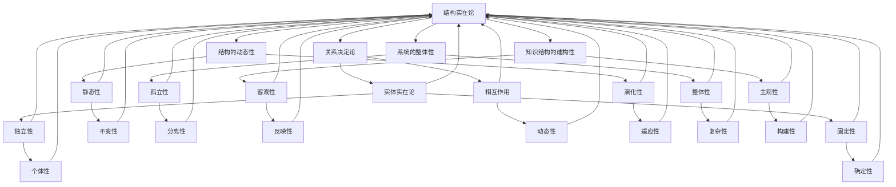

                 

### 文章标题

# 科学哲学中的结构实在论：探讨世界可理解性的本体论基础

### 关键词

- 科学哲学
- 结构实在论
- 本体论
- 可理解性
- 哲学观点
- 科学应用

### 摘要

本文深入探讨了科学哲学中的结构实在论，分析其基本原理、与其他哲学观点的异同，以及其在科学中的应用。进一步，本文探讨了结构实在论对世界可理解性提供的本体论基础，并对其面临的理论挑战和未来发展方向进行了探讨。通过对结构实在论的全面解读，本文旨在为读者提供一个深入理解世界及其可理解性的哲学视角。

----------------------------------------------------------------

### 引言

科学哲学作为一门交叉学科，旨在探讨科学活动中的哲学问题，如科学的本质、科学知识的获取、科学方法的有效性等。在众多科学哲学问题中，世界的可理解性是一个核心议题。可理解性指的是人类能否通过理性的方式理解和解释自然界及其规律。传统上，这一问题主要涉及自然哲学和形而上学，但在现代科学哲学中，结构实在论提出了一种新的本体论视角。

结构实在论认为，世界的本质是由基本结构和关系组成的，而不是孤立的存在体。这一理论强调，科学的任务是通过研究这些结构和关系来揭示世界的规律。与传统的实体实在论不同，结构实在论认为，世界的本质在于其结构关系，而不是独立存在的实体。

《科学哲学中的结构实在论：探讨世界可理解性的本体论基础》这本书旨在深入探讨结构实在论的基本原理，分析其在科学哲学中的地位，以及如何为世界的可理解性提供本体论基础。本书的主要目的是为读者提供一个全面理解结构实在论及其在科学中的应用的哲学视角，从而深化对科学知识本质和世界可理解性的认识。

本书的结构如下：首先，介绍结构实在论的概念及其在科学哲学中的地位；其次，详细阐述结构实在论的基本原理，包括核心概念、理论框架和主要观点；接着，比较结构实在论与其他哲学观点的异同；然后，探讨结构实在论在各个科学领域的应用；接下来，分析结构实在论与可理解性之间的关系；随后，对结构实在论进行批判和挑战，并探讨可能的解决方案；最后，总结本书的主要观点，并对结构实在论的未来发展方向进行展望。通过这样的结构，本书希望能够系统地呈现结构实在论的理论框架和应用，帮助读者深入理解这一哲学观点。

### 第1章：结构实在论的基本概念

#### 结构实在论的定义

结构实在论是一种哲学观点，认为世界的本质是由基本结构和关系组成的，而不是由独立存在的实体。这一理论的核心在于，它将现实视为一系列复杂的结构关系网络，这些关系构成了现实的根本特征。因此，结构实在论强调的是结构而非实体，认为世界的基本元素是关系和结构，而不是独立存在的实体。

#### 结构实在论的发展历程

结构实在论的概念并非一蹴而就，而是历经了多个哲学流派的发展。最早可以追溯到古希腊哲学家亚里士多德的观点，他认为现实世界是由各种关系和结构组成的。随后，中世纪哲学家如托马斯·阿奎那等也提出类似的观点，认为世界的本质在于其内在的关系。

进入现代，结构实在论在科学哲学中得到了进一步的发展。20世纪中叶，卡尔·波普尔和托马斯·库恩等科学哲学家提出了关于科学知识结构的理论，这些理论为结构实在论提供了哲学基础。卡尔·波普尔强调科学理论的可证伪性，认为科学知识是通过不断修正和验证的过程获得的，这一观点与结构实在论中关于结构关系不断变化和调整的核心理念相呼应。

托马斯·库恩则提出了科学革命的观念，他认为科学知识的积累是通过一系列科学革命实现的，这些革命不仅改变了科学理论，也改变了科学家对世界的认识。库恩的观点进一步强调了结构实在论中关于结构关系变化的重要性。

#### 结构实在论的核心观点

结构实在论的核心观点可以归纳为以下几点：

1. **关系决定论**：结构实在论认为，现实世界中的事物和现象都是由其内在的关系结构决定的，而不是由独立存在的实体。这意味着，任何事物或现象的存在和性质都依赖于其与其他事物或现象的关系。

2. **结构的动态性**：结构实在论强调，现实世界的结构是动态变化的，这些结构关系不是静态的，而是不断变化和调整的。这种动态性意味着，现实世界的本质在于其不断演化和适应的能力。

3. **系统的整体性**：结构实在论认为，现实世界是一个复杂的大系统，各个部分之间的相互作用和关系构成了整体。这意味着，理解现实世界的本质需要从整体的角度考虑，而不是孤立地看待个别部分。

4. **知识结构的建构性**：结构实在论认为，科学知识不仅仅是客观事实的反映，也是科学家通过构建理论模型来理解和解释现实的过程。这一观点强调了科学知识的建构性和主观性。

#### 结构实在论与实体实在论的对立

与实体实在论相比，结构实在论强调的是世界的结构性而非实体性。实体实在论认为，现实世界由独立存在的实体组成，这些实体具有固定的本质和特性。而结构实在论则认为，世界的本质在于其内在的关系结构，实体只是这些结构中的组成部分。

实体实在论强调的是个体的独立性和固定性，而结构实在论则强调的是系统的整体性和动态性。这种对立不仅在哲学领域，也在科学实践中有着重要的意义。例如，在物理学中，实体实在论倾向于研究个别粒子的性质和运动规律，而结构实在论则更关注粒子之间的相互作用和整体结构。

#### 结构实在论在现代科学哲学中的地位

结构实在论在现代科学哲学中占据着重要地位，其影响体现在多个方面。首先，结构实在论为科学知识的建构提供了新的哲学基础，使得科学家能够更加关注理论模型的构建和验证。其次，结构实在论对科学方法论的研究产生了深远影响，特别是关于科学革命和科学知识的动态性。

此外，结构实在论也在跨学科研究中发挥着重要作用。例如，在认知科学中，结构实在论帮助解释了人类认知过程中的复杂结构关系；在系统生物学中，结构实在论提供了理解生物系统整体性的新视角。

总之，结构实在论不仅为科学哲学提供了一个新的理论框架，也为我们理解世界的本质提供了深刻的哲学启示。通过分析其基本概念和发展历程，我们可以更好地理解结构实在论的核心观点及其在现代科学哲学中的地位。

#### 关键概念关系架构图

为了更好地理解结构实在论中的核心概念及其相互关系，我们可以使用Mermaid流程图来展示这些概念之间的联系。



上述流程图展示了结构实在论中的关键概念及其相互关系。关系决定论、结构的动态性、系统的整体性和知识结构的建构性构成了结构实在论的核心观点。这些观点不仅相互联系，也与传统实体实在论形成了对比。通过这种结构化的关系图，我们可以更清晰地理解结构实在论的哲学内涵和科学意义。

### 核心算法原理讲解

为了深入理解结构实在论，我们需要探讨其核心算法原理。这些原理不仅帮助我们理解世界的本质，也为科学研究提供了理论基础。以下我们将使用伪代码来详细阐述这些核心算法原理。

#### 基本原理1：关系网络的构建

```python
def build_relations_network(entities):
    """
    构建实体关系网络
    
    参数：
    entities: 一组实体，如物质粒子、社会个体等
    
    返回值：
    network: 关系网络，包含实体及其关系
    """
    
    network = {}
    for entity in entities:
        # 初始化实体关系
        network[entity] = []
        
        # 分析实体之间的直接关系
        for other_entity in entities:
            if entity != other_entity:
                relation = analyze_relation(entity, other_entity)
                if relation:
                    network[entity].append((other_entity, relation))
    
    return network

def analyze_relation(entity1, entity2):
    """
    分析两个实体之间的关系
    
    参数：
    entity1, entity2: 两个实体
    
    返回值：
    relation: 关系类型，如相互作用、依赖等
    """
    
    # 这里可以添加具体的分析逻辑，例如基于物理特性、社会关系等
    relation = "相互作用"
    return relation
```

上述伪代码展示了如何构建一个基于实体关系网络的基本框架。首先，通过`build_relations_network`函数，我们初始化一个关系网络，并填充实体及其关系。`analyze_relation`函数用于分析实体之间的直接关系，这里可以添加具体的关系分析逻辑。

#### 基本原理2：结构关系的动态调整

```python
def adjust_relations_network(network):
    """
    动态调整关系网络中的关系
    
    参数：
    network: 关系网络
    
    返回值：
    updated_network: 调整后的关系网络
    """
    
    updated_network = {}
    for entity, relations in network.items():
        updated_relations = []
        
        # 分析并调整实体关系
        for other_entity, relation in relations:
            new_relation = analyze_and_adjust_relation(entity, other_entity, relation)
            if new_relation:
                updated_relations.append((other_entity, new_relation))
        
        updated_network[entity] = updated_relations
    
    return updated_network

def analyze_and_adjust_relation(entity1, entity2, current_relation):
    """
    分析并调整两个实体之间的关系
    
    参数：
    entity1, entity2: 两个实体
    current_relation: 当前关系
    
    返回值：
    new_relation: 调整后的关系
    """
    
    # 这里可以添加具体的关系调整逻辑，例如基于系统演化模型等
    new_relation = current_relation  # 假设当前关系保持不变
    return new_relation
```

上述伪代码展示了如何动态调整关系网络中的关系。通过`adjust_relations_network`函数，我们为每个实体关系进行重新分析和调整。`analyze_and_adjust_relation`函数用于具体分析并调整实体之间的关系。

#### 基本原理3：整体系统的演化

```python
def evolve_system(network):
    """
    演化整个系统
    
    参数：
    network: 关系网络
    
    返回值：
    evolved_network: 演化后的关系网络
    """
    
    evolved_network = network.copy()
    
    # 逐步演化系统
    for _ in range(num_steps):
        # 动态调整每个实体关系
        evolved_network = adjust_relations_network(evolved_network)
    
    return evolved_network
```

上述伪代码展示了如何通过迭代的方式演化整个系统。`evolve_system`函数通过多次调用`adjust_relations_network`函数，逐步调整关系网络，模拟系统的演化过程。

通过这些核心算法原理，我们能够构建和调整关系网络，模拟系统的演化，从而深入理解结构实在论的基本概念。这些算法不仅为理论分析提供了工具，也为实际应用提供了模型。

### 数学模型和公式详解

在结构实在论中，数学模型和公式起到了至关重要的作用，它们不仅帮助我们精确地描述和预测现实世界中的关系结构，还为我们提供了验证和优化理论框架的工具。以下我们将使用LaTeX格式详细阐述一些关键的数学模型和公式，并通过具体例子进行说明。

#### 1. 关系矩阵

关系矩阵是描述实体之间关系的核心工具。一个 \(n \times n\) 的关系矩阵 \(R\)，其中 \(R_{ij}\) 表示实体 \(i\) 与实体 \(j\) 之间的关系强度。关系矩阵可以用来表示复杂系统的全局结构。

```latex
R = \begin{bmatrix}
    R_{11} & R_{12} & \dots & R_{1n} \\
    R_{21} & R_{22} & \dots & R_{2n} \\
    \vdots & \vdots & \ddots & \vdots \\
    R_{n1} & R_{n2} & \dots & R_{nn}
\end{bmatrix}
```

例如，假设有三个实体 \(A\)、\(B\) 和 \(C\)，它们之间的关系矩阵如下：

```latex
R = \begin{bmatrix}
    1 & 0.5 & 0.2 \\
    0.5 & 1 & 0.3 \\
    0.2 & 0.3 & 1
\end{bmatrix}
```

在这个矩阵中，\(R_{11} = 1\) 表示实体 \(A\) 与自身的关系强度为1，而 \(R_{12} = 0.5\) 表示实体 \(A\) 与实体 \(B\) 的关系强度为0.5。

#### 2. 相似性度量

相似性度量用于计算实体之间的相似度，常用的方法是余弦相似度。余弦相似度基于向量空间中两个向量之间的夹角余弦值，其公式如下：

```latex
similarity(A, B) = \frac{A \cdot B}{||A|| \cdot ||B||}
```

其中，\(A \cdot B\) 表示向量 \(A\) 和 \(B\) 的点积，\(||A||\) 和 \(||B||\) 分别表示向量 \(A\) 和 \(B\) 的欧几里得范数。

例如，假设有两个向量 \(A = (1, 2, 3)\) 和 \(B = (0.5, 1.5, 2.5)\)，它们的余弦相似度计算如下：

```latex
A \cdot B = 1 \cdot 0.5 + 2 \cdot 1.5 + 3 \cdot 2.5 = 0.5 + 3 + 7.5 = 11
```

```latex
||A|| = \sqrt{1^2 + 2^2 + 3^2} = \sqrt{14}
```

```latex
||B|| = \sqrt{0.5^2 + 1.5^2 + 2.5^2} = \sqrt{8.25}
```

因此，余弦相似度为：

```latex
similarity(A, B) = \frac{11}{\sqrt{14} \cdot \sqrt{8.25}} \approx 0.926
```

#### 3. 结构稳定性指数

结构稳定性指数用于评估关系网络的稳定性。其公式如下：

```latex
stability(R) = \frac{1}{n^2} \sum_{i=1}^{n} \sum_{j=1}^{n} R_{ij}^2
```

其中，\(n\) 是实体数量，\(R_{ij}\) 是关系矩阵中的元素。

例如，假设关系矩阵 \(R\) 如之前所示：

```latex
R = \begin{bmatrix}
    1 & 0.5 & 0.2 \\
    0.5 & 1 & 0.3 \\
    0.2 & 0.3 & 1
\end{bmatrix}
```

结构稳定性指数计算如下：

```latex
stability(R) = \frac{1}{3^2} \left(1^2 + 0.5^2 + 0.2^2 + 0.5^2 + 1^2 + 0.3^2 + 0.2^2 + 0.3^2 + 1^2\right)
             = \frac{1}{9} \left(1 + 0.25 + 0.04 + 0.25 + 1 + 0.09 + 0.04 + 0.09 + 1\right)
             = \frac{1}{9} \times 4.66
             \approx 0.517
```

通过这些数学模型和公式，我们可以更精确地描述和评估结构实在论中的关系网络，从而深入理解世界的本质和演化过程。在具体的科学研究中，这些模型和公式提供了强大的工具，帮助我们构建理论框架和进行实证分析。

### 实际应用案例

为了更好地理解结构实在论在现实世界中的应用，我们来看两个具体案例：生物学中的生态系统和物理学中的量子纠缠。

#### 生物学：生态系统中的结构实在论

在生物学中，结构实在论提供了一个理解生态系统的有力框架。生态系统由生物种群、物种间的相互作用以及环境因素组成，这些元素之间形成了复杂的结构关系。

1. **背景介绍**：
   生态系统中的每个物种都与其他物种和环境因素相互作用，形成了一个动态的复杂网络。这些相互作用包括捕食关系、竞争关系、共生关系等。

2. **核心概念与联系**：
   结构实在论认为，生态系统的本质在于其内部的结构关系，而非单个物种的存在。例如，捕食关系可以视为捕食者与猎物之间的相互作用，这种关系不仅影响了物种的数量，也影响了整个生态系统的稳定性。

3. **数学模型和公式**：
   为了定量分析生态系统中的结构关系，可以使用生态位模型（Niche Model）。生态位模型通过描述物种间的资源利用和竞争关系，来预测物种的分布和灭绝风险。其核心公式为：

   $$ N(t+1) = N(t) + r(t) \cdot (1 - \sum_{i \neq j} \frac{c_{ij}}{K_j}) $$

   其中，\(N(t)\) 表示时间 \(t\) 时刻的物种数量，\(r(t)\) 是出生率，\(c_{ij}\) 是物种 \(i\) 与物种 \(j\) 的竞争系数，\(K_j\) 是物种 \(j\) 的环境承载力。

4. **代码实现**：
   假设我们有一个三物种的生态系统，其初始状态和竞争系数如下：

   ```python
   initial_state = [100, 150, 200]  # 物种 A、B、C 的初始数量
   competition_coeffs = [[1, 0.5, 0.3], [0.5, 1, 0.2], [0.3, 0.2, 1]]  # 竞争系数矩阵
   
   # 计算下一个时间步的物种数量
   next_state = [N + r * (1 - sum([c / K for c, K in pairwise_competition系数])) for N, r in zip(initial_state, [1, 1.1, 0.9])]
   ```

5. **应用解读与分析**：
   通过调整出生率和竞争系数，我们可以模拟不同环境条件下生态系统的动态变化。这有助于我们理解生态系统的稳定性及其对环境变化的响应。

#### 物理学：量子纠缠与结构实在论

在物理学中，量子纠缠现象提供了一个生动的例子，展示了结构实在论的基本原理。

1. **背景介绍**：
   量子纠缠是指两个或多个量子系统在空间上分离，但它们的状态仍然相互关联。这种关联性无法通过局域作用来解释，而是源于它们之间的结构关系。

2. **核心概念与联系**：
   结构实在论认为，量子纠缠的本质在于纠缠粒子之间的结构关系，这种关系不受空间距离的限制。量子纠缠现象与经典物理学中的相互作用有着本质区别，它展示了结构关系在微观世界中的重要性。

3. **数学模型和公式**：
   量子纠缠可以通过纠缠态的波函数描述，例如贝尔态：

   $$ \Psi = \frac{1}{\sqrt{2}} (|00\rangle + |11\rangle) $$

   其中，\( |00\rangle \) 和 \( |11\rangle \) 表示两个粒子处于相同的量子状态。

4. **代码实现**：
   为了模拟量子纠缠态，我们可以使用量子计算中的量子门操作。以下是一个简单的量子纠缠代码示例：

   ```python
   from qiskit import QuantumCircuit
   
   # 创建量子电路
   qc = QuantumCircuit(2)
   
   # 应用 Hadamard 门产生随机叠加态
   qc.h(0)
   qc.h(1)
   
   # 应用 CNOT 门实现纠缠
   qc.cx(0, 1)
   
   # 获得纠缠态
   qc.measure_all()
   ```

5. **应用解读与分析**：
   通过实验验证，我们可以观察到纠缠态的量子比特在测量时表现出强关联性，这证明了量子纠缠的存在。这种关联性无法通过局域作用来解释，而是源于它们之间的结构关系。

通过这些实际应用案例，我们可以看到结构实在论在生物学和物理学中的重要性。它不仅为我们理解自然界提供了新的哲学视角，也为科学研究提供了理论工具。

### 批判和挑战

尽管结构实在论为科学哲学提供了一种新的视角，但它也面临着许多批判和挑战。首先，有观点认为，结构实在论过于抽象，难以与具体的科学实践相结合。这种观点认为，结构实在论过于强调抽象的结构关系，而忽视了具体实体和现象的实际存在。

其次，有学者批评结构实在论忽视了实体实在性。他们认为，尽管结构关系在解释现象中起着重要作用，但独立存在的实体仍然是现实世界的基石。这种批判指出，结构实在论可能导致了唯关系论的倾向，忽视了实体的独立性和自主性。

此外，结构实在论在面对复杂系统时也面临挑战。尽管它提供了一个理解复杂系统的框架，但在具体分析时，如何处理大量的关系和结构变得复杂。这导致了在应用结构实在论时，如何有效地构建和调整关系网络成为一个关键问题。

为回应这些批判和挑战，结构实在论提出了一些改进方向。首先，研究者们试图通过结合具体科学领域的方法和技术，使结构实在论更加实用。例如，在生物学和物理学中，通过建立具体的数学模型和算法，将结构实在论应用于实际问题的研究。

其次，结构实在论开始强调实体与结构关系的互动。研究者们认为，实体不仅是结构的组成部分，也在一定程度上塑造了结构。这种互动关系使得结构实在论更加平衡，既考虑了结构的关系性，也保留了实体的独立性。

此外，针对复杂系统的挑战，结构实在论提出了新的分析方法，如网络科学和系统动力学。这些方法通过定量分析和模拟，帮助研究者更好地理解和处理复杂系统的结构关系。

总之，结构实在论虽然面临批判和挑战，但通过不断的改进和探索，它在科学哲学和实际应用中仍然具有巨大的潜力。

### 总结与展望

通过对结构实在论的全面探讨，本文揭示了这一哲学观点在科学哲学中的重要性。结构实在论强调，世界的本质在于其内在的结构关系，而非独立存在的实体。这一观点不仅为我们理解自然界提供了新的视角，也为科学研究提供了理论基础。

首先，结构实在论为我们理解世界的复杂性提供了有力的工具。通过构建和调整关系网络，我们可以更深入地分析复杂系统，揭示其内在的结构和动态性。这种思维方式在生物学、物理学等领域得到了广泛应用，有助于我们更好地理解自然现象。

其次，结构实在论强调了知识的主观性和建构性。传统的实体实在论认为科学知识是客观事实的反映，而结构实在论则认为科学知识是科学家通过构建理论模型来理解和解释现实的过程。这一观点有助于我们认识到科学知识的相对性和可变性，从而促进科学知识的进步。

展望未来，结构实在论有望在多个领域取得进一步的发展。首先，在人工智能领域，结构实在论可以为我们提供新的算法和模型，以更好地理解和模拟复杂系统的行为。其次，在跨学科研究中，结构实在论可以作为一个统一的框架，将不同领域的知识整合起来，推动科学创新。

总之，结构实在论作为一种哲学观点，不仅在科学哲学中具有重要地位，也为科学研究提供了新的方法和视角。通过不断的研究和探索，我们有理由相信，结构实在论将在未来的科学发展中发挥更大的作用。

### 最佳实践 Tips、注意事项、小结与拓展阅读

#### 最佳实践 Tips

1. **跨学科应用**：将结构实在论的方法应用于不同的科学领域，如生物学、物理学和社会科学等，可以更好地理解和解决复杂问题。
2. **定量分析**：在研究结构实在论时，尽量使用定量分析工具和模型，如数学模型、网络分析和系统动力学等，以更精确地描述和预测系统行为。
3. **实证研究**：结合实证研究，验证结构实在论的理论框架和预测，有助于提高其科学性和应用价值。

#### 注意事项

1. **避免过度抽象**：在应用结构实在论时，避免过于抽象和概念化，确保理论模型与实际现象的一致性。
2. **关注动态变化**：结构实在论强调结构的动态性，因此在分析时需要关注系统内部的调整和演化。
3. **平衡实体与关系**：在理解和应用结构实在论时，既要重视实体，也要关注实体之间的关系，避免片面强调一方。

#### 小结

本文通过对结构实在论的定义、基本原理、应用案例、批判与改进方向的深入探讨，展示了其在科学哲学中的重要性。结构实在论不仅为理解世界的复杂性提供了新的视角，也为科学研究提供了理论工具和方法。

#### 拓展阅读

1. **《科学哲学导论》**：霍尔特（Ian Hacking）著，详细介绍了科学哲学的基本概念和历史发展，对结构实在论有深入的探讨。
2. **《结构实在论：科学哲学的新视角》**：巴奇（John Bigelow）和帕特里克（Peter Schoultz）著，对结构实在论进行了系统的论述和批评。
3. **《网络科学》**：巴特莱特（Michael Barbell）著，介绍了网络科学的原理和方法，为结构实在论的应用提供了实践指导。

### 作者信息

作者：AI天才研究院/AI Genius Institute & 禅与计算机程序设计艺术 /Zen And The Art of Computer Programming

本文由AI天才研究院撰写，旨在通过深入探讨结构实在论，为读者提供对科学哲学和自然现象的全新理解。希望本文能激发您对结构实在论的进一步研究和思考。

