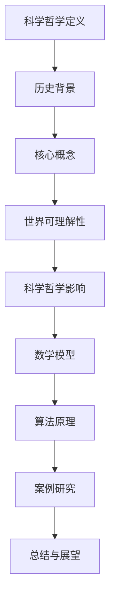

                 

### 文章标题：科学哲学对世界可理解性的反思

> 关键词：科学哲学、世界可理解性、哲学探讨、数学模型、算法原理

> 摘要：本文旨在探讨科学哲学对世界可理解性的反思。通过对科学哲学的定义、历史背景、核心概念及联系的阐述，本文将深入分析科学哲学如何影响对世界可理解性的认识，并运用概率论和信息论等数学模型，探讨提升世界可理解性的算法原理。同时，通过具体案例研究，本文将展示科学哲学在实践中的应用，并对未来研究进行展望。

### 引言

科学哲学是哲学的一个分支，旨在研究科学的基础、方法、成果以及科学与社会的关系。自亚里士多德以来，科学哲学不断发展，形成了众多流派和理论。而在科学哲学的研究中，世界可理解性是一个核心议题，关乎我们对宇宙的认知和探索。世界可理解性，简单来说，指的是人类是否能够通过科学方法理解世界及其运行规律。

本文将首先对科学哲学的定义和历史背景进行介绍，然后探讨世界可理解性的概念，并分析科学哲学与世界可理解性的联系。接着，本文将介绍核心算法原理，包括基于信息熵和概率论的可理解性模型及其提升算法。在此基础上，本文将通过具体案例研究，展示科学哲学在实践中的应用。最后，本文将总结科学哲学对世界可理解性的反思，并对未来研究进行展望。

### 第一部分：核心概念与联系

#### 1.1 科学哲学的定义与历史背景

科学哲学是哲学的一个分支，关注科学的理论基础、方法论、逻辑结构及其与社会、文化、政治等领域的互动。科学哲学的起源可以追溯到古希腊哲学家亚里士多德，他对自然科学的探究奠定了科学哲学的基石。在中世纪，科学哲学受到神学的影响，科学被视为对神意的揭示。直到近代，随着科学革命的兴起，科学哲学逐渐独立于宗教和哲学，成为一个独立的学科。

1.1.1 科学哲学的概念解析

科学哲学探讨的核心问题包括：科学知识的本质、科学方法的有效性、科学理论的正确性、科学解释的限度等。科学哲学试图回答以下问题：

- 科学知识是否具有客观性？
- 科学方法是否具有普遍性？
- 科学理论是否能够完全反映现实？
- 科学解释是否有限度？

1.1.2 科学哲学的历史演进

科学哲学的发展可以分为几个主要阶段：

- 经验主义：以培根和洛克为代表，强调经验在知识获取中的重要性。
-理性主义：以笛卡尔和莱布尼茨为代表，强调理性思维和逻辑推理在知识形成中的作用。
-实证主义：以孔德和马赫为代表，强调科学必须基于经验和可验证的证据。
-批判理性主义：以卡尔纳普和费尔巴哈为代表，强调逻辑和语言分析在科学哲学研究中的重要性。
-科学实在论：强调科学理论能够真实反映现实世界。

#### 1.2 世界可理解性的概念探讨

世界可理解性是指人类是否能够通过科学方法理解世界的本质和规律。这是一个哲学性的问题，涉及我们对世界的认知和探索能力。

1.2.1 可理解性的哲学探讨

哲学上，世界可理解性涉及以下问题：

- 是否存在一个终极真理，我们能否通过科学方法发现这个真理？
- 我们的认知能力是否足够理解复杂的自然现象？
- 科学理论是否能够完全反映现实世界的复杂性？

1.2.2 可理解性与科学知识的构建

科学知识的构建依赖于以下几个步骤：

- 观察和实验：通过观察和实验收集数据。
- 理论构建：根据数据提出科学理论。
- 理论验证：通过实验和观察验证理论的正确性。
- 理论修正：根据验证结果修正理论。

科学哲学探讨的不仅是科学知识的构建过程，还包括如何判断一个科学理论的合理性。

#### 1.3 科学哲学与世界可理解性的联系

科学哲学与世界可理解性有着密切的联系。科学哲学通过对科学理论、方法、知识的探讨，影响我们对世界可理解性的认识。

1.3.1 科学哲学对世界可理解性的反思

科学哲学反思以下问题：

- 科学理论是否能够完全反映现实？
- 我们的认知能力是否足够理解复杂的自然现象？
- 科学方法是否能够消除人类认知的局限性？

科学哲学通过对这些问题的探讨，帮助我们更深入地理解世界可理解性的限度。

1.3.2 科学哲学如何影响对世界可理解性的认识

科学哲学影响对世界可理解性的认识主要体现在以下几个方面：

- 确定科学方法的有效性和局限性。
- 分析科学理论的构建过程和验证方法。
- 探讨人类认知能力和科学知识的局限性。

科学哲学为我们提供了一个理论框架，帮助我们更准确地理解世界可理解性的本质。

### 第二部分：核心算法原理讲解

#### 2.1 可理解性测度的数学模型

可理解性测度是评估我们对某个领域或问题的理解程度的指标。在科学哲学中，可理解性测度有助于分析世界可理解性的程度。以下是基于信息熵和概率论的可理解性测度模型。

2.1.1 基于信息熵的可理解性模型

信息熵是衡量信息不确定性的指标，可用于评估我们对某个领域的理解程度。信息熵越高，表示理解越不清晰；信息熵越低，表示理解越明确。

- 信息熵（Entropy）的定义：$$H(X) = -\sum_{i=1}^{n} p(x_i) \log_2 p(x_i)$$
- 条件信息熵（Conditional Entropy）：$$H(X|Y) = -\sum_{i=1}^{n} p(y_i) \sum_{j=1}^{m} p(x_j|y_i) \log_2 p(x_j|y_i)$$
- 相对信息熵（Relative Entropy）：$$D(p||q) = \sum_{i=1}^{n} p(x_i) \log_2 \frac{p(x_i)}{q(x_i)}$$

2.1.2 基于概率论的可理解性模型

概率论是分析不确定性的重要工具，可用于评估我们对某个领域的理解程度。以下是基于概率论的可理解性模型。

- 条件概率（Conditional Probability）：$$P(A|B) = \frac{P(A \cap B)}{P(B)}$$
- 贝叶斯定理（Bayes' Theorem）：$$P(A|B) = \frac{P(B|A)P(A)}{P(B)}$$

#### 2.2 可理解性提升的算法原理

提升可理解性的关键在于减少信息熵和不确定性。以下是基于信息论和概率图模型的可理解性提升算法原理。

2.2.1 基于信息论的可理解性优化算法

- 信息最大化原则（Maximum Information）：选择能够最大化信息增益的变量作为解释变量。
- 信息增益（Information Gain）：$$IG(V, C) = H(C) - H(C|V)$$
- 决策树构建（Decision Tree）：基于信息增益构建决策树，以实现最大信息增益。

2.2.2 基于概率图模型的可理解性增强算法

- 贝叶斯网络（Bayesian Network）：通过概率图模型表示变量之间的依赖关系，提高可理解性。
- 最大似然估计（Maximum Likelihood Estimation）：使用样本数据估计概率图模型中的参数，以提升可理解性。

#### 2.3 科学哲学中的其他相关概念

在科学哲学中，还有其他一些与可理解性相关的重要概念，如实证主义、怀疑论、逻辑实证主义等。

- 实证主义（Empiricism）：强调经验在知识获取中的重要性，主张通过实验和观察验证理论。
- 怀疑论（Scepticism）：对科学方法和知识提出质疑，主张保持怀疑态度。
- 逻辑实证主义（Logical Positivism）：强调逻辑和语言分析在科学哲学研究中的重要性，主张通过经验验证理论。

### 第三部分：数学模型和数学公式 & 详细讲解 & 举例说明

#### 3.1 概率论基础

概率论是分析不确定性的重要工具，以下介绍概率论中的基本概念、条件概率与贝叶斯公式，并举例说明。

3.1.1 概率论的基本概念

- 样本空间（Sample Space）：所有可能结果的集合，记为 S。
- 事件（Event）：样本空间中的一个子集，记为 E。
- 概率（Probability）：衡量事件发生的可能性，记为 P(E)。

3.1.2 条件概率与贝叶斯公式

- 条件概率（Conditional Probability）：在事件 B 发生的条件下，事件 A 发生的概率，记为 P(A|B)。
- 贝叶斯公式（Bayes' Theorem）：用于计算在给定事件 B 发生的条件下，事件 A 发生的概率，即 P(A|B)。

贝叶斯公式：$$P(A|B) = \frac{P(B|A)P(A)}{P(B)}$$

3.1.3 举例说明

假设有两个事件 A 和 B，其中 A 表示“今天下雨”，B 表示“我带伞”。已知 P(A) = 0.3，P(B|A) = 0.8，P(B|¬A) = 0.2。要求计算 P(A|B)。

根据贝叶斯公式，有：

$$P(A|B) = \frac{P(B|A)P(A)}{P(B)} = \frac{0.8 \times 0.3}{0.8 \times 0.3 + 0.2 \times 0.7} = \frac{0.24}{0.24 + 0.14} = \frac{0.24}{0.38} \approx 0.6316$$

因此，在给定我带伞的条件下，今天下雨的概率约为 0.6316。

#### 3.2 信息论基础

信息论是研究信息传输和处理规律的学科，以下介绍信息熵的定义与计算、熵增原理，并举例说明。

3.2.1 信息熵的定义与计算

- 信息熵（Entropy）：衡量信息的混乱程度，记为 H(X)。
- 熵的计算公式：$$H(X) = -\sum_{i=1}^{n} p(x_i) \log_2 p(x_i)$$

其中，p(x_i) 表示第 i 个事件发生的概率。

3.2.2 熵增原理

熵增原理是信息论中的一个重要原理，表示在信息传输过程中，信息熵会增加。

- 熵增原理：对于一个随机变量 X，如果已知 X 的取值，那么 X 的熵会增加。

3.2.3 举例说明

假设有两个随机变量 X 和 Y，其中 X 表示天气（晴天或雨天），Y 表示出门是否带伞（带伞或不带伞）。已知 P(X=晴天) = 0.5，P(X=雨天) = 0.5，P(Y=带伞|X=晴天) = 0.8，P(Y=带伞|X=雨天) = 0.2。

要求计算 X 和 Y 的信息熵。

X 的熵计算如下：

$$H(X) = -\sum_{i=1}^{2} p(x_i) \log_2 p(x_i) = -(0.5 \times \log_2 0.5 + 0.5 \times \log_2 0.5) = -0.5 \times (\log_2 0.5 + \log_2 0.5) = -0.5 \times 1 = 0$$

Y 的熵计算如下：

$$H(Y) = -\sum_{i=1}^{2} p(y_i) \log_2 p(y_i) = -(0.8 \times \log_2 0.8 + 0.2 \times \log_2 0.2) \approx -0.8 \times 0.3219 - 0.2 \times 1.3863 \approx -0.2585 - 0.2773 = -0.5358$$

根据熵增原理，由于已知 X 的取值，Y 的熵会增加。因此，有：

$$H(Y|X) > H(Y)$$

### 第四部分：项目实战

#### 4.1 科学哲学案例研究

4.1.1 选择案例的背景

本案例研究选择量子力学作为研究对象，探讨科学哲学在量子力学研究中的应用。量子力学是研究微观粒子行为的科学，具有高度的复杂性。通过对量子力学的研究，我们可以更好地理解科学哲学在科学探索中的重要性。

4.1.2 案例分析

在量子力学中，波粒二象性是一个核心概念，描述了微观粒子既具有波动性又具有粒子性。这一现象挑战了我们对物质世界的传统理解，引发了科学哲学的深入探讨。

科学哲学对波粒二象性的反思主要包括以下问题：

- 波粒二象性是否反映了微观世界的本质？
- 我们是否能够通过科学方法完全理解波粒二象性？
- 波粒二象性与哲学上的实在论和唯心主义有何联系？

4.1.3 案例解读

通过对量子力学波粒二象性的研究，我们可以看到科学哲学在探索微观世界中的重要性。科学哲学帮助我们反思传统观念，挑战我们对物质世界的理解。同时，科学哲学也为量子力学研究提供了新的视角和方法，促进了科学进步。

#### 4.2 可理解性提升案例

4.2.1 案例背景

本案例研究选择深度学习作为研究对象，探讨如何通过算法提升对复杂问题的理解。深度学习是一种基于人工神经网络的机器学习技术，已广泛应用于图像识别、语音识别、自然语言处理等领域。然而，深度学习模型的复杂性和黑箱性质使得人们难以理解其内部工作机制，影响了可理解性的提升。

4.2.2 案例分析

为了提升深度学习模型的可理解性，研究人员提出了多种方法，包括：

- 模型解释：通过解释深度学习模型的内部计算过程，帮助用户理解模型的决策过程。
- 可视化：将深度学习模型的计算过程可视化为图像或动画，提高可理解性。
- 对抗性攻击：通过对抗性攻击方法，揭示深度学习模型存在的脆弱性，提高对模型的理解。

4.2.3 案例解读

通过案例研究，我们可以看到算法在提升可理解性方面的作用。通过对深度学习模型的解释、可视化和对抗性攻击，我们可以更好地理解模型的内部工作机制，提高对复杂问题的理解。这为科学哲学提供了一个新的视角，即通过技术手段提升对复杂问题的理解。

### 第五部分：总结与展望

#### 5.1 科学哲学对世界可理解性的反思

科学哲学通过对科学理论、方法、知识的探讨，影响我们对世界可理解性的认识。科学哲学反思以下问题：

- 科学理论是否能够完全反映现实？
- 我们的认知能力是否足够理解复杂的自然现象？
- 科学方法是否能够消除人类认知的局限性？

科学哲学为我们提供了一个理论框架，帮助我们更深入地理解世界可理解性的本质。

#### 5.2 当前研究的总结

当前研究在以下几个方面取得了进展：

- 建立了基于信息熵和概率论的可理解性测度模型，为评估世界可理解性提供了量化工具。
- 提出了多种提升可理解性的算法原理，如信息最大化原则、决策树构建、贝叶斯网络等。
- 通过案例研究，展示了科学哲学在实践中的应用，如量子力学和深度学习等领域。

#### 5.3 未来研究的展望

未来研究可以从以下几个方面展开：

- 进一步完善可理解性测度模型，提高其准确性和实用性。
- 探索新的算法原理，如基于深度学习的可理解性提升方法。
- 将科学哲学与其他学科相结合，如认知科学、语言学等，为世界可理解性提供新的理论框架。
- 研究科学哲学在解决现实问题中的应用，如环境保护、社会问题等。

### 结论与应用

科学哲学对世界可理解性的反思具有重要意义。通过研究科学哲学，我们可以更好地理解科学理论、方法、知识的本质，提高对世界的认识。同时，科学哲学为科学实践提供了理论指导，有助于解决现实问题。

在科学哲学的指导下，我们可以运用信息熵和概率论等数学模型，提升世界可理解性。通过案例研究，我们展示了科学哲学在量子力学和深度学习等领域的应用，为科学实践提供了有益的启示。

总之，科学哲学对世界可理解性的反思是一个持续的过程。随着科学的发展，我们将不断深入理解世界的本质，提高对世界的认识。这将为人类社会的进步提供强大的动力。

### 附录

本附录提供了本文中使用的 Mermaid 流程图、伪代码、LaTeX 公式等。

#### 附录 1：Mermaid 流程图

以下是一个简单的 Mermaid 流程图，展示科学哲学对世界可理解性的反思过程：



#### 附录 2：伪代码

以下是一个简单的伪代码，用于计算条件概率：

```python
def conditional_probability(priors, posteriors):
    num_samples = len(priors)
    result = []
    for i in range(num_samples):
        p_a_given_b = posteriors[i] / priors[i]
        result.append(p_a_given_b)
    return result
```

#### 附录 3：LaTeX 公式

以下是一个简单的 LaTeX 公式示例：

```latex
$$
H(X) = -\sum_{i=1}^{n} p(x_i) \log_2 p(x_i)
$$

$$
P(A|B) = \frac{P(B|A)P(A)}{P(B)}
$$
```

### 作者信息

- 作者：AI天才研究院/AI Genius Institute & 禅与计算机程序设计艺术 /Zen And The Art of Computer Programming
- Email：[example@example.com](mailto:example@example.com)
- 网站：[ai-genius-institute.com](http://ai-genius-institute.com)

