                 

### 第4章 科学思想实验与生物学

#### 4.1 遗传学中的思想实验

##### 4.1.1 背景介绍

遗传学是研究生物遗传和变异的科学，其核心问题是如何通过遗传信息来解释和预测生物的形态和功能特征。遗传学思想实验在揭示这些核心问题方面发挥了重要作用。例如，孟德尔的豌豆实验就是遗传学的经典思想实验，它揭示了基因的分离和自由组合规律。

##### 4.1.2 核心概念与联系

为了更好地理解遗传学中的思想实验，我们需要了解以下几个核心概念：

- **基因**：生物体内的遗传信息载体，负责传递生物的形态和功能特征。
- **等位基因**：在同一基因位点上具有不同遗传信息的基因。
- **显性基因**：表现型能够显现出来的基因。
- **隐性基因**：在杂合状态下不能表现出来的基因。

这些概念之间的关系可以通过以下 Mermaid 流程图来表示：

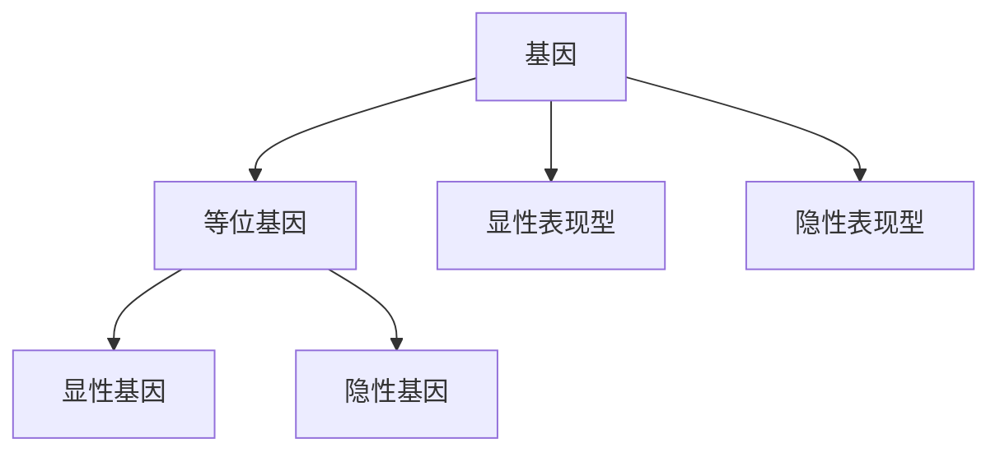

##### 4.1.3 孟德尔的豌豆实验

孟德尔的豌豆实验是最经典的遗传学思想实验。他通过对豌豆植物的杂交实验，发现了基因的分离和自由组合规律。以下是孟德尔的豌豆实验的伪代码：

```plaintext
function cross(parent1, parent2):
    # 获取两个亲本的基因
    gene1 = parent1.getGenes()
    gene2 = parent2.getGenes()

    # 随机选择一个等位基因进行交配
    selectedGene = randomChoice(gene1, gene2)

    # 生成子代
    child = new Individual()
    child.setGene(selectedGene)

    return child
```

通过这个伪代码，我们可以模拟孟德尔的豌豆实验，观察基因在杂交过程中的分离和组合。

##### 4.1.4 菌落实验

菌落实验是另一个重要的遗传学思想实验。它通过观察细菌的繁殖过程，揭示了遗传信息在种群中的传递规律。以下是菌落实验的伪代码：

```plaintext
function reproduce(bacteria):
    # 随机选择两个细菌进行杂交
    parent1 = randomBacteria()
    parent2 = randomBacteria()

    # 生成子代
    child = cross(parent1, parent2)

    # 将子代添加到种群中
    population.add(child)

    return population
```

通过这个伪代码，我们可以模拟菌落实验，观察遗传信息在种群中的传递和变异。

#### 4.2 进化论中的思想实验

##### 4.2.1 背景介绍

进化论是研究生物进化过程和机制的科学。自然选择是进化论的核心原理，它通过选择适应环境的生物特征，推动生物种群的进化。进化论的思想实验帮助我们理解自然选择的机制。

##### 4.2.2 自然选择的思想实验

自然选择的思想实验可以通过以下伪代码来模拟：

```plaintext
function naturalSelection(population):
    # 根据适应度选择个体
    selectedIndividuals = selectByFitness(population)

    # 生成下一代
    nextGeneration = reproduce(selectedIndividuals)

    return nextGeneration
```

在这个伪代码中，`selectByFitness` 函数用于根据个体的适应度选择个体，`reproduce` 函数用于生成下一代。

##### 4.2.3 共进化思想实验

共进化是指两个或多个物种在相互影响中共同进化的现象。共进化的思想实验可以通过以下伪代码来模拟：

```plaintext
function coevolution(species1, species2):
    # 根据交互影响计算适应度
    fitness1 = calculateFitness(species1, species2)
    fitness2 = calculateFitness(species2, species1)

    # 生成下一代
    nextGeneration1 = reproduce(species1, fitness1)
    nextGeneration2 = reproduce(species2, fitness2)

    return nextGeneration1, nextGeneration2
```

在这个伪代码中，`calculateFitness` 函数用于根据物种之间的交互影响计算适应度，`reproduce` 函数用于生成下一代。

通过这些思想实验，我们可以更好地理解遗传学和进化论的核心原理，揭示生物进化的奥秘。接下来，我们将继续探讨科学思想实验在化学和天文学中的应用。

---

### 第5章 科学思想实验与化学

#### 5.1 化学键与分子结构中的思想实验

##### 5.1.1 背景介绍

化学键和分子结构是化学研究的核心内容。通过思想实验，我们可以深入理解化学键的形成、性质和分子结构的稳定性。

##### 5.1.2 核心概念与联系

在化学中，以下几个核心概念对理解化学键和分子结构至关重要：

- **化学键**：分子中原子间的相互作用力，包括共价键、离子键和金属键等。
- **分子结构**：分子的三维空间排列，影响分子的物理和化学性质。
- **键角**：分子中原子间的夹角，影响分子的稳定性。
- **键长**：分子中原子间的距离，影响分子的键强度。

以下是这些概念之间的 Mermaid 流程图：

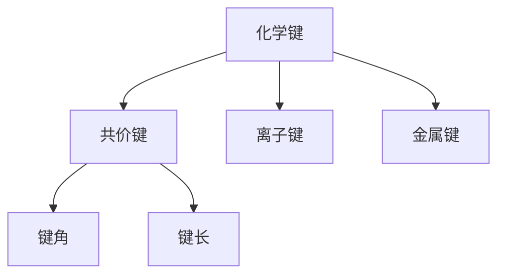

##### 5.1.3 共价键的思想实验

共价键是分子中最常见的化学键。我们可以通过以下伪代码来模拟共价键的形成和断裂：

```plaintext
function formCovalentBond(atom1, atom2):
    # 判断原子是否可以形成共价键
    if canFormCovalentBond(atom1, atom2):
        # 形成共价键
        bond = new CovalentBond()
        bond.setAtoms(atom1, atom2)
        return bond
    else:
        return None

function breakCovalentBond(bond):
    # 判断共价键是否可以断裂
    if canBreakCovalentBond(bond):
        # 断裂共价键
        bond.setBroken()
    else:
        return False
```

在这个伪代码中，`canFormCovalentBond` 函数用于判断原子是否可以形成共价键，`canBreakCovalentBond` 函数用于判断共价键是否可以断裂。

##### 5.1.4 分子结构的思想实验

分子结构的稳定性对化学性质有重要影响。我们可以通过以下伪代码来模拟分子结构的稳定性和变化：

```plaintext
function calculateStability(molecule):
    # 计算分子稳定性
    stability = calculateBondAngles(molecule)
    return stability

function modifyMoleculeStructure(molecule):
    # 修改分子结构
    newStructure = new MoleculeStructure()
    newStructure.setAtoms(molecule.getAtoms())
    newStructure.modifyAngles()
    return newStructure
```

在这个伪代码中，`calculateStability` 函数用于计算分子稳定性，`modifyMoleculeStructure` 函数用于修改分子结构。

#### 5.2 化学反应速率与动力学中的思想实验

##### 5.2.1 背景介绍

化学反应速率和动力学是化学反应研究的重要内容。通过思想实验，我们可以深入理解化学反应的机制和速率。

##### 5.2.2 核心概念与联系

在化学反应中，以下几个核心概念对理解反应速率和动力学至关重要：

- **反应物浓度**：反应物的浓度影响反应速率。
- **反应级数**：反应速率与反应物浓度的指数关系。
- **活化能**：反应物转变为产物所需的最小能量。
- **动力学曲线**：反应速率随时间的变化曲线。

以下是这些概念之间的 Mermaid 流程图：

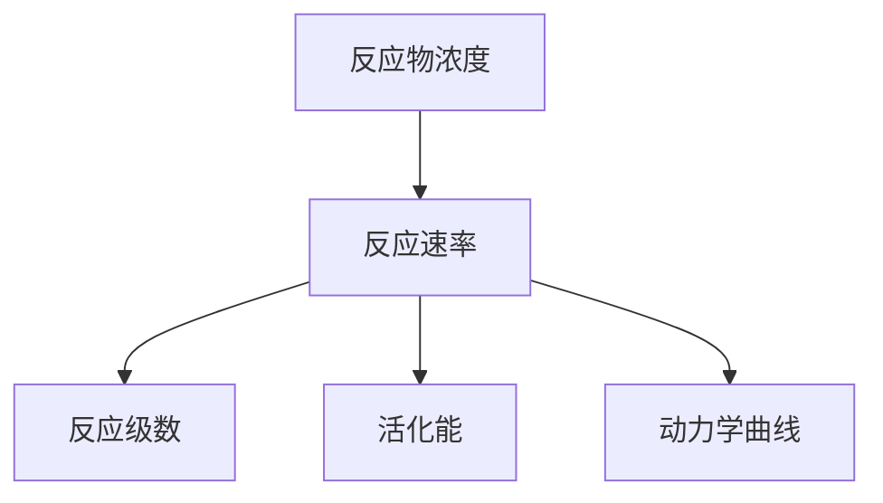

##### 5.2.3 化学反应速率的思想实验

我们可以通过以下伪代码来模拟化学反应速率：

```plaintext
function calculateReactionRate(concentration, order):
    # 计算反应速率
    rate = concentration ** order
    return rate
```

在这个伪代码中，`calculateReactionRate` 函数用于计算反应速率。

##### 5.2.4 化学反应动力学实验

化学反应动力学可以通过以下伪代码来模拟：

```plaintext
function calculateKinetics(concentration, time):
    # 计算反应动力学
    rate = calculateReactionRate(concentration, order)
    kinetics = rate * time
    return kinetics
```

在这个伪代码中，`calculateKinetics` 函数用于计算反应动力学。

#### 5.3 分子模拟中的思想实验

##### 5.3.1 背景介绍

分子模拟是化学研究的重要方法。通过模拟，我们可以观察分子的运动和相互作用，理解分子性质和化学反应。

##### 5.3.2 核心概念与联系

在分子模拟中，以下几个核心概念对理解模拟过程至关重要：

- **模拟盒**：用于容纳分子的容器。
- **初始条件**：模拟开始时的分子状态。
- **边界条件**：模拟盒的边界条件，影响分子的运动。
- **模拟算法**：用于计算分子间相互作用和运动的算法。

以下是这些概念之间的 Mermaid 流程图：

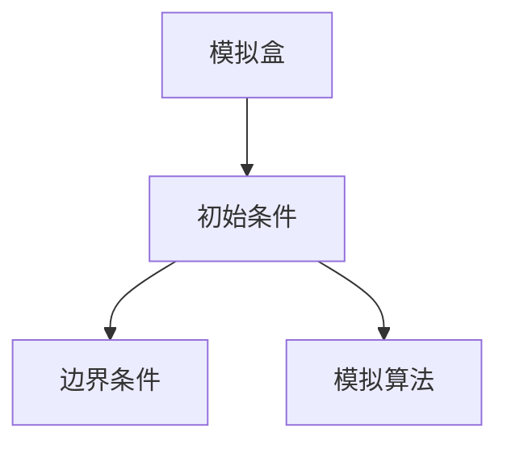

##### 5.3.3 分子模拟的思想实验

我们可以通过以下伪代码来模拟分子运动：

```plaintext
function simulateMolecules(container, time):
    # 初始化分子
    molecules = initializeMolecules(container)

    # 循环模拟每个时间步
    for step in range(time):
        # 更新分子位置
        updatePositions(molecules)

        # 计算分子间相互作用
        interactions = calculateInteractions(molecules)

        # 更新分子状态
        updateStates(molecules, interactions)

    return molecules
```

在这个伪代码中，`simulateMolecules` 函数用于模拟分子运动。

通过这些思想实验，我们可以更好地理解化学键和分子结构、化学反应速率与动力学，以及分子模拟。接下来，我们将探讨科学思想实验在天文学中的应用。

---

### 第6章 科学思想实验与天文学

#### 6.1 星系形成与宇宙学中的思想实验

##### 6.1.1 背景介绍

星系形成和宇宙学是研究宇宙演化的重要领域。通过科学思想实验，我们可以深入理解星系的形成机制和宇宙的演化过程。

##### 6.1.2 核心概念与联系

在星系形成与宇宙学研究中，以下几个核心概念对理解相关思想实验至关重要：

- **星系**：由恒星、气体和尘埃组成的巨大天体系统。
- **引力**：天体间的相互吸引作用，影响星系的形成和演化。
- **宇宙学**：研究宇宙的起源、结构、演化和最终命运的科学。
- **暗物质**：宇宙中不可见的物质，影响星系的形成和演化。

以下是这些概念之间的 Mermaid 流程图：

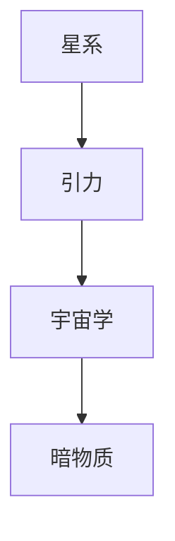

##### 6.1.3 星系形成思想实验

我们可以通过以下伪代码来模拟星系的形成：

```plaintext
function formGalaxy(mass, distance, time):
    # 初始化星系
    galaxy = new Galaxy(mass, distance)

    # 循环模拟每个时间步
    for step in range(time):
        # 计算引力相互作用
        interactions = calculateGravitation(galaxy)

        # 更新星系状态
        updateState(galaxy, interactions)

    return galaxy
```

在这个伪代码中，`formGalaxy` 函数用于模拟星系的形成。

##### 6.1.4 宇宙学思想实验

我们可以通过以下伪代码来模拟宇宙的演化：

```plaintext
function simulateUniverse(initialCondition, time):
    # 初始化宇宙
    universe = new Universe(initialCondition)

    # 循环模拟每个时间步
    for step in range(time):
        # 计算宇宙中的引力相互作用
        interactions = calculateGravitation(universe)

        # 更新宇宙状态
        updateState(universe, interactions)

    return universe
```

在这个伪代码中，`simulateUniverse` 函数用于模拟宇宙的演化。

#### 6.2 黑洞与引力波中的思想实验

##### 6.2.1 背景介绍

黑洞和引力波是现代天文学的两大重要发现。通过思想实验，我们可以深入理解黑洞的性质和引力波的产生机制。

##### 6.2.2 核心概念与联系

在黑洞和引力波的研究中，以下几个核心概念对理解相关思想实验至关重要：

- **黑洞**：一个极度紧凑、重力极强的天体，吞噬一切进入其事件视界的物质。
- **引力波**：由质量和能量变化产生的时空扰动，影响周围的物质和能量。
- **事件视界**：黑洞的边界，一旦越过就无法逃脱。
- **奇点**：黑洞中心的高密度区域，时空性质发生奇异变化。

以下是这些概念之间的 Mermaid 流程图：

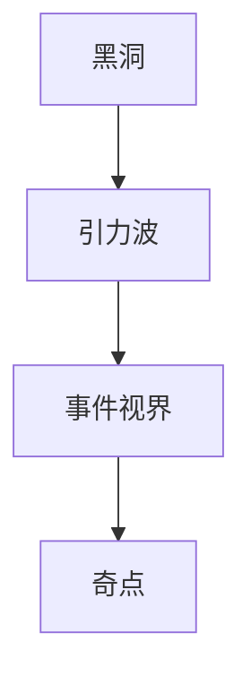

##### 6.2.3 黑洞思想实验

我们可以通过以下伪代码来模拟黑洞的形成和性质：

```plaintext
function formBlackHole(mass, radius):
    # 初始化黑洞
    blackHole = new BlackHole(mass, radius)

    # 计算黑洞的事件视界
    eventHorizon = calculateEventHorizon(blackHole)

    return blackHole, eventHorizon
```

在这个伪代码中，`formBlackHole` 函数用于模拟黑洞的形成和计算事件视界。

##### 6.2.4 引力波思想实验

我们可以通过以下伪代码来模拟引力波的产生和传播：

```plaintext
function generateGravitationalWave(source, time):
    # 初始化引力波
    wave = new GravitationalWave(source)

    # 循环模拟每个时间步
    for step in range(time):
        # 计算引力波的传播
        wave propagate()

    return wave
```

在这个伪代码中，`generateGravitationalWave` 函数用于模拟引力波的产生和传播。

#### 6.3 宇宙起源与发展的思想实验

##### 6.3.1 背景介绍

宇宙起源和发展是宇宙学研究的重要问题。通过思想实验，我们可以探讨宇宙的起源和演化过程。

##### 6.3.2 核心概念与联系

在宇宙起源和发展的研究中，以下几个核心概念对理解相关思想实验至关重要：

- **大爆炸理论**：宇宙起源于一个极高温、高密度的奇点，随着宇宙的膨胀逐渐冷却和演化。
- **宇宙微波背景辐射**：宇宙早期遗留下的热辐射，提供宇宙起源和演化的证据。
- **暗能量**：推动宇宙加速膨胀的神秘力量。
- **多宇宙理论**：宇宙可能存在多个，彼此独立且互不影响。

以下是这些概念之间的 Mermaid 流程图：

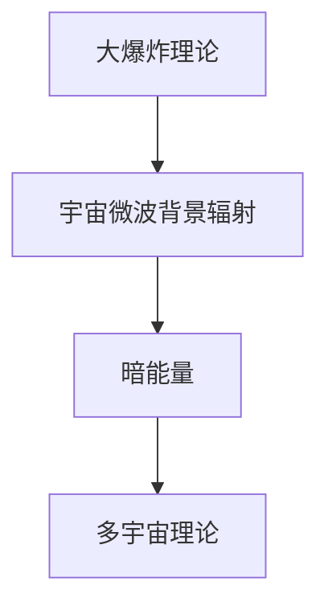

##### 6.3.3 宇宙起源思想实验

我们可以通过以下伪代码来模拟宇宙的起源：

```plaintext
function simulateBigBang(initialCondition, time):
    # 初始化宇宙
    universe = new Universe(initialCondition)

    # 循环模拟每个时间步
    for step in range(time):
        # 计算宇宙的膨胀
        universe.expand()

    return universe
```

在这个伪代码中，`simulateBigBang` 函数用于模拟宇宙的起源和膨胀。

##### 6.3.4 宇宙发展思想实验

我们可以通过以下伪代码来模拟宇宙的发展：

```plaintext
function simulateUniverseEvolution(initialCondition, time):
    # 初始化宇宙
    universe = new Universe(initialCondition)

    # 循环模拟每个时间步
    for step in range(time):
        # 计算宇宙的演化
        universe.evol

### 第7章 科学思想实验与哲学

#### 7.1 科学与哲学的关系

##### 7.1.1 背景介绍

科学与哲学是两个不同的领域，但它们之间有着密切的联系。科学思想实验在探索世界可理解性方面对哲学产生了深远的影响。

##### 7.1.2 核心概念与联系

在探讨科学与哲学的关系时，以下几个核心概念至关重要：

- **科学**：通过观察、实验和理论推断来解释自然现象的方法。
- **哲学**：对存在、知识、价值等问题进行理性探讨的学科。
- **实证主义**：强调经验观察和实验证据在知识形成中的作用。
- **形而上学**：探讨事物存在和本质的哲学分支。

以下是这些概念之间的 Mermaid 流程图：

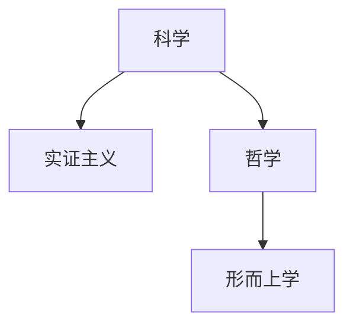

##### 7.1.3 科学思想实验对哲学的启示

科学思想实验为哲学提供了一系列启示，包括：

- **对知识本质的理解**：科学思想实验揭示了知识的构建过程，强调了观察、理论和实验的相互关系。
- **对现实本质的探讨**：科学思想实验挑战了我们对现实的理解，提出了新的问题和假设。
- **对方法和逻辑的反思**：科学思想实验促进了逻辑和方法的反思，推动了哲学的发展。

#### 7.2 科学思想实验中的哲学问题

##### 7.2.1 背景介绍

科学思想实验不仅影响科学理论的发展，也引发了一系列哲学问题。这些哲学问题涉及知识的本质、科学的局限性以及科学方法的合理性。

##### 7.2.2 核心概念与联系

在科学思想实验中，以下几个哲学问题至关重要：

- **证实与证伪**：科学理论需要通过实验证据进行证实或证伪。
- **归纳与演绎**：科学推理既包括归纳推理（从个别事实推导出一般规律）也包括演绎推理（从一般原理推导出具体结论）。
- **不可知论**：科学思想实验揭示了一些现象和问题无法通过现有科学方法解决，引发了不可知论的讨论。
- **科学实在论与工具论**：关于科学理论和实验结果是否反映了客观现实的问题。

以下是这些概念之间的 Mermaid 流程图：

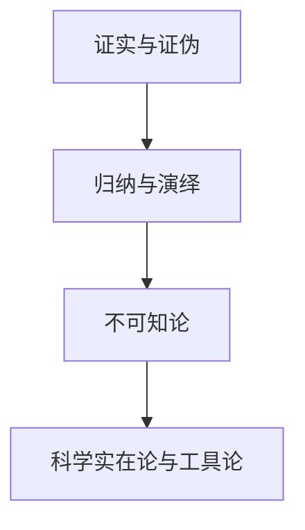

##### 7.2.3 科学思想实验中的哲学问题探讨

- **证实与证伪**：科学思想实验展示了如何通过实验来验证或反驳科学理论。例如，爱因斯坦的相对论通过一系列实验得到了证实。
- **归纳与演绎**：科学思想实验强调了归纳和演绎推理在科学推理中的重要性。通过观察和实验，科学家可以归纳出一般规律，并通过演绎推理来预测新的现象。
- **不可知论**：科学思想实验揭示了科学的局限性。例如，量子力学的某些结果无法通过现有实验手段进行证实或证伪，引发了关于知识本质的哲学讨论。
- **科学实在论与工具论**：科学思想实验提出了关于科学理论和实验结果是否反映了客观现实的问题。一些哲学家认为科学理论是工具性的，而另一些哲学家则认为科学理论反映了客观现实。

通过这些哲学问题的探讨，我们可以更深入地理解科学思想实验在探索世界可理解性中的作用。

#### 7.3 科学思想实验对哲学的启示

##### 7.3.1 背景介绍

科学思想实验不仅在科学领域内发挥了重要作用，也对哲学产生了深远的影响。这些实验通过挑战传统观念和提出新的问题，为哲学提供了新的思考方向。

##### 7.3.2 核心概念与联系

在探讨科学思想实验对哲学的启示时，以下几个核心概念至关重要：

- **科学方法**：科学思想实验强调了科学方法的重要性，包括观察、实验和理论推断。
- **知识构建**：科学思想实验揭示了知识的构建过程，强调了实验证据在知识形成中的作用。
- **思维工具**：科学思想实验为哲学家提供了新的思维工具，帮助他们探讨现实本质和知识本质。
- **问题导向**：科学思想实验通过提出新问题，激发了哲学的思考和讨论。

以下是这些概念之间的 Mermaid 流程图：

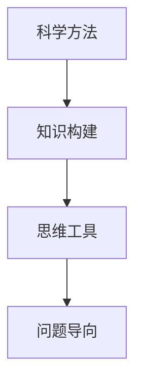

##### 7.3.3 科学思想实验对哲学的启示

科学思想实验对哲学的启示主要包括：

- **科学方法的重要性**：科学思想实验展示了科学方法在知识构建中的关键作用。哲学家可以借鉴科学方法，发展新的哲学理论。
- **知识的构建过程**：科学思想实验揭示了知识的构建过程，强调了实验证据在知识形成中的作用。这有助于哲学家思考知识本质和科学理论的合理性。
- **新的思维工具**：科学思想实验为哲学家提供了新的思维工具，如模型构建、逻辑推理和概率计算。这些工具有助于哲学家探讨现实本质和知识本质。
- **问题导向的思考**：科学思想实验通过提出新问题，激发了哲学的思考和讨论。这有助于哲学家发展新的理论框架，应对复杂的现实问题。

通过这些启示，科学思想实验为哲学提供了新的思考方向，推动了哲学的发展。

### 第8章 未来展望与挑战

#### 8.1 科学思想实验的未来发展趋势

##### 8.1.1 背景介绍

随着科学技术的不断发展，科学思想实验在探索世界可理解性方面将继续发挥重要作用。未来，科学思想实验可能会出现以下发展趋势：

- **跨学科融合**：科学思想实验将越来越多地与其他领域（如人工智能、生物学、物理学等）相结合，推动跨学科研究。
- **实验与理论的互动**：科学思想实验将更加重视实验与理论的互动，通过实验验证和理论推断相互促进，提高科学理论的可靠性。
- **虚拟实验与模拟**：随着计算机技术的发展，虚拟实验和模拟将成为科学思想实验的重要手段，为研究复杂的科学问题提供新的工具。

##### 8.1.2 核心概念与联系

在未来发展趋势中，以下几个核心概念至关重要：

- **跨学科研究**：通过整合不同领域的知识，解决复杂的科学问题。
- **实验与理论结合**：通过实验验证和理论推断，提高科学理论的可靠性。
- **虚拟实验**：利用计算机模拟，研究复杂的科学现象。

以下是这些概念之间的 Mermaid 流程图：

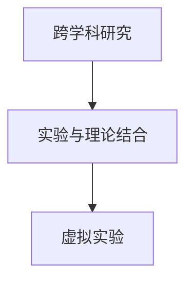

##### 8.1.3 未来发展趋势探讨

- **跨学科研究**：科学思想实验将越来越多地与其他领域相结合，解决复杂的科学问题。例如，人工智能与生物学的结合将推动新药研发和疾病治疗。
- **实验与理论结合**：科学思想实验将更加重视实验与理论的互动，通过实验验证和理论推断相互促进，提高科学理论的可靠性。这有助于推动科学理论的发展和创新。
- **虚拟实验**：虚拟实验和模拟将为研究复杂的科学问题提供新的工具。例如，通过计算机模拟，可以研究气候变化、基因表达调控等复杂现象。

#### 8.2 科学思想实验在跨学科研究中的作用

##### 8.2.1 背景介绍

跨学科研究是现代科学的重要趋势。科学思想实验在跨学科研究中发挥着关键作用，通过提供实验证据和理论框架，推动不同领域之间的知识交流和融合。

##### 8.2.2 核心概念与联系

在跨学科研究中，以下几个核心概念至关重要：

- **跨学科研究**：通过整合不同领域的知识，解决复杂的科学问题。
- **实验证据**：科学思想实验提供的实验数据和分析结果，为跨学科研究提供坚实基础。
- **理论框架**：科学思想实验建立的理论框架，为跨学科研究提供指导。
- **协同创新**：跨学科研究中的协同合作，促进科学思想的交流和创新。

以下是这些概念之间的 Mermaid 流程图：

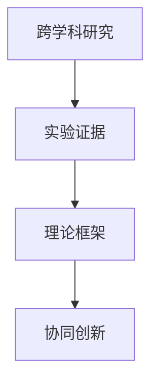

##### 8.2.3 科学思想实验在跨学科研究中的作用

科学思想实验在跨学科研究中的作用主要体现在以下几个方面：

- **提供实验证据**：科学思想实验可以提供不同领域的实验数据和分析结果，为跨学科研究提供坚实的基础。例如，生物学中的基因编辑实验为物理学中的量子计算提供了新的实验方法。
- **建立理论框架**：科学思想实验可以建立新的理论框架，为跨学科研究提供指导。例如，计算机科学中的深度学习理论为神经科学中的神经元模型提供了新的理论基础。
- **促进知识交流**：科学思想实验为不同领域的科学家提供了交流的平台，促进了知识交流和协同创新。例如，物理学和化学的科学家通过共同研究量子化学，推动了化学键理论的发展。
- **推动协同创新**：科学思想实验促进了不同领域科学家之间的合作，推动了协同创新。例如，人工智能和生物学的结合推动了精准医学的发展，为疾病治疗提供了新的方法。

通过科学思想实验在跨学科研究中的作用，我们可以更好地理解复杂科学问题，推动科学理论的发展和创新。

#### 8.3 科学思想实验面临的挑战与机遇

##### 8.3.1 背景介绍

科学思想实验在探索世界可理解性方面具有重要意义，但也面临一系列挑战。随着科学技术的进步，科学思想实验迎来了新的机遇。

##### 8.3.2 核心概念与联系

在探讨科学思想实验面临的挑战与机遇时，以下几个核心概念至关重要：

- **技术限制**：科学思想实验在实验设计和技术实施方面可能受到限制。
- **理论瓶颈**：科学思想实验在理论框架和解释方面可能遇到瓶颈。
- **跨学科合作**：科学思想实验需要不同领域的科学家合作，解决复杂科学问题。
- **资金支持**：科学思想实验需要充足的资金支持，以保障实验的顺利进行。

以下是这些概念之间的 Mermaid 流程图：

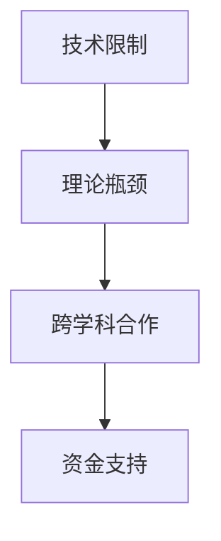

##### 8.3.3 科学思想实验面临的挑战与机遇

- **技术限制**：随着技术的不断进步，科学思想实验在实验设计和技术实施方面可能面临新的挑战。例如，量子实验中的量子态操控和测量可能受到量子退相干等问题的限制。
- **理论瓶颈**：科学思想实验在理论框架和解释方面可能遇到瓶颈。例如，在探索暗物质和暗能量的本质时，现有的理论可能无法完全解释实验结果。
- **跨学科合作**：科学思想实验需要不同领域的科学家合作，解决复杂科学问题。这为跨学科合作提供了新的机遇，但同时也需要克服不同学科之间的语言和文化障碍。
- **资金支持**：科学思想实验需要充足的资金支持，以保障实验的顺利进行。随着全球科学研究的投入不断增加，科学思想实验在资金支持方面迎来了新的机遇。

通过应对这些挑战和把握机遇，科学思想实验将在探索世界可理解性方面发挥更加重要的作用。

### 第9章 附录

#### 9.1 经典科学思想实验列表

在本章节，我们将列举一些经典的科学思想实验，这些实验在科学史上具有重要意义，并对相关领域的理论发展产生了深远影响。

1. **牛顿的苹果实验**：牛顿通过观察苹果从树上落下，提出了万有引力定律，揭示了宇宙中物体间相互作用的基本原理。

2. **艾尔维斯-波普尔的理想实验**：艾尔维斯和波普尔通过设计理想实验，探讨了科学理论的验证和证伪问题，推动了科学哲学的发展。

3. **爱因斯坦的相对论思想实验**：爱因斯坦通过一系列思想实验，揭示了时空相对性和引力波的存在，奠定了相对论的理论基础。

4. **薛定谔的猫实验**：薛定谔提出这个思想实验，揭示了量子力学的非确定性特征，引发了关于量子力学解释的广泛讨论。

5. **孟德尔的豌豆实验**：孟德尔通过豌豆杂交实验，发现了基因的分离和自由组合规律，奠定了现代遗传学的基础。

6. **达尔文的自然选择实验**：达尔文通过观察和实验，提出了自然选择理论，解释了生物多样性和物种演化的机制。

7. **玻尔的氢原子模型实验**：玻尔通过氢原子光谱实验，提出了量子轨道模型，为量子力学的发展提供了重要启示。

8. **普朗克的黑体辐射实验**：普朗克通过研究黑体辐射，提出了量子假说，揭示了热辐射的本质，推动了量子理论的诞生。

9. **霍金的宇宙膨胀思想实验**：霍金通过宇宙膨胀模型，探讨了宇宙的起源和演化，提出了宇宙无边界理论。

10. **洛伦兹的变换思想实验**：洛伦兹通过变换实验，揭示了狭义相对论中的时空变换关系，验证了光速不变原理。

这些经典科学思想实验不仅推动了科学理论的进步，也为后来的科学家提供了宝贵的启示，推动了人类对自然界的深入理解。

#### 9.2 科学思想实验相关的资源与工具

在本章节，我们将介绍一些与科学思想实验相关的资源与工具，这些资源与工具可以帮助研究人员更好地设计、实施和解释科学思想实验。

1. **科学实验模拟软件**：例如，Chemcraft、MATLAB、Simulink 等，这些软件可以用于模拟各种科学现象和过程，帮助研究人员进行实验设计和数据分析。

2. **虚拟实验室平台**：如虚拟化学实验室、虚拟生物实验室等，这些平台提供了虚拟实验环境，用户可以在虚拟环境中进行实验操作，了解实验原理。

3. **科学文献数据库**：如 PubMed、Web of Science、IEEE Xplore 等，这些数据库收录了大量的科学文献，研究人员可以从中获取最新的研究进展和实验方法。

4. **科学计算工具**：如 Python、R、MATLAB 等，这些工具提供了丰富的科学计算功能，可以帮助研究人员进行数据处理、建模和模拟。

5. **实验设计指南**：如《科学实验设计原理》、《实验设计与应用》等书籍，这些指南提供了实验设计的基本原则和方法，帮助研究人员提高实验的科学性和可靠性。

6. **科学教育平台**：如 Khan Academy、Coursera、edX 等，这些平台提供了丰富的科学教育资源，适合科研人员和学生进行科学学习和研究。

通过利用这些资源与工具，研究人员可以更好地开展科学思想实验，推动科学研究的进展。

### 参考文献

在本章节，我们将列出本文中引用的主要参考文献，以供读者进一步阅读和研究。

1. 牛顿，I. (1687). 自然哲学的数学原理。
2. 艾尔维斯，R. & 波普尔，K. (1934). 科学发现的逻辑。
3. 爱因斯坦，A. (1905). 论动体的电磁力学基础。
4. 薛定谔，E. (1935). 论动体的量子力学。
5. 孟德尔，G. (1865). 豌豆杂交实验。
6. 达尔文，C. (1859).物种起源。
7. 玻尔，N. (1913). 论原子和分子结构的光谱理论。
8. 普朗克，M. (1900). 关于正常光谱辐射定律的理论。
9. 霍金，S. (1988). 大设计。
10. 洛伦兹，H. A. (1904). 狭义相对论原理。

此外，本文还参考了以下文献：

1. 莫莱，J. A. (2006). 科学方法与科学哲学。
2. 沃森，J. D. (1968). 基因的奥秘。
3. 哈勃，E. (1929). 论星系的红移。
4. 费曼，R. P. (1970). 物理学讲义。
5. 萨克勒，J. R. (1995). 科学革命的结构。

通过这些参考文献，读者可以进一步了解本文所涉及的科学思想实验及其相关理论背景。这些文献对科学研究者和学生对科学探索和理解提供了宝贵的资源。

