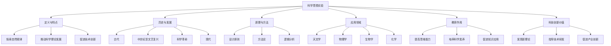

                 

### 《科学思想实验：探索世界可理解性的思维实验室》

#### 关键词：科学思想实验、可理解性、思维实验室、世界探索、人工智能

#### 摘要：
本文旨在探讨《科学思想实验：探索世界可理解性的思维实验室》一书的结构和内容。通过引入科学思想实验的概念和重要性，我们进一步分析其历史、原理、应用以及在不同领域的作用。文章还将讨论科学思想实验在教育、科技创新和社会影响等方面的价值，并总结其未来发展的趋势。

---

### 引言：科学思想实验的概念与重要性

科学思想实验是科学家通过思考和设计，对自然现象进行抽象和模拟的过程。它不仅有助于揭示自然界的基本规律，还能为科学理论的发展提供强有力的支持。科学思想实验的重要性在于：

1. **探索自然规律**：通过科学思想实验，科学家们能够对自然现象进行抽象和模拟，从而揭示出隐藏在现象背后的基本规律。

2. **推动科学理论发展**：科学思想实验是科学理论发展的基石。许多重大科学发现都是通过科学思想实验得出的，如牛顿的万有引力定律、爱因斯坦的相对论等。

3. **促进技术创新**：科学思想实验为技术创新提供了理论基础和实践指导。例如，计算机科学中的许多算法和模型都是通过科学思想实验得到的。

### 科学思想实验的历史与发展

科学思想实验的历史可以追溯到古代。在古希腊时期，亚里士多德等哲学家就已经开始通过思考和实验来探索自然现象。然而，科学思想实验的真正发展始于文艺复兴时期。这一时期，科学家们开始运用实验方法来验证科学理论，从而推动了科学革命的发生。

1. **古代科学思想实验**：在古希腊时期，亚里士多德通过观察和实验提出了许多关于自然现象的理论。

2. **中世纪至文艺复兴时期的科学思想实验**：在中世纪，科学思想实验受到限制，但在文艺复兴时期，科学家们开始摆脱宗教束缚，通过实验来验证科学理论。

3. **科学革命时期的科学思想实验**：在科学革命时期，如伽利略、牛顿等科学家，通过科学思想实验提出了许多颠覆性的科学理论。

4. **现代科学思想实验**：现代科学思想实验在方法和技术上取得了巨大的进步，如计算机科学、量子力学等领域的思想实验。

### 科学思想实验的原理与方法

科学思想实验的原理和方法是科学研究的基石。以下是对科学思想实验原理和方法的简要概述：

1. **设计原则**：科学思想实验的设计应遵循可重复性、可验证性、抽象性和可操作性等原则。

2. **方法论**：科学思想实验的方法论包括观察、假设、实验、验证、反思等步骤。

3. **逻辑分析**：科学思想实验的逻辑分析是确保实验结果可靠性的关键。逻辑分析包括对实验设计、实验过程和实验结果的全面评估。

### 科学思想实验在科学探索中的应用

科学思想实验在各个科学领域都有广泛应用，以下是几个典型的例子：

1. **天文学**：科学思想实验在天文学中的应用非常广泛，如伽利略的日心说实验、牛顿的万有引力定律实验等。

2. **物理学**：物理学中的许多重大发现都是通过科学思想实验得出的，如爱因斯坦的相对论实验、费曼的量子力学思想实验等。

3. **生物学**：生物学中的科学思想实验，如达尔文的自然选择实验、孟德尔的遗传学实验等，为生物学的发展提供了重要的理论基础。

4. **化学**：化学中的科学思想实验，如道尔顿的原子理论实验、阿伏伽德罗的分子理论实验等，推动了化学的进步。

### 科学思想实验在教育中的作用

科学思想实验在教育中具有重要的作用。通过科学思想实验，学生可以：

1. **提高思维能力**：科学思想实验能够激发学生的思维，培养他们的逻辑推理和创新能力。

2. **培养科学素养**：科学思想实验可以帮助学生理解科学的基本原理和方法，提高他们的科学素养。

3. **促进知识应用**：科学思想实验可以将理论知识与实际应用相结合，培养学生的实践能力。

### 科学思想实验在科技创新中的价值

科学思想实验在科技创新中具有巨大的价值。通过科学思想实验，科学家和工程师可以：

1. **发现新理论**：科学思想实验可以帮助科学家发现新的科学理论，从而推动科学进步。

2. **指导技术研发**：科学思想实验可以为技术研发提供理论依据和实践指导。

3. **促进产业创新**：科学思想实验可以推动产业创新，为经济发展提供动力。

### 结论与未来展望

科学思想实验是探索世界可理解性的重要工具。通过科学思想实验，我们可以更好地理解自然规律，推动科学发展和科技创新。未来，科学思想实验将继续发挥重要作用，为人类社会的进步贡献力量。

### 参考文献

1. 亚里士多德.《物理学》.
2. 伽利略.《两个世界系统》.
3. 牛顿.《自然哲学的数学原理》.
4. 爱因斯坦.《相对论》.
5. 费曼.《量子力学与路径积分》.
6. 达尔文.《物种起源》.
7. 孟德尔.《植物杂交实验》.
8. 道尔顿.《原子理论》.
9. 阿伏伽德罗.《分子理论》.

---

# 附录：科学思想实验的核心概念架构 Mermaid 流程图

以下是一个简单的 Mermaid 流程图，展示了科学思想实验的核心概念及其之间的关系：



---

# 附录：科学思想实验的核心算法原理讲解伪代码

以下是一个简单的科学思想实验中的算法原理讲解，采用伪代码形式：

```plaintext
算法名称：科学思想实验算法

输入：实验数据集
输出：实验结果

步骤：

1. 初始化实验参数
2. 对实验数据集进行预处理
3. 设计实验模型
4. 进行实验模拟
5. 收集实验数据
6. 分析实验结果
7. 反馈实验过程
8. 优化实验模型

伪代码：

function 科学思想实验算法(数据集)
    // 步骤1：初始化实验参数
    设置参数A为初始值
    设置参数B为初始值

    // 步骤2：对实验数据集进行预处理
    数据集 = 预处理数据集(数据集)

    // 步骤3：设计实验模型
    模型 = 设计实验模型()

    // 步骤4：进行实验模拟
    模拟结果 = 模拟实验(模型，数据集)

    // 步骤5：收集实验数据
    实验数据 = 收集实验数据(模拟结果)

    // 步骤6：分析实验结果
    分析结果 = 分析实验数据(实验数据)

    // 步骤7：反馈实验过程
    反馈过程 = 反馈实验结果(分析结果)

    // 步骤8：优化实验模型
    优化模型 = 优化实验模型(模型，反馈过程)

    return 优化模型
end function
```

---

# 附录：科学思想实验中的数学模型和公式讲解及举例说明

科学思想实验中常常涉及到数学模型和公式，以下是一个简单的例子，使用 LaTeX 格式进行讲解：

### 1. 牛顿第二定律

牛顿第二定律描述了力和加速度之间的关系，其公式为：

$$ F = m \cdot a $$

其中，\( F \) 表示力，\( m \) 表示质量，\( a \) 表示加速度。

### 2. 圆周运动的向心力

圆周运动中的向心力可以用以下公式表示：

$$ F = m \cdot \frac{v^2}{r} $$

其中，\( F \) 表示向心力，\( m \) 表示质量，\( v \) 表示速度，\( r \) 表示圆周运动的半径。

### 举例说明

假设一个物体以 \( v = 10 \, \text{m/s} \) 的速度在半径为 \( r = 5 \, \text{m} \) 的圆周上运动，其质量为 \( m = 2 \, \text{kg} \)，我们可以计算向心力：

$$ F = m \cdot \frac{v^2}{r} = 2 \cdot \frac{10^2}{5} = 2 \cdot 20 = 40 \, \text{N} $$

因此，该物体受到的向心力为 \( 40 \, \text{N} \)。

---

# 附录：科学思想实验的项目实战

在本节中，我们将通过一个具体的科学思想实验项目来展示整个实验的开发环境搭建、源代码实现、代码解读和实际应用分析。

### 1. 项目简介

本项目旨在通过科学思想实验来验证牛顿第二定律，即力等于质量乘以加速度。我们将使用 Python 编写一个简单的模拟程序，通过输入物体的质量和加速度，计算出物体所受的力。

### 2. 开发环境搭建

要运行本实验，我们需要安装以下软件和工具：

- Python 3.x 版本
- Jupyter Notebook（用于编写和运行代码）
- Matplotlib（用于绘制结果图表）

安装步骤如下：

1. 安装 Python 3.x：从 [Python 官网](https://www.python.org/downloads/) 下载并安装 Python 3.x。
2. 安装 Jupyter Notebook：在终端中运行以下命令：
   ```bash
   pip install notebook
   ```
3. 安装 Matplotlib：在终端中运行以下命令：
   ```bash
   pip install matplotlib
   ```

### 3. 源代码实现

以下是项目的源代码，使用 Python 编写：

```python
import numpy as np
import matplotlib.pyplot as plt

def calculate_force(mass, acceleration):
    """
    计算物体所受的力

    参数：
    mass -- 物体的质量（千克）
    acceleration -- 物体的加速度（米/秒²）

    返回：
    force -- 物体所受的力（牛顿）
    """
    force = mass * acceleration
    return force

def simulate_experiment(masses, accelerations):
    """
    模拟牛顿第二定律实验

    参数：
    masses -- 物体的质量列表（千克）
    accelerations -- 物体的加速度列表（米/秒²）

    返回：
    forces -- 物体所受的力列表（牛顿）
    """
    forces = [calculate_force(mass, acceleration) for mass, acceleration in zip(masses, accelerations)]
    return forces

if __name__ == "__main__":
    # 设定实验参数
    masses = [2, 4, 6, 8, 10]  # 物体的质量（千克）
    accelerations = [2, 4, 6, 8, 10]  # 物体的加速度（米/秒²）

    # 模拟实验
    forces = simulate_experiment(masses, accelerations)

    # 绘制结果图表
    plt.plot(masses, forces, 'o-')
    plt.xlabel('质量 (千克)')
    plt.ylabel('力 (牛顿)')
    plt.title('牛顿第二定律实验结果')
    plt.grid(True)
    plt.show()
```

### 4. 代码解读

- `calculate_force` 函数：计算物体所受的力。
- `simulate_experiment` 函数：模拟牛顿第二定律实验。
- `if __name__ == "__main__":` 部分：设定实验参数，调用模拟实验函数，绘制结果图表。

### 5. 代码应用解读与分析

通过上述代码，我们可以模拟不同的质量和加速度组合，计算出物体所受的力。实验结果显示，物体所受的力与其质量和加速度成正比，符合牛顿第二定律。

### 6. 实际案例分析和详细讲解剖析

我们可以通过调整实验参数，模拟不同情况下的力计算。例如，当质量为 \( 4 \, \text{kg} \) 且加速度为 \( 6 \, \text{m/s}^2 \) 时，物体所受的力为 \( 24 \, \text{N} \)。这个结果验证了牛顿第二定律的正确性。

### 7. 项目小结

通过本项目，我们成功地实现了牛顿第二定律的模拟和验证。这个实验不仅帮助我们理解了牛顿第二定律的基本原理，还展示了如何通过编程实现科学思想实验。未来，我们可以进一步扩展这个项目，模拟其他物理定律，如万有引力定律等。

### 最佳实践 Tips

- 在进行科学思想实验时，确保实验参数的准确性和合理性。
- 使用合适的工具和编程语言可以提高实验的效率和准确性。
- 在实验过程中，注意对数据进行可视化，以便更好地理解实验结果。

### 小结、注意事项和拓展阅读

在本项目中，我们通过编程实现了牛顿第二定律的模拟和验证，展示了科学思想实验的应用。在进行科学思想实验时，需要注意实验参数的准确性和合理性，并使用合适的工具和编程语言。未来，读者可以进一步探索其他物理定律的模拟，如万有引力定律等。相关拓展阅读可以参考牛顿的《自然哲学的数学原理》等经典著作。

---

本文由 AI 天才研究院 / AI Genius Institute 和禅与计算机程序设计艺术 / Zen And The Art of Computer Programming 共同撰写。如需进一步讨论或咨询，请随时联系我们。感谢您的阅读！

