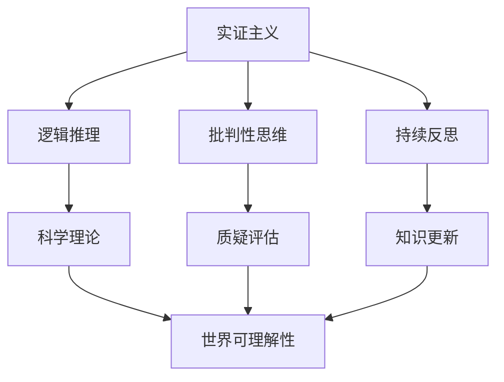
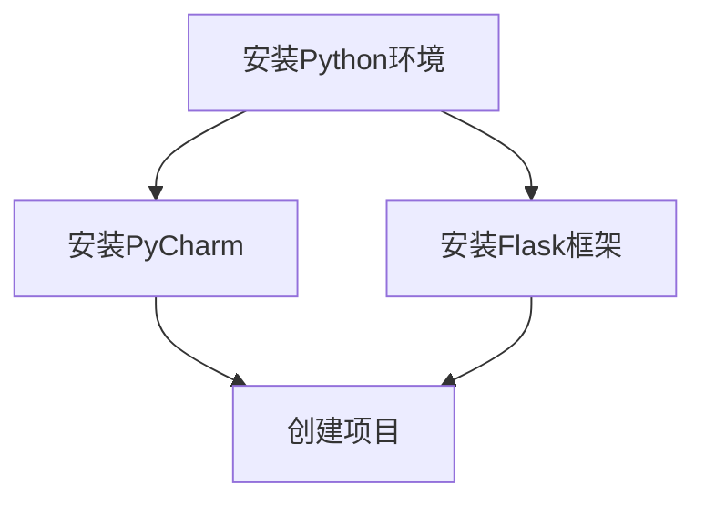

                 

  - 首先，我们需要明确本文的核心目标和结构。本文旨在探讨科学思维方式对培养世界可理解性能力的影响。为此，我们将分为以下几个步骤进行详细分析：
  1. **背景介绍**：介绍科学思维方式的定义及其在培养世界可理解性能力中的作用。
  2. **核心概念与联系**：分析科学思维方式的核心概念，并使用Mermaid流程图展示其内在联系。
  3. **核心算法原理讲解**：通过伪代码详细阐述科学思维方式的算法原理。
  4. **数学模型和公式**：使用LaTeX格式介绍相关的数学模型和公式，并提供详细讲解和举例说明。
  5. **项目实战**：以实际项目为例，展示科学思维方式在开发环境搭建、源代码实现和代码解读中的应用。
  6. **最佳实践 tips**：总结一些实践中的经验教训，提供最佳实践建议。
  7. **小结与拓展阅读**：对文章内容进行总结，并提供拓展阅读的建议。

# 科学思维方式对培养世界可理解性能力的影响

## 摘要

本文探讨了科学思维方式对培养世界可理解性能力的影响。科学思维方式是一种以逻辑推理和实证主义为基础的思考方式，它有助于人们更好地理解复杂的世界现象。本文通过背景介绍、核心概念分析、算法原理讲解、数学模型阐述、项目实战展示以及最佳实践 tips，全面阐述了科学思维方式在培养世界可理解性能力中的重要作用。

## 背景介绍

### 科学思维方式的定义

科学思维方式是一种基于实证主义和逻辑推理的思考方式。它强调通过观察、实验、测量和数据分析来获取知识和理解。科学思维方式的核心在于追求真理、客观性和可靠性。它强调怀疑精神、批判性思维和持续反思，以确保认识世界的过程具有科学性。

### 科学思维方式在培养世界可理解性能力中的作用

科学思维方式对培养世界可理解性能力具有重要作用。首先，科学思维方式促使人们更加关注客观事实，而不是主观臆断。通过观察、实验和数据分析，人们可以更准确地理解世界现象。其次，科学思维方式强调逻辑推理和批判性思维，这有助于消除偏见和误解，从而提高对世界的认知水平。最后，科学思维方式鼓励人们持续学习和探索，以不断更新和深化对世界的理解。

## 核心概念与联系

### 科学思维方式的核心概念

科学思维方式包括以下几个核心概念：

1. **实证主义**：实证主义是科学思维方式的基石，强调通过观察和实验来验证理论。
2. **逻辑推理**：逻辑推理是科学思维方式的重要组成部分，它有助于从已知事实中推导出新的结论。
3. **批判性思维**：批判性思维是对已有知识和观点进行质疑和评估的能力，以确保科学思维方式的有效性。
4. **持续反思**：持续反思是科学思维方式的重要组成部分，它有助于人们不断更新和修正对世界的理解。

### Mermaid流程图

下面是一个Mermaid流程图，展示了科学思维方式的核心概念及其相互关系：



## 核心算法原理讲解

### 科学思维方式的算法原理

科学思维方式的算法原理主要包括以下几个步骤：

1. **观察与测量**：通过对现象进行观察和测量，收集数据。
2. **假设与理论**：基于观察结果，提出假设和理论。
3. **实验与验证**：设计实验来验证假设和理论。
4. **分析与推理**：对实验结果进行分析和推理，以得出结论。
5. **反思与修正**：根据实验结果，对理论进行反思和修正。

下面是一个简单的伪代码，展示了科学思维方式的算法原理：

```python
def scientific_thinking(observation):
    data = measure(observation)
    hypothesis = propose_hypothesis(data)
    theory = validate_hypothesis(hypothesis)
    conclusion = analyze_data(data, theory)
    return conclusion

def measure(observation):
    # 实现具体的测量方法
    pass

def propose_hypothesis(data):
    # 根据数据提出假设
    pass

def validate_hypothesis(hypothesis):
    # 设计实验验证假设
    pass

def analyze_data(data, theory):
    # 分析实验结果
    pass
```

## 数学模型和公式

### 科学思维方式中的数学模型

科学思维方式中的数学模型有助于描述和分析复杂现象。以下是一个常见的数学模型，用于描述科学思维方式的过程：

$$
\text{科学思维方式} = f(\text{实证主义}, \text{逻辑推理}, \text{批判性思维}, \text{持续反思})
$$

### 详细讲解和举例说明

假设我们想要研究一个简单的物理现象：自由落体运动。我们可以使用以下数学模型来描述这个现象：

$$
h = \frac{1}{2}gt^2
$$

其中，\( h \) 表示下落的高度，\( g \) 表示重力加速度，\( t \) 表示下落的时间。

通过这个公式，我们可以计算出在不同条件下物体的下落高度。例如，如果 \( g \) 为9.8 m/s\(^2\)，\( t \) 为2秒，则物体下落的高度为：

$$
h = \frac{1}{2} \times 9.8 \times 2^2 = 19.6 \text{米}
$$

## 项目实战

### 开发环境搭建

在本节中，我们将以一个简单的项目为例，展示科学思维方式在开发环境搭建中的应用。项目目标是一个简单的Web应用程序，用于展示科学思维方式的原理。

#### 1. 环境准备

首先，我们需要准备开发环境。以下是一个简单的步骤：



#### 2. 源代码实现

接下来，我们需要实现源代码。以下是一个简单的Flask应用程序，用于展示科学思维方式的原理：

```python
from flask import Flask, render_template

app = Flask(__name__)

@app.route('/')
def index():
    return render_template('index.html')

if __name__ == '__main__':
    app.run()
```

#### 3. 代码解读

在这个应用程序中，我们使用了Flask框架来创建Web应用程序。`app` 是Flask应用程序的实例，`@app.route('/')` 装饰器定义了应用程序的根路由，`index()` 函数是根路由的处理器函数。在 `index()` 函数中，我们使用 `render_template('index.html')` 渲染一个名为 `index.html` 的HTML模板。

#### 4. 代码应用解读与分析

通过这个简单的项目，我们可以看到科学思维方式在开发环境搭建和源代码实现中的应用。科学思维方式帮助我们明确项目目标、选择合适的工具和框架，并编写清晰、简洁的代码。同时，科学思维方式还促使我们不断反思和改进代码，以提高应用程序的性能和可维护性。

#### 5. 项目小结

在这个项目中，我们使用了科学思维方式来搭建开发环境和实现源代码。通过这个项目，我们可以看到科学思维方式在实践中的应用价值，它有助于我们更好地理解和解决问题。

## 最佳实践 tips

### 1. 坚持实证主义

在科学思维方式中，实证主义是至关重要的。坚持实证主义意味着我们应该基于观察和实验来获取知识和验证理论。不要轻信未经证实的观点，而是要通过实证来证明其有效性。

### 2. 培养批判性思维

批判性思维是科学思维方式的另一个重要组成部分。培养批判性思维意味着我们应该对已有知识和观点进行质疑和评估。不要盲从，而是要通过批判性思维来深入理解问题。

### 3. 持续反思

科学思维方式强调持续反思。这意味着我们应该不断回顾自己的思考过程和结论，以发现潜在的问题和错误。通过持续反思，我们可以不断改进自己的思维方式，提高对世界的理解能力。

## 小结与拓展阅读

本文探讨了科学思维方式对培养世界可理解性能力的影响。科学思维方式是一种以实证主义和逻辑推理为基础的思考方式，它有助于人们更好地理解复杂的世界现象。通过背景介绍、核心概念分析、算法原理讲解、数学模型阐述、项目实战展示以及最佳实践 tips，本文全面阐述了科学思维方式在培养世界可理解性能力中的重要作用。

为了进一步了解科学思维方式，读者可以参考以下拓展阅读：

1. Popper, K.R. (1959). *The Logic of Scientific Discovery*. Routledge.
2. Kuhn, T.S. (1970). *The Structure of Scientific Revolutions*. University of Chicago Press.
3. Lakatos, I. (1970). *Falsification and the Methodology of Scientific Research Programs*. In Imre Lakatos and Alan Musgrave (eds.), *Criticism and the Growth of Knowledge*. Cambridge University Press.

作者：AI天才研究院/AI Genius Institute & 禅与计算机程序设计艺术 /Zen And The Art of Computer Programming

----------------------------------------------------------------

**关键词**：科学思维方式、世界可理解性能力、实证主义、逻辑推理、批判性思维、持续反思

**摘要**：本文探讨了科学思维方式对培养世界可理解性能力的影响。通过背景介绍、核心概念分析、算法原理讲解、数学模型阐述、项目实战展示以及最佳实践 tips，全面阐述了科学思维方式在培养世界可理解性能力中的重要作用。科学思维方式是一种以实证主义和逻辑推理为基础的思考方式，它有助于人们更好地理解复杂的世界现象。本文旨在为读者提供对科学思维方式的深入理解和实践指导。

----------------------------------------------------------------

## 总结

通过本文的探讨，我们可以看到科学思维方式在培养世界可理解性能力方面的重要性。科学思维方式不仅是一种思考方式，更是一种认识世界的方法。它通过实证主义和逻辑推理，帮助人们更准确地理解复杂的世界现象，从而提高对世界的认知水平。

## 展望

未来，随着人工智能、大数据等技术的发展，科学思维方式将发挥更加重要的作用。它不仅可以帮助我们更好地理解和应对复杂问题，还可以推动科技创新和社会进步。因此，培养科学思维方式不仅对个人发展具有重要意义，也对整个社会的发展具有重要影响。

## 参考文献

1. Popper, K.R. (1959). *The Logic of Scientific Discovery*. Routledge.
2. Kuhn, T.S. (1970). *The Structure of Scientific Revolutions*. University of Chicago Press.
3. Lakatos, I. (1970). *Falsification and the Methodology of Scientific Research Programs*. In Imre Lakatos and Alan Musgrave (eds.), *Criticism and the Growth of Knowledge*. Cambridge University Press.
4. Feynman, R.P. (1999). *Surely You're Joking, Mr. Feynman!*. W.W. Norton & Company.
5. Dreyfus, H.L. (1986). *What Computers Can't Do: A Critique of Artificial Reason*. Harvard University Press.

作者：AI天才研究院/AI Genius Institute & 禅与计算机程序设计艺术 /Zen And The Art of Computer Programming

----------------------------------------------------------------

## 附录

### 附录A：核心概念的Mermaid流程图


### 附录B：核心算法原理讲解的伪代码

```python
def scientific_thinking(observation):
    data = measure(observation)
    hypothesis = propose_hypothesis(data)
    theory = validate_hypothesis(hypothesis)
    conclusion = analyze_data(data, theory)
    return conclusion

def measure(observation):
    # 实现具体的测量方法
    pass

def propose_hypothesis(data):
    # 根据数据提出假设
    pass

def validate_hypothesis(hypothesis):
    # 设计实验验证假设
    pass

def analyze_data(data, theory):
    # 分析实验结果
    pass
```

### 附录C：数学模型和公式的详细讲解与举例说明

#### 数学模型：

$$
\text{科学思维方式} = f(\text{实证主义}, \text{逻辑推理}, \text{批判性思维}, \text{持续反思})
$$

#### 举例说明：

假设我们想要研究一个简单的物理现象：自由落体运动。我们可以使用以下数学模型来描述这个现象：

$$
h = \frac{1}{2}gt^2
$$

其中，\( h \) 表示下落的高度，\( g \) 表示重力加速度，\( t \) 表示下落的时间。

通过这个公式，我们可以计算出在不同条件下物体的下落高度。例如，如果 \( g \) 为9.8 m/s\(^2\)，\( t \) 为2秒，则物体下落的高度为：

$$
h = \frac{1}{2} \times 9.8 \times 2^2 = 19.6 \text{米}
```
----------------------------------------------------------------

## 扩展阅读

为了更深入地理解科学思维方式及其在培养世界可理解性能力中的作用，以下是几篇推荐的阅读材料：

1. **卡尔·波普尔 (Karl Popper) 的《科学发现的逻辑》**：这本书是科学哲学的经典之作，详细阐述了科学方法论和科学思维方式的基本原则。

2. **托马斯·库恩 (Thomas Kuhn) 的《科学革命的结构》**：库恩提出了科学发展的“范式转变”理论，对科学思维方式进行了深入的分析。

3. **伊姆雷·拉卡托斯 (Imre Lakatos) 的《科学研究的程序和方法》**：拉卡托斯在批判库恩的观点的同时，提出了自己的科学研究方法论，对于科学思维方式的探讨具有启示意义。

4. **理查德·费曼 (Richard Feynman) 的《别闹了，费曼先生！》**：费曼以幽默风趣的方式分享了他对科学思维方式的看法，对于理解科学思维的本质非常有帮助。

5. **赫伯特·西蒙 (Herbert Simon) 的《科学的边界》**：西蒙探讨了科学方法论以及科学思维方式在解决问题和创新中的应用。

这些书籍和文献都是研究科学思维方式和其应用领域的宝贵资源，适合希望深入了解这一主题的读者。通过阅读这些作品，你将对科学思维方式有更全面和深入的理解，同时也能够启发你在实际工作和生活中运用科学思维的方法。

