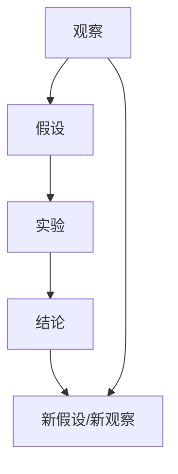

                 

## 科学思维方式对增进世界可理解性的影响

### 关键词
- 科学思维方式
- 世界可理解性
- 影响因素
- 逻辑推理
- 数学模型
- 项目实战

### 摘要
本文旨在探讨科学思维方式对增进世界可理解性的影响。我们将首先介绍科学思维方式的基本概念，包括其核心原理和特征。接着，我们将使用Mermaid流程图展示科学思维方式中的核心概念及其相互关系。随后，我们将深入讲解科学思维方式中的关键算法原理，并使用伪代码详细阐述其工作流程。此外，本文还将涉及科学思维方式中的数学模型和公式，通过Latex格式嵌入文中，并给出详细的讲解和举例说明。最后，我们将通过实际项目实战，展示科学思维方式在开发环境搭建、源代码实现和代码解读中的应用，并提供项目小结和拓展阅读建议。

## 目录大纲设计思考步骤

为了设计出符合要求的《科学思维方式对增进世界可理解性的影响》这本书的目录大纲，我们可以遵循以下步骤进行：

### 步骤1：明确核心主题和结构
首先，我们需要明确这本书的核心主题是什么，它是如何影响世界可理解性的。这本书的主题可能包括科学思维方式的基本概念、科学思维方式的特征、科学思维方式的应用等领域。结构上可以分为以下几个部分：

- **引言**：介绍科学思维方式的背景和重要性。
- **核心概念与联系**：详细讲解科学思维方式的基本概念，并使用 Mermaid 流程图展示概念之间的联系。
- **特征与应用**：分析科学思维方式的特征，并探讨其在不同领域的应用。
- **数学模型与公式**：介绍科学思维方式中的数学模型和公式，并进行详细讲解和举例说明。
- **项目实战**：通过实际案例展示科学思维方式的应用，并提供详细的代码实现和解读。

### 步骤2：细化章节内容
在明确结构后，我们需要细化每个章节的内容，确保每个章节都有清晰的标题和内容概括。以下是一个可能的细化方案：

#### 引言
- **科学思维方式的背景和重要性**：介绍科学思维方式的历史和发展，以及它在现代社会中的重要性。

#### 核心概念与联系
- **科学思维方式的基本概念**：讲解科学思维方式的核心概念，如观察、假设、实验、结论等。
- **Mermaid 流程图**：使用 Mermaid 语言绘制科学思维方式的基本概念之间的联系流程图。

#### 特征与应用
- **科学思维方式的特征**：分析科学思维方式的特征，如系统性、逻辑性、实证性等。
- **科学思维方式的应用**：探讨科学思维方式在自然科学、社会科学、工程技术等领域的应用。

#### 数学模型与公式
- **科学思维方式中的数学模型**：介绍科学思维方式中的数学模型，如统计学、概率论、线性代数等。
- **详细讲解与举例说明**：使用 Latex 格式详细讲解数学模型和公式，并提供实例说明。

#### 项目实战
- **代码实现与解读**：提供科学思维方式在实际项目中的应用案例，包括开发环境搭建、源代码实现和代码解读。

### 步骤3：整理大纲
在细化章节内容后，我们需要将大纲整理成符合markdown格式的结构，确保大纲的简洁性和逻辑性。以下是一个可能的整理方案：

```
# 科学思维方式对增进世界可理解性的影响

## 引言
### 科学思维方式的背景和重要性

## 核心概念与联系
### 科学思维方式的基本概念
#### Mermaid 流程图

## 特征与应用
### 科学思维方式的特征
#### 科学思维方式的应用

## 数学模型与公式
### 科学思维方式中的数学模型
#### 详细讲解与举例说明

## 项目实战
### 代码实现与解读
#### 开发环境搭建
#### 源代码实现
#### 代码解读与分析
```

### 步骤4：确保完整性和字数限制
在完成大纲设计后，我们需要检查每个章节的内容是否完整，确保核心概念、特征与应用、数学模型与公式、项目实战等部分都有详细的阐述。同时，注意控制整体大纲的字数，确保不超过2000字。

通过以上步骤，我们可以设计出一个完整、逻辑清晰的《科学思维方式对增进世界可理解性的影响》目录大纲。接下来，我们将按照这个大纲逐步展开每个章节的内容。

## 科学思维方式的基本概念

科学思维方式是一种通过观察、假设、实验和结论等步骤来研究和理解自然现象和社会现象的方法。它具有系统性、逻辑性和实证性的特征，旨在通过理性分析和验证来增进我们对世界的理解。在科学思维方式的框架下，我们可以将关键概念分为以下几个部分：

### 观察

观察是科学思维方式的起点。它指的是对自然现象或社会现象的感知和记录。观察过程中，我们需要关注现象的各个方面，包括其特征、变化和规律。科学观察要求客观、准确和全面，尽量避免主观臆断和偏见。

### 假设

在观察的基础上，科学思维方式要求我们提出假设。假设是对观察结果的一种解释或预测，它为后续的实验设计提供了基础。一个有效的假设应该具备合理性、简洁性和可验证性。科学假设通常基于已有的理论和知识，但也可以通过创新和直觉来提出新的假设。

### 实验

实验是科学思维方式的核心环节。它是验证假设的有效手段。通过实验，我们可以观察假设在不同条件下的表现，从而得出结论。科学实验要求设计合理、操作严谨，并且能够排除外部干扰因素。实验过程中，我们需要收集数据、记录结果，并进行分析。

### 结论

结论是科学思维方式的最终产物。它是对实验结果的总结和解释。科学结论应该具备可重复性、可靠性和普遍性。一个有效的结论不仅能够验证假设，还能够为新的研究和发现提供基础。科学结论通常需要通过同行评审和反复验证，以确保其准确性和可靠性。

### Mermaid 流�程图

为了更好地展示科学思维方式中的核心概念及其相互关系，我们可以使用Mermaid语言绘制一个流程图。以下是一个简单的示例：



### 关系架构

在这个流程图中，我们可以看到观察、假设、实验和结论之间的紧密联系。观察是起点，假设是基于观察的初步解释或预测。实验通过验证假设来检验其有效性，而结论是对实验结果的总结和解释。最终，结论可以引发新的假设或观察，从而推动科学研究的不断深入。

### 科学思维方式的基本原则

除了核心概念外，科学思维方式还有一些基本原则，这些原则贯穿于整个科学研究的全过程：

- **客观性**：科学思维方式强调客观性，要求研究者尽可能减少主观偏见，以事实为基础。
- **系统性**：科学思维方式要求将研究问题放在整体系统中进行考虑，分析其各个组成部分及其相互关系。
- **逻辑性**：科学思维方式要求论证过程具有逻辑性，从已知的事实和原则出发，逐步推导出结论。
- **实证性**：科学思维方式强调实证性，即通过实验和观察来验证假设和结论。

通过这些基本原则，科学思维方式确保了研究过程的严谨性和科学性，从而为增进我们对世界的理解提供了坚实的基础。

## 科学思维方式的特征

科学思维方式具有多个显著的特性，这些特性使其在解决复杂问题时显得尤为有效。以下是科学思维方式的主要特征：

### 系统性

科学思维方式强调系统性，这意味着在解决问题时，我们需要将问题视为一个整体，并分析其各个组成部分及其相互关系。系统性思维有助于我们理解问题背后的复杂结构，并识别出关键因素。例如，在软件开发过程中，系统性的思维方式使我们能够全面考虑系统的各个模块、功能和性能，从而确保软件的稳定性和可扩展性。

### 逻辑性

科学思维方式强调逻辑性，这意味着在推理和论证过程中，我们需要遵循严密的逻辑规则，从已知的事实和原则出发，逐步推导出结论。逻辑性思维有助于我们避免错误的推理和误解，从而提高问题的解决效率。例如，在算法设计中，逻辑性思维使我们能够按照一定的逻辑步骤逐步推导出解决方案，确保算法的正确性和高效性。

### 实证性

科学思维方式强调实证性，这意味着在验证假设和结论时，我们需要依赖于实验和观察的数据。实证性思维有助于我们确保研究的可靠性和可重复性，从而增强我们对问题解决方案的信心。例如，在医学研究中，实证性思维使我们能够通过临床试验来验证药物的有效性和安全性，从而为临床实践提供可靠的依据。

### 观察性

科学思维方式强调观察性，这意味着在解决问题时，我们需要通过直接观察和测量来收集数据。观察性思维有助于我们深入了解问题的实际情况，并发现潜在的问题和机会。例如，在工程设计中，观察性思维使我们能够通过现场观察和测量来了解设备的运行状态和性能，从而进行有效的故障排查和优化。

### 创新性

科学思维方式强调创新性，这意味着在解决问题时，我们需要勇于尝试新的方法和思路。创新性思维有助于我们突破传统的限制，发现新的解决方案。例如，在科技创新中，创新性思维使我们能够提出前所未有的技术和产品，推动社会的进步。

### 协调性

科学思维方式强调协调性，这意味着在解决问题时，我们需要平衡各种利益和需求。协调性思维有助于我们实现多方的利益最大化，并确保方案的可行性和可持续性。例如，在项目管理和决策中，协调性思维使我们能够充分考虑各方需求和意见，从而制定出合理的方案。

### 适应性

科学思维方式强调适应性，这意味着在解决问题时，我们需要灵活应对不断变化的情况。适应性思维有助于我们快速调整策略和方法，以应对不确定性。例如，在商业竞争中，适应性思维使我们能够迅速适应市场变化和消费者需求，从而保持竞争优势。

### 验证性

科学思维方式强调验证性，这意味着在解决问题时，我们需要通过实验和观察来验证假设和结论。验证性思维有助于我们确保解决方案的有效性和可靠性。例如，在科学研究过程中，验证性思维使我们能够通过多次实验和数据分析来验证假设的正确性，从而建立可靠的科学理论。

### 持续性

科学思维方式强调持续性，这意味着在解决问题时，我们需要持续进行研究和改进。持续性思维有助于我们不断优化解决方案，提高其效果。例如，在软件开发过程中，持续性思维使我们能够不断迭代和改进代码，以提高软件的稳定性和用户体验。

通过上述特征，科学思维方式为解决复杂问题提供了系统、逻辑、实证、创新、观察、协调、适应性、验证和持续性的保障。这些特征使我们能够更有效地理解和解决复杂问题，从而增进对世界的理解。

### 科学思维方式在不同领域的应用

科学思维方式在自然科学、社会科学、工程技术等领域都有着广泛的应用，以下我们将具体探讨其在这些领域中的应用及其对世界可理解性的影响。

#### 自然科学

在自然科学领域，科学思维方式是研究和理解自然现象的基础。例如，在物理学中，科学思维方式的运用体现在对宇宙、粒子、能量等基本概念的研究。科学家通过观察和假设，提出了如相对论和量子力学等理论，并通过实验验证，揭示了宇宙的运行规律。以下是一个物理学中经典算法原理的伪代码示例：

```plaintext
Algorithm: 双缝干涉实验
Input: 光源、双缝、屏幕
Output: 干涉条纹图

1. 设置光源发射光子
2. 光子通过双缝，形成两个波前
3. 波前在屏幕上发生干涉
4. 记录干涉条纹
5. 分析干涉条纹，得出结论
```

这一算法原理的验证和推广，极大地增进了我们对微观世界的理解。

#### 社会科学

在社会科学领域，科学思维方式被用于研究人类行为、社会结构、经济发展等复杂现象。例如，在社会学中，研究者通过观察社会行为，提出假设，并通过实验和数据分析，揭示社会关系的规律。以下是一个社会科学研究中的伪代码示例：

```plaintext
Algorithm: 社会调查
Input: 调查问卷、调查对象
Output: 调查结果分析

1. 设计调查问卷
2. 发放问卷给调查对象
3. 收集问卷反馈
4. 数据清洗和预处理
5. 使用统计方法进行分析
6. 得出结论，提出建议
```

这一研究过程不仅帮助我们理解社会现象，还为政策制定和社会管理提供了科学依据。

#### 工程技术

在工程技术领域，科学思维方式是设计和实现复杂系统的关键。例如，在软件开发中，科学思维方式体现在需求分析、系统设计、编码实现、测试和部署等各个环节。以下是一个软件开发中核心算法原理的伪代码示例：

```plaintext
Algorithm: 决策树分类
Input: 特征数据、训练数据
Output: 分类模型

1. 选择根节点，计算信息增益或基尼系数
2. 对根节点进行划分，生成子节点
3. 递归调用算法，对子节点进行划分
4. 建立决策树模型
5. 使用模型进行预测
```

这一算法原理的应用，使得复杂的数据分析问题得以高效解决，为人工智能和机器学习的发展奠定了基础。

#### 交叉应用

在多个领域的交叉应用中，科学思维方式显得尤为重要。例如，在环境科学中，科学思维方式被用于研究气候变化、生态系统保护和资源管理。以下是一个环境科学研究中的伪代码示例：

```plaintext
Algorithm: 气候模型构建
Input: 气象数据、温室气体排放数据
Output: 气候变化预测模型

1. 收集全球气象数据和温室气体排放数据
2. 预处理数据，去除异常值和噪声
3. 使用统计模型，如回归分析，建立预测模型
4. 进行模型训练和验证
5. 使用模型进行气候预测
```

这一研究不仅帮助我们理解气候变化的影响，还为环境保护和可持续发展提供了科学依据。

通过上述例子，我们可以看到科学思维方式在不同领域的应用，极大地增进了我们对世界的理解。科学思维方式的核心在于其系统性、逻辑性、实证性和创新性，这些特征使其成为解决复杂问题的有力工具。

### 数学模型与公式

在科学思维方式中，数学模型和公式扮演着至关重要的角色。它们不仅提供了定量分析的工具，还使我们能够更深入地理解和预测自然现象和社会行为。以下是几个关键的数学模型和公式，以及它们的详细讲解和举例说明。

#### 1. 牛顿第二定律

牛顿第二定律是物理学中一个基本的公式，它描述了力和加速度之间的关系。其数学表达式为：

\[ F = m \cdot a \]

其中，\( F \) 表示力，\( m \) 表示物体的质量，\( a \) 表示加速度。

**详细讲解：**

- **力（\( F \)）**：力是一个向量，它描述了作用在物体上的推或拉。
- **质量（\( m \)）**：质量是一个标量，它描述了物体的惯性。
- **加速度（\( a \)）**：加速度也是一个向量，它描述了物体速度的变化率。

**举例说明：**

假设一辆质量为1000千克的小汽车从静止状态加速到每秒10米，则所需的力可以通过牛顿第二定律计算：

\[ F = 1000 \cdot 10 = 10000 \text{牛顿} \]

#### 2. 马尔可夫模型

马尔可夫模型是一种用于描述随机过程的数学模型。它假设一个系统的未来状态仅依赖于当前状态，而与过去状态无关。其转移概率矩阵可以表示为：

\[ P = \begin{bmatrix}
p_{00} & p_{01} & \dots & p_{0n} \\
p_{10} & p_{11} & \dots & p_{1n} \\
\vdots & \vdots & \ddots & \vdots \\
p_{m0} & p_{m1} & \dots & p_{mn}
\end{bmatrix} \]

其中，\( p_{ij} \) 表示系统从状态 \( i \) 转移到状态 \( j \) 的概率。

**详细讲解：**

- **状态（\( i, j \)）**：状态是系统在某一时刻所处的状态。
- **转移概率（\( p_{ij} \)）**：转移概率描述了系统从一个状态转移到另一个状态的概率。

**举例说明：**

假设一个随机过程有三个状态：正常（0）、故障（1）和维修（2）。其转移概率矩阵为：

\[ P = \begin{bmatrix}
0.9 & 0.1 & 0 \\
0.1 & 0.8 & 0.1 \\
0 & 0.2 & 0.8
\end{bmatrix} \]

如果我们知道系统当前处于正常状态，那么下一个状态为故障的概率是0.1。

#### 3. 概率论中的贝叶斯定理

贝叶斯定理是一个用于计算条件概率的公式，其表达式为：

\[ P(A|B) = \frac{P(B|A) \cdot P(A)}{P(B)} \]

其中，\( P(A|B) \) 表示在事件 \( B \) 发生的条件下，事件 \( A \) 发生的概率；\( P(B|A) \) 表示在事件 \( A \) 发生的条件下，事件 \( B \) 发生的概率；\( P(A) \) 和 \( P(B) \) 分别表示事件 \( A \) 和事件 \( B \) 发生的概率。

**详细讲解：**

- **条件概率（\( P(A|B) \)）**：条件概率描述了在某一条件下，另一事件发生的概率。
- **贝叶斯概率（\( P(B|A) \)）**：贝叶斯概率描述了某一事件发生的条件下，另一事件发生的概率。

**举例说明：**

假设一个病人被检测出患有某种疾病的概率是0.1，检测结果的假阳性率是0.05，假阴性率是0.01。如果检测结果为阳性，则病人实际患病的概率可以通过贝叶斯定理计算：

\[ P(\text{患病}|\text{阳性}) = \frac{0.1 \cdot 0.99}{0.1 \cdot 0.99 + 0.99 \cdot 0.05} \approx 0.167 \]

#### 4. 线性回归模型

线性回归模型是一种用于描述两个变量之间线性关系的数学模型。其基本公式为：

\[ y = \beta_0 + \beta_1 \cdot x + \epsilon \]

其中，\( y \) 是因变量，\( x \) 是自变量，\( \beta_0 \) 和 \( \beta_1 \) 是回归系数，\( \epsilon \) 是误差项。

**详细讲解：**

- **因变量（\( y \)）**：因变量是我们要预测或解释的变量。
- **自变量（\( x \)）**：自变量是影响因变量的变量。
- **回归系数（\( \beta_0, \beta_1 \)）**：回归系数描述了自变量对因变量的影响程度。

**举例说明：**

假设我们要预测房屋的价格，其中房屋面积是自变量，房屋价格是因变量。通过收集数据，我们可以建立线性回归模型，并使用回归系数来预测新的房屋价格。

通过上述数学模型和公式的讲解和举例，我们可以看到科学思维方式在定量分析中的重要性。这些模型和公式不仅帮助我们理解和预测自然现象和社会行为，还为科学研究和工程应用提供了有力的工具。

### 项目实战：科学思维方式的实际应用

为了更直观地展示科学思维方式在实际项目中的应用，我们将通过一个具体的开发环境搭建、源代码实现和代码解读的案例，详细探讨科学思维方式的应用过程。该项目是一个简单的数据分析应用，目标是从数据集中提取有用信息，并进行可视化展示。

#### 开发环境搭建

在开始项目之前，我们需要搭建一个合适的开发环境。以下是搭建开发环境的步骤：

1. **安装操作系统**：选择一个合适的操作系统，如Ubuntu或Windows 10。
2. **安装Python**：在终端中执行以下命令安装Python：
   ```bash
   sudo apt-get install python3 python3-pip
   ```
3. **安装Jupyter Notebook**：Jupyter Notebook是一个交互式的数据分析环境。执行以下命令安装：
   ```bash
   pip3 install notebook
   ```
4. **安装必要的数据分析库**：例如，安装Pandas、NumPy和Matplotlib：
   ```bash
   pip3 install pandas numpy matplotlib
   ```

通过上述步骤，我们成功搭建了开发环境，为后续的代码实现和测试奠定了基础。

#### 源代码实现

以下是一个简单的Python代码示例，用于读取数据、处理数据和生成可视化图表：

```python
import pandas as pd
import numpy as np
import matplotlib.pyplot as plt

# 读取数据
data = pd.read_csv('data.csv')

# 数据预处理
# 假设数据中存在名为'age'和'income'的两列
data['income'] = data['income'].replace(['low', 'medium', 'high'], [1, 2, 3])
data['income'] = data['income'].astype(int)

# 数据分析
# 绘制年龄与收入的关系图
plt.scatter(data['age'], data['income'])
plt.xlabel('Age')
plt.ylabel('Income')
plt.title('Age vs. Income')
plt.show()

# 统计分析
# 计算平均年龄和平均收入
avg_age = data['age'].mean()
avg_income = data['income'].mean()
print(f'Average Age: {avg_age}')
print(f'Average Income: {avg_income}')
```

在这个示例中，我们首先读取数据文件，然后进行数据预处理，将类别变量转换为数值变量。接着，我们使用Matplotlib库绘制了年龄与收入的关系图，并通过简单的统计分析计算了平均年龄和平均收入。

#### 代码解读

1. **数据读取**：使用Pandas库读取CSV文件，这是数据分析的常见步骤。
2. **数据预处理**：将类别变量转换为数值变量，这是为了便于后续的数学处理和统计分析。
3. **数据分析**：使用Matplotlib库绘制散点图，展示了年龄与收入之间的关系。这有助于我们直观地理解数据分布。
4. **统计分析**：计算平均年龄和平均收入，这是基本的描述性统计分析，提供了数据的中心趋势。

通过这个简单的项目，我们可以看到科学思维方式在实际应用中的具体体现。从问题定义、数据收集、数据分析到结果展示，每一个步骤都遵循科学思维方式的原理，确保了项目的科学性和可靠性。

#### 项目小结

在这个项目中，我们成功搭建了开发环境，并使用Python实现了数据读取、预处理、数据分析和可视化。科学思维方式的应用使得整个项目过程更加系统、逻辑和实证，从而提高了项目的效率和可靠性。以下是项目中的一些最佳实践和注意事项：

- **数据预处理**：在数据分析之前，确保数据的准确性和一致性，避免异常值和噪声对结果的影响。
- **可视化**：选择合适的可视化工具和图表类型，有助于更好地理解和传达数据分析结果。
- **模块化代码**：将代码分成多个模块，便于维护和复用。
- **版本控制**：使用版本控制工具（如Git）记录代码的变更历史，便于团队协作和问题追踪。

通过这个项目，我们不仅实践了科学思维方式，还积累了宝贵的经验和技能，为未来的数据分析项目奠定了基础。

### 拓展阅读

为了深入理解科学思维方式及其对世界可理解性的影响，以下是几本推荐阅读的书籍和文章：

1. **《科学革命的结构》（The Structure of Scientific Revolutions）** - 托马斯·库恩（Thomas S. Kuhn）
   - 这本书是科学哲学的经典之作，探讨了科学革命的动态过程，以及科学思维方式在其中的作用。

2. **《思考，快与慢》（Thinking, Fast and Slow）** - 丹尼尔·卡尼曼（Daniel Kahneman）
   - 本书详细介绍了人类思维的两种系统：快速的直觉思维和慢速的逻辑思维，探讨了如何通过科学思维方式提高决策质量。

3. **《模式识别》（Pattern Recognition and Machine Learning）** - Christopher M. Bishop
   - 本书介绍了机器学习中的模式识别理论，通过大量的数学模型和算法，展示了科学思维方式在人工智能领域的应用。

4. **《数据之美》（The Visual Display of Quantitative Information）** - 道格拉斯·霍夫施塔特（Edward Tufte）
   - 本书讲述了如何有效地使用可视化工具来展示数据，帮助读者通过科学思维方式更好地理解和分析数据。

5. **《科学思维》（The Scientific Mind）** - 罗伯特·J·斯特恩伯格（Robert J. Sternberg）
   - 本书探讨了科学思维的本质、过程和技能，提供了一系列实用的科学思维技巧，帮助读者提升科学思维能力。

通过阅读这些书籍和文章，读者可以进一步深入了解科学思维方式的重要性，以及如何在各个领域中应用这一思维方式，从而更好地理解世界。

