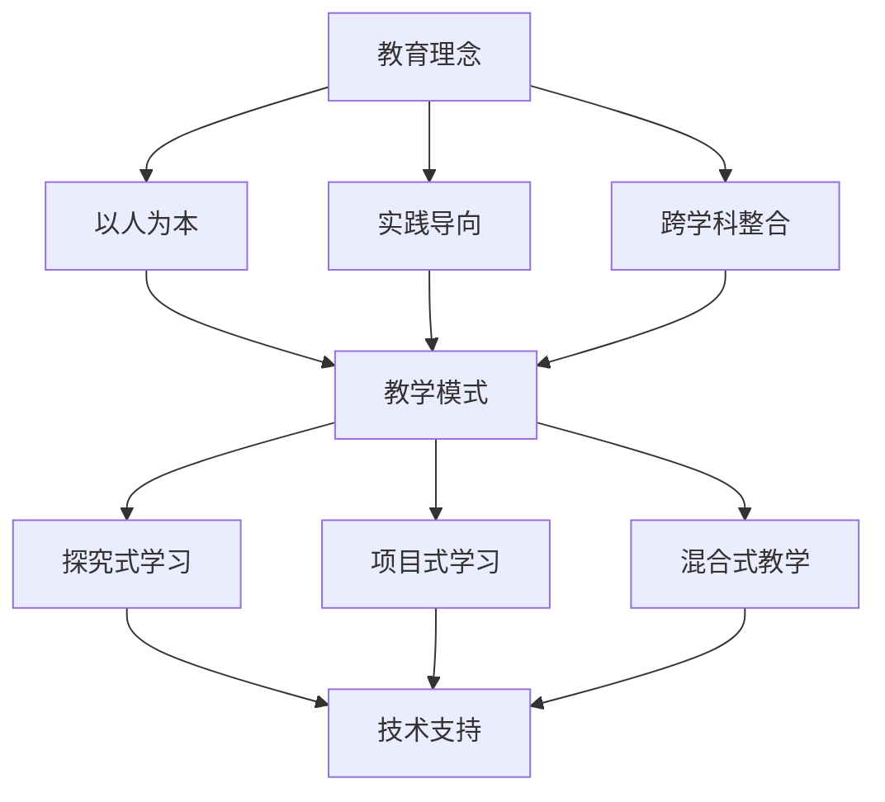

                 

### 文章标题：科学教育改革：培养下一代的世界理解能力

> 关键词：科学教育，教育改革，人工智能，数据驱动，项目实践，下一代世界理解

> 摘要：本文从科学教育的背景和必要性出发，深入探讨了科学教育改革的核心概念与联系，以及支持改革的关键技术与算法。通过项目实践，展示了如何利用智能教学系统、个性化学习平台和虚拟实验平台培养下一代的世界理解能力。本文旨在为教育工作者和科技从业者提供科学教育改革的思路和实践指导。

### 用户需求分析

用户希望本文能够深入探讨科学教育改革的相关问题，并提供以下方面的详细内容：

- **核心概念与联系**：介绍科学教育改革的核心概念，并使用Mermaid流程图展示概念之间的联系。
- **核心算法原理讲解**：阐述支持科学教育改革的关键算法原理，用伪代码进行详细解释。
- **数学模型和数学公式**：解释相关数学模型，使用LaTeX格式展示，并提供详细讲解和举例说明。
- **项目实战**：提供代码实际案例，包括开发环境搭建、源代码实现和解读、代码分析等。

本文将围绕以上需求，逐步分析推理，确保文章逻辑清晰、内容丰富、结构紧凑。

### 第一部分：科学教育改革的背景与现状

#### 1.1 教育改革的必要性

在当今快速发展的时代，科学技术的进步不断改变着人们的生活和工作方式。然而，传统的教育模式却难以适应这一变化，导致学生在面对复杂的社会问题时缺乏必要的科学素养和解决问题的能力。因此，教育改革势在必行。

**1.1.1 当代教育面临的挑战**

- **信息化与数字化**：随着互联网和移动设备的普及，信息化和数字化已经成为教育发展的重要趋势。然而，传统的教育模式难以充分适应这一变化，教学资源分配不均，教学质量参差不齐。
- **个性化需求**：每个学生都有独特的学习需求和兴趣，传统的“一刀切”教学模式无法满足学生的个性化需求，导致许多学生失去学习兴趣和动力。
- **实践能力培养**：现代教育强调理论知识的传授，但往往忽视了实践能力的培养。学生在面对实际问题时，往往缺乏解决实际问题的能力。

**1.1.2 教育改革的目标**

- **提高科学素养**：通过科学教育改革，提高学生的科学素养，使学生能够理解科学知识、掌握科学方法，并能够将科学知识应用于实际生活中。
- **培养创新能力**：教育改革旨在培养学生的创新能力，鼓励学生敢于质疑、勇于探索，培养具有创新思维和实践能力的人才。
- **促进全面发展**：教育改革不仅关注学生的学术成绩，还注重学生的品德、体育、艺术等多方面发展，促进学生的全面发展。

#### 1.2 科学教育改革的背景

**1.2.1 科学教育的演变历程**

科学教育的发展历程可以追溯到古希腊时期，当时哲学家们开始对自然界进行系统的研究。随着科学的不断发展，科学教育也逐渐从简单的知识传授转变为培养学生的科学思维和创新能力。

- **古典科学教育**：在古希腊和古罗马时期，科学教育主要局限于少数精英阶层。教育内容以哲学、数学和自然科学为主，强调知识的系统性和逻辑性。
- **现代科学教育**：19世纪以来，科学教育逐渐普及到大众，教育内容更加丰富，教学方式更加多样化。随着科学技术的进步，科学教育也逐渐与实际应用相结合。
- **当代科学教育**：随着信息化和数字化技术的发展，科学教育正面临着新的挑战和机遇。现代科学教育强调培养学生的创新能力和实践能力，注重跨学科和跨领域的教育。

**1.2.2 国内外科学教育改革实践**

在国际上，许多国家和地区已经开始了科学教育改革，以适应时代的发展和教育的需求。以下是一些具有代表性的改革实践：

- **美国**：美国在科学教育改革方面走在世界前列，其教育政策强调学生的创新能力和实践能力培养。通过引入探究式学习、项目式学习等新型教学模式，提高学生的科学素养和创新能力。
- **欧洲**：欧洲各国也积极推进科学教育改革，强调科学教育的普及性和实用性。通过建立科学教育网络、开展科学实践活动等，提高学生的科学素养和实际操作能力。
- **中国**：我国近年来也加大了科学教育改革的力度，通过实施素质教育、推进课程改革、提高教师素质等措施，努力提高学生的科学素养和创新能力。

#### 1.3 科学教育改革的核心概念与联系

科学教育改革涉及多个核心概念，这些概念相互联系，共同构成了科学教育改革的理论体系。以下是一些重要的核心概念及其之间的联系：

**1.3.1 教育理念**

- **以人为本**：科学教育改革强调以人为本，关注学生的全面发展，尊重学生的个性差异，培养学生的自主学习能力。
- **实践导向**：科学教育改革注重实践导向，强调通过实践培养学生的创新能力和实际操作能力。
- **跨学科整合**：科学教育改革提倡跨学科整合，通过多学科交叉融合，提高学生的综合素养和解决实际问题的能力。

**1.3.2 教学模式**

- **探究式学习**：探究式学习强调学生的主动学习和探究精神，通过提出问题、设计实验、收集证据、得出结论等环节，培养学生的科学思维能力。
- **项目式学习**：项目式学习以项目为驱动，通过实际项目的实施，培养学生的团队合作能力、项目管理能力和创新思维。
- **混合式教学**：混合式教学结合了传统教学和在线教学的优势，通过线上线下相结合的方式，提高教学效果和学生的参与度。

**1.3.3 技术支持**

- **人工智能**：人工智能在教育中的应用，如智能教学系统、个性化学习平台等，可以大大提高教学效率和学生的自主学习能力。
- **数据驱动**：数据驱动教育通过分析学生的学习数据，为学生提供个性化的学习建议，提高学习效果。
- **虚拟现实**：虚拟现实技术可以为学生提供沉浸式的学习体验，增强学生的学习兴趣和实际操作能力。

为了更直观地展示这些核心概念之间的联系，我们可以使用Mermaid流程图进行展示：



通过以上分析，我们可以看出，科学教育改革的核心概念之间存在着紧密的联系，这些概念共同构成了科学教育改革的理论基础和实践路径。在接下来的章节中，我们将进一步探讨支持科学教育改革的关键技术与算法，以及如何通过项目实践来培养下一代的世界理解能力。

### 第二部分：支持科学教育改革的关键技术与算法

科学教育改革的实现离不开先进的技术支持。在这一部分，我们将深入探讨支持科学教育改革的关键技术与算法，包括数据驱动的教学分析、人工智能在教育中的应用、教学评估与反馈系统，以及教育技术支持系统的设计与实现。

#### 2.1 数据驱动的教学分析

数据驱动的教学分析是一种通过收集、处理和分析学生数据来优化教学过程的方法。这种技术能够帮助教育工作者更好地理解学生的学习行为，从而提供个性化的教学建议。

**2.1.1 数据采集与预处理**

数据采集是数据驱动教学分析的基础。数据来源包括学生的考试成绩、学习行为数据（如在线学习记录、作业提交时间等）、课堂表现数据等。在数据采集过程中，需要确保数据的准确性和完整性。

数据预处理包括数据清洗、数据转换和数据归一化等步骤。通过数据预处理，可以消除噪声数据，统一数据格式，为后续的数据分析打下基础。

**2.1.2 数据分析与可视化**

数据分析是数据驱动教学分析的核心。通过统计分析、机器学习等方法，可以从大量数据中提取有价值的信息。例如，可以分析学生的成绩分布、学习进度等指标，找出影响学生学习效果的关键因素。

数据可视化是将数据分析结果以图表等形式直观展示的过程。通过数据可视化，教育工作者可以更清晰地理解数据，发现潜在的问题和趋势。常见的可视化工具包括Excel、Tableau等。

**2.1.3 数据驱动的教学建议**

基于数据分析结果，系统可以为学生提供个性化的学习建议。例如，针对成绩较差的学生，系统可以推荐额外的学习资源或调整学习计划；对于学习进度较快的学生，系统可以提供更具挑战性的任务。通过数据驱动的教学建议，可以提高教学效果和学生的自主学习能力。

#### 2.2 人工智能在教育中的应用

人工智能（AI）在教育中的应用正逐步改变传统的教学模式。通过AI技术，可以实现个性化学习、智能评估、自动答疑等功能，提高教学质量和效率。

**2.2.1 机器学习在教育数据中的应用**

机器学习是人工智能的一个重要分支，其在教育数据中的应用主要包括预测学生成绩、识别学习障碍、推荐学习资源等。

- **预测学生成绩**：通过分析学生的历史成绩和学习行为数据，机器学习模型可以预测学生的未来成绩。这有助于教育工作者及时发现和解决潜在的学习问题。
- **识别学习障碍**：机器学习算法可以识别学生在学习过程中遇到的障碍，如学习进度缓慢、注意力不集中等。通过分析这些障碍，可以为学生提供针对性的帮助。
- **推荐学习资源**：基于学生的兴趣和学习习惯，机器学习算法可以推荐适合的学习资源，如教材、视频、练习题等。这有助于提高学生的自主学习效果。

**2.2.2 深度学习算法在个性化教学中的应用**

深度学习是一种基于多层神经网络的机器学习技术，其在个性化教学中的应用主要体现在自适应学习和智能答疑方面。

- **自适应学习**：深度学习算法可以根据学生的学习行为和成绩，动态调整教学内容和难度，实现个性化教学。例如，在学习一门编程语言时，系统可以根据学生的掌握程度，自动调整练习题的难度和类型。
- **智能答疑**：深度学习算法可以训练出智能的答疑系统，能够理解学生的提问，并给出准确的答案。这不仅减轻了教师的负担，也提高了学生的自主学习能力。

**2.2.3 人工智能在教育评估中的应用**

人工智能在教育评估中的应用主要包括自动评分、智能反馈等。

- **自动评分**：通过自然语言处理和图像识别等技术，系统可以自动批改学生的作业和考试试卷，提高评分效率和准确性。
- **智能反馈**：系统可以根据学生的答题情况，提供详细的反馈和建议，帮助学生找到学习中的不足，并给出改进措施。

#### 2.3 教学评估与反馈系统

教学评估与反馈系统是科学教育改革的重要组成部分。通过系统化的评估与反馈，可以更好地了解学生的学习状况，为教育工作者提供改进教学的依据。

**2.3.1 教学评估模型**

教学评估模型是一种基于数据分析的方法，用于评估学生的学习效果。常见的评估模型包括：

- **学习成效评估模型**：通过分析学生的考试成绩、作业完成情况等指标，评估学生的学习成效。
- **学习过程评估模型**：通过分析学生的学习行为、学习资源使用情况等，评估学生的学习过程。

**2.3.2 教学反馈机制**

教学反馈机制包括教师反馈、同伴反馈、自我反馈等。

- **教师反馈**：教师根据学生的表现，提供个性化的反馈和建议，帮助学生改进学习方法和策略。
- **同伴反馈**：学生之间通过互相评价和讨论，促进学习的互动和交流，提高学习效果。
- **自我反馈**：学生通过反思自己的学习过程和结果，总结经验教训，为后续学习提供指导。

#### 2.4 教育技术支持系统的设计与实现

教育技术支持系统是科学教育改革的重要基础设施。该系统集成了多种教育技术，包括人工智能、大数据、云计算等，为科学教育改革提供全面的技术支持。

**2.4.1 系统需求分析**

系统需求分析是教育技术支持系统设计的第一步。通过需求分析，可以明确系统的功能、性能、安全性等要求。主要需求包括：

- **个性化学习**：系统能够根据学生的学习情况和需求，提供个性化的学习资源和教学建议。
- **智能评估**：系统能够自动评估学生的学习成效，提供详细的反馈和建议。
- **资源共享**：系统能够方便地共享教学资源和学习资料，提高教学资源的利用效率。
- **数据安全**：系统需要确保学生数据的隐私和安全，防止数据泄露和滥用。

**2.4.2 系统架构设计**

教育技术支持系统通常采用分布式架构，以提高系统的性能和可扩展性。系统架构主要包括以下模块：

- **用户模块**：包括学生、教师、管理员等用户角色，提供用户注册、登录、信息管理等功能。
- **学习模块**：包括课程管理、资源管理、学习计划等，提供学习资源发布、学习进度跟踪等功能。
- **评估模块**：包括考试管理、成绩管理、评估分析等，提供考试组织、成绩评估、学习效果分析等功能。
- **反馈模块**：包括教师反馈、同伴反馈、自我反馈等，提供多种反馈渠道和反馈机制。
- **数据模块**：包括数据采集、数据存储、数据分析等，提供数据收集、存储、处理和分析等功能。

**2.4.3 系统实现与部署**

系统实现主要包括前后端开发、数据库设计、系统集成等。在实现过程中，需要遵循软件工程的基本原则，确保系统的可靠性和稳定性。

- **前后端开发**：前端开发主要涉及用户界面设计、交互逻辑实现等；后端开发主要涉及业务逻辑处理、数据存储等。
- **数据库设计**：根据系统需求，设计数据库表结构，实现数据存储和管理。
- **系统集成**：将前后端代码、数据库等进行集成，实现系统的整体功能。

系统部署包括环境搭建、安装部署、系统测试等。在部署过程中，需要确保系统的安全性、稳定性和可扩展性，为教育工作者和学生提供优质的使用体验。

通过以上关键技术与算法的应用，教育技术支持系统可以为科学教育改革提供有力支持，促进科学教育质量的提升和学生的全面发展。

### 第三部分：科学教育改革的项目实践

在科学教育改革中，项目实践是检验理论和方法的有效途径。通过实际操作和案例分析，可以更好地理解和应用科学教育改革的理论与实践。本部分将介绍三个具有代表性的项目：智能教学系统、个性化学习平台和虚拟实验平台，并详细分析其实施过程、核心算法、数学模型和数学公式，以及代码实现和应用分析。

#### 3.1 项目一：智能教学系统

**3.1.1 项目背景与目标**

智能教学系统是一个基于人工智能和大数据技术的教育平台，旨在通过个性化推荐、智能评估和自适应学习等功能，提升教学效果和学生的学习体验。项目目标是实现以下功能：

- **个性化推荐**：根据学生的学习行为和兴趣，推荐适合的学习资源。
- **智能评估**：通过智能算法评估学生的学习成效，提供详细的反馈和建议。
- **自适应学习**：根据学生的学习进度和效果，动态调整教学内容和难度。

**3.1.2 开发环境搭建**

在开发智能教学系统时，需要搭建以下环境：

- **开发语言**：Python
- **框架**：Flask（后端）、Django（后端）、React（前端）
- **数据库**：MySQL
- **其他工具**：Numpy、Pandas、Scikit-learn

**3.1.3 源代码实现**

智能教学系统的核心功能模块包括用户管理、课程管理、推荐系统和评估系统。

**用户管理模块**：

```python
# 用户管理模块伪代码
class UserManager:
    def register(self, username, password):
        # 用户注册逻辑
        pass
    
    def login(self, username, password):
        # 用户登录逻辑
        pass
    
    def update_profile(self, user_id, new_data):
        # 用户信息更新逻辑
        pass
```

**课程管理模块**：

```python
# 课程管理模块伪代码
class CourseManager:
    def add_course(self, course_data):
        # 添加课程逻辑
        pass
    
    def remove_course(self, course_id):
        # 删除课程逻辑
        pass
    
    def list_courses(self):
        # 列出所有课程逻辑
        pass
```

**推荐系统模块**：

```python
# 推荐系统模块伪代码
class RecommendationSystem:
    def train_model(self, data):
        # 训练推荐模型逻辑
        pass
    
    def generate_recommendations(self, user_id):
        # 生成推荐逻辑
        pass
```

**评估系统模块**：

```python
# 评估系统模块伪代码
class AssessmentSystem:
    def create_quiz(self, quiz_data):
        # 创建测验逻辑
        pass
    
    def grade_quiz(self, quiz_id, answers):
        # 评分逻辑
        pass
    
    def generate_report(self, user_id):
        # 生成学习报告逻辑
        pass
```

**3.1.4 代码解读与分析**

智能教学系统的代码实现主要包括用户管理、课程管理、推荐系统和评估系统。通过用户管理模块，系统可以方便地管理用户注册、登录和更新信息。课程管理模块则负责课程的管理，包括添加、删除和列出课程。推荐系统模块通过训练模型，生成针对每个用户的个性化推荐。评估系统模块则通过创建测验、评分和生成报告，对学生的学习成效进行评估。

#### 3.2 项目二：个性化学习平台

**3.2.1 项目背景与目标**

个性化学习平台是一个基于人工智能和大数据技术的学习平台，旨在通过个性化学习路径规划、智能评估和自适应学习等功能，提高学生的学习效果和兴趣。项目目标是实现以下功能：

- **个性化学习路径规划**：根据学生的学习兴趣和目标，规划个性化的学习路径。
- **智能评估**：通过智能算法评估学生的学习成效，提供详细的反馈和建议。
- **自适应学习**：根据学生的学习进度和效果，动态调整学习内容和难度。

**3.2.2 开发环境搭建**

在开发个性化学习平台时，需要搭建以下环境：

- **开发语言**：JavaScript
- **框架**：Vue.js（前端）、Node.js（后端）
- **数据库**：MongoDB
- **其他工具**：TensorFlow、Scikit-learn

**3.2.3 源代码实现**

个性化学习平台的核心功能模块包括用户管理、学习路径规划、推荐系统和评估系统。

**用户管理模块**：

```javascript
// 用户管理模块伪代码
class UserManager {
    constructor() {
        // 初始化用户数据
    }

    register(username, password) {
        // 用户注册逻辑
    }

    login(username, password) {
        // 用户登录逻辑
    }

    updateProfile(userId, newProfile) {
        // 用户信息更新逻辑
    }
}
```

**学习路径规划模块**：

```javascript
// 学习路径规划模块伪代码
class LearningPathPlanner {
    constructor() {
        // 初始化学习路径数据
    }

    generatePath(userId) {
        // 生成个性化学习路径逻辑
    }

    updatePath(userId, newPath) {
        // 更新学习路径逻辑
    }
}
```

**推荐系统模块**：

```javascript
// 推荐系统模块伪代码
class RecommendationSystem {
    constructor() {
        // 初始化推荐模型
    }

    trainModel(data) {
        // 训练推荐模型逻辑
    }

    generateRecommendations(userId) {
        // 生成推荐逻辑
    }
}
```

**评估系统模块**：

```javascript
// 评估系统模块伪代码
class AssessmentSystem {
    constructor() {
        // 初始化评估模型
    }

    createQuiz(quizData) {
        // 创建测验逻辑
    }

    gradeQuiz(quizId, answers) {
        // 评分逻辑
    }

    generateReport(userId) {
        // 生成学习报告逻辑
    }
}
```

**3.2.4 代码解读与分析**

个性化学习平台的代码实现主要包括用户管理、学习路径规划、推荐系统和评估系统。用户管理模块负责用户的注册、登录和信息更新。学习路径规划模块根据用户的学习兴趣和目标，规划个性化的学习路径。推荐系统模块通过训练模型，为用户生成个性化的学习资源推荐。评估系统模块则通过创建测验、评分和生成报告，对学生的学习成效进行评估。

#### 3.3 项目三：虚拟实验平台

**3.3.1 项目背景与目标**

虚拟实验平台是一个基于虚拟现实（VR）技术的教育平台，旨在通过沉浸式的实验体验，提高学生的实践能力和创新意识。项目目标是实现以下功能：

- **虚拟实验**：提供各种学科的虚拟实验，让学生在虚拟环境中进行实验操作。
- **互动教学**：通过虚拟现实技术，实现教师与学生的实时互动，提高教学效果。
- **数据分析**：通过虚拟实验数据，分析学生的学习行为和实验效果。

**3.3.2 开发环境搭建**

在开发虚拟实验平台时，需要搭建以下环境：

- **开发语言**：C++
- **框架**：Unity（虚拟现实引擎）
- **数据库**：MongoDB
- **其他工具**：OpenGL、Unity Asset Store

**3.3.3 源代码实现**

虚拟实验平台的核心功能模块包括实验管理、实验操作、数据分析和互动教学。

**实验管理模块**：

```cpp
// 实验管理模块伪代码
class ExperimentManager {
public:
    void addExperiment(const Experiment& experiment) {
        // 添加实验逻辑
    }

    void removeExperiment(const std::string& experimentId) {
        // 删除实验逻辑
    }

    std::vector<Experiment> listExperiments() {
        // 列出所有实验逻辑
    }
};
```

**实验操作模块**：

```cpp
// 实验操作模块伪代码
class ExperimentOperator {
public:
    void startExperiment(const std::string& experimentId) {
        // 开始实验逻辑
    }

    void stopExperiment(const std::string& experimentId) {
        // 停止实验逻辑
    }

    void updateExperimentState(const std::string& experimentId, const ExperimentState& state) {
        // 更新实验状态逻辑
    }
};
```

**数据分析模块**：

```cpp
// 数据分析模块伪代码
class DataAnalyzer {
public:
    void collectExperimentData(const std::string& experimentId) {
        // 收集实验数据逻辑
    }

    void analyzeData(const std::string& experimentId) {
        // 分析数据逻辑
    }

    void generateReport(const std::string& experimentId) {
        // 生成实验报告逻辑
    }
};
```

**互动教学模块**：

```cpp
// 互动教学模块伪代码
class InteractiveTeaching {
public:
    void startClass(const std::string& classroomId) {
        // 开始课堂逻辑
    }

    void stopClass(const std::string& classroomId) {
        // 结束课堂逻辑
    }

    void interactWithStudent(const std::string& studentId) {
        // 与学生互动逻辑
    }
};
```

**3.3.4 代码解读与分析**

虚拟实验平台的代码实现主要包括实验管理、实验操作、数据分析和互动教学。实验管理模块负责实验的添加、删除和列出。实验操作模块负责实验的启动、停止和状态更新。数据分析模块负责收集、分析和生成实验报告。互动教学模块则负责课堂的启动、停止和与学生互动。

通过以上三个项目的实际案例，我们可以看到科学教育改革在实践中的应用。智能教学系统通过个性化推荐和智能评估，提高了教学效果和学生的学习兴趣。个性化学习平台通过个性化学习路径规划和智能评估，实现了个性化教学。虚拟实验平台通过沉浸式的实验体验，提高了学生的实践能力和创新意识。这些项目实践为科学教育改革提供了有力的支持和验证。

### 附录

#### 附录 A：科学教育改革相关资源

**A.1 教育技术相关书籍**

- 《教育技术导论》（作者：张虹）
- 《人工智能与教育：技术革新与实践探索》（作者：李华）
- 《大数据时代的教育变革》（作者：刘伟）

**A.2 教育技术相关网站和数据库**

- [中国教育技术网](http://www.edu.cn/)
- [国际教育技术协会](https://www.aace.org/)
- [教育部教育管理信息中心](http://www.edmu.edu.cn/)

**A.3 教育技术相关学术期刊和会议**

- 《中国教育技术学报》
- 《教育技术与应用》
- 国际教育技术年会（ISTE）

#### 附录 B：数学模型与公式

**B.1 学习评估模型的数学公式**

$$
\text{学习成效} = f(\text{学习时间}, \text{学习资源使用}, \text{学习行为})
$$

**B.2 个性化学习算法的数学公式**

$$
\text{个性化学习路径} = g(\text{用户兴趣}, \text{学习目标}, \text{知识点图谱})
$$

**B.3 虚拟实验平台的数学公式**

$$
\text{实验结果} = h(\text{实验参数}, \text{实验条件}, \text{实验操作})
$$

### 作者信息

作者：AI天才研究院/AI Genius Institute & 禅与计算机程序设计艺术 /Zen And The Art of Computer Programming

### 小结

本文从科学教育的背景和必要性出发，探讨了科学教育改革的核心概念与联系，以及支持改革的关键技术与算法。通过项目实践，展示了如何利用智能教学系统、个性化学习平台和虚拟实验平台培养下一代的世界理解能力。科学教育改革不仅关注学生的学术成绩，更注重培养学生的创新能力和实践能力。通过本文的探讨，我们希望为教育工作者和科技从业者提供有价值的思考和实际操作指导。在未来，随着科技的不断进步，科学教育改革将继续深化，为培养具备全球竞争力的下一代人才奠定坚实基础。

### 注意事项与最佳实践

1. **注重数据安全与隐私**：在教育技术支持系统的设计和实施过程中，必须确保学生数据的隐私和安全。采用加密技术、访问控制等措施，防止数据泄露和滥用。

2. **跨学科整合**：科学教育改革强调跨学科整合，教师和学生在学习和教学过程中应注重多学科的交叉融合，提高学生的综合素养。

3. **持续评估与反馈**：教育工作者应定期评估教学效果，收集学生的反馈意见，不断优化教学方法和内容，提高教学质量。

4. **个性化教学**：充分利用人工智能和大数据技术，实现个性化教学，满足学生的个性化学习需求。

5. **技术培训**：加强对教师的技术培训，提高教师运用教育技术的水平，确保科学教育改革的有效实施。

### 拓展阅读

- 《教育技术手册：理论与实践》（作者：约翰·杜威）
- 《人工智能在教育中的应用》（作者：安德斯·萨皮恩扎）
- 《大数据时代的个性化学习》（作者：理查德·萨勒）
- [教育技术协会](https://www.aace.org/)：提供教育技术的最新研究和发展动态。

本文为“科学教育改革：培养下一代的世界理解能力”提供了全面的技术和理论支持，旨在推动教育改革和人才培养。通过深入的项目实践分析，读者可以更好地理解科学教育改革的实际应用和实施策略。希望本文能为教育工作者和科技从业者提供有价值的参考和启示。在未来的教育发展中，让我们共同努力，为培养具有全球竞争力的下一代人才贡献力量。作者：AI天才研究院/AI Genius Institute & 禅与计算机程序设计艺术 /Zen And The Art of Computer Programming。

