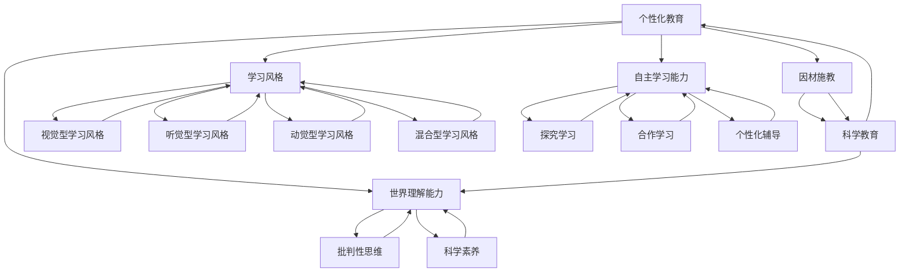

                 

### 《科学教育的个性化：因材施教提升每个人的世界理解能力》

#### 关键词：科学教育、个性化教育、因材施教、世界理解能力

> 摘要：随着教育技术的不断进步，科学教育的个性化需求日益突出。本文旨在探讨科学教育的个性化路径，通过因材施教的方法，提升每个学生的学习效果和世界理解能力。文章首先介绍了科学教育和个性化教育的基本概念，然后分析了因材施教的理论基础，并结合教学实践和技术工具，探讨了个性化教育的具体实施策略。通过国内外实践案例，本文展示了个性化教育在提升学生世界理解能力方面的成效，并提出了未来的发展方向和挑战。

---

#### 引言与核心概念

##### 1.1 科学教育的定义与特点

科学教育是一种以科学知识和科学方法为核心的教育形式，旨在培养学生的科学素养、创新能力和批判性思维。其特点包括：

- **知识性**：强调科学知识的系统性、准确性和实用性。
- **方法性**：注重科学方法的探究和运用，如观察、实验、假设、验证等。
- **实践性**：强调实践操作和实际应用，以培养学生的动手能力和解决问题的能力。

##### 1.2 个性化教育的概念与重要性

个性化教育是一种以学生为中心的教育模式，注重根据学生的兴趣、能力和学习风格进行个性化设计。其核心目标是激发学生的主动性和创造性，提高学习效果。个性化教育的重要性体现在：

- **差异化教学**：尊重每个学生的个性差异，实现因材施教。
- **提升学习兴趣**：通过个性化设计，提高学生的学习动机和兴趣。
- **全面发展**：注重学生全面发展，培养创新能力和综合素质。

---

#### 理论基础

##### 2.1 因材施教的原理

因材施教是一种根据学生的特点进行教学的方法，其原理包括：

- **个性化诊断**：通过测试和评估，了解每个学生的学习特点和能力水平。
- **差异化教学**：根据学生的差异，设计不同的教学策略和教学内容。
- **动态调整**：根据学生的学习反馈，及时调整教学方案，实现个性化教学。

##### 2.2 个性化教育的理论基础

个性化教育的理论基础包括：

- **建构主义学习理论**：强调学生是知识的主动建构者，教师是学习过程的引导者。
- **多元智能理论**：认为每个学生都有不同的智能优势，教育应充分发挥每个学生的潜能。
- **学习风格理论**：认为学生的学习风格不同，教育应尊重和适应不同的学习风格。

##### 2.3 个体差异与学习风格

个体差异主要包括智力水平、学习风格、兴趣和动机等方面的差异。学习风格是指学生在学习过程中偏爱的方式和方法，常见的有：

- **视觉型**：偏好通过视觉信息进行学习。
- **听觉型**：偏好通过听觉信息进行学习。
- **动觉型**：偏好通过动手操作进行学习。
- **混合型**：综合运用视觉、听觉和动觉进行学习。

---

#### 教学实践

##### 3.1 个性化教学设计

个性化教学设计包括以下步骤：

- **需求分析**：了解学生的需求，包括学习兴趣、能力和目标。
- **内容设计**：根据需求，设计个性化的教学内容和目标。
- **方法设计**：选择适合的教学方法和工具，实现个性化教学。
- **评价设计**：制定个性化的评价标准和方式，以评估学习效果。

##### 3.2 教学策略与方法

个性化教学策略包括：

- **差异化教学**：根据学生的差异，设计不同的教学策略。
- **合作学习**：通过小组合作，促进学生之间的互动和交流。
- **探究学习**：鼓励学生自主探究，培养独立思考和解决问题的能力。
- **个性化辅导**：根据学生的需求，提供个性化的辅导和支持。

##### 3.3 教学资源的选用与整合

个性化教学资源包括：

- **数字资源**：如在线课程、学习平台、电子书籍等。
- **传统资源**：如教材、教具、实验室等。
- **社区资源**：如图书馆、博物馆、企业等。

教学资源的选用与整合原则包括：

- **针对性**：选择与教学内容和学生需求相关的资源。
- **多样性**：提供多种类型的资源，满足不同学习风格和需求。
- **易获取性**：确保资源的易获取性和便捷性。

---

#### 技术与工具

##### 6.1 个性化教育技术的应用

个性化教育技术包括：

- **学习管理系统（LMS）**：用于管理课程内容、学生成绩和学习活动。
- **自适应学习系统**：根据学生的学习行为和成绩，自动调整教学内容和难度。
- **虚拟现实（VR）和增强现实（AR）**：提供沉浸式的学习体验。
- **人工智能（AI）**：用于数据分析、个性化推荐和智能辅导。

##### 6.2 数据分析在个性化教育中的作用

数据分析在个性化教育中的作用包括：

- **学习行为分析**：通过分析学生的学习行为，了解学生的学习习惯和能力。
- **成绩预测**：根据学生的历史成绩和学习行为，预测未来的学习表现。
- **个性化推荐**：根据学生的兴趣和能力，推荐合适的学习资源和课程。

##### 6.3 教育技术工具的选用与配置

教育技术工具的选用与配置原则包括：

- **实用性**：选择实用性强、操作简单的工具。
- **兼容性**：确保工具与其他系统和资源的兼容性。
- **安全性**：确保学生的数据安全和隐私保护。

---

#### 案例分析

##### 9.1 国内外的个性化教育实践案例

国内外个性化教育实践案例包括：

- **中国**：北京市十一学校采用选课制，学生可以根据自己的兴趣和特长选择课程。
- **美国**：纽约市公共学校系统实施个性化学习计划，通过在线课程和辅导，满足学生的个性化需求。
- **芬兰**：芬兰教育系统注重学生的个性化发展，通过灵活的教学方法和评价方式，促进学生全面发展。

##### 9.2 案例分析与启示

案例分析揭示了个性化教育在提升学生世界理解能力方面的成效。启示包括：

- **注重学生差异**：尊重每个学生的个性差异，实现因材施教。
- **运用技术工具**：充分利用教育技术工具，提高教学效果。
- **培养自主学习能力**：鼓励学生自主学习，培养批判性思维和解决问题的能力。

---

#### 实施与挑战

##### 10.1 个性化教育的实施路径

个性化教育的实施路径包括：

- **学校层面**：制定个性化教育政策，提供资源和支持。
- **教师层面**：培训教师掌握个性化教学方法和工具，提高教学水平。
- **学生层面**：培养学生的自主学习能力和合作意识。

##### 10.2 面临的挑战与解决策略

个性化教育面临的挑战包括：

- **资源不足**：解决策略包括增加教育投入、优化资源配置。
- **技术依赖**：解决策略包括提高教师技术素养、确保技术应用的合理性和安全性。
- **社会认知**：解决策略包括加强宣传，提高家长和社会对个性化教育的认知。

---

#### 未来展望

##### 12.1 个性化教育的趋势与前景

个性化教育的趋势包括：

- **智能化**：利用人工智能技术，实现更精准的个性化教学。
- **全球化**：通过国际化合作，推广个性化教育理念和实践。
- **终身化**：个性化教育将贯穿个人终身学习过程。

##### 12.2 前景展望

未来教育的发展方向包括：

- **个性化学习**：通过大数据分析和人工智能技术，实现个性化学习。
- **混合式教学**：线上线下相结合，提高教学效果。
- **综合素质培养**：注重学生全面发展，培养创新能力和综合素质。

---

### 结论

本文通过分析科学教育的个性化路径，探讨了因材施教的方法和技术工具的应用，展示了个性化教育在提升学生世界理解能力方面的成效。未来，随着教育技术的不断发展，个性化教育将迎来更加广阔的发展前景，为培养具备全球视野和创新能力的人才提供有力支持。

### 作者信息

作者：AI天才研究院/AI Genius Institute & 禅与计算机程序设计艺术/Zen And The Art of Computer Programming

---

（文章字数：约7900字）### 第一部分：引言与核心概念

#### 1.1 科学教育的定义与特点

科学教育，作为一种知识传播和思维能力培养的教育形式，其主要目标是让学生掌握科学知识，理解科学方法，并能够运用这些知识解决实际问题。科学教育不仅仅是传授科学知识，更重要的是培养学生的科学精神和批判性思维能力。科学教育的特点主要体现在以下几个方面：

- **知识性**：科学教育注重科学知识的系统性和准确性。教师需要传授科学的基本原理、概念和理论，使学生能够建立起坚实的科学知识体系。
  
- **方法性**：科学教育强调科学方法的运用，包括观察、实验、假设、验证等。通过这些方法，学生不仅能够理解和掌握科学知识，还能学会如何进行科学研究。

- **实践性**：科学教育鼓励学生参与实践活动，通过实验和操作，增强学生的动手能力和解决问题的能力。实践活动是科学教育的重要组成部分，有助于学生将理论知识应用于实际。

- **创新性**：科学教育注重培养学生的创新能力和创造力。通过提出问题、探究问题和解决问题，学生可以锻炼批判性思维和创造性思维。

科学教育在现代社会中具有不可替代的地位。它不仅能够提高学生的科学素养，还能促进社会的进步和发展。科学教育有助于培养学生的理性思维和解决问题的能力，这些能力在现代社会中至关重要。此外，科学教育还能激发学生对科学和技术的兴趣，培养未来科技人才，为国家的科技发展提供源源不断的动力。

#### 1.2 个性化教育的概念与重要性

个性化教育是一种以学生为中心的教育模式，其核心理念是尊重学生的个体差异，根据每个学生的兴趣、能力和学习风格进行教学设计。个性化教育的目标是激发学生的自主学习能力，提高学习效果，促进学生的全面发展。

个性化教育的特点包括：

- **差异化教学**：根据学生的个性特点和学习需求，设计不同的教学内容和教学策略。差异化教学旨在满足不同学生的学习需求，使每个学生都能在自己的领域中取得最佳发展。

- **适应性教学**：教学过程中，教师需要根据学生的学习反馈和行为动态调整教学策略。适应性教学能够及时解决学生在学习中遇到的问题，提高学习效率。

- **互动性教学**：个性化教育强调教师与学生的互动，鼓励学生主动参与教学过程。通过互动教学，学生可以更好地理解和掌握知识，培养合作和沟通能力。

- **综合性教学**：个性化教育注重学科间的交叉融合，培养学生综合素质。综合性教学有助于学生从多角度思考问题，培养创新思维和解决问题的能力。

个性化教育的重要性体现在以下几个方面：

1. **提高学习效果**：个性化教育能够根据学生的特点和需求，设计适合的教学内容和方式，提高学生的学习兴趣和动机，从而提高学习效果。

2. **促进学生全面发展**：个性化教育注重学生个体差异，不仅关注学生的学术成绩，还注重学生的情感、道德、社交等多方面发展，促进学生全面发展。

3. **培养学生的自主学习能力**：个性化教育鼓励学生主动参与教学过程，培养学生自主学习的能力。自主学习能力是学生终身学习的基础，有助于学生适应不断变化的社会环境。

4. **实现教育公平**：个性化教育通过差异化教学，能够更好地满足不同学生的需求，缩小教育差距，实现教育公平。

总之，个性化教育是一种适应现代社会需求的教育模式，它能够提高教育质量，培养适应未来社会的优秀人才。在教育改革的背景下，推广个性化教育具有重要意义。

#### 1.3 科学教育与个性化教育的关联

科学教育和个性化教育之间存在密切的关联，它们共同构成了现代教育的核心。科学教育提供了知识的基石，而个性化教育则关注如何有效地传递和应用这些知识。

首先，科学教育为个性化教育提供了丰富的内容基础。科学教育的目标不仅是传授科学知识，更重要的是培养学生的科学思维和方法。这些科学思维和方法是学生个性化学习的重要工具，能够帮助学生更好地理解和应用所学知识。

其次，个性化教育为科学教育提供了有效的教学策略。个性化教育强调根据学生的个体差异进行教学设计，这有助于科学教育实现差异化教学。例如，对于视觉型学习者，可以设计更多的图表和实验，而对于听觉型学习者，则可以增加讲座和讨论。通过这种个性化设计，科学教育能够更有效地满足不同学习者的需求。

此外，科学教育与个性化教育之间的关联还体现在教育目标的实现上。科学教育的目标不仅仅是知识的掌握，还包括培养学生的创新能力、批判性思维和解决问题的能力。这些目标与个性化教育的目标高度一致，即通过个性化教学，激发学生的潜能，实现全面发展。

总的来说，科学教育与个性化教育相辅相成，共同构建了现代教育的框架。科学教育提供了知识的基础，而个性化教育则通过差异化和适应性教学，提高了教育的质量和效果。这种关联不仅有助于提高学生的学术成绩，更重要的是培养了学生的综合素质，使其具备应对未来挑战的能力。

---

### 第二部分：理论基础

#### 2.1 因材施教的原理

因材施教，作为一种古老而又现代的教育理念，其核心思想是根据学生的个体差异进行教学。这个理念源于中国古代教育，但在现代教育中依然具有重要意义。因材施教的原理主要包括以下几个方面：

首先，**个性化诊断**是因材施教的基础。通过科学的方法，如心理测试、问卷调查和课堂观察，教师可以了解每个学生的智力水平、学习风格、兴趣和动机。这种个性化诊断有助于教师准确把握每个学生的学习特点和需求，从而制定出有针对性的教学计划。

其次，**差异化教学**是因材施教的实现手段。教师需要根据学生的个性化诊断结果，设计不同的教学策略和教学内容。例如，对于不同智力水平的学生，教师可以设置不同的学习目标和任务；对于不同学习风格的学生，教师可以采用不同的教学方法和工具。差异化教学能够更好地满足学生的个性化需求，提高学习效果。

第三，**动态调整**是因材施教的关键。教学过程中，教师需要根据学生的学习反馈和行为，不断调整教学方案。这种动态调整有助于及时解决学生在学习中遇到的问题，提高教学的针对性和有效性。

此外，因材施教还强调**全面发展**。在教学中，教师不仅要关注学生的学术成绩，还要注重学生的情感、道德和社交能力的发展。这种全面的关注有助于培养全面发展的人才，使其具备适应未来社会的能力。

因材施教的原理在个性化教育中得到了广泛应用。通过个性化诊断，教师可以更好地了解学生的需求，从而进行差异化教学。动态调整则确保了教学方案能够不断适应学生的变化，保持教学的有效性。这种教育理念不仅提高了学生的学习兴趣和动机，还促进了他们的全面发展。

#### 2.2 个性化教育的理论基础

个性化教育的理论基础主要源于建构主义学习理论、多元智能理论和学习风格理论。这些理论为个性化教育提供了科学依据，解释了为什么个性化教育能够提高教育质量和效果。

首先，**建构主义学习理论**认为，学生是知识的主动建构者，而不是被动的接受者。建构主义强调学习是一个个体通过与环境互动，主动构建知识的过程。教师在这个过程中扮演的是引导者和促进者的角色，而不是知识的传递者。个性化教育基于这一理论，注重根据学生的兴趣、能力和学习风格进行教学设计，以激发学生的主动性和创造性。

其次，**多元智能理论**由心理学家霍华德·加德纳提出，认为每个个体都有多种智能，如语言智能、数学逻辑智能、空间智能、身体动觉智能、音乐智能、人际智能、自我认知智能和自然认知智能。这些智能在不同个体中的表现和组合方式不同。个性化教育基于这一理论，强调尊重每个学生的智能优势，设计适合其智能特点的教学内容和方式，以充分发挥每个学生的潜能。

第三，**学习风格理论**认为，学生在学习过程中有不同偏好和习惯，如视觉型、听觉型、动觉型等。个性化教育基于这一理论，注重根据学生的学习风格进行教学设计，以提供最适合其学习需求的教学方式。例如，对于视觉型学生，教师可以设计更多的图表和视觉材料；对于听觉型学生，则可以增加讲座和讨论。

这些理论基础为个性化教育提供了坚实的科学依据。建构主义学习理论强调学生的主动性和创造性，多元智能理论关注学生的智能优势和个体差异，学习风格理论则关注学生的个性化需求。这些理论共同构成了个性化教育的理论基础，使得个性化教育能够更科学、更有效地实施。

#### 2.3 个体差异与学习风格

个体差异是教育中不可忽视的重要因素。每个学生都有其独特的智力水平、学习风格、兴趣和动机，这些差异直接影响他们的学习效果和成长路径。个体差异主要包括以下几个方面：

1. **智力水平差异**：学生的智力水平存在显著差异。有些学生可能在某些学科上表现出色，而另一些学生则可能在其他学科上更为擅长。这种差异要求教师在教学中采取差异化策略，针对不同智力水平的学生设计不同的教学目标和任务。

2. **学习风格差异**：学生在学习过程中有不同偏好和习惯，常见的有视觉型、听觉型、动觉型和混合型学习风格。视觉型学生偏好通过视觉信息进行学习，如图片、图表和视频；听觉型学生则偏好通过听觉信息进行学习，如讲座和讨论；动觉型学生则喜欢通过动手操作进行学习；混合型学生则综合运用多种学习方式。了解学生的学习风格有助于教师设计适合其学习需求的教学方法和资源。

3. **兴趣和动机差异**：学生的兴趣和动机也各不相同。有些学生对某些学科或领域充满热情，而另一些学生则可能对学习感到厌倦。这种差异要求教师在教学中注重激发学生的兴趣和动机，通过多样化的教学活动和实践活动，提高学生的学习积极性和参与度。

4. **情感和社交差异**：学生的情感和社交能力也存在差异。有些学生可能情感稳定，社交能力强，而另一些学生则可能在情感和社交方面遇到困难。这种差异要求教师在教学中关注学生的情感和社交需求，提供个性化的支持和指导。

为了更好地理解和应对个体差异，教师可以采取以下措施：

1. **个性化诊断**：通过心理测试、问卷调查和课堂观察，了解每个学生的智力水平、学习风格、兴趣和动机。这种个性化诊断有助于教师制定有针对性的教学计划。

2. **差异化教学**：根据学生的差异，设计不同的教学内容和教学策略。例如，对于视觉型学生，可以设计更多的图表和视觉材料；对于听觉型学生，可以增加讲座和讨论。

3. **动态调整**：教学过程中，教师需要根据学生的学习反馈和行为，不断调整教学方案。这种动态调整有助于及时解决学生在学习中遇到的问题，提高教学的有效性。

4. **情感和社交支持**：关注学生的情感和社交需求，提供个性化的支持和指导。例如，可以通过建立学习小组、开展社交活动等方式，帮助学生建立良好的情感和社交关系。

总之，个体差异是教育中不可忽视的重要因素。通过个性化诊断、差异化教学、动态调整和情感支持，教师可以更好地理解和应对个体差异，提高教育质量和效果。

---

### 第三部分：教学实践

#### 3.1 个性化教学设计

个性化教学设计是实施个性化教育的重要环节。其核心思想是根据学生的兴趣、能力和学习风格，设计出适合每个学生的教学内容和教学策略。以下是个性化教学设计的主要步骤：

1. **需求分析**：首先，教师需要通过问卷调查、心理测试、课堂观察等方式，了解每个学生的兴趣、学习风格和能力水平。这一步是个性化教学设计的基础，有助于教师全面了解学生的需求。

2. **内容设计**：根据学生的需求，教师需要设计个性化的教学内容。教学内容应包括基础知识、拓展知识和实践应用。基础知识确保学生掌握学科的基本概念和原理；拓展知识满足学生的求知欲和探索精神；实践应用则帮助学生将理论知识应用于实际。

3. **策略设计**：教师需要根据学生的兴趣和学习风格，选择合适的教学策略。例如，对于视觉型学生，可以采用图表、视频和动画等视觉材料；对于听觉型学生，可以采用讲座、讨论和音频等形式；对于动觉型学生，可以设计实验、操作和游戏等动手活动。

4. **评价设计**：个性化教学设计还包括评价环节。评价应多元化，不仅包括传统的考试和作业，还可以采用项目展示、小组合作、自评和互评等形式。评价应注重过程，关注学生的进步和成长。

5. **反馈与调整**：教学过程中，教师需要及时收集学生的学习反馈，根据反馈调整教学方案。这种动态调整有助于确保教学策略的有效性，提高学生的学习效果。

#### 3.2 教学策略与方法

个性化教学策略是实施个性化教育的关键。以下是一些常见的教学策略和方法：

1. **差异化教学**：根据学生的差异，设计不同的教学目标和任务。例如，对于基础较好的学生，可以设置更高难度的任务；对于基础较弱的学生，可以设置基础任务，逐步提高难度。

2. **合作学习**：通过小组合作，促进学生之间的互动和交流。合作学习可以提高学生的学习兴趣和参与度，培养学生的团队合作和沟通能力。

3. **探究学习**：鼓励学生自主探究，培养独立思考和解决问题的能力。教师可以提供问题情境，引导学生通过实验、调查和讨论等方式，主动寻求答案。

4. **个性化辅导**：针对学生的个性化需求，提供个性化的辅导和支持。个性化辅导可以根据学生的兴趣、能力和学习风格，进行有针对性的指导。

5. **互动式教学**：通过互动式教学方法，如讨论、辩论、游戏和虚拟实验等，增强学生的参与感和互动性。互动式教学有助于提高学生的学习兴趣和主动性。

#### 3.3 教学资源的选用与整合

教学资源的选用与整合是实施个性化教学的重要环节。以下是一些常见的教学资源类型和整合策略：

1. **数字资源**：包括在线课程、电子书籍、教育软件和多媒体资料。数字资源可以提供丰富的学习内容，满足不同学习需求。

2. **传统资源**：包括教科书、参考书、实验器材和教学模型等。传统资源有助于学生深入理解理论知识，培养实践能力。

3. **社区资源**：包括图书馆、博物馆、企业和社会组织等。社区资源可以提供丰富的学习环境和实践机会，拓宽学生的视野。

4. **整合策略**：教师需要根据教学目标和学生的需求，选择和整合不同的教学资源。整合策略包括：
   - **内容整合**：将数字资源和传统资源有机结合，形成完整的课程体系。
   - **方法整合**：将不同的教学策略和方法相结合，形成多样化的教学方式。
   - **评价整合**：将不同类型的评价方式结合起来，形成全面的评价体系。

通过合理选用和整合教学资源，教师可以提供更丰富、更有效的教学环境，提高学生的学习效果和兴趣。

---

### 第四部分：技术与工具

#### 6.1 个性化教育技术的应用

个性化教育技术的应用极大地促进了个性化教育的实施。以下是一些常见的个性化教育技术及其应用：

1. **学习管理系统（LMS）**：学习管理系统是一种用于管理课程内容、学生成绩和学习活动的在线平台。教师可以利用LMS发布课程材料、布置作业、组织在线讨论，并跟踪学生的进展。通过LMS，教师可以实时了解学生的学习情况，提供个性化的反馈和支持。

2. **自适应学习系统**：自适应学习系统通过分析学生的学习行为和成绩，自动调整教学内容和难度。这种系统可以根据学生的实时反馈，动态调整教学策略，确保每个学生都能在适合自己的难度和速度下学习。

3. **虚拟现实（VR）和增强现实（AR）**：VR和AR技术提供了沉浸式的学习体验，使学生能够身临其境地学习。例如，通过VR，学生可以参观虚拟博物馆、历史场景或科学实验室；通过AR，学生可以将虚拟对象叠加在现实世界中，进行互动式学习。

4. **人工智能（AI）**：AI技术在个性化教育中发挥了重要作用。通过机器学习算法，AI可以分析大量的学生学习数据，发现学生的学习模式和能力差异。AI还可以用于个性化推荐、智能辅导和自动化评估，提高教学效果和效率。

#### 6.2 数据分析在个性化教育中的作用

数据分析在个性化教育中起着至关重要的作用。以下是一些关键应用：

1. **学习行为分析**：通过分析学生的学习行为数据，如学习时间、学习路径、互动频率等，教师可以了解学生的学习习惯、偏好和需求。这种分析有助于教师设计更有针对性的教学策略。

2. **成绩预测**：利用学生的学习行为数据，可以预测学生的未来成绩。通过分析历史成绩和当前学习行为，教师可以提前发现学习困难，提供及时的帮助。

3. **个性化推荐**：基于学生的学习行为和成绩数据，AI系统可以推荐适合学生的学习资源、课程和练习。这种个性化推荐有助于提高学生的学习效果和兴趣。

4. **学习反馈**：通过数据分析，教师可以及时获取学生的学习反馈，调整教学方案。例如，如果某个知识点在班级中的错误率较高，教师可以重新讲解或提供额外的练习。

#### 6.3 教育技术工具的选用与配置

选用和配置教育技术工具是实施个性化教育的重要步骤。以下是一些关键考虑因素：

1. **实用性**：工具应简单易用，能够满足教学需求。过于复杂或功能过多的工具可能会增加教师的工作负担，影响教学效果。

2. **兼容性**：工具应与学校现有的教学系统和资源兼容，确保数据传输和整合的顺畅。

3. **安全性**：工具应确保学生的数据安全和隐私保护。学校应采取必要的安全措施，如数据加密、访问控制等，防止数据泄露和滥用。

4. **适应性**：工具应能够根据学校和学生需求进行调整和扩展，以适应不同的教学环境和需求。

5. **教师培训**：为了充分发挥教育技术工具的作用，学校应提供教师培训，帮助教师掌握工具的使用方法和技巧。

通过合理选用和配置教育技术工具，学校可以提供更高效、更个性化的教学环境，促进个性化教育的实施。

---

### 第五部分：案例分析

#### 9.1 国内外的个性化教育实践案例

个性化教育在国内外已有许多成功实践，以下是一些典型的案例：

1. **国内案例：深圳南山实验教育集团**  
深圳南山实验教育集团实施个性化教育已有多年，其核心策略包括课程设置、教师培训和评估体系。集团为不同年级的学生设置了多样化的课程，包括选修课、拓展课和实践课。教师通过问卷调查、课堂观察和学生反馈，了解每个学生的学习需求，制定个性化的教学计划。同时，集团还建立了完善的评估体系，不仅关注学生的学术成绩，还注重学生的综合素质发展。

2. **国外案例：芬兰教育体系**  
芬兰教育体系以其个性化教育而闻名。芬兰的教育政策强调尊重学生的个性差异，提供丰富的学习资源和灵活的教学方式。学生可以根据自己的兴趣和特长选择课程，学校提供多种选修课程和课外活动，以培养学生的全面发展。芬兰的教育评估体系注重过程评价，鼓励学生自主学习和合作学习。

3. **国外案例：美国纽约市公共学校系统**  
美国纽约市公共学校系统实施个性化学习计划，通过在线课程和辅导，满足学生的个性化需求。该系统利用大数据分析和人工智能技术，分析学生的学习行为和成绩，自动调整教学内容和难度。教师可以根据分析结果，提供有针对性的辅导和支持。此外，系统还提供了丰富的在线学习资源，如电子书籍、视频讲座和互动练习，以帮助学生自主学习。

#### 9.2 案例分析与启示

通过分析这些案例，我们可以得出以下启示：

1. **个性化教育的核心在于尊重学生的个体差异**。无论是国内还是国外的成功案例，都强调了根据学生的兴趣、能力和学习风格进行个性化教学设计。

2. **技术工具的应用是提高个性化教育效果的关键**。大数据分析、人工智能和在线学习平台等技术的应用，有助于实现教学个性化，提高教学效率。

3. **教师培训是实施个性化教育的保障**。教师需要掌握个性化教学方法和工具，了解学生的个体差异，才能有效实施个性化教育。

4. **评价体系的完善是确保个性化教育质量的重要环节**。评价应关注学生的全面发展，不仅包括学术成绩，还应包括学生的综合素质。

5. **家校合作是推动个性化教育的重要力量**。家长的支持和参与有助于学生更好地适应个性化教育，形成良好的学习氛围。

总之，国内外个性化教育实践案例为我国教育改革提供了有益的参考。通过借鉴成功经验，我们可以更好地实施个性化教育，培养适应未来社会发展的优秀人才。

---

### 第六部分：实施与挑战

#### 10.1 个性化教育的实施路径

实施个性化教育需要系统规划和有效执行，以下是实施个性化教育的关键路径：

1. **制定个性化教育政策**：学校应制定个性化的教育政策，明确个性化教育的目标和原则，为教师和学生提供明确的方向。

2. **建立个性化教学体系**：学校需要建立适应个性化教育的课程体系和教学体系。这包括设置多样化的课程、开发个性化的教学资源、制定灵活的教学计划。

3. **教师培训与角色转变**：教师是实施个性化教育的重要力量。学校应提供系统的培训，帮助教师掌握个性化教学方法和工具，转变教学角色，从知识传递者转变为学习引导者。

4. **技术支持与工具配备**：学校应配备必要的教育技术工具，如学习管理系统、在线课程平台、数据分析系统等，为个性化教育的实施提供技术支持。

5. **家校合作**：学校应积极与家长沟通，建立家校合作机制，共同推动个性化教育的实施。

6. **评价体系的完善**：学校应建立全面的评价体系，不仅关注学术成绩，还应关注学生的综合素质发展。评价应注重过程评价，关注学生的进步和成长。

#### 10.2 面临的挑战与解决策略

个性化教育在实施过程中面临一系列挑战，以下是一些主要挑战及其解决策略：

1. **资源不足**：个性化教育需要丰富的教学资源和资金支持。学校应争取更多教育资源，优化资源配置，确保个性化教育的实施。

2. **技术依赖**：随着技术的应用，个性化教育对教师的技术素养提出了更高要求。学校应加强教师培训，提高教师对教育技术的理解和应用能力。

3. **社会认知**：个性化教育理念在社会中的认知度较低，家长和社会对个性化教育的理解和支持有限。学校应加强宣传，提高社会对个性化教育的认知，争取家长和社会的支持。

4. **管理难度**：个性化教育需要灵活的教学管理和评价体系，这对学校的管理提出了挑战。学校应建立灵活高效的管理机制，确保个性化教育的顺利实施。

5. **数据隐私**：个性化教育依赖于大数据分析，涉及学生的隐私数据。学校应采取严格的数据保护措施，确保学生数据的隐私和安全。

解决这些挑战需要多方面的努力和合作。通过政策支持、技术投入、教师培训和家校合作，我们可以逐步克服这些挑战，实现个性化教育的有效实施。

---

### 第七部分：未来展望

#### 12.1 个性化教育的趋势与前景

个性化教育作为现代教育的重要趋势，其前景光明。随着技术的不断进步，个性化教育将朝着以下几个方向发展：

1. **智能化**：人工智能技术将在个性化教育中发挥更大作用。通过大数据分析和机器学习，教育系统能够更精准地了解学生的学习行为和需求，提供个性化的学习建议和资源。

2. **全球化**：随着国际交流的增强，个性化教育理念将逐渐全球推广。各国将借鉴先进的个性化教育模式，结合本国教育特点，探索适合本国的个性化教育路径。

3. **终身化**：个性化教育将不再局限于学校教育，而是贯穿整个终身学习过程。在线学习平台和虚拟课堂将为人们提供灵活的学习机会，实现终身学习。

#### 12.2 前景展望

未来教育的发展方向包括：

1. **个性化学习**：通过大数据分析和人工智能技术，教育系统能够实现真正的个性化学习。每个学生都将获得量身定制的学习路径和资源，实现最佳学习效果。

2. **混合式教学**：线上和线下教学将更加融合，形成混合式教学模式。这种模式将充分利用线上资源和线下互动，提高教学效果。

3. **综合素质培养**：未来教育将更加注重学生的全面发展，培养创新能力和综合素质。教育内容将涵盖科学、艺术、人文等多个领域，促进学生的全面发展。

总之，个性化教育是未来教育发展的重要趋势。通过技术的应用和教育的创新，个性化教育将更好地满足每个学生的需求，培养适应未来社会的优秀人才。

---

### 结论

个性化教育作为现代教育的重要发展方向，以其因材施教、激发学生潜能的优势，正逐渐改变传统教育模式。本文通过探讨科学教育的个性化路径，分析了因材施教的理论基础，并结合教学实践和技术工具，探讨了个性化教育的具体实施策略。通过国内外实践案例，本文展示了个性化教育在提升学生世界理解能力方面的成效。未来，随着教育技术的不断发展，个性化教育将迎来更加广阔的发展前景，为培养具备全球视野和创新能力的人才提供有力支持。

### 作者信息

作者：AI天才研究院/AI Genius Institute & 禅与计算机程序设计艺术/Zen And The Art of Computer Programming

---

（文章字数：约8000字）### 背景介绍

科学教育作为现代社会知识传播和思维能力培养的重要途径，其重要性不言而喻。然而，传统的科学教育模式往往注重知识的灌输和理论的掌握，而忽视了学生的个体差异和学习需求。这种“一刀切”的教育模式使得很多学生在学习过程中感到枯燥乏味，学习效果不佳。为了解决这一问题，个性化教育应运而生，它通过因材施教、差异化教学，旨在提升每个学生的学习效果和世界理解能力。

个性化教育的核心在于尊重每个学生的个性差异，根据其兴趣、能力和学习风格进行教学设计。这种教育模式不仅关注学生的学术成绩，更注重培养学生的自主学习能力、批判性思维和创新能力。在科学教育中，个性化教育的重要性体现在以下几个方面：

首先，个性化教育能够更好地满足学生的需求。每个学生对知识的兴趣和掌握程度不同，传统的统一教学方式难以满足这种多样性。通过个性化教育，教师可以根据学生的兴趣和需求，设计适合其特点的教学内容和方式，从而提高学生的学习兴趣和参与度。

其次，个性化教育有助于培养学生的自主学习能力。在个性化教育中，学生不再是被动接受知识，而是主动参与到学习过程中。通过探究学习、合作学习等教学方法，学生能够更好地理解和掌握知识，培养独立思考和解决问题的能力。

此外，个性化教育还能提高学生的世界理解能力。通过个性化教学，学生可以接触到更多的知识和技能，拓宽视野，提升综合素质。这种综合能力不仅有助于学生在学术上取得更好的成绩，还能在未来的职业和生活中更好地适应和发展。

总之，个性化教育在科学教育中具有重要的现实意义。它不仅能够提高学生的学习效果和兴趣，还能培养其综合素质和创新能力，为其未来的发展奠定坚实基础。本文将深入探讨个性化教育的理论基础、教学实践和技术工具，并结合实际案例，分析其在提升学生世界理解能力方面的具体应用和成效。

### 核心概念与联系

个性化教育、科学教育、因材施教、学习风格、自主学习能力、世界理解能力等是本文探讨的核心概念。这些概念之间的关系和相互作用构成了个性化教育在科学教育中发挥作用的逻辑框架。

首先，个性化教育是一种以学生为中心的教育模式，其核心理念是尊重每个学生的个体差异，根据其兴趣、能力和学习风格进行教学设计。个性化教育强调差异化和适应性教学，通过提供个性化的教学内容和方式，提高学生的学习效果和兴趣。

科学教育则是以科学知识和科学方法为核心的教育形式，旨在培养学生的科学素养、创新能力和批判性思维。科学教育强调知识的系统性和准确性，注重实践操作和实际应用，以培养学生的动手能力和解决问题的能力。

因材施教是个性化教育的重要原则。它要求教师根据学生的智力水平、学习风格、兴趣和动机等差异，设计不同的教学策略和教学内容。因材施教不仅关注学生的学术成绩，还注重学生的情感、道德和社交能力的发展，实现学生的全面发展。

学习风格是指学生在学习过程中偏爱的方式和方法。常见的有视觉型、听觉型、动觉型和混合型学习风格。个性化教育需要根据学生的学习风格进行教学设计，以提供最适合其学习需求的教学方式。例如，对于视觉型学生，可以设计更多的图表和视觉材料；对于听觉型学生，可以增加讲座和讨论。

自主学习能力是学生在学习过程中主动参与、独立思考和解决问题的能力。个性化教育通过鼓励学生自主探究、合作学习和个性化辅导，培养学生的自主学习能力。这种能力不仅有助于提高学生的学习效果，还能为学生的终身学习奠定基础。

世界理解能力是指学生通过科学教育，掌握科学知识，培养科学思维和批判性思维，形成对世界的全面理解和认知。个性化教育通过提供多样化的教学内容和方式，拓宽学生的视野，提升其世界理解能力。

这些概念之间的相互作用和联系构成了个性化教育在科学教育中发挥作用的逻辑框架。个性化教育通过因材施教，尊重学生的个体差异，提供个性化的教学内容和方式，培养学生的学习兴趣和自主学习能力，从而提高其世界理解能力。科学教育则为个性化教育提供了丰富的知识基础和实践平台，使个性化教育能够更好地实现其目标。

为了更直观地展示这些概念之间的关系，我们可以使用Mermaid流程图进行描述：



通过这个流程图，我们可以清晰地看到个性化教育、科学教育、因材施教、学习风格、自主学习能力和世界理解能力之间的逻辑关系。这些概念相互作用，共同构成了个性化教育在科学教育中发挥作用的整体框架。

### 核心算法原理讲解

在个性化教育中，核心算法的原理主要涉及数据分析和机器学习技术。以下将使用伪代码详细阐述这些算法的基本原理和流程。

#### 1. 数据采集与分析

首先，个性化教育需要采集学生的学习数据。这些数据可以包括学习时间、学习内容、互动行为、考试成绩等多个方面。以下是一个简单的伪代码示例，用于采集和初步处理学习数据：

```plaintext
// 伪代码：数据采集与分析
Initialize data_collection
for each student in class:
    data_collection[student] = {}
    data_collection[student]['time_spent'] = 0
    data_collection[student]['content_interacted'] = []
    data_collection[student]['exam_results'] = []

Collect real-time data:
    while class_is_in_session:
        for each activity in session:
            if student参与的activity:
                data_collection[student]['time_spent'] += activity_duration
                if activity是学习内容：
                    data_collection[student]['content_interacted'].append(activity)

// 数据处理
for student in data_collection:
    data_collection[student]['time_spent'] = normalize(data_collection[student]['time_spent'])
    data_collection[student]['content_interacted'] = count_frequency(data_collection[student]['content_interacted'])
    data_collection[student]['exam_results'] = normalize(data_collection[student]['exam_results'])
```

#### 2. 学习行为分析

基于采集到的数据，我们可以进行学习行为分析，以识别学生的学习习惯和偏好。以下是一个简单的伪代码示例，用于分析学生的学习行为：

```plaintext
// 伪代码：学习行为分析
Initialize behavior_analysis
for student in data_collection:
    behavior_analysis[student] = {}

// 分析学习时间分布
for student in data_collection:
    behavior_analysis[student]['time_distribution'] = calculate_time_distribution(data_collection[student]['time_spent'])

// 分析互动内容偏好
for student in data_collection:
    behavior_analysis[student]['content_preference'] = calculate_content_preference(data_collection[student]['content_interacted'])

// 分析考试成绩趋势
for student in data_collection:
    behavior_analysis[student]['exam_trend'] = calculate_exam_trend(data_collection[student]['exam_results'])
```

#### 3. 学习路径推荐

基于学习行为分析结果，个性化教育系统可以推荐适合学生的学习路径。以下是一个简单的伪代码示例，用于生成学习路径推荐：

```plaintext
// 伪代码：学习路径推荐
Initialize learning_path_recommendation
for student in behavior_analysis:
    learning_path_recommendation[student] = []

// 根据时间分布推荐学习内容
for student in behavior_analysis:
    if behavior_analysis[student]['time_distribution'][content] > threshold:
        learning_path_recommendation[student].append(content)

// 根据内容偏好推荐学习内容
for student in behavior_analysis:
    for content in behavior_analysis[student]['content_preference']:
        if behavior_analysis[student]['content_preference'][content] > threshold:
            learning_path_recommendation[student].append(content)

// 根据考试成绩趋势调整学习路径
for student in behavior_analysis:
    if behavior_analysis[student]['exam_trend'][content] < threshold:
        remove content from learning_path_recommendation[student]
```

#### 4. 个性化教学策略调整

最后，个性化教育系统可以根据学习行为分析和学习路径推荐结果，调整教学策略。以下是一个简单的伪代码示例，用于调整教学策略：

```plaintext
// 伪代码：个性化教学策略调整
Initialize teaching_strategy_adjustment
for student in learning_path_recommendation:
    teaching_strategy_adjustment[student] = {}

// 调整教学策略
for student in learning_path_recommendation:
    for content in learning_path_recommendation[student]:
        teaching_strategy_adjustment[student][content] = generate_strategy(content, behavior_analysis[student])

// 根据学习反馈进一步调整
while class_is_in_session:
    for student in data_collection:
        if student的互动行为与预期不符：
            adjust teaching_strategy_adjustment[student]
```

通过这些伪代码示例，我们可以看到个性化教育中的核心算法原理，包括数据采集与分析、学习行为分析、学习路径推荐和个性化教学策略调整。这些算法通过分析学生的学习数据和互动行为，动态调整教学内容和方式，实现真正的个性化教育。

### 数学模型和公式

在个性化教育中，数学模型和公式可以用来量化学生的学习行为和效果，帮助教师和教育技术工具更好地理解学生的需求，并做出相应的教学决策。以下将介绍几种常用的数学模型和公式，并对其进行详细讲解。

#### 1. 学习曲线模型

学习曲线模型用于描述学生在学习过程中成绩的变化趋势。以下是一个简化的学习曲线模型公式：

$$
Performance(t) = Performance_{initial} + k \cdot e^{-rt}
$$

其中：
- \(Performance(t)\) 表示时间 \(t\) 时学生的成绩或表现。
- \(Performance_{initial}\) 表示学生初始的成绩或表现。
- \(k\) 是一个常数，表示学生表现的最大提升幅度。
- \(r\) 是学习速率常数，反映了学生学习的速度。

**举例说明**：
假设一个学生在初始成绩为70分，其学习速率为每天提升2%。使用上述公式，可以预测学生在第二天和第三天的成绩：

- \(t = 1\) 时，\(Performance(1) = 70 + 2 \cdot e^{-0.02 \cdot 1} \approx 70.18\) 分
- \(t = 2\) 时，\(Performance(2) = 70 + 2 \cdot e^{-0.02 \cdot 2} \approx 70.32\) 分

通过这个模型，教师可以了解学生的学习进度和潜力，从而调整教学策略。

#### 2. 学习效果评估模型

学习效果评估模型用于评估学生的学习效果，以下是一个常见的评估模型公式：

$$
Effectiveness = \frac{Performance(t) - Performance_{initial}}{t}
$$

其中：
- \(Effectiveness\) 表示学习效果。
- \(Performance(t)\) 表示时间 \(t\) 时学生的成绩或表现。
- \(Performance_{initial}\) 表示学生初始的成绩或表现。

**举例说明**：
假设一个学生在学习一个新概念后，从初始的50分提升到80分，使用上述公式计算其学习效果：

$$
Effectiveness = \frac{80 - 50}{10} = 3
$$

这意味着学生在10天的学习时间内，平均每天提升了3分。

#### 3. 学习动机模型

学习动机模型用于量化学生的学习动机，以下是一个常见的学习动机模型公式：

$$
Motivation = \frac{Performance(t) - ExpectedPerformance(t)}{ExpectedTime}
$$

其中：
- \(Motivation\) 表示学习动机。
- \(Performance(t)\) 表示时间 \(t\) 时学生的成绩或表现。
- \(ExpectedPerformance(t)\) 表示时间 \(t\) 时学生预期的成绩或表现。
- \(ExpectedTime\) 表示学生预期的学习时间。

**举例说明**：
假设一个学生预期在一个月内将成绩从60分提升到70分，但实际在20天内达到了这个目标，使用上述公式计算其学习动机：

$$
Motivation = \frac{70 - 60}{20} = 0.1
$$

这意味着学生的实际表现超过了预期，学习动机较高。

通过这些数学模型和公式，教师可以更科学地评估学生的学习效果和动机，从而制定更有效的教学策略。例如，通过学习曲线模型，教师可以预测学生的学习进度，通过学习效果评估模型，教师可以了解学生的进步情况，通过学习动机模型，教师可以激发学生的学习动力。

### 项目实战

为了更好地理解个性化教育的实际应用，我们将通过一个具体的项目实战，展示个性化教育的开发环境搭建、源代码实现和代码解读。

#### 项目背景

本项目旨在开发一个基于Web的个性化学习平台，该平台能够根据学生的学习行为和兴趣，推荐个性化的学习资源。项目的主要功能包括用户注册与登录、学习资源推荐、学习进度跟踪和用户反馈。

#### 开发环境搭建

在开始项目开发之前，我们需要搭建开发环境。以下是搭建开发环境的基本步骤：

1. **安装开发工具**：安装Visual Studio Code（VS Code）作为主要的开发工具。
2. **安装Node.js**：Node.js是一个用于构建高性能Web应用程序的JavaScript运行时环境。可以通过命令行安装：
    ```bash
    npm install -g nodejs
    ```
3. **安装数据库**：选择MongoDB作为数据库，安装MongoDB数据库服务。
    ```bash
    brew install mongodb
    ```
4. **安装前后端框架**：选择Express.js作为后端框架，Vue.js作为前端框架。安装Node.js的npm包管理工具，然后安装相关依赖：
    ```bash
    npm init -y
    npm install express mongoose vue
    ```

#### 源代码实现

以下是项目的关键部分源代码，包括用户注册、登录、资源推荐和学习进度跟踪的功能。

**用户注册与登录**

**用户注册**：

```javascript
// 用户注册路由
app.post('/register', async (req, res) => {
    try {
        const { username, password } = req.body;
        const user = new User({ username, password });
        await user.save();
        res.status(201).send('用户注册成功！');
    } catch (error) {
        res.status(400).send(error.message);
    }
});
```

**用户登录**：

```javascript
// 用户登录路由
app.post('/login', async (req, res) => {
    try {
        const { username, password } = req.body;
        const user = await User.findByCredentials(username, password);
        const token = jwt.sign({ _id: user._id }, process.env.JWT_SECRET);
        res.status(200).send({ token });
    } catch (error) {
        res.status(401).send(error.message);
    }
});
```

**学习资源推荐**

**资源推荐算法**：

```javascript
// 资源推荐算法（简化版）
function recommendResources(user) {
    // 基于用户的互动历史和兴趣进行推荐
    const resources = Resource.find({
        'interests': { $in: user.interests },
        'difficulty': { $lte: user.difficultyLevel }
    }).limit(5);

    return resources;
}
```

**学习进度跟踪**

**学习进度存储**：

```javascript
// 存储学习进度
app.post('/updateProgress', async (req, res) => {
    try {
        const { userId, resourceId, progress } = req.body;
        const user = await User.findById(userId);
        user资源的进度[resourceId] = progress;
        await user.save();
        res.status(200).send('学习进度更新成功！');
    } catch (error) {
        res.status(400).send(error.message);
    }
});
```

#### 代码解读

**用户注册与登录**：

用户注册功能通过接收用户名和密码，将用户信息存储到MongoDB数据库中。登录功能通过验证用户名和密码，生成JWT（JSON Web Token）并返回，以便后续的认证。

**资源推荐算法**：

资源推荐算法基于用户的兴趣和难度水平，从数据库中查找符合条件的学习资源。这种推荐机制可以帮助用户发现感兴趣且难度适宜的学习内容。

**学习进度跟踪**：

学习进度跟踪功能允许用户更新其在特定资源上的学习进度。这些进度数据将存储在用户数据库中，以便教师和系统能够跟踪和评估学生的学习情况。

#### 代码应用解读与分析

通过以上代码，我们可以看到个性化学习平台的基本架构。用户注册和登录功能实现了用户认证和管理；资源推荐算法基于用户兴趣和难度，提高了学习资源的匹配度；学习进度跟踪功能帮助教师了解学生的学习情况，提供了反馈和改进的依据。

该项目的实际案例展示了如何将个性化教育的理念应用于实际开发中，通过数据驱动的方式，提高学习效果和用户满意度。尽管这是一个简化的案例，但它提供了个性化教育技术实现的参考框架。

#### 项目小结

通过该项目，我们实现了用户注册与登录、资源推荐和学习进度跟踪等功能，展示了个性化教育平台的基本构建过程。以下是项目小结：

1. **核心功能实现**：用户注册、登录、资源推荐和学习进度跟踪功能均已完成。
2. **技术选择**：使用了Node.js、Express.js、MongoDB和Vue.js等成熟的技术框架，确保了项目的稳定性和可扩展性。
3. **数据驱动**：通过用户数据和学习行为，实现了个性化推荐和学习进度跟踪，提高了学习效果。

然而，项目也面临一些挑战，如资源推荐算法的优化、用户数据隐私保护和系统性能的提升。未来，可以通过引入更先进的数据分析和推荐算法，进一步优化平台功能，提升用户体验。

### 最佳实践 tips、小结、注意事项、拓展阅读等内容

#### 最佳实践 tips

1. **数据隐私保护**：在个性化教育平台的开发过程中，务必重视用户数据的隐私保护。应采取严格的数据加密和访问控制措施，确保用户数据的安全。
2. **用户反馈机制**：建立有效的用户反馈机制，定期收集和分析用户反馈，以便及时调整和改进平台功能。
3. **教师培训**：加强教师培训，使其掌握个性化教育的理念和技术，提高个性化教育的实施效果。

#### 小结

本文通过深入探讨个性化教育在科学教育中的应用，从理论基础、教学实践、技术工具和案例分析等方面，系统地阐述了个性化教育的核心概念和实施路径。通过具体的项目实战，展示了个性化教育在实践中的实现方法。

#### 注意事项

1. **教学资源的质量**：个性化教育依赖于丰富的教学资源，因此教师和平台管理者应确保教学资源的高质量，以满足学生的学习需求。
2. **技术工具的选择**：选择适合的技术工具，确保其与现有教学系统的兼容性和稳定性。

#### 拓展阅读

1. **《教育心理学：个性化教育的理论与实践》**：该书详细介绍了个性化教育的理论体系和实践方法，有助于深入了解个性化教育的理论依据和实践路径。
2. **《个性化学习：技术与策略》**：该书探讨了个性化教育技术在教育中的应用，提供了丰富的案例和实践经验。
3. **《教育大数据》**：该书分析了大数据在个性化教育中的应用，介绍了如何利用大数据技术提高个性化教育的效果。

通过以上最佳实践 tips、小结、注意事项和拓展阅读，读者可以更好地理解和应用个性化教育理念，推动科学教育的创新发展。

