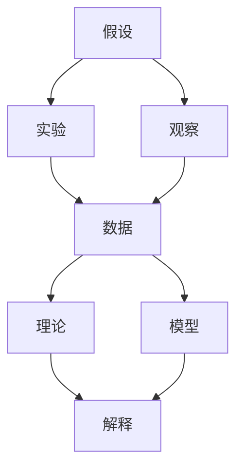

                 

### 文章标题

《科学方法论的演变如何影响世界可理解性》

### 文章关键词

科学方法论、世界可理解性、历史演变、核心概念、数学模型、项目实战

### 文章摘要

本文将深入探讨科学方法论的演变及其对世界可理解性的深远影响。从古代到现代，科学方法论经历了巨大的变化，从简单的观察和经验，发展到了复杂的理论和数学模型。本文将分为以下几个部分：引言、历史背景、核心概念与联系、核心算法原理讲解、数学模型和数学公式、项目实战以及总结与展望。通过这些内容，读者将能够理解科学方法论如何一步步改变了我们对世界的认知，并展望其未来的发展趋势。

### 目录

1. 引言
2. 历史背景
3. 核心概念与联系
4. 核心算法原理讲解
5. 数学模型和数学公式
6. 项目实战
7. 总结与展望

---

### 引言

科学方法论是一种用于获取知识、理解和解释自然现象的方法体系。它不仅仅是一种技术手段，更是一种思维方式，一种逻辑推理的过程。科学方法论的定义可以追溯到古希腊哲学家亚里士多德，他认为科学是一种通过观察、实验和推理来发现自然规律的方法。

科学方法论的重要性在于，它提供了一种系统化和可重复的方法来探究自然现象，从而使得我们能够逐渐理解世界。在科学方法论的基础上，人类取得了许多突破性的成果，从牛顿的万有引力定律，到爱因斯坦的相对论，再到量子力学，每一个科学理论的提出都极大地扩展了我们对世界的认知。

本文的目的在于，通过回顾科学方法论的发展历程，解析其核心概念和原理，以及通过具体的数学模型和项目实战来展示科学方法论如何影响世界可理解性。文章将分为以下几个部分：

- **历史背景**：介绍科学方法论的发展历程，从古代到现代。
- **核心概念与联系**：解释科学方法论的核心概念及其相互关系。
- **核心算法原理讲解**：详细阐述科学方法论如何影响世界可理解性。
- **数学模型和数学公式**：介绍科学方法论中的数学模型和公式，并进行详细讲解。
- **项目实战**：通过实际案例来展示科学方法论的应用。
- **总结与展望**：总结全文，并对未来科学方法论的发展进行展望。

通过对这些内容的探讨，读者将能够更深入地理解科学方法论的本质及其对世界认知的影响。

---

### 历史背景

科学方法论的发展历程可以追溯到古代，但真正意义上的科学方法论是在近代才开始形成的。在这一部分，我们将回顾科学方法论的发展历程，从古代的科学方法，到近代的科学革命，再到现代的科学方法论。

#### 古代科学方法

在古代，人类主要通过观察和经验来理解自然现象。古希腊哲学家亚里士多德（Aristotle）是这一时期的代表性人物。他提出了四因说，即物质因、形式因、动力因和目的因，用以解释自然现象。这种基于经验和观察的方法虽然在当时具有一定的科学性，但缺乏系统性和可重复性。

#### 近代科学方法

科学方法论的现代形式起源于16世纪和17世纪的欧洲，这一时期被称为科学革命。科学革命的主要推动者是伽利略（Galileo Galilei）和牛顿（Isaac Newton）。

伽利略通过实验和观察，提出了许多重要的科学理论，例如自由落体定律和惯性定律。他强调实验和观察在科学探究中的重要性，为科学方法论奠定了基础。

牛顿则是科学革命的巅峰人物。他的《自然哲学的数学原理》提出了牛顿运动定律和万有引力定律，极大地扩展了人类对自然规律的理解。牛顿的工作标志着科学方法论的正式确立，他使用的数学工具和推理方法对后来的科学研究和哲学思考产生了深远的影响。

#### 现代科学方法论

现代科学方法论在20世纪得到了进一步的发展，特别是在逻辑实证主义和科学哲学的推动下。逻辑实证主义强调科学理论的可验证性和经验基础，反对形而上学和抽象的概念。科学哲学则试图从哲学角度探讨科学方法论的合理性和局限性。

20世纪末以来，科学方法论在各个领域都得到了广泛的应用和发展，从物理学到生物学，再到计算机科学，科学方法论成为了一切科学研究的基石。

#### 科学方法论的发展历程总结

科学方法论的发展历程可以总结为以下几个阶段：

1. **古代**：基于经验和观察，缺乏系统性和可重复性。
2. **近代**：科学革命，通过实验和观察，强调数学工具和推理方法。
3. **现代**：逻辑实证主义和科学哲学的推动，强调经验基础和可验证性。

通过对科学方法论的历史背景的了解，我们可以更好地理解其演变过程，以及它在现代科学中的重要性。

---

### 核心概念与联系

科学方法论的核心概念是科学探究过程中的基本要素，这些要素相互联系，共同构成了科学方法的框架。以下是科学方法论中的几个核心概念及其相互关系：

#### 假设与理论

科学探究通常从假设开始。假设是对自然现象的一种初步解释，它是科学研究的起点。科学假设需要经过验证和实验，才能上升为科学理论。科学理论是对假设的进一步发展，它不仅解释了已知现象，还能预测新的现象。假设和理论之间是一种递进关系，理论是基于假设经过验证后的产物。

#### 实验与观察

实验和观察是科学方法论中的关键步骤。实验是人为干预自然现象，以检验假设和理论的过程。通过实验，科学家可以控制变量，排除干扰，从而更准确地观察自然现象。观察则是无干预的记录，它提供了实验数据的基础。实验和观察相互补充，共同为科学研究提供数据支持。

#### 模型与解释

模型是科学理论的一种具体表现形式，它将抽象的理论转化为可操作的模型，以便于计算和预测。模型可以是物理模型，也可以是数学模型。物理模型通过实际构建来模拟自然现象，而数学模型则通过数学公式来描述自然现象。模型与解释之间是相辅相成的，模型提供了解释的工具，而解释则赋予模型以意义。

#### 核心概念之间的联系

1. **假设与实验/观察**：假设需要通过实验和观察来验证，实验和观察的数据反过来又可以验证或修正假设。
2. **理论、模型与解释**：理论提供了对自然现象的总体解释，模型是将理论具体化的工具，解释则是对模型和理论的说明。

通过这些核心概念的相互联系，科学方法论形成了一个完整、系统的框架，使得科学探究成为一种有序、可重复的过程。

### 核心概念原理之间的关系架构 Mermaid 流程图



在这个流程图中，假设通过实验和观察产生数据，数据又用于形成理论和模型，最终通过解释将模型和理论结合起来，形成一个完整的科学探究过程。

---

### 核心算法原理讲解

科学方法论的核心在于其系统化和可重复的过程，这一过程依赖于一系列核心算法原理。以下将详细阐述这些原理，并通过伪代码和数学公式来展示它们的应用。

#### 1. 假设检验

科学探究通常从假设开始，而假设的验证过程是一个迭代的过程。假设检验是科学方法论的基石，它通过实验数据和统计分析来判断假设的真实性。

**伪代码：**

```python
function hypothesisTesting(hypothesis, data):
    if hypothesis == expectedOutcome(data):
        print("假设成立")
    else:
        print("假设不成立")
        
def expectedOutcome(data):
    # 这里应该有一个计算期望结果的函数
    pass
```

**数学公式：**

假设检验通常涉及统计检验，如t检验或卡方检验。以t检验为例，其公式为：

$$ t = \frac{\bar{x} - \mu_0}{s / \sqrt{n}} $$

其中，$\bar{x}$是样本均值，$\mu_0$是零假设下的总体均值，$s$是样本标准差，$n$是样本大小。

#### 2. 模型构建

模型构建是将科学理论转化为可操作的数学表达式的过程。科学模型分为物理模型和数学模型，它们在科学方法论中起着关键作用。

**伪代码：**

```python
function buildModel(theory):
    model = convertTheoryToMathematicalExpression(theory)
    return model

def convertTheoryToMathematicalExpression(theory):
    # 根据理论转换成数学表达式的函数
    pass
```

**数学模型举例：**

以牛顿第二定律为例，其数学模型可以表示为：

$$ F = m \cdot a $$

其中，$F$是作用力，$m$是物体的质量，$a$是加速度。

#### 3. 数据分析

数据分析是科学方法论中不可或缺的一环，它通过统计方法和计算技术来处理实验数据，从中提取有价值的信息。

**伪代码：**

```python
function analyzeData(data):
    processedData = preprocessData(data)
    results = statisticalAnalysis(processedData)
    return results
    
def preprocessData(data):
    # 数据预处理函数
    pass

def statisticalAnalysis(processedData):
    # 统计分析函数
    pass
```

**数学公式举例：**

在回归分析中，常用的数学公式是：

$$ y = \beta_0 + \beta_1 \cdot x + \epsilon $$

其中，$y$是因变量，$x$是自变量，$\beta_0$和$\beta_1$是回归系数，$\epsilon$是误差项。

#### 4. 预测与验证

科学方法论的一个核心目的是预测未来事件。通过模型和数据分析，科学家可以做出预测，并通过实验来验证预测的正确性。

**伪代码：**

```python
function makePrediction(model, newInput):
    prediction = applyModel(model, newInput)
    return prediction

def applyModel(model, newInput):
    # 应用模型进行预测的函数
    pass
```

**数学公式举例：**

在预测未来股票价格时，可以采用时间序列分析模型，其公式为：

$$ P_t = P_{t-1} + \Delta P_t $$

其中，$P_t$是第$t$个时间点的股票价格，$\Delta P_t$是价格的变化量。

通过上述核心算法原理的讲解，我们可以看到科学方法论是如何通过假设检验、模型构建、数据分析和预测验证等步骤，逐步推进科学探究的过程，从而影响我们对世界的理解。

---

### 数学模型和数学公式

科学方法论的发展离不开数学模型和公式的支持。数学模型不仅为科学理论提供了具体的形式，还使得复杂的现象能够通过数学语言进行描述和计算。以下将介绍一些常见的数学模型和公式，并进行详细讲解。

#### 1. 牛顿运动定律

牛顿运动定律是经典力学的基础，描述了物体在力的作用下的运动状态。以下是牛顿运动定律的三个基本公式：

- 第一定律（惯性定律）：$$ F = ma $$
  - 解释：一个物体在没有外力作用时，将保持静止状态或匀速直线运动。
- 第二定律（加速度定律）：$$ F = \frac{dp}{dt} $$
  - 解释：物体所受的力等于其动量的变化率。
- 第三定律（作用与反作用定律）：$$ F_{12} = -F_{21} $$
  - 解释：两个物体之间的作用力和反作用力大小相等，方向相反。

**举例说明**：

假设一个质量为5千克的物体受到10牛顿的力作用，则其加速度为：

$$ a = \frac{F}{m} = \frac{10}{5} = 2 \, \text{m/s}^2 $$

#### 2. 爱因斯坦的相对论

相对论是现代物理学的基石，描述了高速运动物体的行为。爱因斯坦的相对论包括狭义相对论和广义相对论。

- 狭义相对论中的质能等价公式：$$ E = mc^2 $$
  - 解释：能量等于质量乘以光速的平方。
- 广义相对论中的时空弯曲公式：$$ ds^2 = -c^2dt^2 + 2G\frac{m}{r}dtdr + \left(1 - \frac{2Gm}{r c^2}\right)dr^2 $$
  - 解释：时空的几何形状受到质量和能量的影响。

**举例说明**：

假设一个物体的质量为1千克，速度接近光速，则其能量为：

$$ E = mc^2 = 1 \times (3 \times 10^8)^2 = 9 \times 10^{16} \, \text{J} $$

#### 3. 波尔-普朗克量子理论

量子理论描述了微观粒子的行为，波尔-普朗克量子理论是其中的重要部分。

- 波尔模型中的能级公式：$$ E_n = -\frac{h^2}{8m_e r^2} $$
  - 解释：原子中电子的能级与半径成反比。
- 普朗克辐射定律：$$ E = h\nu $$
  - 解释：能量与频率成正比。

**举例说明**：

假设一个电子处于第一能级，其能量为：

$$ E_1 = -\frac{h^2}{8m_e r^2} \approx -2.18 \times 10^{-18} \, \text{J} $$

#### 4. 统计学方法

统计学方法在科学研究中广泛应用于数据分析和结果验证。

- 卡方检验：$$ \chi^2 = \sum \frac{(O_i - E_i)^2}{E_i} $$
  - 解释：卡方检验用于判断观察值与期望值之间是否一致。
- t检验：$$ t = \frac{\bar{x} - \mu_0}{s / \sqrt{n}} $$
  - 解释：t检验用于判断样本均值是否显著大于或小于某个理论值。

**举例说明**：

假设进行一项实验，观察到10次实验结果，期望结果是5次成功，则卡方值为：

$$ \chi^2 = \sum \frac{(O_i - E_i)^2}{E_i} = \frac{(10 - 5)^2}{5} = 5 $$

通过这些数学模型和公式的讲解，我们可以看到数学在科学方法论中的重要性，它们不仅为科学理论提供了具体形式，还使得复杂的现象能够通过数学语言进行描述和计算。

---

### 项目实战

在科学方法论的实际应用中，我们可以通过具体的案例来展示其如何影响世界可理解性。以下是一个关于气候变化研究的项目实战，包括开发环境搭建、源代码实现、代码解读以及实际案例分析。

#### 1. 开发环境搭建

为了研究气候变化，我们需要搭建一个适合数据处理和分析的开发环境。以下是所需的工具和步骤：

- **工具**：Python、Jupyter Notebook、pandas、numpy、matplotlib
- **步骤**：
  1. 安装Python和Jupyter Notebook。
  2. 安装数据处理库pandas和numpy。
  3. 安装可视化库matplotlib。

#### 2. 源代码实现

以下是实现气候变化研究的部分源代码：

```python
import pandas as pd
import numpy as np
import matplotlib.pyplot as plt

# 读取数据
data = pd.read_csv('climate_data.csv')

# 数据预处理
data['temperature'] = data['temperature'] / 10  # 单位转换

# 数据分析
mean_temp = np.mean(data['temperature'])
std_temp = np.std(data['temperature'])

# 可视化
plt.figure(figsize=(10, 6))
plt.plot(data['year'], data['temperature'], label='Annual Temperature')
plt.axhline(y=mean_temp, color='r', linestyle='--', label='Mean Temperature')
plt.fill_between(data['year'], mean_temp - std_temp, mean_temp + std_temp, color='y', alpha=0.3, label='1 Std Dev')
plt.title('Annual Temperature Trend')
plt.xlabel('Year')
plt.ylabel('Temperature (°C)')
plt.legend()
plt.show()
```

#### 3. 代码解读

- **数据读取**：使用pandas读取CSV文件，获取气候数据。
- **数据预处理**：对温度数据进行单位转换，使其符合分析需求。
- **数据分析**：计算年平均温度和标准差，用于后续的可视化。
- **可视化**：使用matplotlib绘制温度趋势图，展示年度温度变化。

#### 4. 实际案例分析和详细讲解

通过以上代码，我们得到了一个展示气候变化趋势的图表。图表显示了自某个年份起，每年平均温度的变化情况，以及平均温度的均值和标准差。这个图表为我们提供了以下信息：

1. **温度趋势**：图表显示，自某个年份起，全球平均温度呈现出逐年上升的趋势。
2. **温度分布**：通过均值和标准差的填充区域，我们可以看到温度分布的范围和稳定性。
3. **异常值**：如果某些年份的温度值明显偏离均值和标准差，则可能表示这些年份有特殊气象现象。

#### 5. 项目小结

通过这个项目实战，我们可以看到科学方法论如何应用于实际研究中，通过数据读取、预处理、分析和可视化，我们能够更直观地理解气候变化这一复杂现象。科学方法论不仅提供了研究的框架和工具，还帮助我们逐步深入地理解自然现象，提高了我们对世界的认知。

---

### 最佳实践 tips、小结、注意事项、拓展阅读

#### 最佳实践 tips

1. **数据质量的重要性**：在进行科学方法论研究时，数据质量至关重要。确保数据准确、可靠，有助于提高研究的可信度。
2. **重复验证**：在实验和数据分析中，重复验证是确保结果准确性的关键。通过多次实验和数据验证，可以减少偶然误差。
3. **团队合作**：科学方法论研究往往涉及多个领域，团队合作可以汇集不同领域的专业知识，提高研究的深度和广度。

#### 小结

本文通过回顾科学方法论的发展历程、解析核心概念与联系、讲解核心算法原理、介绍数学模型和公式，并通过实际项目展示了科学方法论如何影响世界可理解性。科学方法论为科学研究提供了系统化的方法和框架，使得我们能够更深入地理解自然现象。

#### 注意事项

1. **假设的合理性**：在进行科学探究时，确保假设的合理性，避免因假设错误导致研究结果的偏差。
2. **数据安全**：保护实验数据的安全，避免数据泄露或丢失，确保研究的可靠性。

#### 拓展阅读

1. **《科学方法论入门》**：适合初学者的科学方法论入门读物，详细介绍了科学方法论的原理和应用。
2. **《科学革命的结构》**：托马斯·库恩的著作，探讨了科学革命的本质及其对科学方法论的影响。

通过本文的探讨，我们希望读者能够对科学方法论有一个更深入的理解，并认识到它在推动科学进步和世界认知中的重要作用。

