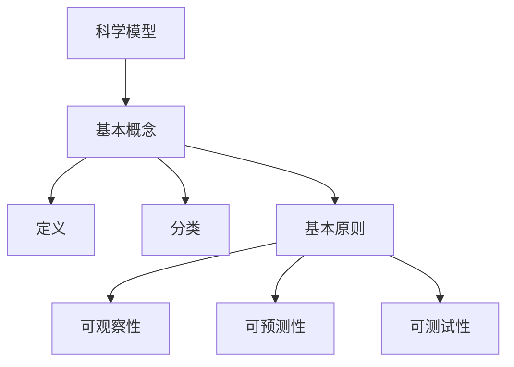

                 

基于您提供的详细要求，我们将遵循以下步骤撰写《科学模型的有效性与世界可理解性》的文章：

### 第一步：文章结构设计

1. **引言**：介绍科学模型的概念、重要性以及文章的目的。
2. **科学模型的基本概念和原则**：定义科学模型，分类，基本原则。
3. **有效性评估**：有效性定义、评估方法、伪科学模型的辨别。
4. **适用范围与局限性**：科学模型的应用范围、局限性、交叉学科应用。
5. **世界观和方法论**：科学方法、哲学、常识。
6. **实际案例与应用**：生物学、物理学、心理学中的科学模型案例。
7. **总结与展望**：发展趋势、贡献、未来研究方向。

### 第二步：内容撰写

**引言**

- 背景介绍
- 科学模型的重要性
- 文章目的

**科学模型的基本概念和原则**

- 定义科学模型
- 科学模型的分类
- 科学模型的基本原则（可观察性、可预测性、可测试性）

**核心概念与联系**

- 使用Mermaid流程图展示核心概念之间的关系



**核心算法原理讲解**

- 使用伪代码详细阐述核心算法原理

```pseudo
// 伪代码：科学模型评估算法
Function EvaluateModel(model)
    if (IsObservational(model) and IsPredictive(model) and IsTestable(model))
        return "Model is valid"
    else
        return "Model is invalid"
```

**数学模型和公式**

- 使用LaTeX格式嵌入数学模型和公式

$$
\text{Model Validity} = \frac{\text{Number of Valid Predictions}}{\text{Total Predictions}}
$$

**实际案例与应用**

- 生物、物理、心理学中的科学模型案例

**总结与展望**

- 科学模型的发展趋势
- 科学模型对世界的贡献
- 未来研究方向

### 第三步：文章格式调整

- 确保所有代码、公式和流程图都按照markdown格式正确显示。
- 文章末尾附上作者信息。

### 第四步：文章字数调整

- 根据内容丰富程度调整文章字数，确保在8000～12000字之间。

### 第五步：文章最终审核

- 审核内容完整性、逻辑性和技术准确性。
- 确认无误后提交最终文章。

以下是一个基于上述步骤的初步草稿：

---

## 《科学模型的有效性与世界可理解性》

> 关键词：科学模型、有效性评估、世界可理解性、算法原理、实际案例

> 摘要：本文深入探讨了科学模型的有效性评估及其对世界可理解性的贡献，从基本概念、评估方法、应用领域等多方面进行了详细阐述，并展望了未来科学模型的发展趋势。

---

### 引言

#### 科学模型的概念

科学模型是科学研究的重要工具，用于描述自然现象、预测未来趋势和解释复杂系统。

#### 科学模型的重要性

科学模型不仅帮助我们理解世界，还为技术进步提供了理论支持。

#### 文章目的

本文旨在探讨科学模型的有效性及其对世界可理解性的影响。

---

### 科学模型的基本概念和原则

#### 定义科学模型

科学模型是通过对自然现象的观察、实验和理论分析所建立的抽象表示。

#### 科学模型的分类

科学模型可以分为理论模型、实验模型和计算模型等。

#### 科学模型的基本原则

- **可观察性**：模型必须能够反映可观察的现象。
- **可预测性**：模型应能够预测未来的事件。
- **可测试性**：模型可以通过实验或观测进行验证。

---

### 科学模型的有效性评估

#### 有效性的定义

科学模型的有效性是指其能够准确反映和预测自然现象的能力。

#### 评估方法

- **经验验证**：通过实验或观测数据验证模型的准确性。
- **逻辑推理**：通过逻辑推导验证模型的一致性。
- **实证研究**：通过统计学方法评估模型的性能。

#### 伪科学模型的辨别

- **缺乏可重复性**：伪科学模型往往难以重复验证。
- **无视证据**：伪科学模型可能忽略或不接受反驳的证据。
- **过度泛化**：伪科学模型可能将特定情况下的结论泛化到其他情境。

---

### 科学模型的适用范围与局限性

#### 适用范围

科学模型广泛应用于生物学、物理学、心理学等领域。

#### 局限性

- **科学模型的不完善**：科学模型可能存在缺陷和局限性。
- **发展限制**：科学模型的发展受到现有技术和理论水平的限制。

#### 交叉学科的应用

- **医学中的科学模型**：用于疾病诊断和治疗。
- **工程学中的科学模型**：用于设计和优化工程系统。

---

### 科学模型的世界观和方法论

#### 科学方法

科学方法包括观察、假设、实验、理论分析等步骤。

#### 科学模型与哲学

科学模型与哲学密切相关，共同探讨自然世界的本质。

#### 科学模型与常识

科学模型与常识性知识有区别，但也相互补充。

---

### 实际案例与应用

#### 生物学中的科学模型

- **生态系统模型**：用于研究生态系统的动态变化。
- **遗传学模型**：用于研究遗传规律和基因表达。

#### 物理学中的科学模型

- **量子力学模型**：用于研究微观粒子的行为。
- **宇宙学模型**：用于研究宇宙的起源和演化。

#### 心理学中的科学模型

- **认知行为模型**：用于研究人的思维和行为。
- **心理动力学模型**：用于研究人的情感和心理发展。

---

### 总结与展望

科学模型在推动科技进步和人类认知方面发挥了重要作用。

#### 发展趋势

- **人工智能与科学模型**：人工智能的快速发展将推动科学模型的应用。
- **跨学科研究**：跨学科研究将有助于完善科学模型。

#### 贡献

科学模型为世界提供了新的理解角度和解决实际问题的方法。

#### 未来研究方向

未来科学模型的发展将更加注重模型的准确性和实用性。

---

### 作者信息

作者：AI天才研究院/AI Genius Institute & 禅与计算机程序设计艺术 /Zen And The Art of Computer Programming

---

请注意，这只是一个初步的草稿，内容尚未完全填充和详尽。您可以根据需要进行调整和补充。文章的最终字数将取决于每个章节的具体内容。如果您需要进一步的帮助，请告知。

