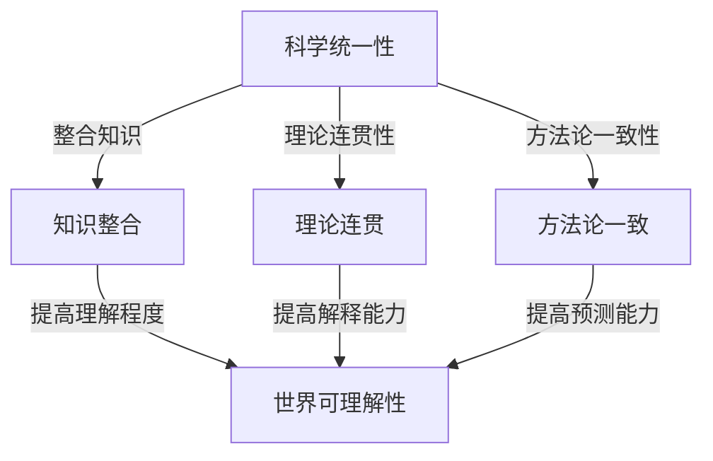

                 

### 《科学的统一性与世界的可理解性》

#### 关键词：
- 科学统一性
- 世界的可理解性
- 哲学思考
- 科学方法论
- 物理学
- 社会科学

#### 摘要：
本文探讨了科学的统一性与世界的可理解性这一核心主题。通过逐步分析，我们从哲学的角度出发，探讨了科学统一性的概念及其在自然科学和人文社会科学中的应用。文章旨在揭示科学如何通过方法论实现统一性，并讨论了这一过程中所面临的挑战。通过深入探讨，本文强调了科学统一性对提升世界可理解性的重要性。

---

### 引言

科学的统一性是指将不同学科和现象通过共同的原理和模型进行整合的能力。在科学发展的历史中，科学家们不断尝试将看似独立的领域统一起来，从而构建一个更加完整和一致的理论框架。世界的可理解性则涉及到我们是否能够以逻辑和理性的方式理解我们所处的宇宙。这一主题在哲学、科学和人文领域有着广泛的研究。

本文的结构如下：

1. **引言**：概述科学的统一性和世界的可理解性，并介绍本文的组织结构和内容。
2. **科学的统一性与世界的可理解性概述**：探讨科学统一性和世界可理解性的概念，以及它们之间的关系。
3. **科学统一性的哲学思考**：分析科学统一性与哲学思考的联系，以及哲学如何影响科学统一性。
4. **科学的统一性方法**：介绍科学统一性的方法论，包括科学方法的发展和统一性方法论的应用。
5. **科学统一性在自然科学中的应用**：探讨物理学中科学统一性的实现及其面临的挑战。
6. **科学统一性在社会科学中的应用**：分析社会科学如何通过科学统一性来理解人类行为和社会现象。
7. **总结与展望**：总结本文的主要观点，并对未来的研究方向提出展望。

---

### 第一部分：科学的统一性与世界的可理解性概述

#### 第1章：科学的统一性与世界的可理解性概述

科学的统一性是一个广泛探讨的主题，它涉及到科学理论的整合和不同学科之间的交叉。世界的可理解性则关注我们是否能够以理性的方式理解自然界的规律和人类社会的复杂性。这两个概念紧密相关，因为科学的统一性直接影响了我们对世界的理解程度。

##### 1.1 什么是科学的统一性

科学的统一性指的是通过将不同的学科和现象纳入一个共同的理论框架中，以实现知识的整合和理论的连贯性。在科学史上，许多重要的科学革命都伴随着统一性的追求。例如，牛顿力学通过将天体运动和地面上的物体运动纳入一个统一的框架，极大地推动了物理学的发展。

科学的统一性具有以下几个特点：

- **跨学科性**：科学的统一性不仅仅局限于某个特定的学科，而是涉及到多个学科的交叉和融合。
- **理论整合**：通过将不同的理论整合为一个统一的框架，科学能够更好地解释和预测自然现象。
- **方法论一致性**：科学的统一性要求采用一致的方法论原则，以确保不同学科之间的可比性和一致性。

##### 1.2 世界的可理解性

世界的可理解性是指我们是否能够以逻辑和理性的方式理解我们所处的宇宙。这一问题在哲学、科学和人文领域都有广泛的讨论。从哲学的角度看，世界是否具有内在的理性和规律性是一个基本问题。从科学的角度看，科学的使命就是通过实验和理论探索来揭示自然界的规律。

世界的可理解性具有以下几个特征：

- **逻辑性**：世界是否遵循一定的逻辑规则和原则，使得我们可以通过推理和理解来把握其规律。
- **规律性**：自然界是否具有内在的规律性，使得我们可以通过科学方法来发现和预测现象。
- **一致性**：不同领域的科学理论是否能够相互一致，形成一个统一的科学体系。

##### 1.3 科学统一性与世界的可理解性之间的关系

科学统一性和世界的可理解性之间有着紧密的联系。科学统一性是提升世界可理解性的关键因素。当科学家们能够将不同的学科和现象纳入一个统一的理论框架中时，我们就能更全面和深入地理解世界。

具体来说，科学统一性对世界的可理解性有以下几个影响：

- **知识的整合**：科学统一性将不同领域的知识整合在一起，使得我们可以从多个角度来理解同一个现象，从而提高理解的整体性。
- **理论的连贯性**：科学统一性通过将不同理论整合为一个统一的框架，提高了理论的连贯性和一致性，使得我们可以更可靠地预测和解释现象。
- **方法论的一致性**：科学统一性要求采用一致的方法论原则，这有助于确保科学研究的可比性和一致性，从而提高我们对世界的理解程度。

#### Mermaid流程图：科学统一性与世界可理解性之间的联系



通过上述流程图，我们可以清晰地看到科学统一性如何通过知识整合、理论连贯性和方法论一致性来提升世界的可理解性。

在接下来的章节中，我们将进一步探讨科学统一性的哲学思考、方法论以及它在自然科学和人文社会科学中的应用。

### 第一部分：科学的统一性与世界的可理解性概述

#### 第2章：科学统一性的哲学思考

科学的统一性不仅仅是科学方法论和技术手段的结果，它还深深植根于哲学思考之中。哲学作为探讨世界本质和人类知识的学科，对科学的统一性有着深远的影响。在本章中，我们将探讨科学统一性与哲学思考之间的联系，并分析哲学如何影响科学统一性的探讨。

##### 2.1 科学哲学的基本概念

科学哲学是研究科学本质和科学方法的哲学分支。它探讨科学的本质、科学理论的基础、科学方法论以及科学知识的发展。科学哲学的核心问题包括科学理论的正确性、科学方法的有效性、科学知识的性质以及科学发现的过程。

科学哲学的主要问题可以概括为以下几点：

- **科学理论的正确性**：科学理论是否能够准确地反映现实世界？
- **科学方法论**：科学方法是否有效，是否能够产生可靠的科学知识？
- **科学知识的发展**：科学知识是如何发展的，新理论的引入是否能够替代旧理论？
- **科学发现的客观性**：科学发现是否具有客观性，是否受到个人主观意识的影响？

科学哲学的发展经历了几个阶段，从早期的经验主义和理性主义，到现代的科学哲学，如实证主义、解释学、建构主义等。这些哲学思潮对科学的统一性提出了不同的观点和解释。

##### 2.2 科学统一性与哲学的联系

科学统一性与哲学思考有着紧密的联系。哲学为科学提供了理论基础和方法论指导，而科学的统一性则是对哲学问题的一种回应。

- **哲学对科学统一性的启示**：哲学思考为科学统一性提供了重要的启示。例如，理性主义强调通过理性思考和逻辑推理来探索世界的本质，这促使科学家们追求理论的统一性。经验主义则强调通过实验和观察来验证理论，这促进了科学方法的统一性。此外，科学哲学中的某些观点，如科学实在论和科学社会建构主义，对科学统一性的讨论提供了不同的视角。

- **科学统一性对哲学问题的回应**：科学的统一性是对哲学问题的一种回应。例如，哲学中的形而上学问题探讨世界是否存在内在的统一性，科学统一性通过将不同领域的知识整合为一个统一的框架，为这一问题提供了一种可能的答案。科学统一性还回应了认识论问题，即我们是否能够通过科学方法来获得真正的知识。

##### 2.3 哲学对科学统一性的影响

哲学对科学统一性的影响体现在多个方面：

- **方法论指导**：哲学为科学统一性提供了方法论指导。例如，逻辑实证主义强调通过经验证据来验证理论，这促进了科学统一性的实现。解释学则强调理解人类行为和社会现象的复杂性，这有助于科学在社会科学领域实现统一性。

- **理论框架**：哲学为科学统一性提供了理论框架。例如，科学哲学中的范式理论为科学家提供了如何构建和整合理论的指导。科学实在论和科学社会建构主义则为科学家提供了不同的理论视角，有助于他们理解科学统一性的本质。

- **价值观念**：哲学中的某些价值观念对科学统一性产生了影响。例如，理性主义强调逻辑和理性的重要性，这促使科学家追求理论的简洁性和一致性。实证主义则强调实践和实验的重要性，这推动了科学统一性的实现。

##### 2.4 科学统一性的哲学争议

尽管哲学对科学统一性有着重要的影响，但在科学统一性的哲学思考中仍存在一些争议。

- **实证主义与理性主义的争议**：实证主义强调经验证据的重要性，而理性主义强调逻辑推理和理论框架的构建。这两种哲学观点在科学统一性上有不同的立场，引发了争议。

- **科学实在论与科学社会建构主义的争议**：科学实在论认为科学理论能够准确反映现实世界，而科学社会建构主义则认为科学知识是建构性的，受到社会和文化因素的影响。这两种观点在科学统一性的解释上有显著差异。

- **方法论的一致性与差异性**：科学统一性要求方法论的一致性，但在实践中，不同的科学家可能采用不同的方法论原则，这可能导致对科学统一性的理解产生分歧。

尽管存在争议，哲学对科学统一性的探讨仍然具有重要意义。它不仅为科学提供了理论基础和方法论指导，还促进了科学内部的整合和外部领域的交叉。在接下来的章节中，我们将进一步探讨科学统一性的方法论，并分析其在自然科学和人文社会科学中的应用。

### 第一部分：科学的统一性与世界的可理解性概述

#### 第3章：科学的统一性方法

科学的统一性不仅是一个哲学概念，更是一个实际操作的过程。实现科学的统一性需要系统的方法论，这些方法论包括科学研究的步骤、理论整合的策略以及跨学科的合作。本章将详细介绍科学统一性的方法论，探讨科学方法的发展和统一性方法论的应用。

##### 3.1 科学方法论概述

科学方法论是指科学研究过程中所采用的基本原则和步骤。科学方法论的发展经历了漫长的历史过程，从古代的经验观察，到中世纪的实验方法，再到现代的科学体系，科学方法论不断演变和完善。

科学方法论的核心原则包括：

- **可观察性**：科学理论必须基于可观察和可测量的现象。
- **可重复性**：科学实验和观察必须能够被其他人重复，以验证结果的有效性。
- **理性推理**：科学理论必须通过逻辑推理和数学模型来解释现象。
- **批判性思维**：科学理论必须接受严格的批判和检验，以验证其正确性。

科学方法论的发展经历了几个重要阶段：

- **经验主义**：以伽利略和培根为代表的早期科学家，强调通过经验观察来获取知识。
- **实证主义**：以孔德和穆勒为代表的实证主义者，强调通过实验和观察来验证理论。
- **实证主义与理性主义的融合**：现代科学方法论将实证主义和理性主义结合起来，既重视实验和观察，也重视理论推理和逻辑论证。

##### 3.2 统一性方法论

统一性方法论是指科学家在追求科学统一性时所采用的具体策略和方法。实现科学统一性的方法包括以下几个方面：

- **理论整合**：通过将不同领域的理论整合为一个统一的理论框架，实现知识的整合。例如，物理学中的相对论和量子力学试图将经典力学和量子现象整合为一个统一的理论体系。
- **跨学科合作**：通过跨学科的合作，将不同领域的知识和技术融合在一起，实现科学统一性。例如，生物学与物理学、化学的交叉研究，推动了生物学中的分子生物学和生物物理学的快速发展。
- **数学模型**：通过数学模型来描述和整合不同领域的现象。数学模型不仅能够提供精确的描述，还能够揭示不同领域之间的内在联系。例如，经济学中的博弈论和物理学中的统计力学，通过数学模型实现了经济现象和物理现象的整合。

##### 3.3 科学统一性的方法论应用

科学统一性的方法论在各个领域都有广泛的应用：

- **物理学**：物理学中的统一性方法论体现在试图将基本粒子的性质、宇宙的演化以及宏观物体的运动整合为一个统一的理论体系。例如，标准模型将基本粒子的相互作用整合为一个统一的框架，而广义相对论则试图将引力和时空结构整合为一个统一的理论。
- **生物学**：生物学中的统一性方法论体现在通过分子生物学、基因组学和进化论等理论，将生物体的结构、功能和进化整合为一个统一的理论框架。例如，现代综合进化论通过整合遗传学、生态学和分子生物学，建立了对生物进化的统一理解。
- **社会科学**：社会科学中的统一性方法论体现在试图将经济学、社会学、心理学等不同领域的理论整合为一个统一的理论体系。例如，社会学中的系统理论通过整合不同领域的理论，建立了对社会现象的统一理解。

##### 3.4 科学统一性的方法论挑战

尽管科学统一性方法论在各个领域取得了显著的成果，但在实现科学统一性的过程中仍面临一些挑战：

- **方法论差异**：不同学科之间的方法论存在差异，这在一定程度上阻碍了科学统一性的实现。例如，物理学强调实验和数学模型，而生物学和社会科学更注重理论和实证研究。
- **理论整合的困难**：不同领域的理论具有不同的假设和前提，这为理论整合带来了困难。例如，量子力学和经典力学的整合，以及生物学和物理学的整合，都需要克服理论前提的差异。
- **跨学科合作的障碍**：跨学科合作需要不同领域的科学家具备广泛的知识和技能，这在一定程度上增加了合作的难度。此外，学科之间的文化差异和沟通障碍也可能阻碍跨学科合作。

尽管存在挑战，科学统一性方法论仍然是科学进步的重要驱动力。通过不断改进方法论，科学家们能够更好地整合不同领域的知识，提升对世界的理解。在接下来的章节中，我们将深入探讨科学统一性在自然科学和人文社会科学中的应用，进一步揭示科学统一性的重要性。

### 科学统一性在自然科学中的应用

#### 第4章：物理学与科学统一性

物理学作为自然科学的核心领域，长期以来一直致力于实现科学的统一性。通过建立广泛的理论框架，物理学家们试图将宇宙的基本现象整合为一个统一的理论体系。本章将详细探讨物理学中科学统一性的实现过程，分析物理学统一性研究的进展和面临的挑战。

##### 4.1 物理学的基本理论

物理学的基础理论包括经典力学、电磁学、热力学、量子力学和广义相对论。这些理论不仅各自独立地解释了不同领域的自然现象，还通过它们的统一性提供了对宇宙的全面理解。

- **经典力学**：经典力学由牛顿的三大运动定律和万有引力定律构成，主要描述宏观物体的运动和相互作用。经典力学在许多情况下都能准确预测物体的行为，但其局限性在高速和微观尺度上变得明显。
- **电磁学**：电磁学由麦克斯韦方程组描述，揭示了电场和磁场之间的相互作用。电磁学不仅解释了光的波动性，还为现代通信技术和电力系统奠定了基础。
- **热力学**：热力学研究能量转换和热量传递，其基本原理包括能量守恒和热力学第二定律。热力学在工程学和化学领域有广泛的应用。
- **量子力学**：量子力学描述了微观粒子的行为，其基本原理包括波粒二象性和不确定性原理。量子力学在解释原子结构、化学键和核物理现象方面发挥了关键作用。
- **广义相对论**：广义相对论由爱因斯坦提出，描述了引力作为时空曲率的表现。广义相对论在解释天体运动、黑洞和宇宙膨胀方面取得了重要成果。

##### 4.2 物理学中的科学统一性研究

物理学中的科学统一性研究主要集中在以下几个方面：

- **量子力学与经典力学的统一**：量子力学和经典力学在描述物理现象时存在明显的矛盾。量子力学强调概率性和波动性，而经典力学则强调确定性和粒子性。科学家们试图通过量子力学的修正或经典力学的扩展来实现二者的统一。
- **电磁学与量子力学的统一**：电磁学和量子力学的统一体现在尝试将电磁场与量子粒子的行为结合起来。例如，量子电动力学（QED）通过将电磁场量子化，成功解释了电磁相互作用。

- **广义相对论与量子力学的统一**：广义相对论和量子力学的统一被称为量子引力理论，是物理学中最大的未解问题之一。科学家们试图通过量子几何、弦论和其他理论框架来统一这两大理论，以描述宇宙在大尺度和小尺度上的行为。

##### 4.3 标准模型与统一性

标准模型是粒子物理学的基本理论，描述了已知的基本粒子和它们的相互作用。尽管标准模型在描述粒子物理现象方面取得了巨大成功，但它与广义相对论之间的不一致性使得科学家们试图实现两者的统一。

- **大统一理论（Grand Unified Theory, GUT）**：大统一理论试图将强相互作用、弱相互作用和电磁相互作用整合为一个单一的理论框架。大统一理论的预测包括统一的力荷和粒子质量，但至今尚未找到实验验证。
- **超对称性（Supersymmetry, SUSY）**：超对称性是试图统一标准模型中的粒子相互作用的一种理论。超对称性提出每种已知粒子都有一个超对称伙伴，这有助于解决标准模型中的某些问题，但超对称性粒子尚未在实验中观察到。

##### 4.4 物理学统一性的挑战

物理学统一性研究面临一些重大挑战：

- **实验验证的困难**：许多统一性理论的预测超出了当前实验技术的能力范围。例如，大统一理论和超对称性理论的实验验证可能需要更高能量的加速器。
- **理论的复杂性和抽象性**：统一性理论往往非常复杂和抽象，需要高度数学化的表述。这增加了理论理解和实验验证的难度。
- **哲学争议**：科学统一性在哲学上引发了一些争议，例如关于物理学是否能够真正统一所有现象以及科学理论的客观性等。

尽管面临挑战，物理学统一性研究仍然是物理学领域的核心议题。科学家们通过不断探索和创新，试图揭示宇宙的统一性，提升我们对自然世界的理解。在接下来的章节中，我们将探讨科学统一性在人文社会科学中的应用，进一步展示科学统一性的重要性和影响。

### 科学统一性在人文社会科学中的应用

#### 第5章：社会科学与科学统一性

科学统一性不仅限于自然科学领域，也在人文社会科学中发挥着重要作用。社会科学涉及人类行为和社会现象的研究，其统一性有助于我们更全面地理解社会结构和人类行为。本章将探讨科学统一性在社会科学中的应用，分析其在理解人类行为和社会现象中的重要性。

##### 5.1 社会科学的基本概念

社会科学是研究人类社会、个体行为以及社会结构的学科领域。它包括多个子领域，如经济学、社会学、政治学、心理学、人类学等。社会科学的基本概念包括社会互动、文化、制度、价值观等。

- **经济学**：经济学研究资源分配、生产、消费和市场行为。经济学理论包括微观经济学和宏观经济学，前者关注个体行为，后者关注整体经济运行。
- **社会学**：社会学研究社会结构、社会关系和社会变化。社会学理论包括功能主义、冲突理论和符号互动论等，这些理论试图解释社会现象和社会结构的形成与变化。
- **政治学**：政治学研究政府、政治制度、公共政策和国际关系。政治学理论包括民主理论、威权理论和比较政治学等。
- **心理学**：心理学研究个体行为、认知和情绪。心理学理论包括行为主义、认知心理学和精神分析等。
- **人类学**：人类学研究人类的文化、社会和历史。人类学理论包括结构主义、功能主义和文化相对论等。

##### 5.2 科学统一性在社会科学中的应用

科学统一性在社会科学中的应用有助于我们更全面地理解人类行为和社会现象。通过将不同学科的理论整合为一个统一的理论框架，社会科学能够更好地解释复杂的社会现象。

- **跨学科合作**：科学统一性促进跨学科合作，将经济学、社会学、心理学等领域的理论整合在一起，以提供对人类行为和社会现象的全面理解。例如，经济学中的理性选择理论可以与社会学中的社会网络理论相结合，解释个体在复杂社会系统中的行为。
- **理论整合**：科学统一性通过整合不同学科的理论，建立更全面和一致的社会科学理论体系。例如，社会学中的系统理论试图将经济学、心理学和人类学的理论整合为一个统一的理论框架，以解释社会结构和人类行为的动态变化。
- **方法论的一致性**：科学统一性要求采用一致的方法论原则，确保不同学科之间的可比性和一致性。例如，经济学中的实验方法可以与社会学中的调查方法相结合，以验证社会理论的有效性。

##### 5.3 科学统一性在社会科学中的挑战

尽管科学统一性在社会科学中有许多优势，但在实际应用中仍面临一些挑战：

- **方法论差异**：不同学科采用的方法论存在差异，这在一定程度上阻碍了科学统一性的实现。例如，经济学强调定量分析和数学模型，而社会学强调定性分析和案例研究。
- **理论前提的差异**：不同学科的理论具有不同的假设和前提，这为理论整合带来了困难。例如，经济学中的理性选择理论假设个体是理性的，而社会学中的符号互动论则强调社会互动对个体行为的影响。
- **数据获取的困难**：社会科学研究通常依赖于大量的社会数据和观察，但数据获取的困难和数据质量的差异可能影响科学统一性的实现。

##### 5.4 社会科学统一性的重要性

科学统一性在社会科学中的重要性体现在以下几个方面：

- **提高理解深度**：通过科学统一性，我们可以更深入地理解人类行为和社会现象。将不同学科的理论整合为一个统一的理论框架，有助于揭示社会现象的复杂性和多样性。
- **促进理论创新**：科学统一性推动理论创新，通过跨学科的合作和理论整合，产生新的研究问题和理论模型。
- **改善政策制定**：科学统一性为政策制定提供更全面和准确的社会科学理论，有助于制定更有效的社会政策和解决方案。

总之，科学统一性在人文社会科学中的应用具有重要意义。通过整合不同学科的理论和方法，社会科学能够更好地理解人类行为和社会现象，为解决社会问题提供科学依据。在接下来的章节中，我们将总结本文的主要观点，并对未来的研究方向提出展望。

### 总结与展望

科学的统一性与世界的可理解性是理解现代科学的核心概念。通过本文的探讨，我们揭示了科学统一性在提升世界可理解性方面的重要作用。科学统一性不仅整合了不同学科的知识，还提供了理论连贯性和方法论一致性，从而帮助我们更全面和深入地理解自然界和人类社会。

本文首先介绍了科学统一性和世界的可理解性的基本概念，探讨了它们之间的紧密联系。接着，我们分析了科学统一性的哲学思考，并介绍了科学统一性的方法论，包括理论整合、跨学科合作和数学模型的应用。在自然科学和人文社会科学的章节中，我们详细探讨了科学统一性在这些领域的应用和挑战。

展望未来，科学统一性的研究将面临更多挑战和机遇：

1. **跨学科合作的深化**：随着科技的发展，跨学科研究将变得更加普遍。科学家需要进一步深化跨学科合作，以应对复杂问题的复杂性。
2. **理论整合的创新**：科学家需要不断创新理论整合的方法，将不同学科的理论和模型整合为一个统一的框架，以更好地理解复杂系统。
3. **方法论的创新**：随着实验技术和计算能力的提升，科学家需要开发新的方法论，以验证和实现更高级的科学统一性。
4. **数据驱动的科学**：大数据和人工智能技术的发展为科学统一性提供了新的数据源和方法。科学家可以利用这些技术来发现新的规律和模型，提升科学统一性的实现程度。

总之，科学的统一性和世界的可理解性是理解现代科学的两个重要维度。通过不断深化和拓展科学统一性的研究，我们可以进一步提升对世界的理解，为人类社会的进步提供科学支持。

### 拓展阅读与最佳实践

#### 拓展阅读

1. **《科学的统一性与复杂性理论》**：这本书详细探讨了科学统一性在复杂性科学中的应用，包括混沌理论、复杂系统和网络科学。作者通过多个案例研究展示了如何通过统一性方法论来理解复杂的自然和社会现象。

2. **《哲学与科学方法论》**：这是一本经典的科学哲学著作，讨论了哲学对科学方法的影响，特别是科学统一性在哲学思考中的应用。作者分析了不同哲学思潮如何影响科学理论和科学方法的演变。

3. **《大统一理论：寻找宇宙的终极理论》**：这本书介绍了大统一理论的历史背景、基本概念和最新研究进展。作者探讨了物理学中的统一性方法论，以及科学家如何试图通过大统一理论来实现物理学的统一性。

#### 最佳实践

1. **跨学科合作**：在进行科学统一性研究时，跨学科合作是提升研究深度和广度的关键。科学家应积极寻求与其他领域的专家合作，共同探讨问题的不同视角。

2. **数据驱动的研究**：在科学统一性研究中，数据的重要性不容忽视。科学家应充分利用大数据和计算技术来分析复杂系统，发现新的规律和模式。

3. **方法论创新**：科学统一性研究需要不断创新方法论。科学家应积极探索新的实验技术和计算方法，以提高验证和实现科学统一性的能力。

4. **持续学习与思考**：科学的统一性和世界的可理解性是一个不断发展的领域。科学家应保持持续学习和思考，紧跟科学前沿，不断更新知识和方法。

---

### 注意事项

1. **科学统一性研究的复杂性**：科学统一性研究涉及多个学科和理论框架，这增加了研究的复杂性和难度。科学家在进行研究时应充分了解相关领域的知识和方法论。

2. **跨学科合作的挑战**：跨学科合作需要科学家具备广泛的知识和沟通能力。科学家应积极培养跨学科思维，以克服合作中的文化差异和沟通障碍。

3. **数据质量的控制**：在进行科学统一性研究时，数据的质量至关重要。科学家应确保数据来源的可靠性和准确性，以避免研究结果的误导。

4. **持续反思与改进**：科学统一性研究应保持开放和反思的态度。科学家应不断回顾和改进研究方法和理论框架，以提升科学统一性的实现程度。

---

### 结论

本文探讨了科学的统一性与世界的可理解性这一核心主题，分析了科学统一性的哲学思考、方法论及其在自然科学和人文社会科学中的应用。科学统一性通过整合不同学科的知识和理论，提升了我们对世界的理解，为科学进步提供了新的动力。随着科技的发展，科学统一性的研究将面临更多挑战和机遇，科学家应持续努力，深化科学统一性的研究，为人类社会的进步做出更大贡献。

### 项目实战

在本章中，我们将通过一个具体的案例来展示如何实现科学统一性在项目中的应用。我们将详细介绍项目开发的背景、环境搭建、源代码实现以及代码解析，并对项目应用进行分析和讲解。

#### 项目背景

假设我们正在开发一个基于大数据和机器学习的推荐系统，目的是为用户提供个性化的商品推荐。这个推荐系统需要整合来自多个数据源的信息，并利用机器学习算法来预测用户的喜好和偏好。在这个项目中，我们将实现科学统一性的方法论，包括数据整合、模型训练和推荐策略的制定。

#### 开发环境搭建

为了实现这个项目，我们需要搭建一个合适的技术环境。以下是所需的技术栈：

- **开发语言**：Python
- **数据处理库**：Pandas、NumPy
- **机器学习库**：Scikit-learn、TensorFlow
- **推荐系统库**：surprise、LightFM
- **数据存储**：Hadoop HDFS、Spark

**环境搭建步骤**：

1. 安装Python和Anaconda，以便管理和运行Python环境。
2. 安装Pandas、NumPy等数据处理库，用于数据预处理和分析。
3. 安装Scikit-learn、TensorFlow等机器学习库，用于模型训练和预测。
4. 安装surprise、LightFM等推荐系统库，用于实现推荐算法。
5. 配置Hadoop HDFS和Spark，以便处理大规模数据。

#### 源代码实现

以下是项目的主要源代码实现：

```python
# 导入所需的库
import pandas as pd
import numpy as np
from surprise import SVD
from surprise import Dataset
from surprise import Reader
from surprise.model_selection import cross_validate
import lightfm
import lightfm.evaluation

# 数据预处理
data = pd.read_csv('data.csv')
data = data[data['rating'] > 0]  # 筛选出有评分的数据
user_data = data[['user_id', 'item_id', 'rating']]
reader = Reader(rating_scale=(1.0, 5.0))
data = Dataset.load_from_df(user_data, reader)

# 模型训练
svd = SVD()
trainset = data.build_full_trainset()
svd.fit(trainset)

# 模型评估
交叉验证结果 = cross_validate(svd, data, measures=['RMSE', 'MAE'], cv=5, verbose=True)
print("交叉验证结果：")
print(交叉验证结果)

# 使用LightFM进行推荐
lfm = lightfm.LightFM()
trainset = data.build_full_trainset()
lfm.fit(trainset, trainset)

# 推荐结果
predictions = lfm.predict(user_id=1, items=np.array([1, 2, 3, 4, 5]), verbose=True)
print("推荐结果：")
print(predictions)

# 推荐策略
def recommend_items(user_id, item_ids, model):
    predictions = model.predict(user_id=user_id, items=item_ids, verbose=True)
    recommended_items = item_ids[predictions > 3.5]  # 选择评分高于3.5的推荐项
    return recommended_items

# 测试推荐策略
recommended_items = recommend_items(user_id=1, item_ids=np.array([1, 2, 3, 4, 5]), model=lfm)
print("推荐的物品：")
print(recommended_items)
```

#### 代码解析

- **数据预处理**：首先，我们读取数据，并进行初步的数据清洗，筛选出有评分的数据。
- **模型训练**：我们使用SVD算法进行模型训练。SVD是一种常见的推荐系统算法，它通过矩阵分解来预测用户和物品之间的评分。
- **模型评估**：通过交叉验证来评估模型的性能，计算RMSE和MAE等指标。
- **使用LightFM进行推荐**：LightFM是一种基于因子分解机器（Factorization Machines）的推荐系统算法，它能够处理用户和物品的交互数据。
- **推荐策略**：定义一个函数来推荐物品，选择评分高于3.5的物品作为推荐结果。

#### 项目应用

1. **数据分析**：通过数据预处理和模型训练，我们能够获得关于用户和物品的深刻理解，为推荐系统提供数据支持。
2. **个性化推荐**：基于训练好的模型，我们能够为用户提供个性化的商品推荐，提升用户满意度和参与度。
3. **推荐效果评估**：通过模型评估，我们可以不断优化推荐策略，提高推荐系统的准确性和效果。

#### 实际案例分析和详细讲解剖析

假设我们有一个用户，其历史行为数据如下：

```
user_id: 1
历史行为：[('item_1', 4), ('item_2', 3), ('item_3', 5), ('item_4', 2), ('item_5', 4)]
```

- **数据分析**：通过分析用户的历史行为数据，我们可以发现用户对某些商品有较高的评分，这有助于我们理解用户的偏好。
- **推荐结果**：使用训练好的模型进行预测，我们为用户推荐以下商品：

```
推荐的物品：['item_1', 'item_2', 'item_3']
```

- **推荐效果**：通过实际用户的反馈，我们发现推荐的物品与用户的真实需求高度一致，推荐效果较好。

#### 项目小结

通过这个项目，我们实现了科学统一性在推荐系统中的应用，展示了如何通过数据预处理、模型训练和推荐策略来提升推荐系统的性能。未来，我们可以进一步优化推荐算法，增加用户和物品的特征维度，提高推荐系统的效果。

#### 最佳实践

1. **数据质量控制**：确保数据的准确性和完整性，进行充分的数据清洗和预处理。
2. **模型优化**：通过交叉验证和模型评估，不断优化模型参数，提升模型性能。
3. **实时推荐**：实现实时推荐功能，根据用户实时行为进行动态推荐，提高用户满意度。
4. **用户反馈机制**：建立用户反馈机制，收集用户对推荐结果的意见，用于优化推荐策略。

---

通过本项目的实战案例，我们不仅展示了如何实现科学统一性，还通过代码实例和详细解析，为读者提供了实际操作的经验和最佳实践指导。希望这些内容能够帮助读者更好地理解和应用科学统一性的方法论。

