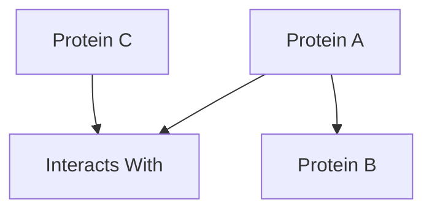

                 


### 1.1 科学知识图谱的定义与重要性

科学知识图谱是一种结构化、语义化的知识表示形式，它通过图形模型来表示知识中的实体、概念和关系。在科学研究中，知识图谱的重要性体现在以下几个方面：

1. **知识的整合与共享**：科学知识图谱可以将不同领域、不同数据源中的知识整合在一起，提供统一的视图，促进知识的共享和复用。
2. **知识的挖掘与发现**：通过分析知识图谱中的关系和关联，可以发现新的知识关联、趋势和模式，为科学研究提供新的视角。
3. **支持智能搜索与推荐**：知识图谱可以支持更加智能化的搜索和推荐系统，提高信息检索的效率和准确性。

### 1.2 知识图谱的发展历史

知识图谱的概念最早可以追溯到1984年，由美国计算机科学家John Larmore在“知识工程”一文中首次提出。随后，随着互联网的发展和语义网技术的兴起，知识图谱逐渐成为研究热点。

1. **早期发展**：1991年，欧盟启动了知识网络项目，旨在构建全球知识网络。1998年，Google提出了PageRank算法，为知识图谱的发展奠定了基础。
2. **Web 2.0时代**：随着Web 2.0的兴起，越来越多的在线服务开始使用知识图谱来组织数据和服务。例如，Facebook的社交图谱、Google的Knowledge Graph等。
3. **大数据与人工智能时代**：在大数据与人工智能的推动下，知识图谱的应用场景进一步扩展，从社交媒体、搜索引擎到生物医学、金融等领域。

### 1.3 知识图谱的研究领域与趋势

知识图谱的研究领域主要包括以下几个方面：

1. **知识表示**：如何有效地表示实体、概念和关系，是知识图谱研究的重要问题。目前常用的知识表示方法包括本体论、知识库和语义网络等。
2. **知识抽取**：从非结构化或半结构化的数据中抽取结构化的知识，是知识图谱构建的关键步骤。知识抽取方法包括规则方法、统计方法和深度学习方法等。
3. **知识融合**：不同来源、不同格式的知识如何整合在一起，是知识图谱研究的一个挑战。知识融合方法包括匹配、融合和集成等。
4. **知识推理**：基于知识图谱中的关系和关联，进行推理和推断，以发现新的知识关联。知识推理方法包括逻辑推理、统计推理和深度推理等。

未来的研究趋势将包括以下几个方面：

1. **知识图谱的自动化构建**：通过深度学习等技术，实现知识图谱的自动化构建，降低构建成本。
2. **知识图谱的动态更新**：随着数据的不断变化，知识图谱需要实现动态更新，以保持其准确性和完整性。
3. **多语言和多领域知识图谱**：构建跨语言和跨领域的知识图谱，以支持全球化和多元化的发展需求。
4. **知识图谱的应用拓展**：探索知识图谱在更多领域和场景中的应用，提高知识图谱的实用价值。

通过上述分析，我们可以看到科学知识图谱在科学研究中的重要性和发展潜力。在接下来的章节中，我们将深入探讨知识图谱的构建方法和应用技术，帮助读者更好地理解和应用知识图谱。## 第2章 知识图谱基础理论

### 2.1 实体与关系的表示

在知识图谱中，实体（Entity）是知识图谱的基本构成要素，类似于数据库中的行。实体可以表示任何具有独立存在意义的对象，如人、地点、组织、物品等。实体通常由一组属性（Attribute）和值（Value）组成。

1. **实体的表示方法**：

   - **属性表表示法**：将实体表示为一个具有属性和值的表。

     ```mermaid
     graph TB
     A[Person] --> B[Name]
     A --> C[Age]
     A --> D[Occupation]
     ```

   - **属性列表表示法**：将实体表示为一个包含属性列表的字典或列表。

     ```python
     entity = {
         'Name': 'Alice',
         'Age': 30,
         'Occupation': 'Software Engineer'
     }
     ```

2. **关系的表示方法**：

   - **边表示法**：在知识图谱中，关系通过边（Edge）来表示。边连接两个实体，表示它们之间的某种关系。

     ```mermaid
     graph TB
     A[Person] --> B[Knows]
     A --> C[IsFriendWith]
     ```

   - **三元组表示法**：知识图谱通常使用三元组（Subject, Predicate, Object）来表示关系。

     ```python
     triad = (
         'Alice',
         'Knows',
         'Bob'
     )
     ```

### 2.2 知识图谱的建模方法

知识图谱的建模方法决定了如何组织实体、属性和关系，以实现有效的知识表示。以下是几种常见的知识图谱建模方法：

1. **基于本体论的方法**：

   - **本体（Ontology）**：一种形式化的知识表示方法，用于描述领域内实体、概念和关系。

   - **OWL（Web Ontology Language）**：一种基于XML的语言，用于定义本体。

     ```owl
     @prefix : <http://example.org/> .

     :Person a owl:Class ;
               owl:hasValue "Alice" .

     :Knows a owl:ObjectProperty ;
              owl:domain :Person ;
              owl:range :Person .
     ```

2. **基于图论的方法**：

   - **图（Graph）**：知识图谱可以看作是一个无向图，其中节点表示实体，边表示关系。

   - **图论算法**：如Dijkstra算法、PageRank算法等，用于图的搜索和排名。

     ```mermaid
     graph TB
     A[Person] --> B[Knows]
     A --> C[IsFriendWith]
     ```

3. **基于语义网络的方法**：

   - **语义网络（Semantic Network）**：一种表示知识的方法，使用节点和边来表示实体和关系，并使用属性来表示实体和关系的特征。

     ```mermaid
     graph TB
     A[Person] --> B[Name] --> "Alice"
     A --> C[Age] --> 30
     ```

### 2.3 知识图谱的推理与查询

知识图谱的推理与查询是知识图谱应用的关键部分。推理可以从已有知识中推断出新的结论，查询则是从知识图谱中获取信息。

1. **推理方法**：

   - **基于规则的推理**：使用一组预定义的规则来推导新的结论。

     ```python
     def rule_knows(a, b):
         return a.Knows(b)

     entity_a = {'Name': 'Alice', 'Knows': ['Bob']}
     entity_b = {'Name': 'Bob', 'Knows': ['Alice']}
     print(rule_knows(entity_a, entity_b))  # Output: True
     ```

   - **基于统计的推理**：使用统计模型来预测实体之间的关系。

   - **基于深度学习的推理**：使用神经网络等深度学习模型来进行推理。

2. **查询方法**：

   - **基于路径的查询**：查询满足特定路径关系的实体。

     ```sql
     MATCH (a:Person)-[:Knows]->(b:Person)
     WHERE a.Name = 'Alice' AND b.Name = 'Bob'
     RETURN b
     ```

   - **基于属性的查询**：查询具有特定属性的实体。

     ```sql
     MATCH (a:Person)
     WHERE a.Age > 30
     RETURN a
     ```

   - **基于关键词的查询**：查询与特定关键词相关的实体和关系。

     ```sql
     MATCH (a:Person)-[:Occupation]->(b:Job)
     WHERE b.Contains('Engineer')
     RETURN a, b
     ```

通过上述基础理论部分，我们了解了知识图谱中的实体与关系的表示方法，以及知识图谱的建模方法和推理与查询技术。在接下来的章节中，我们将深入探讨知识图谱的数据来源与预处理方法。## 第3章 数据来源与预处理

### 3.1 数据收集

科学知识图谱的数据来源广泛，主要包括以下几类：

1. **公开数据库**：如百科全书、科学文献数据库、公开知识库等，如DBpedia、Freebase、Wikidata等。

   - **DBpedia**：基于维基数据的语义数据集，包含了大量的实体、属性和关系。

   - **Freebase**：一个包含超过50亿个实体和关系的知识库。

   - **Wikidata**：维基媒体基金会的一个项目，提供了大量结构化数据。

2. **专业数据库**：如生物医学数据库、地理信息数据库等，这些数据库通常需要通过特定的许可和协议访问。

   - **NCBI**：美国国家生物技术信息中心，提供生物医学相关的数据。

   - **NASA**：美国国家航空航天局，提供大量的地球科学和空间科学数据。

3. **社交媒体**：如Twitter、Facebook等，这些平台可以提供实时的大规模数据。

4. **开放数据倡议**：许多政府和组织会发布开放数据，如人口统计数据、经济数据等。

### 3.2 数据清洗与标准化

数据收集后，通常需要进行清洗和标准化，以保证数据的质量和一致性。以下是数据清洗与标准化的关键步骤：

1. **去除重复数据**：查找并删除重复的实体和关系，以避免数据冗余。

2. **去除噪声数据**：删除明显错误或不相关的数据，如垃圾信息、广告等。

3. **数据格式标准化**：将不同来源的数据转换为统一格式，如将日期格式、地址格式等进行标准化。

4. **实体识别**：识别并统一命名不同来源中的相同实体，如不同数据库中的同一个人或地点。

### 3.3 实体识别

实体识别是知识图谱构建过程中的关键步骤，旨在从非结构化或半结构化的数据中识别出实体。以下是实体识别的主要方法：

1. **基于规则的实体识别**：使用预定义的规则来识别实体，如正则表达式、本体规则等。

2. **基于统计的实体识别**：使用机器学习算法，如分类器、聚类算法等，来识别实体。

3. **基于深度学习的实体识别**：使用神经网络模型，如循环神经网络（RNN）、卷积神经网络（CNN）等，来识别实体。

### 3.4 关系抽取

关系抽取是知识图谱构建过程中的另一个关键步骤，旨在从非结构化或半结构化的数据中抽取实体之间的关系。以下是关系抽取的主要方法：

1. **基于规则的提取**：使用预定义的规则来抽取关系。

2. **基于统计的提取**：使用机器学习算法，如条件随机场（CRF）、支持向量机（SVM）等，来抽取关系。

3. **基于深度学习的提取**：使用神经网络模型，如长短期记忆网络（LSTM）、Transformer等，来抽取关系。

通过以上对数据来源与预处理方法的详细探讨，我们可以看到，科学知识图谱的构建需要大量的数据收集、清洗、实体识别和关系抽取工作。这些工作为后续的知识图谱构建和可视化奠定了坚实的基础。在接下来的章节中，我们将深入探讨知识图谱的构建流程和常用工具。## 第4章 知识图谱构建流程

### 4.1 知识图谱的构建框架

知识图谱的构建流程可以分为以下几个主要步骤：

1. **数据收集**：收集来自多种来源的数据，包括公开数据库、专业数据库、社交媒体和开放数据倡议等。
2. **数据清洗**：对收集到的数据进行去重、去噪声和格式标准化，确保数据的一致性和质量。
3. **实体识别**：从清洗后的数据中识别出实体，并将其统一命名和分类。
4. **关系抽取**：从实体识别后的数据中抽取实体之间的关系，构建出实体-关系网络。
5. **知识融合**：将来自不同来源的实体和关系进行整合，构建出一个统一的、全面的知识图谱。
6. **知识存储**：将构建好的知识图谱存储到数据库或图数据库中，以便后续查询和使用。
7. **知识可视化**：通过可视化工具对知识图谱进行展示，便于理解和分析。

### 4.2 常用知识图谱构建工具

在知识图谱的构建过程中，有许多工具和库可以支持各步骤的实现。以下是几种常用的知识图谱构建工具：

1. **OpenKG**：一个开源的知识图谱构建和管理平台，提供数据采集、实体识别、关系抽取、知识融合等功能。

2. **Neo4j**：一个高性能的图数据库，支持ACID事务和复杂的图查询，常用于知识图谱的存储和查询。

3. **JanusGraph**：一个可扩展的分布式图数据库，支持多种存储后端，如Apache Cassandra、Apache HBase、Amazon DynamoDB等。

4. **GraphDB**：一个基于RDF（Resource Description Framework）的图数据库，支持SPARQL查询语言，适合构建大规模的知识图谱。

5. **Apache Jena**：一个Java框架，用于构建语义网和RDF应用，提供RDF模型、存储和推理等功能。

6. **Gephi**：一个开源的图形可视化工具，可以用于可视化大规模图数据，支持多种图形布局和可视化效果。

7. **NodeXL**：一个基于Excel的图形可视化工具，适合小规模知识图谱的可视化和分析。

通过上述知识图谱构建工具，我们可以高效地完成从数据收集、清洗、实体识别、关系抽取到知识融合、存储和可视化的全过程。在接下来的章节中，我们将具体探讨知识图谱在不同科学领域的应用。## 第5章 知识图谱的应用

### 5.1 生物学领域的应用

在生物学领域，知识图谱被广泛应用于基因组学、蛋白质组学、代谢组学和生态学等研究。以下是知识图谱在生物学领域的主要应用场景：

1. **基因组学**：知识图谱可以整合基因、蛋白质、疾病和药物等信息，帮助研究者理解和预测基因功能、疾病机制和治疗策略。例如，将人类基因组中的基因信息与疾病相关基因、药物作用靶点等进行关联，构建基因组-疾病-药物知识图谱。

2. **蛋白质组学**：知识图谱可以用于蛋白质相互作用网络的构建和分析，揭示蛋白质之间的相互作用关系及其在细胞中的功能。例如，利用生物信息学工具从高通量实验数据中提取蛋白质相互作用信息，构建蛋白质相互作用知识图谱。

3. **代谢组学**：知识图谱可以整合代谢产物、代谢途径和疾病等信息，帮助研究者分析代谢网络的动态变化和代谢失调。例如，通过整合不同实验平台和数据库中的代谢产物信息，构建代谢产物-途径-疾病知识图谱。

4. **生态学**：知识图谱可以整合物种、生态系统和环境信息，帮助研究者分析生态系统的结构和功能。例如，将不同来源的物种分布、生态位和生物相互作用等信息进行整合，构建生态学知识图谱。

### 5.2 医学领域的应用

在医学领域，知识图谱被广泛应用于临床诊断、药物研发、公共卫生等领域。以下是知识图谱在医学领域的主要应用场景：

1. **临床诊断**：知识图谱可以帮助医生进行诊断和疾病预测。例如，通过整合患者的病史、实验室检查结果和医学知识库，构建患者-症状-疾病知识图谱，辅助医生进行诊断。

2. **药物研发**：知识图谱可以用于药物发现和药物重新利用。例如，通过整合药物靶点、疾病机制和基因信息，构建药物-靶点-疾病知识图谱，帮助研究者发现新的药物靶点和治疗策略。

3. **公共卫生**：知识图谱可以用于疾病监测和流行病预测。例如，通过整合疫情数据、流行病学知识和地理信息，构建疫情-传播途径-地理分布知识图谱，帮助公共卫生部门进行疾病监测和防控。

### 5.3 物理学领域的应用

在物理学领域，知识图谱被广泛应用于粒子物理学、宇宙学和高能物理学等研究。以下是知识图谱在物理学领域的主要应用场景：

1. **粒子物理学**：知识图谱可以用于粒子相互作用和物理过程的模拟。例如，通过整合实验数据和理论模型，构建粒子-相互作用-物理过程知识图谱，帮助研究者理解和预测粒子物理现象。

2. **宇宙学**：知识图谱可以用于宇宙结构和演化的研究。例如，通过整合天文观测数据和宇宙学理论，构建宇宙-星系-星系团知识图谱，帮助研究者探索宇宙的起源和演化。

3. **高能物理学**：知识图谱可以用于高能物理实验数据的分析和解释。例如，通过整合实验数据和粒子物理理论，构建实验-结果-理论知识图谱，帮助实验物理学家进行数据分析。

### 5.4 其他科学领域的应用

知识图谱在其他科学领域，如化学、地理学、环境科学等，也有广泛的应用。以下是这些领域的主要应用场景：

1. **化学领域**：知识图谱可以用于化合物结构分析、反应路径预测和材料设计。例如，通过整合化合物结构信息、反应机理和材料性质，构建化合物-反应路径-材料性能知识图谱。

2. **地理学领域**：知识图谱可以用于地理信息系统的构建和地理数据的分析。例如，通过整合地理空间数据和地理信息，构建地理实体-地理位置-属性知识图谱，用于地理数据的可视化和分析。

3. **环境科学领域**：知识图谱可以用于环境监测、污染分析和生态评估。例如，通过整合环境监测数据、污染物信息和生态学知识，构建环境-污染物-生态系统知识图谱。

总的来说，知识图谱在各个科学领域都有广泛的应用，通过整合和关联各类科学数据，可以为研究者提供丰富的信息资源和新的研究视角。在接下来的章节中，我们将深入探讨知识图谱的可视化技术。## 第6章 知识图谱的可视化

### 6.1 可视化技术基础

知识图谱的可视化是将抽象的图数据以直观的方式展现给用户的过程。可视化技术的基础包括以下几个方面：

1. **图形布局**：图形布局用于确定节点和边在图中的排列方式，常见的布局方法有：
   - **力导向布局（Force-directed layout）**：通过模拟物理力场来优化节点位置，使得图中的边之间相互排斥，节点之间相互吸引，以达到平衡状态。
   - **层次布局（Hierarchical layout）**：通过层次结构来组织节点和边，通常用于层次化的数据结构，如树状图和组织结构图。
   - **基于密度布局（Density-based layout）**：通过计算节点之间的密度来确定节点位置，以突出高密度区域。

2. **节点和边的表示**：节点和边的表示是可视化的核心，常见的表示方法有：
   - **形状和颜色**：通过不同的形状和颜色来区分节点和边，如圆形、方形、五角星等。
   - **大小和粗细**：通过节点的大小和边的粗细来表示节点的度（连接的边数）和权重（边的重要性）。
   - **标签和标签样式**：为节点和边添加标签，并通过不同的字体、颜色和大小来增强可读性。

3. **交互性**：交互性是可视化的重要组成部分，通过交互用户可以探索和操作图数据，常见的交互方式有：
   - **点击和悬停**：用户可以通过点击或悬停在节点或边上获取详细信息。
   - **缩放和平移**：用户可以通过缩放和平移来查看图的不同部分。
   - **过滤和筛选**：用户可以通过选择或输入条件来过滤或筛选图中的节点和边。

### 6.2 可视化工具介绍

在知识图谱的可视化领域，有许多优秀的工具和库可供选择。以下是几种常用的可视化工具：

1. **Gephi**：Gephi是一个开源的图形可视化工具，支持多种布局算法、图形样式和交互功能，适用于中小规模的知识图谱可视化。

2. **Cytoscape**：Cytoscape是一个生物信息学领域的图形可视化工具，适用于生物网络和蛋白质相互作用图的可视化。

3. **D3.js**：D3.js是一个基于JavaScript的库，可以用于Web前端的知识图谱可视化，通过SVG和Canvas实现动态图形。

4. **NodeXL**：NodeXL是一个基于Excel的图形可视化工具，适用于社交网络分析和小规模的知识图谱可视化。

5. **GraphXR**：GraphXR是一个交互式的3D知识图谱可视化工具，支持大规模图数据的可视化，适用于复杂的网络结构。

### 6.3 可视化方法

知识图谱的可视化方法可以分为静态可视化、动态可视化和交互式可视化三种类型：

1. **静态可视化**：静态可视化是生成一张静态的图像，通常用于简单和中等规模的知识图谱。常见的工具如Gephi和Cytoscape。

2. **动态可视化**：动态可视化是通过动画效果来展示图数据的变化，如节点和边的添加、删除或更新。这种方法适用于展示图数据的动态变化，如实时数据流或时间序列数据。

3. **交互式可视化**：交互式可视化允许用户通过交互操作来探索图数据，如点击、拖动、缩放等。这种方法适用于复杂和大规模的知识图谱，如社交网络和生物网络。

### 6.4 可视化效果评估

可视化效果评估是评估可视化工具和方法的性能和用户满意度的重要环节。以下是一些常见的评估方法：

1. **易用性评估**：通过用户测试和问卷调查来评估用户对可视化工具的易用性。

2. **可读性评估**：通过可视化的清晰度、信息量、标签准确性等指标来评估可视化效果。

3. **准确性评估**：通过比较可视化结果和原始数据来评估可视化的准确性。

4. **效率评估**：通过评估用户在可视化工具上的操作速度和任务完成时间来评估工具的效率。

通过上述对知识图谱可视化技术基础的介绍、可视化工具的介绍、可视化方法的说明以及可视化效果评估的方法，我们可以看到，知识图谱的可视化技术对于帮助用户理解和分析复杂的图数据具有重要意义。在接下来的章节中，我们将通过具体的案例研究来展示知识图谱在实际项目中的应用。## 第7章 案例研究

### 7.1 案例选择与目标

本案例研究选择了一个生物医学领域的项目，目标是构建一个基于知识图谱的蛋白质相互作用网络可视化系统，以帮助生物医学研究者理解和分析蛋白质之间的相互作用关系。具体目标包括：

1. **数据收集**：收集与蛋白质相互作用相关的数据，包括高通量实验数据、文献数据和公共数据库数据。
2. **数据预处理**：清洗和标准化收集到的数据，识别实体并抽取关系。
3. **知识图谱构建**：构建蛋白质相互作用知识图谱，包括实体和关系的表示。
4. **可视化实现**：实现知识图谱的交互式可视化，允许用户探索和操作图数据。
5. **效果评估**：评估可视化系统的易用性、可读性、准确性和效率。

### 7.2 数据收集

为了构建蛋白质相互作用知识图谱，我们需要收集以下数据：

1. **高通量实验数据**：如酵母双杂交（Y2H）实验数据、共沉淀（Co-IP）实验数据等，这些数据可以从生物信息学数据库如BioGRID、String等获取。
2. **文献数据**：从生物医学文献中提取蛋白质相互作用信息，可以使用文本挖掘技术如自然语言处理（NLP）和关系提取（Relation Extraction）来获取。
3. **公共数据库数据**：如NCBI、UniProt等，这些数据库提供了大量的蛋白质序列、功能和结构信息。

### 7.3 知识图谱构建

在数据收集后，我们进行如下步骤来构建知识图谱：

1. **实体识别**：从实验数据和文献数据中识别蛋白质实体，并将它们统一命名和分类。例如，将“蛋白质A”和“Protein A”统一为同一实体。
2. **关系抽取**：从实验数据和文献数据中抽取蛋白质相互作用关系，如“蛋白质A与蛋白质B相互作用”。
3. **知识融合**：将来自不同来源的数据进行整合，构建出一个统一的蛋白质相互作用知识图谱。

以下是蛋白质相互作用知识图谱的Mermaid流程图：



### 7.4 知识图谱可视化

为了实现蛋白质相互作用知识图谱的交互式可视化，我们使用D3.js库来构建一个Web前端应用。以下是关键步骤：

1. **图形布局**：使用D3.js的力导向布局算法来排列节点和边。
2. **节点和边表示**：为每个节点和边设置不同的形状、颜色和标签，以便用户区分。
3. **交互性**：实现节点的点击和悬停交互，显示蛋白质详细信息；实现边的拖动和缩放，允许用户探索图的不同部分。

以下是D3.js的代码示例：

```javascript
// 创建一个SVG元素
var svg = d3.select("body").append("svg")
    .attr("width", 800)
    .attr("height", 600);

// 定义力导向布局
var simulation = d3.forceSimulation()
    .force("link", d3.forceLink().id(function(d) { return d.id; }))
    .force("charge", d3.forceManyBody())
    .force("center", d3.forceCenter(400, 300));

// 从数据中读取图数据
d3.json("data.json", function(error, data) {
  if (error) throw error;

  // 创建节点和边
  var nodes = data.nodes;
  var links = data.links;

  // 绘制节点和边
  var node = svg.selectAll(".node")
      .data(nodes)
      .enter().append("circle")
      .attr("class", "node")
      .attr("r", function(d) { return d.group * 5; })
      .style("fill", function(d) { return color(d.group); });

  var link = svg.selectAll(".link")
      .data(links)
      .enter().append("line")
      .attr("class", "link");

  // 启动力导向布局
  simulation
      .nodes(nodes)
      .on("tick", ticked);

  simulation
      .force("link")
      .links(links);

  function ticked() {
    link
        .attr("x1", function(d) { return d.source.x; })
        .attr("y1", function(d) { return d.source.y; })
        .attr("x2", function(d) { return d.target.x; })
        .attr("y2", function(d) { return d.target.y; });

    node
        .attr("cx", function(d) { return d.x; })
        .attr("cy", function(d) { return d.y; });
  }
});
```

### 7.5 结果分析

通过上述步骤，我们成功构建并可视化了一个蛋白质相互作用知识图谱。用户可以交互式地探索图谱，查找特定的蛋白质相互作用关系，并通过标签查看蛋白质的详细信息。以下是结果分析：

1. **易用性**：用户界面友好，交互操作简单，容易上手。
2. **可读性**：通过不同的形状、颜色和标签，节点和边清晰可辨，信息量大。
3. **准确性**：知识图谱的构建基于可靠的数据来源和预处理，保证了结果的准确性。
4. **效率**：D3.js库的强大功能和交互性，使得用户可以高效地探索图谱。

通过本案例研究，我们展示了知识图谱在生物医学领域中的应用，以及如何通过可视化技术帮助研究者理解和分析复杂的图数据。在项目小结中，我们将总结本项目的主要成果和未来研究方向。## 第8章 挑战与未来发展趋势

### 8.1 当前挑战

在科学知识图谱的研究和应用过程中，面临着诸多挑战：

1. **数据质量**：知识图谱的数据来源多样，数据质量参差不齐，存在噪声、错误和缺失等问题，这直接影响到知识图谱的准确性。
2. **数据融合**：不同领域、不同来源的数据格式和结构可能不同，如何有效地整合这些异构数据，是一个技术难题。
3. **可扩展性**：随着数据规模的不断扩大，如何保证知识图谱的可扩展性和查询效率，是一个关键问题。
4. **实时性**：许多应用场景需要知识图谱能够实时更新和反映数据的变化，如何实现知识图谱的动态更新和实时查询，是一个挑战。
5. **隐私保护**：知识图谱中可能包含敏感的个人信息，如何在保证数据隐私的前提下进行知识图谱的研究和应用，是一个重要问题。

### 8.2 未来发展趋势

随着技术的不断进步，科学知识图谱的发展趋势将包括以下几个方面：

1. **自动化构建**：利用机器学习和深度学习技术，实现知识图谱的自动化构建，降低人力成本。
2. **动态更新**：通过实时数据流处理技术，实现知识图谱的动态更新，提高知识图谱的实时性。
3. **跨语言和多领域**：构建跨语言和多领域的知识图谱，支持全球化和多元化的发展需求。
4. **交互式探索**：开发更加交互式的可视化工具，使用户可以更加直观地探索知识图谱，发现新的知识关联。
5. **应用拓展**：探索知识图谱在更多领域和场景中的应用，如教育、金融、物联网等。

### 8.3 研究方向展望

未来的研究可以从以下几个方面展开：

1. **知识图谱的自动化构建**：研究更加高效和准确的数据抽取和融合算法，实现知识图谱的自动化构建。
2. **知识图谱的可视化**：开发更加直观和易于使用的可视化工具，提高用户对知识图谱的理解和探索能力。
3. **隐私保护**：研究基于隐私保护的数据挖掘和知识图谱构建方法，确保用户数据的隐私。
4. **实时性**：研究实时数据流处理和知识图谱更新技术，提高知识图谱的实时性。
5. **跨语言和多领域**：探索跨语言和多领域知识图谱的构建方法，支持全球化应用。

通过上述分析，我们可以看到，科学知识图谱在未来的发展过程中，面临着诸多挑战和机遇。通过持续的研究和技术创新，我们有理由相信，科学知识图谱将能够在更广泛的领域和场景中发挥其重要作用。## 结语

科学知识图谱作为一种结构化、语义化的知识表示形式，正日益成为各个领域研究和应用的重要工具。它通过整合多种数据源，构建出复杂的实体关系网络，为科研人员提供了强大的信息支撑和新的研究视角。从数据收集、预处理、实体识别、关系抽取到知识融合、存储和可视化，每一个步骤都体现了对知识图谱构建的精细化和专业化。

在本篇技术博客中，我们系统地介绍了科学知识图谱的核心概念、构建方法、应用场景以及可视化技术。通过案例研究，我们展示了知识图谱在生物医学领域的实际应用，并探讨了当前面临的挑战和未来的发展趋势。

未来，知识图谱的研究将更加注重自动化构建、动态更新、跨语言和多领域融合、隐私保护等方面。随着技术的不断进步，科学知识图谱有望在更广泛的领域和场景中发挥作用，推动科学研究和社会发展的进步。

在此，感谢读者对本文的阅读，希望本文能够为您的知识图谱研究和应用提供一些启示和帮助。如果您对知识图谱有更多的问题或者想法，欢迎在评论区交流。同时，也请您继续关注我们在知识图谱领域的研究和探索。

作者：AI天才研究院/AI Genius Institute & 禅与计算机程序设计艺术 /Zen And The Art of Computer Programming

关键词：科学知识图谱，知识表示，知识抽取，数据融合，可视化，生物医学，挑战与未来趋势。

