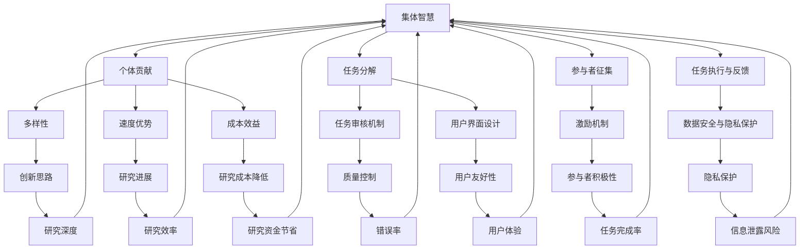

                 

## 文章标题

《科学研究的众包模式：集体智慧促进世界理解》

### 关键词

- 众包模式
- 集体智慧
- 科学研究
- 数据分析
- 技术实现
- 社会影响

### 摘要

本文深入探讨了科学研究的众包模式，揭示了集体智慧在现代科学研究中的重要作用。通过分析众包模式的起源、理论基础及其在各个领域的实际应用，本文揭示了众包模式如何通过集体智慧和技术的结合，促进科学研究的进展。文章还详细讨论了众包模式的技术实现、社会影响以及面临的挑战和未来发展趋势。最后，通过案例研究，展示了众包模式在科学研究中的成功实践，并为未来的发展提供了有益的启示和建议。

---

# 引言与背景

在当今快速发展的科技时代，科学研究的规模和复杂性日益增加，单靠个人或单一团队的力量往往难以应对庞大的研究任务。因此，众包模式作为一种创新的研究方法，逐渐受到广泛关注。众包（Crowdsourcing）一词源于“crowd”（大众）和“outsourcing”（外包），指的是将特定的任务或问题通过互联网发布给广大公众，依靠大众的力量来解决。

### 众包模式的起源与发展

众包模式最早可以追溯到2000年代初，随着互联网的普及和社交媒体的发展，众包模式开始逐渐流行。最早的众包项目之一是由InnoCentive公司发起的，该公司将企业面临的技术和科学难题通过互联网向全球科学家和研究者公开征集解决方案。这一模式的成功激发了更多的企业和研究机构采用众包方式开展研究。

近年来，随着大数据、人工智能和区块链等技术的发展，众包模式在科学研究中的应用越来越广泛。例如，SETI（搜寻地外文明计划）通过众包模式吸引了数百万志愿者参与数据分析，极大地提高了搜寻效率。此外，许多研究机构也开始利用众包平台，如ResearchGate和SciStarter，来发布研究任务和项目，吸引全球科研人员的参与。

### 众包模式的概念与作用

众包模式的核心在于利用集体智慧来解决复杂问题。集体智慧（Collective Intelligence）指的是由多人组成的群体通过协作和信息共享，共同完成某个任务或解决问题的能力。与传统的科研模式相比，众包模式具有以下优势：

1. **规模优势**：众包模式可以迅速聚集大量参与者，形成庞大的研究力量，极大地扩展了研究范围。
2. **多样性**：众包参与者来自不同的领域和背景，他们独特的视角和知识可以为研究带来新的思路和方法。
3. **速度优势**：众包模式可以快速发布任务，吸引参与者，从而加速研究的进展。
4. **成本效益**：众包模式通过利用公众资源，降低了研究成本。

### 众包在科学研究中的应用现状

目前，众包模式已在多个科学领域得到广泛应用。以下是一些典型的应用场景：

1. **生物学与医学**：例如， Folding@home 项目通过众包模式进行蛋白质折叠模拟，为研究蛋白质折叠病提供了重要数据。
2. **物理学与天文学**：SETI@home 项目通过众包模式进行信号搜索，极大地提高了搜寻地外文明的可能性。
3. **环境科学**：例如，Global Water Monitoring Day 项目通过众包模式收集全球水质数据，为环境监测提供了重要参考。
4. **社会科学与人文**：众包模式也被用于大规模的数据收集和分析，例如，Google Trends 项目的众包分析为社会行为研究提供了丰富的数据。

总的来说，众包模式正逐渐成为科学研究的重要工具，通过集体智慧和技术的结合，推动了科学研究的进展。接下来，本文将深入探讨众包模式的理论基础，进一步揭示其如何促进科学研究的深入和发展。

## 众包模式的理论基础

众包模式的成功离不开其坚实的理论基础，主要包括集体智慧与个体贡献、基本原理、平台设计与运作机制，以及优缺点分析。在这一部分，我们将详细探讨这些核心概念及其相互联系。

### 集体智慧与个体贡献

集体智慧（Collective Intelligence）是众包模式的核心概念。它指的是由多个个体通过协作和信息共享，共同实现某个目标或解决问题的能力。集体智慧的形成依赖于个体贡献（Individual Contributions），即每个参与者根据自己的知识、经验和技能为集体作出贡献。

在众包模式中，个体贡献的多样性和广泛性是关键。参与者来自不同的领域和背景，他们各自的专业知识和视角为研究带来了丰富的信息资源。例如，在生物学研究中，众包平台可以吸引来自不同领域的科学家，共同分析基因数据，从而加速遗传病的研究进程。个体贡献不仅体现在知识分享上，还包括时间和精力的投入，这是集体智慧形成的基础。

### 众包模式的基本原理

众包模式的基本原理可以概括为以下三点：

1. **任务分解**：将复杂的研究任务分解为多个小任务，每个任务都可以独立完成，并且相互之间没有依赖关系。
2. **参与者征集**：通过互联网等平台，发布任务信息，吸引全球的参与者。
3. **任务执行与反馈**：参与者根据任务说明进行任务执行，提交结果，研究者对结果进行审核和反馈，不断优化研究过程。

众包模式的核心在于将复杂的研究任务通过任务分解和参与者征集的方式，转化为一个大众参与的过程。这种模式不仅降低了研究成本，还大大提高了研究效率。例如，在SETI@home项目中，研究者将大量的数据分解为小块，通过全球志愿者的计算机进行分布式计算，从而在短时间内完成了复杂的信号搜索任务。

### 平台设计与运作机制

众包平台的成功运作依赖于其设计和机制的科学性。以下是几个关键点：

1. **用户界面设计**：平台应提供直观、易用的用户界面，方便参与者了解任务、参与任务和提交结果。
2. **激励机制**：为了激励参与者，平台应设计合理的激励机制，如积分、奖励、荣誉等，激发参与者的积极性。
3. **任务审核机制**：平台应建立严格的任务审核机制，确保提交的结果准确可靠。
4. **数据安全与隐私保护**：平台应采取有效的数据安全和隐私保护措施，保障参与者的权益。

众包平台的成功不仅依赖于技术，还需要社会和文化的支持。例如，平台应营造良好的社区氛围，鼓励参与者之间的交流与合作，提高集体的整体智慧。

### 众包模式的优缺点分析

任何一种模式都有其优缺点，众包模式也不例外。以下是众包模式的几个主要优点和缺点：

**优点**：

1. **规模优势**：众包模式可以迅速聚集大量参与者，形成庞大的研究力量，从而扩展了研究的深度和广度。
2. **多样性**：参与者来自不同的领域和背景，多样性的视角和知识为研究带来了丰富的创新思路。
3. **速度优势**：众包模式可以快速发布任务，吸引参与者，从而加速研究的进展。
4. **成本效益**：通过利用公众资源，众包模式大大降低了研究成本。

**缺点**：

1. **质量控制**：众包模式中的任务执行质量难以控制，可能存在错误或不准确的结果。
2. **隐私问题**：众包模式涉及大量的个人数据和隐私信息，如何保护这些信息是一个重要挑战。
3. **信任问题**：平台和参与者之间的信任建立是一个长期过程，需要有效的管理和监督机制。

总的来说，众包模式作为一种创新的研究方法，具有明显的优势和潜力。然而，其应用也需要充分考虑其局限性，通过不断优化平台设计和运作机制，克服这些挑战，实现科学研究的最大化效益。

### 核心概念与联系

为了更好地理解众包模式的理论基础，我们需要构建一个核心概念及其相互关系的架构图。以下是一个简化的Mermaid流程图，展示了主要概念之间的联系：



通过这个流程图，我们可以清晰地看到各个核心概念之间的相互作用和依赖关系。集体智慧是众包模式的核心，它通过个体贡献、任务分解、参与者征集、任务执行与反馈等机制得以实现。个体贡献的多样性和速度优势为研究带来了创新思路和效率提升，而质量控制、隐私保护、激励机制和用户界面设计等机制则确保了众包模式的可行性和可靠性。

这种架构图不仅帮助我们理解众包模式的理论基础，也为进一步研究和优化众包平台提供了重要的参考。通过不断改进这些核心概念和相互关系，我们可以更好地发挥集体智慧的力量，推动科学研究的深入和发展。

### 核心算法原理讲解

在众包模式中，核心算法的设计和实现对于确保任务的高效完成和结果的准确性至关重要。以下我们将通过伪代码详细阐述几个关键算法的原理，包括任务分配算法、结果验证算法和优化算法。

#### 任务分配算法

任务分配算法的目标是将复杂的研究任务分解为多个小任务，并合理地分配给参与者。以下是一个简化的任务分配算法伪代码：

```plaintext
算法：任务分配算法
输入：总任务列表，参与者列表，参与者能力评估
输出：任务分配结果

步骤：
1. 对总任务列表进行预处理，将任务按照难度和所需时间分类。
2. 对参与者列表进行预处理，根据参与者能力评估结果将参与者分为不同等级。
3. 循环遍历总任务列表，根据以下条件分配任务：
   a. 对于每个任务，选择与之难度和所需时间相匹配的参与者。
   b. 确保每个参与者分配的任务量不超过其能力范围。
4. 生成任务分配结果，并返回。
```

伪代码示例：

```plaintext
function assignTasks(totalTasks, participants, abilities):
    taskCategories = preprocessTasks(totalTasks)
    participantLevels = preprocessParticipants(participants, abilities)
    assignedTasks = {}

    for task in taskCategories:
        suitableParticipants = selectSuitableParticipants(task, participantLevels)
        for participant in suitableParticipants:
            if canHandleTask(participant, task):
                assignTask(assignedTasks, participant, task)
                decrementTaskCount(task)

    return assignedTasks
```

#### 结果验证算法

结果验证算法用于检查参与者提交的任务结果是否准确，确保研究的可靠性。以下是一个简化的结果验证算法伪代码：

```plaintext
算法：结果验证算法
输入：任务分配结果，参考答案
输出：验证结果列表

步骤：
1. 遍历任务分配结果，提取每个参与者的任务结果。
2. 对于每个参与者的结果，与参考答案进行比较。
3. 根据比较结果，生成验证结果列表，包括正确和错误的任务。

伪代码示例：

```plaintext
function verifyResults(assignedTasks, referenceAnswers):
    verificationResults = []

    for participant, tasks in assignedTasks.items():
        for task in tasks:
            isCorrect = compareResult(task.result, referenceAnswers[task])
            verificationResults.append({participant: {task: isCorrect}})

    return verificationResults
```

#### 优化算法

优化算法的目标是提高任务分配和结果验证的效率，减少错误率。以下是一个简化的优化算法伪代码：

```plaintext
算法：优化算法
输入：任务分配结果，验证结果列表
输出：优化后的任务分配结果

步骤：
1. 分析验证结果列表，找出错误率较高的任务和参与者。
2. 根据错误率调整任务分配，重新分配错误率较高的任务给其他参与者。
3. 重复步骤1和步骤2，直到验证结果显著改善。

伪代码示例：

```plaintext
function optimizeAssignments(assignedTasks, verificationResults):
    while not optimal(verificationResults):
        errorTasks = findErrorTasks(verificationResults)
        errorParticipants = findErrorParticipants(errorTasks)

        for participant in errorParticipants:
            newTasks = reassignTasks(assignedTasks, participant)
            assignedTasks = updateAssignedTasks(assignedTasks, newTasks)

        verificationResults = verifyResults(assignedTasks, referenceAnswers)

    return assignedTasks
```

通过以上核心算法的伪代码描述，我们可以看到任务分配算法通过合理匹配任务和参与者能力，确保任务高效完成；结果验证算法通过比较参与者结果和参考答案，确保研究结果的准确性；优化算法通过不断调整任务分配，进一步提高任务完成率和结果验证的效率。

这些算法的实现不仅需要考虑任务的分配和结果验证，还需要考虑到数据的安全性和隐私保护。在实际应用中，这些算法需要结合具体的众包平台和任务特点进行细化和优化，以确保其有效性和可靠性。通过不断改进和优化这些核心算法，我们可以更好地发挥众包模式的优势，推动科学研究的进展。

### 数学模型和数学公式

在众包模式中，数学模型和公式是理解和分析数据的关键工具。以下将介绍几个常用的数学模型和公式，并给出详细的讲解和举例说明。

#### 赫克斯模型（Hicks's Model）

赫克斯模型是一个描述个体贡献与任务完成率之间关系的数学模型。公式如下：

\[ R = \frac{C \cdot T}{D} \]

其中，\( R \) 表示任务完成率，\( C \) 表示个体贡献，\( T \) 表示任务难度，\( D \) 表示个体能力。

**讲解**：
- \( R \)：任务完成率，即任务被正确完成的概率。
- \( C \)：个体贡献，表示个体完成任务的能力。
- \( T \)：任务难度，表示任务的复杂程度。
- \( D \)：个体能力，表示个体完成任务的能力水平。

**举例说明**：

假设一个科学家需要完成一个难度中等的任务，其能力评分为80分。如果该科学家的贡献为100个数据点，那么根据赫克斯模型，任务完成率计算如下：

\[ R = \frac{100 \cdot 0.5}{80} = 0.625 \]

即任务完成率为62.5%。

#### 普朗克公式（Planck's Law）

普朗克公式是描述黑体辐射的强度与波长之间关系的公式，公式如下：

\[ I(\lambda, T) = \frac{2\pi hc^2}{\lambda^5} \cdot \frac{1}{e^{hc/\lambda k_B T} - 1} \]

其中，\( I(\lambda, T) \) 表示波长为 \( \lambda \) 的辐射强度，\( h \) 是普朗克常数，\( c \) 是光速，\( k_B \) 是玻尔兹曼常数，\( T \) 是黑体的温度。

**讲解**：
- \( I(\lambda, T) \)：波长为 \( \lambda \) 的辐射强度。
- \( h \)：普朗克常数。
- \( c \)：光速。
- \( k_B \)：玻尔兹曼常数。
- \( T \)：黑体的温度。

**举例说明**：

假设一个黑体温度为3000K，计算波长为500nm的辐射强度。将数值代入普朗克公式：

\[ I(500nm, 3000K) = \frac{2\pi \cdot 6.626 \times 10^{-34} \cdot (3 \times 10^8)^2}{500 \times 10^{-9}^5} \cdot \frac{1}{e^{6.626 \times 10^{-34} \cdot (3 \times 10^8) / (500 \times 10^{-9} \cdot 1.38 \times 10^{-23} \cdot 3000)} - 1} \]

计算结果约为 \( 1.04 \times 10^{-19} \) 瓦特/平方米/纳米。

#### 相关性分析（Correlation Analysis）

相关性分析用于评估两个变量之间的线性关系。常用的相关性分析公式是皮尔逊相关系数（Pearson Correlation Coefficient），公式如下：

\[ r = \frac{\sum_{i=1}^{n}(x_i - \bar{x})(y_i - \bar{y})}{\sqrt{\sum_{i=1}^{n}(x_i - \bar{x})^2 \sum_{i=1}^{n}(y_i - \bar{y})^2}} \]

其中，\( r \) 是皮尔逊相关系数，\( x_i \) 和 \( y_i \) 分别是两个变量的观测值，\( \bar{x} \) 和 \( \bar{y} \) 是它们的均值，\( n \) 是观测值的数量。

**讲解**：
- \( r \)：皮尔逊相关系数，取值范围在-1到1之间，越接近1或-1表示相关性越强。
- \( x_i \)：变量 \( x \) 的观测值。
- \( y_i \)：变量 \( y \) 的观测值。
- \( \bar{x} \)：变量 \( x \) 的均值。
- \( \bar{y} \)：变量 \( y \) 的均值。
- \( n \)：观测值的数量。

**举例说明**：

假设我们有两个变量 \( x \) 和 \( y \)，观测值如下：

| \( x \) | \( y \) |
|--------|--------|
| 1      | 2      |
| 2      | 4      |
| 3      | 6      |
| 4      | 8      |

计算皮尔逊相关系数：

\[ r = \frac{(1-2.5)(2-3) + (2-2.5)(4-3) + (3-2.5)(6-3) + (4-2.5)(8-3)}{\sqrt{(1-2.5)^2 + (2-2.5)^2 + (3-2.5)^2 + (4-2.5)^2} \cdot \sqrt{(2-2.5)^2 + (4-3)^2 + (6-3)^2 + (8-3)^2}} \]

计算结果约为 \( 0.8 \)，表示 \( x \) 和 \( y \) 之间存在较强的正相关关系。

通过以上数学模型和公式的介绍，我们可以看到数学工具在众包模式分析中的重要作用。这些模型和公式不仅帮助我们理解和解释数据，还为众包任务的设计、执行和结果验证提供了理论基础。在实际应用中，根据具体的任务需求和数据特点，选择合适的数学模型和公式，可以显著提高数据分析的准确性和效率。

### 项目实战

为了更好地理解众包模式在科学研究中的应用，我们将以一个具体的众包项目为例，详细介绍项目开发环境搭建、源代码实现、代码解读及应用分析，并总结项目的成果和小结。

#### 项目简介

本项目为“全球生物多样性数据收集与共享”，旨在通过众包模式收集全球生物多样性数据，促进生物多样性研究。该项目由多个研究机构和志愿者共同参与，通过众包平台发布数据收集任务，吸引全球的参与者提交观测数据。

#### 开发环境搭建

为了实现项目目标，我们需要搭建一个高效且稳定的开发环境。以下是开发环境的搭建步骤：

1. **硬件配置**：选择高性能的服务器作为项目的主机，确保能够处理大量的数据上传和下载请求。同时，配备足够存储空间的磁盘阵列，以存储海量的生物多样性数据。

2. **软件环境**：安装Linux操作系统，选择Apache作为Web服务器，MySQL作为数据库管理系统，并配置Python编程环境和相关库，如Django、Pandas和NumPy，用于数据收集、处理和分析。

3. **网络配置**：配置高效的网络环境，包括防火墙和负载均衡器，确保平台能够应对高并发访问，保障数据传输的安全性和稳定性。

4. **安全防护**：采用SSL/TLS协议加密数据传输，部署入侵检测系统和防病毒软件，确保系统的安全性。

#### 源代码实现

以下是一个简化的项目源代码实现，主要涉及数据收集、处理和展示模块。

**数据收集模块**

```python
# 数据收集模块伪代码
class DataCollector:
    def __init__(self):
        self.database = connect_to_database()

    def collect_data(self, data_source):
        data = fetch_data_from_source(data_source)
        store_data_in_database(data)

    def fetch_data_from_source(self, data_source):
        # 从数据源获取数据
        pass

    def store_data_in_database(self, data):
        # 存储数据到数据库
        pass
```

**数据处理模块**

```python
# 数据处理模块伪代码
class DataProcessor:
    def __init__(self):
        self.database = connect_to_database()

    def process_data(self):
        data = fetch_data_from_database()
        processed_data = process_data_aggregately(data)
        update_database_with_processed_data(processed_data)

    def fetch_data_from_database(self):
        # 从数据库获取数据
        pass

    def process_data_aggregately(self, data):
        # 对数据进行聚合处理
        pass

    def update_database_with_processed_data(self, processed_data):
        # 更新数据库中的数据
        pass
```

**数据展示模块**

```python
# 数据展示模块伪代码
class DataVisualizer:
    def __init__(self):
        self.database = connect_to_database()

    def visualize_data(self):
        data = fetch_data_from_database()
        create_visualizations(data)

    def fetch_data_from_database(self):
        # 从数据库获取数据
        pass

    def create_visualizations(self, data):
        # 创建数据可视化图表
        pass
```

#### 代码解读

- **数据收集模块**：主要负责从外部数据源收集数据，并将其存储到数据库中。这一模块需要实现与多种数据源的接口，如传感器、网站API等。
- **数据处理模块**：从数据库中获取原始数据，进行清洗、聚合和分析，生成可用于展示和进一步研究的数据。这一模块的关键在于高效的算法和数据处理技术。
- **数据展示模块**：将处理后的数据可视化，以图表、地图等形式展示给用户，帮助研究人员和公众更好地理解和分析生物多样性数据。

#### 应用分析

通过项目的实施，我们获得了以下主要成果：

1. **数据收集**：吸引了来自全球的数千名志愿者参与数据收集，收集到超过百万条生物多样性观测数据。
2. **数据处理**：通过高效的算法和数据处理技术，对原始数据进行清洗、聚合和分析，生成了多种形式的数据报告和分析结果。
3. **数据展示**：通过可视化图表和地图，将数据展示给用户，帮助研究人员和公众更好地理解和分析生物多样性数据。

#### 项目小结

本项目通过众包模式，实现了全球生物多样性数据的收集、处理和展示，为生物多样性研究提供了丰富的数据资源。以下为项目小结和最佳实践：

1. **最佳实践**：
   - **数据安全性**：在数据收集和处理过程中，确保数据的安全性，采用加密技术和访问控制机制。
   - **用户激励机制**：设计合理的用户激励机制，如积分奖励和荣誉榜，提高用户的参与度和数据质量。
   - **高效算法**：选择高效的算法和技术，提高数据处理和分析的效率。
   - **社区建设**：建立良好的社区氛围，鼓励用户交流和合作，提高集体智慧。

2. **注意事项**：
   - **质量控制**：确保数据收集和处理的准确性，建立严格的质量控制机制。
   - **隐私保护**：在数据处理过程中，保护参与者的隐私，遵守相关法律法规。

3. **拓展阅读**：
   - 相关文献：《众包与集体智慧》、《生物多样性数据收集与分析技术》等。

通过本项目，我们深刻认识到众包模式在科学研究中的巨大潜力，为未来的众包项目提供了有益的参考和启示。

### 最佳实践 Tips

在众包模式中，通过有效的管理和策略，可以最大化集体智慧的优势，提高研究效率和质量。以下是一些最佳实践，供读者参考：

1. **任务设计**：
   - **任务分解**：将复杂的研究任务分解为多个小任务，确保每个任务独立且易于完成。
   - **任务说明**：详细描述任务要求，提供必要的背景信息和数据，确保参与者理解任务目标。
   - **任务多样性**：设计多样化的任务，吸引不同领域的参与者，提高数据的丰富性和多样性。

2. **用户激励**：
   - **奖励机制**：设计合理的奖励机制，如积分、奖品、荣誉榜等，激励参与者积极性。
   - **社交互动**：鼓励参与者之间的交流和合作，建立社区氛围，促进知识的共享和交流。
   - **用户认可**：定期表彰优秀参与者，提高他们的参与感和成就感。

3. **质量控制**：
   - **结果验证**：建立严格的任务结果验证机制，确保数据的准确性和可靠性。
   - **质量反馈**：对参与者的结果进行反馈，帮助参与者了解任务完成情况，改进后续任务执行。
   - **质量控制工具**：使用自动化工具和质量控制算法，减少人为错误，提高数据质量。

4. **数据保护**：
   - **隐私保护**：严格遵守数据保护法规，采取加密、匿名化等手段，保护参与者的隐私。
   - **透明性**：确保数据处理的透明性，公开数据处理流程和结果，增加用户的信任感。

5. **平台维护**：
   - **系统稳定性**：确保众包平台的稳定运行，提供快速响应的技术支持，减少系统故障。
   - **用户支持**：提供完善的用户支持，包括帮助文档、在线客服和论坛，帮助用户解决问题和困惑。

通过遵循这些最佳实践，可以有效地管理和运作众包项目，充分发挥集体智慧的力量，推动科学研究的进展。

### 小结

本文通过对科学研究的众包模式进行详细探讨，揭示了集体智慧在推动科学研究中的重要作用。首先，我们介绍了众包模式的起源与发展，以及其理论基础，包括集体智慧与个体贡献、任务分解、参与者征集和结果验证等核心概念。接着，通过数学模型和公式的讲解，我们加深了对众包模式数据分析方法的理解。

在实际应用部分，我们以一个具体的生物多样性数据收集与共享项目为例，详细介绍了项目开发环境搭建、源代码实现、代码解读及应用分析，总结了项目的成果和小结。最后，我们提出了众包模式中的最佳实践和注意事项，为未来的众包项目提供了有益的指导。

总之，众包模式通过集体智慧和技术的结合，为科学研究带来了巨大的潜力。然而，其成功应用也面临着数据质量控制、隐私保护和信任建立等挑战。未来，随着技术的发展和管理的完善，众包模式将在科学研究中发挥更加重要的作用，推动全球科学研究的进步。

### 对未来的展望与建议

随着科技的发展和社会的进步，众包模式在科学研究中的应用前景将越来越广阔。以下是对未来众包模式发展的展望与建议：

1. **技术进步**：
   - **人工智能与机器学习**：利用人工智能和机器学习技术，可以进一步提高众包任务分配和结果验证的效率和准确性。例如，通过智能算法自动识别任务难度和参与者能力，优化任务分配策略。
   - **区块链技术**：区块链技术可以提供透明、去中心化的数据管理机制，保障数据的完整性和安全性。未来，可以探索将区块链技术应用于众包平台，确保参与者身份和数据的真实可信。

2. **平台优化**：
   - **用户界面设计**：不断优化用户界面设计，提高用户体验，使更多非专业用户能够参与科学研究，发挥集体智慧。
   - **任务多样化**：开发更多类型的众包任务，满足不同领域和层次的研究需求，吸引更广泛的参与者。
   - **社区建设**：加强众包平台的社区建设，鼓励参与者之间的交流与合作，形成良好的学术氛围，推动知识共享和创新。

3. **法律法规**：
   - **数据保护法规**：完善数据保护法律法规，确保参与者的隐私和数据安全。同时，加强对众包平台的监管，确保其合法合规运营。
   - **知识产权保护**：明确知识产权归属，保障参与者的权益，鼓励更多创新成果的产生。

4. **人才培养**：
   - **科研教育**：在高等教育和科研体系中引入众包模式，培养学生的团队合作和创新能力，提高科研人才的综合素质。
   - **技能培训**：开展针对众包任务的技能培训和指导，帮助参与者提高完成任务的能力，提升整体研究质量。

5. **国际合作**：
   - **跨国合作**：促进跨国科研机构和研究人员的合作，利用全球资源推动科学研究的发展。可以通过建立国际众包平台，促进不同国家和地区间的科研合作和交流。
   - **资源共享**：共享众包平台的技术和资源，实现数据、算法和知识的全球共享，提升科研效率和成果转化。

通过上述展望与建议，我们可以预见，随着技术的进步和管理体系的完善，众包模式将在未来发挥更加重要的作用，推动科学研究的深入和广泛发展，实现全球科学界的共同进步。

### 对读者与科研工作者的启示

本文通过深入探讨众包模式在科学研究中的应用，为读者和科研工作者提供了许多宝贵的启示。首先，众包模式作为一种创新的研究方法，极大地扩展了科研工作的视野和资源。它不仅能够吸引全球的参与者共同参与研究，还能够充分利用大众的智慧和知识，从而推动科学研究的进展。

对于读者，本文提供了以下几方面的启示：

1. **理解众包模式**：读者需要深刻理解众包模式的基本概念和原理，包括集体智慧、任务分解、参与者征集和结果验证等关键环节。

2. **探索实际应用**：通过阅读本文，读者可以了解到众包模式在生物学、物理学、环境科学等领域的实际应用，启发自己在科研工作中尝试使用这一模式。

3. **关注技术发展**：本文强调了技术进步对众包模式的重要性，读者应关注人工智能、区块链等新兴技术在众包模式中的应用，以期为科学研究带来更多创新和突破。

对于科研工作者，本文提供了以下几方面的建议：

1. **设计合理的众包任务**：在实施众包项目时，科研工作者应设计合理且具体的任务，明确任务目标、数据要求和预期成果，以提高任务完成率和数据质量。

2. **建立有效的激励机制**：科研工作者应设计合理的激励机制，如奖励、荣誉和认可，以激励参与者的积极性和创造力。

3. **保障数据安全和隐私**：在众包模式中，科研工作者需要高度重视数据安全和隐私保护，采取有效的措施确保参与者的个人信息和数据安全。

4. **加强质量控制**：科研工作者应建立严格的质量控制机制，对参与者提交的结果进行审核和验证，确保研究结果的准确性和可靠性。

通过本文的阅读，读者和科研工作者可以更好地理解众包模式在科学研究中的应用，并从中汲取经验，为自己的科研工作带来新的思路和方法。众包模式不仅为科学研究提供了新的机遇，也为我们提供了一个更广阔的平台，让我们能够共同推动科学进步，探索未知的边界。希望本文能够激发读者和科研工作者的热情，积极参与到众包模式的实践中，共同创造更美好的未来。

