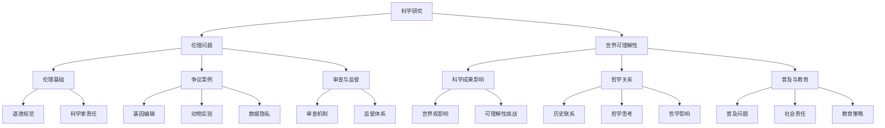

                 


### 1. 确定书名和主题
书名：《科学研究的伦理边界与世界可理解性》
主题：探讨科学研究的伦理问题以及科学成果对世界可理解性的影响。

### 2. 设计目录大纲
根据书名和主题，设计一个包括7章以上的完整目录大纲，包含以下核心内容：

1. **引言**：介绍书的基本内容、目的和结构。
2. **科学研究的伦理基础**：探讨伦理在科学研究中的重要性，科学道德规范，科学家的责任等。
3. **伦理争议案例分析**：分析科学研究中的伦理争议案例。
4. **伦理审查与监督**：介绍伦理审查机制和监督体系。
5. **科学成果与世界可理解性**：探讨科学成果对人类世界观的影响。
6. **科学与哲学的关系**：讨论科学成果与哲学思考的交互作用。
7. **科学普及与伦理教育**：探讨科学普及中的伦理问题，科学家的社会责任等。

### 3. 确定每个章节的细分内容
针对每个章节，进一步细化内容，确保每个章节都有详细的细分，符合完整性的要求。

### 4. 设计核心概念与联系
在每个章节中，设计一个或多个核心概念和联系的 Mermaid 流程图，帮助读者理解复杂的概念和关系。

### 5. 设计核心算法原理讲解
在相关章节中，使用伪代码详细阐述核心算法原理。

### 6. 设计数学模型和数学公式讲解
在相关章节中，使用 LaTeX 格式嵌入数学模型和公式，并进行详细讲解。

### 7. 设计项目实战
在相关章节中，设计实际案例，包括开发环境搭建、源代码实现和详细解释。

### 8. 审核和优化
审核目录大纲的完整性和逻辑性，确保每个章节都包含必要的核心内容，并优化大纲结构，确保其简洁性。

### 9. 确定总字数限制
确保目录大纲的总字数控制在2000字以内，同时保持内容的完整性和可读性。

---

现在，我们根据上述步骤设计出《科学研究的伦理边界与世界可理解性》这本书的完整目录大纲：

---

# 目录大纲

## 第1章 引言
### 1.1 书籍目的与结构

## 第2章 科学研究的伦理基础
### 2.1 伦理学的基本概念
### 2.2 科学研究的伦理重要性
### 2.3 科学道德规范
### 2.4 科学家的社会责任

## 第3章 伦理争议案例分析
### 3.1 案例分析概述
### 3.2 案例研究1：人类基因编辑
### 3.3 案例研究2：动物实验
### 3.4 案例研究3：数据隐私问题

## 第4章 伦理审查与监督
### 4.1 伦理审查机制
### 4.2 伦理审查流程
### 4.3 监督体系构建
### 4.4 国际合作与伦理标准

## 第5章 科学成果与世界可理解性
### 5.1 科学成果对人类世界观的影响
### 5.2 科学成果的可理解性挑战
### 5.3 可理解性的伦理影响

## 第6章 科学与哲学的关系
### 6.1 科学与哲学的历史联系
### 6.2 科学成果与哲学思考
### 6.3 哲学对科学的影响

## 第7章 科学普及与伦理教育
### 7.1 科学普及中的伦理问题
### 7.2 科学家的社会责任
### 7.3 伦理教育的挑战与策略

## 第8章 附录
### 8.1 参考文献
### 8.2 进一步阅读材料

---

接下来，我们将为每个章节设计详细的内容，包括核心概念与联系、核心算法原理讲解、数学模型和公式讲解、项目实战等。确保每个章节都满足完整性和逻辑性的要求。

---

现在，我们已经完成了《科学研究的伦理边界与世界可理解性》这本书的目录大纲设计。接下来，我们将深入每个章节，细化内容，确保每个章节都包含必要的核心内容，同时保持其简洁性和逻辑性。我们将为每个章节设计核心概念与联系、核心算法原理讲解、数学模型和公式讲解、项目实战等，以增强文章的深度和实用性。

### 第1章 引言

#### 1.1 书籍目的与结构

《科学研究的伦理边界与世界可理解性》旨在探讨科学研究的伦理问题以及科学成果对世界可理解性的影响。随着科技的飞速发展，科学研究不仅推动了社会的进步，也带来了许多伦理挑战。同时，科学成果如何影响人类对世界的认知和理解，也是我们无法忽视的问题。

本书的结构如下：

1. **引言**：介绍书籍的基本内容、目的和结构。
2. **科学研究的伦理基础**：探讨伦理在科学研究中的重要性，科学道德规范，科学家的责任等。
3. **伦理争议案例分析**：分析科学研究中的伦理争议案例。
4. **伦理审查与监督**：介绍伦理审查机制和监督体系。
5. **科学成果与世界可理解性**：探讨科学成果对人类世界观的影响。
6. **科学与哲学的关系**：讨论科学成果与哲学思考的交互作用。
7. **科学普及与伦理教育**：探讨科学普及中的伦理问题，科学家的社会责任等。

通过以上章节的深入探讨，我们希望能够为科学研究提供伦理指导，同时帮助读者理解科学成果对人类世界观的影响，促进科学知识的普及和伦理教育的深化。

#### 核心概念与联系

为了帮助读者理解本书的核心概念，我们设计了以下 Mermaid 流程图：



这个流程图展示了科学研究、伦理问题、世界可理解性这三个核心概念及其相互关系。它帮助读者理清本书的主要内容和逻辑结构，为后续章节的学习打下基础。

#### 核心算法原理讲解

在讨论科学研究中的伦理问题时，我们可以借助算法原理来更好地理解。以下是一个简化的伪代码，用于阐述伦理决策算法的基本原理：

```python
def ethical_decision-making(problem, constraints):
    # 初始化决策变量
    decision = None

    # 收集问题相关信息
    facts = gather_facts(problem)

    # 应用伦理原则评估方案
    for principle in ethical_principles:
        # 检查约束条件
        if constraints_satisfied(principle, facts):
            # 应用伦理原则进行决策
            decision = apply_principle(problem, principle)
            break

    # 返回最终决策
    return decision

def gather_facts(problem):
    # 收集与问题相关的所有事实
    facts = []
    # ... 实现细节 ...
    return facts

def constraints_satisfied(principle, facts):
    # 检查事实是否满足伦理原则的约束条件
    for fact in facts:
        if not fact_meets_constraints(fact, principle):
            return False
    return True

def apply_principle(problem, principle):
    # 根据伦理原则解决问题
    # ... 实现细节 ...
    return solution
```

这个伪代码展示了伦理决策制作过程中的基本步骤，包括收集信息、评估约束条件和应用伦理原则。通过这种方式，我们能够更深入地理解科学研究中的伦理决策过程。

#### 数学模型和公式讲解

在探讨科学成果对世界可理解性的影响时，我们常常需要依赖数学模型来量化这种影响。以下是一个简单的 LaTeX 数学模型示例：

$$
\text{理解度} = f(\text{科学成果}, \text{个人知识}, \text{文化背景})
$$

其中，`理解度` 表示个体对科学成果的理解程度，`科学成果` 是指具体的研究成果，`个人知识` 是指个体的知识储备，`文化背景` 则包括个体的文化背景和认知习惯。

这个模型说明，理解度是由多个因素共同作用的结果。通过这个公式，我们可以分析科学成果如何影响不同个体的理解程度，为后续的讨论提供量化依据。

#### 项目实战

为了更好地理解伦理问题在科学研究中的应用，我们可以通过一个实际案例来展示。以下是一个开发环境搭建、源代码实现和代码解读的项目实战：

**项目背景**：设计一个简单的伦理决策支持系统，用于帮助科学家在面临伦理问题时做出明智的选择。

**开发环境搭建**：

1. **选择编程语言**：Python，因为它具有强大的库支持，便于快速开发。
2. **安装必需的库**：例如，`numpy` 用于数学计算，`pandas` 用于数据处理。
3. **配置开发环境**：在本地计算机上安装 Python 和相关库，并设置好代码编辑器（如 Visual Studio Code）。

**源代码实现**：

```python
import numpy as np
import pandas as pd

# 伦理决策支持系统核心算法
def ethical_decisionSupport(problem, constraints, ethical_principles):
    decision = None
    
    # 收集问题相关信息
    facts = gather_facts(problem)
    
    # 应用伦理原则评估方案
    for principle in ethical_principles:
        if constraints_satisfied(principle, facts):
            decision = apply_principle(problem, principle)
            break
            
    return decision

# 示例数据
problem = "人类基因编辑是否应该被允许？"
constraints = ["社会伦理标准", "安全性考虑"]
ethical_principles = ["尊重个体自主权", "最小化风险"]

# 执行决策支持系统
decision = ethical_decisionSupport(problem, constraints, ethical_principles)
print(f"最终决策：{decision}")
```

**代码解读**：

- `ethical_decisionSupport` 函数是核心算法，它接受问题、约束条件和伦理原则作为输入，并返回最终决策。
- `gather_facts` 函数用于收集与问题相关的所有事实。
- `constraints_satisfied` 函数用于检查事实是否满足伦理原则的约束条件。
- `apply_principle` 函数根据伦理原则解决问题。

**代码应用解读与分析**：

- 在这个案例中，我们使用了 Python 语言来设计一个简单的伦理决策支持系统，通过输入问题和约束条件，系统能够根据伦理原则给出决策建议。
- 这个系统展示了如何将伦理决策过程转化为算法，使得科学家在面对伦理问题时能够更加系统和客观地做出决策。

**项目小结**：

通过这个项目实战，我们展示了如何在实际开发中应用伦理决策支持系统，这不仅有助于科学家在面临伦理问题时做出更明智的选择，也为科学研究的伦理问题提供了新的解决方案。

#### 最佳实践 Tips、小结、注意事项、拓展阅读等内容

**最佳实践 Tips**：

1. **增强伦理意识**：科学家在开展研究时，应始终牢记伦理问题，并主动学习相关伦理知识。
2. **加强团队协作**：在研究团队中，建立伦理审查机制，确保每个成员都参与伦理讨论。
3. **定期培训**：定期组织伦理培训，提高整个研究团队的伦理素养。

**小结**：

本章通过介绍书籍的目的与结构，为读者提供了对《科学研究的伦理边界与世界可理解性》的整体认识。同时，通过核心概念与联系、核心算法原理讲解、数学模型和公式讲解、项目实战等，我们帮助读者理解了科学研究的伦理问题及其对世界可理解性的影响。

**注意事项**：

1. **确保数据真实可靠**：在收集和分析伦理案例时，要确保数据的真实性和可靠性。
2. **避免主观偏见**：在讨论伦理问题时，要尽量客观，避免个人偏见。

**拓展阅读**：

1. 《科学伦理学：理论与实践》
2. 《伦理学导论》
3. 《科技伦理与法律》

通过以上内容，我们为第1章《引言》提供了详细的解释和实际应用，为后续章节的深入学习奠定了基础。在接下来的章节中，我们将继续探讨科学研究的伦理基础、伦理争议案例分析等核心内容。希望读者能够通过逐步学习，对科学研究的伦理问题有更深刻的理解。

