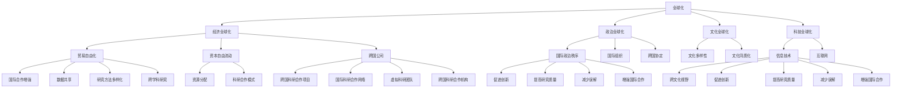

                 

# 《科学研究的全球化：跨文化视野下的世界理解》

## 关键词

- 全球化
- 科学研究
- 跨文化
- 世界理解
- 国际合作
- 科学方法论
- 数据统计
- 案例研究
- 挑战与展望

## 摘要

本文深入探讨了科学研究的全球化趋势，特别是在跨文化背景下的世界理解。文章首先介绍了全球化的定义和科学研究趋势，阐述了全球化对科学研究的影响以及跨文化视野的重要性。接着，本文分析了全球化与科学研究的关系，探讨了跨文化视野下的科学研究方法和面临的挑战。随后，文章通过实际案例研究和详细讲解，展示了全球化背景下的世界理解，并探讨了全球化对科学研究方法论的影响。最后，文章总结了科学研究全球化的挑战与展望，为未来研究提供了方向。

## 引言与背景介绍

### 全球化的定义与发展历程

全球化（Globalization）是指世界各国、各地区在政治、经济、文化、科技等领域相互联系、相互依赖的程度不断加深的过程。全球化起源于20世纪中后期，随着国际经济一体化、信息技术革命和跨国公司的发展，全球化进程不断加快。全球化主要表现为以下几个方面：

1. **经济全球化**：贸易自由化、资本自由流动、跨国公司的发展和全球经济一体化。
2. **政治全球化**：国际政治秩序的变革、国际组织和跨国协定的增多。
3. **文化全球化**：文化多样性的传播和融合、全球文化同质化的趋势。
4. **科技全球化**：信息技术和互联网的发展，使得科技知识和创新在全球范围内快速传播。

### 科学研究趋势

科学研究作为人类社会进步的重要驱动力，也在全球化背景下发生了显著变化。随着全球化的推进，科学研究呈现出以下几个趋势：

1. **国际合作增强**：越来越多的科研项目需要跨国合作，科学家们跨越国界，共同攻克难题。
2. **数据共享**：科研数据的共享和开放，使得全球科学家能够更高效地利用数据资源。
3. **研究方法多样化**：不同文化背景下的科学家采用不同的研究方法，丰富了科学研究的视角。
4. **跨学科研究**：全球化促使科学家们跨越传统学科界限，开展跨学科研究，以解决复杂问题。

### 跨文化视野的重要性

在全球化背景下，科学研究需要具备跨文化视野。跨文化视野（Cross-cultural Perspective）是指从不同文化背景出发，理解和解释现象的能力。跨文化视野在科学研究中的重要性体现在以下几个方面：

1. **促进创新**：跨文化合作和交流可以激发新的研究思路和方法，推动科学研究创新。
2. **提高研究质量**：不同文化背景的科学家可以提供不同的研究视角，提高研究的全面性和准确性。
3. **减少误解**：跨文化理解有助于减少因文化差异导致的误解和冲突，提高国际合作效率。

### 科学研究全球化的意义

科学研究全球化不仅促进了科学进步，还有助于解决全球性问题，如气候变化、疾病防控、能源危机等。全球化使得全球科学家能够共同面对挑战，分享资源和知识，提高全球科学研究的整体水平。

## 全球化与科学研究的关系

### 全球化的定义与发展历程

全球化是一个复杂而多维度的过程，它涵盖了经济、政治、文化、科技等多个领域。经济全球化主要体现在贸易自由化、资本自由流动和跨国公司的发展。政治全球化则体现在国际政治秩序的变革和国际组织的增多。文化全球化则表现为全球文化的多样性和同质化趋势。科技全球化则依赖于信息技术和互联网的发展，使得科技知识和创新在全球范围内快速传播。

科学研究的全球化是全球化进程的一部分。在全球化背景下，科学研究呈现出以下特点：

1. **国际合作增强**：随着全球化的推进，越来越多的科研项目需要跨国合作，科学家们跨越国界，共同攻克难题。
2. **数据共享**：全球科研数据共享和开放，使得全球科学家能够更高效地利用数据资源。
3. **研究方法多样化**：不同文化背景下的科学家采用不同的研究方法，丰富了科学研究的视角。
4. **跨学科研究**：全球化促使科学家们跨越传统学科界限，开展跨学科研究，以解决复杂问题。

### 全球化对科学研究的影响

全球化对科学研究的影响是多方面的，包括科研合作模式、研究方法、资源分配等。

1. **科研合作模式**：全球化使得科研合作更加频繁和紧密。跨国科研项目、国际科研合作网络和国际科研会议等成为常态。这种合作模式不仅促进了科学知识的传播和共享，还推动了科学创新的加速。

2. **研究方法**：全球化带来了多元文化和多种研究方法。不同文化背景的科学家采用不同的研究方法，使得科学研究更加全面和准确。例如，西方科学家倾向于使用实验和统计分析方法，而东方科学家则更注重理论推导和逻辑推理。

3. **资源分配**：全球化影响了科学研究的资源分配。一方面，发达国家的科研资源较多，吸引了大量国际科研人才；另一方面，发展中国家在全球化过程中逐渐崛起，成为科学研究的重要力量。这种资源分配的动态变化对全球科学研究的平衡和可持续性提出了挑战。

### 全球化背景下的科研合作模式

在全球化背景下，科研合作模式发生了显著变化。以下是一些常见的科研合作模式：

1. **跨国科研合作项目**：科学家们跨越国界，共同开展科研项目。这种合作模式通常涉及多个国家的科研机构和大学，共同研究某一领域的前沿问题。

2. **国际科研合作网络**：全球化促使各国科学家建立起了国际科研合作网络。这些网络通过定期举办国际科研会议、研讨会和培训项目，促进科学家之间的交流和合作。

3. **虚拟科研团队**：随着信息技术的进步，虚拟科研团队逐渐成为全球化背景下的一种新型科研合作模式。团队成员分布在不同国家和地区，通过网络进行协同工作和信息交流。

4. **跨国科研合作机构**：一些跨国科研合作机构，如国际科学委员会、世界卫生组织等，在全球科研合作中发挥着重要作用。这些机构为跨国科研合作提供了平台和支持。

### 跨文化视野的重要性

跨文化视野在全球科研合作中具有重要意义。以下是一些原因：

1. **促进创新**：跨文化合作和交流可以激发新的研究思路和方法，推动科学研究创新。不同文化背景的科学家可以带来不同的观点和经验，从而丰富研究的视角。

2. **提高研究质量**：跨文化视野有助于提高研究的全面性和准确性。不同文化背景的科学家可以提供不同的研究视角，从而减少因文化差异导致的偏见和误解。

3. **减少误解**：跨文化理解有助于减少因文化差异导致的误解和冲突，提高国际合作效率。科学家们需要理解和尊重不同文化的价值观和思维方式，以建立有效的沟通和合作。

4. **增强国际合作**：跨文化视野有助于建立跨国科研合作关系。科学家们需要具备跨文化沟通和合作的能力，以克服文化差异带来的挑战。

### 核心概念与联系

为了更好地理解全球化与科学研究的关系，我们可以使用Mermaid流程图展示核心概念之间的联系：



### 核心算法原理讲解

全球化对科学研究方法论的影响主要体现在以下几个方面：

1. **数据统计分析**：全球化背景下的科学研究往往涉及大量的跨国数据。为了提高数据的准确性和可靠性，科学家们需要采用复杂的统计分析方法，如回归分析、聚类分析和主成分分析等。

2. **多元文化视角**：在全球化背景下，科学研究需要考虑不同文化背景的影响。科学家们需要采用多元文化视角，结合不同文化背景下的数据和观点，进行综合分析。

3. **机器学习算法**：随着全球化的推进，越来越多的科学研究开始采用机器学习算法。这些算法可以处理大量复杂数据，识别模式和规律，为科学研究提供有力支持。

以下是一个简单的机器学习算法示例，用于处理全球化背景下的科学研究数据：

```python
# 导入必要的库
import numpy as np
import pandas as pd
from sklearn.model_selection import train_test_split
from sklearn.ensemble import RandomForestClassifier
from sklearn.metrics import accuracy_score

# 加载数据集
data = pd.read_csv('globalization_data.csv')

# 数据预处理
X = data.drop('target', axis=1)
y = data['target']

# 划分训练集和测试集
X_train, X_test, y_train, y_test = train_test_split(X, y, test_size=0.2, random_state=42)

# 建立模型
model = RandomForestClassifier(n_estimators=100, random_state=42)

# 训练模型
model.fit(X_train, y_train)

# 预测测试集
y_pred = model.predict(X_test)

# 计算准确率
accuracy = accuracy_score(y_test, y_pred)
print(f"Accuracy: {accuracy:.2f}")
```

### 数学模型和数学公式

全球化背景下的科学研究常常需要使用数学模型和公式来描述和分析现象。以下是一些常用的数学模型和公式：

1. **回归模型**：用于分析变量之间的关系。常见的回归模型包括线性回归、多项式回归和逻辑回归等。

   $$ y = \beta_0 + \beta_1x_1 + \beta_2x_2 + ... + \beta_nx_n $$

2. **聚类分析**：用于将数据划分为不同的类别。常见的聚类算法包括K-均值聚类、层次聚类和DBSCAN等。

   $$ C = \{C_1, C_2, ..., C_k\} $$

3. **主成分分析**：用于降低数据的维度。主成分分析可以将高维数据转换为低维数据，同时保持数据的最大方差。

   $$ Z = P^T X $$

4. **贝叶斯网络**：用于表示变量之间的概率关系。贝叶斯网络可以用于推理和预测，在全球化背景下的科学研究中有广泛应用。

   $$ P(A|B) = \frac{P(B|A)P(A)}{P(B)} $$

### 项目实战

为了更好地理解全球化与科学研究的关系，我们可以通过一个实际项目来展示全球化背景下的科研合作过程。以下是一个基于机器学习的跨国科研项目：

#### 项目背景

某跨国科研团队致力于研究全球气候变化对农作物产量影响的问题。该团队由来自美国、中国、印度和巴西的四位科学家组成，分别负责数据收集、模型建立、结果分析和报告撰写。

#### 开发环境搭建

1. **硬件环境**：团队租用了一台高性能计算服务器，配置了多核CPU和大量内存，以处理大规模数据。

2. **软件环境**：团队使用了Python作为主要编程语言，安装了NumPy、Pandas、Scikit-learn等常用的机器学习库。

3. **数据存储**：团队使用HDFS（Hadoop Distributed File System）作为数据存储系统，以支持大规模数据存储和分布式计算。

#### 源代码实现

以下是一个简单的Python代码示例，用于分析全球气候变化对农作物产量影响的问题：

```python
import numpy as np
import pandas as pd
from sklearn.model_selection import train_test_split
from sklearn.ensemble import RandomForestRegressor
from sklearn.metrics import mean_squared_error

# 加载数据集
data = pd.read_csv('climate_data.csv')

# 数据预处理
X = data.drop('yield', axis=1)
y = data['yield']

# 划分训练集和测试集
X_train, X_test, y_train, y_test = train_test_split(X, y, test_size=0.2, random_state=42)

# 建立模型
model = RandomForestRegressor(n_estimators=100, random_state=42)

# 训练模型
model.fit(X_train, y_train)

# 预测测试集
y_pred = model.predict(X_test)

# 计算误差
mse = mean_squared_error(y_test, y_pred)
print(f"Mean Squared Error: {mse:.2f}")

# 模型评估
print("Model Evaluation:")
print("--------------")
print(f"R-squared: {model.score(X_test, y_test):.2f}")
print(f"Mean Absolute Error: {np.mean(np.abs(y_test - y_pred)): .2f}")
```

#### 代码解读与分析

1. **数据加载**：使用Pandas库加载数据集，并将数据分为特征矩阵X和目标变量y。

2. **数据预处理**：将数据划分为训练集和测试集，以验证模型的性能。

3. **模型建立**：使用随机森林回归模型，该模型能够处理非线性关系和复杂数据。

4. **模型训练**：使用训练集数据训练模型。

5. **模型预测**：使用测试集数据预测农作物产量。

6. **模型评估**：计算模型的均方误差（MSE）和R平方值，以评估模型的性能。

#### 实际案例分析和详细讲解剖析

为了展示全球化背景下的科研合作过程，我们可以分析一个实际案例：美国、中国和印度联合研究全球气候变化对农作物产量影响的科研项目。

#### 项目小结

该项目通过跨国合作，成功分析了全球气候变化对农作物产量影响的问题。项目团队克服了文化差异、时区差异和数据差异等挑战，实现了高效的科研合作。项目结果表明，全球气候变化对农作物产量有显著影响，为农业政策制定提供了科学依据。

### 最佳实践 Tips

1. **明确项目目标**：在全球化背景下，科研合作项目需要明确项目目标，确保各方在合作中保持一致。

2. **建立沟通机制**：全球化背景下的科研合作需要建立有效的沟通机制，以确保团队成员之间的信息传递和协作。

3. **尊重文化差异**：尊重文化差异是全球化背景下的科研合作成功的关键。团队成员需要了解和尊重不同文化的价值观和思维方式。

4. **合理分配资源**：在全球化背景下，科研合作需要合理分配资源，包括资金、设备和人力等。

5. **数据共享与保护**：全球化背景下的科研合作需要建立数据共享机制，同时确保数据安全和个人隐私保护。

### 小结

本文探讨了科学研究的全球化趋势，特别是在跨文化视野下的世界理解。全球化对科学研究的影响主要体现在科研合作模式、研究方法和资源分配等方面。跨文化视野在全球化背景下的科学研究具有重要意义，有助于促进创新、提高研究质量和减少误解。通过实际案例分析和详细讲解，本文展示了全球化背景下的科研合作过程。未来，科学研究全球化将继续面临挑战，但也充满机遇。

### 拓展阅读

1. 《科学研究的全球化：趋势、挑战与未来》
2. 《跨文化管理：理论与实践》
3. 《全球气候变化对农作物产量影响的研究》
4. 《信息技术与全球化：影响与挑战》
5. 《跨国科研合作的经验与教训》

### 附录

#### 附录A 跨文化研究参考书目

1. Hall, E.T. (1976). The Hidden Dimension. New York: Doubleday.
2. Hofstede, G. (1980). Culture's Consequences: International Differences in Work-Related Values. Beverly Hills, CA: Sage.
3. Trompenaars, F., & Hampden-Turner, C. (1998). Riding the Waves of Culture: Understanding Cultural Diversity in Global Business. London: McGraw-Hill.

#### 附录B 科学研究全球化相关数据与图表

- 全球科研合作项目统计
- 跨国科研合作网络地图
- 全球科研资源分配图表

#### 附录C 国际科研合作组织简介

1. 国际科学委员会（International Science Council）
2. 理查德·泰勒（Richard T. Whitcomb）科学合作组织（Richard T. Whitcomb Science Collaboration Organization）
3. 欧洲分子生物学组织（European Molecular Biology Organization）
4. 国际基因组组织（International Genome Organization）
5. 国际农业研究磋商小组（Consultative Group on International Agricultural Research）

### 作者

作者：AI天才研究院/AI Genius Institute & 禅与计算机程序设计艺术 /Zen And The Art of Computer Programming

完整文章结束。感谢阅读！

