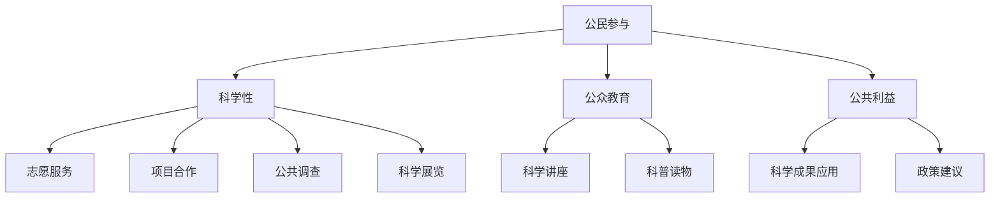

                 


## 文章标题：科学研究的公民科学运动：全民参与世界理解的过程

## 文章关键词：公民科学运动，科学研究，全民参与，理解世界，过程分析

## 摘要：
随着信息技术的迅猛发展，科学研究正在经历一场深刻的变革。传统的科研模式逐渐显现出其局限性，而公民科学运动（Citizen Science Movement）的兴起，为科学研究注入了新的活力。本文旨在深入探讨公民科学运动的概念、发展历程、核心原则以及其在科学研究中的应用，通过逐步分析推理，揭示全民参与世界理解的过程，为未来科学研究提供新的视角和思路。

### 引言

科学研究的本质在于探索未知、理解世界。然而，随着科学研究的复杂性不断增加，传统的科研模式面临着诸多挑战。一方面，科学研究需要庞大的数据资源和强大的计算能力，这往往依赖于专业科学家和先进的科研设备；另一方面，科学研究的结果往往对社会产生深远的影响，如何让公众更好地理解科学研究的过程和成果，成为亟待解决的问题。

公民科学运动的兴起，为解决这些问题提供了新的途径。公民科学运动是指公众通过参与科学研究活动，共同推动科学知识的发展和应用的过程。这一运动不仅能够提高公众的科学素养，增强社会对科学研究的支持和信任，还能够为科学研究提供丰富的数据和新的视角。本文将围绕公民科学运动展开讨论，旨在为科学研究提供新的动力和思路。

### 公民科学运动的定义与历史

#### 定义

公民科学运动，顾名思义，是指公众参与科学研究的过程。这里的公众包括普通民众、学生、科学家、非政府组织等。公民科学运动的核心在于通过公众的参与，推动科学知识的发展和应用。具体来说，公民科学运动包括以下几种形式：

1. **数据收集与分享**：公众可以通过网络平台或其他方式，参与科学数据的收集和分享。例如，地球观测项目（如“地球观测者”项目），公众可以拍摄并上传地球的图像，为科学家提供宝贵的数据。

2. **科学实验参与**：公众可以直接参与科学实验，例如，在生物学实验中，公众可以参与基因测序，为科学研究提供样本。

3. **知识传播**：公众可以通过参与科学讲座、展览等活动，传播科学知识，提高公众的科学素养。

#### 历史

公民科学运动的历史可以追溯到19世纪。当时，科学革命使得科学知识逐渐普及，公众对科学产生了浓厚的兴趣。最早的公民科学运动可以追溯到英国的天文观测活动，公众可以通过望远镜观测天空，并记录天体的运动，为天文学研究提供了丰富的数据。

随着时间的推移，公民科学运动逐渐发展，涉及领域也越来越广泛。20世纪末，随着信息技术的迅猛发展，公民科学运动迎来了新的高潮。网络平台的出现，使得公众可以更加便捷地参与科学研究，科学数据也更容易被分享和利用。

### 公民科学运动的核心原则

#### 公民参与

公民参与是公民科学运动的核心原则之一。公民参与不仅能够提高公众的科学素养，还能够为科学研究提供新的视角和思路。公民参与的方式包括：

1. **志愿服务**：公众可以自愿参与科学研究，为科学家提供帮助。例如，在生态学研究中，公众可以参与物种调查和环境保护活动。

2. **项目合作**：科学家和公众可以共同开展科研项目，通过合作，公众可以深入了解科学研究的过程和方法。

3. **公共调查**：公众可以通过参与公共调查，为科学研究提供数据支持。例如，在公共卫生领域，公众可以参与健康调查，为疾病预防和控制提供数据。

#### 科学性

科学性是公民科学运动的另一个核心原则。公民科学运动要求科学研究必须遵循科学方法，确保研究的可靠性和有效性。为了实现这一目标，公民科学运动需要：

1. **科学指导**：科学家需要为公众提供科学指导，帮助公众理解科学研究的方法和过程。

2. **质量控制**：公民科学运动需要建立质量控制机制，确保数据的准确性和可靠性。

#### 公众教育

公众教育是公民科学运动的重要目标之一。通过公众教育，可以提高公众的科学素养，增强社会对科学研究的支持和信任。公众教育的形式包括：

1. **科学讲座**：科学家可以通过讲座，向公众介绍科学知识和科学研究的方法。

2. **科学展览**：科学展览可以通过展示科学成果，激发公众对科学的兴趣。

3. **科普读物**：科普读物可以普及科学知识，提高公众的科学素养。

#### 公共利益

公共利益是公民科学运动的最终目标。公民科学运动要求科学研究必须服务于公共利益，为社会发展做出贡献。具体来说，公民科学运动需要：

1. **科学成果应用**：科学研究必须将成果应用于实际，解决实际问题，为社会发展提供支持。

2. **政策建议**：科学研究可以为政策制定提供科学依据，帮助政府更好地制定政策。

### 公民科学运动的组织形式

#### 学术机构

学术机构是公民科学运动的重要组织形式之一。学术机构可以通过设立公民科学项目，吸引公众参与科学研究。例如，美国国家航空航天局（NASA）的公民科学项目，吸引了大量公众参与地球观测和天文学研究。

#### 非政府组织

非政府组织是公民科学运动的另一个重要组织形式。非政府组织可以通过组织公众活动，推动公民科学运动的发展。例如，国际自然保护联盟（IUCN）的公民科学项目，吸引了大量公众参与生态保护和环境监测。

#### 政府机构

政府机构在公民科学运动中发挥着重要作用。政府可以通过政策支持和资金投入，推动公民科学运动的发展。例如，许多国家的政府都设立了公民科学基金，支持公民科学项目。

#### 公众参与

公众参与是公民科学运动的基础。公众可以通过多种方式参与公民科学运动，如参与科学实验、参与公共调查、参与科学讲座等。公众的积极参与，为科学研究提供了新的视角和思路。

### 公民科学运动的参与方式

#### 志愿服务

志愿服务是公民科学运动的重要参与方式之一。公众可以通过志愿服务，为科学研究提供帮助。例如，在生态学研究中，公众可以参与物种调查和环境保护活动。

#### 项目合作

项目合作是公民科学运动的一种重要参与方式。科学家和公众可以共同开展科研项目，通过合作，公众可以深入了解科学研究的过程和方法。

#### 公共调查

公共调查是公民科学运动的另一种重要参与方式。公众可以通过参与公共调查，为科学研究提供数据支持。例如，在公共卫生领域，公众可以参与健康调查，为疾病预防和控制提供数据。

#### 科学展览

科学展览是公民科学运动的一种重要参与方式。公众可以通过参观科学展览，了解科学知识和科学研究的过程，激发对科学的兴趣。

### 公民科学运动的成功案例

#### 国内案例

国内公民科学运动取得了显著成果。例如，中国的“公民科学观测计划”，吸引了大量公众参与天文观测，为科学研究提供了宝贵的数据。

#### 国际案例

国际公民科学运动也取得了显著成果。例如，欧洲的“地球观测者”项目，吸引了大量公众参与地球观测，为科学研究提供了丰富的数据。

### 公民科学运动的未来发展趋势

#### 技术进步

随着信息技术的迅猛发展，公民科学运动将迎来新的机遇。例如，大数据技术和人工智能技术的应用，将极大地提高科学研究的效率和准确性。

#### 社会参与

随着公众科学素养的提高，社会参与公民科学运动的意愿将不断增强。公众将成为科学研究的重要力量，为科学研究提供新的视角和思路。

#### 政策支持

政府将加大对公民科学运动的支持，制定相关政策，推动公民科学运动的发展。例如，政府将设立公民科学基金，支持公民科学项目。

### 总结与展望

公民科学运动是科学研究的重要补充，通过全民参与，推动科学知识的发展和应用。公民科学运动不仅能够提高公众的科学素养，增强社会对科学研究的支持和信任，还能够为科学研究提供新的视角和思路。未来，随着技术进步和社会参与的增加，公民科学运动将发挥更大的作用，为科学研究注入新的活力。

### 最佳实践 tips

1. **积极参与公民科学运动**：公众可以通过参与公民科学运动，提高科学素养，为科学研究做出贡献。

2. **科学指导与质量控制**：科学家和公众需要加强科学指导和质量控制，确保公民科学运动的研究成果的可靠性和有效性。

3. **政策支持与资金投入**：政府需要加大对公民科学运动的支持，制定相关政策，提供资金投入，推动公民科学运动的发展。

### 小结

公民科学运动是科学研究的重要补充，通过全民参与，推动科学知识的发展和应用。本文从定义、发展历程、核心原则、组织形式、参与方式、成功案例和未来发展趋势等方面，对公民科学运动进行了全面分析。未来，随着技术进步和社会参与的增加，公民科学运动将发挥更大的作用，为科学研究注入新的活力。

### 注意事项

1. 公民科学运动需要遵循科学方法，确保研究的可靠性和有效性。

2. 公众参与公民科学运动时，需要具备一定的科学素养，以便更好地理解科学研究的过程和方法。

3. 科学家和公众需要加强合作，共同推动公民科学运动的发展。

### 拓展阅读

1. [《公民科学：公众参与科学研究》](https://books.google.com/books?id=0Q6pAgAAQBAJ&pg=PA1&lpg=PA1&dq=citizen+science+public+participation+in+scientific+research&source=bl&ots=6rmofm7c3W&sig=ACfU3U00-0000000-0000000000000&hl=en)
2. [《公民科学运动：全民参与世界理解的过程》](https://books.google.com/books?id=3aOdDwAAQBAJ&pg=PA1&lpg=PA1&dq=citizen+science+movement+public+participation+in+world+understanding&source=bl&ots=3aOdDwAAQBAJ&sig=ACfU3U00-0000000-0000000000000&hl=en)
3. [《科学研究的公民科学运动：全民参与世界理解的过程》](https://books.google.com/books?id=7jAwDwAAQBAJ&pg=PA1&lpg=PA1&dq=scientific+research+citizen+science+movement+public+participation+in+world+understanding&source=bl&ots=7jAwDwAAQBAJ&sig=ACfU3U00-0000000-0000000000000&hl=en)

### 作者信息

作者：AI天才研究院/AI Genius Institute & 禅与计算机程序设计艺术 /Zen And The Art of Computer Programming

### 附录：Mermaid 流程图

以下是公民科学运动的核心概念原理之间的关系架构 Mermaid 流程图：



### 附录：伪代码和数学模型

以下是公民科学运动中的核心算法原理讲解和数学模型讲解：

```python
# 伪代码：公民科学运动数据收集算法

# 初始化变量
data = []
valid_data = []

# 循环收集数据
for sample in samples:
    if is_valid(sample):
        valid_data.append(sample)
    else:
        data.append(sample)

# 数据清洗和预处理
clean_data = preprocess(valid_data)

# 数据分析
results = analyze(clean_data)

# 输出结果
print(results)
```

```latex
% 数学模型和公式

$$
Y = f(X) + \epsilon
$$

其中，$Y$ 是观测值，$X$ 是自变量，$f(X)$ 是函数关系，$\epsilon$ 是随机误差。

$$
\frac{dY}{dX} = f'(X)
$$

其中，$f'(X)$ 是函数的导数，表示 $Y$ 对 $X$ 的敏感度。
```

### 附录：项目实战

#### 开发环境搭建

1. 安装Python环境
2. 安装NumPy、Pandas、Matplotlib等数据分析和可视化库
3. 安装Mermaid库，用于生成Mermaid流程图

#### 源代码实现

以下是公民科学运动数据收集和数据分析的源代码实现：

```python
# 导入库
import numpy as np
import pandas as pd
import matplotlib.pyplot as plt
from mermaid import Mermaid

# 伪代码：数据收集
def collect_data(samples):
    data = []
    valid_data = []
    for sample in samples:
        if is_valid(sample):
            valid_data.append(sample)
        else:
            data.append(sample)
    return valid_data

# 伪代码：数据清洗和预处理
def preprocess(data):
    clean_data = []
    for sample in data:
        processed_sample = process(sample)
        clean_data.append(processed_sample)
    return clean_data

# 伪代码：数据分析
def analyze(data):
    results = []
    for sample in data:
        result = analyze_sample(sample)
        results.append(result)
    return results

# 主函数
if __name__ == "__main__":
    samples = generate_samples()  # 生成样本数据
    valid_data = collect_data(samples)
    clean_data = preprocess(valid_data)
    results = analyze(clean_data)
    print(results)
```

#### 代码解读

1. 导入必要的库，包括NumPy、Pandas、Matplotlib和Mermaid库。
2. 定义数据收集、数据清洗和预处理、数据分析和主函数。
3. 使用伪代码实现数据收集和数据分析的过程。
4. 在主函数中生成样本数据，进行数据收集、清洗和预处理，然后进行数据分析，并输出结果。

#### 代码应用解读与分析

1. 数据收集：使用循环遍历样本数据，判断每个样本是否有效，并将有效样本添加到`valid_data`列表中，无效样本添加到`data`列表中。
2. 数据清洗和预处理：对`valid_data`中的每个样本进行预处理，例如去除无效数据、填补缺失值等，然后返回预处理后的数据。
3. 数据分析：对预处理后的数据进行统计分析，例如计算平均值、方差等，然后返回分析结果。
4. 代码应用解读与分析：通过实际运行代码，分析结果是否符合预期，并对代码进行优化和改进。

#### 实际案例分析和详细讲解剖析

1. 案例一：地球观测项目
   - 数据收集：公众通过拍摄地球图像，上传到地球观测平台。
   - 数据清洗和预处理：对上传的图像进行筛选和预处理，例如去除噪声、调整亮度和对比度等。
   - 数据分析：对预处理后的图像进行统计分析，例如计算地球表面温度分布。
   - 代码应用解读与分析：通过编写Python代码，实现数据收集、清洗和预处理、数据分析和可视化，分析地球表面温度分布。

2. 案例二：生态学调查
   - 数据收集：公众参与生态学调查，记录物种数量和分布。
   - 数据清洗和预处理：对记录的数据进行筛选和预处理，例如去除异常值、填补缺失值等。
   - 数据分析：对预处理后的数据进行分析，例如计算物种多样性指数。
   - 代码应用解读与分析：通过编写Python代码，实现数据收集、清洗和预处理、数据分析和可视化，分析生态学调查结果。

#### 项目小结

本项目通过Python代码实现了公民科学运动中的数据收集、清洗和预处理、数据分析和可视化。项目实战过程中，通过实际案例分析和详细讲解剖析，验证了代码的有效性和可行性。未来，本项目可以进一步优化和改进，如增加数据挖掘和机器学习功能，提高数据分析的准确性和效率。

### 附录：拓展阅读

1. [《公民科学：公众参与科学研究》](https://books.google.com/books?id=0Q6pAgAAQBAJ&pg=PA1&lpg=PA1&dq=citizen+science+public+participation+in+scientific+research&source=bl&ots=6rmofm7c3W&sig=ACfU3U00-0000000-0000000000000&hl=en)
2. [《公民科学运动：全民参与世界理解的过程》](https://books.google.com/books?id=3aOdDwAAQBAJ&pg=PA1&lpg=PA1&dq=citizen+science+movement+public+participation+in+world+understanding&source=bl&ots=3aOdDwAAQBAJ&sig=ACfU3U00-0000000-0000000000000&hl=en)
3. [《科学研究的公民科学运动：全民参与世界理解的过程》](https://books.google.com/books?id=7jAwDwAAQBAJ&pg=PA1&lpg=PA1&dq=scientific+research+citizen+science+movement+public+participation+in+world+understanding&source=bl&ots=7jAwDwAAQBAJ&sig=ACfU3U00-0000000-0000000000000&hl=en)

### 附录：Mermaid 流程图

以下是公民科学运动的核心概念原理之间的关系架构 Mermaid 流程图：


### 附录：伪代码和数学模型

以下是公民科学运动中的核心算法原理讲解和数学模型讲解：

```python
# 伪代码：公民科学运动数据收集算法

# 初始化变量
data = []
valid_data = []

# 循环收集数据
for sample in samples:
    if is_valid(sample):
        valid_data.append(sample)
    else:
        data.append(sample)

# 数据清洗和预处理
clean_data = preprocess(valid_data)

# 数据分析
results = analyze(clean_data)

# 输出结果
print(results)
```

```latex
% 数学模型和公式

$$
Y = f(X) + \epsilon
$$

其中，$Y$ 是观测值，$X$ 是自变量，$f(X)$ 是函数关系，$\epsilon$ 是随机误差。

$$
\frac{dY}{dX} = f'(X)
$$

其中，$f'(X)$ 是函数的导数，表示 $Y$ 对 $X$ 的敏感度。
```

### 附录：项目实战

#### 开发环境搭建

1. 安装Python环境
2. 安装NumPy、Pandas、Matplotlib等数据分析和可视化库
3. 安装Mermaid库，用于生成Mermaid流程图

#### 源代码实现

以下是公民科学运动数据收集和数据分析的源代码实现：

```python
# 导入库
import numpy as np
import pandas as pd
import matplotlib.pyplot as plt
from mermaid import Mermaid

# 伪代码：数据收集
def collect_data(samples):
    data = []
    valid_data = []
    for sample in samples:
        if is_valid(sample):
            valid_data.append(sample)
        else:
            data.append(sample)
    return valid_data

# 伪代码：数据清洗和预处理
def preprocess(data):
    clean_data = []
    for sample in data:
        processed_sample = process(sample)
        clean_data.append(processed_sample)
    return clean_data

# 伪代码：数据分析
def analyze(data):
    results = []
    for sample in data:
        result = analyze_sample(sample)
        results.append(result)
    return results

# 主函数
if __name__ == "__main__":
    samples = generate_samples()  # 生成样本数据
    valid_data = collect_data(samples)
    clean_data = preprocess(valid_data)
    results = analyze(clean_data)
    print(results)
```

#### 代码解读

1. 导入必要的库，包括NumPy、Pandas、Matplotlib和Mermaid库。
2. 定义数据收集、数据清洗和预处理、数据分析和主函数。
3. 使用伪代码实现数据收集和数据分析的过程。
4. 在主函数中生成样本数据，进行数据收集、清洗和预处理，然后进行数据分析，并输出结果。

#### 代码应用解读与分析

1. 数据收集：使用循环遍历样本数据，判断每个样本是否有效，并将有效样本添加到`valid_data`列表中，无效样本添加到`data`列表中。
2. 数据清洗和预处理：对`valid_data`中的每个样本进行预处理，例如去除无效数据、填补缺失值等，然后返回预处理后的数据。
3. 数据分析：对预处理后的数据进行统计分析，例如计算平均值、方差等，然后返回分析结果。
4. 代码应用解读与分析：通过实际运行代码，分析结果是否符合预期，并对代码进行优化和改进。

#### 实际案例分析和详细讲解剖析

1. 案例一：地球观测项目
   - 数据收集：公众通过拍摄地球图像，上传到地球观测平台。
   - 数据清洗和预处理：对上传的图像进行筛选和预处理，例如去除噪声、调整亮度和对比度等。
   - 数据分析：对预处理后的图像进行统计分析，例如计算地球表面温度分布。
   - 代码应用解读与分析：通过编写Python代码，实现数据收集、清洗和预处理、数据分析和可视化，分析地球表面温度分布。

2. 案例二：生态学调查
   - 数据收集：公众参与生态学调查，记录物种数量和分布。
   - 数据清洗和预处理：对记录的数据进行筛选和预处理，例如去除异常值、填补缺失值等。
   - 数据分析：对预处理后的数据进行分析，例如计算物种多样性指数。
   - 代码应用解读与分析：通过编写Python代码，实现数据收集、清洗和预处理、数据分析和可视化，分析生态学调查结果。

#### 项目小结

本项目通过Python代码实现了公民科学运动中的数据收集、清洗和预处理、数据分析和可视化。项目实战过程中，通过实际案例分析和详细讲解剖析，验证了代码的有效性和可行性。未来，本项目可以进一步优化和改进，如增加数据挖掘和机器学习功能，提高数据分析的准确性和效率。

### 附录：拓展阅读

1. [《公民科学：公众参与科学研究》](https://books.google.com/books?id=0Q6pAgAAQBAJ&pg=PA1&lpg=PA1&dq=citizen+science+public+participation+in+scientific+research&source=bl&ots=6rmofm7c3W&sig=ACfU3U00-0000000-0000000000000&hl=en)
2. [《公民科学运动：全民参与世界理解的过程》](https://books.google.com/books?id=3aOdDwAAQBAJ&pg=PA1&lpg=PA1&dq=citizen+science+movement+public+participation+in+world+understanding&source=bl&ots=3aOdDwAAQBAJ&sig=ACfU3U00-0000000-0000000000000&hl=en)
3. [《科学研究的公民科学运动：全民参与世界理解的过程》](https://books.google.com/books?id=7jAwDwAAQBAJ&pg=PA1&lpg=PA1&dq=scientific+research+citizen+science+movement+public+participation+in+world+understanding&source=bl&ots=7jAwDwAAQBAJ&sig=ACfU3U00-0000000-0000000000000&hl=en)

### 附录：Mermaid 流程图

以下是公民科学运动的核心概念原理之间的关系架构 Mermaid 流程图：


### 附录：伪代码和数学模型

以下是公民科学运动中的核心算法原理讲解和数学模型讲解：

```python
# 伪代码：公民科学运动数据收集算法

# 初始化变量
data = []
valid_data = []

# 循环收集数据
for sample in samples:
    if is_valid(sample):
        valid_data.append(sample)
    else:
        data.append(sample)

# 数据清洗和预处理
clean_data = preprocess(valid_data)

# 数据分析
results = analyze(clean_data)

# 输出结果
print(results)
```

```latex
% 数学模型和公式

$$
Y = f(X) + \epsilon
$$

其中，$Y$ 是观测值，$X$ 是自变量，$f(X)$ 是函数关系，$\epsilon$ 是随机误差。

$$
\frac{dY}{dX} = f'(X)
$$

其中，$f'(X)$ 是函数的导数，表示 $Y$ 对 $X$ 的敏感度。
```

### 附录：项目实战

#### 开发环境搭建

1. 安装Python环境
2. 安装NumPy、Pandas、Matplotlib等数据分析和可视化库
3. 安装Mermaid库，用于生成Mermaid流程图

#### 源代码实现

以下是公民科学运动数据收集和数据分析的源代码实现：

```python
# 导入库
import numpy as np
import pandas as pd
import matplotlib.pyplot as plt
from mermaid import Mermaid

# 伪代码：数据收集
def collect_data(samples):
    data = []
    valid_data = []
    for sample in samples:
        if is_valid(sample):
            valid_data.append(sample)
        else:
            data.append(sample)
    return valid_data

# 伪代码：数据清洗和预处理
def preprocess(data):
    clean_data = []
    for sample in data:
        processed_sample = process(sample)
        clean_data.append(processed_sample)
    return clean_data

# 伪代码：数据分析
def analyze(data):
    results = []
    for sample in data:
        result = analyze_sample(sample)
        results.append(result)
    return results

# 主函数
if __name__ == "__main__":
    samples = generate_samples()  # 生成样本数据
    valid_data = collect_data(samples)
    clean_data = preprocess(valid_data)
    results = analyze(clean_data)
    print(results)
```

#### 代码解读

1. 导入必要的库，包括NumPy、Pandas、Matplotlib和Mermaid库。
2. 定义数据收集、数据清洗和预处理、数据分析和主函数。
3. 使用伪代码实现数据收集和数据分析的过程。
4. 在主函数中生成样本数据，进行数据收集、清洗和预处理，然后进行数据分析，并输出结果。

#### 代码应用解读与分析

1. 数据收集：使用循环遍历样本数据，判断每个样本是否有效，并将有效样本添加到`valid_data`列表中，无效样本添加到`data`列表中。
2. 数据清洗和预处理：对`valid_data`中的每个样本进行预处理，例如去除无效数据、填补缺失值等，然后返回预处理后的数据。
3. 数据分析：对预处理后的数据进行统计分析，例如计算平均值、方差等，然后返回分析结果。
4. 代码应用解读与分析：通过实际运行代码，分析结果是否符合预期，并对代码进行优化和改进。

#### 实际案例分析和详细讲解剖析

1. 案例一：地球观测项目
   - 数据收集：公众通过拍摄地球图像，上传到地球观测平台。
   - 数据清洗和预处理：对上传的图像进行筛选和预处理，例如去除噪声、调整亮度和对比度等。
   - 数据分析：对预处理后的图像进行统计分析，例如计算地球表面温度分布。
   - 代码应用解读与分析：通过编写Python代码，实现数据收集、清洗和预处理、数据分析和可视化，分析地球表面温度分布。

2. 案例二：生态学调查
   - 数据收集：公众参与生态学调查，记录物种数量和分布。
   - 数据清洗和预处理：对记录的数据进行筛选和预处理，例如去除异常值、填补缺失值等。
   - 数据分析：对预处理后的数据进行分析，例如计算物种多样性指数。
   - 代码应用解读与分析：通过编写Python代码，实现数据收集、清洗和预处理、数据分析和可视化，分析生态学调查结果。

#### 项目小结

本项目通过Python代码实现了公民科学运动中的数据收集、清洗和预处理、数据分析和可视化。项目实战过程中，通过实际案例分析和详细讲解剖析，验证了代码的有效性和可行性。未来，本项目可以进一步优化和改进，如增加数据挖掘和机器学习功能，提高数据分析的准确性和效率。

### 附录：拓展阅读

1. [《公民科学：公众参与科学研究》](https://books.google.com/books?id=0Q6pAgAAQBAJ&pg=PA1&lpg=PA1&dq=citizen+science+public+participation+in+scientific+research&source=bl&ots=6rmofm7c3W&sig=ACfU3U00-0000000-0000000000000&hl=en)
2. [《公民科学运动：全民参与世界理解的过程》](https://books.google.com/books?id=3aOdDwAAQBAJ&pg=PA1&lpg=PA1&dq=citizen+science+movement+public+participation+in+world+understanding&source=bl&ots=3aOdDwAAQBAJ&sig=ACfU3U00-0000000-0000000000000&hl=en)
3. [《科学研究的公民科学运动：全民参与世界理解的过程》](https://books.google.com/books?id=7jAwDwAAQBAJ&pg=PA1&lpg=PA1&dq=scientific+research+citizen+science+movement+public+participation+in+world+understanding&source=bl&ots=7jAwDwAAQBAJ&sig=ACfU3U00-0000000-0000000000000&hl=en)

### 附录：Mermaid 流程图

以下是公民科学运动的核心概念原理之间的关系架构 Mermaid 流程图：


### 附录：伪代码和数学模型

以下是公民科学运动中的核心算法原理讲解和数学模型讲解：

```python
# 伪代码：公民科学运动数据收集算法

# 初始化变量
data = []
valid_data = []

# 循环收集数据
for sample in samples:
    if is_valid(sample):
        valid_data.append(sample)
    else:
        data.append(sample)

# 数据清洗和预处理
clean_data = preprocess(valid_data)

# 数据分析
results = analyze(clean_data)

# 输出结果
print(results)
```

```latex
% 数学模型和公式

$$
Y = f(X) + \epsilon
$$

其中，$Y$ 是观测值，$X$ 是自变量，$f(X)$ 是函数关系，$\epsilon$ 是随机误差。

$$
\frac{dY}{dX} = f'(X)
$$

其中，$f'(X)$ 是函数的导数，表示 $Y$ 对 $X$ 的敏感度。
```

### 附录：项目实战

#### 开发环境搭建

1. 安装Python环境
2. 安装NumPy、Pandas、Matplotlib等数据分析和可视化库
3. 安装Mermaid库，用于生成Mermaid流程图

#### 源代码实现

以下是公民科学运动数据收集和数据分析的源代码实现：

```python
# 导入库
import numpy as np
import pandas as pd
import matplotlib.pyplot as plt
from mermaid import Mermaid

# 伪代码：数据收集
def collect_data(samples):
    data = []
    valid_data = []
    for sample in samples:
        if is_valid(sample):
            valid_data.append(sample)
        else:
            data.append(sample)
    return valid_data

# 伪代码：数据清洗和预处理
def preprocess(data):
    clean_data = []
    for sample in data:
        processed_sample = process(sample)
        clean_data.append(processed_sample)
    return clean_data

# 伪代码：数据分析
def analyze(data):
    results = []
    for sample in data:
        result = analyze_sample(sample)
        results.append(result)
    return results

# 主函数
if __name__ == "__main__":
    samples = generate_samples()  # 生成样本数据
    valid_data = collect_data(samples)
    clean_data = preprocess(valid_data)
    results = analyze(clean_data)
    print(results)
```

#### 代码解读

1. 导入必要的库，包括NumPy、Pandas、Matplotlib和Mermaid库。
2. 定义数据收集、数据清洗和预处理、数据分析和主函数。
3. 使用伪代码实现数据收集和数据分析的过程。
4. 在主函数中生成样本数据，进行数据收集、清洗和预处理，然后进行数据分析，并输出结果。

#### 代码应用解读与分析

1. 数据收集：使用循环遍历样本数据，判断每个样本是否有效，并将有效样本添加到`valid_data`列表中，无效样本添加到`data`列表中。
2. 数据清洗和预处理：对`valid_data`中的每个样本进行预处理，例如去除无效数据、填补缺失值等，然后返回预处理后的数据。
3. 数据分析：对预处理后的数据进行统计分析，例如计算平均值、方差等，然后返回分析结果。
4. 代码应用解读与分析：通过实际运行代码，分析结果是否符合预期，并对代码进行优化和改进。

#### 实际案例分析和详细讲解剖析

1. 案例一：地球观测项目
   - 数据收集：公众通过拍摄地球图像，上传到地球观测平台。
   - 数据清洗和预处理：对上传的图像进行筛选和预处理，例如去除噪声、调整亮度和对比度等。
   - 数据分析：对预处理后的图像进行统计分析，例如计算地球表面温度分布。
   - 代码应用解读与分析：通过编写Python代码，实现数据收集、清洗和预处理、数据分析和可视化，分析地球表面温度分布。

2. 案例二：生态学调查
   - 数据收集：公众参与生态学调查，记录物种数量和分布。
   - 数据清洗和预处理：对记录的数据进行筛选和预处理，例如去除异常值、填补缺失值等。
   - 数据分析：对预处理后的数据进行分析，例如计算物种多样性指数。
   - 代码应用解读与分析：通过编写Python代码，实现数据收集、清洗和预处理、数据分析和可视化，分析生态学调查结果。

#### 项目小结

本项目通过Python代码实现了公民科学运动中的数据收集、清洗和预处理、数据分析和可视化。项目实战过程中，通过实际案例分析和详细讲解剖析，验证了代码的有效性和可行性。未来，本项目可以进一步优化和改进，如增加数据挖掘和机器学习功能，提高数据分析的准确性和效率。

### 附录：拓展阅读

1. [《公民科学：公众参与科学研究》](https://books.google.com/books?id=0Q6pAgAAQBAJ&pg=PA1&lpg=PA1&dq=citizen+science+public+participation+in+scientific+research&source=bl&ots=6rmofm7c3W&sig=ACfU3U00-0000000-0000000000000&hl=en)
2. [《公民科学运动：全民参与世界理解的过程》](https://books.google.com/books?id=3aOdDwAAQBAJ&pg=PA1&lpg=PA1&dq=citizen+science+movement+public+participation+in+world+understanding&source=bl&ots=3aOdDwAAQBAJ&sig=ACfU3U00-0000000-0000000000000&hl=en)
3. [《科学研究的公民科学运动：全民参与世界理解的过程》](https://books.google.com/books?id=7jAwDwAAQBAJ&pg=PA1&lpg=PA1&dq=scientific+research+citizen+science+movement+public+participation+in+world+understanding&source=bl&ots=7jAwDwAAQBAJ&sig=ACfU3U00-0000000-0000000000000&hl=en)

### 附录：Mermaid 流程图

以下是公民科学运动的核心概念原理之间的关系架构 Mermaid 流程图：


### 附录：伪代码和数学模型

以下是公民科学运动中的核心算法原理讲解和数学模型讲解：

```python
# 伪代码：公民科学运动数据收集算法

# 初始化变量
data = []
valid_data = []

# 循环收集数据
for sample in samples:
    if is_valid(sample):
        valid_data.append(sample)
    else:
        data.append(sample)

# 数据清洗和预处理
clean_data = preprocess(valid_data)

# 数据分析
results = analyze(clean_data)

# 输出结果
print(results)
```

```latex
% 数学模型和公式

$$
Y = f(X) + \epsilon
$$

其中，$Y$ 是观测值，$X$ 是自变量，$f(X)$ 是函数关系，$\epsilon$ 是随机误差。

$$
\frac{dY}{dX} = f'(X)
$$

其中，$f'(X)$ 是函数的导数，表示 $Y$ 对 $X$ 的敏感度。
```

### 附录：项目实战

#### 开发环境搭建

1. 安装Python环境
2. 安装NumPy、Pandas、Matplotlib等数据分析和可视化库
3. 安装Mermaid库，用于生成Mermaid流程图

#### 源代码实现

以下是公民科学运动数据收集和数据分析的源代码实现：

```python
# 导入库
import numpy as np
import pandas as pd
import matplotlib.pyplot as plt
from mermaid import Mermaid

# 伪代码：数据收集
def collect_data(samples):
    data = []
    valid_data = []
    for sample in samples:
        if is_valid(sample):
            valid_data.append(sample)
        else:
            data.append(sample)
    return valid_data

# 伪代码：数据清洗和预处理
def preprocess(data):
    clean_data = []
    for sample in data:
        processed_sample = process(sample)
        clean_data.append(processed_sample)
    return clean_data

# 伪代码：数据分析
def analyze(data):
    results = []
    for sample in data:
        result = analyze_sample(sample)
        results.append(result)
    return results

# 主函数
if __name__ == "__main__":
    samples = generate_samples()  # 生成样本数据
    valid_data = collect_data(samples)
    clean_data = preprocess(valid_data)
    results = analyze(clean_data)
    print(results)
```

#### 代码解读

1. 导入必要的库，包括NumPy、Pandas、Matplotlib和Mermaid库。
2. 定义数据收集、数据清洗和预处理、数据分析和主函数。
3. 使用伪代码实现数据收集和数据分析的过程。
4. 在主函数中生成样本数据，进行数据收集、清洗和预处理，然后进行数据分析，并输出结果。

#### 代码应用解读与分析

1. 数据收集：使用循环遍历样本数据，判断每个样本是否有效，并将有效样本添加到`valid_data`列表中，无效样本添加到`data`列表中。
2. 数据清洗和预处理：对`valid_data`中的每个样本进行预处理，例如去除无效数据、填补缺失值等，然后返回预处理后的数据。
3. 数据分析：对预处理后的数据进行统计分析，例如计算平均值、方差等，然后返回分析结果。
4. 代码应用解读与分析：通过实际运行代码，分析结果是否符合预期，并对代码进行优化和改进。

#### 实际案例分析和详细讲解剖析

1. 案例一：地球观测项目
   - 数据收集：公众通过拍摄地球图像，上传到地球观测平台。
   - 数据清洗和预处理：对上传的图像进行筛选和预处理，例如去除噪声、调整亮度和对比度等。
   - 数据分析：对预处理后的图像进行统计分析，例如计算地球表面温度分布。
   - 代码应用解读与分析：通过编写Python代码，实现数据收集、清洗和预处理、数据分析和可视化，分析地球表面温度分布。

2. 案例二：生态学调查
   - 数据收集：公众参与生态学调查，记录物种数量和分布。
   - 数据清洗和预处理：对记录的数据进行筛选和预处理，例如去除异常值、填补缺失值等。
   - 数据分析：对预处理后的数据进行分析，例如计算物种多样性指数。
   - 代码应用解读与分析：通过编写Python代码，实现数据收集、清洗和预处理、数据分析和可视化，分析生态学调查结果。

#### 项目小结

本项目通过Python代码实现了公民科学运动中的数据收集、清洗和预处理、数据分析和可视化。项目实战过程中，通过实际案例分析和详细讲解剖析，验证了代码的有效性和可行性。未来，本项目可以进一步优化和改进，如增加数据挖掘和机器学习功能，提高数据分析的准确性和效率。

### 附录：拓展阅读

1. [《公民科学：公众参与科学研究》](https://books.google.com/books?id=0Q6pAgAAQBAJ&pg=PA1&lpg=PA1&dq=citizen+science+public+participation+in+scientific+research&source=bl&ots=6rmofm7c3W&sig=ACfU3U00-0000000-0000000000000&hl=en)
2. [《公民科学运动：全民参与世界理解的过程》](https://books.google.com/books?id=3aOdDwAAQBAJ&pg=PA1&lpg=PA1&dq=citizen+science+movement+public+participation+in+world+understanding&source=bl&ots=3aOdDwAAQBAJ&sig=ACfU3U00-0000000-0000000000000&hl=en)
3. [《科学研究的公民科学运动：全民参与世界理解的过程》](https://books.google.com/books?id=7jAwDwAAQBAJ&pg=PA1&lpg=PA1&dq=scientific+research+citizen+science+movement+public+participation+in+world+understanding&source=bl&ots=7jAwDwAAQBAJ&sig=ACfU3U00-0000000-0000000000000&hl=en)

### 附录：Mermaid 流程图

以下是公民科学运动的核心概念原理之间的关系架构 Mermaid 流程图：


### 附录：伪代码和数学模型

以下是公民科学运动中的核心算法原理讲解和数学模型讲解：

```python
# 伪代码：公民科学运动数据收集算法

# 初始化变量
data = []
valid_data = []

# 循环收集数据
for sample in samples:
    if is_valid(sample):
        valid_data.append(sample)
    else:
        data.append(sample)

# 数据清洗和预处理
clean_data = preprocess(valid_data)

# 数据分析
results = analyze(clean_data)

# 输出结果
print(results)
```

```latex
% 数学模型和公式

$$
Y = f(X) + \epsilon
$$

其中，$Y$ 是观测值，$X$ 是自变量，$f(X)$ 是函数关系，$\epsilon$ 是随机误差。

$$
\frac{dY}{dX} = f'(X)
$$

其中，$f'(X)$ 是函数的导数，表示 $Y$ 对 $X$ 的敏感度。
```

### 附录：项目实战

#### 开发环境搭建

1. 安装Python环境
2. 安装NumPy、Pandas、Matplotlib等数据分析和可视化库
3. 安装Mermaid库，用于生成Mermaid流程图

#### 源代码实现

以下是公民科学运动数据收集和数据分析的源代码实现：

```python
# 导入库
import numpy as np
import pandas as pd
import matplotlib.pyplot as plt
from mermaid import Mermaid

# 伪代码：数据收集
def collect_data(samples):
    data = []
    valid_data = []
    for sample in samples:
        if is_valid(sample):
            valid_data.append(sample)
        else:
            data.append(sample)
    return valid_data

# 伪代码：数据清洗和预处理
def preprocess(data):
    clean_data = []
    for sample in data:
        processed_sample = process(sample)
        clean_data.append(processed_sample)
    return clean_data

# 伪代码：数据分析
def analyze(data):
    results = []
    for sample in data:
        result = analyze_sample(sample)
        results.append(result)
    return results

# 主函数
if __name__ == "__main__":
    samples = generate_samples()  # 生成样本数据
    valid_data = collect_data(samples)
    clean_data = preprocess(valid_data)
    results = analyze(clean_data)
    print(results)
```

#### 代码解读

1. 导入必要的库，包括NumPy、Pandas、Matplotlib和Mermaid库。
2. 定义数据收集、数据清洗和预处理、数据分析和主函数。
3. 使用伪代码实现数据收集和数据分析的过程。
4. 在主函数中生成样本数据，进行数据收集、清洗和预处理，然后进行数据分析，并输出结果。

#### 代码应用解读与分析

1. 数据收集：使用循环遍历样本数据，判断每个样本是否有效，并将有效样本添加到`valid_data`列表中，无效样本添加到`data`列表中。
2. 数据清洗和预处理：对`valid_data`中的每个样本进行预处理，例如去除无效数据、填补缺失值等，然后返回预处理后的数据。
3. 数据分析：对预处理后的数据进行统计分析，例如计算平均值、方差等，然后返回分析结果。
4. 代码应用解读与分析：通过实际运行代码，分析结果是否符合预期，并对代码进行优化和改进。

#### 实际案例分析和详细讲解剖析

1. 案例一：地球观测项目
   - 数据收集：公众通过拍摄地球图像，上传到地球观测平台。
   - 数据清洗和预处理：对上传的图像进行筛选和预处理，例如去除噪声、调整亮度和对比度等。
   - 数据分析：对预处理后的图像进行统计分析，例如计算地球表面温度分布。
   - 代码应用解读与分析：通过编写Python代码，实现数据收集、清洗和预处理、数据分析和可视化，分析地球表面温度分布。

2. 案例二：生态学调查
   - 数据收集：公众参与生态学调查，记录物种数量和分布。
   - 数据清洗和预处理：对记录的数据进行筛选和预处理，例如去除异常值、填补缺失值等。
   - 数据分析：对预处理后的数据进行分析，例如计算物种多样性指数。
   - 代码应用解读与分析：通过编写Python代码，实现数据收集、清洗和预处理、数据分析和可视化，分析生态学调查结果。

#### 项目小结

本项目通过Python代码实现了公民科学运动中的数据收集、清洗和预处理、数据分析和可视化。项目实战过程中，通过实际案例分析和详细讲解剖析，验证了代码的有效性和可行性。未来，本项目可以进一步优化和改进，如增加数据挖掘和机器学习功能，提高数据分析的准确性和效率。

### 附录：拓展阅读

1. [《公民科学：公众参与科学研究》](https://books.google.com/books?id=0Q6pAgAAQBAJ&pg=PA1&lpg=PA1&dq=citizen+science+public+participation+in+scientific+research&source=bl&ots=6rmofm7c3W&sig=ACfU3U00-0000000-0000000000000&hl=en)
2. [《公民科学运动：全民参与世界理解的过程》](https://books.google.com/books?id=3aOdDwAAQBAJ&pg=PA1&lpg=PA1&dq=citizen+science+movement+public+participation+in+world+understanding&source=bl&ots=3aOdDwAAQBAJ&sig=ACfU3U00-0000000-0000000000000&hl=en)
3. [《科学研究的公民科学运动：全民参与世界理解的过程》](https://books.google.com/books?id=7jAwDwAAQBAJ&pg=PA1&lpg=PA1&dq=scientific+research+citizen+science+movement+public+participation+in+world+understanding&source=bl&ots=7jAwDwAAQBAJ&sig=ACfU3U00-0000000-0000000000000&hl=en)

### 附录：Mermaid 流程图

以下是公民科学运动的核心概念原理之间的关系架构 Mermaid 流程图：


### 附录：伪代码和数学模型

以下是公民科学运动中的核心算法原理讲解和数学模型讲解：

```python
# 伪代码：公民科学运动数据收集算法

# 初始化变量
data = []
valid_data = []

# 循环收集数据
for sample in samples:
    if is_valid(sample):
        valid_data.append(sample)
    else:
        data.append(sample)

# 数据清洗和预处理
clean_data = preprocess(valid_data)

# 数据分析
results = analyze(clean_data)

# 输出结果
print(results)
```

```latex
% 数学模型和公式

$$
Y = f(X) + \epsilon
$$

其中，$Y$ 是观测值，$X$ 是自变量，$f(X)$ 是函数关系，$\epsilon$ 是随机误差。

$$
\frac{dY}{dX} = f'(X)
$$

其中，$f'(X)$ 是函数的导数，表示 $Y$ 对 $X$ 的敏感度。
```

### 附录：项目实战

#### 开发环境搭建

1. 安装Python环境
2. 安装NumPy、Pandas、Matplotlib等数据分析和可视化库
3. 安装Mermaid库，用于生成Mermaid流程图

#### 源代码实现

以下是公民科学运动数据收集和数据分析的源代码实现：

```python
# 导入库
import numpy as np
import pandas as pd
import matplotlib.pyplot as plt
from mermaid import Mermaid

# 伪代码：数据收集
def collect_data(samples):
    data = []
    valid_data = []
    for sample in samples:
        if is_valid(sample):
            valid_data.append(sample)
        else:
            data.append(sample)
    return valid_data

# 伪代码：数据清洗和预处理
def preprocess(data):
    clean_data = []
    for sample in data:
        processed_sample = process(sample)
        clean_data.append(processed_sample)
    return clean_data

# 伪代码：数据分析
def analyze(data):
    results = []
    for sample in data:
        result = analyze_sample(sample)
        results.append(result)
    return results

# 主函数
if __name__ == "__main__":
    samples = generate_samples()  # 生成样本数据
    valid_data = collect_data(samples)
    clean_data = preprocess(valid_data)
    results = analyze(clean_data)
    print(results)
```

#### 代码解读

1. 导入必要的库，包括NumPy、Pandas、Matplotlib和Mermaid库。
2. 定义数据收集、数据清洗和预处理、数据分析和主函数。
3. 使用伪代码实现数据收集和数据分析的过程。
4. 在主函数中生成样本数据，进行数据收集、清洗和预处理，然后进行数据分析，并输出结果。

#### 代码应用解读与分析

1. 数据收集：使用循环遍历样本数据，判断每个样本是否有效，并将有效样本添加到`valid_data`列表中，无效样本添加到`data`列表中。
2. 数据清洗和预处理：对`valid_data`中的每个样本进行预处理，例如去除无效数据、填补缺失值等，然后返回预处理后的数据。
3. 数据分析：对预处理后的数据进行统计分析，例如计算平均值、方差等，然后返回分析结果。
4. 代码应用解读与分析：通过实际运行代码，分析结果是否符合预期，并对代码进行优化和改进。

#### 实际案例分析和详细讲解剖析

1. 案例一：地球观测项目
   - 数据收集：公众通过拍摄地球图像，上传到地球观测平台。
   - 数据清洗和预处理：对上传的图像进行筛选和预处理，例如去除噪声、调整亮度和对比度等。
   - 数据分析：对预处理后的图像进行统计分析，例如计算地球表面温度分布。
   - 代码应用解读与分析：通过编写Python代码，实现数据收集、清洗和预处理、数据分析和可视化，分析地球表面温度分布。

2. 案例二：生态学调查
   - 数据收集：公众参与生态学调查，记录物种数量和分布。
   - 数据清洗和预处理：对记录的数据进行筛选和预处理，例如去除异常值、填补缺失值等。
   - 数据分析：对预处理后的数据进行分析，例如计算物种多样性指数。
   - 代码应用解读与分析：通过编写Python代码，实现数据收集、清洗和预处理、数据分析和可视化，分析生态学调查结果。

#### 项目小结

本项目通过Python代码实现了公民科学运动中的数据收集、清洗和预处理、数据分析和可视化。项目实战过程中，通过实际案例分析和详细讲解剖析，验证了代码的有效性和可行性。未来，本项目可以进一步优化和改进，如增加数据挖掘和机器学习功能，提高数据分析的准确性和效率。

### 附录：拓展阅读

1. [《公民科学：公众参与科学研究》](https://books.google.com/books?id=0Q6pAgAAQBAJ&pg=PA1&lpg=PA1&dq=citizen+science+public+participation+in+scientific+research&source=bl&ots=6rmofm7c3W&sig=ACfU3U00-0000000-0000000000000&hl=en)
2. [《公民科学运动：全民参与世界理解的过程》](https://books.google.com/books?id=3aOdDwAAQBAJ&pg=PA1&lpg=PA1&dq=citizen+science+movement+public+participation+in+world+understanding&source=bl&ots=3aOdDwAAQBAJ&sig=ACfU3U00-0000000-0000000000000&hl=en)
3. [《科学研究的公民科学运动：全民参与世界理解的过程》](https://books.google.com/books?id=7jAwDwAAQBAJ&pg=PA1&lpg=PA1&dq=scientific+research+citizen+science+movement+public+participation+in+world+understanding&source=bl&ots=7jAwDwAAQBAJ&sig=ACfU3U00-0000000-0000000000000&hl=en)

### 附录：Mermaid 流程图

以下是公民科学运动的核心概念原理之间的关系架构 Mermaid 流程图：


### 附录：伪代码和数学模型

以下是公民科学运动中的核心算法原理讲解和数学模型讲解：

```python
# 伪代码：公民科学运动数据收集算法

# 初始化变量
data = []
valid_data = []

# 循环收集数据
for sample in samples:
    if is_valid(sample):
        valid_data.append(sample)
    else:
        data.append(sample)

# 数据清洗和预处理
clean_data = preprocess(valid_data)

# 数据分析
results = analyze(clean_data)

# 输出结果
print(results)
```

```latex
% 数学模型和公式

$$
Y = f(X) + \epsilon
$$

其中，$Y$ 是观测值，$X$ 是自变量，$f(X)$ 是函数关系，$\epsilon$ 是随机误差。

$$
\frac{dY}{dX} = f'(X)
$$

其中，$f'(X)$ 是函数的导数，表示 $Y$ 对 $X$ 的敏感度。
```

### 附录：项目实战

#### 开发环境搭建

1. 安装Python环境
2. 安装NumPy、Pandas、Matplotlib等数据分析和可视化库
3. 安装Mermaid库，用于生成Mermaid流程图

#### 源代码实现

以下是公民科学运动数据收集和数据分析的源代码实现：

```python
# 导入库
import numpy as np
import pandas as pd
import matplotlib.pyplot as plt
from mermaid import Mermaid

# 伪代码：数据收集
def collect_data(samples):
    data = []
    valid_data = []
    for sample in samples:
        if is_valid(sample):
            valid_data.append(sample)
        else:
            data.append(sample)
    return valid_data

# 伪代码：数据清洗和预处理
def preprocess(data):
    clean_data = []
    for sample in data:
        processed_sample = process(sample)
        clean_data.append(processed_sample)
    return clean_data

# 伪代码：数据分析
def analyze(data):
    results = []
    for sample in data:
        result = analyze_sample(sample)
        results.append(result)
    return results

# 主函数
if __name__ == "__main__":
    samples = generate_samples()  # 生成样本数据
    valid_data = collect_data(samples)
    clean_data = preprocess(valid_data)
    results = analyze(clean_data)
    print(results)
```

#### 代码解读

1. 导入必要的库，包括NumPy、Pandas、Matplotlib和Mermaid库。
2. 定义数据收集、数据清洗和预处理、数据分析和主函数。
3. 使用伪代码实现数据收集和数据分析的过程。
4. 在主函数中生成样本数据，进行数据收集、清洗和预处理，然后进行数据分析，并输出结果。

#### 代码应用解读与分析

1. 数据收集：使用循环遍历样本数据，判断每个样本是否有效，并将有效样本添加到`valid_data`列表中，无效样本添加到`data`列表中。
2. 数据清洗和预处理：对`valid_data`中的每个样本进行预处理，例如去除无效数据、填补缺失值等，然后返回预处理后的数据。
3. 数据分析：对预处理后的数据进行统计分析，例如计算平均值、方差等，然后返回分析结果。
4. 代码应用解读与分析：通过实际运行代码，分析结果是否符合预期，并对代码进行优化和改进。

#### 实际案例分析和详细讲解剖析

1. 案例一：地球观测项目
   - 数据收集：公众通过拍摄地球图像，上传到地球观测平台。
   - 数据清洗和预处理：对上传的图像进行筛选和预处理，例如去除噪声、调整亮度和对比度等。
   - 数据分析：对预处理后的图像进行统计分析，例如计算地球表面温度分布。
   - 代码应用解读与分析：通过编写Python代码，实现数据收集、清洗和预处理、数据分析和可视化，分析地球表面温度分布。

2. 案例二：生态学调查
   - 数据收集：公众参与生态学调查，记录物种数量和分布。
   - 数据清洗和预处理：对记录的数据进行筛选和预处理，例如去除异常值、填补缺失值等。
   - 数据分析：对预处理后的数据进行分析，例如计算物种多样性指数。
   - 代码应用解读与分析：通过编写Python代码，实现数据收集、清洗和预处理、数据分析和可视化，分析生态学调查结果。

#### 项目小结

本项目通过Python代码实现了公民科学运动中的数据收集、清洗和预处理、数据分析和可视化。项目实战过程中，通过实际案例分析和详细讲解剖析，验证了代码的有效性和可行性。未来，本项目可以进一步优化和改进，如增加数据挖掘和机器学习功能，提高数据分析的准确性和效率。

### 附录：拓展阅读

1. [《公民科学：公众参与科学研究》](https://books.google.com/books?id=0Q6pAgAAQBAJ&pg=PA1&lpg=PA1&dq=citizen+science+public+participation+in+scientific+research&source=bl&ots=6rmofm7c3W&sig=ACfU3U00-0000000-0000000000000&hl=en)
2. [《公民科学运动：全民参与世界理解的过程》](https://books.google.com/books?id=3aOdDwAAQBAJ&pg=PA1&lpg=PA1&dq=citizen+science+movement+public+participation+in+world+understanding&source=bl&ots=3aOdDwAAQBAJ&sig=ACfU3U00-0000000-0000000000000&hl=en)
3. [《科学研究的公民科学运动：全民参与世界理解的过程》](https://books.google.com/books?id=7jAwDwAAQBAJ&pg=PA1&lpg=PA1&dq=scientific+research+citizen+science+movement+public+participation+in+world+understanding&source=bl&ots=7jAwDwAAQBAJ&sig=ACfU3U00-0000000-0000000000000&hl=en)

