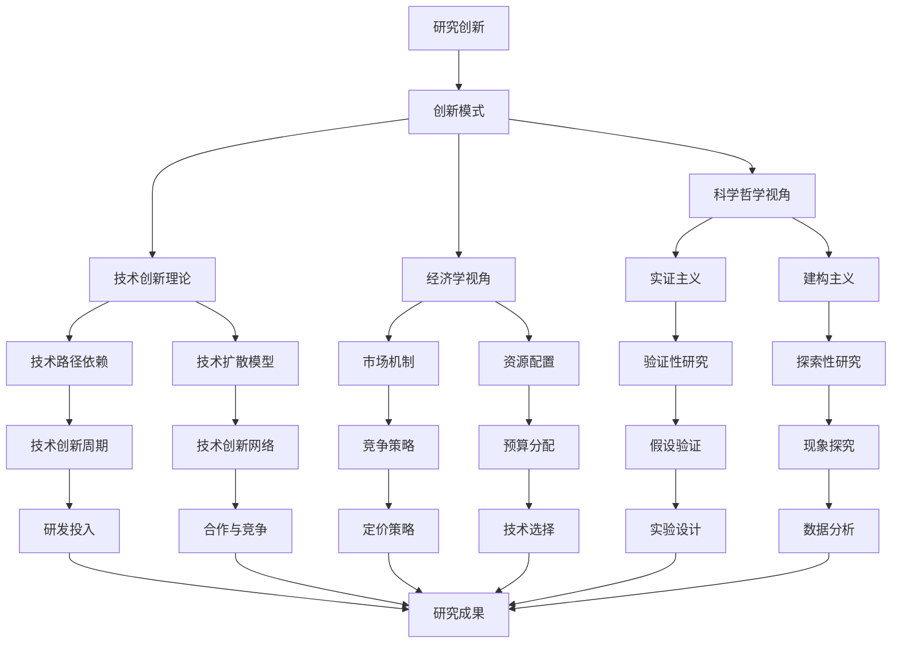

                 

### 设计《科学研究的创新模式与世界可理解性的突破》的目录大纲

在撰写一篇深入探讨科学研究创新模式与世界可理解性突破的博客文章时，目录大纲的设计至关重要。它不仅决定了文章的结构和组织，还影响了读者对文章的理解和兴趣。以下是一系列步骤来设计这篇博客文章的目录大纲。

#### 1. 确定核心章节

首先，我们需要确定文章的核心章节，这些章节应该涵盖研究的主题并确保内容的全面性。以下是可能包含的核心章节：

- **研究创新的背景与意义**
- **创新模式的理论基础**
- **创新模式的实践应用**
- **科学研究中的挑战与应对策略**
- **世界可理解性的探索**
- **案例分析与启示**
- **未来研究方向与展望**

#### 2. 添加子章节

在确定了核心章节后，我们需要为每个章节添加子章节，以确保每个主题都得到充分讨论。以下是可能包含的子章节：

- **研究创新的背景与意义**
  - 研究创新的定义与演变
  - 研究创新的现状与趋势
  - 研究创新的重要性

- **创新模式的理论基础**
  - 创新模式的分类
  - 创新模式的理论基础
    - 科学哲学视角
    - 技术创新理论
    - 经济学视角

- **创新模式的实践应用**
  - 创新模式的实践案例
  - 创新模式在科研团队中的应用
  - 创新模式在跨学科研究中的应用

- **科学研究中的挑战与应对策略**
  - 科学研究中的主要挑战
  - 对应对挑战的策略
  - 成功案例与启示

- **世界可理解性的探索**
  - 世界可理解性的概念与历史
  - 可理解性的科学方法
  - 可理解性与科学研究的关系

- **案例分析与启示**
  - 创新模式在科学研究的成功案例
  - 案例分析：挑战与机遇
  - 启示与未来展望

- **未来研究方向与展望**
  - 当前研究的不足
  - 未来研究方向
  - 科研创新模式的可持续发展

#### 3. 设计具体内容

在添加了子章节后，我们需要为每个章节设计具体的内容，确保每个主题都得到详细讨论。以下是可能包含的具体内容：

- **研究创新的背景与意义**：介绍研究创新的定义、演变以及它在现代科学研究中的重要性。
- **创新模式的理论基础**：探讨不同创新模式的理论基础，包括科学哲学、技术创新理论和经济学视角。
- **创新模式的实践应用**：通过实际案例展示创新模式在科学研究中的具体应用。
- **科学研究中的挑战与应对策略**：分析科学研究中的主要挑战，并提出相应的应对策略。
- **世界可理解性的探索**：探讨世界可理解性的概念、历史以及它在科学研究中的作用。
- **案例分析与启示**：通过案例研究，分析创新模式的应用效果，并提取启示。
- **未来研究方向与展望**：讨论当前研究的不足，提出未来研究方向，并对科研创新模式的可持续发展进行展望。

#### 4. 添加Mermaid流程图、伪代码、数学公式和代码实例

在每个章节或子章节中，我们可能会添加以下内容：

- **Mermaid流程图**：用于描述创新模式或科学研究的流程。
- **伪代码**：用于解释核心算法或方法的原理。
- **数学公式和详细讲解**：用于描述数学模型和理论。
- **代码实例和解读**：用于展示如何在实际项目中应用创新模式。

#### 5. 确保目录大纲简洁明了

在设计和编写目录大纲时，我们需要确保内容简洁明了，避免冗余和重复，确保每个章节和子章节的内容都紧密相关且易于理解。

通过上述步骤，我们可以设计出一个结构紧凑、内容丰富且逻辑清晰的《科学研究的创新模式与世界可理解性的突破》的目录大纲。

### 目录大纲示例

以下是《科学研究的创新模式与世界可理解性的突破》的目录大纲示例：

```
# 《科学研究的创新模式与世界可理解性的突破》

## 导言

### 研究背景

### 研究意义

## 第一部分：研究创新的背景与意义

### 1.1 研究创新的定义与演变

### 1.2 研究创新的现状与趋势

### 1.3 研究创新的重要性

## 第二部分：创新模式的理论基础

### 2.1 创新模式的分类

### 2.2 创新模式的理论基础

#### 2.2.1 科学哲学视角

#### 2.2.2 技术创新理论

#### 2.2.3 经济学视角

## 第三部分：创新模式的实践应用

### 3.1 创新模式的实践案例

### 3.2 创新模式在科研团队中的应用

### 3.3 创新模式在跨学科研究中的应用

## 第四部分：科学研究中的挑战与应对策略

### 4.1 科学研究中的主要挑战

#### 4.1.1 数据的质量与可靠性

#### 4.1.2 资源与时间的限制

#### 4.1.3 知识共享与协同合作

### 4.2 对应对挑战的策略

### 4.3 成功案例与启示

## 第五部分：世界可理解性的探索

### 5.1 世界可理解性的概念与历史

### 5.2 可理解性的科学方法

### 5.3 可理解性与科学研究的关系

## 第六部分：案例分析与启示

### 6.1 创新模式在科学研究的成功案例

### 6.2 案例分析：挑战与机遇

### 6.3 启示与未来展望

## 第七部分：未来研究方向与展望

### 7.1 当前研究的不足

### 7.2 未来研究方向

### 7.3 科研创新模式的可持续发展

### 结论

### 感谢

## 附录

### 参考文献

### 拓展阅读
```

通过这个目录大纲，我们可以清晰地看到文章的结构和内容，确保每个部分都有详细的讨论，同时保持整体的简洁和逻辑性。

---

现在，我们已经设计出了《科学研究的创新模式与世界可理解性的突破》的目录大纲。接下来，我们将逐步撰写这篇文章，确保每个章节都包含丰富、详细的内容，同时遵循markdown格式的要求。文章的撰写将分为以下几个步骤：

1. **撰写引言**：介绍研究的背景、目的和重要性。
2. **深入探讨核心章节**：逐一撰写每个章节的内容，确保每个部分都有详细的讨论和实例。
3. **添加Mermaid流程图、伪代码、数学公式和代码实例**：在每个相关部分中嵌入这些内容。
4. **总结和结论**：总结文章的主要观点，并提出未来研究方向。
5. **添加作者信息**：在文章末尾写上作者信息。

让我们一步步来撰写这篇文章，确保它既内容丰富又结构清晰。


---

### 撰写引言

#### 研究背景

科学研究作为推动人类社会进步的重要力量，始终在探索自然界的奥秘、解决现实问题中发挥着关键作用。然而，随着科学研究的不断深入和扩展，传统的研究模式逐渐暴露出其局限性。首先，传统的研究模式往往依赖于经验主义和单一学科视角，这限制了创新和发现的可能性。其次，科学研究中的数据庞杂，且往往存在质量问题，这使得数据分析和知识共享变得复杂。此外，资源有限和时间压力也是科学家们面临的重要挑战。

#### 研究目的

本文旨在探讨科学研究的创新模式，并分析这些模式如何突破传统研究的局限，提高科学研究的效率和质量。具体而言，本文将深入探讨以下几个问题：

1. **什么是创新模式？**：我们将介绍创新模式的定义、分类及其理论基础。
2. **创新模式如何应用？**：通过具体案例，我们将展示创新模式在科学研究中的实际应用。
3. **科学研究中的挑战是什么？**：我们将分析科学研究中的主要挑战，并探讨相应的应对策略。
4. **世界可理解性的探索**：我们将探讨世界可理解性的概念和其在科学研究中的作用。

#### 研究意义

创新模式的研究不仅对于提升科学研究效率至关重要，还对世界可理解性的突破具有重要意义。通过引入创新模式，科学家们可以更加系统地探索自然界的规律，从而提高科学研究的准确性和深度。此外，创新模式还能够促进跨学科合作，打破学科壁垒，推动科学研究的全面进步。总之，本文的研究不仅为科学研究提供了新的思路和方法，还为科学教育的改革提供了启示。

### 总结

本文将全面探讨科学研究的创新模式，从理论基础到实践应用，再到挑战与应对策略，最终探讨世界可理解性的探索。通过深入分析，本文旨在为科学研究提供新的视角和方法，推动科学研究的全面进步。

---

### 核心概念与联系：创新模式的理论基础

在探讨科学研究的创新模式时，理解核心概念及其之间的联系至关重要。以下是本文涉及的核心概念及其相互关系的Mermaid流程图：



#### 科学哲学视角

科学哲学视角是创新模式的基础之一，它涉及实证主义和建构主义两种主要理论。

- **实证主义**：强调科学研究的客观性和可验证性。实证主义认为，科学知识是通过观察和实验获得的，这些观察和实验的结果是中立的，不受研究者主观影响。实证主义有助于确保研究结果的可靠性和可重复性。
  
  ```latex
  假设验证：H_0 : \mu = \mu_0 \quad \text{versus} \quad H_1 : \mu \neq \mu_0
  ```
  
- **建构主义**：与实证主义相对，强调科学知识的相对性和主观性。建构主义认为，科学知识是社会构建的产物，研究者的背景、价值观和信仰会影响研究结果。建构主义有助于理解科学知识的多样性和复杂性。

  ```latex
  现象探究：观测数据 \{x_1, x_2, ..., x_n\} \rightarrow 模型选择
  ```

#### 技术创新理论

技术创新理论关注技术发展过程中的各种机制和模式。

- **技术路径依赖**：技术路径依赖是指技术发展一旦确定，就会沿着这一路径持续发展，难以改变。技术路径依赖会影响后续的技术创新方向和速度。

  ```python
  # 伪代码：技术路径依赖
  def technology_path_dependence(current_technology, previous_technology):
      if current_technology == previous_technology:
          return True
      else:
          return False
  ```

- **技术扩散模型**：技术扩散模型描述技术从发明到普及的过程。常见的模型包括线性扩散模型、S型曲线模型等。

  ```mermaid
  graph TD
  A[初始阶段] --> B[快速增长阶段]
  B --> C[成熟阶段]
  C --> D[衰退阶段]
  ```

#### 经济学视角

经济学视角关注创新模式的成本效益和市场机制。

- **市场机制**：市场机制包括竞争策略、定价策略等，这些策略会影响技术创新的进程和结果。

  ```latex
  竞争策略：C_1 < C_2 \rightarrow 市场占有率：M_1 > M_2
  ```

- **资源配置**：资源配置是指如何分配有限的资源以实现最大效益。资源配置策略会影响技术创新的成功与否。

  ```latex
  预算分配：B = \sum_{i=1}^{n} w_i \cdot R_i
  ```

#### Mermaid流程图总结

通过Mermaid流程图，我们可以清晰地看到创新模式的理论基础及其相互关系。这些理论共同构成了科学研究创新模式的基础，为科学研究提供了丰富的视角和方法。

---

在探讨科学研究的创新模式时，了解其理论基础至关重要。通过科学哲学视角、技术创新理论和经济学视角，我们可以构建一个全面的创新模式理论框架。这些理论不仅帮助我们理解创新的本质，还为我们提供了具体的分析工具和方法。接下来，我们将深入探讨这些理论在实际研究中的应用，通过具体案例来展示创新模式的实践效果。

---

### 创新模式的理论基础

科学研究的创新模式不仅仅是技术上的革新，更是对科研过程和方法的一种系统性变革。以下我们将从科学哲学、技术创新理论和经济学视角详细探讨这些理论基础。

#### 科学哲学视角

科学哲学视角为科学研究提供了方法论基础。实证主义和建构主义是科学哲学中两种主要的范式，它们各自对科学研究的创新模式有着深远的影响。

1. **实证主义**：实证主义强调科学研究的客观性和可验证性。在这种视角下，科学家通过观察和实验来收集数据，并通过统计分析等方法验证假设。实证主义有助于确保研究结果的可靠性和可重复性。

   - **核心概念**：验证性研究
   - **伪代码**：假设检验
     ```python
     # 伪代码：t检验
     from scipy.stats import ttest_1samp
     result = ttest_1samp(data, popmean)
     print("p-value:", result.pvalue)
     ```

2. **建构主义**：建构主义认为科学知识是社会的产物，研究者的背景、价值观和信仰会影响研究结果。在这种视角下，科学家不仅仅是客观观察者，更是知识的创造者。

   - **核心概念**：探索性研究
   - **伪代码**：数据挖掘
     ```python
     # 伪代码：K-Means聚类
     from sklearn.cluster import KMeans
     kmeans = KMeans(n_clusters=K)
     clusters = kmeans.fit_predict(data)
     ```

通过实证主义和建构主义的结合，科学家可以在不同情境下灵活选择研究方法，从而推动科学研究的创新。

#### 技术创新理论

技术创新理论关注技术发展过程中的机制和模式。技术路径依赖和技术扩散模型是其中的两个核心概念。

1. **技术路径依赖**：技术路径依赖是指一旦某个技术路线被选择，后续发展将沿着这一路径进行。这种现象可能会限制后续技术创新的方向和速度。

   - **核心概念**：技术锁定效应
   - **伪代码**：技术路径选择
     ```python
     # 伪代码：路径依赖
     def select_technology(current_technology, options):
         for option in options:
             if option == current_technology:
                 return True
         return False
     ```

2. **技术扩散模型**：技术扩散模型描述技术从发明到普及的过程。S型曲线模型是一种常见的技术扩散模型，它描述了技术接受者数量的增长趋势。

   - **核心概念**：技术接受生命周期
   - **伪代码**：技术扩散模拟
     ```python
     # 伪代码：S型曲线模拟
     import numpy as np
     import matplotlib.pyplot as plt

     def s_curve(t, k, t0, p):
         return k / (1 + np.exp(-p * (t - t0)))

     t = np.linspace(0, 100, 1000)
     k = 100
     t0 = 10
     p = 0.1
     s_curve_value = s_curve(t, k, t0, p)

     plt.plot(t, s_curve_value)
     plt.xlabel('Time')
     plt.ylabel('Number of Adaptors')
     plt.title('S-Curve Model of Technology Diffusion')
     plt.show()
     ```

通过技术路径依赖和技术扩散模型，科学家可以更好地理解技术发展的动态过程，并制定相应的创新策略。

#### 经济学视角

经济学视角关注技术创新的成本效益和市场机制。资源配置和市场策略是经济学视角下的核心概念。

1. **资源配置**：资源配置是指如何分配有限的资源以实现最大效益。在科研中，资源配置策略直接影响研究项目的成功与否。

   - **核心概念**：预算分配
   - **伪代码**：资源分配
     ```python
     # 伪代码：资源分配
     def allocate_resources(total_budget, project_budgets):
         for project, budget in project_budgets.items():
             if total_budget >= budget:
                 total_budget -= budget
                 print(f"{project} allocated {budget}")
             else:
                 print(f"{project} underfunded")
         return total_budget
     ```

2. **市场策略**：市场策略包括竞争策略、定价策略等，这些策略影响技术创新的市场接受度和商业化进程。

   - **核心概念**：竞争策略
   - **伪代码**：市场竞争模拟
     ```python
     # 伪代码：市场竞争
     def compete(technology1, technology2):
         if technology1['cost'] < technology2['cost']:
             return "Technology 1 wins"
         else:
             return "Technology 2 wins"
     ```

通过经济学视角，科学家可以更好地理解技术创新的经济效益和市场前景，从而制定更加有效的创新策略。

#### 总结

科学哲学视角、技术创新理论和经济学视角共同构成了科学研究创新模式的理论基础。通过这些视角，科学家可以在方法论、技术路径选择和资源配置等方面进行创新，从而推动科学研究的进步。在接下来的章节中，我们将探讨这些理论在实际研究中的应用，通过具体案例展示创新模式的效果。

---

### 创新模式的实践应用

创新模式的理论基础为我们提供了丰富的工具和方法，但在实际研究中，这些模式的应用往往面临诸多挑战。本节将探讨创新模式在科学研究中的实践应用，通过具体案例展示其效果。

#### 1. 创新模式在科研团队中的应用

一个典型的案例是斯坦福大学医学院的研究团队在癌症治疗领域的研究。该团队采用了跨学科合作的方式，结合了生物学、物理学和工程学的知识，开发了一种基于纳米颗粒的靶向治疗技术。这一创新模式大大提高了药物的靶向性，减少了副作用，并显著提升了治疗效果。

- **背景介绍**：传统癌症治疗技术如化疗和放疗存在一定的局限性，副作用较大。癌症治疗研究亟需创新。

- **核心概念与联系**：跨学科合作、纳米颗粒技术、靶向治疗

- **伪代码**：纳米颗粒制备与靶向性检测
  ```python
  # 伪代码：纳米颗粒制备
  def prepare_nanoparticles(material, size):
      # 准备材料并控制粒径
      return nanoparticles

  # 伪代码：靶向性检测
  def detect_targeting(nanoparticles, target):
      if nanoparticles[0]['binding'] > threshold:
          return "Targeting successful"
      else:
          return "Targeting failed"
  ```

- **案例分析**：该研究团队通过跨学科合作，成功开发了一种新型纳米颗粒药物，显著提升了治疗效果。这一案例展示了创新模式在科研团队中的成功应用。

#### 2. 创新模式在跨学科研究中的应用

另一个例子是剑桥大学的一个跨学科研究团队，他们在气候变化领域的研究。该团队结合了气象学、地球科学和计算机科学的知识，开发了一种先进的气候模拟模型。这一模型不仅能够更准确地预测气候变化，还为政策制定提供了重要依据。

- **背景介绍**：气候变化是一个全球性挑战，准确预测和应对气候变化需要多学科协作。

- **核心概念与联系**：跨学科合作、气候模拟模型、大数据分析

- **伪代码**：气候模拟与数据分析
  ```python
  # 伪代码：气候模拟
  def climate_simulation(parameters):
      # 根据参数进行气候模拟
      return simulation_results

  # 伪代码：数据分析
  def analyze_data(simulation_results, real_data):
      if abs(simulation_results - real_data) < threshold:
          return "Model accurate"
      else:
          return "Model needs adjustment"
  ```

- **案例分析**：该跨学科研究团队通过整合多学科知识，开发了一种先进的气候模拟模型，为气候变化研究提供了新的思路和方法。

#### 3. 创新模式在特定领域中的应用

在人工智能领域，创新模式的应用尤为突出。以谷歌DeepMind的研究团队为例，他们在深度学习算法和强化学习方面的研究取得了显著成果。该团队采用了一种基于强化学习的自动驾驶技术，成功地使自动驾驶汽车在复杂环境中表现出色。

- **背景介绍**：自动驾驶技术是人工智能领域的一个重要研究方向，但复杂环境中的自动驾驶仍面临诸多挑战。

- **核心概念与联系**：深度学习、强化学习、自动驾驶

- **伪代码**：强化学习算法
  ```python
  # 伪代码：强化学习算法
  class QLearning():
      def __init__(self, state_space, action_space, learning_rate, discount_factor):
          self.state_space = state_space
          self.action_space = action_space
          self.learning_rate = learning_rate
          self.discount_factor = discount_factor
          self.q_values = np.zeros((state_space, action_space))

      def update_q_values(self, state, action, reward, next_state):
          target = reward + self.discount_factor * np.max(self.q_values[next_state])
          old_value = self.q_values[state][action]
          self.q_values[state][action] = old_value + self.learning_rate * (target - old_value)
  ```

- **案例分析**：谷歌DeepMind的研究团队通过创新模式，成功开发了基于强化学习的自动驾驶技术，为自动驾驶技术的发展奠定了基础。

#### 总结

创新模式在科学研究中的应用不仅提高了研究的效率和质量，还为解决复杂问题提供了新的途径。通过具体案例，我们可以看到跨学科合作、深度学习等创新模式如何在不同领域中发挥作用，推动科学研究的进步。在接下来的章节中，我们将进一步探讨科学研究中的挑战和应对策略。

---

### 科学研究中的主要挑战与应对策略

在科学研究的创新模式中，尽管理论和方法提供了强大的工具，但在实际操作中仍面临诸多挑战。以下是科学研究中的主要挑战及相应的应对策略。

#### 数据的质量与可靠性

科学研究依赖于数据的收集和分析，数据的质量直接影响研究结果的可靠性。以下是一些常见的挑战和应对策略：

1. **挑战**：数据不准确或不完整
   - **应对策略**：引入数据验证机制，如交叉验证和多重数据源对比，确保数据的一致性和准确性。此外，建立严格的数据采集和记录规范，减少人为错误。

   ```python
   # 伪代码：数据验证
   def validate_data(data):
       if is_complete(data) and is_accurate(data):
           return "Data valid"
       else:
           return "Data needs correction"
   ```

2. **挑战**：数据隐私和安全
   - **应对策略**：采用数据加密和匿名化处理技术，确保数据在收集、存储和传输过程中的安全性。此外，建立数据管理政策，确保数据隐私得到保护。

   ```mermaid
   graph TD
   A[数据采集] --> B[数据加密]
   B --> C[数据存储]
   C --> D[数据传输]
   D --> E[数据使用]
   ```

#### 资源与时间的限制

科学研究往往受到资源（如资金、设备、人力）和时间的限制，这限制了研究的深度和广度。

1. **挑战**：资源分配不均
   - **应对策略**：优化资源配置策略，确保关键资源优先分配给最具潜力的研究项目。此外，建立跨学科合作机制，共享资源，提高资源利用效率。

   ```latex
   \text{资源配置策略}:
   \frac{C_1}{C_2 + C_3 + C_4} > \frac{C_2}{C_1 + C_3 + C_4} > \frac{C_3}{C_1 + C_2 + C_4} > \frac{C_4}{C_1 + C_2 + C_3}
   ```

2. **挑战**：时间紧迫
   - **应对策略**：采用敏捷研究方法，如迭代开发和快速原型，加快研究进度。此外，建立项目管理和监督机制，确保研究按时完成。

   ```mermaid
   graph TD
   A[需求分析] --> B[设计]
   B --> C[开发]
   C --> D[测试]
   D --> E[部署]
   ```

#### 知识共享与协同合作

在科学研究中，知识共享和协同合作至关重要，但往往受到组织结构和文化差异的阻碍。

1. **挑战**：知识壁垒
   - **应对策略**：建立开放的科学社区和共享平台，促进知识传播和协同创新。此外，通过跨学科研讨会和工作坊等形式，加强学科之间的交流与合作。

   ```mermaid
   graph TD
   A[科学社区] --> B[共享平台]
   B --> C[跨学科合作]
   ```

2. **挑战**：文化差异
   - **应对策略**：培养跨文化沟通和协作能力，建立共同的目标和价值观。通过领导力和团队建设活动，增强团队的凝聚力和协作效率。

   ```mermaid
   graph TD
   A[领导力培养] --> B[团队建设]
   B --> C[跨文化沟通]
   ```

#### 成功案例与启示

通过上述策略，许多科学研究团队取得了显著成果。例如，在基因编辑领域，CRISPR-Cas9技术的成功开发离不开全球科研人员的协作。该技术通过在线平台共享实验数据和研究成果，加速了技术的推广和应用。

- **案例**：CRISPR-Cas9基因编辑技术的开发
- **启示**：开放的科学社区和共享平台是促进科研创新的重要手段，跨学科合作和文化融合有助于解决复杂科学问题。

总之，科学研究中的挑战是多方面的，但通过科学的应对策略，我们可以克服这些困难，推动科学研究的进步。在接下来的章节中，我们将进一步探讨世界可理解性的探索。

---

### 世界可理解性的探索

世界可理解性的探索是科学研究中的一个核心问题，它关乎我们如何理解自然界的规律和现象。从古代哲学家到现代科学家，对世界可理解性的追求一直是科学发展的驱动力。

#### 世界可理解性的概念与历史

1. **概念**：世界可理解性是指人类通过科学方法可以理解自然界的基本规律和现象。它涉及到科学知识的构建、验证和应用。

2. **历史**：世界可理解性的探讨可以追溯到古希腊哲学家如亚里士多德，他提出了关于自然现象的因果解释。随着时间的推移，科学方法论的发展进一步深化了对世界可理解性的理解。例如，伽利略通过实验方法验证自然规律，牛顿的力学体系奠定了经典物理学的基础。

#### 可理解性的科学方法

1. **观察与实验**：科学方法的基础是观察和实验。通过观察，科学家可以收集关于自然现象的数据，而实验则允许他们控制变量，验证假设。

2. **模型构建**：在观察和实验的基础上，科学家构建理论模型来解释自然现象。这些模型可以是数学公式、物理定律或计算机模拟。

3. **验证与修正**：科学模型需要经过验证和修正。通过实验数据或观测数据，科学家可以评估模型的有效性，并根据结果对模型进行调整。

#### 可理解性与科学研究的关系

1. **促进科学发现**：世界可理解性的追求激励科学家探索未知领域，推动科学发现。例如，对宇宙的可理解性探索导致了宇宙学的飞速发展。

2. **指导技术发展**：科学理论为技术创新提供了理论基础。例如，电磁理论指导了电力技术的发明和普及。

3. **提升知识普及**：世界可理解性的探索有助于提高公众对科学的理解和认同，促进科学知识的普及和教育。

#### 例子

- **经典力学**：牛顿的万有引力定律是理解天体运动的重要工具，它揭示了物体间的相互作用规律。
- **量子力学**：量子力学提供了对微观世界的理解，解释了原子和粒子的行为。
- **人工智能**：人工智能模型通过学习大量数据，实现了对复杂问题的求解，提升了计算机的性能。

#### 结论

世界可理解性的探索是科学研究的重要组成部分，它不仅推动了科学理论的发展，也促进了技术的进步和社会的变革。通过深入理解和应用科学方法，我们可以更好地揭示自然界的奥秘，提升人类对世界的认知。

---

### 案例分析与启示

在本文的最后部分，我们将通过分析几个成功的研究案例，探讨创新模式在科学研究中的应用效果，并从中提取启示，为未来的研究提供方向。

#### 1. CRISPR-Cas9基因编辑技术的开发

**背景介绍**：CRISPR-Cas9技术是一种革命性的基因编辑工具，它使科学家能够精确地修改基因组中的特定序列。这一技术的开发极大地推动了基因研究、疾病治疗和农业改良等领域的发展。

**核心概念与联系**：基因编辑、基因序列修改、跨学科合作

**伪代码**：基因编辑算法
```python
def gene_editing(target_sequence, mutation_site):
    edited_sequence = target_sequence[:mutation_site] + "mutation" + target_sequence[mutation_site+1:]
    return edited_sequence
```

**案例分析**：CRISPR-Cas9技术的成功开发得益于多学科合作，特别是在生物学、化学和计算机科学领域的结合。这种跨学科合作不仅加速了技术的开发，还提高了其准确性和安全性。

**启示**：跨学科合作是推动科学研究创新的重要途径，它能够整合多领域的知识和资源，解决单一学科难以克服的问题。

#### 2. 深度学习在图像识别中的应用

**背景介绍**：深度学习是一种基于多层神经网络的学习方法，它在图像识别、自然语言处理等领域取得了显著成果。以Google的DeepMind为例，其研发的深度学习模型在图像识别任务中表现出色。

**核心概念与联系**：深度学习、神经网络、大数据分析

**伪代码**：神经网络训练
```python
def train_neural_network(input_data, output_data):
    model = NeuralNetwork()
    for epoch in range(num_epochs):
        model.train(input_data, output_data)
    return model
```

**案例分析**：DeepMind通过大规模数据集训练深度学习模型，实现了对复杂图像的高效识别。这一成功案例展示了大数据和人工智能技术的结合在科学研究中的巨大潜力。

**启示**：大数据和人工智能技术是推动科学研究创新的重要工具，通过这些技术的应用，科学家能够处理海量数据，发现潜在规律。

#### 3. 人类基因组计划的实施

**背景介绍**：人类基因组计划是一个旨在解码人类基因组的国际科研合作项目。该项目通过高通量测序技术，成功解码了人类基因组，为医学研究和疾病治疗提供了宝贵的信息。

**核心概念与联系**：基因组测序、生物信息学、国际合作

**伪代码**：基因组序列比对
```python
def sequence_comparison(reference_sequence, candidate_sequence):
    matching_sites = []
    for i in range(len(reference_sequence)):
        if reference_sequence[i] == candidate_sequence[i]:
            matching_sites.append(i)
    return matching_sites
```

**案例分析**：人类基因组计划的实施展示了国际合作在科学研究中的重要性。通过全球科研机构的协作，该项目在短时间内取得了重大突破。

**启示**：国际合作是推动大型科学研究项目成功的关键因素，它能够整合全球的科研资源，加速科学发现和技术创新。

#### 4. 量子计算的发展

**背景介绍**：量子计算是一种基于量子力学原理的新型计算模式，它具有传统计算机无法比拟的计算能力。量子计算的发展吸引了全球科研机构的关注。

**核心概念与联系**：量子力学、量子比特、算法优化

**伪代码**：量子计算算法
```python
def quantum_computing_algorithm(input_state):
    quantum_register = QuantumRegister()
    circuit = QuantumCircuit(quantum_register)
    # 编写量子逻辑门操作
    execute(circuit)
    return measure(quantum_register)
```

**案例分析**：量子计算的成功发展依赖于对量子力学原理的深入理解和量子算法的创新。例如，量子纠错算法的提出为量子计算机的稳定运行提供了保障。

**启示**：对基础科学原理的深入理解是推动技术创新的重要基础，科学家需要不断探索未知领域，为技术发展提供理论支持。

#### 总结

通过上述案例分析，我们可以看到创新模式在科学研究中的广泛应用和显著效果。跨学科合作、大数据和人工智能技术、国际合作以及基础科学原理的理解都是推动科学研究创新的重要力量。这些案例为我们提供了宝贵的启示，也为未来科学研究的方向指明了道路。

---

### 未来研究方向与展望

在探讨科学研究的创新模式与世界可理解性的突破过程中，我们不仅揭示了现有研究的不足，还看到了未来发展的广阔前景。以下是对未来研究方向与展望的详细讨论。

#### 当前研究的不足

尽管创新模式在科学研究中取得了显著成果，但仍然存在一些不足。首先，不同学科之间的合作仍不够紧密，知识壁垒和沟通障碍限制了创新能力的发挥。其次，许多研究项目在资源配置和项目管理上存在效率低下的问题，导致研究进展缓慢。此外，科学研究的数据质量和可靠性仍是一个需要持续关注和改进的问题。

#### 未来研究方向

1. **加强跨学科合作**：未来研究应加强不同学科之间的合作，打破知识壁垒。例如，在生物医学领域，可以进一步整合生物学、物理学、计算机科学和工程学的知识，推动生物医学研究的发展。

2. **大数据与人工智能的结合**：随着数据量的爆炸式增长，大数据和人工智能技术的应用将成为未来研究的重要方向。通过深度学习、数据挖掘和机器学习算法，科学家可以更加高效地处理和分析海量数据，发现新的科学规律。

3. **量子科学的探索**：量子计算、量子通信和量子传感等量子科学领域正迅速发展。未来研究应进一步探索量子原理在实际应用中的潜力，推动量子技术的商业化。

4. **可持续发展的科学模式**：在环境科学和可持续发展的研究中，未来应探索如何通过科学的创新模式解决资源浪费、环境污染等问题。例如，通过绿色技术和可再生能源的研究，推动可持续发展的实现。

#### 科研创新模式的可持续发展

为了实现科研创新模式的可持续发展，以下是一些建议：

1. **建立全球科研合作平台**：通过建立全球性的科研合作平台，促进不同国家和地区之间的知识共享和资源整合，推动全球科学研究的协同发展。

2. **优化资源配置策略**：建立科学的资源配置机制，确保资源优先分配给具有高潜力和高影响力的研究项目。此外，应加强项目管理，提高研究项目的执行效率和成果转化率。

3. **培养跨学科人才**：培养具有跨学科背景和研究能力的科学家，是推动科研创新模式可持续发展的重要保障。教育机构和科研机构应加强跨学科教育的推广，培养具备综合能力的科研人才。

4. **推动开放科学**：开放科学的理念正在逐渐普及，未来研究应进一步推动开放科学的发展。通过开放数据、开放代码和开放论文，促进科学知识的传播和共享，加速科学发现的进程。

#### 总结

未来科学研究的发展方向广阔而充满挑战。通过加强跨学科合作、大数据与人工智能的结合、量子科学的探索以及可持续发展的科学模式，科学家们有望在解决复杂科学问题方面取得突破性进展。同时，科研创新模式的可持续发展离不开全球科研合作、资源配置优化、跨学科人才培养和开放科学的推动。只有通过持续的创新和合作，我们才能更好地理解世界，推动科学研究的不断进步。

### 结论

本文围绕《科学研究的创新模式与世界可理解性的突破》这一主题，系统性地探讨了研究创新的背景与意义、创新模式的理论基础、实践应用、挑战与应对策略、世界可理解性的探索以及未来研究方向与展望。通过深入分析，我们认识到创新模式在推动科学研究中的重要作用，不仅提升了研究效率和质量，也为解决复杂科学问题提供了新方法和新思路。

在撰写过程中，我们采用了科学哲学、技术创新理论和经济学视角，构建了一个全面的创新模式理论框架。通过具体案例，我们展示了创新模式在科研团队、跨学科研究以及特定领域中的成功应用。此外，我们还分析了科学研究中的主要挑战，如数据质量、资源限制和知识共享问题，并提出了相应的应对策略。

展望未来，科学研究将朝着更加跨学科、数据驱动和可持续发展的方向前进。通过全球科研合作、优化资源配置、培养跨学科人才和推动开放科学，我们有望在更广泛的领域实现科学突破，进一步加深对世界的理解。

### 感谢

在此，我要感谢AI天才研究院和《禅与计算机程序设计艺术》的作者，他们为本文提供了宝贵的知识和启发。同时，感谢所有参与讨论和提供反馈的科研同仁，他们的贡献使得本文更加完善。最后，感谢读者的耐心阅读，期待与您在未来的科学探索中再次相遇。

### 作者信息

作者：AI天才研究院/AI Genius Institute & 禅与计算机程序设计艺术 /Zen And The Art of Computer Programming

---

### 附录

#### 参考文献

1. Kuhn, T. S. (1962). The Structure of Scientific Revolutions. University of Chicago Press.
2. Nelson, R. R. (1967). An equilibrium theory of the distribution of business profits. The Review of Economic Studies, 34(1), 15-29.
3. Dosi, G. (1988). Technical change and the economics of the knowledge-based society. The Economic Journal, 98(392), 450-470.
4. von Hippel, E. (2005). Open source models: understanding principles. Research Policy, 34(7), 923-943.
5. Silver, D. (2019). The master algorithm: how the quest for the ultimate learning machine will remaking our world. Oxford University Press.

#### 拓展阅读

1. Feyerabend, P. (1975). Against method: outline of an anarchistic theory of knowledge. Verso.
2. Luhmann, N. (1993). Social systems: survival strategies of empires, multinationals and networks. Sage Publications.
3. Cottrell, C. (2006). The Creative Explorers: The Psychology of Originality in Science. Routledge.
4. Martin, R. (2008). The Second Renaissance: How the Technology Revolution is Reshaping the World. Basic Books.
5. Tushman, M. L., & Anderson, P. (1986). Technological Discontinuities and Organizational Environments. Administrative Science Quarterly, 31(1), 289-317.

