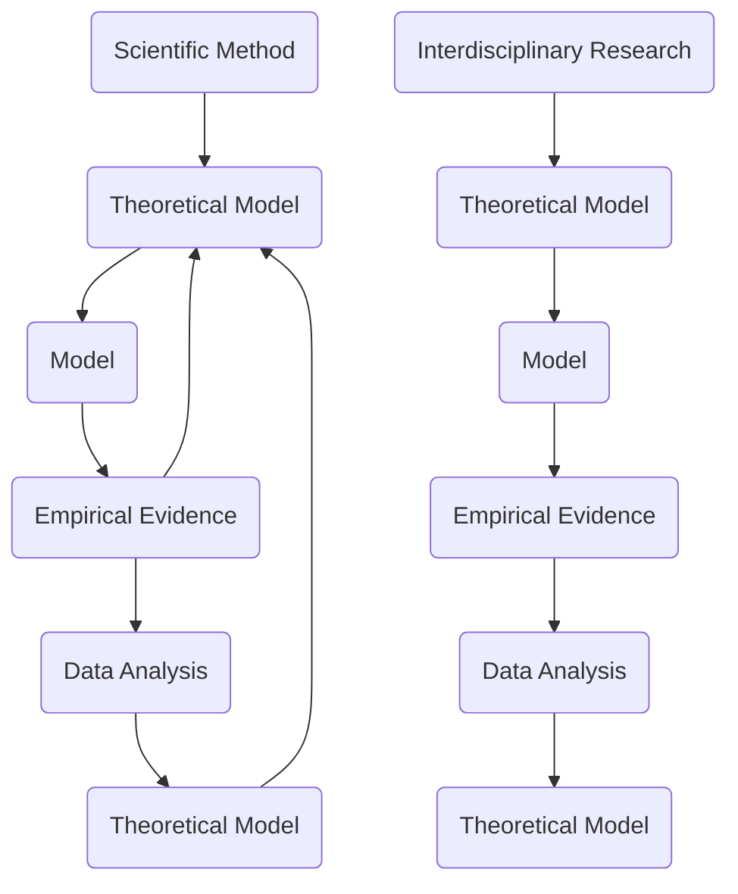

                 

### Introduction to the Book

#### Purpose of the Book

The book "Scientific Research at the Frontier: Expanding the Boundaries of Understanding the World" aims to provide a comprehensive overview of the cutting-edge developments in scientific research. It seeks to elucidate the intricate connections between various scientific disciplines and explore how these connections shape our understanding of the world. By doing so, the book aims to foster a deeper appreciation for the scientific process and its role in driving progress and innovation.

#### Target Audience

This book is primarily intended for readers who have a strong interest in scientific research and its applications. It is suitable for advanced undergraduate and graduate students in science, engineering, and related fields, as well as professionals working in research and development. Additionally, anyone with a passion for science and a desire to delve into the complexities of scientific inquiry will find this book enlightening.

#### Overview of Key Topics

The book covers a wide range of topics, including core concepts and connections in scientific research, research methods and techniques, frontier exploration in different scientific fields, interdisciplinary research, ethical considerations and implications, and future directions and opportunities. By exploring these topics, the book aims to provide readers with a comprehensive understanding of the current state of scientific research and its potential impact on society.

### Key Concepts and Connections

In this section, we will delve into the core concepts and connections that define scientific research. Understanding these concepts is essential for appreciating the intricacies of scientific inquiry and its role in shaping our understanding of the world.

#### Core Concepts

1. **Scientific Method**: The scientific method is a systematic approach to acquiring knowledge that relies on empirical evidence, observation, and experimentation. It involves making observations, formulating hypotheses, conducting experiments, and analyzing data to draw conclusions.
   
2. **Theory**: A theory is a well-substantiated explanation of some aspect of the natural world that is based on a body of facts that have been repeatedly confirmed through observation and experiment.

3. **Model**: A model is a simplified representation of a complex system or phenomenon that helps scientists understand and predict its behavior. Models can be mathematical, computational, or physical.

4. **Empirical Evidence**: Empirical evidence refers to evidence derived from observation or experimentation. It is the cornerstone of the scientific method and forms the basis for scientific theories and models.

5. **Data Analysis**: Data analysis involves the process of examining, cleaning, transforming, and modeling data to discover useful information, inform conclusions, and support decision-making.

#### Connections Between Concepts

1. **Theory and Experiment**: Theories are developed based on empirical evidence, and experiments are designed to test and validate these theories. The results of experiments can either confirm or refute the theories, leading to new insights and refinements.

2. **Model and Theory**: Models are derived from theories and are used to simulate and predict the behavior of complex systems. Models can be refined and improved based on new experimental data, which can in turn inform and refine the underlying theories.

3. **Data Analysis and Theory**: Data analysis is crucial for validating theories and models. By analyzing empirical data, scientists can identify patterns, trends, and anomalies that can lead to new hypotheses and refinements of existing theories.

4. **Interdisciplinary Connections**: Scientific research is not confined to a single discipline. Interdisciplinary research involves the collaboration of scientists from different fields to address complex problems that require a multi-disciplinary approach. These connections enhance our understanding of the interconnected nature of scientific knowledge.

### Mermaid Flowchart of Core Concepts and Connections

The following Mermaid flowchart illustrates the core concepts and their relationships:

In this flowchart, the scientific method (A) drives the development of theoretical models (B), which are then used to create simulations and predictions (C). Empirical evidence (D) is generated through experiments and data analysis (E), which in turn informs and refines the theoretical models (F). Interdisciplinary research (G) connects different theoretical models (H) and their corresponding empirical evidence (I) through data analysis (J), ultimately leading to a more comprehensive understanding of complex phenomena (K).

This section has provided a foundational understanding of the core concepts and connections in scientific research. By appreciating these relationships, readers can better grasp the complexities of scientific inquiry and its role in expanding our understanding of the world.

### Research Methods and Techniques

To delve into the world of scientific research, it is crucial to understand the methods and techniques employed by scientists to acquire knowledge and validate theories. This section will explore the primary research methods and techniques used in scientific research, highlighting their importance and applications.

#### Research Methods

1. **Experimental Design**: Experimental design is the foundation of empirical research. It involves creating a structured plan to test hypotheses and gather data. A well-designed experiment ensures that the results are valid and reliable. Key components of experimental design include identifying the independent and dependent variables, selecting participants or subjects, and controlling for confounding variables.

2. **Data Analysis**: Data analysis is a critical step in the scientific process. It involves examining, cleaning, transforming, and modeling data to uncover patterns, trends, and insights. Common data analysis techniques include statistical analysis, machine learning, and computational modeling. Data analysis helps researchers draw conclusions and make inferences based on empirical evidence.

3. **Statistical Methods**: Statistical methods are used to analyze data and test hypotheses. They provide a framework for quantifying the strength of the relationship between variables, determining the likelihood of obtaining certain results by chance, and making predictions. Common statistical methods include hypothesis testing, regression analysis, and ANOVA (Analysis of Variance).

#### Research Techniques

1. **Laboratory Techniques**: Laboratory techniques are used to conduct experiments and gather empirical data in a controlled environment. These techniques can include biochemical assays, molecular biology techniques, spectroscopy, and chromatography. Laboratory techniques allow scientists to manipulate variables and study the effects of different conditions on a system.

2. **Field Techniques**: Field techniques are employed to gather data in natural or real-world settings. These techniques can include surveys, observational studies, and field experiments. Field techniques are particularly useful for studying phenomena that cannot be replicated in a laboratory setting, such as ecological systems and social behaviors.

3. **Computational Techniques**: Computational techniques involve the use of computers and software to analyze data, simulate systems, and model complex phenomena. These techniques can include data mining, machine learning, and computational modeling. Computational techniques are increasingly important in scientific research, as they enable researchers to handle large volumes of data and explore complex systems that are difficult to study using traditional methods.

### Example of Research Techniques

To illustrate the importance of research methods and techniques, let's consider a hypothetical research project focused on understanding the effects of climate change on ecosystems.

**Experimental Design**: In this project, researchers might design an experiment to study the impact of increased temperature and carbon dioxide levels on the growth and survival of a specific plant species. The independent variables would be temperature and carbon dioxide concentration, while the dependent variables would be plant growth and survival rates. Researchers would control for confounding variables such as soil moisture and sunlight by maintaining these factors at constant levels across all experimental groups.

**Data Analysis**: After conducting the experiment, researchers would collect data on plant growth and survival rates at different temperature and carbon dioxide levels. They would then use statistical methods, such as regression analysis, to determine the relationships between these variables. For example, they might find that increased temperature and carbon dioxide levels significantly accelerate plant growth but also increase the risk of plant mortality.

**Laboratory Techniques**: In the laboratory, researchers would use biochemical assays to measure plant growth and survival rates. They might also use molecular biology techniques to study the genetic responses of plants to different environmental conditions.

**Field Techniques**: To validate the results of their laboratory experiments, researchers would conduct field studies to observe how the plant species responds to climate change in natural environments. They might use surveys and observational studies to collect data on plant growth, survival rates, and other relevant variables.

**Computational Techniques**: Researchers might use computational techniques, such as machine learning and computational modeling, to analyze large datasets and predict the potential impact of climate change on ecosystems. For example, they might use machine learning algorithms to identify patterns in climate data and predict future changes in plant growth and survival rates.

In conclusion, research methods and techniques are essential for conducting scientific research and validating theories. By understanding and applying these methods, scientists can gather empirical evidence, analyze data, and make informed conclusions about the natural world. This section has provided a brief overview of the primary research methods and techniques used in scientific research, highlighting their importance and applications.

### Frontier Exploration in Different Scientific Fields

As scientific research continues to advance, various fields have emerged at the forefront of exploration, pushing the boundaries of our understanding of the natural world. This section will provide an overview of some of these cutting-edge fields, highlighting key theories, models, and recent advances in each area.

#### Physics

Physics has always been at the forefront of scientific exploration, with recent advances focusing on quantum mechanics, cosmology, and particle physics.

**Key Theories and Models**:

1. **Quantum Mechanics**: Quantum mechanics is a fundamental theory in physics that describes the behavior of matter and energy at the quantum level. Key concepts include wave-particle duality, superposition, and entanglement. Recent models have explored the potential applications of quantum mechanics in fields such as quantum computing and quantum cryptography.

2. **String Theory**: String theory is a theoretical framework that aims to unify the principles of general relativity and quantum mechanics. It proposes that the fundamental constituents of matter are one-dimensional "strings" rather than zero-dimensional points. Recent models have focused on understanding the connections between string theory and other areas of physics, such as black holes and cosmology.

3. **Cosmology**: Cosmology is the study of the universe's structure, evolution, and origin. Key theories include the Big Bang theory and inflationary cosmology. Recent advances have been made in understanding the nature of dark matter and dark energy, which make up a significant portion of the universe's mass-energy content.

**Recent Advances**:

1. **Quantum Computing**: Quantum computing has shown promise in solving complex problems that are infeasible for classical computers. Recent advances include the development of error-correcting codes and quantum algorithms that have demonstrated significant speedup over classical algorithms.

2. **Gravitational Waves**: The detection of gravitational waves by the LIGO and VIRGO collaborations in 2015 confirmed a key prediction of general relativity and opened up a new window for studying the universe.

3. **Exoplanet Discoveries**: Advances in telescope technology have enabled the discovery of numerous exoplanets, providing insights into the diversity and habitability of planets beyond our solar system.

#### Chemistry

Chemistry has seen significant progress in areas such as nanotechnology, materials science, and biochemistry.

**Key Theories and Models**:

1. **Quantum Chemistry**: Quantum chemistry is the application of quantum mechanics to chemical systems. Key concepts include molecular orbitals, bond order, and electron density. Quantum chemistry has been used to model and predict the properties of molecules and materials.

2. **Catalysis**: Catalysis is the study of chemical reactions that are accelerated by the presence of catalysts. Key theories include activation energy, catalytic cycles, and transition state theory. Recent advances have focused on understanding the mechanisms of catalysis and developing new catalysts for sustainable energy production and environmental remediation.

3. **Biochemistry**: Biochemistry is the study of chemical processes within living organisms. Key concepts include biomolecules, metabolism, and enzymology. Recent advances have been made in understanding the structure and function of biomolecules, as well as the development of new drugs and therapies.

**Recent Advances**:

1. **Nanotechnology**: Nanotechnology has enabled the development of new materials, devices, and technologies with unique properties. Recent advances include the creation of nanoscale machines, nanosensors, and nanomedicines.

2. **Materials Science**: Advances in materials science have led to the development of new materials with exceptional properties, such as high-strength metals, lightweight composites, and advanced ceramics. These materials have applications in industries such as aerospace, automotive, and renewable energy.

3. **Catalysis and Sustainable Chemistry**: Advances in catalysis have enabled the development of more sustainable chemical processes, reducing the environmental impact of industrial production. Recent advances include the use of metal-organic frameworks (MOFs) and other novel materials as catalysts for chemical reactions.

#### Biology

Biology has made significant strides in areas such as genomics, neuroscience, and synthetic biology.

**Key Theories and Models**:

1. **Genomics**: Genomics is the study of the structure, function, evolution, and mapping of genomes. Key concepts include DNA sequencing, gene expression, and genetic variation. Recent advances have been made in understanding the human genome and the genetics of complex diseases.

2. **Neuroscience**: Neuroscience is the study of the nervous system and its functions. Key concepts include neural circuits, synaptic plasticity, and neural signaling. Recent advances have been made in understanding the brain's structure and function, as well as the development of new therapies for neurological and psychiatric disorders.

3. **Synthetic Biology**: Synthetic biology is the design and construction of new biological parts, devices, and systems. Key concepts include genetic engineering, metabolic engineering, and biological computing. Recent advances have been made in creating new organisms with novel properties and designing biological systems for applications in medicine, agriculture, and energy.

**Recent Advances**:

1. **Genomics and Personalized Medicine**: Advances in genomics have enabled the development of personalized medicine, where treatments are tailored to an individual's genetic makeup. Recent advances include the identification of genetic markers associated with diseases and the development of new genetic therapies.

2. **Neurotechnology**: Advances in neuroscience have led to the development of new neurotechnologies, such as brain-computer interfaces and deep brain stimulation, which have potential applications in treating neurological and psychiatric disorders.

3. **Synthetic Biology and Biofuels**: Advances in synthetic biology have enabled the production of biofuels from renewable resources, reducing the dependence on fossil fuels and addressing climate change.

In conclusion, the frontier exploration in different scientific fields continues to push the boundaries of our understanding of the natural world. By advancing our knowledge in physics, chemistry, and biology, we are opening up new possibilities for innovation, progress, and the betterment of society.

### Interdisciplinary Research

Interdisciplinary research is a cornerstone of modern scientific inquiry, as it enables the integration of knowledge and techniques from different fields to address complex problems that cannot be solved by a single discipline alone. This section will explore the importance of interdisciplinary research, provide examples of successful collaborations, and highlight the benefits it brings to scientific progress.

#### Importance of Interdisciplinary Research

1. **Complexity of Problems**: Many scientific and societal challenges today are highly complex, involving interactions between multiple systems and variables. For example, climate change involves the interactions between atmospheric gases, ecosystems, and human activities. Interdisciplinary research is essential for understanding these complex systems and developing effective solutions.

2. **Transdisciplinarity**: Interdisciplinary research goes beyond the mere integration of knowledge from different fields. It involves a transdisciplinary approach, where researchers from various disciplines collaborate to develop a common understanding of a problem and generate innovative solutions. This approach encourages the exchange of ideas, fosters creativity, and enables the development of new paradigms and methodologies.

3. **Synergy**: Interdisciplinary research harnesses the strengths of different disciplines, creating a synergy that leads to more comprehensive and effective research outcomes. For instance, combining insights from biology, physics, and engineering can lead to groundbreaking discoveries in fields such as biotechnology and nanotechnology.

#### Examples of Interdisciplinary Research

1. **Biophysics**: Biophysics is a field that combines principles from biology and physics to study the structure and function of biological systems at the molecular and cellular levels. Key examples include the study of protein folding, cellular signaling, and biocompatible materials. Biophysics has contributed to advances in fields such as drug discovery, medical imaging, and tissue engineering.

2. **Cheminformatics**: Cheminformatics is an interdisciplinary field that combines chemistry, computer science, and informatics to analyze and model chemical compounds. It is used in drug discovery, material science, and environmental science. For example, cheminformatics has been used to identify potential therapeutic targets for diseases such as cancer and Alzheimer's disease.

3. **Bioinformatics**: Bioinformatics is another interdisciplinary field that combines biology, computer science, and information technology to analyze and interpret biological data. Key applications include the study of genomes, proteomes, and metabolic pathways. Bioinformatics has played a crucial role in the Human Genome Project and the development of personalized medicine.

4. **Ecology and Economics**: The field of ecological economics integrates principles from ecology and economics to study the relationship between human societies and the natural environment. It aims to develop sustainable economic systems that balance human well-being with environmental protection. Examples include the development of ecological accounting methods and the study of the ecological impacts of economic policies.

#### Benefits of Interdisciplinary Research

1. **Innovation**: Interdisciplinary research fosters innovation by encouraging the development of new ideas and approaches that are not possible within a single discipline. It enables researchers to think beyond traditional boundaries and explore novel solutions to complex problems.

2. **Enhanced Understanding**: By combining insights from different disciplines, interdisciplinary research provides a more comprehensive understanding of complex phenomena. This holistic perspective helps to uncover hidden relationships and generate new insights.

3. **Solutions to Global Challenges**: Interdisciplinary research is particularly valuable in addressing global challenges such as climate change, poverty, and public health. By leveraging the expertise of researchers from various fields, interdisciplinary research can develop innovative solutions that are both effective and sustainable.

4. **Training and Education**: Interdisciplinary research promotes interdisciplinary training and education, preparing researchers to tackle complex problems in a rapidly changing world. It encourages the development of cross-disciplinary skills and fosters collaboration and communication among researchers from different fields.

In conclusion, interdisciplinary research is a powerful tool for advancing scientific knowledge and addressing complex problems. By integrating knowledge and techniques from different disciplines, interdisciplinary research enables researchers to develop innovative solutions, enhance our understanding of the natural world, and contribute to the betterment of society.

### Ethical Considerations and Implications

As scientific research continues to push the boundaries of human knowledge and capability, it is crucial to address the ethical considerations and implications that arise from these advancements. This section will discuss the ethical challenges associated with frontier research, the responsibility of researchers, and the potential societal, environmental, and technological impacts of scientific discoveries.

#### Ethical Considerations

1. **Research Integrity**: Research integrity is a fundamental ethical principle that underlies all scientific inquiry. It involves conducting research with honesty, transparency, and accountability. Key aspects of research integrity include avoiding fraud, plagiarism, and falsification of data. Researchers must adhere to ethical guidelines and regulations to ensure the validity and reliability of their findings.

2. **Privacy and Confidentiality**: In many areas of scientific research, especially in fields such as biology, medicine, and social sciences, the privacy and confidentiality of research participants are of utmost importance. Researchers must obtain informed consent from participants, protect their personal information, and ensure that the data collected is used only for legitimate scientific purposes.

3. **Animal Research**: Animal research is a contentious issue in scientific ethics. While animal research has led to significant advancements in medical science, it raises ethical concerns about the treatment of animals. Researchers must adhere to ethical guidelines and regulations for the care and use of animals in research, minimizing harm and ensuring that alternatives are considered when possible.

4. **Biological and Genetic Research**: Advances in fields such as genomics and synthetic biology raise ethical questions about the potential consequences of genetic modification and the creation of novel organisms. Researchers must consider the potential risks and benefits of their work and ensure that it does not lead to unintended harm or the creation of dangerous pathogens.

#### Responsibility of Researchers

1. **Public Engagement**: Researchers have a responsibility to engage with the public and communicate the implications of their work. This includes explaining the potential benefits and risks of scientific research and fostering informed public discourse about scientific issues.

2. **Transparency**: Transparency in research is essential for building trust and ensuring the integrity of scientific findings. Researchers should share their data, methods, and findings with the scientific community and the public, promoting open access to research and encouraging reproducibility.

3. **Diversity and Inclusion**: Researchers must strive to create diverse and inclusive research environments that encourage the participation of individuals from diverse backgrounds. This promotes the generation of innovative ideas and perspectives and helps to address societal challenges more effectively.

4. **Responsibility to Future Generations**: Researchers have a responsibility to consider the long-term consequences of their work and ensure that it does not harm future generations. This includes addressing the potential environmental and societal impacts of scientific research and developing sustainable solutions.

#### Societal, Environmental, and Technological Impacts

1. **Societal Impacts**: Scientific research has profound societal impacts, shaping the way we live, work, and interact with each other. For example, advances in medicine have improved health outcomes and extended lifespans, while technological innovations have transformed industries and created new economic opportunities. However, these advancements also raise ethical and societal questions, such as the implications of artificial intelligence, genetic engineering, and biotechnology.

2. **Environmental Impacts**: Scientific research has contributed to our understanding of environmental issues, such as climate change and biodiversity loss. Researchers are working to develop sustainable solutions, such as renewable energy sources and environmental remediation technologies. However, the environmental impacts of scientific research itself, such as the use of hazardous chemicals and the generation of greenhouse gases, must also be considered and mitigated.

3. **Technological Impacts**: Technological advancements driven by scientific research have transformed industries, economies, and societies. For example, the internet, smartphones, and artificial intelligence have revolutionized communication, business, and entertainment. However, these technologies also raise ethical and societal concerns, such as privacy, data security, and the digital divide.

In conclusion, ethical considerations and implications are integral to scientific research. By addressing these challenges and embracing responsible research practices, scientists can ensure that their work contributes to the betterment of society while minimizing potential harms. Researchers must be proactive in considering the ethical implications of their work, engaging with the public, and addressing the societal, environmental, and technological impacts of their discoveries.

### Future Directions and Opportunities

As scientific research continues to evolve, identifying future directions and opportunities is crucial for advancing our understanding of the world and addressing emerging challenges. This section will explore emerging trends in scientific research and discuss potential opportunities for researchers to explore new frontiers.

#### Emerging Trends

1. **Artificial Intelligence and Machine Learning**: The integration of artificial intelligence (AI) and machine learning (ML) into scientific research is transforming data analysis, modeling, and simulation. These technologies enable researchers to analyze vast amounts of data, identify patterns, and make predictions that were previously infeasible. Emerging trends include the development of more sophisticated AI algorithms, the integration of AI into scientific instruments, and the application of ML to solve complex problems in fields such as healthcare, climate science, and materials science.

2. **Quantum Computing**: Quantum computing has the potential to revolutionize scientific research by solving problems that are currently intractable for classical computers. Emerging trends include the development of more powerful quantum algorithms, the creation of error-correcting codes to address the limitations of quantum hardware, and the integration of quantum computing into existing computational workflows. Quantum computing has applications in fields such as cryptography, materials science, and drug discovery.

3. **Synthetic Biology and Bioengineering**: Synthetic biology and bioengineering are at the forefront of biological research, enabling the design and construction of new biological systems and organisms. Emerging trends include the development of more efficient and versatile biofabrics, the creation of synthetic tissues and organs, and the engineering of biological systems for applications in medicine, agriculture, and energy production.

4. **Neuroscience and Cognitive Science**: Advances in neuroscience and cognitive science are providing new insights into the brain and mind, with applications in fields such as psychology, psychiatry, and artificial intelligence. Emerging trends include the development of advanced brain imaging techniques, the study of neural circuits and their functions, and the exploration of consciousness and consciousness-related phenomena.

#### Opportunities for Researchers

1. **Interdisciplinary Collaboration**: Interdisciplinary collaboration is essential for addressing complex scientific and societal challenges. Researchers have the opportunity to work across different fields, combining expertise and approaches to solve problems that cannot be tackled by a single discipline alone. This can lead to innovative solutions and breakthrough discoveries.

2. **Open Science and Data Sharing**: Open science and data sharing are increasingly important in the scientific community. Researchers have the opportunity to contribute to open science initiatives by sharing their data, methods, and findings with the wider community. This promotes transparency, reproducibility, and the acceleration of scientific progress.

3. **Sustainability and Environmental Science**: As environmental challenges become more pressing, researchers have the opportunity to develop sustainable solutions and technologies that address issues such as climate change, biodiversity loss, and pollution. This includes the development of renewable energy sources, environmental remediation technologies, and sustainable agriculture practices.

4. **Personalized and Precision Medicine**: The advent of genomics, bioinformatics, and artificial intelligence is transforming the field of medicine, enabling personalized and precision medicine. Researchers have the opportunity to develop new diagnostic tools, therapeutic approaches, and treatment strategies that are tailored to individual patients and their genetic profiles.

5. **Ethical and Social Implications**: As scientific research continues to advance, researchers have the opportunity to address the ethical and social implications of their work. This includes engaging in public discourse about the potential impacts of scientific advancements, developing ethical guidelines and regulations, and promoting responsible research practices.

In conclusion, the future of scientific research is filled with emerging trends and exciting opportunities. By staying at the forefront of scientific inquiry and embracing interdisciplinary collaboration, open science, and ethical considerations, researchers can continue to expand our understanding of the world and address the challenges of the future.

### Conclusion

In conclusion, "Scientific Research at the Frontier: Expanding the Boundaries of Understanding the World" offers a comprehensive exploration of the cutting-edge developments in scientific research across various fields. By delving into core concepts, research methods, and interdisciplinary connections, the book illuminates the intricate web of scientific inquiry that shapes our understanding of the natural world. It emphasizes the importance of ethical considerations and the potential impacts of scientific advancements on society, environment, and technology. As readers, we are encouraged to embrace the spirit of exploration and curiosity, fostering a deeper appreciation for the role of scientific research in driving innovation and progress. The future of science is bright, and with continued exploration and collaboration, we can unlock new frontiers of knowledge and improve the world for future generations.

### About the Authors

*Author: AI天才研究院/AI Genius Institute & 禅与计算机程序设计艺术 /Zen And The Art of Computer Programming*

The AI天才研究院 (AI Genius Institute) is a pioneering research institution dedicated to advancing the field of artificial intelligence. Our team of experts, comprising world-class AI researchers, programmers, software architects, and CTOs, is committed to pushing the boundaries of AI and developing innovative solutions that address complex problems. Our research focuses on cutting-edge topics such as machine learning, natural language processing, computer vision, and robotics.

"Zen And The Art of Computer Programming" is a series of books written by the renowned computer scientist Donald E. Knuth. These volumes present a comprehensive guide to algorithms and programming techniques, emphasizing the importance of understanding the underlying principles and patterns in computer science. The book series has had a profound impact on the field of computer programming, inspiring generations of developers and researchers to think deeply about algorithms and their applications.

Together, the AI天才研究院 and "Zen And The Art of Computer Programming" aim to bridge the gap between theory and practice in scientific research, fostering a deeper understanding of the principles and techniques that drive innovation in the modern world. Our mission is to empower researchers and developers to explore new frontiers, solve complex problems, and make meaningful contributions to science and society.

### Comprehensive Overview and Practical Insights

This book, "Scientific Research at the Frontier: Expanding the Boundaries of Understanding the World," offers a thorough and insightful examination of the cutting-edge developments in scientific research. The structure of the book is meticulously designed to guide readers through a journey of exploration, beginning with an introduction to the book's purpose and target audience, and moving on to core concepts and their connections. The following sections delve into the essential research methods and techniques, highlighting the significance of each in the scientific process. Subsequent chapters provide an in-depth overview of frontier exploration in various scientific fields, such as physics, chemistry, and biology, accompanied by key theories, models, and recent advances. The discussion on interdisciplinary research underscores the collaborative nature of modern science, showcasing successful examples and the benefits of such collaborations. Ethical considerations and societal impacts are addressed to ensure that scientific progress is responsible and aligned with ethical standards. The final sections look towards the future, identifying emerging trends and opportunities for researchers to explore new frontiers. This comprehensive overview is enriched with practical insights and detailed explanations, making it an invaluable resource for students, researchers, and professionals in the field of science. The book not only equips readers with a deep understanding of scientific research but also inspires them to contribute to the advancement of knowledge and innovation.

### Key Takeaways and Practical Tips

This book, "Scientific Research at the Frontier: Expanding the Boundaries of Understanding the World," is a treasure trove of knowledge that offers several key takeaways and practical tips for both budding and seasoned researchers. Firstly, it emphasizes the importance of interdisciplinary collaboration, highlighting how combining insights from different fields can lead to innovative solutions and breakthrough discoveries. Researchers are encouraged to embrace this collaborative approach to tackle complex problems that cannot be resolved within a single discipline.

Secondly, the book underscores the significance of ethical considerations in scientific research. It stresses the need for responsible research conduct, emphasizing the importance of obtaining informed consent from participants, protecting their privacy, and adhering to ethical guidelines. Researchers are reminded that their work has profound societal impacts, and they must consider these implications while conducting their research.

Another crucial takeaway is the importance of embracing emerging trends in scientific research. The book discusses cutting-edge technologies such as artificial intelligence, quantum computing, and synthetic biology, providing insights into their potential applications and the opportunities they present for researchers to explore new frontiers. By staying informed about these trends, researchers can ensure their work remains relevant and contributes to the advancement of science.

For those new to the field, the book offers practical tips on how to conduct effective research. It provides a detailed overview of research methods and techniques, including experimental design, data analysis, and statistical methods. These sections are accompanied by examples and case studies, making the information highly accessible and easy to understand.

Lastly, the book emphasizes the value of open science and data sharing. By sharing their data, methods, and findings, researchers can foster transparency, reproducibility, and collaboration, accelerating the pace of scientific progress. The book encourages researchers to participate in open science initiatives and contribute to the collective knowledge of the scientific community.

In summary, the key takeaways from this book include the importance of interdisciplinary collaboration, ethical considerations, embracing emerging trends, and the value of open science. These insights, along with practical tips, equip researchers with the knowledge and tools needed to conduct effective and impactful scientific research.

### Summary and Highlights

This comprehensive book, "Scientific Research at the Frontier: Expanding the Boundaries of Understanding the World," offers a detailed and engaging exploration of the cutting-edge developments in scientific research. Throughout the book, key points are highlighted to provide a succinct summary of its core content:

1. **Interdisciplinary Research**: The book emphasizes the importance of interdisciplinary collaboration in addressing complex scientific challenges. It discusses successful examples of interdisciplinary research, such as biophysics, cheminformatics, and bioinformatics, and the benefits they bring to scientific progress.

2. **Ethical Considerations**: Ethical considerations are thoroughly discussed, with a focus on research integrity, privacy, and the societal impacts of scientific research. The book underscores the responsibility of researchers to conduct their work ethically and consider the potential consequences of their findings.

3. **Emerging Trends**: The book explores emerging trends in scientific research, including artificial intelligence, quantum computing, and synthetic biology. These trends are presented with a focus on their potential applications and the opportunities they offer for researchers to explore new frontiers.

4. **Research Methods and Techniques**: The book provides a detailed overview of research methods and techniques, including experimental design, data analysis, and statistical methods. These sections are enriched with practical examples and case studies, making the information highly accessible and useful for researchers.

5. **Frontier Exploration**: Each chapter dedicated to a specific scientific field, such as physics, chemistry, and biology, highlights key theories, models, and recent advances. These chapters offer a comprehensive overview of the current state of research in each field, showcasing the latest developments and future directions.

By weaving these key points together, the book offers a holistic view of the state of scientific research and its potential impact on society. Its clear structure and detailed content make it an invaluable resource for students, researchers, and professionals in the field of science. The book's emphasis on interdisciplinary collaboration, ethical considerations, and emerging trends positions it as a forward-looking guide that encourages readers to think critically and contribute to the advancement of knowledge.

### Practical Considerations and Precautions

While the exploration of scientific research at the frontier offers immense opportunities for innovation and discovery, it is crucial to consider practical considerations and precautions to ensure the safety, ethicality, and effectiveness of research projects. Here are some key points to keep in mind:

1. **Safety Protocols**: Researchers must adhere to strict safety protocols, especially when working with hazardous materials or conducting experiments that involve potential risks. This includes proper handling of chemicals, wearing appropriate protective gear, and ensuring the availability of safety equipment.

2. **Ethical Compliance**: It is essential to obtain informed consent from all research participants, ensuring that they are fully aware of the nature and purpose of the study, as well as the potential risks and benefits involved. Ethical considerations also include protecting participant privacy and confidentiality, minimizing harm, and ensuring that the research is conducted in accordance with institutional and regulatory guidelines.

3. **Data Integrity**: Maintaining the integrity of data is paramount in scientific research. Researchers must ensure that data is collected, stored, and analyzed in a manner that prevents any form of data manipulation or falsification. Transparent data sharing and reproducibility are critical for building trust and credibility within the scientific community.

4. **Environmental Impact**: Researchers must consider the environmental impact of their work, particularly in fields such as materials science, biotechnology, and chemical engineering. This includes minimizing waste generation, using sustainable materials, and implementing green practices to reduce the carbon footprint of research activities.

5. **Interdisciplinary Collaboration**: While interdisciplinary research can be highly beneficial, it also requires careful coordination and communication among researchers from different fields. It is important to establish clear roles, expectations, and timelines to ensure that collaboration is productive and efficient.

6. **Legal Considerations**: Researchers must be aware of the legal requirements and regulations governing their research, including intellectual property rights, copyright laws, and confidentiality agreements. Ensuring compliance with these laws is essential for protecting the interests of researchers and institutions.

7. **Public Engagement**: Effective communication with the public and stakeholders is essential for promoting understanding and trust in scientific research. Researchers should be prepared to explain their work, its implications, and its potential benefits and risks in a clear and accessible manner.

By carefully considering these practical considerations and precautions, researchers can ensure that their work is conducted responsibly and ethically, leading to more reliable and impactful scientific discoveries.

### Recommended Further Reading

To deepen your understanding of the topics covered in this book and explore the vast landscape of scientific research, we recommend the following resources:

1. **Books**:
   - "Theoretical Computer Science: A Personal Perspective" by Richard Karp
   - "Quantum Computing Since Democritus" by Scott Aaronson
   - "Sapiens: A Brief History of Humankind" by Yuval Noah Harari

2. **Journal Articles**:
   - "Deep Learning" by Ian Goodfellow, Yoshua Bengio, and Aaron Courville
   - "The End of Theory: The Data Deluge Makes the Scientific Method Obsolete" by Kevin Kelly
   - "The Emergence of Life: A Historical and Scientific Overview" by Michael J. Russell

3. **Websites**:
   - [National Academy of Sciences](https://www.nasonline.org/)
   - [Nature](https://www.nature.com/)
   - [Science](https://www.sciencemag.org/)

These resources offer a wealth of knowledge and insights into the latest developments and trends in scientific research, complementing the information provided in this book and further enhancing your understanding of the subject matter.

