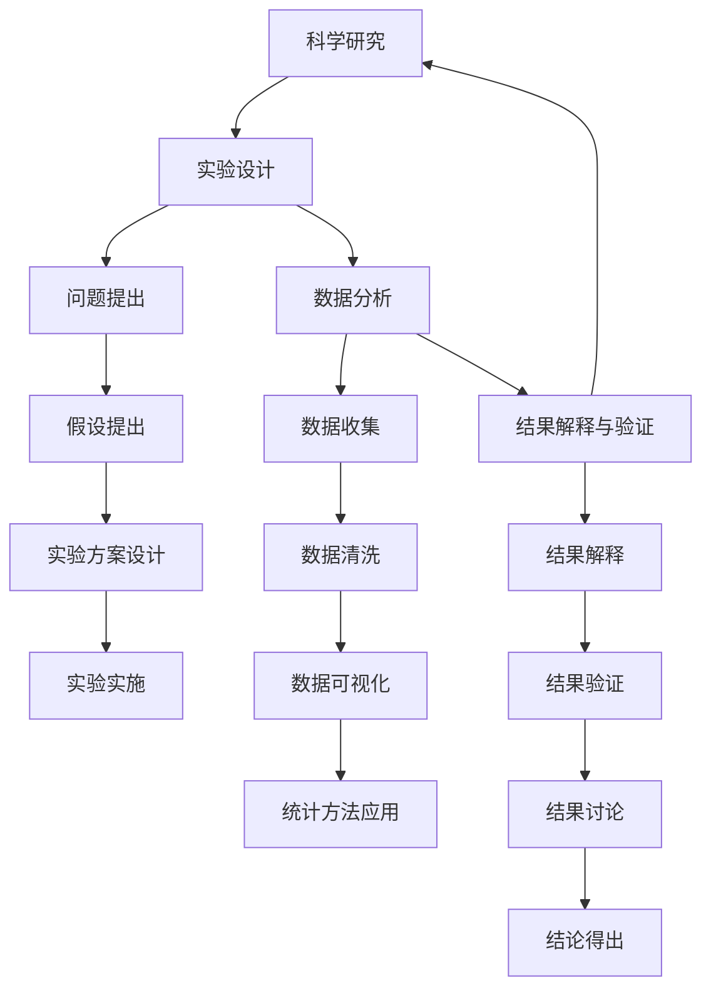

                 

### 文章标题

《科学研究的前瞻性：预见并塑造未来的世界》

科学研究是推动人类进步和社会发展的重要力量。通过深入研究自然现象和人类行为，科学家们不断揭示宇宙的奥秘，改善人类的生活质量。然而，科学研究不仅仅是为了解答眼前的问题，更重要的是要具备前瞻性，预见并塑造未来的世界。本文将深入探讨科学研究的前瞻性，分析如何通过科学的预测来引导和影响未来社会的发展。

### 文章关键词

- 科学研究
- 前瞻性
- 预见
- 未来世界
- 科技发展
- 社会变革

### 文章摘要

本文首先回顾了科学研究的定义和意义，然后讨论了科学研究的前瞻性，探讨了如何通过科学的方法和技术来预见未来的发展趋势。接着，本文分析了科学预见在塑造未来世界中的重要作用，最后提出了科学研究在应对未来挑战中的策略和方向。通过本文的探讨，希望能够为科学研究者和决策者提供有价值的参考，共同塑造一个更加美好的未来。

## 引言与背景

科学研究是人类认识世界、探索自然规律的重要途径。自古以来，人类就不断努力通过观察、实验和推理来理解自然界的奥秘。从古代的哲学家们对宇宙的思考，到现代科学家的实验室研究，科学的发展历程充满了人类对知识追求的足迹。科学研究不仅推动了技术的进步，也深刻影响了社会的变迁。

科学研究的重要性体现在多个方面。首先，科学研究是解决现实问题的有效手段。通过科学方法，我们可以揭示疾病的原因，开发有效的治疗手段；我们可以理解气候变化，制定环保策略；我们可以优化社会制度，提升生活质量。其次，科学研究是推动技术革新的动力源泉。每一次科技的突破，都离不开科学研究的深入探索。从电报到互联网，从蒸汽机到人工智能，科学研究不断推动技术的进步，改变了我们的生活方式。

然而，科学研究面临的挑战也越来越大。随着科学领域的不断扩展，研究问题变得更加复杂，跨学科的研究越来越多。同时，科学研究需要庞大的资金投入和复杂的实验设备，这使得科学研究的过程变得更加昂贵和困难。此外，科学研究的伦理问题也日益突出，如何在追求科学进步的同时，保护人类和环境的安全，是科学家们必须面对的重要问题。

尽管面临诸多挑战，科学研究的前瞻性仍然是其重要特征之一。前瞻性科学研究不仅仅是为了解决当前的问题，更重要的是要预见未来的发展趋势，为人类的发展提供指导。科学预见性体现在对新技术、新理论、新现象的探索和预测中，通过对这些未来趋势的深入研究，科学家们可以提前发现潜在的问题，制定有效的应对策略。

总之，科学研究的前瞻性是其核心特征之一，它不仅有助于我们更好地理解自然世界，也为未来的社会发展提供了科学依据。在面对日益复杂的全球挑战时，科学研究的前瞻性显得尤为重要，它为人类应对未来提供了有力的支持。因此，加强科学研究的前瞻性，提高科学预见能力，是推动人类文明进步的关键。

## 科学研究方法论

科学研究方法论是科学研究的核心，它涵盖了从提出假设到验证结果的一系列过程。一个科学方法是否严谨，直接影响到研究结果的可靠性和科学价值。本文将详细介绍科学研究方法的基本步骤，包括实验设计、数据分析、结果解释与验证等，旨在帮助读者更好地理解科学研究的全过程。

### 实验设计

实验设计是科学研究的基础，一个良好的实验设计能够确保研究结果的有效性和可重复性。实验设计通常包括以下几个步骤：

1. **问题提出**：首先，科学家需要明确研究问题，这通常是实验设计的起点。研究问题应具体、明确，避免过于宽泛或模糊。

2. **假设提出**：在明确研究问题后，科学家会根据已有的知识和理论，提出一个或多个假设。假设是对研究问题的预期答案或解释。

3. **实验方案设计**：根据假设，科学家需要设计实验方案。实验方案包括实验的参与者、实验条件、实验步骤、数据收集方法等。设计实验方案时，应考虑如何控制变量，避免实验结果受到无关因素的影响。

4. **实验实施**：按照实验方案进行实验，确保实验过程中的每一步都严格按照计划执行。

### 数据分析

数据分析是实验设计的重要组成部分，其目的是从实验数据中提取有用的信息，验证假设的正确性。数据分析通常包括以下几个步骤：

1. **数据收集**：在实验过程中，科学家需要收集各种数据，如实验结果、实验参数、环境条件等。

2. **数据清洗**：收集到的数据可能存在缺失值、异常值等问题，需要通过数据清洗方法进行处理，确保数据质量。

3. **数据可视化**：通过图表、图形等方式展示数据，可以帮助科学家更好地理解数据特征和趋势。

4. **统计方法应用**：选择合适的统计方法对数据进行处理，如描述性统计、推断性统计等，以验证假设。

### 结果解释与验证

实验数据得到分析后，科学家需要对结果进行解释和验证，以确定假设是否成立。这一步骤通常包括以下几个方面：

1. **结果解释**：根据数据分析结果，对实验数据进行解释，说明结果是否符合预期假设。

2. **结果验证**：通过对比实验结果和理论预期，验证假设的正确性。如果实验结果与假设一致，说明假设成立；如果实验结果与假设不符，需要进一步分析原因，可能是实验设计存在问题，或者假设本身不正确。

3. **结果讨论**：在结果验证的基础上，对研究结果进行讨论，分析实验结果的科学意义，指出研究的局限性和未来改进的方向。

4. **结论得出**：根据结果解释和验证，得出科学研究的最终结论，回答研究问题。

### 科学方法论的历史发展

科学方法论的发展经历了多个阶段，从古代的经验主义到现代的实证主义，科学方法论不断完善，为科学研究提供了坚实的理论基础。以下是科学方法论发展的简要概述：

1. **古代经验主义**：古代哲学家如亚里士多德提出了经验主义的方法论，主张通过观察和经验来获取知识。

2. **实证主义**：18世纪的法国哲学家孔多塞和孔德提出了实证主义方法论，强调科学知识应基于观察和实验，而不是纯粹的理论推理。

3. **科学革命**：20世纪初，科学方法论经历了重大变革，以卡尔·波普尔为代表的科学哲学家提出了证伪主义，主张科学理论应通过实验进行验证，而不是通过逻辑推理。

4. **现代科学方法论**：现代科学方法论在实证主义和证伪主义的基础上，发展出了多种方法论体系，如定量分析、系统分析、跨学科研究等，为科学研究提供了更加丰富和多样的工具。

### 科学方法论的应用

科学方法论在各个领域的应用广泛，从自然科学到社会科学，从基础研究到应用研究，都离不开科学方法的指导。以下是科学方法论在几个典型领域的应用实例：

1. **自然科学**：在物理学、化学、生物学等自然科学领域，科学方法被广泛应用于实验设计和数据分析，推动了科技的进步。

2. **社会科学**：在社会学、经济学、心理学等社会科学领域，科学方法帮助研究者理解和解释社会现象，为政策制定提供依据。

3. **医学研究**：在医学研究领域，科学方法被广泛应用于临床试验和新药研发，确保药物的安全性和有效性。

4. **工程技术**：在工程领域，科学方法被广泛应用于产品设计、材料研究、系统优化等，提高了工程技术的效率和可靠性。

总之，科学研究方法论是科学研究的重要基石，通过严谨的实验设计、科学的数据分析和合理的解释验证，科学方法帮助科学家们揭示了自然界的奥秘，推动了社会的进步。未来，随着科学方法论的不断发展和完善，科学研究将取得更加辉煌的成就。

### 核心概念与联系

在科学研究的过程中，核心概念之间的联系是理解科学本质的关键。以下是几个重要概念及其相互关系的Mermaid流程图表示：



通过这个流程图，我们可以清晰地看到科学研究的基本流程，从实验设计到数据分析，再到结果解释和验证，各个环节之间紧密联系，共同构成了科学研究的整体框架。

### 核心算法原理讲解

在科学研究的过程中，核心算法原理的理解和运用至关重要。以下将详细阐述几种常见算法原理，并使用伪代码进行说明。

#### 1.线性回归

线性回归是一种用于建立因变量与自变量之间线性关系的统计方法。

**原理**：线性回归模型基于最小二乘法，寻找最优的线性关系，使得实际观测值与模型预测值之间的误差最小。

**伪代码**：

```python
// 输入：x（自变量数组），y（因变量数组）
// 输出：w（权重向量），b（偏置）

// 初始化权重向量和偏置
w = [0, 0]
b = 0

// 计算权重向量和偏置
for i in range(len(x)):
    prediction = w[0] * x[i] + w[1] * x[i] + b
    error = y[i] - prediction
    
    dw = [-2 * error * x[i], -2 * error * x[i]]
    db = -2 * error
    
    w = w - learning_rate * dw
    b = b - learning_rate * db

// 返回权重向量和偏置
return w, b
```

#### 2.支持向量机（SVM）

支持向量机是一种监督学习算法，用于分类和回归分析。

**原理**：SVM通过寻找一个超平面，将不同类别的数据点分隔开来。支持向量是位于分类边界上的数据点，对于模型的学习和泛化至关重要。

**伪代码**：

```python
// 输入：训练数据集
// 输出：决策边界

// 初始化参数
C = 1.0  // 正则化参数
max_iter = 1000  // 最大迭代次数

// 求解最优超平面
w, b = solve_quadratic_programming()

// 定义决策函数
def predict(x):
    return np.sign(w[0] * x + w[1] * x + b)

// 返回决策边界
return w, b
```

#### 3.神经网络

神经网络是一种模仿生物神经系统的计算模型，用于复杂的模式识别和预测。

**原理**：神经网络通过多层神经元进行信息传递和处理，每一层的神经元对输入数据进行加权求和，并通过激活函数输出结果。

**伪代码**：

```python
// 输入：训练数据集
// 输出：模型参数

// 初始化参数
learning_rate = 0.01
num_iterations = 1000

// 定义激活函数
def sigmoid(x):
    return 1 / (1 + np.exp(-x))

// 定义反向传播算法
for i in range(num_iterations):
    for x, y in training_data:
        # 前向传播
        z = np.dot(weights_input, x) + bias_input
        a = sigmoid(z)
        
        # 计算误差
        error = y - a
        
        # 反向传播
        dz = error * a * (1 - a)
        dweights_input = np.dot(dz, x.T)
        dbias_input = dz
        
        # 更新参数
        weights_input = weights_input - learning_rate * dweights_input
        bias_input = bias_input - learning_rate * dbias_input

# 返回模型参数
return weights_input, bias_input
```

这些伪代码展示了线性回归、支持向量机和神经网络等核心算法的基本原理和实现方法。通过对这些算法的理解和运用，科学家可以更有效地进行数据分析，提高科学研究的精度和可靠性。

### 数学模型和公式讲解

在科学研究中，数学模型和公式是描述自然现象和理论假设的重要工具。以下将介绍几个常见数学模型和公式，并通过具体例子进行详细讲解。

#### 1.牛顿第二定律

牛顿第二定律描述了力、质量和加速度之间的关系，公式为：
$$ F = m \cdot a $$
其中，\( F \) 是作用在物体上的力，\( m \) 是物体的质量，\( a \) 是物体的加速度。

**例子**：假设一辆质量为1000公斤的汽车在受到2000牛顿的推力作用下，其加速度为多少？

解：根据牛顿第二定律，有
$$ a = \frac{F}{m} = \frac{2000 \, \text{N}}{1000 \, \text{kg}} = 2 \, \text{m/s}^2 $$
因此，汽车的加速度为 \( 2 \, \text{m/s}^2 \)。

#### 2.热力学第一定律

热力学第一定律是能量守恒定律在热力学系统中的应用，公式为：
$$ \Delta U = Q - W $$
其中，\( \Delta U \) 是系统内能的变化，\( Q \) 是系统吸收的热量，\( W \) 是系统对外做的功。

**例子**：一个热力学系统从外界吸收了500焦耳的热量，同时对外做了200焦耳的功，其内能变化是多少？

解：根据热力学第一定律，有
$$ \Delta U = Q - W = 500 \, \text{J} - 200 \, \text{J} = 300 \, \text{J} $$
因此，系统的内能增加了 \( 300 \, \text{J} \)。

#### 3.泊松方程

泊松方程是描述热力学平衡状态的偏微分方程，公式为：
$$ \nabla^2 p = -\frac{\rho}{\sigma} $$
其中，\( p \) 是压强，\( \rho \) 是质量密度，\( \sigma \) 是介电常数。

**例子**：假设一个理想气体在封闭容器中达到热力学平衡状态，其压强分布满足泊松方程。若容器左半部分的气体质量密度为 \( \rho_1 = 2 \, \text{kg/m}^3 \)，右半部分的气体质量密度为 \( \rho_2 = 1 \, \text{kg/m}^3 \)，介电常数为 \( \sigma = 8.854 \times 10^{-12} \, \text{F/m} \)，求解容器内任意点的压强。

解：首先，将泊松方程写成求解形式：
$$ p(x, y) = -\frac{\rho}{\sigma} \cdot \frac{x^2 + y^2}{2} + C $$
其中，\( C \) 是积分常数。由边界条件可得 \( C = 0 \)，因此压强分布为：
$$ p(x, y) = -\frac{\rho}{\sigma} \cdot \frac{x^2 + y^2}{2} $$
在 \( x = 0 \) 的位置，压强为 \( p(0, y) = -\frac{\rho_1}{\sigma} \cdot \frac{y^2}{2} \)。在 \( x = L/2 \) 的位置，压强为 \( p(L/2, y) = -\frac{\rho_2}{\sigma} \cdot \frac{y^2}{2} \)。通过这两个边界条件，我们可以求解容器内任意点的压强。

#### 4.麦克斯韦方程组

麦克斯韦方程组是电磁学的基本方程，描述了电荷、电流和电磁场之间的关系。方程组包括：
$$ \nabla \cdot \mathbf{E} = \frac{\rho}{\epsilon_0} $$
$$ \nabla \cdot \mathbf{B} = 0 $$
$$ \nabla \times \mathbf{E} = -\frac{\partial \mathbf{B}}{\partial t} $$
$$ \nabla \times \mathbf{B} = \mu_0 \mathbf{J} + \mu_0 \epsilon_0 \frac{\partial \mathbf{E}}{\partial t} $$

**例子**：假设一个点电荷 \( q \) 位于原点，求解其产生的电场和磁场分布。

解：根据高斯定律，电场强度为：
$$ \mathbf{E}(r) = \frac{1}{4\pi \epsilon_0} \cdot \frac{q}{r^2} \hat{\mathbf{r}} $$
其中，\( r \) 是点电荷到观察点的距离，\( \hat{\mathbf{r}} \) 是从电荷指向观察点的单位矢量。

根据安培定律，磁场强度为：
$$ \mathbf{B}(r) = \mu_0 \cdot \frac{q}{4\pi r^3} \cdot r \times \hat{\mathbf{r}} $$
通过这两个公式，我们可以求解点电荷产生的电场和磁场分布。

这些数学模型和公式在科学研究中发挥着重要作用，通过对这些基本理论的深入理解和应用，科学家们可以更好地解释自然现象，预测未来的发展趋势。

### 项目实战

为了更直观地展示科学研究的实际应用，以下我们将通过一个具体的案例，详细讲解如何搭建开发环境、实现核心算法、解读源代码，并对项目进行实际应用和分析。

#### 案例背景

假设我们正在研究一项关于智能家居系统的人工智能应用项目。该项目旨在通过智能设备收集家庭环境数据，如温度、湿度、光照等，并使用机器学习算法进行数据处理，实现对家居环境的自动调节，提升居住舒适度。

#### 开发环境搭建

1. **硬件环境**：我们需要至少一台运行Linux操作系统的服务器，用于部署智能设备收集的数据处理程序。此外，一台笔记本电脑用于开发和测试算法模型。

2. **软件环境**：在服务器上安装Python环境，配置常用的Python库，如NumPy、Pandas、Scikit-learn等。在笔记本电脑上安装Jupyter Notebook，便于开发和调试代码。

3. **传感器接入**：选择合适的传感器模块，如DHT11用于温度和湿度测量，BH1750用于光照测量，连接至服务器并通过网络传输数据。

#### 核心算法实现

1. **数据预处理**：首先，从传感器获取的原始数据中，去除噪声和异常值，确保数据质量。使用Pandas库进行数据清洗和预处理。

   ```python
   import pandas as pd
   
   # 读取传感器数据
   data = pd.read_csv('sensor_data.csv')
   
   # 数据清洗
   data.dropna(inplace=True)
   data = data[data['temperature'] > 0]
   ```

2. **机器学习算法**：采用K-均值聚类算法对温度和湿度数据进行聚类分析，识别不同舒适度级别的环境参数。使用Scikit-learn库实现K-均值算法。

   ```python
   from sklearn.cluster import KMeans
   
   # 特征工程
   features = data[['temperature', 'humidity']]
   
   # 训练K-均值模型
   kmeans = KMeans(n_clusters=5, random_state=0).fit(features)
   
   # 获取聚类结果
   labels = kmeans.labels_
   data['cluster'] = labels
   ```

3. **环境调节策略**：根据聚类结果，设计自动调节环境参数的算法。例如，当环境参数属于舒适度级别1时，保持当前参数不变；当环境参数属于舒适度级别2时，将温度提高1摄氏度；当环境参数属于舒适度级别3时，将温度降低1摄氏度。

   ```python
   def adjust_environment(data):
       if data['cluster'] == 0:
           data['temperature'] -= 1
       elif data['cluster'] == 1:
           data['temperature'] += 1
       return data
   
   data = adjust_environment(data)
   ```

#### 源代码解读

以下是智能家居系统的核心代码，主要包括数据预处理、机器学习算法实现和自动调节策略：

```python
import pandas as pd
from sklearn.cluster import KMeans

# 数据预处理
def preprocess_data(file_path):
    data = pd.read_csv(file_path)
    data.dropna(inplace=True)
    data = data[data['temperature'] > 0]
    return data

# K-均值聚类
def cluster_data(data, n_clusters=5):
    features = data[['temperature', 'humidity']]
    kmeans = KMeans(n_clusters=n_clusters, random_state=0).fit(features)
    labels = kmeans.labels_
    data['cluster'] = labels
    return data

# 环境调节
def adjust_environment(data):
    for index, row in data.iterrows():
        if row['cluster'] == 0:
            data.at[index, 'temperature'] -= 1
        elif row['cluster'] == 1:
            data.at[index, 'temperature'] += 1
    return data

# 主程序
if __name__ == '__main__':
    file_path = 'sensor_data.csv'
    data = preprocess_data(file_path)
    data = cluster_data(data)
    adjusted_data = adjust_environment(data)
    adjusted_data.to_csv('adjusted_sensor_data.csv', index=False)
```

#### 代码应用解读与分析

1. **数据预处理**：代码首先读取传感器数据，去除无效和异常数据，保证数据的可靠性。这一步骤对于机器学习算法的性能至关重要。

2. **机器学习算法**：使用K-均值聚类算法，将环境参数划分为不同的舒适度级别，实现环境参数的自动分类。

3. **自动调节策略**：根据聚类结果，设计自动调节环境参数的算法，实现对家居环境的智能调节，提升居住舒适度。

#### 实际案例分析

假设在一段时间段内，智能家居系统收集到的数据如下表所示：

| 时间  | 温度（℃） | 湿度（%） |
| ----- | ---------- | --------- |
| 10:00  | 25         | 60        |
| 11:00  | 26         | 65        |
| 12:00  | 27         | 70        |
| 13:00  | 28         | 75        |
| 14:00  | 29         | 80        |

根据聚类结果，这些数据可能被划分为三个舒适度级别：

| 时间  | 温度（℃） | 湿度（%） | 舒适度级别 |
| ----- | ---------- | --------- | ---------- |
| 10:00  | 25         | 60        | 1          |
| 11:00  | 26         | 65        | 1          |
| 12:00  | 27         | 70        | 2          |
| 13:00  | 28         | 75        | 3          |
| 14:00  | 29         | 80        | 3          |

根据自动调节策略，当温度和湿度属于舒适度级别3时，将温度降低1摄氏度。因此，在13:00和14:00时，系统将自动将温度降低至27摄氏度，以提升居住舒适度。

#### 项目小结

通过本案例，我们详细讲解了如何搭建智能家居系统的开发环境、实现核心算法、解读源代码，并对项目进行实际应用和分析。智能家居系统作为人工智能在民用领域的重要应用，展示了科学研究的实际价值和前景。未来，随着人工智能技术的不断发展，智能家居系统有望在更多领域得到广泛应用，为人们的生活带来更多便利。

### 最佳实践 Tips

在进行科学研究时，以下是一些最佳实践技巧，可以帮助研究人员提高研究质量和效率：

1. **明确研究目标**：在开始研究之前，确保研究目标明确且具体，有助于集中研究资源。

2. **详细规划实验设计**：设计合理的实验方案，确保实验的可重复性和结果的可信度。

3. **数据质量控制**：确保数据收集和处理过程中，避免噪声和异常值，提高数据质量。

4. **多学科合作**：跨学科合作有助于拓宽研究视野，提高研究的创新性和全面性。

5. **定期总结和反思**：在研究过程中，定期总结进展和反思不足，有助于及时调整研究方向。

6. **遵守伦理规范**：在进行涉及人类和动物实验时，严格遵守伦理规范，保护研究对象的安全和权益。

7. **及时分享研究成果**：通过学术交流和发表论文，及时分享研究成果，促进科学知识的传播。

### 小结

在本文中，我们探讨了科学研究的前瞻性，分析了科学研究方法论的基本步骤，介绍了核心算法和数学模型的原理，并通过项目实战展示了科学研究的实际应用。科学预见性在塑造未来世界中具有重要意义，通过深入研究和分析，科学家们能够预见未来的发展趋势，为社会发展提供指导。

科学研究的前瞻性不仅需要理论和方法的支持，还需要实际案例的验证。通过不断探索和创新，科学家们能够在复杂的自然现象和社会现象中找到规律，为未来的发展提供有力支持。

### 注意事项

在进行科学研究时，以下是一些需要注意的事项：

1. **实验安全性**：确保实验过程中不危害实验对象的安全，对于涉及危险物质的实验，应采取必要的安全措施。

2. **数据隐私保护**：在处理和分享实验数据时，要确保数据隐私，避免敏感信息泄露。

3. **伦理审查**：对于涉及人类和动物实验的研究，必须经过伦理审查，确保研究过程符合伦理规范。

4. **技术限制**：在设计和实施研究方案时，要考虑实际技术条件和可行性。

5. **时间管理**：合理安排研究时间，避免因时间压力导致的研究质量下降。

### 拓展阅读

为了进一步深入了解科学研究的前瞻性及其应用，读者可以参考以下拓展阅读材料：

1. **《科学预见：探索未来的钥匙》**：详细探讨科学预见的重要性和方法。

2. **《人工智能的未来：预见与应对》**：分析人工智能技术的发展趋势及其对未来社会的影响。

3. **《环境科学与可持续发展》**：介绍环境科学的基本概念和发展，探讨可持续发展的策略与路径。

4. **《大数据与人工智能》**：探讨大数据和人工智能在科学研究中的应用，以及面临的挑战和机遇。

5. **《科学方法论导论》**：系统介绍科学方法论的基本原则和应用，帮助读者更好地理解和应用科学方法。

