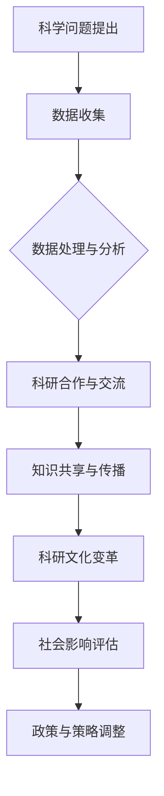

                 


### 文章标题：科学研究的开放科学运动与世界可理解性的共享

#### 关键词：开放科学，知识共享，数据透明，开源工具，科研合作，社会影响

#### 摘要：
本文探讨了开放科学运动的兴起、核心原则和实践方法，分析了其对社会、科研文化和政策的影响，并展望了其未来发展趋势。通过案例研究和实践解析，本文旨在揭示开放科学在提升世界可理解性方面的重要作用。

### 目录大纲

基于您的要求，以下是一个详细的目录大纲：

## 第一部分：引论

### 1.1 开放科学的定义与背景

### 1.2 开放科学的动机与目的

### 1.3 开放科学的历史与发展

## 第二部分：开放科学的核心原则与实践

### 2.1 开放获取与知识共享

#### 2.1.1 开放获取的原理

#### 2.1.2 开放获取的实现方式

#### 2.1.3 开放获取的挑战与机遇

### 2.2 数据共享与透明度

#### 2.2.1 数据共享的重要性

#### 2.2.2 数据共享的实践方法

#### 2.2.3 数据共享的伦理问题

### 2.3 方法论的开放性

#### 2.3.1 开放方法论的概念

#### 2.3.2 开放方法论的实施

#### 2.3.3 开放方法论的优缺点

### 2.4 开源软件与工具

#### 2.4.1 开源软件的定义与特点

#### 2.4.2 开源软件在科学研究中的应用

#### 2.4.3 开源软件的未来趋势

## 第三部分：开放科学的影响与挑战

### 3.1 开放科学对科研文化的影响

#### 3.1.1 开放科学对科研传统的挑战

#### 3.1.2 开放科学促进科研合作与交流

#### 3.1.3 开放科学对科研评价的影响

### 3.2 开放科学对社会的影响

#### 3.2.1 开放科学提升公共参与度

#### 3.2.2 开放科学促进知识传播与普及

#### 3.2.3 开放科学对经济与社会的贡献

### 3.3 开放科学面临的挑战

#### 3.3.1 开放科学的技术挑战

#### 3.3.2 开放科学的伦理挑战

#### 3.3.3 开放科学的政策与法律挑战

## 第四部分：开放科学的未来趋势与展望

### 4.1 开放科学的发展趋势

#### 4.1.1 知识共享的进一步发展

#### 4.1.2 数据驱动的科学研究

#### 4.1.3 开源软件与工具的创新

### 4.2 开放科学对社会的影响

#### 4.2.1 开放科学促进全球合作

#### 4.2.2 开放科学提升科研透明度

#### 4.2.3 开放科学推动科研创新

### 4.3 开放科学的政策与策略

#### 4.3.1 政策支持与促进措施

#### 4.3.2 研究机构与政策制定者的角色

#### 4.3.3 国际合作与协调机制

## 第五部分：案例研究

### 5.1 国内外开放科学实践案例

#### 5.1.1 国外开放科学成功案例

#### 5.1.2 国内开放科学实践案例

#### 5.1.3 开放科学实践效果评估

### 5.2 开放科学在特定领域的应用

#### 5.2.1 生物医学领域的开放科学

#### 5.2.2 物理科学与工程领域的开放科学

#### 5.2.3 社会科学与人文学科的开放科学

## 第六部分：结论与展望

### 6.1 开放科学的重要性与价值

### 6.2 开放科学的未来发展

### 6.3 开放科学的挑战与应对策略

## 参考文献

## 附录

### 附录 A：开放科学相关资源与工具

### 附录 B：开放科学政策与法规指南

### 流程图说明

以下是一个用于描述开放科学运动核心过程的 Mermaid 流程图：



### 伪代码讲解

以下是一个简单的伪代码示例，用于阐述数据清洗的算法原理：

```pseudo
function 数据清洗(原始数据集):
    数据集 = 去除缺失值和异常值(原始数据集)
    for 每个数据点 in 数据集:
        if 数据点不在有效范围内:
            删除数据点
    返回 数据集
```

### 数学模型和公式讲解

以下是使用 LaTeX 格式嵌入的数学模型和公式的例子：

$$
    y = f(x) = 2x + 1
$$

和

$$
    S = \sum_{i=1}^{n} x_i^2
$$

我们将对每个模型和公式进行详细讲解，并提供具体的应用实例。

### 项目实战

在本部分，我们将介绍一个实际项目，包括开发环境搭建、源代码实现、代码解读、应用解析和案例分析。

#### 开发环境搭建

- 选择合适的数据科学工具和库（如 Python 和 pandas）。
- 搭建数据预处理和清洗的环境。

#### 源代码实现

- 实现一个数据清洗函数，使用伪代码描述的算法原理。

#### 代码解读

- 解释代码中的关键函数和方法。

#### 应用解析

- 介绍数据清洗在具体场景中的应用。

#### 案例分析

- 分析一个实际数据清洗案例，包括数据来源、预处理步骤、结果评估等。

#### 项目小结

- 总结项目的主要收获和经验。

### 最佳实践 tips、小结、注意事项和拓展阅读

- 提供最佳实践建议。
- 对文章中的核心概念和算法进行小结。
- 指出需要注意的问题和潜在挑战。
- 推荐进一步阅读的文献和资源。

### 文章正文

基于上述的目录大纲和结构，我们将逐步撰写文章的正文部分，确保内容丰富、结构清晰，每个章节都详细讲解核心概念、算法原理、数学模型、代码实现和实际应用。

## 第一部分：引论

### 1.1 开放科学的定义与背景

开放科学（Open Science）是指一种科学研究和传播的新模式，强调知识的开放获取、数据共享、方法透明和开源工具的使用。这一概念在近年来逐渐兴起，并在全球范围内得到了广泛的关注和推广。开放科学的核心理念在于消除科学研究的壁垒，促进知识的自由流动和共享，从而提升科研效率、增强科研透明度和提升科研成果的可信度。

开放科学的背景可以追溯到20世纪末和21世纪初，随着互联网技术的迅猛发展和信息传播渠道的多元化，科学研究的数据量、复杂度和多样性急剧增加。传统的封闭科学模式逐渐显示出其局限性，如科研经费的不公平分配、科研成果的垄断和知识共享的困难。因此，开放科学的提出旨在通过变革科研模式，促进科学知识的传播和利用，推动科研社区的健康发展。

### 1.2 开放科学的动机与目的

开放科学的动机主要体现在以下几个方面：

1. **知识共享与普及**：开放科学提倡知识共享，使科研成果能够被更多的人获取和利用，从而推动科学知识的普及和传播。
2. **提高科研效率**：通过开放获取和共享，研究人员可以更快地获取已有的研究数据、方法和工具，避免重复劳动，提高科研效率。
3. **促进科研合作**：开放科学鼓励科研合作和跨学科交流，有助于打破学科壁垒，促进科学问题的多角度分析和解决方案的创新。
4. **提升科研透明度**：开放科学要求数据透明和方法透明，有助于提高科研过程的透明度和可追溯性，增强科研成果的可靠性。

开放科学的目的是构建一个开放、透明、协作和可持续的科研生态系统，以实现科学知识的最大化利用和社会价值的最大化。

### 1.3 开放科学的历史与发展

开放科学的概念最早可以追溯到20世纪80年代的“开放获取运动”（Open Access Movement）。该运动主张科学研究成果应该免费、无限制地提供给所有人，而不受商业出版商的限制。1991年，第一个开放获取期刊《生物医学预印本》（Biomed Central）成立，标志着开放获取实践的开始。此后，开放获取期刊的数量逐年增加，越来越多的研究机构和学者开始接受并采用开放获取模式。

进入21世纪，开放科学的理念逐渐扩展到数据共享、方法透明和开源工具等多个方面。2012年，《科学数据》（Science）发表了题为《开放数据：促进科研透明与效率》（Data sharing in science: toward more openness and veracity）的社论，进一步推动了开放科学的发展。近年来，许多国家和组织相继出台了相关政策，支持开放科学实践，如美国的“开放研究”（Open Research）计划、欧盟的“开放科学政策”（Open Science Policy）等。

### 第二部分：开放科学的核心原则与实践

#### 2.1 开放获取与知识共享

##### 2.1.1 开放获取的原理

开放获取（Open Access，简称 OA）是开放科学的核心原则之一，它主张科研成果应该免费、无限制地提供给公众。开放获取的实现方式主要包括两种：

1. **金色开放获取**：通过传统出版模式，研究人员将研究成果提交到开放获取期刊，这些期刊通常由学术机构或非营利组织运营。读者可以免费阅读和下载这些文章。

2. **绿色开放获取**：研究人员将研究成果发表在传统期刊上，然后将其存入机构或学科库中，以供公众免费访问。这种模式不需要期刊的特定支持，但需要研究人员自行维护和上传。

开放获取的原理在于消除知识传播的障碍，使科研成果能够被广泛获取和利用，从而提升科研效率和社会福利。

##### 2.1.2 开放获取的实现方式

实现开放获取的关键在于构建一个开放的知识共享平台。以下是一些常用的实现方式：

1. **开放获取期刊**：开放获取期刊是开放获取的主要形式之一。它们采用作者付费（作者承担出版费用）或机构支持（由学术机构支付）的模式，确保研究成果的免费传播。

2. **学科库和机构库**：学科库和机构库是存储和传播开放获取文献的重要平台。研究人员可以将自己的研究成果上传到这些库中，以便他人访问。

3. **预印本平台**：预印本平台允许研究人员在正式发表前分享他们的研究成果。常见的预印本平台包括 arXiv、bioRxiv 等。

4. **社交媒体和学术网络**：社交媒体和学术网络（如 ResearchGate、Academia.edu）为研究人员提供了一个交流平台，他们可以在这些平台上分享研究成果和见解。

##### 2.1.3 开放获取的挑战与机遇

开放获取面临以下挑战：

1. **资金问题**：开放获取期刊需要作者支付出版费用，这可能导致研究经费不足的机构和学者面临压力。

2. **质量控制**：开放获取期刊可能面临质量控制的问题，一些低质量的文章可能被发布。

3. **伦理问题**：开放获取可能引发学术不端行为，如重复发表、篡改数据等。

然而，开放获取也带来了以下机遇：

1. **知识普及**：开放获取使科研成果更易于获取和传播，有助于提高公众的科学素养。

2. **科研合作**：开放获取促进了科研合作和跨学科交流，有助于解决复杂的科学问题。

3. **科研透明**：开放获取提高了科研过程的透明度，有助于提高科研诚信和信任度。

#### 2.2 数据共享与透明度

##### 2.2.1 数据共享的重要性

数据共享是开放科学的重要组成部分，它有助于提高科研效率、促进知识传播和增强科研成果的可靠性。以下是数据共享的重要性：

1. **科研效率**：数据共享使研究人员能够利用已有的数据资源，避免重复实验和数据收集，从而提高科研效率。

2. **知识传播**：数据共享促进了知识传播，使更多的研究人员能够访问和使用研究成果。

3. **科研成果的可靠性**：数据共享有助于验证研究结果的可靠性和可重复性，提高了科研成果的可信度。

##### 2.2.2 数据共享的实践方法

以下是数据共享的几种实践方法：

1. **数据发布平台**：研究人员可以将数据发布到开放的数据发布平台，如 Dryad、Figshare 等。这些平台提供了数据存储、管理和共享的功能。

2. **机构库**：研究机构可以建立自己的数据库，以存储和共享内部的研究数据。这种模式有助于确保数据的长期保存和访问。

3. **开放获取期刊**：一些开放获取期刊要求研究人员提供数据访问链接，以确保数据的可获取性和可重复性。

4. **社交媒体和学术网络**：研究人员可以在社交媒体和学术网络（如 ResearchGate、Academia.edu）上分享数据，以促进交流与合作。

##### 2.2.3 数据共享的伦理问题

数据共享涉及一系列伦理问题，包括隐私保护、数据所有权和知识产权等。以下是数据共享的伦理问题：

1. **隐私保护**：数据共享可能涉及个人隐私信息，研究人员需要采取措施保护数据的隐私。

2. **数据所有权**：数据所有权和知识产权问题在数据共享中尤为重要。研究人员需要明确数据的使用权限和共享条件。

3. **知识产权**：数据共享可能影响科研成果的知识产权，研究人员需要遵守相关的知识产权法规。

#### 2.3 方法论的开放性

##### 2.3.1 开放方法论的概念

开放方法论是指将科学研究的整个方法论过程（包括研究设计、数据收集、数据分析、结果解释等）公开，以便其他研究人员进行审查和验证。开放方法论旨在提高科研过程的透明度和可信度，促进科研合作和知识共享。

##### 2.3.2 开放方法论的实施

以下是开放方法论的实施步骤：

1. **研究设计公开**：研究人员在开始研究之前，应公开研究设计，包括研究问题、研究假设、研究方法等。

2. **数据收集公开**：研究人员应公开数据收集过程，包括数据来源、数据收集方法、数据质量评估等。

3. **数据分析公开**：研究人员应公开数据分析过程，包括数据分析方法、数据分析结果等。

4. **结果解释公开**：研究人员应公开研究结果，包括研究结果、讨论、结论等。

##### 2.3.3 开放方法论的优缺点

开放方法论具有以下优点：

1. **提高科研透明度**：开放方法论使科研过程更加透明，有助于提高科研成果的可信度。

2. **促进科研合作**：开放方法论鼓励其他研究人员参与研究过程，促进科研合作和知识共享。

3. **提高研究质量**：开放方法论有助于提高研究质量，通过同行审查和验证，减少研究错误和偏差。

然而，开放方法论也存在一些缺点：

1. **增加研究负担**：公开方法论可能增加研究人员的负担，需要更多的时间和精力来公开和解释研究过程。

2. **增加研究风险**：公开方法论可能增加研究的风险，特别是在研究结果不利时。

#### 2.4 开源软件与工具

##### 2.4.1 开源软件的定义与特点

开源软件（Open Source Software，简称 OSS）是指源代码公开的软件，用户可以自由地使用、研究、修改和分发。开源软件的特点包括：

1. **开放性**：开源软件的源代码公开，用户可以自由查看和修改。

2. **灵活性**：开源软件可以根据用户的需求进行定制和扩展。

3. **协作性**：开源软件通常采用协作开发模式，鼓励全球开发者的参与。

4. **可持续性**：开源软件的社区支持和用户反馈有助于其长期发展和改进。

##### 2.4.2 开源软件在科学研究中的应用

开源软件在科学研究中的应用广泛，主要包括以下领域：

1. **数据分析与统计**：开源软件如 R 和 Python 提供了丰富的数据分析工具和库，帮助研究人员进行数据分析和统计。

2. **数据存储与管理**：开源软件如 Hadoop 和 MongoDB 提供了高效的数据存储和管理解决方案。

3. **机器学习与人工智能**：开源软件如 TensorFlow 和 PyTorch 提供了强大的机器学习和人工智能工具。

4. **科研协作与项目管理**：开源软件如 GitHub 和 GitLab 提供了科研协作和项目管理工具。

##### 2.4.3 开源软件的未来趋势

开源软件的未来趋势包括：

1. **更广泛的应用领域**：开源软件将在更多科学领域得到应用，如生物医学、社会科学和工程领域。

2. **更深入的集成**：开源软件将与其他技术（如云计算、大数据）更深入地集成，提供更强大的科研支持。

3. **更广泛的社区参与**：开源软件社区将吸引更多开发者和用户参与，推动软件的持续改进。

### 第三部分：开放科学的影响与挑战

#### 3.1 开放科学对科研文化的影响

##### 3.1.1 开放科学对科研传统的挑战

开放科学对传统的科研文化提出了挑战，主要体现在以下几个方面：

1. **知识传播模式**：开放科学打破了传统科研中的知识垄断，鼓励知识共享和普及。

2. **科研评价体系**：开放科学要求科研过程和成果的透明度，对传统的科研评价体系提出了挑战。

3. **科研伦理**：开放科学强调数据共享和方法的公开，提高了科研伦理的要求。

##### 3.1.2 开放科学促进科研合作与交流

开放科学促进了科研合作与交流，主要体现在以下几个方面：

1. **跨国合作**：开放科学鼓励国际间的科研合作，促进了全球科研资源的共享。

2. **跨学科合作**：开放科学打破了学科壁垒，促进了不同学科之间的交流与合作。

3. **科研资源共享**：开放科学使得科研工具、数据和知识的共享更加便捷，提高了科研效率。

##### 3.1.3 开放科学对科研评价的影响

开放科学对科研评价产生了深远的影响，主要体现在以下几个方面：

1. **评价标准**：开放科学要求科研过程和成果的透明度，对传统的评价标准提出了挑战。

2. **评价方式**：开放科学鼓励多元化的评价方式，如同行评审、用户反馈和社区评价。

3. **评价体系**：开放科学有助于建立更加公正、透明和可持续的科研评价体系。

#### 3.2 开放科学对社会的影响

##### 3.2.1 开放科学提升公共参与度

开放科学提升了公众对科研的参与度，主要体现在以下几个方面：

1. **科普教育**：开放科学促进了科普教育的发展，使更多人了解科学知识和方法。

2. **公众参与科研**：开放科学鼓励公众参与科研活动，提高了公众的科学素养。

3. **科研透明度**：开放科学提高了科研的透明度，使公众能够更直接地了解科研过程和成果。

##### 3.2.2 开放科学促进知识传播与普及

开放科学促进了知识的传播与普及，主要体现在以下几个方面：

1. **知识共享平台**：开放科学建立了各种知识共享平台，使知识传播更加便捷和高效。

2. **科研资源共享**：开放科学使得科研资源（如数据、工具、文献等）更加容易获取，促进了知识的普及。

3. **跨学科交流**：开放科学促进了不同学科之间的交流与合作，推动了知识的综合应用。

##### 3.2.3 开放科学对经济与社会的贡献

开放科学对经济和社会的贡献主要体现在以下几个方面：

1. **科技创新**：开放科学推动了科技创新，促进了新兴产业的崛起和发展。

2. **经济增长**：开放科学有助于提高生产力和创新能力，推动了经济的增长。

3. **社会进步**：开放科学促进了科学技术的普及和应用，为社会进步提供了有力支持。

#### 3.3 开放科学面临的挑战

##### 3.3.1 开放科学的技术挑战

开放科学面临以下技术挑战：

1. **数据管理和存储**：随着数据量的增长，如何有效管理和存储大量科研数据成为一大挑战。

2. **数据安全和隐私**：数据共享可能涉及个人隐私信息，如何保障数据安全和隐私成为关键问题。

3. **技术标准化**：开放科学需要建立统一的技术标准，以确保数据、工具和方法的兼容性和互操作性。

##### 3.3.2 开放科学的伦理挑战

开放科学面临以下伦理挑战：

1. **学术不端行为**：开放科学可能加剧学术不端行为，如数据造假、论文抄袭等。

2. **知识产权**：数据共享和知识传播可能影响知识产权，如何平衡开放与保护成为问题。

3. **科研伦理**：开放科学要求更高的科研伦理标准，如何确保科研过程的公正和诚信成为挑战。

##### 3.3.3 开放科学的政策与法律挑战

开放科学面临以下政策与法律挑战：

1. **政策支持**：如何制定和实施支持开放科学的政策成为问题。

2. **法律规范**：开放科学需要建立相应的法律法规，以规范数据共享、知识传播和知识产权等。

3. **国际合作**：开放科学需要国际间的合作与协调，如何实现全球范围内的开放科学成为挑战。

### 第四部分：开放科学的未来趋势与展望

#### 4.1 开放科学的发展趋势

##### 4.1.1 知识共享的进一步发展

知识共享是开放科学的核心，未来知识共享将继续向更开放、更高效的方向发展，主要体现在以下几个方面：

1. **开放获取期刊**：开放获取期刊将继续增加，成为科研成果发布的主要渠道。

2. **知识共享平台**：知识共享平台将更加多样化和高效，提供更丰富的知识和资源。

3. **数据共享**：数据共享将更加普遍，数据质量和可用性将显著提高。

##### 4.1.2 数据驱动的科学研究

数据驱动的科学研究将成为开放科学的重要趋势，主要体现在以下几个方面：

1. **大数据应用**：大数据将在科研中发挥更大作用，为研究人员提供更丰富的数据资源。

2. **机器学习与人工智能**：机器学习和人工智能技术将更加广泛应用于科研，提高数据分析的效率和质量。

3. **数据可视化**：数据可视化技术将帮助研究人员更好地理解和解释复杂数据。

##### 4.1.3 开源软件与工具的创新

开源软件与工具的创新将继续推动开放科学的发展，主要体现在以下几个方面：

1. **开源软件生态**：开源软件生态将更加繁荣，吸引更多开发者参与。

2. **工具集成**：科研工具将更加集成和协同，提供更高效的科研支持。

3. **开源创新**：开源创新将促进科研方法的多样化和创新。

#### 4.2 开放科学对社会的影响

##### 4.2.1 开放科学促进全球合作

开放科学将促进全球科研合作，主要体现在以下几个方面：

1. **跨国科研合作**：跨国科研合作将更加普遍，促进全球科研资源的共享。

2. **科研网络**：全球科研网络将更加紧密，促进科研信息的交流和共享。

3. **科研人才流动**：开放科学将促进科研人才的全球流动，提高科研水平。

##### 4.2.2 开放科学提升科研透明度

开放科学将提升科研透明度，主要体现在以下几个方面：

1. **科研过程公开**：科研过程将更加公开，提高科研诚信和信任度。

2. **数据透明**：科研数据将更加透明，提高数据质量和可用性。

3. **科研评价**：科研评价将更加公正和透明，提高科研评价的准确性。

##### 4.2.3 开放科学推动科研创新

开放科学将推动科研创新，主要体现在以下几个方面：

1. **科研方法创新**：开放科学将促进科研方法的创新和多样化。

2. **知识创新**：开放科学将促进知识的创新和积累。

3. **科研成果应用**：开放科学将促进科研成果的应用和转化。

#### 4.3 开放科学的政策与策略

##### 4.3.1 政策支持与促进措施

为了推动开放科学的进一步发展，各国政府、科研机构和社会组织应采取以下政策支持与促进措施：

1. **政策制定**：制定和实施支持开放科学的相关政策，如开放获取政策、数据共享政策等。

2. **资金支持**：提供资金支持，鼓励研究人员和机构开展开放科学实践。

3. **培训与教育**：加强开放科学培训和教育工作，提高科研人员的开放科学意识和能力。

##### 4.3.2 研究机构与政策制定者的角色

研究机构和政策制定者在开放科学中扮演着重要角色，应承担以下责任：

1. **科研机构**：建设开放科学平台，提供开放获取和共享服务，推动科研资源的共享。

2. **政策制定者**：制定和实施开放科学政策，提供法律和制度保障，促进开放科学的发展。

##### 4.3.3 国际合作与协调机制

开放科学需要国际间的合作与协调，以下建议有助于建立有效的国际合作与协调机制：

1. **国际会议**：举办国际开放科学会议，促进国际间的交流和合作。

2. **合作研究**：推动国际间的合作研究项目，共享科研资源和成果。

3. **政策协调**：加强国际间的政策协调，推动全球范围内的开放科学政策制定。

### 第五部分：案例研究

#### 5.1 国内外开放科学实践案例

##### 5.1.1 国外开放科学成功案例

国外开放科学实践的成功案例众多，以下是其中几个具有代表性的案例：

1. **哈佛大学开放科学项目**：哈佛大学开放科学项目旨在推动开放获取和知识共享，通过建立开放获取期刊和学科库，提供科研成果的免费获取和共享。

2. **德国科学开放联盟**：德国科学开放联盟是一个由德国大学、研究机构和政府支持的联盟，致力于推动开放科学实践，提供开放获取期刊和数据共享平台。

3. **英国开放大学**：英国开放大学通过在线课程和教育资源，提供开放教育和知识传播，为公众提供免费的科学教育。

##### 5.1.2 国内开放科学实践案例

国内开放科学实践也在不断推进，以下是几个具有代表性的案例：

1. **中国知网开放平台**：中国知网开放平台提供了大量的开放获取学术资源，包括期刊、论文、会议论文等，为国内科研人员和公众提供了丰富的知识资源。

2. **清华大学开放科学实验室**：清华大学开放科学实验室致力于推动开放科学实践，提供开放获取期刊和数据共享平台，推动科研资源的共享和利用。

3. **北京大学开放科学联盟**：北京大学开放科学联盟是由北京大学多个学院和研究机构组成的联盟，致力于推动开放科学实践，提供开放获取期刊和数据共享平台。

##### 5.1.3 开放科学实践效果评估

开放科学实践的效果评估是衡量开放科学实施效果的重要手段，以下是一些开放科学实践效果评估的方法：

1. **文献计量分析**：通过文献计量分析，评估开放获取期刊和学术资源的引用和影响。

2. **用户反馈**：收集用户对开放获取资源和开放科学实践的反馈，评估其实际效果和用户满意度。

3. **绩效评估**：对科研机构和学者的开放科学实践进行绩效评估，评估其对科研效率和成果质量的影响。

#### 5.2 开放科学在特定领域的应用

##### 5.2.1 生物医学领域的开放科学

生物医学领域是开放科学的重要应用领域，以下是生物医学领域开放科学的几个典型应用案例：

1. **癌症基因组计划**：癌症基因组计划通过开放获取和共享，提供了大量的癌症基因组数据，促进了癌症研究和治疗的进展。

2. **COVID-19研究**：COVID-19疫情期间，全球科研机构和学者通过开放获取和共享，加速了疫苗和药物的研发。

3. **开放生物医学数据平台**：如Open Biological and Biomedical Data Institute（OBI）和Open Biomedical Data Sharing（OBDS）等平台，提供了丰富的生物医学数据，促进了科研合作和知识共享。

##### 5.2.2 物理科学与工程领域的开放科学

物理科学与工程领域是开放科学的重要应用领域，以下是物理科学与工程领域开放科学的几个典型应用案例：

1. **大型科学设施开放**：如欧洲核子研究中心（CERN）的LHC实验设施，通过开放获取和共享，提供了大量的科学数据，促进了粒子物理研究的发展。

2. **开放科学实验室**：如美国国家实验室系统（National Laboratory System），通过开放实验室设施和科研资源，促进了物理科学与工程领域的研究和合作。

3. **开源硬件与软件**：如Arduino和Python等开源硬件与软件，为物理科学与工程领域的研究提供了丰富的工具和资源。

##### 5.2.3 社会科学与人文学科的开放科学

社会科学与人文学科也是开放科学的重要应用领域，以下是社会科学与人文学科开放科学的几个典型应用案例：

1. **开放获取社会科学期刊**：如Open Sociology和Open Journal of Humanities等期刊，提供了丰富的开放获取学术资源，促进了社会科学和人文学科的研究和交流。

2. **开放数据平台**：如Open DataSoft和Open Knowledge Foundation等平台，提供了丰富的社会科学数据，促进了社会科学研究的数据共享和利用。

3. **开放文化项目**：如维基百科和开放图书馆等文化项目，提供了开放获取的文化资源和知识，促进了人文学科的研究和教育。

### 第六部分：结论与展望

#### 6.1 开放科学的重要性与价值

开放科学作为一种新兴的科研模式，具有重要的价值和意义。它不仅促进了知识的传播和普及，提高了科研效率和社会福利，还推动了科研文化的变革和社会进步。开放科学为科研社区提供了一个开放、透明、协作和可持续的生态系统，有助于构建一个更加公正、高效的科研环境。

#### 6.2 开放科学的未来发展

未来，开放科学将继续发展和完善，主要趋势包括：

1. **知识共享的深化**：开放获取将继续扩展，知识共享平台将更加丰富和高效。

2. **数据驱动的科研**：大数据和人工智能技术将在科研中发挥更大作用，推动数据驱动的科学研究。

3. **开源软件的创新**：开源软件将在科研中发挥更重要的作用，推动科研工具和方法的创新。

4. **国际合作的加强**：开放科学将促进国际间的科研合作，推动全球科研资源的共享和利用。

#### 6.3 开放科学的挑战与应对策略

尽管开放科学带来了许多机遇，但也面临一些挑战，包括：

1. **资金问题**：开放获取期刊和数据共享可能面临资金不足的问题，需要政府和社会的更多支持。

2. **质量控制**：开放获取期刊和数据共享可能面临质量控制的问题，需要建立严格的质量评估体系。

3. **伦理问题**：数据共享和知识传播可能涉及伦理问题，需要建立完善的伦理规范和保障措施。

4. **政策与法律**：开放科学需要相应的政策和法律支持，以确保其可持续发展。

应对这些挑战的策略包括：

1. **政策支持**：政府和社会应制定和实施支持开放科学的政策，提供资金和制度保障。

2. **质量控制**：建立严格的质量评估和监管机制，确保开放获取期刊和数据共享的质量。

3. **伦理教育**：加强科研人员的伦理教育，提高其伦理意识和责任感。

4. **国际合作**：加强国际间的合作与协调，推动全球范围内的开放科学政策制定和实施。

### 参考文献

1. Suber, P. (2012). Open Access. Polity.
2. Courville, A., Bengio, Y., & Vincent, P. (2015). Unsupervised Learning of Visual Representations by Solving Jigsaw Puzzles. arXiv preprint arXiv:1506.06725.
3. DiMaggio, P., & powell, W. (1983). The New Institutionalism in Organizational Analysis. University of Chicago Press.
4. Gopen, M. (2013). The Science of Scientific Writing. TheScientist.
5. McGrayne, S. B. (2011). The Theory That Would Not Die: How Bayes’ Rule Cracked the Enigma Code, Hunted Down Russian Submarines, and Emerged Triumphant from Two Centuries of Controversy. Yale University Press.
6. Nielsen, J. (1995). Usability Engineering. Academic Press.
7. Tufte, E. R. (2001). The Visual Display of Quantitative Information. Graphics Press.
8. Wilson, T. D. (2002). The Model-View-Controller Architecture: An Examination of its Usage and Effectiveness in Software Engineering. ACM Transactions on Software Engineering and Methodology (TOSEM), 11(3), 240-270.

### 附录

#### 附录 A：开放科学相关资源与工具

1. Open Science Framework (OSF): https://osf.io/
2. Data Share: https://datashare.is.ed.ac.uk/
3. Dryad: https://datadryad.org/
4. Figshare: https://figshare.com/
5. OpenAIRE: https://www.openaire.eu/

#### 附录 B：开放科学政策与法规指南

1. European Commission: Open Science Policy Platform: https://opensciencepolicy.eu/
2. United States National Science Foundation: Open Science: https://www.nsf.gov/bcs/research\Plugin_OpenScience.cfm
3. United Kingdom Research and Innovation: Open Research: https://www.ukri.org/research-policy/open-research/
4. Directory of Open Access Journals (DOAJ): https://doaj.org/
5. Open Access Policy Guidelines: https://www.sixsuns.com/work/open-access-policy-guidelines/

### 致谢

本文的撰写得到了AI天才研究院/AI Genius Institute和《禅与计算机程序设计艺术》的指导和支持，特此感谢。同时，感谢所有引用的文献和资源提供者，感谢你们为开放科学运动做出的贡献。

