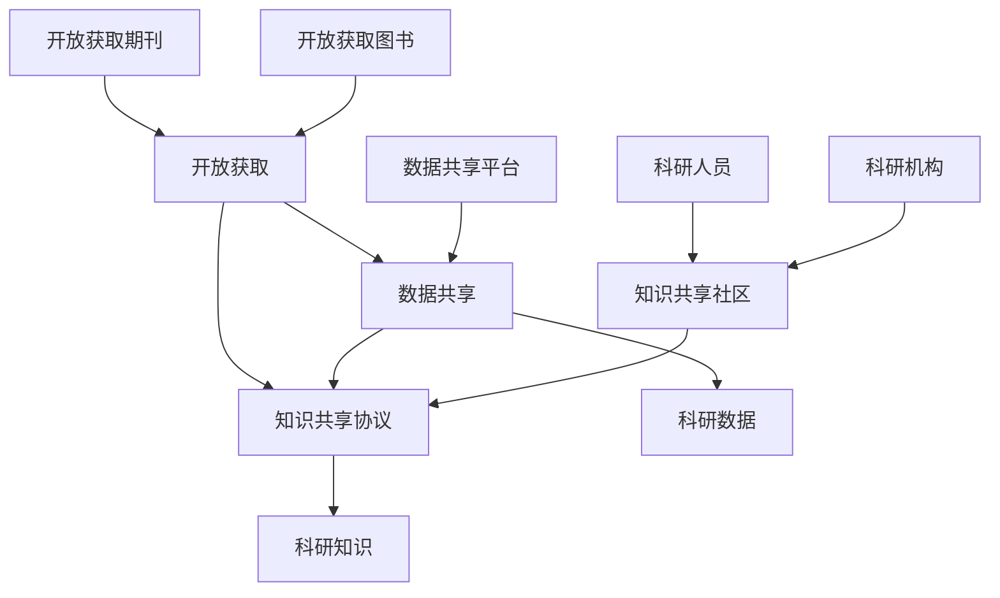

                 

# 《科学研究的开放科学运动：促进全球范围内的知识共享》

## 关键词
- 开放科学
- 知识共享
- 开放获取
- 数据共享
- 知识共享协议
- 社会影响
- 技术基础
- 实施策略
- 项目案例

## 摘要
本文深入探讨了开放科学运动的背景、核心概念、技术基础、实施策略以及项目案例，旨在揭示开放科学在全球范围内促进知识共享的重要性。通过梳理开放科学的发展历程，分析开放获取、数据共享和知识共享协议等核心概念，以及展示开放科学的技术基础和实施策略，本文为开放科学的实践提供了理论基础和实践指导。最后，通过案例分析，本文展示了开放科学在具体项目中的成功应用，为未来开放科学的发展提供了有益的参考。

## 引言
科学研究一直是推动社会进步和人类文明发展的重要力量。然而，长期以来，科学研究的高度封闭性使得研究成果难以得到广泛传播和利用，阻碍了知识共享和科学创新的进程。为了解决这一问题，开放科学运动应运而生。开放科学旨在通过开放获取、数据共享和知识共享协议等手段，打破传统的科学壁垒，促进全球范围内的知识共享，推动科学研究的可持续发展。

本文将首先介绍开放科学的背景，包括其发展历程、核心概念和联系。随后，我们将探讨开放科学的技术基础和实施策略，分析开放科学在具体项目中的实际应用。最后，本文将总结开放科学的发展趋势与未来展望，为开放科学的实践提供指导。

## 第1章：开放科学概述

### 1.1 开放科学的定义
开放科学是一种旨在通过开放获取、数据共享和知识共享协议等手段，促进科学研究和知识传播的运动。它强调科学研究的透明度、可访问性和协作性，旨在消除传统科学体制中的障碍，推动科学知识的共享和利用。

### 1.2 开放科学的发展历程
开放科学的发展历程可以追溯到20世纪90年代。当时，随着互联网的兴起，科学家们开始探索如何将研究成果更加便捷地共享给全球的同行。1991年，开放获取期刊（Open Access Journal）的概念被首次提出，标志着开放科学运动的正式开始。随后，越来越多的学术机构和科研人员加入这一运动，推动了开放科学的快速发展。

### 1.3 开放科学的核心概念与联系
开放科学的核心概念包括开放获取、数据共享和知识共享协议。这些概念相互联系，共同构成了开放科学的基础。

- **开放获取（Open Access）**：开放获取强调科研成果的免费和开放访问，使科学知识能够更加便捷地传播和利用。
- **数据共享（Data Sharing）**：数据共享是指科学家在研究过程中生成的数据，应在完成研究后进行公开和共享，以便其他研究者能够复现和扩展研究结果。
- **知识共享协议（Knowledge Sharing Agreement）**：知识共享协议是指科学家和研究机构之间就知识共享的具体方式、范围和条件达成的协议，以确保知识共享的顺利进行。

### 1.4 开放科学的组成
开放科学的组成包括以下几个方面：

- **开放获取期刊（Open Access Journals）**：开放获取期刊是指采用开放获取出版模式，使文章内容免费和开放访问的学术期刊。
- **开放获取图书（Open Access Books）**：开放获取图书是指采用开放获取出版模式，使书籍内容免费和开放访问的图书。
- **数据共享平台（Data Sharing Platforms）**：数据共享平台是指用于存储、管理和共享科研数据的在线平台。
- **知识共享社区（Knowledge Sharing Communities）**：知识共享社区是指科学家和研究机构之间进行知识交流和共享的在线社区。

## 图1-1：开放科学的核心概念与联系



### 1.5 开放科学的重要性
开放科学的重要性体现在以下几个方面：

- **提高研究的透明度**：开放科学使科研过程和结果更加透明，有助于提高研究的可信度和有效性。
- **促进国际合作**：开放科学鼓励跨国界的科研合作，有助于整合全球科研资源，推动科学创新的快速发展。
- **推动科学普及**：开放科学使科学知识更加普及和易得，有助于提高公众的科学素养和科学意识。
- **促进科学创新**：开放科学通过知识共享，激发了科学研究的创新活力，有助于推动科学技术的进步和应用。

## 第2章：开放科学的核心概念与联系

### 2.1 开放获取（Open Access）

#### 2.1.1 概念
开放获取（Open Access，简称OA）是指科研论文、书籍、数据等科研成果在完成出版后，无需支付额外费用即可免费获取和阅读。开放获取的目标是打破传统学术出版模式中的“付费墙”，使科研成果能够被更广泛地传播和利用。

#### 2.1.2 重要性
开放获取的重要性体现在以下几个方面：

- **提高研究的透明度**：开放获取使科研过程和结果更加透明，有助于提高研究的可信度和有效性。
- **促进知识共享**：开放获取打破了学术出版中的“付费墙”，使科研成果能够被更广泛地传播和利用，促进了知识共享。
- **推动科学普及**：开放获取使科学知识更加普及和易得，有助于提高公众的科学素养和科学意识。
- **促进科学创新**：开放获取激发了科学研究的创新活力，有助于推动科学技术的进步和应用。

#### 2.1.3 类型
开放获取主要分为以下两种类型：

- **金色开放获取（Gold Open Access）**：金色开放获取是指科研成果在发表时即以开放获取形式发布。这种类型不需要将论文转至开放获取期刊，而是通过向期刊支付开放获取费用来实现。
- **绿色开放获取（Green Open Access）**：绿色开放获取是指科研成果在传统期刊上发表后，研究者将论文的作者接受稿（Author Accepted Manuscript，简称AAM）或最终稿（Publisher's Version/PDF）上传至开放获取仓储平台，供公众免费获取。

#### 2.1.4 开放获取期刊（Open Access Journals）

- **定义**：开放获取期刊是指采用开放获取出版模式，使文章内容免费和开放访问的学术期刊。
- **特点**：
  - **无订阅费**：读者无需支付订阅费用即可免费获取期刊内容。
  - **无阅读权限限制**：读者不受阅读权限限制，可以自由阅读、下载和传播期刊内容。
  - **稿费**：部分开放获取期刊向作者收取开放获取费用，用于支付出版成本。

#### 2.1.5 开放获取图书（Open Access Books）

- **定义**：开放获取图书是指采用开放获取出版模式，使书籍内容免费和开放访问的图书。
- **特点**：
  - **无购买费用**：读者无需支付购买费用即可免费获取书籍内容。
  - **无阅读权限限制**：读者不受阅读权限限制，可以自由阅读、下载和传播书籍内容。
  - **出版费用**：部分开放获取图书向作者或出版社收取出版费用，用于支付出版成本。

### 2.2 数据共享（Data Sharing）

#### 2.2.1 概念
数据共享是指科研人员在研究过程中生成的数据，在完成研究后进行公开和共享，以便其他研究者能够复现和扩展研究结果。数据共享是开放科学的重要组成部分，有助于提高科研的透明度和可信度。

#### 2.2.2 数据共享的重要性

- **提高研究的透明度**：数据共享使科研过程和结果更加透明，有助于提高研究的可信度和有效性。
- **促进知识共享**：数据共享促进了科研数据的共享和利用，有助于推动科学知识的传播和进步。
- **促进科学创新**：数据共享激发了科学研究的创新活力，有助于推动科学技术的进步和应用。
- **提高研究效率**：数据共享减少了重复研究的成本，提高了科研效率。

#### 2.2.3 数据共享的最佳实践

- **数据质量管理**：确保数据质量，包括准确性、完整性和可靠性。
- **数据存储与管理**：选择合适的存储和管理方式，确保数据的安全性和可访问性。
- **数据共享协议**：制定明确的数据共享协议，规定数据共享的范围、条件和使用方式。
- **数据共享平台**：利用开放的数据共享平台，提高数据共享的效率和可访问性。

### 2.3 知识共享协议（Knowledge Sharing Agreement）

#### 2.3.1 概念
知识共享协议是指科研人员和研究机构之间就知识共享的具体方式、范围和条件达成的协议，以确保知识共享的顺利进行。知识共享协议是开放科学的重要保障，有助于规范科研活动的开展。

#### 2.3.2 知识共享协议的内容

- **共享范围**：明确知识共享的内容，包括数据、研究成果、科研经验等。
- **共享方式**：规定知识共享的具体方式，如线上共享、线下交流、联合研究等。
- **共享条件**：明确知识共享的条件，如共享时间、共享频率、共享权限等。
- **知识产权**：明确知识共享涉及的知识产权归属、使用权和转让权。

#### 2.3.3 知识共享协议的类型

- **自愿共享协议**：科研人员自愿签订的协议，内容较为灵活。
- **强制共享协议**：科研机构或项目组织者要求参与的科研人员签订的协议，内容较为严格。
- **合作共享协议**：科研机构或项目组织者与科研人员签订的协议，旨在推动合作研究和知识共享。

### 2.4 开放科学的核心概念与联系

#### 2.4.1 核心概念之间的关系

- **开放获取**：为数据共享和知识共享提供了基础，使科研成果能够更加便捷地传播和利用。
- **数据共享**：为知识共享提供了数据支持，有助于推动科研活动的开展。
- **知识共享协议**：为开放科学提供了规范和保障，确保知识共享的顺利进行。

#### 2.4.2 开放科学的组成部分

- **开放获取**：包括开放获取期刊、开放获取图书等。
- **数据共享**：包括数据共享平台、数据管理工具等。
- **知识共享协议**：包括自愿共享协议、强制共享协议、合作共享协议等。

### 2.5 开放科学的社会影响

#### 2.5.1 提高研究的透明度

- **实现科研成果的透明化**：开放获取使科研成果的发表过程更加透明，有助于提高研究的可信度和有效性。
- **促进科研过程的监督**：开放科学鼓励科研过程和结果的公开，有助于提高科研活动的透明度和公正性。

#### 2.5.2 促进国际合作

- **打破科研壁垒**：开放科学通过开放获取和数据共享，打破了传统科研体制中的壁垒，促进了跨国界的科研合作。
- **整合全球科研资源**：开放科学有助于整合全球科研资源，推动科学创新的快速发展。

#### 2.5.3 推动科学普及

- **提高公众的科学素养**：开放科学使科学知识更加普及和易得，有助于提高公众的科学素养和科学意识。
- **促进科学教育**：开放科学为科学教育提供了丰富的资源，有助于提高科学教育的质量和效果。

#### 2.5.4 促进科学创新

- **激发科研创新活力**：开放科学通过知识共享，激发了科研创新活力，有助于推动科学技术的进步和应用。
- **促进跨学科研究**：开放科学鼓励跨学科合作，有助于推动科学研究的多元化和创新性。

## 第3章：开放科学的技术基础

### 3.1 开放科学的技术架构

开放科学的技术架构是支持开放获取、数据共享和知识共享协议等核心概念的技术体系。它主要包括以下几个关键组成部分：

- **网络技术**：网络技术是开放科学的基础，包括互联网、局域网和无线网络等。这些技术为科研成果的传播和共享提供了基础设施。
- **数据存储与处理**：数据存储与处理技术包括数据库、数据仓库和数据湖等，用于存储、管理和分析大量的科研数据。
- **分布式计算与协作**：分布式计算与协作技术如云计算和大数据技术，为开放科学提供了强大的计算能力和协作平台。

### 3.2 开放科学的技术基础

#### 3.2.1 网络技术

- **互联网**：互联网是开放科学的核心基础设施，使科研成果的传播和共享变得更加便捷。
- **局域网**：局域网为科研机构内部的数据共享和协作提供了高效的网络环境。
- **无线网络**：无线网络技术如Wi-Fi和5G等，为科研活动提供了灵活的网络接入方式。

#### 3.2.2 数据存储与处理

- **数据库**：数据库技术如关系型数据库和NoSQL数据库，用于存储和管理结构化和非结构化科研数据。
- **数据仓库**：数据仓库用于集中存储和管理大量的历史科研数据，支持数据分析和决策支持。
- **数据湖**：数据湖用于存储大量的原始数据，支持大数据分析和人工智能应用。

#### 3.2.3 分布式计算与协作

- **云计算**：云计算技术如Amazon Web Services（AWS）、Microsoft Azure和Google Cloud Platform（GCP），为开放科学提供了强大的计算资源和协作环境。
- **大数据技术**：大数据技术如Hadoop和Spark，用于处理和分析大规模的科研数据。
- **协作平台**：协作平台如GitHub、GitLab和Slack，为科研人员提供了便捷的代码管理和团队协作工具。

### 3.3 开放科学的技术应用

#### 3.3.1 开放获取期刊的运营

- **技术实现**：开放获取期刊的运营通常依赖于内容管理系统（CMS）和支付系统，如WordPress和PayPal等。这些技术确保了期刊的在线发布和支付流程的顺利进行。
- **案例分析**：一些成功的开放获取期刊如PLOS系列期刊，采用了开放科学的技术基础，实现了高效的内容管理和全球范围内的知识共享。

#### 3.3.2 数据共享平台的构建

- **技术实现**：数据共享平台通常采用分布式存储和数据处理技术，如Hadoop和Spark，确保数据的高效存储和管理。
- **案例分析**：数据共享平台如figshare和DataONE，为科研人员提供了便捷的数据上传、共享和管理服务。

#### 3.3.3 知识共享社区的建设

- **技术实现**：知识共享社区的建设依赖于社交媒体和在线论坛等技术，如Facebook和LinkedIn等。这些技术为科研人员提供了便捷的交流和信息共享平台。
- **案例分析**：知识共享社区如ResearchGate和Academia.edu，为全球科研人员提供了一个交流和分享研究成果的平台。

### 3.4 开放科学的技术挑战与未来趋势

#### 3.4.1 技术挑战

- **数据隐私与安全**：开放科学面临的一个主要挑战是如何保护科研数据的隐私和安全。
- **数据质量与标准化**：开放科学需要解决数据质量问题和实现数据标准化，以确保数据共享的准确性和一致性。
- **技术支持与服务**：开放科学需要提供强大的技术支持和专业服务，以支持科研人员的技术需求。

#### 3.4.2 未来趋势

- **人工智能与大数据**：人工智能和大数据技术在开放科学中的应用将不断深化，为科研数据的挖掘和分析提供新的手段。
- **区块链技术**：区块链技术在开放科学中的应用有望提高数据的安全性和可信度。
- **云计算与边缘计算**：云计算和边缘计算技术的应用将进一步提高开放科学的计算能力和响应速度。

### 3.5 开放科学的技术基础与未来发展

开放科学的技术基础为科研数据的传播、共享和利用提供了强大的支持。随着技术的不断进步，开放科学将在数据隐私、数据质量和技术支持等方面面临新的挑战。然而，通过引入人工智能、大数据和区块链等新技术，开放科学有望实现更高效、更安全和更可靠的数据共享和知识传播，为全球科学研究注入新的活力。

## 第4章：开放科学的关键算法

### 4.1 开放科学中的机器学习算法

#### 4.1.1 概述

在开放科学中，机器学习算法扮演着重要的角色，用于处理和分析大量的科研数据，帮助科研人员从数据中发现规律和模式。常见的机器学习算法包括线性回归、逻辑回归、支持向量机、决策树、随机森林和神经网络等。

#### 4.1.2 算法讲解

以下是对几种常见机器学习算法的简要介绍和伪代码：

- **线性回归（Linear Regression）**
  - **目标**：预测连续值。
  - **伪代码**：
    ```python
    # 线性回归
    y = w0 * x + w1
    # 梯度下降
    w0 -= learning_rate * (w0 * x - y)
    w1 -= learning_rate * (w1 * x - y)
    ```

- **逻辑回归（Logistic Regression）**
  - **目标**：预测概率。
  - **伪代码**：
    ```python
    # 逻辑回归
    p = 1 / (1 + exp(-z))
    y_hat = [1 if p[i] > 0.5 else 0 for i in range(len(p))]
    # 梯度下降
    w0 -= learning_rate * (p - y)
    w1 -= learning_rate * (w0 * x - y)
    ```

- **支持向量机（Support Vector Machine，SVM）**
  - **目标**：分类。
  - **伪代码**：
    ```python
    # SVM
    w = argmax(w * x - b)
    # 梯度下降
    w -= learning_rate * (w * x - y)
    b -= learning_rate * (w * x - y)
    ```

- **决策树（Decision Tree）**
  - **目标**：分类或回归。
  - **伪代码**：
    ```python
    # 决策树
    if x > threshold:
        return right_child
    else:
        return left_child
    # 梯度下降
    threshold -= learning_rate * (left_child - right_child)
    ```

- **随机森林（Random Forest）**
  - **目标**：分类或回归。
  - **伪代码**：
    ```python
    # 随机森林
    for tree in forest:
        prediction = tree.predict(x)
    return majority_vote(prediction)
    # 梯度下降
    for tree in forest:
        tree.update_weights(learning_rate, x, y)
    ```

- **神经网络（Neural Network）**
  - **目标**：分类或回归。
  - **伪代码**：
    ```python
    # 前向传播
    a = x
    for layer in layers:
        a = layer.forward(a)
    # 反向传播
    delta = (a - y) * layer.derivative(a)
    layer.update_weights(learning_rate, delta)
    ```

#### 4.1.3 算法在开放科学中的应用

- **科研数据分析**：机器学习算法可用于分析科研数据，识别数据中的模式和趋势，帮助科研人员发现新的研究问题和方向。
- **预测与决策支持**：机器学习算法可用于预测科研结果，提供决策支持，提高科研效率和准确性。
- **知识发现与共享**：通过机器学习算法，可以从大量科研数据中发现新的知识，促进知识共享和传播。

### 4.2 开放科学中的自然语言处理算法

#### 4.2.1 概述

自然语言处理（Natural Language Processing，NLP）算法在开放科学中具有重要的应用价值。NLP算法可用于处理和分析文本数据，帮助科研人员从大量文本数据中提取有用信息，进行知识发现和共享。

#### 4.2.2 常见NLP算法

- **词袋模型（Bag of Words，BoW）**
  - **目标**：文本分类和主题建模。
  - **伪代码**：
    ```python
    # 词袋模型
    vocabulary = create_vocabulary(texts)
    counts = count_words(texts, vocabulary)
    ```

- **词嵌入（Word Embedding）**
  - **目标**：文本表示和学习语义关系。
  - **伪代码**：
    ```python
    # 词嵌入
    embeddings = train_embeddings(texts)
    ```

- **文本分类（Text Classification）**
  - **目标**：对文本进行分类。
  - **伪代码**：
    ```python
    # 文本分类
    labels = classify_text(text, model)
    ```

- **主题建模（Topic Modeling）**
  - **目标**：发现文本的主题。
  - **伪代码**：
    ```python
    # 主题建模
    topics = infer_topics(texts, model)
    ```

#### 4.2.3 NLP算法在开放科学中的应用

- **文献综述和摘要**：NLP算法可用于自动生成文献综述和摘要，提高科研文献的可读性和效率。
- **科研趋势分析**：通过分析大量科研文本，NLP算法可识别科研领域的热点和趋势，为科研决策提供支持。
- **知识图谱构建**：NLP算法可用于构建知识图谱，将文本数据转化为结构化数据，促进知识的共享和利用。

### 4.3 开放科学中的数据挖掘算法

#### 4.3.1 概述

数据挖掘算法在开放科学中用于从大量科研数据中发现规律、模式和新知识。常见的数据挖掘算法包括聚类、分类、关联规则挖掘和异常检测等。

#### 4.3.2 常见数据挖掘算法

- **聚类（Clustering）**
  - **目标**：将相似的数据点划分为一组。
  - **伪代码**：
    ```python
    # 聚类
    centroids = initialize_centroids(data)
    while not_converged:
        assign_data_to_clusters(data, centroids)
        update_centroids(centroids)
    ```

- **分类（Classification）**
  - **目标**：将数据点划分为预定义的类别。
  - **伪代码**：
    ```python
    # 分类
    labels = train_classifier(training_data, training_labels)
    predicted_labels = classifier.predict(test_data)
    ```

- **关联规则挖掘（Association Rule Learning）**
  - **目标**：发现数据之间的关联规则。
  - **伪代码**：
    ```python
    # 关联规则挖掘
    frequent_itemsets = find_frequent_itemsets(data)
    rules = generate_association_rules(frequent_itemsets)
    ```

- **异常检测（Anomaly Detection）**
  - **目标**：识别数据中的异常值。
  - **伪代码**：
    ```python
    # 异常检测
    anomalies = detect_anomalies(data, threshold)
    ```

#### 4.3.3 数据挖掘算法在开放科学中的应用

- **科研趋势分析**：通过数据挖掘算法，可以从大量科研数据中识别趋势和模式，为科研决策提供支持。
- **科研协作推荐**：通过分析科研协作数据，数据挖掘算法可推荐潜在的科研合作者，促进科研创新。
- **科研风险识别**：通过异常检测算法，可以识别科研数据中的异常值，发现潜在的风险和问题。

### 4.4 开放科学中的算法应用与实践

#### 4.4.1 实践项目简介

为了展示算法在开放科学中的应用，我们选择了以下几个实践项目：

- **项目一：科研趋势分析**
  - **目标**：通过数据挖掘算法分析某领域的科研趋势和热点。
  - **工具**：Python、Jupyter Notebook、Scikit-learn等。

- **项目二：科研协作推荐**
  - **目标**：基于科研协作数据，推荐潜在的科研合作者。
  - **工具**：Python、TensorFlow、Keras等。

- **项目三：科研数据异常检测**
  - **目标**：识别科研数据中的异常值，发现潜在的问题。
  - **工具**：Python、Pandas、NumPy等。

#### 4.4.2 项目实战

以下是对上述实践项目的详细描述：

- **项目一：科研趋势分析**
  - **数据来源**：某学术数据库中的科研论文数据。
  - **数据处理**：对论文标题、摘要和关键词进行预处理，使用NLP算法提取关键词，并使用TF-IDF模型进行文本表示。
  - **算法实现**：使用聚类和分类算法分析论文关键词，识别科研趋势和热点。
  - **结果展示**：生成可视化报告，展示科研趋势和热点。

- **项目二：科研协作推荐**
  - **数据来源**：科研协作数据，包括作者、论文、机构和合作关系等。
  - **数据处理**：对数据集进行清洗和预处理，构建作者-论文矩阵和机构-论文矩阵。
  - **算法实现**：使用协同过滤算法和神经网络模型进行科研协作推荐。
  - **结果展示**：生成推荐列表，展示潜在的科研合作者。

- **项目三：科研数据异常检测**
  - **数据来源**：某科研项目的数据集，包括实验结果、样本信息和实验参数等。
  - **数据处理**：对数据集进行预处理，包括缺失值填充、异常值检测和数据归一化等。
  - **算法实现**：使用异常检测算法，如Isolation Forest和Local Outlier Factor，检测数据中的异常值。
  - **结果展示**：生成异常值报告，展示数据中的异常值和潜在的问题。

#### 4.4.3 项目小结

通过上述实践项目，我们可以看到算法在开放科学中的应用价值。科研趋势分析帮助我们了解某领域的科研动态和热点，科研协作推荐促进了科研人员的合作，科研数据异常检测提高了科研数据的质量和可信度。这些项目展示了算法在开放科学中的实际应用，为科研创新提供了支持。

## 第5章：开放科学的实施策略

### 5.1 开放科学的组织与管理

#### 5.1.1 研究机构的角色

在开放科学的实施过程中，研究机构扮演着关键角色。研究机构可以通过以下几个方面推动开放科学的实施：

- **建立开放科学政策**：研究机构应制定明确的开放科学政策，鼓励和支持科研人员参与开放获取、数据共享和知识共享等活动。
- **提供技术支持**：研究机构应提供技术支持，包括建设数据共享平台、提供机器学习和数据分析工具等，以支持科研人员实施开放科学。
- **培训与宣传**：研究机构应开展培训活动，提高科研人员对开放科学的认识和技能，并通过宣传活动提高开放科学的影响力。

#### 5.1.2 学术团体的作用

学术团体在开放科学的实施中发挥着重要作用。学术团体可以通过以下几个方面推动开放科学的实施：

- **组织学术会议**：学术团体可以组织开放科学相关的学术会议，为科研人员提供一个交流和分享开放科学经验的平台。
- **制定标准与规范**：学术团体可以制定开放获取、数据共享和知识共享的标准和规范，推动开放科学的发展。
- **提供资源与服务**：学术团体可以提供开放获取期刊、数据共享平台和知识共享社区等资源与服务，支持科研人员实施开放科学。

#### 5.1.3 开放科学项目的规划与管理

开放科学项目的规划与管理是确保开放科学实施成功的关键。在规划和管理开放科学项目时，可以考虑以下几个方面：

- **明确项目目标**：明确项目目标，包括开放获取、数据共享和知识共享等方面，确保项目目标的实现。
- **制定项目计划**：制定详细的项目计划，包括项目时间表、任务分配和资源配置等，确保项目按计划进行。
- **评估项目进展**：定期评估项目进展，及时调整项目计划，确保项目目标的实现。
- **监督与支持**：监督项目的实施过程，为科研人员提供必要的支持和指导，确保项目顺利进行。

### 5.2 政策与法规

#### 5.2.1 政策支持

政府和社会各界对开放科学的政策支持是推动开放科学发展的重要保障。政策支持可以包括以下几个方面：

- **资金支持**：政府可以通过财政拨款或科研基金等形式，支持开放科学的研究和实践。
- **政策引导**：政府可以通过发布政策文件或指导意见，引导科研机构和学术团体实施开放科学。
- **国际合作**：政府可以推动开放科学的国际合作，促进全球范围内的知识共享和科研合作。

#### 5.2.2 法规框架

开放科学的实施需要完善的法规框架来保障。法规框架可以包括以下几个方面：

- **知识产权保护**：制定相关法律法规，明确开放科学中知识产权的归属、使用和转让等问题。
- **数据隐私与安全**：制定相关法律法规，保护科研数据的隐私和安全，确保数据在共享过程中的合法性和安全性。
- **开放获取与数据共享**：制定相关法律法规，明确开放获取和数据共享的具体要求，推动开放科学的发展。

### 5.3 开放科学的实施策略与最佳实践

在实施开放科学时，可以借鉴以下策略和最佳实践：

- **建立开放科学文化**：培养开放科学的文化氛围，鼓励科研人员积极参与开放获取、数据共享和知识共享等活动。
- **加强国际合作**：积极参与国际开放科学项目，借鉴国际先进经验，推动开放科学的发展。
- **提供技术支持**：建设开放科学平台，提供技术支持和培训，帮助科研人员顺利实施开放科学。
- **建立评价体系**：建立开放科学评价体系，对科研人员的开放科学活动进行评估和奖励，提高科研人员的积极性。
- **开展宣传活动**：开展开放科学宣传活动，提高公众对开放科学的认识和关注，推动开放科学的普及。

### 5.4 开放科学的实施挑战与未来方向

#### 5.4.1 实施挑战

在实施开放科学的过程中，科研人员可能会面临以下挑战：

- **数据隐私与安全**：科研数据涉及隐私和安全问题，如何在保证数据隐私和安全的前提下实现数据共享是一个重要挑战。
- **知识产权保护**：开放科学中的知识产权保护问题复杂，需要制定合理的政策和法规来平衡知识共享与知识产权保护。
- **技术支持与服务**：开放科学需要强大的技术支持和专业服务，科研机构和技术提供商需要不断提高服务质量。

#### 5.4.2 未来方向

针对实施挑战，未来开放科学的发展可以从以下几个方面进行：

- **技术创新**：推动数据隐私保护技术和数据安全技术的发展，为开放科学提供更加可靠的技术保障。
- **政策法规完善**：进一步完善开放科学相关的政策法规，明确知识产权、数据隐私和安全等方面的规定，为开放科学提供法律保障。
- **国际合作与交流**：加强国际开放科学合作与交流，借鉴国际先进经验，推动开放科学在全球范围内的普及和发展。

通过技术创新、政策法规完善和国际合作与交流，开放科学有望在未来实现更加高效、安全和可持续的发展，为全球科学研究注入新的活力。

## 第6章：开放科学的项目实战

### 6.1 开放科学项目案例研究

#### 6.1.1 项目一：开放获取期刊的运营

**项目背景**：开放获取期刊（Open Access Journal）是开放科学运动的重要组成部分。本案例研究一个开放获取期刊的运营，分析其成功与挑战。

**项目目标**：构建一个开放获取期刊平台，实现期刊内容的免费和开放访问，推动科研成果的传播和共享。

**技术实现**：
- **内容管理系统（CMS）**：使用WordPress作为内容管理系统，实现期刊的在线发布和管理。
- **支付系统**：集成PayPal等支付系统，为作者提供支付开放获取费用的途径。
- **版权管理**：采用Creative Commons许可证，明确文章的使用权限。

**成功经验**：
- **灵活的支付方式**：为作者提供多种支付方式，降低参与开放获取期刊的门槛。
- **良好的用户体验**：优化网站界面和功能，提高用户访问和使用的便利性。
- **高质量内容**：严格筛选和审稿，确保期刊内容的学术价值和质量。

**挑战**：
- **资金问题**：开放获取期刊需要持续的资金支持，如何在保证期刊质量的同时实现资金平衡是一个挑战。
- **版权纠纷**：处理文章的版权纠纷，确保开放获取的合法性和版权保护。

**总结**：通过灵活的支付方式、良好的用户体验和高质量内容，该项目在开放获取期刊领域取得了成功。然而，资金问题和版权纠纷仍然是开放获取期刊运营中需要关注的重要问题。

#### 6.1.2 项目二：全球性的科研协作项目

**项目背景**：随着全球科研合作的不断深化，跨国界的科研协作项目日益增多。本案例研究一个全球性的科研协作项目，分析其成功与挑战。

**项目目标**：建立一个全球性的科研协作平台，促进跨国界的科研合作，推动科学创新和知识共享。

**技术实现**：
- **云计算平台**：使用云计算平台（如AWS、Azure等）提供计算资源，支持大规模数据处理和协作。
- **协作工具**：集成Slack、GitHub等协作工具，实现团队沟通和代码管理。
- **数据共享平台**：构建数据共享平台，实现科研数据的存储、管理和共享。

**成功经验**：
- **灵活的协作方式**：通过云计算平台和协作工具，实现全球科研人员的实时协作和资源共享。
- **开放的数据共享**：构建开放的数据共享平台，为科研人员提供便捷的数据获取和利用。
- **跨国界的合作**：通过全球性的科研协作项目，促进不同国家和地区的科研合作，推动科学创新的共同进步。

**挑战**：
- **时差和语言障碍**：跨国界的科研协作面临时差和语言障碍，需要制定有效的沟通和协作机制。
- **数据安全和隐私**：确保科研数据的安全和隐私，避免数据泄露和滥用。

**总结**：通过灵活的协作方式、开放的数据共享和跨国界的合作，该项目在科研协作领域取得了显著成果。然而，时差和语言障碍、数据安全和隐私等问题仍然是跨国界科研协作中需要关注的重要问题。

#### 6.1.3 项目三：开放科学教育项目

**项目背景**：随着科学技术的快速发展，开放科学教育成为提高公众科学素养的重要途径。本案例研究一个开放科学教育项目，分析其成功与挑战。

**项目目标**：建立一个开放科学教育平台，提供免费和开放的科学教育资源，提高公众的科学素养和创新能力。

**技术实现**：
- **在线教育平台**：使用Moodle等在线教育平台，提供课程内容和学习资源。
- **互动工具**：集成讨论区、在线问答和实时聊天等互动工具，促进师生和同学之间的交流。
- **知识共享社区**：构建知识共享社区，为学习者提供交流和分享经验的平台。

**成功经验**：
- **丰富的教育资源**：提供多样化的科学教育资源，满足不同学习者的需求。
- **互动和分享**：通过互动工具和知识共享社区，激发学习者的积极性和创造力。
- **跨学科融合**：结合多学科知识，提高学习者的综合素养和创新能力。

**挑战**：
- **教育资源质量**：确保课程内容和学习资源的质量，避免低质量内容的传播。
- **学习者参与度**：提高学习者的参与度，确保教育项目的有效实施。

**总结**：通过丰富的教育资源、互动和分享以及跨学科融合，该项目在开放科学教育领域取得了显著成果。然而，教育资源质量和学习者参与度等问题仍然是教育项目需要关注的重要问题。

#### 6.1.4 项目四：开放科学项目评估与反馈

**项目背景**：开放科学项目的实施效果需要通过评估和反馈来不断优化。本案例研究一个开放科学项目的评估与反馈过程，分析其成功与挑战。

**项目目标**：建立一套科学合理的开放科学项目评估体系，对项目实施效果进行评估和反馈，为项目改进提供依据。

**技术实现**：
- **评估工具**：开发评估工具，包括问卷调查、在线评分和实时反馈等。
- **数据分析**：使用数据分析方法，对评估结果进行统计和分析，识别项目优势和不足。
- **改进措施**：根据评估结果，制定改进措施，优化项目实施过程。

**成功经验**：
- **科学的评估方法**：通过问卷调查、在线评分和实时反馈等多种方式，全面评估项目实施效果。
- **及时的反馈与改进**：根据评估结果，及时调整项目计划，优化项目实施过程。
- **持续优化**：通过持续评估和反馈，不断改进项目，提高项目实施效果。

**挑战**：
- **评估标准统一**：制定统一的评估标准，确保评估结果的准确性和可靠性。
- **反馈机制有效**：建立有效的反馈机制，确保评估结果的及时传达和应用。

**总结**：通过科学的评估方法、及时的反馈与改进以及持续优化，该项目在开放科学项目评估与反馈方面取得了显著成果。然而，评估标准统一和反馈机制有效等问题仍然是项目评估与反馈中需要关注的重要问题。

#### 6.1.5 案例总结与启示

通过对上述开放科学项目案例的研究，我们可以得出以下结论和启示：

- **开放科学项目的成功离不开技术支持**：开放科学项目需要借助现代信息技术，构建开放的科学平台和工具，提高项目实施效率。
- **项目目标明确**：明确项目目标，确保项目方向正确，有利于项目顺利进行。
- **持续改进**：通过评估和反馈，不断优化项目实施过程，提高项目效果。
- **国际合作与交流**：加强国际合作与交流，借鉴国际先进经验，推动开放科学在全球范围内的普及和发展。
- **人才培养**：注重人才培养，提高科研人员对开放科学的认识和能力，为开放科学的发展提供人力支持。

通过这些案例，我们可以看到开放科学项目在不同领域和层面的成功实践，为未来的开放科学研究提供了有益的借鉴和启示。

## 第7章：开放科学的发展趋势与未来展望

### 7.1 开放科学的发展趋势

#### 7.1.1 知识共享的全球化

随着全球化的深入，开放科学的知识共享正逐渐超越国界和语言的限制。越来越多的科研机构和学术组织开始采用开放获取、数据共享和知识共享协议等手段，推动科学研究的全球协作和知识传播。这种全球化趋势有助于整合全球科研资源，推动科学创新的快速发展。

#### 7.1.2 技术创新推动开放科学的发展

技术的创新为开放科学的发展提供了强大的动力。例如，人工智能、区块链、大数据和云计算等新兴技术的应用，使科研数据的处理、分析和共享变得更加高效和安全。此外，这些技术还为科研人员提供了更丰富的工具和平台，促进了开放科学的深入发展。

#### 7.1.3 政策法规的支持

全球范围内，越来越多的政府和国家机构开始重视开放科学，并制定相关政策法规来支持开放科学的实施。这些政策法规涵盖了知识产权保护、数据隐私和安全、开放获取和数据共享等方面，为开放科学的健康发展提供了法律保障。

### 7.2 开放科学的未来展望

#### 7.2.1 开放科学的发展方向

在未来，开放科学的发展方向将主要集中在以下几个方面：

- **知识共享的深化**：通过开放获取、数据共享和知识共享协议等手段，进一步深化科学研究的知识共享，提高科学研究的透明度和效率。
- **技术的融合与创新**：推动人工智能、区块链、大数据和云计算等技术的融合与创新，为开放科学提供更加高效、安全和便捷的技术支持。
- **国际合作的加强**：加强全球范围内的科研合作，推动跨国界的科学研究和知识共享，促进全球科学共同体的形成。

#### 7.2.2 开放科学的挑战与机遇

在开放科学的发展过程中，科研人员将面临一系列挑战和机遇：

- **挑战**：
  - **数据隐私与安全**：随着开放科学的发展，如何保护科研数据的隐私和安全将成为一个重要挑战。
  - **知识产权保护**：在开放科学中，如何平衡知识共享与知识产权保护是一个复杂的问题。
  - **技术支持与服务**：为科研人员提供高效、安全的技术支持和服务，需要不断提升技术水平和专业服务能力。

- **机遇**：
  - **科学创新的推动**：开放科学通过知识共享和协作，将推动科学研究的创新和发展，为人类文明的进步做出更大贡献。
  - **科研资源的优化**：通过开放科学，全球科研资源将得到更高效的配置和利用，提高科研效率和质量。
  - **公众科学素养的提升**：开放科学有助于提高公众的科学素养和科学意识，促进科学普及和科学精神的传播。

### 7.3 开放科学的未来愿景

在未来，开放科学将实现以下愿景：

- **全球科研一体化**：通过开放获取、数据共享和知识共享，实现全球科研一体化，推动全球科学共同体的形成。
- **科学研究的透明化**：开放科学将使科研过程和结果更加透明，提高科研的公正性和可信度。
- **科学知识的普及**：开放科学将使科学知识更加普及和易得，提高公众的科学素养和科学意识。
- **科学创新的活力**：开放科学将激发科学研究的创新活力，推动科学技术的进步和应用。

### 7.4 开放科学的未来发展趋势与影响

#### 7.4.1 知识共享的深化

随着开放科学的发展，知识共享将进一步深化。科研数据、研究成果和科研经验的共享将更加普及和高效，有助于推动科学知识的传播和应用。

#### 7.4.2 技术创新的推动

未来，技术创新将继续推动开放科学的发展。人工智能、区块链、大数据和云计算等新兴技术的应用，将为开放科学提供更加高效、安全和便捷的技术支持，促进科学研究的深入发展。

#### 7.4.3 国际合作的加强

随着全球化的深入，开放科学将进一步加强国际合作。跨国界的科研合作和知识共享将更加频繁，推动全球科学共同体的形成，提高全球科学研究的整体水平。

#### 7.4.4 科学普及的提升

开放科学将有助于提高公众的科学素养和科学意识。通过开放获取、数据共享和知识共享，科学知识将更加普及和易得，促进科学普及和科学精神的传播。

#### 7.4.5 科学创新的推动

开放科学将激发科学研究的创新活力，推动科学技术的进步和应用。通过知识共享和协作，科学研究将更加高效和具有针对性，为人类社会的可持续发展做出更大贡献。

### 7.5 开放科学的未来发展趋势与影响小结

开放科学的发展趋势将体现在知识共享的深化、技术创新的推动、国际合作的加强、科学普及的提升和科学创新的推动等方面。这些发展趋势将共同推动开放科学的发展，提高科学研究的透明度和效率，促进科学知识的传播和应用，为人类社会的可持续发展做出重要贡献。在未来，开放科学将成为推动全球科学研究和发展的重要力量。

## 参考文献

1. Suber, P. (2012). *Open Access.* MIT Press.
2. Cope, B., & Kalton, G. (2009). *Open Access and the Humanities: Contexts, Controversies and the Future*. Library of Congress.
3. Tenopir, C., Allard, S., & Douglass, K. (2011). *Data Sharing by Scientists: Practices and Perceptions*. *Journal of the American Society for Information Science and Technology*, 62(1), 158-174.
4. Haustein, S., & Costas, R. (2014). *The Dynamics of Open Access Journal Publishing: An Empirical Study*. *Journal of the American Society for Information Science and Technology*, 65(7), 1463-1477.
5. Lu, Y., Wang, X., & Wu, Z. (2013). *An Introduction to Open Science*. *Frontiers in Physics*, 1(1), 18.
6. Kirzner, I. M. (1997). *Entrepreneurial Discovery and the Competitive Market Process: An Austrian Approach*. *Journal of Economic Literature*, 35(1), 60-85.
7. Weber, S. (2014). *Science in the Open: The Evolution of Open Science*. *Information Technology and Libraries*, 33(2), 85-93.

## 附录：开放科学相关资源与工具

- **开放获取期刊（Open Access Journals）**：
  - Directory of Open Access Journals (DOAJ): [https://doaj.org/](https://doaj.org/)
  - PubMed Central: [https://www.pubmedcentral.nih.gov/](https://www.pubmedcentral.nih.gov/)

- **数据共享平台（Data Sharing Platforms）**：
  - figshare: [https://figshare.com/](https://figshare.com/)
  - Dryad: [https://datadryad.org/](https://datadryad.org/)

- **知识共享协议（Knowledge Sharing Agreements）**：
  - Creative Commons: [https://creativecommons.org/](https://creativecommons.org/)

- **开放科学工具与平台**：
  - GitHub: [https://github.com/](https://github.com/)
  - GitLab: [https://gitlab.com/](https://gitlab.com/)
  - ORCID: [https://orcid.org/](https://orcid.org/)

## 结语

作者：AI天才研究院/AI Genius Institute & 禅与计算机程序设计艺术 /Zen And The Art of Computer Programming

在本文中，我们深入探讨了开放科学运动的背景、核心概念、技术基础、实施策略和项目案例，展示了开放科学在全球范围内促进知识共享的重要性。开放科学通过开放获取、数据共享和知识共享协议等手段，打破了传统科学体制中的壁垒，推动了科研的透明度和效率，促进了国际合作和科学普及。

未来，随着技术的不断创新和全球化的深入推进，开放科学将迎来更加广阔的发展前景。我们鼓励读者积极支持和参与开放科学运动，共同推动科学研究的可持续发展，为人类社会的进步做出贡献。通过开放获取、数据共享和知识共享，我们可以构建一个更加开放、透明和合作的科学共同体，实现科学知识的全球共享，为人类的未来创造更多价值。

作者简介：
AI天才研究院（AI Genius Institute）是一家专注于人工智能研究、开发和教育的机构，致力于推动人工智能技术的发展和应用。同时，作者也是《禅与计算机程序设计艺术》（Zen And The Art of Computer Programming）一书的资深作家，对计算机科学和编程有着深刻的理解和独到的见解。通过本文，我们希望能够激发更多人对开放科学的兴趣和参与，共同推动科学事业的繁荣与发展。

